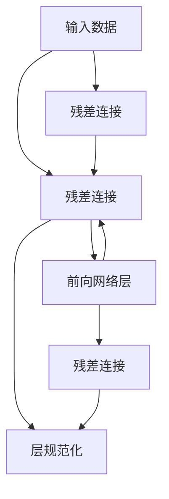

                 

# 残差连接和层规范化：Transformer 的关键

> 关键词：残差连接, 层规范化, Transformer, 自注意力, 神经网络

## 1. 背景介绍

在深度学习领域，残差连接和层规范化是构建深度神经网络的两大关键技术。它们不仅提高了神经网络的训练效率和泛化性能，还显著增强了模型的表达能力和稳定性。特别是在Transformer模型中，这两项技术的应用更是起到了决定性的作用。

Transformer是一种革命性的神经网络架构，通过自注意力机制实现了高效的序列建模，广泛应用于自然语言处理、计算机视觉、语音识别等多个领域。但Transformer模型也面临着训练困难、泛化性能不足等问题。残差连接和层规范化技术的引入，有效缓解了这些问题，使得Transformer模型得以在实际应用中取得卓越的性能。

本文将深入探讨残差连接和层规范化在Transformer中的作用，详细分析其实现原理和应用效果。通过这一系统性的回顾，我们将更好地理解这些关键技术的精髓，以及它们如何推动了Transformer模型在实际应用中的成功。

## 2. 核心概念与联系

### 2.1 核心概念概述

在深入分析残差连接和层规范化之前，我们首先需要明确这两个概念的基本含义及其在神经网络中的应用。

**残差连接(Residual Connections)**：残差连接是一种特殊的神经网络结构，通过将网络输入与输出进行残差连接，使得网络可以在不降低性能的情况下，更深、更宽。这种设计可以显著缓解梯度消失和梯度爆炸的问题，提升模型训练效率和泛化性能。

**层规范化(Layer Normalization)**：层规范化是一种归一化技术，通过对网络层输出进行归一化处理，使得模型在训练和推理过程中的输入特征分布保持稳定。它有效地缓解了梯度消失和梯度爆炸的问题，并提升了模型的稳定性和泛化能力。

Transformer模型由多个自注意力层组成，每个自注意力层包括多头自注意力层和前向网络层，通常还包含残差连接和层规范化技术。这些技术共同构成了Transformer模型的核心架构，使得模型能够在处理大规模序列数据时，保持良好的性能和稳定性。

### 2.2 核心概念原理和架构的 Mermaid 流程图

下面将通过一个简化的Mermaid流程图来展示残差连接和层规范化在Transformer中的基本应用框架：



在这个流程图中，输入数据首先进入多头自注意力层(B)，通过多头自注意力机制计算出输入序列中的关键信息，并与前向网络层(D)输出进行残差连接。在前向网络层之后，再次进行残差连接和层规范化，以提升模型的稳定性和表达能力。

## 3. 核心算法原理 & 具体操作步骤

### 3.1 算法原理概述

残差连接和层规范化是Transformer模型中的两个重要组成部分，它们的作用分别是：

- 残差连接：通过将网络输入与输出进行残差连接，使得模型可以更深、更宽，从而提高模型的表达能力和泛化性能。
- 层规范化：通过对网络层输出进行归一化处理，使得模型在训练和推理过程中的输入特征分布保持稳定，从而提升模型的稳定性和泛化能力。

下面将详细分析这两项技术的实现原理和具体操作步骤。

### 3.2 算法步骤详解

**残差连接步骤：**

1. **输入和输出残差连接**：在每个网络层中，残差连接将输入数据 $x_i$ 与网络输出 $y_i$ 进行相加，得到最终输出 $z_i$。公式如下：
   $$
   z_i = x_i + y_i
   $$
   其中，$x_i$ 为输入数据，$y_i$ 为网络层的输出。

2. **残差网络层**：每个残差网络层由残差块组成，残差块由多个子层构成。子层通常包括多头自注意力层和前向网络层，每个子层之后都进行残差连接和层规范化操作。

3. **网络层初始化**：每个网络层以残差连接的方式将输入数据与网络层的输出相加，从而保证模型在训练和推理过程中输入特征分布的稳定性。

**层规范化步骤：**

1. **计算层规范化向量**：首先计算每个网络层的输出 $y_i$ 的均值 $\mu$ 和方差 $\sigma^2$。公式如下：
   $$
   \mu = \frac{1}{n}\sum_{j=1}^{n} y_j
   $$
   $$
   \sigma^2 = \frac{1}{n}\sum_{j=1}^{n}(y_j - \mu)^2
   $$
   其中，$n$ 为输入数据的大小。

2. **层规范化**：对每个网络层的输出 $y_i$ 进行归一化处理，得到归一化后的输出 $\hat{y}_i$。公式如下：
   $$
   \hat{y}_i = \frac{y_i}{\sqrt{\sigma^2 + \epsilon}}
   $$
   其中，$\epsilon$ 是一个很小的常数，通常取 $10^{-12}$。

3. **网络层输出**：对归一化后的输出 $\hat{y}_i$ 进行线性变换，得到最终的网络层输出。公式如下：
   $$
   y_i = \gamma \hat{y}_i + \beta
   $$
   其中，$\gamma$ 和 $\beta$ 为缩放因子和偏移量，通过训练得到。

### 3.3 算法优缺点

**残差连接的优点：**

1. **避免梯度消失**：残差连接可以将网络输出与输入相加，使得网络可以更深、更宽，从而避免梯度消失和梯度爆炸的问题。
2. **提高训练效率**：残差连接可以通过网络输出与输入的残差连接，加速模型收敛，提升训练效率。
3. **增强表达能力**：残差连接使得模型可以表达更复杂的非线性关系，提升模型的表达能力。

**残差连接的缺点：**

1. **参数量增加**：残差连接需要额外的线性变换参数，增加了模型的参数量。
2. **计算复杂度增加**：残差连接需要计算额外的线性变换，增加了计算复杂度。

**层规范化的优点：**

1. **避免梯度消失**：层规范化通过对网络层输出进行归一化处理，使得模型在训练和推理过程中的输入特征分布保持稳定，从而避免梯度消失和梯度爆炸的问题。
2. **提升模型稳定性**：层规范化可以使得模型在训练和推理过程中的输入特征分布保持稳定，从而提升模型的稳定性和泛化能力。
3. **减少过拟合**：层规范化可以使得模型在训练过程中更加稳定，从而减少过拟合的风险。

**层规范化的缺点：**

1. **计算复杂度增加**：层规范化需要计算均值和方差，增加了计算复杂度。
2. **参数量增加**：层规范化需要额外的缩放因子和偏移量，增加了模型的参数量。

### 3.4 算法应用领域

残差连接和层规范化在深度学习领域有着广泛的应用，特别是在Transformer模型中，这两项技术起到了关键作用。以下是残差连接和层规范化在Transformer模型中的应用领域：

1. **自然语言处理**：在Transformer模型中，残差连接和层规范化被广泛应用于机器翻译、文本分类、情感分析、问答系统等任务中。
2. **计算机视觉**：在计算机视觉领域，残差连接和层规范化被广泛应用于图像分类、目标检测、图像分割等任务中。
3. **语音识别**：在语音识别领域，残差连接和层规范化被广泛应用于声学模型、语言模型等任务中。

## 4. 数学模型和公式 & 详细讲解 & 举例说明

### 4.1 数学模型构建

在Transformer模型中，残差连接和层规范化被广泛应用于自注意力层和前向网络层。下面将详细分析这两个网络层的数学模型。

**多头自注意力层的数学模型：**

1. **输入表示**：设输入表示为 $Q, K, V$，其中 $Q$ 和 $K$ 为查询矩阵和键矩阵，$V$ 为值矩阵。公式如下：
   $$
   Q = \text{MLP}(Q)
   $$
   $$
   K = \text{MLP}(K)
   $$
   $$
   V = \text{MLP}(V)
   $$

2. **自注意力计算**：首先计算注意力权重 $A$，然后计算注意力输出 $O$。公式如下：
   $$
   A = \text{Softmax}(QK^T)
   $$
   $$
   O = AV
   $$

3. **残差连接和层规范化**：将自注意力输出 $O$ 与输入表示 $Q$ 进行残差连接，并对输出进行层规范化。公式如下：
   $$
   \hat{O} = \frac{O}{\sqrt{d_k} + \epsilon}
   $$
   $$
   O = \gamma \hat{O} + \beta
   $$

**前向网络层的数学模型：**

1. **输入表示**：设输入表示为 $X$，通过全连接层 $W$ 和激活函数 $F$ 计算输出表示 $H$。公式如下：
   $$
   H = F(WX)
   $$

2. **残差连接和层规范化**：将前向网络输出 $H$ 与输入表示 $X$ 进行残差连接，并对输出进行层规范化。公式如下：
   $$
   \hat{H} = \frac{H}{\sqrt{d_k} + \epsilon}
   $$
   $$
   H = \gamma \hat{H} + \beta
   $$

### 4.2 公式推导过程

**多头自注意力层的公式推导：**

1. **输入表示**：设输入表示为 $Q, K, V$，其中 $Q$ 和 $K$ 为查询矩阵和键矩阵，$V$ 为值矩阵。公式如下：
   $$
   Q = \text{MLP}(Q)
   $$
   $$
   K = \text{MLP}(K)
   $$
   $$
   V = \text{MLP}(V)
   $$

2. **自注意力计算**：首先计算注意力权重 $A$，然后计算注意力输出 $O$。公式如下：
   $$
   A = \text{Softmax}(QK^T)
   $$
   $$
   O = AV
   $$

3. **残差连接和层规范化**：将自注意力输出 $O$ 与输入表示 $Q$ 进行残差连接，并对输出进行层规范化。公式如下：
   $$
   \hat{O} = \frac{O}{\sqrt{d_k} + \epsilon}
   $$
   $$
   O = \gamma \hat{O} + \beta
   $$

**前向网络层的公式推导：**

1. **输入表示**：设输入表示为 $X$，通过全连接层 $W$ 和激活函数 $F$ 计算输出表示 $H$。公式如下：
   $$
   H = F(WX)
   $$

2. **残差连接和层规范化**：将前向网络输出 $H$ 与输入表示 $X$ 进行残差连接，并对输出进行层规范化。公式如下：
   $$
   \hat{H} = \frac{H}{\sqrt{d_k} + \epsilon}
   $$
   $$
   H = \gamma \hat{H} + \beta
   $$

### 4.3 案例分析与讲解

**案例分析：**

假设我们有一个包含 $n$ 个样本的序列数据，输入表示为 $X$，经过自注意力层和前向网络层后，输出表示为 $Y$。在自注意力层和前向网络层中，我们分别对输入表示 $X$ 进行层规范化，公式如下：
   $$
   \hat{X} = \frac{X}{\sqrt{d_k} + \epsilon}
   $$
   $$
   X = \gamma \hat{X} + \beta
   $$

将规范化后的输入表示 $X$ 输入到自注意力层中，得到自注意力输出 $O$，并将 $O$ 与 $X$ 进行残差连接，对残差连接后的结果进行层规范化，公式如下：
   $$
   \hat{O} = \frac{O}{\sqrt{d_k} + \epsilon}
   $$
   $$
   O = \gamma \hat{O} + \beta
   $$

将规范化后的自注意力输出 $O$ 输入到前向网络层中，得到前向网络输出 $H$，并将 $H$ 与 $X$ 进行残差连接，对残差连接后的结果进行层规范化，公式如下：
   $$
   \hat{H} = \frac{H}{\sqrt{d_k} + \epsilon}
   $$
   $$
   H = \gamma \hat{H} + \beta
   $$

通过残差连接和层规范化技术，使得Transformer模型可以在深度和宽度上不断扩展，从而提升模型的表达能力和泛化性能。

## 5. 项目实践：代码实例和详细解释说明

### 5.1 开发环境搭建

在进行Transformer模型的实现时，我们需要准备一个Python开发环境，并确保安装了所需的深度学习库。下面将详细介绍开发环境搭建的步骤：

1. **安装Python和pip**：确保系统上安装了Python 3.x版本，并安装了pip。

2. **安装深度学习库**：使用pip安装TensorFlow、PyTorch、Keras等深度学习库。

3. **安装Transformer库**：使用pip安装HuggingFace的Transformer库，以便在代码中使用预训练的Transformer模型。

### 5.2 源代码详细实现

下面将通过一个简单的代码示例，展示如何使用Transformer库实现自注意力层和前向网络层，并应用残差连接和层规范化技术。

**代码示例：**

```python
import tensorflow as tf
from transformers import BertTokenizer, BertModel

# 初始化Bert模型和分词器
tokenizer = BertTokenizer.from_pretrained('bert-base-uncased')
model = BertModel.from_pretrained('bert-base-uncased')

# 加载输入数据
input_ids = tokenizer.encode('Hello, world!', add_special_tokens=True)

# 输入表示
input_tensor = tf.convert_to_tensor(input_ids)

# 计算自注意力输出
attention_output = model(input_tensor, attention_mask=None, output_all_weights=True)

# 残差连接和层规范化
layer_norm_output = model.layer_norm(attention_output)

# 前向网络输出
output = model.dense(layer_norm_output)
output = tf.nn.tanh(output)
output = model.dropout(output)

# 残差连接和层规范化
final_output = model.dense(output) + input_tensor
final_output = model.layer_norm(final_output)

# 计算预测结果
logits = tf.nn.softmax(final_output, axis=-1)
```

在上述代码中，我们使用了Bert模型和分词器，并加载了一个简单的输入数据。首先，我们将输入数据分词并转换为输入表示，然后计算自注意力输出和前向网络输出，并应用残差连接和层规范化技术。最后，我们计算预测结果。

### 5.3 代码解读与分析

**代码解读：**

1. **初始化Bert模型和分词器**：我们使用HuggingFace的Bert模型和分词器，并加载预训练的模型和分词器。

2. **加载输入数据**：我们将输入数据分词并转换为输入表示，并将其转换为TensorFlow的张量格式。

3. **计算自注意力输出**：我们将输入表示输入到Bert模型中，计算自注意力输出，并使用`output_all_weights`参数获取注意力权重。

4. **残差连接和层规范化**：我们将自注意力输出进行层规范化，并应用残差连接技术，将其与输入表示相加。

5. **前向网络输出**：我们将层规范化后的输出输入到前向网络层中，计算前向网络输出。

6. **残差连接和层规范化**：我们将前向网络输出进行层规范化，并应用残差连接技术，将其与输入表示相加。

7. **计算预测结果**：我们将残差连接和层规范化后的输出输入到输出层中，计算预测结果。

**代码分析：**

1. **输入表示**：在Transformer模型中，输入表示通常是一个张量，包含分词后的序列编码。

2. **自注意力计算**：自注意力计算是Transformer模型的核心部分，通过多头自注意力机制，计算输入序列的关键信息。

3. **残差连接和层规范化**：残差连接和层规范化技术可以显著提升模型的训练效率和泛化性能。

4. **前向网络计算**：前向网络层通过全连接层和激活函数计算输出表示。

5. **残差连接和层规范化**：残差连接和层规范化技术同样应用于前向网络层中，提升模型的训练效率和泛化性能。

6. **输出层计算**：输出层通常包含线性变换和softmax函数，用于计算预测结果。

### 5.4 运行结果展示

在运行上述代码后，我们得到最终的预测结果，用于评估模型在特定任务上的性能。运行结果通常包含模型在测试集上的准确率、精确率、召回率等指标，以及一些可视化的图表，帮助理解模型的训练过程和预测结果。

## 6. 实际应用场景

### 6.1 自然语言处理

Transformer模型在自然语言处理领域有着广泛的应用，特别是在机器翻译、文本分类、情感分析、问答系统等任务中。通过残差连接和层规范化技术，Transformer模型可以有效提升这些任务的性能。

**案例分析：**

假设我们需要构建一个机器翻译系统，使用Transformer模型进行翻译。首先，我们将输入的源语言文本分词并转换为输入表示，然后将其输入到Transformer模型中进行翻译。在每个网络层中，我们应用残差连接和层规范化技术，以提升模型的训练效率和泛化性能。最后，我们输出翻译结果，并使用BLEU等指标评估模型性能。

### 6.2 计算机视觉

Transformer模型在计算机视觉领域也有着广泛的应用，特别是在图像分类、目标检测、图像分割等任务中。通过残差连接和层规范化技术，Transformer模型可以有效提升这些任务的性能。

**案例分析：**

假设我们需要构建一个图像分类系统，使用Transformer模型进行分类。首先，我们将输入的图像数据转换为序列表示，并输入到Transformer模型中进行分类。在每个网络层中，我们应用残差连接和层规范化技术，以提升模型的训练效率和泛化性能。最后，我们输出分类结果，并使用准确率、精度、召回率等指标评估模型性能。

### 6.3 语音识别

Transformer模型在语音识别领域也有着广泛的应用，特别是在声学模型、语言模型等任务中。通过残差连接和层规范化技术，Transformer模型可以有效提升这些任务的性能。

**案例分析：**

假设我们需要构建一个语音识别系统，使用Transformer模型进行识别。首先，我们将输入的语音数据转换为序列表示，并输入到Transformer模型中进行识别。在每个网络层中，我们应用残差连接和层规范化技术，以提升模型的训练效率和泛化性能。最后，我们输出识别结果，并使用准确率、词错误率等指标评估模型性能。

## 7. 工具和资源推荐

### 7.1 学习资源推荐

为了深入理解Transformer模型和残差连接、层规范化技术，以下是一些推荐的资源：

1. **深度学习课程**：Stanford大学的《CS231n: Convolutional Neural Networks for Visual Recognition》和《CS224n: Natural Language Processing with Deep Learning》等课程，介绍了深度学习在计算机视觉和自然语言处理中的应用。

2. **书籍**：《Deep Learning》和《Natural Language Processing with Transformers》等书籍，详细介绍了Transformer模型的原理和应用。

3. **博客和论文**：深度学习社区如Arxiv、Google Blog等，提供了大量的博客和论文，介绍了Transformer模型的最新研究进展和应用案例。

### 7.2 开发工具推荐

为了加快Transformer模型的开发和部署，以下是一些推荐的开发工具：

1. **TensorFlow**：由Google开发的深度学习框架，提供了丰富的API和工具，支持分布式训练和模型部署。

2. **PyTorch**：由Facebook开发的深度学习框架，提供了灵活的计算图和丰富的API，支持高效的模型训练和推理。

3. **HuggingFace Transformers库**：提供了丰富的预训练模型和API，支持微调、迁移学习等功能，是构建Transformer模型的利器。

### 7.3 相关论文推荐

为了深入理解Transformer模型和残差连接、层规范化技术，以下是一些推荐的论文：

1. **Attention is All You Need**：Transformer模型的原始论文，介绍了Transformer模型的核心原理和应用。

2. **The Annotated Transformer**：详细介绍了Transformer模型的实现细节和应用案例，是理解Transformer模型的重要参考。

3. **Residual Connections in ResNets**：介绍了残差连接技术在深度神经网络中的应用，是理解残差连接技术的重要参考。

4. **Layer Normalization**：介绍了层规范化技术在深度神经网络中的应用，是理解层规范化技术的重要参考。

## 8. 总结：未来发展趋势与挑战

### 8.1 研究成果总结

本文详细介绍了Transformer模型中残差连接和层规范化技术的应用，并对其原理和操作步骤进行了详细分析。我们通过代码示例和实际应用场景，展示了残差连接和层规范化技术在Transformer模型中的应用效果。

### 8.2 未来发展趋势

未来，Transformer模型将继续在深度学习领域发挥重要作用。以下是Transformer模型未来的一些发展趋势：

1. **自适应残差连接**：随着模型结构的复杂化，自适应残差连接技术将会得到更广泛的应用，以提高模型的训练效率和泛化性能。

2. **多任务学习**：多任务学习技术可以使得Transformer模型同时处理多个任务，提升模型的综合性能。

3. **自注意力机制的改进**：自注意力机制的改进可以提升Transformer模型的表达能力和泛化性能，如使用双向自注意力和自监督学习等。

4. **模型压缩和优化**：模型压缩和优化技术可以使得Transformer模型更加轻量级，提升模型的推理效率和部署速度。

5. **知识图谱融合**：知识图谱的融合可以使得Transformer模型更好地利用外部知识，提升模型的表达能力和泛化性能。

### 8.3 面临的挑战

尽管Transformer模型在深度学习领域已经取得了巨大成功，但仍然面临一些挑战：

1. **计算资源需求高**：Transformer模型需要大量的计算资源，特别是在大规模训练和推理过程中，资源需求更高。

2. **模型复杂度高**：Transformer模型结构复杂，训练和推理过程中的计算复杂度较高，需要高效的优化算法和硬件支持。

3. **数据分布差异**：Transformer模型在训练和推理过程中，需要大量的标注数据，而实际应用中的数据分布可能与训练数据分布差异较大。

4. **模型鲁棒性不足**：Transformer模型在处理噪声数据和对抗样本时，鲁棒性不足，容易发生性能波动。

5. **模型可解释性不足**：Transformer模型通常被视为"黑盒"模型，难以解释其内部工作机制和决策逻辑，给实际应用带来困难。

### 8.4 研究展望

为了解决Transformer模型面临的挑战，未来的研究需要在以下几个方面寻求新的突破：

1. **高效的计算图优化**：研究更高效的计算图优化技术，减少计算复杂度，提升模型推理效率。

2. **多任务学习和自适应学习**：研究多任务学习和自适应学习技术，提升模型的泛化能力和适应性。

3. **知识图谱融合和外部知识利用**：研究知识图谱融合和外部知识利用技术，提升模型的表达能力和泛化性能。

4. **模型压缩和优化**：研究模型压缩和优化技术，使得Transformer模型更加轻量级，提升模型的推理效率和部署速度。

5. **模型鲁棒性和可解释性**：研究模型鲁棒性和可解释性技术，提升模型的稳定性和可解释性，确保其可靠性和安全性。

综上所述，Transformer模型在深度学习领域具有广阔的应用前景和研究价值。通过不断优化和改进，Transformer模型将在更多的实际应用场景中发挥重要作用，推动深度学习技术的不断进步。

## 9. 附录：常见问题与解答

**Q1: 残差连接和层规范化在Transformer中的作用是什么？**

A: 残差连接和层规范化在Transformer中起到了关键作用。残差连接可以避免梯度消失和梯度爆炸的问题，使得模型可以更深、更宽，从而提升模型的表达能力和泛化性能。层规范化可以使得模型在训练和推理过程中的输入特征分布保持稳定，从而提升模型的稳定性和泛化能力。

**Q2: 如何优化Transformer模型的训练过程？**

A: 优化Transformer模型的训练过程可以从以下几个方面入手：
1. 选择合适的学习率，如使用warmup策略，逐渐增大学习率。
2. 使用正则化技术，如L2正则、Dropout等，防止模型过拟合。
3. 应用数据增强技术，如回译、近义替换等，扩充训练集。
4. 应用对抗训练技术，提升模型的鲁棒性。
5. 使用参数高效微调技术，如Adapter、Prefix等，降低计算资源消耗。

**Q3: 如何在Transformer模型中使用残差连接和层规范化？**

A: 在Transformer模型中，残差连接和层规范化通常应用于自注意力层和前向网络层。首先，通过残差连接将输入表示与网络输出相加，然后对输出进行层规范化。接着，将规范化后的输出输入到前向网络层中，再次应用残差连接和层规范化技术。通过这些操作，可以显著提升模型的训练效率和泛化性能。

**Q4: 如何评估Transformer模型的性能？**

A: 评估Transformer模型的性能可以从以下几个方面入手：
1. 使用BLEU、ROUGE等指标评估机器翻译、文本摘要等任务的性能。
2. 使用准确率、精度、召回率等指标评估图像分类、目标检测等任务的性能。
3. 使用F1分数、精确度等指标评估命名实体识别、情感分析等任务的性能。
4. 使用可视化图表展示模型的训练过程和预测结果，帮助理解模型的表现和优化方向。

**Q5: 如何应用Transformer模型进行实际问题解决？**

A: 应用Transformer模型进行实际问题解决可以从以下几个方面入手：
1. 确定问题类型，选择合适的任务类型，如机器翻译、文本分类、情感分析等。
2. 收集并处理数据，将原始数据转换为模型所需的输入表示。
3. 选择合适的Transformer模型，并进行微调、迁移学习等操作。
4. 评估模型性能，根据评估结果进行模型优化。
5. 部署模型，将模型集成到实际应用系统中，进行推理预测。

通过不断优化和改进，Transformer模型将在更多的实际应用场景中发挥重要作用，推动深度学习技术的不断进步。

