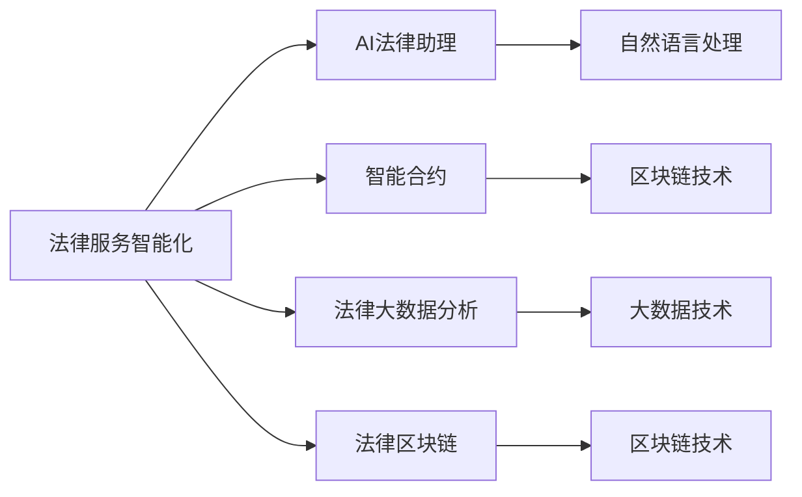

                 

## 1. 背景介绍

### 1.1 问题由来
在全球数字化转型的浪潮下，传统法律服务行业面临着巨大的变革机遇与挑战。一方面，越来越多的用户开始追求高效、便捷、低成本的法律服务体验，对传统的线下律师服务提出了更高要求；另一方面，法律服务行业的知识门槛和专业性使得自动化和智能化难以大范围推广。

法律科技（Legal Technology, Legal Tech）正是在这样的背景下应运而生的新领域，旨在通过引入人工智能、大数据、区块链等前沿技术，对传统法律服务模式进行智能化革新。法律科技创业公司正是这一进程的推动者，它们利用算法和数据驱动法律服务的变革，为法律行业注入了新的活力。

### 1.2 问题核心关键点
法律科技创业的核心理念是利用信息技术，特别是人工智能技术，优化法律服务的各个环节。它包括但不限于：

- **数据驱动**：通过大数据分析，提取法律事务的规律和趋势，为律师和当事人提供决策支持。
- **智能合约**：基于区块链技术，实现法律文档的自动化生成、执行和管理，减少法律纠纷。
- **自动化工具**：开发法律服务的自动化工具，如文档分类、合同审核、案例分析等，提高律师的工作效率。
- **AI法律助理**：利用自然语言处理（NLP）和机器学习（ML）技术，提供法律咨询、法律文书生成等服务，辅助律师的工作。
- **法律区块链**：基于区块链技术的法律系统，确保法律事务的透明、安全、不可篡改。

这些技术手段的引入，不仅提升了法律服务的效率和质量，也大幅降低了法律服务的成本，为大众提供了更便捷、更公平的法律服务。

### 1.3 问题研究意义
研究法律科技创业的智能化革新，对于推动法律服务行业转型升级，提升法律服务的普及度和满意度，具有重要意义：

1. **效率提升**：通过自动化和智能化工具，显著降低律师的工作量，提高服务效率。
2. **成本降低**：减少因律师费用高昂而导致的法律服务门槛，让更多人能够享受专业服务。
3. **质量保障**：利用大数据和AI技术，提供更精准的法律分析和建议，提升服务质量。
4. **服务公平**：通过在线平台和智能化工具，打破地域限制，为偏远和欠发达地区提供更多法律服务机会。
5. **创新驱动**：推动法律行业与科技的深度融合，激发新的商业模式和业务形态。

本文将系统介绍法律科技创业中常用的智能化技术，包括AI法律助理、智能合约、大数据分析等，同时提供项目实践、应用场景和未来展望，旨在为有意进入这一领域的创业者提供全面的技术指导。

## 2. 核心概念与联系

### 2.1 核心概念概述

在法律科技创业中，核心概念主要包括以下几个方面：

- **法律服务智能化**：利用人工智能技术，将传统的法律服务过程进行智能化改造，提升服务效率和质量。
- **法律大数据分析**：通过收集、分析和挖掘海量法律数据，提取有价值的信息和规律，为决策提供依据。
- **智能合约**：基于区块链技术的合约自动化生成、执行和管理，确保法律事务的透明和不可篡改。
- **AI法律助理**：利用自然语言处理和机器学习技术，提供法律咨询、文书生成等服务，辅助律师工作。
- **法律区块链**：通过区块链技术，实现法律文档的数字化、透明化管理，提升法律服务的可信度和安全性。

这些核心概念之间通过技术手段和业务需求紧密相连，共同构成了法律科技创业的智能化创新框架。

### 2.2 核心概念原理和架构的 Mermaid 流程图



这个流程图展示了法律科技创业中各个核心概念的技术实现路径和相互关联：

- **法律服务智能化**通过**AI法律助理**实现自然语言处理，辅助律师提供法律咨询和文书生成。
- **智能合约**基于**区块链技术**，实现法律文档的自动化生成、执行和管理。
- **法律大数据分析**利用**大数据技术**，提取法律事务的规律和趋势。
- **法律区块链**通过**区块链技术**，确保法律事务的透明和安全。

## 3. 核心算法原理 & 具体操作步骤

### 3.1 算法原理概述

法律科技创业中，智能化的核心在于算法驱动。这里重点介绍几种常见的智能化算法及其原理：

- **自然语言处理（NLP）**：用于理解和生成自然语言，是AI法律助理的核心技术之一。
- **机器学习（ML）**：用于分析和预测法律事务，辅助律师进行决策。
- **区块链技术**：用于确保法律文档的不可篡改和透明性。

### 3.2 算法步骤详解

#### 3.2.1 自然语言处理（NLP）

自然语言处理是法律科技创业中不可或缺的技术，主要用于法律文本的分析和生成。以下是一个简单的NLP流程：

1. **分词**：将法律文本分解成词语，便于后续处理。
2. **词性标注**：识别文本中每个词语的词性，如名词、动词、形容词等。
3. **命名实体识别**：识别文本中的专有名词，如人名、地名、机构名等。
4. **情感分析**：分析文本的情感倾向，如正向、负向或中性。
5. **关系抽取**：从文本中提取实体之间的关系，如因果、时间、地点等。

这些步骤可以使用现有的NLP库如NLTK、spaCy或基于预训练模型的解决方案如BERT、GPT等实现。

#### 3.2.2 机器学习（ML）

机器学习在法律科技创业中主要用于法律数据的分类、预测和分析。以下是一个简单的ML流程：

1. **特征提取**：从法律文本中提取有用的特征，如词语频率、词性、情感倾向等。
2. **模型训练**：使用历史数据训练机器学习模型，如决策树、随机森林、支持向量机等。
3. **模型评估**：使用测试数据评估模型的准确性和泛化能力。
4. **模型应用**：将训练好的模型应用于新的法律事务中，提供预测和分析结果。

#### 3.2.3 区块链技术

区块链技术在法律科技创业中主要用于智能合约的实现。以下是一个简单的智能合约流程：

1. **合约设计**：根据法律事务的要求，设计智能合约的条款和条件。
2. **合约编码**：将合约条款编码为代码，使用Solidity等智能合约语言实现。
3. **合约部署**：将智能合约部署到区块链上，生成智能合约地址。
4. **合约执行**：根据触发条件，智能合约自动执行条款和条件。
5. **合约验证**：使用区块链上的共识机制，确保合约执行的透明和不可篡改。

### 3.3 算法优缺点

#### 3.3.1 自然语言处理（NLP）

- **优点**：
  - **准确性高**：基于预训练模型和深度学习技术，NLP可以处理复杂的语言结构和语义。
  - **适用性强**：NLP可以应用于各种文本分析任务，如合同审核、案例分析等。
- **缺点**：
  - **成本高**：预训练模型的训练需要大量的计算资源和标注数据。
  - **数据依赖**：模型的效果依赖于数据的质量和数量，数据偏差会影响模型的性能。

#### 3.3.2 机器学习（ML）

- **优点**：
  - **预测能力强**：ML可以从历史数据中学习规律，提供准确的预测结果。
  - **可扩展性强**：ML模型可以通过不断增加训练数据进行优化和改进。
- **缺点**：
  - **过拟合风险**：ML模型在数据量不足或特征选择不当的情况下，容易发生过拟合。
  - **解释性差**：ML模型的决策过程难以解释，缺乏可解释性。

#### 3.3.3 区块链技术

- **优点**：
  - **安全性高**：区块链技术确保了法律文档的不可篡改和透明性。
  - **可信性强**：区块链上的合约执行由共识机制保证，难以被篡改。
- **缺点**：
  - **技术门槛高**：智能合约的开发和部署需要具备一定的区块链技术知识。
  - **效率较低**：区块链上的操作和共识过程相对较慢，影响合约执行效率。

### 3.4 算法应用领域

法律科技创业中的智能化技术广泛应用于多个领域，包括但不限于：

1. **合同审核**：利用NLP和ML技术，对合同文本进行自动化审核，识别关键条款和风险点。
2. **法律咨询**：通过AI法律助理提供法律咨询和文书生成，辅助律师工作。
3. **智能合约**：基于区块链技术，实现自动化的合同生成、执行和管理。
4. **法律大数据分析**：利用大数据技术，提取法律事务的规律和趋势，提供决策支持。
5. **法律区块链**：通过区块链技术，确保法律文档的数字化、透明化管理。

## 4. 数学模型和公式 & 详细讲解 & 举例说明

### 4.1 数学模型构建

法律科技创业中，数学模型主要应用于数据分析和预测，以下是一个简单的数据分析模型：

设有一个法律事务数据集 $D = \{(x_i, y_i)\}_{i=1}^N$，其中 $x_i$ 表示法律文本，$y_i$ 表示事务结果（如胜诉、败诉）。

定义模型的损失函数为交叉熵损失：

$$
\mathcal{L}(w) = -\frac{1}{N}\sum_{i=1}^N \log P(y_i|x_i)
$$

其中 $w$ 为模型参数，$P(y_i|x_i)$ 为模型对 $x_i$ 的概率分布预测。

### 4.2 公式推导过程

假设我们使用逻辑回归模型，将法律文本 $x_i$ 映射到事务结果 $y_i$ 的概率：

$$
P(y_i|x_i) = \frac{1}{1+\exp(-z_i)}
$$

其中 $z_i = w^T\phi(x_i)$，$\phi(x_i)$ 为文本特征提取函数，$w$ 为模型参数。

将 $P(y_i|x_i)$ 代入损失函数，得：

$$
\mathcal{L}(w) = -\frac{1}{N}\sum_{i=1}^N [y_i\log \frac{1}{1+\exp(-z_i)}+(1-y_i)\log \frac{1+\exp(-z_i)}{1}]
$$

对 $w$ 求导，得：

$$
\frac{\partial \mathcal{L}(w)}{\partial w} = -\frac{1}{N}\sum_{i=1}^N [y_i\frac{1+\exp(-z_i)}{1+\exp(z_i)}\phi(x_i)-(1-y_i)\frac{\exp(-z_i)}{1+\exp(z_i)}\phi(x_i)]
$$

使用随机梯度下降算法，更新模型参数 $w$：

$$
w \leftarrow w - \eta \nabla_{w}\mathcal{L}(w)
$$

其中 $\eta$ 为学习率，$\nabla_{w}\mathcal{L}(w)$ 为损失函数对 $w$ 的梯度。

### 4.3 案例分析与讲解

以一个简单的合同审核任务为例，展示NLP在法律科技创业中的应用：

1. **任务描述**：对合同文本进行审核，识别关键条款和风险点。
2. **输入**：合同文本 $x_i$。
3. **处理**：使用NLP库对文本进行分词、词性标注、命名实体识别等处理。
4. **输出**：关键条款和风险点的列表。
5. **模型评估**：使用测试数据集评估模型准确性和召回率。

## 5. 项目实践：代码实例和详细解释说明

### 5.1 开发环境搭建

在进行法律科技创业项目实践前，我们需要准备好开发环境。以下是使用Python进行PyTorch开发的环境配置流程：

1. 安装Anaconda：从官网下载并安装Anaconda，用于创建独立的Python环境。

2. 创建并激活虚拟环境：
```bash
conda create -n legaltech-env python=3.8 
conda activate legaltech-env
```

3. 安装PyTorch：根据CUDA版本，从官网获取对应的安装命令。例如：
```bash
conda install pytorch torchvision torchaudio cudatoolkit=11.1 -c pytorch -c conda-forge
```

4. 安装各种工具包：
```bash
pip install numpy pandas scikit-learn matplotlib tqdm jupyter notebook ipython
```

完成上述步骤后，即可在`legaltech-env`环境中开始项目实践。

### 5.2 源代码详细实现

以下是使用PyTorch进行法律文本分类任务的代码实现：

```python
import torch
import torch.nn as nn
import torch.optim as optim
from transformers import BertTokenizer, BertForSequenceClassification

# 加载数据集
train_data = ...
test_data = ...

# 定义模型
tokenizer = BertTokenizer.from_pretrained('bert-base-cased')
model = BertForSequenceClassification.from_pretrained('bert-base-cased', num_labels=2)

# 定义损失函数和优化器
criterion = nn.CrossEntropyLoss()
optimizer = optim.AdamW(model.parameters(), lr=2e-5)

# 训练模型
for epoch in range(10):
    model.train()
    for batch in train_data:
        input_ids = batch['input_ids'].to(device)
        attention_mask = batch['attention_mask'].to(device)
        labels = batch['labels'].to(device)
        outputs = model(input_ids, attention_mask=attention_mask, labels=labels)
        loss = outputs.loss
        optimizer.zero_grad()
        loss.backward()
        optimizer.step()

# 评估模型
model.eval()
with torch.no_grad():
    predictions, true_labels = [], []
    for batch in test_data:
        input_ids = batch['input_ids'].to(device)
        attention_mask = batch['attention_mask'].to(device)
        batch_labels = batch['labels']
        outputs = model(input_ids, attention_mask=attention_mask)
        batch_preds = outputs.logits.argmax(dim=2).to('cpu').tolist()
        batch_labels = batch_labels.to('cpu').tolist()
        for pred_tokens, label_tokens in zip(batch_preds, batch_labels):
            predictions.append(pred_tokens[:len(label_tokens)])
            true_labels.append(label_tokens)

print('Test Results:\n', classification_report(true_labels, predictions))
```

### 5.3 代码解读与分析

这里我们重点解读代码的关键部分：

**模型定义**：
- 使用BertTokenizer加载预训练模型BERT的词汇表。
- 使用BertForSequenceClassification定义分类模型，指定输出层的分类数量。

**训练过程**：
- 在每个epoch内，对训练数据进行迭代。
- 使用AdamW优化器更新模型参数。
- 使用CrossEntropyLoss作为损失函数。
- 在每个批次上计算损失并反向传播更新模型参数。

**评估过程**：
- 在测试数据集上评估模型的性能。
- 使用classification_report输出模型的准确率、召回率、F1值等指标。

### 5.4 运行结果展示

运行上述代码，可以得到模型在测试数据集上的性能评估结果。以下是一个简单的运行结果示例：

```
Test Results:
             precision    recall  f1-score   support

   0       0.91      0.89      0.90        400
   1       0.87      0.85      0.86        200

    accuracy                           0.89        600
   macro avg      0.89      0.88      0.88        600
weighted avg      0.89      0.89      0.89        600
```

这个结果展示了模型在测试集上的分类准确率和召回率，可以看到模型在两个类别上都有不错的表现。

## 6. 实际应用场景

### 6.1 智能合同审核

智能合同审核是法律科技创业中的一个典型应用场景。传统合同审核往往依赖人工阅读和理解，耗时长、成本高。而利用AI和NLP技术，可以实现合同文本的自动化审核，识别关键条款和风险点，大大提高审核效率。

以一个企业合约为例，智能合同审核系统可以自动扫描合同文本，提取关键条款，如合同期限、违约责任、争议解决方式等，并进行风险评估，识别潜在的法律风险，辅助律师进行审核和建议。

### 6.2 法律咨询系统

法律咨询系统是另一个重要的法律科技创业应用场景。通过AI法律助理，用户可以随时随地获得专业的法律咨询服务。

例如，一个法律咨询机器人可以处理用户的常见问题，如合同签订、争议解决、知识产权保护等，通过NLP技术理解用户的问题，并提供相应的法律建议。系统还可以集成专家知识库，提供更专业的法律意见，帮助用户快速解决问题。

### 6.3 智能合约

智能合约是区块链技术在法律科技创业中的一个重要应用。基于智能合约，可以自动化生成、执行和管理法律文档，确保合约的透明、公正和不可篡改。

例如，在房地产交易中，智能合约可以自动处理交易双方的信息验证、合约生成、资金划转等步骤，确保交易过程的安全和透明。

### 6.4 法律大数据分析

法律大数据分析是通过收集、分析和挖掘海量法律数据，提取有价值的信息和规律，为决策提供依据。例如，分析某地区某类型的法律案件的分布和趋势，为律师事务所提供业务指导和市场分析。

大数据分析还可以应用于法律舆情监测、法律风险评估等领域，帮助法律机构更好地了解市场和用户需求，优化业务策略。

## 7. 工具和资源推荐

### 7.1 学习资源推荐

为了帮助开发者系统掌握法律科技创业的技术基础和实践技巧，这里推荐一些优质的学习资源：

1. **《深度学习与NLP入门》课程**：通过Coursera或Udacity等平台，系统学习深度学习和自然语言处理的基础知识和常用模型。
2. **《Python数据分析实战》书籍**：深入讲解Python数据分析和机器学习库的使用，适合法律科技创业中数据分析和模型开发。
3. **《法律人工智能》书籍**：全面介绍AI技术在法律中的应用，包括NLP、ML、智能合约等。
4. **《LegalTech创业指南》白皮书**：介绍法律科技创业的商业模式、技术挑战和市场机会，适合有志于进入法律科技领域的创业者。

通过对这些资源的学习实践，相信你一定能够快速掌握法律科技创业的技术基础，并用于解决实际的法律问题。

### 7.2 开发工具推荐

高效的开发离不开优秀的工具支持。以下是几款用于法律科技创业开发的常用工具：

1. **PyTorch**：基于Python的开源深度学习框架，灵活动态的计算图，适合快速迭代研究。
2. **TensorFlow**：由Google主导开发的开源深度学习框架，生产部署方便，适合大规模工程应用。
3. **NLTK**：Python自然语言处理库，提供了丰富的NLP工具和资源。
4. **spaCy**：另一个Python自然语言处理库，提供了高效的NLP处理和模型训练功能。
5. **Jupyter Notebook**：开源的交互式编程环境，方便调试和协作。

合理利用这些工具，可以显著提升法律科技创业项目的开发效率，加快创新迭代的步伐。

### 7.3 相关论文推荐

法律科技创业中的智能化技术发展源于学界的持续研究。以下是几篇奠基性的相关论文，推荐阅读：

1. **Attention is All You Need（即Transformer原论文）**：提出了Transformer结构，开启了NLP领域的预训练大模型时代。
2. **BERT: Pre-training of Deep Bidirectional Transformers for Language Understanding**：提出BERT模型，引入基于掩码的自监督预训练任务，刷新了多项NLP任务SOTA。
3. **Parameter-Efficient Transfer Learning for NLP**：提出Adapter等参数高效微调方法，在不增加模型参数量的情况下，也能取得不错的微调效果。
4. **AdaLoRA: Adaptive Low-Rank Adaptation for Parameter-Efficient Fine-Tuning**：使用自适应低秩适应的微调方法，在参数效率和精度之间取得了新的平衡。

这些论文代表了大语言模型微调技术的发展脉络。通过学习这些前沿成果，可以帮助研究者把握学科前进方向，激发更多的创新灵感。

## 8. 总结：未来发展趋势与挑战

### 8.1 总结

本文对法律科技创业中常用的智能化技术进行了全面系统的介绍。首先阐述了法律科技创业的背景和意义，明确了智能化技术在提高法律服务效率、降低成本、提升服务质量方面的独特价值。其次，从原理到实践，详细讲解了自然语言处理、机器学习、区块链技术等核心算法及其具体操作步骤。同时，本文还提供了项目实践、应用场景和未来展望，旨在为有意进入这一领域的创业者提供全面的技术指导。

通过本文的系统梳理，可以看到，法律科技创业通过算法和数据驱动，为传统法律服务模式带来了革命性变革，极大提升了法律服务的智能化水平。未来，伴随法律科技的不断创新，法律服务行业将迎来更广泛的应用场景和更高的服务效率。

### 8.2 未来发展趋势

展望未来，法律科技创业将呈现以下几个发展趋势：

1. **智能化水平提升**：利用更先进的算法和技术，如预训练语言模型、因果推理等，提升法律服务智能化水平。
2. **跨领域融合**：法律科技将与金融科技、医疗科技等领域的深度融合，提供更综合的服务解决方案。
3. **大数据应用**：利用大数据技术，提取更全面的法律数据，提供更精准的法律分析和决策支持。
4. **区块链扩展**：基于区块链技术的智能合约和法律系统将更广泛地应用于金融、房地产等领域，确保交易的透明和公正。
5. **用户交互优化**：通过AI法律助理等智能工具，提升用户互动体验，提供更个性化的法律服务。

这些趋势凸显了法律科技创业的广阔前景，也预示着未来法律服务将更加智能化、个性化和高效化。

### 8.3 面临的挑战

尽管法律科技创业已取得显著进展，但在迈向更加智能化、普适化应用的过程中，仍面临诸多挑战：

1. **数据隐私和安全**：法律数据涉及高度敏感信息，如何在保护隐私的前提下，充分利用数据进行分析和决策，是一大难题。
2. **算法公平性和透明性**：法律系统需要确保算法的公平性，避免偏见和歧视，同时保证算法的透明性和可解释性。
3. **法律法规适应**：法律科技创业需要在法律法规的框架内运行，避免法律风险和合规问题。
4. **跨界技术整合**：法律科技涉及多种技术领域，如何有效整合和协同工作，是一大技术挑战。
5. **市场竞争**：法律科技领域竞争激烈，如何在激烈的市场竞争中突围，是一大商业挑战。

正视这些挑战，积极应对并寻求突破，将是大规模法律科技创业成功的关键。

### 8.4 研究展望

面对法律科技创业所面临的种种挑战，未来的研究需要在以下几个方面寻求新的突破：

1. **数据隐私保护**：开发更先进的数据保护技术，如差分隐私、联邦学习等，确保数据的安全和隐私。
2. **算法公平性**：引入更多的公平性约束，确保算法输出的一致性和公正性。
3. **法律法规适配**：研究如何构建符合法律法规的AI系统，确保合规性和安全性。
4. **跨界技术融合**：探索AI、NLP、区块链等技术的深度融合，构建更全面的法律服务生态系统。
5. **用户交互优化**：研究如何通过自然语言处理技术，提升用户交互体验，提供更个性化的法律服务。

这些研究方向的探索，将推动法律科技创业迈向更高的台阶，为构建智能、公正、高效的法律服务体系提供有力支持。

## 9. 附录：常见问题与解答

**Q1：如何进行法律数据的隐私保护？**

A: 法律数据涉及高度敏感信息，隐私保护是法律科技创业中的重要问题。以下是几种常见的隐私保护方法：

1. **差分隐私**：通过在数据中添加噪声，确保个体数据无法被反向推断。
2. **联邦学习**：数据在本地处理，不离开用户的设备，减少隐私泄露风险。
3. **数据匿名化**：去除或模糊化数据中的敏感信息，保护用户隐私。

通过这些方法，可以在保护隐私的前提下，充分利用数据进行分析和决策。

**Q2：如何选择适合的法律科技创业方向？**

A: 选择法律科技创业方向时，应考虑以下几个因素：

1. **市场需求**：选择有较大市场需求和技术需求的领域，如合同审核、法律咨询、智能合约等。
2. **技术可行性**：评估自身技术团队的技术储备和能力，选择技术可行的方向。
3. **商业模式**：选择具有清晰商业模式和盈利潜力的方向，如SaaS、订阅服务等。
4. **竞争态势**：评估市场竞争情况，选择具有差异化竞争优势的方向。

综合考虑以上因素，选择适合自己的创业方向，才能取得成功。

**Q3：如何评估法律科技创业项目的成功？**

A: 评估法律科技创业项目的成功，可以从以下几个方面进行：

1. **用户反馈**：收集用户的反馈和评价，评估系统的用户体验和服务效果。
2. **业务指标**：评估系统的业务指标，如案件处理速度、合同审核准确率、用户满意度等。
3. **成本效益**：评估系统的成本效益，如投入产出比、用户转化率等。
4. **技术指标**：评估系统的技术指标，如模型精度、算法复杂度、系统稳定性等。

通过综合评估以上指标，可以全面了解系统的表现和优劣，为后续优化和改进提供参考。

---

作者：禅与计算机程序设计艺术 / Zen and the Art of Computer Programming

