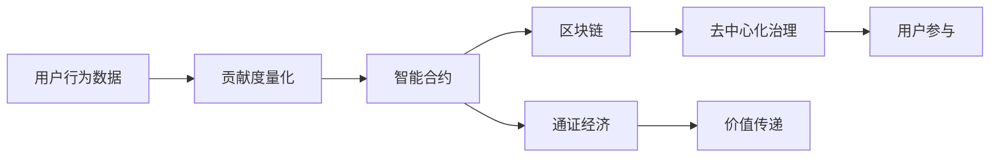

                 

# 注意力币：元宇宙中的新型价值衡量标准

## 1. 背景介绍

### 1.1 问题由来

在人类社会的发展历程中，货币作为价值衡量的载体，扮演了至关重要的角色。它不仅促成了交易的便利，也成为经济、政治、文化等多领域不可或缺的纽带。然而，随着技术的发展，尤其是区块链和分布式账本技术的兴起，传统的货币体系面临着诸多挑战。

首先，传统货币的供应量、发行机制等核心要素被中央银行或政府所控制，缺乏透明度和抗腐败性。其次，货币的流转与交易过程中存在较高的成本和复杂性，限制了其普适性和可扩展性。此外，传统货币的流通往往集中在特定区域内，无法实现全球范围内统一的价值标准。

进入21世纪，随着虚拟现实(VR)、增强现实(AR)、区块链、人工智能(AI)等技术逐步成熟，元宇宙作为一种虚拟与现实深度融合的新型空间，提供了构建新货币体系的可能性。在这样的背景下，一种新的价值衡量标准——注意力币(Attention Coin)应运而生。

### 1.2 问题核心关键点

注意力币作为元宇宙中的新型价值衡量标准，其核心思想在于利用区块链技术的去中心化特性，通过智能合约机制，将用户对虚拟空间中的行为、互动、贡献进行量化，作为货币的流通基础。

具体而言，注意力币通过以下关键点来构建其价值体系：
1. **用户行为数据记录**：记录用户在元宇宙中的行为数据，如浏览时长、交易金额、创作内容等。
2. **贡献度量化**：将用户行为转化为贡献度，量化其在虚拟空间中的价值。
3. **智能合约激励**：通过智能合约设计，奖励用户的贡献，使其转化为可用货币。
4. **去中心化治理**：允许用户参与治理，通过投票等方式决定货币政策的调整和改进。

### 1.3 问题研究意义

研究注意力币的价值衡量标准，对于构建元宇宙中的新经济体系具有重要意义：

1. **去中心化**：打破传统货币的集中控制，实现更为公平透明的价值分配。
2. **普适性**：依托区块链技术，使货币能够在全球范围内流通，促进虚拟与现实的融合。
3. **高效性**：通过智能合约和用户行为记录，降低交易成本，提高流通效率。
4. **动态性**：随着用户在元宇宙中的行为变化，货币价值动态调整，更具灵活性。
5. **参与性**：用户参与到货币的发行和治理中，增强社区粘性和激励。

总之，注意力币不仅是对传统货币体系的颠覆性创新，更是对元宇宙经济模型的深刻探索。

## 2. 核心概念与联系

### 2.1 核心概念概述

注意力币作为元宇宙中的新型价值衡量标准，涉及多个核心概念，包括但不限于：

- **区块链技术**：作为注意力币的技术基础，提供去中心化、透明可信的计算平台。
- **智能合约**：通过代码实现的自动执行合约，实现注意力币的自动发行、管理和激励。
- **用户行为数据**：用户在日常活动中的行为数据，是注意力币价值的核心来源。
- **贡献度量化**：将用户行为数据转化为对虚拟空间的贡献，量化其价值。
- **去中心化治理**：用户参与的民主决策机制，决定货币政策和治理方式。
- **通证经济**：一种基于区块链技术的经济模型，通过数字通证来实现价值传递和激励机制。

这些概念之间相互联系，共同构成了注意力币的价值体系。

### 2.2 核心概念原理和架构的 Mermaid 流程图



这个流程图展示了注意力币价值体系的核心组件及其关系：用户行为数据通过贡献度量化转化为智能合约中的资产，再通过区块链进行透明记录和去中心化治理，最终实现通证经济的动态价值传递。

## 3. 核心算法原理 & 具体操作步骤

### 3.1 算法原理概述

注意力币的价值量化过程主要基于以下几个算法原理：

1. **用户行为数据收集**：通过元宇宙平台内的追踪技术，收集用户的行为数据，如浏览时间、交易次数、创作内容等。
2. **贡献度量化**：根据预设的规则，将用户的行为数据转化为对虚拟空间的贡献度，如浏览时长与交易金额的比值。
3. **智能合约激励**：利用智能合约，自动根据贡献度计算并发放对应的注意力币，支持其在元宇宙内的流通。
4. **通证经济**：结合区块链技术的分布式账本特性，实现货币的生成、分配、流转、存储等全生命周期管理。
5. **去中心化治理**：通过智能合约内置的投票机制，允许用户参与治理，决定货币政策的变化和改进。

### 3.2 算法步骤详解

以下详细描述注意力币从数据收集到价值量化再到货币分配的全流程算法步骤：

1. **数据收集**：
   - 利用区块链的分布式账本特性，记录用户的行为数据，包括但不限于用户在虚拟空间中的停留时间、交易记录、内容创作等。
   - 数据采集设备应支持高频率、低延迟的记录，确保数据的完整性和实时性。

2. **贡献度量化**：
   - 根据预设的算法模型，将用户的行为数据转化为贡献度，如设置贡献度为浏览时长与交易金额的比值。
   - 使用数学公式进行量化计算，确保量化过程的公平性和透明性。

3. **智能合约激励**：
   - 设计并部署智能合约，用于计算用户贡献度，并根据贡献度自动发放对应的注意力币。
   - 智能合约应支持动态调整计算规则和激励机制，以适应不同的应用场景和需求。

4. **区块链记录**：
   - 利用区块链的分布式账本特性，将注意力币的生成、分配、流转、存储等过程透明记录，确保不可篡改性和可追溯性。
   - 通过区块链共识算法，保证网络节点间的同步和一致性。

5. **去中心化治理**：
   - 在智能合约中内置投票机制，允许用户参与到货币政策的决策中。
   - 设计合理的投票规则和奖励机制，促进用户积极参与治理。

### 3.3 算法优缺点

#### 优点

1. **去中心化**：无需中心机构控制，提高了系统的透明性和信任度。
2. **普适性**：基于区块链技术，货币可以在全球范围内流通，不受地域限制。
3. **高效性**：智能合约自动执行，降低了交易成本和复杂性。
4. **动态性**：用户行为数据不断变化，货币价值动态调整，更具灵活性。
5. **参与性**：用户参与治理，增强了社区粘性和激励。

#### 缺点

1. **复杂性**：智能合约的实现和维护相对复杂，需要专业的区块链开发能力。
2. **安全性**：智能合约的安全性受到编程漏洞和网络攻击的威胁，需要持续的安全监控和审计。
3. **隐私保护**：行为数据收集可能涉及用户隐私，需要设计合理的隐私保护机制。
4. **价值波动**：用户行为数据的不确定性可能影响货币价值的稳定性和可预测性。
5. **技术门槛**：用户和开发者需要具备一定的区块链和智能合约知识，增加了技术门槛。

### 3.4 算法应用领域

注意力币的价值量化和分配机制，具有广泛的应用前景，包括但不限于：

- **虚拟游戏**：游戏内经济系统的构建，支持虚拟货币的流通和交易。
- **数字艺术**：艺术品的价值量化和交易，支持数字资产的稀缺性。
- **虚拟房地产**：虚拟土地和建筑物的价值评估和流转，支持虚拟资产的交易。
- **虚拟旅游**：旅游体验的价值量化和分享，支持虚拟景点的价值传递。
- **社交平台**：用户互动和贡献的价值量化，支持社交行为的经济激励。
- **数字教育**：学习成就的价值量化和认可，支持知识分享和教育激励。

## 4. 数学模型和公式 & 详细讲解 & 举例说明

### 4.1 数学模型构建

注意力币的价值量化过程可以通过以下数学模型进行构建：

- **用户行为数据**：$D = (x_1, x_2, ..., x_n)$，其中 $x_i$ 为第 $i$ 个用户的行为数据。
- **贡献度量化**：$C = f(D)$，其中 $f$ 为量化函数，将 $D$ 转化为贡献度 $C$。
- **智能合约激励**：$R = g(C)$，其中 $g$ 为激励函数，根据贡献度 $C$ 计算注意力币 $R$。
- **区块链记录**：$T = h(R)$，其中 $h$ 为区块链记录函数，确保 $R$ 的透明性和不可篡改性。
- **去中心化治理**：$G = v(T)$，其中 $v$ 为治理函数，用户参与投票决定 $G$。

### 4.2 公式推导过程

以浏览时间与交易金额的比值为例，进行量化过程的数学推导：

设用户行为数据 $D = (t_i, t_j)$，其中 $t_i$ 为浏览时间，$t_j$ 为交易金额。设贡献度函数为 $f(t_i, t_j) = \frac{t_i}{t_j}$，智能合约激励函数为 $g(C) = C \times k$，其中 $k$ 为单位贡献度对应的注意力币数量。

则注意力币的计算过程为：

$$
R = g(f(t_i, t_j)) = f(t_i, t_j) \times k = \frac{t_i}{t_j} \times k
$$

通过区块链记录 $T$，确保 $R$ 的透明性和不可篡改性。用户通过智能合约参与投票 $G$，决定货币政策的调整和改进。

### 4.3 案例分析与讲解

假设用户在虚拟商店内花费了100元购买了10个虚拟商品，浏览时间为2小时。设单位浏览时间对应的激励系数为0.1元/小时，即 $k=0.1$。则用户的行为数据 $D = (2, 100)$，贡献度为 $C = f(2, 100) = \frac{2}{100} = 0.02$。

根据智能合约激励函数，计算注意力币为：

$$
R = g(0.02) = 0.02 \times 0.1 = 0.002
$$

通过区块链记录 $T$，确保 $R$ 的透明性和不可篡改性。用户通过智能合约参与投票 $G$，决定货币政策的调整和改进。

## 5. 项目实践：代码实例和详细解释说明

### 5.1 开发环境搭建

为了构建注意力币系统，需要搭建一系列开发环境，包括但不限于：

- **区块链平台**：选择适合的区块链平台，如Ethereum、Polkadot等，用于部署智能合约和记录货币。
- **智能合约编写工具**：如Solidity、Vyper等，用于编写和调试智能合约。
- **开发IDE**：如Visual Studio Code、PyCharm等，用于编写和测试代码。
- **测试网络**：搭建测试网络，如Ropsten、Ganache等，进行功能和安全性测试。

### 5.2 源代码详细实现

以下是一个简化版的智能合约代码示例，用于计算注意力币并记录在区块链上：

```solidity
// SPDX-License-Identifier: MIT
pragma solidity ^0.8.0;

contract AttentionCoin {
    address payable public owner;
    mapping(uint256 => uint256) balances;
    uint256 public supply;

    event UserContribution(uint256 user, uint256 contribution);

    constructor() public {
        owner = msg.sender;
        supply = 1000000 * 10 ** 18; // 总量10亿枚
        balances[msg.sender] = supply;
    }

    function contribute(uint256 contribution) public {
        balances[msg.sender] += contribution;
        emit UserContribution(msg.sender, contribution);
    }

    function earnAttentionCoin(uint256 contribution) public {
        uint256 attentionCoin = contribution * 10 ** 4; // 1贡献度=10元
        balances[msg.sender] += attentionCoin;
        payable(owner).transfer(attentionCoin);
    }

    function getBalance() public view returns (uint256) {
        return balances[msg.sender];
    }

    function transfer(address payable _to, uint256 amount) public {
        require(balances[msg.sender] >= amount);
        balances[msg.sender] -= amount;
        balances[_to] += amount;
    }
}
```

该智能合约实现了用户的贡献度计算和注意力币的分配功能，具体解释如下：

1. **构造函数**：初始化货币总量和用户余额。
2. **贡献函数**：用户贡献一定的浏览时间或交易金额，记录到用户的余额中。
3. **获得注意力币函数**：根据贡献度计算并分配对应的注意力币，转移到所有者账户。
4. **余额查询函数**：查询用户的余额。
5. **转账函数**：支持用户之间进行注意力币的转账。

### 5.3 代码解读与分析

- **智能合约部署**：在搭建的区块链平台上，将上述智能合约代码部署到智能合约地址，使其在链上生效。
- **用户贡献**：用户通过调用 `contribute` 函数，输入一定的浏览时间或交易金额，记录到智能合约中的贡献度。
- **获得注意力币**：用户通过调用 `earnAttentionCoin` 函数，获得对应的注意力币，并转移到所有者账户。
- **余额查询和转账**：用户通过调用 `getBalance` 和 `transfer` 函数，查询和转移注意力币。

## 6. 实际应用场景

### 6.1 虚拟游戏

在虚拟游戏中，玩家的行为数据可以量化为对游戏世界的贡献度，转化为注意力币。玩家通过游戏内经济系统的交易所获得的货币，可以用于购买道具、装备、提升等级等，进一步促进游戏体验。

### 6.2 数字艺术

数字艺术家可以通过创作高质量的艺术品，获取用户的浏览和交易记录，量化为贡献度，转化为注意力币。艺术家可以通过平台提供的艺术交易市场，将自己的作品以数字货币的形式进行交易和展示。

### 6.3 虚拟房地产

虚拟地产商可以记录用户对虚拟土地的浏览、购买和使用数据，量化为对虚拟空间的贡献度，转化为注意力币。用户可以通过平台提供的虚拟土地市场，进行土地买卖和租赁，获取对应的货币奖励。

### 6.4 未来应用展望

随着元宇宙技术的发展，注意力币将在更多领域得到应用，其价值和影响也将进一步扩大：

1. **全球货币**：随着元宇宙的国际化和普及，注意力币可能成为全球通用的数字货币，促进虚拟与现实的融合。
2. **经济激励**：在虚拟空间中，注意力币可以作为经济激励机制，鼓励用户参与更多的互动和创作。
3. **社交网络**：用户可以通过注意力币在社交平台上进行交流和互动，构建虚拟社交网络。
4. **教育平台**：学习成就和贡献度可以量化为注意力币，鼓励学生积极参与学习。
5. **医疗健康**：通过量化用户在虚拟医疗系统中的行为和贡献，转化为对应的货币，激励用户参与健康管理。
6. **金融服务**：虚拟金融市场可以提供基于注意力币的金融服务，如借贷、投资等。

总之，注意力币作为元宇宙中的新型价值衡量标准，具有广阔的应用前景，将对虚拟经济和人类社会产生深远的影响。

## 7. 工具和资源推荐

### 7.1 学习资源推荐

为了深入理解注意力币的价值量化和应用，推荐以下学习资源：

- **《区块链技术与智能合约》**：系统介绍区块链技术和智能合约的基础知识和应用场景。
- **《元宇宙经济学》**：探讨元宇宙中的经济体系和新型货币机制，提供理论基础和实践案例。
- **《Solidity智能合约编程》**：介绍Solidity语言的基本语法和智能合约的编写技巧。
- **《以太坊开发者手册》**：提供以太坊平台的使用指南和开发工具。
- **《Web3.js开发者指南》**：介绍Web3.js等前端工具，进行区块链应用的开发和测试。

### 7.2 开发工具推荐

为了进行注意力币系统的开发和测试，推荐以下开发工具：

- **Ethereum IDE**：如Remix IDE，支持Solidity智能合约的编写和调试。
- **Ganache**：轻量级以太坊测试网络，提供低成本的开发和测试环境。
- **Truffle**：基于Solidity的开发框架，提供开发、测试和部署智能合约的解决方案。
- **MyEtherWallet**：以太坊钱包，用于测试和存储智能合约生成的货币。
- **Infura**：以太坊节点服务，提供快速稳定的开发和测试环境。

### 7.3 相关论文推荐

为了深入了解注意力币的理论和实践，推荐以下相关论文：

- **《区块链：去中心化技术》**：介绍区块链技术的基本原理和应用场景。
- **《智能合约安全技术》**：探讨智能合约的安全性和隐私保护问题。
- **《元宇宙经济模型研究》**：分析元宇宙中的经济体系和新型货币机制。
- **《分布式账本技术》**：介绍分布式账本技术的基本原理和实现方法。
- **《数字货币设计》**：探讨数字货币的设计原则和实践方法。

## 8. 总结：未来发展趋势与挑战

### 8.1 研究成果总结

本文对注意力币的价值量化过程进行了详细的介绍，包括其核心概念、算法原理和操作步骤。通过数学模型和案例分析，展示了注意力币在元宇宙中的实际应用场景。最后，推荐了相关学习资源、开发工具和相关论文，为开发者提供全面的技术指引。

### 8.2 未来发展趋势

未来，随着元宇宙技术的进一步发展，注意力币将在更多领域得到应用，其价值和影响也将进一步扩大：

1. **去中心化治理**：用户参与治理的机制将更加完善，提升系统的透明度和公平性。
2. **跨链互操作**：通过跨链技术，实现不同区块链平台之间的互操作和价值传递。
3. **多模态融合**：结合视觉、听觉、触觉等多模态数据，提供更加丰富的用户体验。
4. **隐私保护**：设计更加完善的隐私保护机制，保护用户的个人数据和行为隐私。
5. **价值普适性**：通过智能合约和区块链技术，实现货币的全球流通和普适性应用。
6. **技术演进**：随着新技术的涌现，如量子计算、边缘计算等，注意力币系统将得到进一步优化和升级。

### 8.3 面临的挑战

尽管注意力币具有广阔的应用前景，但在实际应用中仍面临诸多挑战：

1. **技术复杂性**：智能合约的开发和维护相对复杂，需要专业的区块链技术背景。
2. **安全风险**：智能合约的安全性和隐私保护需要持续的监控和优化。
3. **市场接受度**：用户和开发者对新型货币体系的接受度需要进一步提高。
4. **法律合规**：不同国家和地区的法律法规对数字货币的态度不同，需要合规操作。
5. **经济波动**：货币价值的波动可能影响用户对系统的信任度。
6. **市场竞争**：不同平台和系统的竞争，可能导致市场分割和用户流失。

### 8.4 研究展望

面对这些挑战，未来的研究方向可以从以下几个方面进行探索：

1. **跨链互操作技术**：研究跨链协议和技术，实现不同区块链平台之间的互操作和价值传递。
2. **隐私保护技术**：设计更加完善的隐私保护机制，保护用户的个人数据和行为隐私。
3. **经济模型优化**：通过经济模型设计，提升系统的稳定性和公平性。
4. **技术演进跟踪**：跟踪和研究新兴技术，如量子计算、边缘计算等，探索其在元宇宙中的应用。
5. **用户行为分析**：研究用户行为数据对货币价值的影响，优化货币生成和分配机制。
6. **法律合规研究**：跟踪不同国家和地区的法律法规变化，确保系统合规运营。

总之，未来的研究需要在技术、经济、法律等多方面进行深入探索，克服现有的挑战，推动注意力币技术的发展和应用。

## 9. 附录：常见问题与解答

**Q1: 注意力币的价值来源是什么？**

A: 注意力币的价值来源主要基于用户在元宇宙中的行为数据，通过贡献度量化和智能合约激励机制，将用户行为转化为对虚拟空间的贡献，从而生成对应的货币。

**Q2: 注意力币与其他数字货币有何不同？**

A: 注意力币作为元宇宙中的新型价值衡量标准，与传统数字货币如比特币、以太坊等有显著区别。传统数字货币主要基于区块链的分布式账本技术，强调去中心化和防篡改性，而注意力币更侧重于用户行为的贡献度量化和智能合约激励，注重在虚拟空间中的价值传递和激励机制。

**Q3: 注意力币是否存在风险？**

A: 注意力币作为一种新兴的货币体系，同样存在一定的风险。智能合约的安全性、用户隐私保护、市场波动等问题需要持续关注和解决。同时，不同国家和地区的法律法规对数字货币的态度不同，需要合规操作，确保系统的合法性。

**Q4: 注意力币的未来发展方向是什么？**

A: 未来，注意力币系统将结合跨链互操作、隐私保护、智能合约优化等多方面技术，进一步提升系统的安全性和普适性。同时，通过经济模型设计和用户行为分析，优化货币生成和分配机制，提高用户的参与度和满意度。

**Q5: 如何设计注意力币的激励机制？**

A: 注意力币的激励机制设计需要考虑用户的贡献度、行为频率和质量等多个因素。可以设计动态调整的激励规则，如对高贡献度用户给予更高的奖励，鼓励更多高质量的行为。同时，通过智能合约实现透明的激励机制，确保公平性和透明度。

**Q6: 如何保护注意力币用户的隐私？**

A: 在注意力币系统中，用户的隐私保护需要从多个方面进行考虑，如行为数据加密、隐私协议设计、用户授权机制等。通过合理的隐私保护机制，确保用户的个人数据和行为隐私得到保护。

**Q7: 注意力币是否适用于所有元宇宙应用场景？**

A: 注意力币作为元宇宙中的新型价值衡量标准，适用于绝大多数的虚拟应用场景，如虚拟游戏、数字艺术、虚拟房地产等。但在一些特定领域，如医疗、金融等，可能需要结合专业领域的知识，进行适应性调整和优化。

**Q8: 注意力币的技术实现难度如何？**

A: 注意力币系统的技术实现涉及区块链、智能合约、隐私保护等多方面技术，具有一定的复杂性。但通过系统化的设计和合理的应用场景选择，可以克服技术上的难点，实现有效的货币量化和激励机制。

总之，注意力币作为元宇宙中的新型价值衡量标准，具有广阔的应用前景和深远的影响。通过不断的研究和探索，相信这一创新体系将为虚拟世界的经济体系带来新的活力和可能性。

---

作者：禅与计算机程序设计艺术 / Zen and the Art of Computer Programming

