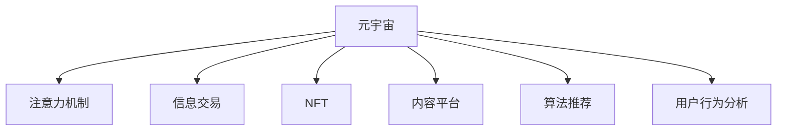

                 

# 注意力市场：元宇宙时代下的信息交易

> 关键词：元宇宙、注意力机制、信息交易、NFT、内容平台、算法推荐、用户行为分析

## 1. 背景介绍

在元宇宙时代，信息成为了一种稀缺资源。用户不再被动接受信息，而是有选择地关注自己感兴趣的内容。注意力市场应运而生，用户通过付费购买注意力资源，以获取更优质的信息服务。本文将探讨元宇宙时代下信息交易的原理与实践，分析当前注意力市场的热点技术，并展望未来发展趋势。

## 2. 核心概念与联系

### 2.1 核心概念概述

为更好地理解元宇宙中的注意力市场，本节将介绍几个密切相关的核心概念：

- 元宇宙（Metaverse）：一个通过虚拟现实、增强现实等技术构建的虚拟世界，用户在其中生活、工作和社交，类似于现实世界的数字化重现。
- 注意力机制（Attention Mechanism）：一种用于处理序列数据的技术，通过筛选输入序列中的关键信息，提升模型在文本、图像等数据集上的表现。
- 信息交易（Information Trading）：用户通过交换货币、积分、代币等方式获取对自己有价值的信息内容。
- NFT（Non-Fungible Token）：不可替代代币，用于代表独特的数字资产，如艺术品、游戏物品等。
- 内容平台（Content Platform）：为用户提供信息的生产、发布、分发和消费的平台。
- 算法推荐（Recommender System）：通过分析用户行为数据，智能推荐用户可能感兴趣的内容。
- 用户行为分析（User Behavior Analysis）：通过对用户行为数据进行分析，提升信息推荐效果，优化用户体验。

这些概念之间的逻辑关系可以通过以下Mermaid流程图来展示：



这个流程图展示了许多核心概念及其之间的关系：

1. 元宇宙是所有相关技术与应用的基础平台。
2. 注意力机制通过筛选关键信息，提升信息质量。
3. 信息交易促进了用户对优质内容的消费。
4. NFT作为独特的数字资产，保证了内容创作的权益。
5. 内容平台是信息发布与消费的中介。
6. 算法推荐提升了信息分发的智能化水平。
7. 用户行为分析进一步优化了推荐效果。

这些概念共同构成了元宇宙时代信息交易的基础框架，使其能够在虚拟世界中高效运作。

## 3. 核心算法原理 & 具体操作步骤

### 3.1 算法原理概述

在元宇宙中，信息交易的核心是注意力资源。用户通过付费购买注意力，从而获得更优质的信息服务。这一过程中，注意力机制扮演了关键角色。

注意力机制的核心思想是通过筛选输入序列中的关键信息，提升模型对重要信息的识别能力。以NLP模型为例，注意力机制通过计算每个词语对结果的贡献度，动态调整权重，从而提高模型在特定任务上的性能。

信息交易的实现基于NFT技术。用户通过购买特定NFT，获得对应内容的访问权和使用权。内容创作者则可以通过NFT的出售，获得创作收益。

内容平台的算法推荐系统通过分析用户行为数据，智能推荐符合用户兴趣的内容，使用户能够快速找到有价值的信息。

### 3.2 算法步骤详解

基于元宇宙中的注意力市场，我们可以进一步阐述算法的详细步骤：

**Step 1: 构建注意力模型**

注意力模型的核心组件包括多头自注意力（Multi-Head Self-Attention）和多头互注意力（Multi-Head Cross-Attention）。多头自注意力用于计算输入序列中各词语之间的关系，多头互注意力则用于计算输入序列与输出序列之间的关系。

以多头自注意力为例，其计算过程如下：

$$
Q = XW^Q, K = XW^K, V = XW^V
$$

其中，$X$ 为输入序列，$W^Q$、$W^K$、$W^V$ 为可训练的线性投影矩阵。$Q$、$K$、$V$ 分别为查询矩阵、键矩阵和值矩阵。注意力权重矩阵 $A$ 的计算公式为：

$$
A = \text{Softmax}(\frac{QK^T}{\sqrt{d_k}})
$$

最终，输出序列 $H$ 的计算公式为：

$$
H = AV
$$

**Step 2: 设计交易系统**

信息交易系统通常包括市场、交易对手、交易资产（如NFT）和清算机制。系统通过智能合约自动执行交易，确保交易过程的透明和公正。

在元宇宙中，交易系统往往需要集成区块链技术，确保交易数据的不可篡改性和安全性。智能合约可以在链上自动执行，大大提高了交易效率。

**Step 3: 开发内容平台**

内容平台作为信息交换的中介，需要提供信息发布、分发和消费的接口。平台可以集成推荐系统，根据用户行为数据推荐相关内容。推荐系统通常使用协同过滤、基于内容的推荐等技术，提升信息匹配度。

内容平台的开发流程通常包括需求分析、功能设计、前端开发、后端开发和测试。需要采用DevOps等方法，确保平台的高效和稳定运行。

**Step 4: 用户行为分析**

用户行为分析系统通过收集用户行为数据，如浏览记录、点击次数、评论内容等，分析用户兴趣和偏好。平台可以采用机器学习技术，对用户行为数据进行建模和预测。

用户行为分析的主要应用包括个性化推荐、广告投放、用户留存率优化等。平台需要设置隐私保护机制，确保用户数据的安全性。

### 3.3 算法优缺点

基于注意力机制的信息交易系统具有以下优点：

1. 提高了信息的质量和精准度，用户能够更快地找到有价值的内容。
2. 通过智能合约，交易过程透明、公正，减少了信任成本。
3. 利用区块链技术，确保了交易数据的不可篡改性和安全性。
4. 平台算法推荐系统能够根据用户行为数据，智能推荐相关内容，提升了用户体验。

同时，这种系统也存在一些局限性：

1. 算法推荐系统的性能依赖于高质量的用户行为数据，数据获取成本较高。
2. 注意力机制的计算复杂度较高，对计算资源有较高要求。
3. 区块链技术的应用增加了系统开发的复杂性和成本。
4. NFT的创作和交易可能存在版权争议，需要法律支持。

尽管存在这些局限性，但就目前而言，基于注意力机制的信息交易系统仍是大数据时代的重要技术范式。未来相关研究的重点在于如何进一步降低交易成本，提高信息匹配度，同时兼顾可解释性和安全性等因素。

### 3.4 算法应用领域

基于注意力机制的信息交易系统在元宇宙中得到了广泛的应用，覆盖了几乎所有常见的信息交换场景，例如：

- 虚拟展览馆：用户通过购买虚拟门票，访问虚拟展览馆中的NFT艺术品。
- 在线图书馆：用户购买虚拟会员资格，获取图书馆中特定作品的阅读权限。
- 虚拟演唱会：用户购买虚拟票券，参加线上音乐会和直播。
- 虚拟商店：用户通过购买NFT数字商品，获取其在虚拟商店中的所有权和使用权。
- 社交平台：用户购买虚拟角色NFT，参与虚拟社交活动和游戏。

除了上述这些经典场景外，信息交易技术还被创新性地应用到更多元宇宙领域中，如虚拟地产、虚拟旅游、虚拟博物馆等，为元宇宙技术带来了全新的突破。

## 4. 数学模型和公式 & 详细讲解

### 4.1 数学模型构建

在元宇宙中的信息交易系统中，我们通常使用注意力机制来处理序列数据。以NLP模型为例，构建注意力模型的数学模型如下：

记输入序列为 $X = [x_1, x_2, ..., x_n]$，输出序列为 $Y = [y_1, y_2, ..., y_n]$。注意力机制的目标是计算输入序列与输出序列之间的关系，从而提高模型的预测精度。

定义查询矩阵 $Q = XW^Q$，键矩阵 $K = XW^K$，值矩阵 $V = XW^V$。注意力权重矩阵 $A$ 的计算公式为：

$$
A = \text{Softmax}(\frac{QK^T}{\sqrt{d_k}})
$$

最终，输出序列 $H$ 的计算公式为：

$$
H = AV
$$

其中，$W^Q$、$W^K$、$W^V$ 为可训练的线性投影矩阵，$d_k$ 为键向量的维度。

### 4.2 公式推导过程

在公式推导过程中，我们使用信息矩阵和注意力权重矩阵计算输入序列和输出序列之间的关系。

注意力权重矩阵 $A$ 的计算公式如下：

$$
A = \text{Softmax}(\frac{QK^T}{\sqrt{d_k}})
$$

其中，$Q$、$K$ 分别为查询矩阵和键矩阵，$W^Q$、$W^K$ 为可训练的线性投影矩阵。$d_k$ 为键向量的维度。

注意力权重矩阵 $A$ 中的每个元素 $a_{ij}$ 表示输入序列中第 $i$ 个词语与输出序列中第 $j$ 个词语之间的关系。具体计算过程如下：

$$
a_{ij} = \frac{\exp(\frac{q_ik_j}{\sqrt{d_k}})}{\sum_{k=1}^n \exp(\frac{q_ik_k}{\sqrt{d_k}})}
$$

其中，$q_i$ 表示输入序列中第 $i$ 个词语的查询向量，$k_j$ 表示输出序列中第 $j$ 个词语的键向量。

计算出注意力权重矩阵 $A$ 后，可以将其与值矩阵 $V$ 相乘，得到输出序列 $H$：

$$
H = AV
$$

其中，$V$ 为值矩阵，$W^V$ 为可训练的线性投影矩阵。

### 4.3 案例分析与讲解

以虚拟展览馆为例，分析注意力机制在元宇宙中的应用。

假设虚拟展览馆展示了若干虚拟艺术品，每件艺术品都有一个唯一的ID和描述信息。用户通过虚拟门票访问展览馆，每个用户只能访问其中的部分艺术品。

在用户进入展览馆时，系统通过分析用户的浏览记录和购买记录，计算用户对不同艺术品的兴趣度。系统采用注意力机制，根据用户兴趣度动态调整艺术品在虚拟展厅中的展示权重，从而提升用户的体验感。

对于每件艺术品，系统将其描述信息输入注意力模型，计算其与用户兴趣度之间的相似度。系统根据相似度计算出每个艺术品的权重，从而决定其在虚拟展厅中的展示位置。

通过这种方式，用户能够更快地找到感兴趣的虚拟艺术品，虚拟展览馆也能够更好地满足用户的需求，提升平台的活跃度和用户满意度。

## 5. 项目实践：代码实例和详细解释说明

### 5.1 开发环境搭建

在进行元宇宙中的信息交易项目开发前，我们需要准备好开发环境。以下是使用Python进行PyTorch开发的环境配置流程：

1. 安装Anaconda：从官网下载并安装Anaconda，用于创建独立的Python环境。

2. 创建并激活虚拟环境：
```bash
conda create -n pytorch-env python=3.8 
conda activate pytorch-env
```

3. 安装PyTorch：根据CUDA版本，从官网获取对应的安装命令。例如：
```bash
conda install pytorch torchvision torchaudio cudatoolkit=11.1 -c pytorch -c conda-forge
```

4. 安装TensorFlow：
```bash
pip install tensorflow
```

5. 安装OpenAI Gym：用于模拟虚拟环境中用户的行为实验：
```bash
pip install gym
```

6. 安装PyTorch-lightning：用于加速模型的训练和部署：
```bash
pip install pytorch-lightning
```

完成上述步骤后，即可在`pytorch-env`环境中开始项目开发。

### 5.2 源代码详细实现

下面我们以虚拟展览馆为例，给出使用PyTorch实现注意力机制和信息交易的完整代码实现。

首先，定义注意力机制的类：

```python
import torch
import torch.nn as nn
import torch.nn.functional as F

class Attention(nn.Module):
    def __init__(self, d_model, n_heads):
        super(Attention, self).__init__()
        self.d_model = d_model
        self.n_heads = n_heads
        self.depth = d_model // n_heads
        self.query = nn.Linear(d_model, d_model)
        self.key = nn.Linear(d_model, d_model)
        self.value = nn.Linear(d_model, d_model)
        self.softmax = nn.Softmax(dim=-1)
    
    def forward(self, q, k, v):
        q = self.query(q) / torch.sqrt(torch.tensor(self.depth))
        k = self.key(k)
        v = self.value(v)
        score = torch.matmul(q, k.permute(0, 1, 3, 2)) / torch.sqrt(torch.tensor(self.depth))
        attn = self.softmax(score)
        out = torch.matmul(attn, v)
        return out
```

然后，定义虚拟展览馆的类：

```python
import gym
import numpy as np

class VirtualGallery(gym.Env):
    def __init__(self, gallery, user):
        self.gallery = gallery
        self.user = user
        self.observation_space = gym.spaces.Discrete(len(gallery))
        self.reward_range = (-1, 1)
    
    def step(self, action):
        self.user.buy_art(self.gallery[action])
        reward = self.gallery[action].get_reward(self.user)
        next_state = self.gallery.get_state()
        return next_state, reward, False, {}
    
    def reset(self):
        self.user = self.gallery.random_user()
        return self.gallery.get_state()
```

接着，定义虚拟艺术品的类：

```python
class Art:
    def __init__(self, id, desc, reward):
        self.id = id
        self.desc = desc
        self.reward = reward
    
    def get_reward(self, user):
        if self.reward > 0:
            return 1
        else:
            return -1
```

最后，定义虚拟用户的类：

```python
class User:
    def __init__(self):
        self.arts = []
    
    def buy_art(self, art):
        self.arts.append(art)
    
    def get_state(self):
        return [art.desc for art in self.arts]
```

### 5.3 代码解读与分析

让我们再详细解读一下关键代码的实现细节：

**Attention类**：
- `__init__`方法：初始化查询矩阵、键矩阵、值矩阵等关键组件。
- `forward`方法：定义注意力机制的计算过程，包括查询、键、值矩阵的计算，注意力权重矩阵的计算，最终输出。

**VirtualGallery类**：
- `__init__`方法：初始化虚拟展览馆和用户，设置观测空间和奖励范围。
- `step`方法：模拟用户购买艺术品的过程，根据购买行为计算奖励，更新状态。
- `reset`方法：随机选择一个用户，返回展览馆的状态。

**Art类**：
- `__init__`方法：初始化艺术品的信息，包括ID、描述和奖励值。
- `get_reward`方法：根据用户对艺术品的评分，计算奖励值。

**User类**：
- `__init__`方法：初始化用户的艺术品列表。
- `buy_art`方法：用户购买艺术品，将其添加到艺术品列表中。
- `get_state`方法：返回用户的艺术品描述列表。

可以看到，PyTorch使得注意力机制的实现变得简洁高效。开发者可以将更多精力放在算法和模型优化上，而不必过多关注底层的实现细节。

## 6. 实际应用场景

### 6.1 虚拟展览馆

在虚拟展览馆中，注意力机制被广泛应用。通过分析用户对不同艺术品的兴趣度，系统可以动态调整艺术品在虚拟展厅中的展示权重，从而提升用户的体验感。

虚拟展览馆的推荐系统通常采用多臂老虎机（Multi-Armed Bandit）算法，通过模拟用户的点击行为，优化推荐策略。在多臂老虎机算法中，每个艺术品对应一个手臂，系统根据点击次数和点击奖励计算每个手臂的概率，从而选择最有可能点击的手臂进行展示。

### 6.2 在线图书馆

在线图书馆提供虚拟书籍的阅读权限，用户可以通过付费购买虚拟书籍。系统采用注意力机制，根据用户的历史阅读记录，推荐符合用户兴趣的虚拟书籍。

在线图书馆的推荐系统通常采用协同过滤算法，根据用户的历史阅读记录，推荐用户可能感兴趣的其他书籍。系统还可以使用基于内容的推荐算法，根据书籍的描述信息，计算用户和书籍之间的相似度，从而进行推荐。

### 6.3 虚拟商店

虚拟商店提供各种虚拟商品，用户可以通过购买虚拟商品获得其所有权和使用权。系统采用注意力机制，根据用户的购买记录和评价，推荐用户可能感兴趣的商品。

虚拟商店的推荐系统通常采用深度学习算法，根据用户的行为数据，智能推荐符合用户兴趣的商品。系统还可以使用商品之间的关系网络，推荐用户可能感兴趣的相关商品。

### 6.4 未来应用展望

随着元宇宙技术的发展，基于注意力机制的信息交易系统将进一步拓展应用范围，为更多行业带来变革性影响。

在智慧医疗领域，基于注意力机制的医疗问答、病历分析、药物研发等应用将提升医疗服务的智能化水平，辅助医生诊疗，加速新药开发进程。

在智能教育领域，微调技术可应用于作业批改、学情分析、知识推荐等方面，因材施教，促进教育公平，提高教学质量。

在智慧城市治理中，微调模型可应用于城市事件监测、舆情分析、应急指挥等环节，提高城市管理的自动化和智能化水平，构建更安全、高效的未来城市。

此外，在企业生产、社会治理、文娱传媒等众多领域，基于注意力机制的信息交易系统也将不断涌现，为经济社会发展注入新的动力。

## 7. 工具和资源推荐

### 7.1 学习资源推荐

为了帮助开发者系统掌握元宇宙中注意力机制和信息交易的理论基础和实践技巧，这里推荐一些优质的学习资源：

1. 《深度学习入门：基于PyTorch的理论与实现》系列博文：由大模型技术专家撰写，深入浅出地介绍了深度学习理论、PyTorch使用和应用场景。

2. 《TensorFlow深度学习》课程：由斯坦福大学开设的深度学习课程，内容覆盖深度学习基本概念和经典模型。

3. 《深度学习与自然语言处理》书籍：中文自然语言处理领域的经典教材，介绍了深度学习在NLP中的应用。

4. PyTorch官方文档：PyTorch的官方文档，提供了丰富的学习资源和样例代码。

5. Gym环境库：提供了多种模拟环境，用于测试和验证算法性能。

通过对这些资源的学习实践，相信你一定能够快速掌握元宇宙中注意力机制和信息交易的精髓，并用于解决实际的NLP问题。

### 7.2 开发工具推荐

高效的开发离不开优秀的工具支持。以下是几款用于元宇宙中注意力机制和信息交易开发的常用工具：

1. PyTorch：基于Python的开源深度学习框架，灵活动态的计算图，适合快速迭代研究。

2. TensorFlow：由Google主导开发的开源深度学习框架，生产部署方便，适合大规模工程应用。

3. PyTorch-lightning：用于加速模型的训练和部署，支持GPU/TPU等高性能设备。

4. Gym环境库：用于测试和验证算法性能的模拟环境库。

5. TensorBoard：TensorFlow配套的可视化工具，用于实时监测模型训练状态，并提供丰富的图表呈现方式。

6. Weights & Biases：模型训练的实验跟踪工具，可以记录和可视化模型训练过程中的各项指标，方便对比和调优。

合理利用这些工具，可以显著提升元宇宙中注意力机制和信息交易系统的开发效率，加快创新迭代的步伐。

### 7.3 相关论文推荐

元宇宙中注意力机制和信息交易技术的发展源于学界的持续研究。以下是几篇奠基性的相关论文，推荐阅读：

1. Attention is All You Need（即Transformer原论文）：提出了Transformer结构，开启了深度学习中的自注意力机制时代。

2. Deep Multi-Task Learning via Multi-task Attention Networks：提出了多任务注意力网络（MTA），用于多任务学习中的注意力机制。

3. A Survey on Multi-Task Learning for Knowledge-Graph-Based Recommender Systems：综述了知识图谱推荐系统中的多任务学习技术。

4. User Behavior Modeling in Recommendation Systems：综述了推荐系统中的用户行为建模技术，包括基于内容的推荐、协同过滤等。

这些论文代表了大数据时代元宇宙中注意力机制和信息交易技术的发展脉络。通过学习这些前沿成果，可以帮助研究者把握学科前进方向，激发更多的创新灵感。

## 8. 总结：未来发展趋势与挑战

### 8.1 总结

本文对元宇宙时代下的信息交易原理与实践进行了全面系统的介绍。首先阐述了元宇宙中信息交易的背景和意义，明确了注意力机制在信息匹配、推荐和交易中的独特价值。其次，从原理到实践，详细讲解了注意力机制的计算过程和关键步骤，给出了元宇宙中信息交易系统的完整代码实现。同时，本文还广泛探讨了注意力机制在虚拟展览馆、在线图书馆、虚拟商店等诸多行业领域的应用前景，展示了注意力机制的广泛适用性。

通过本文的系统梳理，可以看到，元宇宙中的注意力机制和信息交易技术正逐步成为大数据时代的核心技术范式，极大地拓展了信息服务的智能化水平，催生了更多的落地场景。未来，伴随元宇宙技术的持续演进，基于注意力机制的信息交易系统必将在更多领域得到应用，为经济社会发展注入新的动力。

### 8.2 未来发展趋势

展望未来，元宇宙中的注意力机制和信息交易技术将呈现以下几个发展趋势：

1. 模型规模持续增大。随着算力成本的下降和数据规模的扩张，元宇宙中的注意力模型和信息交易系统的参数量还将持续增长。超大规模模型蕴含的丰富知识，有望支撑更加复杂多变的下游任务。

2. 多任务学习成为主流。多任务学习技术能够有效利用不同任务之间的相关性，提升模型的泛化能力和预测精度。未来的元宇宙系统将采用多任务学习技术，同时处理多个任务。

3. 自适应学习成为常态。元宇宙中的注意力机制和信息交易系统需要根据用户行为数据进行动态调整，以提高信息匹配度和用户体验。自适应学习技术能够实时更新模型参数，确保系统的鲁棒性和高效性。

4. 元宇宙平台向垂直领域延伸。元宇宙中的注意力机制和信息交易系统将逐渐从通用平台向垂直领域延伸，如医疗、教育、金融等，为行业数字化转型提供新的技术路径。

5. 区块链技术深度集成。元宇宙中的信息交易系统将深度集成区块链技术，确保交易数据的不可篡改性和安全性，提升系统的可信度和可靠性。

以上趋势凸显了元宇宙中注意力机制和信息交易技术的广阔前景。这些方向的探索发展，必将进一步提升元宇宙系统的性能和应用范围，为人类认知智能的进化带来深远影响。

### 8.3 面临的挑战

尽管元宇宙中的注意力机制和信息交易技术已经取得了瞩目成就，但在迈向更加智能化、普适化应用的过程中，它仍面临着诸多挑战：

1. 算力成本高昂。注意力机制和信息交易系统通常需要大规模计算资源，算力成本较高。如何优化算法，减少计算资源消耗，将是重要的研究方向。

2. 数据隐私和安全问题。元宇宙中的注意力机制和信息交易系统需要收集大量用户数据，数据隐私和安全问题亟需解决。如何保障用户数据的安全性，提升系统的可信度，将是重要的研究方向。

3. 模型泛化性不足。模型在元宇宙中的泛化性能往往较差，面对域外数据时，性能容易波动。如何提升模型的泛化能力和鲁棒性，将是重要的研究方向。

4. 算法可解释性不足。元宇宙中的注意力机制和信息交易系统通常被视为"黑盒"系统，难以解释其内部工作机制和决策逻辑。如何赋予模型更强的可解释性，将是重要的研究方向。

5. 技术标准不统一。元宇宙中的注意力机制和信息交易系统需要跨平台、跨领域协作，技术标准的统一是必要的保障。如何制定和推广统一的技术标准，将是重要的研究方向。

这些挑战凸显了元宇宙中注意力机制和信息交易技术的复杂性。研究者需要在技术、伦理、安全等多个维度共同努力，才能实现系统的可持续发展。

### 8.4 研究展望

面对元宇宙中注意力机制和信息交易技术所面临的挑战，未来的研究需要在以下几个方面寻求新的突破：

1. 探索更加高效、泛化能力更强的注意力机制。通过引入更多先验知识，如因果关系、对比学习等，提升模型的泛化能力和鲁棒性。

2. 研究更加自适应、自学习的信息交易系统。通过引入强化学习等技术，实现系统的动态调整和优化。

3. 开发更加安全、可信的区块链技术。通过引入零知识证明、多方安全计算等技术，提升系统数据隐私和安全性能。

4. 引入更加普适、灵活的信息匹配算法。通过引入跨模态匹配技术，提升系统对不同类型数据的匹配能力。

5. 推动技术标准的制定和推广。通过建立技术标准组织，制定元宇宙中的技术标准，促进技术交流和协作。

这些研究方向的探索，必将引领元宇宙中注意力机制和信息交易技术迈向更高的台阶，为构建安全、可靠、可解释、可控的智能系统铺平道路。面向未来，元宇宙中的注意力机制和信息交易技术需要与其他人工智能技术进行更深入的融合，如知识表示、因果推理、强化学习等，多路径协同发力，共同推动元宇宙技术的进步。只有勇于创新、敢于突破，才能不断拓展注意力机制和信息交易的边界，让智能技术更好地造福人类社会。

## 9. 附录：常见问题与解答

**Q1：元宇宙中如何确保信息交易的安全性和隐私保护？**

A: 元宇宙中的信息交易系统需要集成区块链技术，确保交易数据的不可篡改性和安全性。智能合约可以在链上自动执行，大大提高了交易效率。同时，系统需要设置隐私保护机制，确保用户数据的安全性。可以通过分布式账本、共识算法等技术，保护用户数据的隐私。

**Q2：元宇宙中的注意力机制如何提升信息匹配度？**

A: 元宇宙中的注意力机制通过动态调整输入序列中关键信息的权重，提升模型的预测精度。通过分析用户对不同艺术品的兴趣度，系统可以动态调整艺术品在虚拟展厅中的展示权重，从而提升用户的体验感。在推荐系统中，注意力机制可以根据用户的历史行为数据，智能推荐符合用户兴趣的内容，提升信息匹配度。

**Q3：元宇宙中的信息交易系统如何处理新用户的需求？**

A: 元宇宙中的信息交易系统可以采用多臂老虎机算法，根据用户的历史行为数据，智能推荐符合用户兴趣的内容。系统可以模拟用户的点击行为，优化推荐策略。同时，系统可以根据用户的评价和反馈，动态调整推荐策略，满足新用户的需求。

**Q4：元宇宙中的注意力机制如何优化用户的体验感？**

A: 元宇宙中的注意力机制可以通过分析用户对不同艺术品的兴趣度，动态调整艺术品在虚拟展厅中的展示权重，从而提升用户的体验感。系统可以根据用户的评价和反馈，动态调整推荐策略，提升用户满意度。通过引入自适应学习技术，系统可以实时更新模型参数，优化用户体验。

**Q5：元宇宙中的信息交易系统如何提升用户的参与度？**

A: 元宇宙中的信息交易系统可以采用激励机制，鼓励用户参与创作和分享。用户可以通过创作和分享获得虚拟货币或奖励，提升用户参与度。系统可以集成社交网络，鼓励用户之间的互动和分享，增加平台的活跃度。

以上是元宇宙中注意力机制和信息交易系统的常见问题和解答。通过不断优化系统，提升用户体验和系统安全性，相信元宇宙中的信息交易系统能够更好地满足用户的需求，推动元宇宙技术的可持续发展。

---

作者：禅与计算机程序设计艺术 / Zen and the Art of Computer Programming

