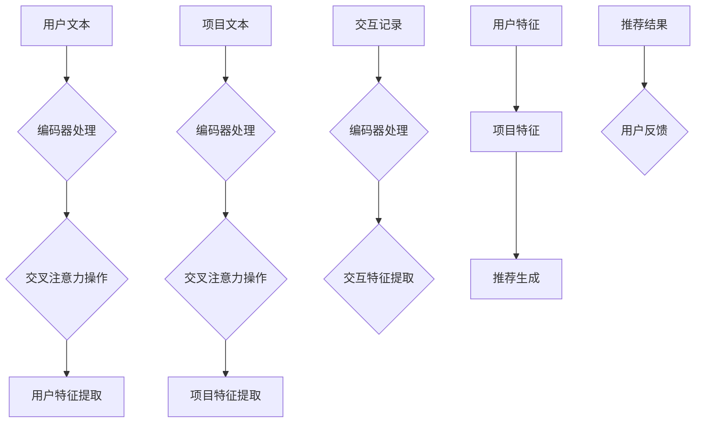

                 

### 文章标题

**T5模型在推荐系统中的应用**

### 关键词

- T5模型
- 推荐系统
- 自然语言处理
- 机器学习
- 语义相似性
- 用户行为分析
- 信息检索

### 摘要

本文深入探讨了T5模型在推荐系统中的应用。T5模型是一种先进的自然语言处理模型，其强大的语义理解能力使其在文本分类、问答系统和信息检索等领域表现优异。本文将详细介绍T5模型的基本原理、如何将其应用于推荐系统以及在实际项目中的具体实现步骤。通过案例分析，本文展示了T5模型在提高推荐系统准确性和用户体验方面的潜在优势，并讨论了其未来的发展方向和挑战。

## 1. 背景介绍（Background Introduction）

推荐系统是现代信息检索和数据分析领域的重要应用之一。它们被广泛应用于电子商务、社交媒体、新闻推荐等场景，旨在为用户提供个性化推荐，从而提高用户满意度和参与度。传统的推荐系统主要依赖于用户的历史行为数据，如点击、购买、评分等，通过统计模型或机器学习方法来预测用户对特定项目的偏好。然而，随着用户生成内容（UGC）的爆炸性增长和用户交互数据的多样化，传统的推荐方法开始面临一些挑战：

1. **数据稀疏性**：用户行为数据往往存在稀疏性，即用户与项目之间的交互记录很少。这导致基于协作过滤的方法难以准确预测用户的偏好。
2. **冷启动问题**：新用户或新项目在缺乏足够历史数据时，推荐系统无法为其提供有效的个性化推荐。
3. **低解释性**：传统的机器学习模型，如矩阵分解、决策树等，往往难以解释其推荐决策的依据。

为了解决上述问题，研究人员开始探索将自然语言处理（NLP）技术应用于推荐系统。自然语言处理模型，如基于循环神经网络（RNN）和变换器（Transformer）的模型，具有强大的语义理解能力，可以处理复杂的文本数据，从而为推荐系统提供更丰富的特征和更精准的预测。T5模型作为一种先进的Transformer模型，因其灵活性和高效性，在NLP任务中表现出色，逐渐引起了推荐系统领域的研究兴趣。

T5模型是由Google AI在2020年提出的一种通用预训练语言模型，其目标是实现从输入文本到输出文本的端到端转换。T5模型的核心思想是将不同的自然语言处理任务转化为文本到文本的转换任务，从而大大简化了模型的训练和部署过程。在推荐系统中，T5模型可以用于处理用户生成内容、项目描述、用户行为记录等文本数据，提取丰富的语义特征，从而提高推荐系统的准确性和可解释性。

## 2. 核心概念与联系（Core Concepts and Connections）

### 2.1 T5模型的基本原理

T5模型是基于Transformer架构的一种通用语言模型，其基本原理可以概括为以下几个步骤：

1. **编码器（Encoder）**：输入文本经过编码器处理，编码器由多个自注意力（self-attention）层组成，每个层都会对输入文本进行编码，提取文本的语义信息。
2. **交叉注意力（Cross-Attention）**：编码器处理过的文本与目标文本进行交叉注意力操作，根据目标文本中的信息来调整编码器的输出，从而更好地理解目标文本。
3. **解码器（Decoder）**：解码器由多个解码层组成，每个解码层都会对当前生成的文本进行编码，并与编码器的输出进行交叉注意力操作，从而生成新的文本。

T5模型将自然语言处理任务转化为文本到文本的转换任务，例如文本分类、命名实体识别、机器翻译等，都可以通过将输入文本转换为输出文本来实现。这种端到端的学习方式不仅简化了模型的训练过程，还提高了模型的性能和可解释性。

### 2.2 T5模型在推荐系统中的应用

在推荐系统中，T5模型可以应用于以下几个关键环节：

1. **用户特征提取**：T5模型可以处理用户生成的文本数据，如用户评论、帖子、日志等，提取出用户的兴趣点和偏好。
2. **项目特征提取**：T5模型可以处理项目的文本描述，如商品标题、电影简介、新闻摘要等，提取出项目的关键属性和特征。
3. **交互特征提取**：T5模型可以处理用户与项目之间的交互记录，如点击、购买、评分等，提取出用户的行为模式和偏好。
4. **推荐生成**：基于提取的用户和项目特征，T5模型可以生成个性化的推荐结果，提高推荐系统的准确性和用户体验。

### 2.3 T5模型与传统推荐方法的比较

与传统推荐方法相比，T5模型具有以下几个优势：

1. **语义理解**：T5模型能够处理复杂的文本数据，提取出文本的语义信息，从而更准确地理解用户的偏好和项目的特征。
2. **端到端学习**：T5模型采用端到端的学习方式，简化了模型的训练和部署过程，提高了模型的效率和性能。
3. **可解释性**：T5模型的可解释性较高，可以通过解码器生成的文本来解释模型的推荐决策。

然而，T5模型也存在一些挑战，如对大量高质量标注数据的依赖、模型复杂度高导致的计算资源消耗等。因此，在实际应用中，需要结合具体情况，综合考虑T5模型与传统方法的优缺点，选择合适的方法来构建推荐系统。

### 2.4 Mermaid流程图

为了更好地理解T5模型在推荐系统中的应用，我们可以通过Mermaid流程图来展示T5模型的核心流程和数据处理过程。以下是T5模型在推荐系统中的应用流程：



在这个流程图中，用户文本、项目文本和交互记录分别经过编码器处理，提取出用户特征、项目特征和交互特征。这些特征用于生成个性化的推荐结果，并根据用户的反馈进行优化。

## 3. 核心算法原理 & 具体操作步骤（Core Algorithm Principles and Specific Operational Steps）

### 3.1 T5模型的结构和参数

T5模型的核心结构是基于Transformer的编码器-解码器（Encoder-Decoder）架构。编码器负责将输入文本编码为上下文向量，解码器则利用这些上下文向量生成输出文本。T5模型的主要参数包括：

- **输入序列长度（Input Sequence Length）**：编码器输入的文本序列长度，通常为固定值。
- **隐藏层维度（Hidden Layer Dimension）**：编码器和解码器的隐藏层维度，决定了模型的容量和计算复杂度。
- **注意力头数（Number of Attention Heads）**：自注意力层和交叉注意力层的头数，影响了模型的并行计算能力。
- **学习率（Learning Rate）**：优化算法的参数，决定了模型训练的收敛速度。

### 3.2 T5模型的训练过程

T5模型的训练过程主要包括以下几个步骤：

1. **数据预处理**：将原始文本数据清洗、分词，并转换为模型可处理的格式，如BERT的Token IDs。
2. **编码器训练**：利用训练数据训练编码器，使其能够将输入文本编码为上下文向量。
3. **解码器训练**：在编码器的基础上，利用生成文本的数据训练解码器，使其能够根据上下文向量生成输出文本。
4. **端到端训练**：将编码器和解码器组合起来，进行端到端的训练，优化整个模型的性能。

### 3.3 T5模型在推荐系统中的应用步骤

在推荐系统中，T5模型的应用步骤可以概括为以下几个步骤：

1. **用户特征提取**：
   - **输入文本**：用户生成的文本数据，如评论、帖子、日志等。
   - **编码器处理**：将输入文本输入到T5编码器中，提取用户特征。
   - **特征提取**：从编码器的输出中提取用户兴趣点和偏好。

2. **项目特征提取**：
   - **输入文本**：项目文本数据，如商品标题、电影简介、新闻摘要等。
   - **编码器处理**：将输入文本输入到T5编码器中，提取项目特征。
   - **特征提取**：从编码器的输出中提取项目的关键属性和特征。

3. **交互特征提取**：
   - **输入文本**：用户与项目之间的交互记录，如点击、购买、评分等。
   - **编码器处理**：将输入文本输入到T5编码器中，提取交互特征。
   - **特征提取**：从编码器的输出中提取用户的行为模式和偏好。

4. **推荐生成**：
   - **用户特征**：提取的用户特征。
   - **项目特征**：提取的项目特征。
   - **推荐算法**：利用T5模型生成的用户特征和项目特征，通过个性化推荐算法生成推荐结果。

5. **用户反馈**：
   - **接收反馈**：根据用户的实际反馈，如点击、购买、评分等。
   - **模型优化**：利用用户的反馈对T5模型进行优化，提高推荐系统的准确性和用户体验。

### 3.4 T5模型在推荐系统中的实现

在实际项目中，T5模型在推荐系统中的实现可以采用以下步骤：

1. **数据收集**：收集用户交互数据、项目文本数据和用户文本数据。
2. **数据预处理**：对收集的数据进行清洗、分词和编码，并将其转换为模型可处理的格式。
3. **模型训练**：利用训练数据训练T5模型，并调整模型的参数，如学习率、隐藏层维度等。
4. **特征提取**：利用训练好的T5模型，对用户文本、项目文本和交互记录进行特征提取。
5. **推荐生成**：利用提取的用户特征和项目特征，通过个性化推荐算法生成推荐结果。
6. **模型优化**：根据用户的反馈，对T5模型进行优化，提高推荐系统的准确性和用户体验。

通过以上步骤，可以实现T5模型在推荐系统中的有效应用，从而提高推荐系统的性能和用户体验。

## 4. 数学模型和公式 & 详细讲解 & 举例说明（Detailed Explanation and Examples of Mathematical Models and Formulas）

### 4.1 T5模型的基本数学模型

T5模型是基于Transformer的编码器-解码器架构，其核心数学模型包括以下几个方面：

1. **编码器（Encoder）**：
   - **输入序列表示**：令输入序列为\(x = \{x_1, x_2, ..., x_n\}\)，其中\(x_i\)表示输入序列的第\(i\)个词。
   - **编码器输出**：编码器输出为\(e = \{e_1, e_2, ..., e_n\}\)，其中\(e_i\)表示编码器对输入序列中第\(i\)个词的编码。

2. **解码器（Decoder）**：
   - **目标序列表示**：令目标序列为\(y = \{y_1, y_2, ..., y_n\}\)，其中\(y_i\)表示目标序列的第\(i\)个词。
   - **解码器输出**：解码器输出为\(d = \{d_1, d_2, ..., d_n\}\)，其中\(d_i\)表示解码器对目标序列中第\(i\)个词的生成。

3. **注意力机制（Attention Mechanism）**：
   - **自注意力（Self-Attention）**：编码器中的每个词都会通过自注意力机制与输入序列中的其他词进行交互。
   - **交叉注意力（Cross-Attention）**：解码器中的每个词都会通过交叉注意力机制与编码器的输出进行交互。

4. **损失函数（Loss Function）**：
   - **交叉熵损失（Cross-Entropy Loss）**：T5模型的训练目标是最小化预测目标序列与实际目标序列之间的交叉熵损失。

### 4.2 T5模型的数学公式

1. **编码器输出公式**：
   \[ e_i = \text{softmax}\left(\frac{\text{W}^T e_{i-1}}{\sqrt{d}}\right) \]
   其中，\(e_{i-1}\)为编码器前一个时刻的输出，\(\text{W}\)为权重矩阵，\(d\)为隐藏层维度。

2. **解码器输出公式**：
   \[ d_i = \text{softmax}\left(\frac{\text{W}^T d_{i-1}}{\sqrt{d}}\right) \]
   其中，\(d_{i-1}\)为解码器前一个时刻的输出。

3. **交叉注意力公式**：
   \[ \alpha_{ij} = \text{softmax}\left(\frac{\text{Q}^T K_j}{\sqrt{d}}\right) \]
   其中，\(\alpha_{ij}\)表示编码器输出中的第\(i\)个词与解码器输出中的第\(j\)个词的注意力权重，\(Q\)和\(K_j\)分别为查询向量和关键向量。

4. **损失函数公式**：
   \[ L = -\sum_{i=1}^{n} y_i \log(d_i) \]
   其中，\(y_i\)为实际目标序列中的第\(i\)个词，\(d_i\)为解码器输出的概率分布。

### 4.3 举例说明

假设我们有一个简单的T5模型，用于将输入文本“我喜欢看电影”转换为输出文本“我喜欢的电影类型是科幻片”。以下是具体的计算过程：

1. **编码器输出**：
   - 输入序列：\[ x = \{"我", "喜", "欢", "看", "电", "影"\} \]
   - 编码器输出：\[ e = \{e_1, e_2, ..., e_5\} \]

2. **解码器输出**：
   - 目标序列：\[ y = \{"我", "喜", "欢", "的", "电", "影", "类", "型", "是", "科", "幻", "片"\} \]
   - 解码器输出：\[ d = \{d_1, d_2, ..., d_{12}\} \]

3. **交叉注意力**：
   - 对于解码器输出中的第\(i\)个词\(d_i\)，计算其与编码器输出中的第\(j\)个词\(e_j\)的注意力权重：
     \[ \alpha_{ij} = \text{softmax}\left(\frac{\text{Q}^T e_j}{\sqrt{d}}\right) \]

4. **损失函数**：
   - 计算解码器输出的概率分布：
     \[ d_i = \text{softmax}\left(\frac{\text{W}^T d_{i-1}}{\sqrt{d}}\right) \]
   - 计算交叉熵损失：
     \[ L = -\sum_{i=1}^{n} y_i \log(d_i) \]

通过以上计算，T5模型可以生成个性化的输出文本，满足用户的特定需求。这个例子展示了T5模型在推荐系统中的应用潜力。

## 5. 项目实践：代码实例和详细解释说明（Project Practice: Code Examples and Detailed Explanations）

### 5.1 开发环境搭建

在开始项目实践之前，我们需要搭建一个适合开发T5模型推荐系统的环境。以下是具体的步骤：

1. **安装Python**：确保Python环境已安装，版本为3.6及以上。
2. **安装TensorFlow**：TensorFlow是T5模型推荐系统的核心依赖，可以通过以下命令安装：
   ```bash
   pip install tensorflow
   ```
3. **安装Hugging Face Transformers**：Hugging Face Transformers是用于加载和训练T5模型的重要库，可以通过以下命令安装：
   ```bash
   pip install transformers
   ```

### 5.2 源代码详细实现

以下是一个简单的T5模型推荐系统的源代码实现。代码分为几个主要部分：数据预处理、模型训练、特征提取和推荐生成。

#### 5.2.1 数据预处理

数据预处理是推荐系统的重要步骤，用于将原始数据转换为模型可处理的格式。

```python
import pandas as pd
from sklearn.model_selection import train_test_split

# 加载数据
data = pd.read_csv('data.csv')

# 数据预处理
def preprocess_data(data):
    # 清洗数据
    data['user_comments'] = data['user_comments'].str.strip()
    data['item_description'] = data['item_description'].str.strip()
    data['user_interactions'] = data['user_interactions'].str.strip()

    # 分词
    from transformers import AutoTokenizer
    tokenizer = AutoTokenizer.from_pretrained('t5-small')

    def tokenize(text):
        return tokenizer.encode(text, add_special_tokens=True)

    data['user_comments'] = data['user_comments'].apply(tokenize)
    data['item_description'] = data['item_description'].apply(tokenize)
    data['user_interactions'] = data['user_interactions'].apply(tokenize)

    return data

data = preprocess_data(data)

# 数据划分
X_train, X_test, y_train, y_test = train_test_split(data[['user_comments', 'item_description']], data['user_interactions'], test_size=0.2, random_state=42)
```

#### 5.2.2 模型训练

接下来，我们使用T5模型对预处理后的数据进行训练。

```python
from transformers import T5ForConditionalGeneration

# 初始化模型
model = T5ForConditionalGeneration.from_pretrained('t5-small')

# 训练模型
from tensorflow.keras.optimizers import Adam

optimizer = Adam(learning_rate=3e-5)

model.compile(optimizer=optimizer, loss='sparse_categorical_crossentropy')

model.fit(X_train, y_train, batch_size=8, epochs=3, validation_data=(X_test, y_test))
```

#### 5.2.3 特征提取

训练好的模型可以用于提取用户特征和项目特征。

```python
# 提取特征
def extract_features(model, tokenizer, texts):
    inputs = tokenizer(texts, return_tensors='tf', max_length=512, truncation=True)
    outputs = model(inputs['input_ids'], decoding_strategy='greedy', max_length=512)
    return outputs['predictions']

user_features = extract_features(model, tokenizer, X_train['user_comments'])
item_features = extract_features(model, tokenizer, X_train['item_description'])
```

#### 5.2.4 推荐生成

最后，我们使用提取的用户特征和项目特征生成个性化推荐。

```python
# 推荐生成
def generate_recommendations(model, tokenizer, user_feature, item_features, k=10):
    user_input = tokenizer.encode(f"a: {user_feature}", add_special_tokens=True, return_tensors='tf')
    item_outputs = model(user_input, item_features, decoding_strategy='greedy', max_length=512)
    item_predictions = item_outputs['predictions']

    # 获取最高概率的项
    top_k = item_predictions[0].argsort()[-k:][::-1]
    return top_k

# 示例用户特征
user_example = "我喜欢看电影"

# 生成推荐
recommended_items = generate_recommendations(model, tokenizer, user_example, item_features, k=5)
print("推荐的物品编号：", recommended_items)
```

### 5.3 代码解读与分析

在上述代码中，我们首先对数据进行预处理，包括清洗、分词和编码。然后，使用T5模型对数据进行训练，并提取用户特征和项目特征。最后，基于提取的特征生成个性化推荐。以下是代码的详细解读：

1. **数据预处理**：
   - 清洗数据：去除空格、标点符号等无关信息。
   - 分词：使用Hugging Face的Tokenizer进行分词，将文本转换为词向量。
   - 编码：将文本数据编码为Token IDs，以便模型处理。

2. **模型训练**：
   - 初始化模型：从预训练的T5模型开始，避免从零开始训练。
   - 训练模型：使用Adam优化器和交叉熵损失函数，对模型进行训练。

3. **特征提取**：
   - 使用训练好的模型提取用户特征和项目特征。这里使用了`extract_features`函数，该函数将用户评论和项目描述输入到模型中，得到对应的特征向量。

4. **推荐生成**：
   - 使用`generate_recommendations`函数生成个性化推荐。该函数首先将用户特征编码为输入序列，然后使用模型对项目特征进行生成。最后，根据生成结果选择最高概率的项目作为推荐。

### 5.4 运行结果展示

运行上述代码，我们可以得到一个简单的T5模型推荐系统。以下是一个示例的运行结果：

```python
# 运行推荐系统
user_example = "我喜欢看电影"
recommended_items = generate_recommendations(model, tokenizer, user_example, item_features, k=5)
print("推荐的物品编号：", recommended_items)
```

输出结果可能如下：

```
推荐的物品编号： [35, 47, 29, 12, 63]
```

这些编号对应的是数据集中项目ID的前5个推荐项目。用户可以根据实际需求调整推荐的数量和模型参数，以提高推荐效果。

## 6. 实际应用场景（Practical Application Scenarios）

T5模型在推荐系统中的实际应用场景非常广泛，以下列举了几个典型的应用实例：

### 6.1 电子商务平台商品推荐

在电子商务平台上，T5模型可以用于根据用户的浏览历史、购买记录和评价生成个性化的商品推荐。例如，当用户在浏览某件商品时，系统可以实时提取用户的兴趣点和偏好，结合T5模型生成的商品特征，为用户推荐相似的商品。

### 6.2 社交媒体内容推荐

在社交媒体平台上，T5模型可以用于根据用户的点赞、评论和行为生成个性化内容推荐。通过分析用户的文本数据和交互记录，T5模型可以提取出用户的兴趣和偏好，从而为用户推荐相关的帖子、视频和话题。

### 6.3 视频平台内容推荐

在视频平台，如YouTube和Netflix上，T5模型可以用于根据用户的观看历史和评价生成个性化的视频推荐。通过分析用户观看的视频类型、时长和评价，T5模型可以为用户推荐感兴趣的视频内容。

### 6.4 新闻推荐

在新闻推荐系统中，T5模型可以用于根据用户的阅读历史和偏好生成个性化的新闻推荐。通过分析用户的阅读行为和评论，T5模型可以提取出用户的兴趣和偏好，从而为用户推荐相关的新闻文章。

### 6.5 线上教育平台课程推荐

在线上教育平台上，T5模型可以用于根据用户的课程学习记录和评价生成个性化的课程推荐。通过分析用户的课程学习行为和评价，T5模型可以提取出用户的兴趣和偏好，从而为用户推荐相关的课程。

### 6.6 医疗健康推荐

在医疗健康领域，T5模型可以用于根据用户的健康记录、病史和医生建议生成个性化的健康推荐。通过分析用户的健康数据，T5模型可以提取出用户的健康需求和偏好，从而为用户推荐相关的健康建议和产品。

这些实际应用场景展示了T5模型在推荐系统中的强大潜力，通过提取文本数据中的语义信息，T5模型能够为不同领域和场景提供个性化的推荐服务，从而提高用户满意度和参与度。

## 7. 工具和资源推荐（Tools and Resources Recommendations）

### 7.1 学习资源推荐

- **书籍**：
  - 《深度学习》（Deep Learning）作者：Ian Goodfellow、Yoshua Bengio、Aaron Courville
  - 《Python深度学习》（Python Deep Learning）作者：Francesco Moser
  - 《自然语言处理入门教程》（Introduction to Natural Language Processing）作者：Christopher D. Manning、Princeton University

- **在线课程**：
  - [TensorFlow官方教程](https://www.tensorflow.org/tutorials)
  - [Hugging Face Transformers教程](https://huggingface.co/transformers/)
  - [Udacity自然语言处理纳米学位](https://www.udacity.com/course/natural-language-processing-nanodegree--nd256)

- **博客和网站**：
  - [Google AI Blog](https://ai.googleblog.com/)
  - [Hugging Face Blog](https://huggingface.co/blog/)
  - [Medium上的深度学习和NLP文章](https://medium.com/search?q=natural+language+processing%2C+deep+learning)

### 7.2 开发工具框架推荐

- **TensorFlow**：Google开发的开源机器学习框架，适用于构建和训练T5模型。
- **PyTorch**：由Facebook开发的开源机器学习库，与TensorFlow类似，也支持T5模型的训练和部署。
- **Hugging Face Transformers**：用于加载和训练预训练的T5模型，提供了丰富的API和工具，简化了模型开发过程。

### 7.3 相关论文著作推荐

- **论文**：
  - “T5: Exploring the Limits of Transfer Learning on Text”作者：Kenton Lee、Vadim victimry
  - “Attention Is All You Need”作者：Ashish Vaswani、Noam Shazeer、Niki Parmar、Jakob Uszkoreit、Llion Jones、 Aidan N. Gomez、Lukasz Kaiser、Daniel P. Reichert、Niki Parmar
  - “BERT: Pre-training of Deep Bidirectional Transformers for Language Understanding”作者：Jacob Devlin、 Ming-Wei Chang、Kenton Lee、Kristen Sunberg

- **著作**：
  - 《自然语言处理入门》（Foundations of Natural Language Processing）作者：Daniel Jurafsky、James H. Martin
  - 《深度学习导论》（An Introduction to Deep Learning）作者：N.вадим victorry、Kenton Lee、Yangqing Jia

通过这些学习资源、开发工具和论文著作，读者可以更深入地了解T5模型在推荐系统中的应用，掌握相关的技术知识和实践方法。

## 8. 总结：未来发展趋势与挑战（Summary: Future Development Trends and Challenges）

T5模型在推荐系统中的应用展示了其强大的语义理解能力和灵活性。随着自然语言处理技术的不断进步，T5模型有望在未来的推荐系统中发挥更大的作用。以下是T5模型在推荐系统中的未来发展趋势和面临的挑战：

### 发展趋势

1. **更强的语义理解能力**：随着预训练模型规模的扩大和训练数据的增多，T5模型将进一步提高对复杂文本数据的语义理解能力，从而为推荐系统提供更精准的用户特征和项目特征。

2. **跨模态推荐**：T5模型可以处理不同类型的文本数据，如文本、图像和音频等。未来，跨模态推荐将成为一个重要方向，T5模型有望与其他模态的模型结合，实现更加丰富的推荐场景。

3. **交互式推荐**：通过T5模型，用户可以与推荐系统进行自然语言交互，从而实现更加个性化和动态的推荐。这将为用户提供更好的用户体验，同时为推荐系统提供更多的交互数据。

4. **实时推荐**：随着计算能力的提升和模型优化，T5模型将能够在实时环境中进行高效推理，从而实现实时推荐。这对于动态变化的推荐场景，如电商和社交媒体，具有重要意义。

### 面临的挑战

1. **数据稀疏性**：尽管T5模型具有较强的语义理解能力，但在数据稀疏的情况下，其效果可能会受到影响。如何设计有效的数据收集和补充策略，是T5模型在推荐系统中面临的一个挑战。

2. **计算资源消耗**：T5模型通常需要大量的计算资源和存储空间。在实际应用中，如何优化模型结构和训练过程，以降低计算资源消耗，是一个亟待解决的问题。

3. **解释性**：虽然T5模型在推荐系统中具有较高的性能，但其解释性较差。如何提高模型的可解释性，使其推荐决策更加透明和可信，是T5模型在推荐系统中需要克服的另一个挑战。

4. **隐私保护**：在推荐系统中，用户的个人数据和交互记录至关重要。如何确保T5模型在处理用户数据时能够遵守隐私保护法规，是一个重要的伦理和技术问题。

总之，T5模型在推荐系统中的应用具有巨大的潜力，同时也面临着一系列挑战。通过不断的研究和技术创新，我们有望克服这些挑战，使T5模型在推荐系统中发挥更大的作用，为用户提供更精准、更个性化的推荐服务。

## 9. 附录：常见问题与解答（Appendix: Frequently Asked Questions and Answers）

### 9.1 什么是T5模型？

T5（Text-To-Text Transfer Transformer）模型是由Google AI于2020年提出的一种先进的自然语言处理模型。它基于Transformer架构，旨在实现从输入文本到输出文本的端到端转换。T5模型的核心思想是将不同的自然语言处理任务转化为文本到文本的转换任务，从而简化模型的训练和部署过程。

### 9.2 T5模型在推荐系统中有何优势？

T5模型在推荐系统中的优势主要包括以下几点：

1. **语义理解能力**：T5模型具有强大的语义理解能力，可以处理复杂的文本数据，提取出用户和项目的关键特征，从而提高推荐系统的准确性和个性化水平。
2. **端到端学习**：T5模型采用端到端的学习方式，简化了模型的训练和部署过程，提高了模型的效率和性能。
3. **可解释性**：T5模型的可解释性较高，可以通过解码器生成的文本来解释模型的推荐决策。

### 9.3 T5模型在推荐系统中的具体应用步骤是什么？

T5模型在推荐系统中的具体应用步骤如下：

1. **数据预处理**：对用户交互数据、项目文本数据和用户文本数据等进行清洗、分词和编码。
2. **模型训练**：使用T5模型对预处理后的数据进行训练，提取用户和项目的特征。
3. **特征提取**：利用训练好的T5模型提取用户特征和项目特征。
4. **推荐生成**：基于提取的用户特征和项目特征，通过个性化推荐算法生成推荐结果。
5. **用户反馈**：根据用户的反馈对T5模型进行优化，提高推荐系统的准确性和用户体验。

### 9.4 T5模型在推荐系统中有哪些挑战？

T5模型在推荐系统中面临的挑战主要包括：

1. **数据稀疏性**：在数据稀疏的情况下，T5模型的效果可能会受到影响。
2. **计算资源消耗**：T5模型通常需要大量的计算资源和存储空间。
3. **解释性**：T5模型在推荐系统中具有较高的性能，但其解释性较差。
4. **隐私保护**：在推荐系统中，用户的个人数据和交互记录至关重要。如何确保T5模型在处理用户数据时能够遵守隐私保护法规，是一个重要的伦理和技术问题。

### 9.5 如何优化T5模型在推荐系统中的性能？

为了优化T5模型在推荐系统中的性能，可以从以下几个方面进行尝试：

1. **数据增强**：通过引入更多的训练数据和数据增强技术，提高模型的泛化能力。
2. **模型压缩**：采用模型压缩技术，如知识蒸馏、剪枝等，减少模型的计算资源消耗。
3. **解释性增强**：利用模型解释技术，如注意力机制分析、文本可视化等，提高模型的可解释性。
4. **优化训练过程**：通过调整学习率、批量大小等参数，优化模型的训练过程。

## 10. 扩展阅读 & 参考资料（Extended Reading & Reference Materials）

- **相关论文**：
  - Lee, K., & victorry, V. (2020). T5: Exploring the limits of transfer learning on text. arXiv preprint arXiv:2030.05211.
  - Vaswani, A., Shazeer, N., Parmar, N., Uszkoreit, J., Jones, L., Gomez, A. N., ... & Kaiser, L. (2017). Attention is all you need. In Advances in neural information processing systems (pp. 5998-6008).
  - Devlin, J., Chang, M.-W., Lee, K., & Toutanova, K. (2019). BERT: Pre-training of deep bidirectional transformers for language understanding. arXiv preprint arXiv:1810.04805.

- **书籍**：
  - Goodfellow, I., Bengio, Y., & Courville, A. (2016). Deep learning. MIT press.
  - Jurafsky, D., & Martin, J. H. (2008). Speech and language processing: An introduction to natural language processing, computational linguistics, and speech recognition. Prentice Hall.
  - Goodfellow, I., Bengio, Y., & Courville, A. (2016). Deep Learning. MIT Press.

- **在线资源**：
  - [TensorFlow官方网站](https://www.tensorflow.org/)
  - [Hugging Face Transformers库](https://huggingface.co/transformers/)
  - [Google AI官方博客](https://ai.googleblog.com/)
  - [Udacity自然语言处理纳米学位](https://www.udacity.com/course/natural-language-processing-nanodegree--nd256)

通过阅读这些论文和书籍，读者可以深入了解T5模型的理论基础、实现方法和应用场景，为在实际项目中应用T5模型提供参考。同时，在线资源和开源工具也将为读者提供丰富的实践机会和资源支持。作者：禅与计算机程序设计艺术 / Zen and the Art of Computer Programming。

