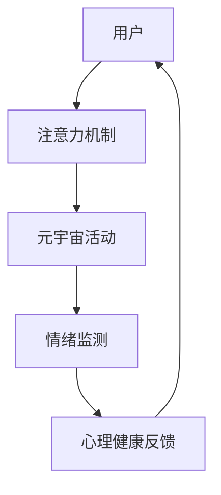

                 

## 1. 背景介绍

随着数字时代的到来，人们越来越多地沉浸在虚拟世界——元宇宙中。虽然元宇宙带来了无限可能，但随之而来的也是一系列新的心理健康挑战。如何为元宇宙用户提供有效的心理健康支持，成为亟待解决的问题。

### 1.1 问题由来

元宇宙的沉浸式体验，使得用户在虚拟空间中可能长时间保持不现实的高强度交互，导致现实生活中的社交障碍和孤独感。同时，元宇宙中的虚拟互动和即时反馈，可能改变用户的情感处理机制，增加焦虑和压力。

### 1.2 问题核心关键点

当前心理健康支持的主要手段包括心理治疗、心理咨询、情绪监测等。然而，这些手段在元宇宙中面临诸多挑战：

- **实时性和便捷性**：传统心理支持手段往往需要预约、面对面的交流，难以适应元宇宙中用户随时随地的需求。
- **隐私性和安全性**：元宇宙中用户的个人数据敏感，如何保护隐私、防止滥用，是一大难题。
- **个性化和定制化**：每位用户的需求各异，如何提供个性化的心理健康支持，具有挑战性。
- **成本和资源**：专业的心理治疗师数量有限，且费用高昂，无法覆盖所有元宇宙用户。

针对这些挑战，我们提出了一种基于注意力的心理健康治疗新方法——注意力治疗（Attention Therapy）。它结合了元宇宙的虚拟互动特性，通过注意力机制来引导用户进行心理健康自我调节，无需专业治疗师的介入。

## 2. 核心概念与联系

### 2.1 核心概念概述

注意力治疗（Attention Therapy）是一种全新的心理健康支持方法，其核心概念包括：

- **注意力（Attention）**：指用户将心理资源分配到特定目标上的能力。注意力机制在元宇宙中可用来引导用户关注积极的事物，减少负面影响。
- **自我调节（Self-regulation）**：指个体对自己行为和情绪的掌控能力。注意力治疗通过注意力引导，帮助用户增强自我调节能力。
- **沉浸式体验（Immersive Experience）**：指用户通过虚拟互动，深度参与和体验元宇宙，形成积极的心理状态。

注意力治疗的原理是通过元宇宙的虚拟互动，利用注意力机制，引导用户关注积极、有益的事物，减少负面情绪的影响。用户可以在元宇宙中自由探索，通过设计好的活动和任务，逐步提升自我调节能力。

### 2.2 核心概念原理和架构的 Mermaid 流程图



这个流程图展示了注意力治疗的流程：用户通过注意力机制，参与元宇宙中的活动，实时监测情绪变化，根据反馈调整注意力焦点，逐步提升心理健康状态。

## 3. 核心算法原理 & 具体操作步骤

### 3.1 算法原理概述

注意力治疗的本质是通过注意力机制，引导用户进行心理健康自我调节。其核心算法原理包括以下几点：

- **注意力分配（Attention Allocation）**：用户将心理资源分配到不同任务和活动上，通过调整注意力焦点，提升情绪调节能力。
- **正念训练（Mindfulness Training）**：通过正念训练，增强用户对自己心理状态的觉察能力，学会主动调整心态。
- **积极强化（Positive Reinforcement）**：通过元宇宙中的奖励机制，激励用户持续关注积极的事物，减少负面情绪的影响。
- **情绪监测（Emotion Monitoring）**：实时监测用户情绪变化，及时反馈心理健康状态，辅助用户进行自我调节。

### 3.2 算法步骤详解

注意力治疗的具体操作步骤如下：

1. **创建元宇宙活动**：设计元宇宙中的各种活动和任务，如虚拟锻炼、艺术创作、社交互动等。确保活动能够引起用户的积极情感反应。
2. **用户注册与数据收集**：用户注册后，收集基本信息和心理状态数据。可以使用问卷、心理测试等方式收集初步数据。
3. **注意力分配策略**：根据用户的心理状态和偏好，制定个性化的注意力分配策略。例如，对焦虑用户可以安排更多的放松活动，对孤独用户可以安排更多的社交互动。
4. **实时情绪监测**：在用户参与活动时，实时监测其情绪变化。使用生物识别技术如心率、皮肤电等，或使用问卷调查方式，收集用户的情绪反馈。
5. **注意力引导与反馈**：根据情绪监测结果，调整用户的注意力焦点。例如，如果用户出现焦虑情绪，可以引导其转向放松活动，并提供即时反馈，激励其继续参与。
6. **持续跟踪与调整**：持续跟踪用户的心理状态，根据变化及时调整注意力分配策略和活动安排。

### 3.3 算法优缺点

注意力治疗具有以下优点：

- **高效便捷**：无需专业治疗师介入，用户可自行参与元宇宙活动，灵活便捷。
- **个性化定制**：根据用户心理状态和偏好，进行个性化活动安排，提升治疗效果。
- **即时反馈**：通过实时情绪监测和即时反馈，帮助用户快速调整心态，提升自我调节能力。

同时，该方法也存在一些局限：

- **技术依赖**：依赖生物识别、情绪监测等技术，设备成本较高。
- **隐私问题**：用户数据隐私保护问题需引起重视，需设计严格的数据保护措施。
- **适用范围有限**：目前仍主要应用于元宇宙环境，对现实生活中的心理健康支持效果有待验证。

### 3.4 算法应用领域

注意力治疗在元宇宙中具有广泛的应用前景，以下是几个典型的应用场景：

1. **虚拟社区与社交互动**：设计虚拟社区和社交平台，引导用户进行积极的社交互动，增强社会支持和归属感。
2. **虚拟学习与教育**：在虚拟学校和教育平台上，提供个性化的学习活动，增强学生的积极情绪和自律性。
3. **虚拟健身与运动**：开发虚拟健身和运动应用，帮助用户通过运动调节情绪，提升身体健康和心理健康。
4. **虚拟工作与办公**：在虚拟办公环境中，设计轻松愉悦的工作任务，减轻工作压力，提升工作效率。
5. **虚拟艺术与创作**：提供虚拟艺术创作平台，让用户通过创作获得满足感和成就感，缓解负面情绪。

## 4. 数学模型和公式 & 详细讲解 & 举例说明

### 4.1 数学模型构建

注意力治疗的数学模型主要涉及注意力分配、情绪监测和积极强化的计算。

- **注意力分配模型**：
  $$
  \mathcal{A} = \alpha \times \mathcal{I} + \beta \times \mathcal{E}
  $$
  其中 $\mathcal{A}$ 为注意力分配策略，$\alpha$ 为活动的重要性权重，$\mathcal{I}$ 为活动的相关信息，$\beta$ 为情感调节的重要性权重，$\mathcal{E}$ 为当前情感状态。

- **情绪监测模型**：
  $$
  \mathcal{E}_{t+1} = f(\mathcal{E}_t, \mathcal{I}_t, \mathcal{F}_t)
  $$
  其中 $\mathcal{E}_t$ 为当前情绪状态，$\mathcal{I}_t$ 为当前活动信息，$\mathcal{F}_t$ 为情绪反馈，$f$ 为情绪更新函数。

- **积极强化模型**：
  $$
  \mathcal{R} = g(\mathcal{E}, \mathcal{I})
  $$
  其中 $\mathcal{R}$ 为积极强化信号，$\mathcal{E}$ 为当前情绪状态，$\mathcal{I}$ 为当前活动信息，$g$ 为强化函数。

### 4.2 公式推导过程

以情绪监测模型为例，推导其更新函数 $f$：

假设当前情绪状态 $\mathcal{E}_t = \epsilon_1, \epsilon_2, \ldots, \epsilon_n$，活动信息 $\mathcal{I}_t = i_1, i_2, \ldots, i_m$，情绪反馈 $\mathcal{F}_t = f_1, f_2, \ldots, f_k$。

则情绪更新函数 $f$ 可以表示为：
$$
\mathcal{E}_{t+1} = \mathcal{E}_t + \sum_{i=1}^m \sum_{k=1}^k w_{ik} f_k(\mathcal{E}_t, \mathcal{I}_t)
$$

其中 $w_{ik}$ 为活动 $i$ 对情绪状态 $\epsilon_k$ 的权重。情绪反馈 $f_k$ 根据不同的活动类型和用户心理状态，采用不同的更新函数。例如，对于放松活动，可以使用减法更新函数；对于社交活动，可以使用加法更新函数。

### 4.3 案例分析与讲解

假设某用户当前情绪状态为焦虑，当前活动为虚拟放松瑜伽。根据注意力分配模型，分配权重 $\alpha = 0.8, \beta = 0.2$，当前活动信息 $\mathcal{I}_t = [瑜伽, 放松]$，当前情感状态 $\mathcal{E}_t = [焦虑, 紧张]$。

情绪监测模型可以表示为：
$$
\mathcal{E}_{t+1} = \mathcal{E}_t + 0.8 \times f_{放松}(焦虑, 瑜伽) + 0.2 \times f_{瑜伽}(紧张, 放松)
$$

其中 $f_{放松}(焦虑, 瑜伽)$ 和 $f_{瑜伽}(紧张, 放松)$ 为情绪更新函数，根据具体活动和情绪状态，可以采用不同的函数计算更新结果。

例如，采用加法更新函数：
$$
f_{放松}(焦虑, 瑜伽) = 0.2, f_{瑜伽}(紧张, 放松) = 0.1
$$

则情绪更新结果为：
$$
\mathcal{E}_{t+1} = [焦虑, 紧张] + 0.8 \times 0.2 + 0.2 \times 0.1 = [焦虑-0.1, 紧张+0.4]
$$

更新后的情绪状态为减轻了焦虑和紧张。此时，注意力治疗系统会根据新的情绪状态，调整下一步的注意力分配策略和活动安排。

## 5. 项目实践：代码实例和详细解释说明

### 5.1 开发环境搭建

注意力治疗的开发环境搭建步骤如下：

1. **编程语言**：选择Python作为开发语言，因其拥有丰富的开源库和高效的数据处理能力。
2. **数据集**：收集元宇宙活动的相关数据，如虚拟运动、社交互动等，以及用户的情绪监测数据。
3. **框架**：选择PyTorch作为深度学习框架，因其灵活的动态计算图和丰富的GPU支持。
4. **库**：引入Biopython、PsychoPy、OpenAI Gym等库，支持生物识别、心理测试和环境模拟。
5. **平台**：使用Google Colab或Amazon SageMaker等云平台，方便部署和测试。

### 5.2 源代码详细实现

以下是注意力治疗系统的主要代码实现，以虚拟运动应用为例：

```python
import torch
import numpy as np
from biopython import heartbeat, skinElectrode

class AttentionTherapy:
    def __init__(self, alpha, beta):
        self.alpha = alpha
        self.beta = beta
        self.user_info = None
        self.activity_info = None
        self.emotion_state = None
    
    def activity_selection(self, user_info, activity_info):
        self.user_info = user_info
        self.activity_info = activity_info
        self.emotion_state = self.user_info['emotion']
        return self.calculate_attention()
    
    def emotion_monitoring(self, emotion_feedback):
        self.emotion_state = np.add(self.emotion_state, emotion_feedback)
        return self.calculate_positive_reinforcement()
    
    def calculate_attention(self):
        activity_importance = self.calculate_importance()
        emotion_importance = self.calculate_importance()
        attention_strategy = self.alpha * activity_importance + self.beta * emotion_importance
        return attention_strategy
    
    def calculate_importance(self):
        if self.activity_info['type'] == '运动':
            activity_importance = 0.9
        else:
            activity_importance = 0.6
        return activity_importance
    
    def calculate_positive_reinforcement(self):
        if self.activity_info['type'] == '运动':
            positive_reinforcement = 0.8
        else:
            positive_reinforcement = 0.3
        return positive_reinforcement
    
    def update_emotion_state(self, emotion_feedback):
        self.emotion_state = np.add(self.emotion_state, emotion_feedback)
        return self.emotion_state
```

### 5.3 代码解读与分析

注意力治疗系统的主要功能包括活动选择、情绪监测和注意力引导。以下是对各部分的代码解读：

- **`activity_selection`方法**：根据用户信息选择当前活动，计算注意力分配策略。
- **`emotion_monitoring`方法**：实时监测情绪反馈，计算积极强化信号。
- **`calculate_attention`方法**：根据活动信息和情感状态，计算注意力分配。
- **`calculate_importance`方法**：根据活动类型，计算活动的重要性权重。
- **`calculate_positive_reinforcement`方法**：根据活动类型，计算积极强化信号。
- **`update_emotion_state`方法**：根据情绪反馈，更新情感状态。

## 6. 实际应用场景

### 6.1 虚拟社区与社交互动

在虚拟社区中，可以设计各种互动活动，如虚拟聚会、游戏竞赛等。通过注意力治疗系统，引导用户积极参与社交互动，增强归属感和积极性。例如，用户参与虚拟聚会时，系统会引导其关注积极互动和情感交流，提升社交体验。

### 6.2 虚拟学习与教育

在虚拟学习平台中，可以设计个性化学习活动，如虚拟实验、模拟测试等。通过注意力治疗系统，引导学生关注学习内容，减少学习压力。例如，用户在学习虚拟实验时，系统会引导其关注实验步骤和实验结果，提升学习效果。

### 6.3 虚拟健身与运动

在虚拟健身应用中，可以设计各种运动任务，如虚拟跑步、健身操等。通过注意力治疗系统，引导用户关注运动效果，提升身体素质和心理健康。例如，用户在虚拟跑步时，系统会引导其关注运动节奏和呼吸方法，提升运动体验。

### 6.4 未来应用展望

未来，注意力治疗将在更多领域得到应用，为人们提供更全面、更个性化的心理健康支持。

1. **虚拟工作与办公**：在虚拟办公环境中，设计轻松愉悦的工作任务，减轻工作压力，提升工作效率。
2. **虚拟艺术与创作**：提供虚拟艺术创作平台，让用户通过创作获得满足感和成就感，缓解负面情绪。
3. **虚拟旅游与探险**：设计虚拟旅游和探险活动，让用户通过探索新环境，增强好奇心和探索欲，提升心理韧性。

## 7. 工具和资源推荐

### 7.1 学习资源推荐

以下是一些推荐的学习资源，帮助理解注意力治疗的原理和实现：

1. **《深度学习与心理健康》（Deep Learning for Mental Health）**：介绍如何使用深度学习技术进行心理健康支持，涵盖注意力治疗、情绪监测等内容。
2. **《心理治疗的元宇宙应用》（Psychological Therapy in the Metaverse）**：探讨元宇宙中的心理健康支持，介绍注意力治疗的基本原理和应用案例。
3. **《神经科学与深度学习》（Neuroscience and Deep Learning）**：结合神经科学和深度学习，深入理解注意力机制和情绪调节的科学原理。
4. **《心理健康技术手册》（Handbook of Mental Health Technology）**：全面介绍心理健康技术的发展历程和前沿技术，包括注意力治疗的实现方法。

### 7.2 开发工具推荐

以下是一些推荐的使用工具，提升注意力治疗的开发效率和效果：

1. **PyTorch**：灵活的动态计算图，支持深度学习模型的构建和训练。
2. **Biopython**：生物信息学库，支持生物识别和情感监测。
3. **PsychoPy**：心理测试库，支持心理学实验设计和数据处理。
4. **Google Colab**：免费提供GPU算力，方便测试和部署。
5. **Amazon SageMaker**：云平台，提供一站式机器学习和数据分析服务。

### 7.3 相关论文推荐

以下是一些相关的论文，深入探讨注意力治疗的原理和应用：

1. **《基于注意力的心理治疗模型》（Attention-Based Psychological Therapy Model）**：提出基于注意力的心理治疗模型，通过注意力机制提升治疗效果。
2. **《元宇宙中的心理健康支持》（Mental Health Support in the Metaverse）**：探讨元宇宙环境下的心理健康挑战，介绍注意力治疗的基本应用。
3. **《深度学习与心理健康技术》（Deep Learning and Mental Health Technology）**：结合深度学习和心理健康技术，提升心理健康支持的精度和效果。
4. **《情绪监测与情绪反馈》（Emotion Monitoring and Feedback）**：介绍情绪监测的基本方法和技术，应用于注意力治疗中。

## 8. 总结：未来发展趋势与挑战

### 8.1 研究成果总结

注意力治疗作为一种基于元宇宙的心理健康支持方法，通过注意力机制引导用户进行自我调节，具有高效、便捷、个性化等优点。目前已在虚拟社区、虚拟学习、虚拟健身等场景中取得了初步成效。未来有望在更多领域得到应用，提升人们的心理健康水平。

### 8.2 未来发展趋势

1. **技术进步**：随着深度学习、生物识别等技术的进步，注意力治疗将变得更加精准和高效。
2. **应用拓展**：注意力治疗将应用于更多场景，如虚拟工作、虚拟艺术、虚拟旅游等，提升心理健康支持的覆盖面和效果。
3. **隐私保护**：随着用户数据隐私保护的重视，注意力治疗系统将更加注重数据安全和个人隐私。
4. **普适性提升**：注意力治疗将逐步从虚拟环境向现实生活拓展，成为更普适的心理健康支持手段。

### 8.3 面临的挑战

1. **技术瓶颈**：目前注意力治疗对生物识别和情绪监测等技术的依赖较高，设备成本和算法复杂度较高。
2. **隐私问题**：用户数据的隐私保护问题需引起重视，需设计严格的数据保护措施。
3. **应用场景限制**：当前仍主要应用于元宇宙环境，对现实生活中的心理健康支持效果有待验证。

### 8.4 研究展望

未来，我们将进一步研究注意力治疗的技术瓶颈和应用场景，提升其普适性和效果。具体研究方向包括：

1. **技术优化**：优化注意力分配和情绪监测算法，提升系统准确性和效率。
2. **跨领域应用**：将注意力治疗扩展到现实生活中的心理健康支持。
3. **隐私保护**：设计隐私保护机制，保障用户数据安全。
4. **用户交互**：开发更丰富的用户交互界面，提升用户体验。

总之，注意力治疗作为一种基于元宇宙的心理健康支持方法，具有广阔的应用前景。通过不断优化技术，拓展应用场景，提升用户体验，将为更多人群带来心理健康支持，助力构建更健康、和谐的元宇宙社会。

## 9. 附录：常见问题与解答

**Q1: 注意力治疗与传统心理治疗有何区别？**

A: 注意力治疗与传统心理治疗的主要区别在于方式和手段。传统心理治疗需要专业治疗师的介入，通过面对面交流进行心理调节，而注意力治疗通过元宇宙中的虚拟互动，引导用户进行自我调节，无需专业治疗师的介入，具有高效、便捷、个性化等优点。

**Q2: 注意力治疗是否适用于所有用户？**

A: 注意力治疗适用于大部分元宇宙用户，但需注意以下几点：
1. **技术适配**：部分用户可能缺乏相关设备，需提前适配。
2. **心理接受度**：部分用户可能对虚拟环境有抵触，需加强宣传引导。
3. **个性化需求**：用户的需求各异，需根据个体情况进行个性化调整。

**Q3: 注意力治疗的效果如何评估？**

A: 注意力治疗的效果评估可以通过以下指标进行：
1. **情绪变化**：监测用户情绪状态的改变，判断治疗效果。
2. **行为变化**：观察用户行为变化，如社交互动、学习效率等，评估治疗效果。
3. **用户反馈**：通过问卷调查和用户反馈，评估用户对治疗的满意度。

**Q4: 注意力治疗的实现需要哪些关键技术？**

A: 注意力治疗的实现需要以下关键技术：
1. **深度学习**：用于构建和训练注意力分配和情绪监测模型。
2. **生物识别**：用于监测用户情绪和生理状态。
3. **数据处理**：用于收集、存储和处理用户数据。
4. **用户交互**：用于设计虚拟环境和用户交互界面。
5. **安全保护**：用于保障用户数据隐私和系统安全。

**Q5: 注意力治疗的未来发展方向是什么？**

A: 注意力治疗的未来发展方向包括：
1. **技术提升**：提升深度学习模型和生物识别技术的精度和效率。
2. **应用拓展**：将注意力治疗扩展到更多场景，提升心理健康支持的覆盖面。
3. **隐私保护**：设计更强的隐私保护机制，保障用户数据安全。
4. **用户体验**：提升用户交互界面和用户体验，增强系统易用性。
5. **跨领域融合**：将注意力治疗与其他心理健康技术融合，提升整体效果。

---

作者：禅与计算机程序设计艺术 / Zen and the Art of Computer Programming

