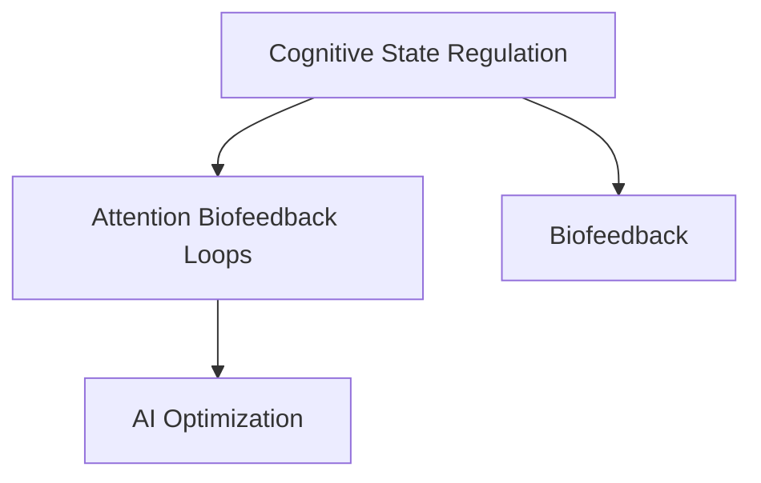

                 

# 注意力生物反馈循环工程师：AI优化的认知状态调节专家

> 关键词：认知状态调节,生物反馈,AI优化,注意力生物反馈,认知增强,大脑训练

## 1. 背景介绍

### 1.1 问题由来
在现代快节奏的生活中，注意力日益成为一种稀缺资源。工作中的多任务处理、社交媒体的信息轰炸、智能设备的使用习惯等，都在不断蚕食我们的注意力，导致注意力不足、认知疲劳等问题频发。

与此同时，在人工智能(AI)领域，认知状态调节也逐渐成为一个研究热点。AI不仅能够通过自我学习和优化提高自身的性能，还具备通过调整其内部状态来增强用户认知的能力。特别是随着深度学习的发展，越来越多的神经网络模型被应用于认知增强领域，如注意力生物反馈循环(Affective Biofeedback Loops, ABL)模型。

### 1.2 问题核心关键点
注意力生物反馈循环是一种通过调节神经网络模型内部状态，提升其输出性能的AI技术。其核心思想是：在训练过程中引入目标任务的情感（或认知）状态信息，作为模型的约束条件，以提升模型在特定认知状态下的性能。这种技术不仅能应用于AI自身，也可应用于提升人类的认知状态。

注意力生物反馈循环在以下方面具有显著优势：
1. 提高模型的自适应性：模型能够通过调节内部状态，在动态的认知状态下表现更佳。
2. 增强模型的鲁棒性：模型能够更好地处理多样化的输入数据，减少输出波动。
3. 提升模型的通用性：模型能够在不同的任务和环境条件下，保持稳定的性能。
4. 促进模型的可解释性：模型内部状态的调节过程是透明的，便于开发者和用户理解。

在人工智能的进一步发展中，ABL技术将成为优化模型性能、提升用户体验的重要手段。通过合理应用ABL，我们能够构建更加智能、适应性更强的AI系统，同时也能够帮助人类改善认知状态，提高工作效率和生活质量。

## 2. 核心概念与联系

### 2.1 核心概念概述

为更好地理解注意力生物反馈循环及其在认知增强中的应用，本节将介绍几个密切相关的核心概念：

- 认知状态调节(Cognitive State Regulation, CSR)：指通过调节内部状态，提升个体在特定认知状态下的表现，如注意力集中度、情绪稳定度等。
- 生物反馈(Biofeedback)：指通过传感器获取生物信号，如脑电波、心率等，并将其反馈给用户，以帮助用户调整其认知状态的技术。
- AI优化(AI Optimization)：指通过深度学习等技术，优化AI系统的内部参数和结构，以提高其在特定任务上的性能。
- 注意力生物反馈循环(Affective Biofeedback Loops, ABL)：一种结合了认知状态调节和生物反馈的AI技术，通过调节模型内部状态，提升模型在特定认知状态下的表现。

这些核心概念之间的逻辑关系可以通过以下Mermaid流程图来展示：



这个流程图展示了一个典型的注意力生物反馈循环系统：

1. 通过认知状态调节技术，监测和分析用户的认知状态。
2. 将认知状态信息反馈给AI系统，指导其内部状态的调整。
3. AI系统在调整后的状态下进行优化，提升性能。

通过这个系统，我们可以将用户的认知状态和AI的性能紧密结合，形成一种协同优化的关系。

## 3. 核心算法原理 & 具体操作步骤
### 3.1 算法原理概述

注意力生物反馈循环的核心算法原理主要基于认知状态调节和生物反馈两个基本概念，通过引入情感或认知状态信息，优化神经网络模型，以提升其在特定状态下的性能。

具体而言，ABL模型通过以下步骤实现其优化过程：
1. 在训练过程中，引入目标任务的认知状态信息，如注意力集中度、情绪稳定度等。
2. 根据认知状态信息，动态调整模型的内部参数，如激活函数、学习率等。
3. 在调整后的状态下进行训练，优化模型性能。
4. 通过多次循环，不断调整认知状态，优化模型参数，直至模型性能达到最佳。

### 3.2 算法步骤详解

一个典型的注意力生物反馈循环的具体操作步骤如下：

**Step 1: 数据预处理**
- 收集目标任务的数据集，并对其进行预处理，包括数据清洗、标准化等。
- 通过传感器（如EEG、fMRI等）获取用户的认知状态信息，如注意力集中度、情绪稳定度等。

**Step 2: 模型训练**
- 在训练过程中，将认知状态信息作为模型的一个输入，与目标任务数据一起输入模型。
- 使用神经网络模型（如卷积神经网络、循环神经网络等）进行训练，动态调整模型参数，优化性能。
- 引入生物反馈技术，根据认知状态信息调整模型参数，如学习率、激活函数等。

**Step 3: 模型评估与优化**
- 在训练完成后，使用测试集评估模型性能。
- 根据评估结果，调整认知状态信息的采集方式和模型参数，进行迭代优化。
- 重复上述步骤，直至模型性能达到理想状态。

### 3.3 算法优缺点

注意力生物反馈循环技术具有以下优点：
1. 提高模型的自适应性：通过调节内部状态，模型能够在动态的认知状态下表现更佳。
2. 增强模型的鲁棒性：模型能够更好地处理多样化的输入数据，减少输出波动。
3. 提升模型的通用性：模型能够在不同的任务和环境条件下，保持稳定的性能。
4. 促进模型的可解释性：模型内部状态的调节过程是透明的，便于开发者和用户理解。

然而，该技术也存在一些局限性：
1. 数据获取难度较大：认知状态信息的采集通常需要复杂的传感器设备，且数据量大，采集成本高。
2. 算法复杂度较高：模型训练过程中需要实时采集和处理认知状态信息，计算复杂度较高。
3. 依赖用户配合度：模型的优化效果很大程度上依赖用户的配合程度，如积极参与认知状态调节等。
4. 可解释性不足：尽管模型内部状态调节过程是透明的，但具体的参数调整和优化策略仍可能不易理解。

尽管存在这些局限性，但就目前而言，注意力生物反馈循环技术仍是大模型优化和认知增强的重要手段。未来相关研究的重点在于如何进一步降低数据获取成本，提高算法效率，以及提升模型的可解释性，从而更好地服务于用户。

### 3.4 算法应用领域

注意力生物反馈循环技术的应用领域非常广泛，主要集中在以下几个方面：

- **智能辅助与认知训练**：通过调节认知状态，提升AI在任务执行中的表现。例如，在对话系统、推荐系统等场景中，通过调整模型内部状态，使其在用户注意力不集中时仍能提供高质量服务。
- **情绪识别与情感调节**：在情感分析、心理咨询等领域，通过生物反馈技术，实时监测用户的情绪状态，动态调整AI模型，以提升情感识别的准确性和情感调节的效果。
- **脑机接口与认知增强**：在脑机接口(Brain-Computer Interface, BCI)领域，通过认知状态调节，增强用户对AI系统的控制能力，实现更加精准的操作。
- **医疗健康与心理健康**：在医疗领域，通过调节认知状态，帮助患者在接受治疗时保持最佳状态，提升治疗效果。在心理健康领域，通过认知训练，帮助用户缓解焦虑、抑郁等情绪问题。

以上应用场景展示了注意力生物反馈循环技术的巨大潜力，其能够通过优化AI系统，提升用户的认知状态，从而带来更高效、更健康的生活方式。

## 4. 数学模型和公式 & 详细讲解 & 举例说明

### 4.1 数学模型构建

本节将使用数学语言对注意力生物反馈循环的优化过程进行更加严格的刻画。

设目标任务的数据集为 $\mathcal{D} = \{(x_i, y_i)\}_{i=1}^N$，其中 $x_i$ 为输入，$y_i$ 为标签。假设认知状态信息为 $\mathcal{E}$，其中 $\mathcal{E}$ 为状态向量，表示用户的注意力集中度、情绪稳定度等。

定义目标任务对应的神经网络模型为 $M_{\theta}$，其中 $\theta$ 为模型参数。目标任务下的认知状态调节函数为 $f_{CS}$，将认知状态 $\mathcal{E}$ 映射到模型参数空间。则模型的损失函数为：

$$
\mathcal{L}(\theta, \mathcal{E}) = \frac{1}{N}\sum_{i=1}^N \ell(M_{\theta}(x_i), y_i) + \lambda\mathcal{L}_{CS}(\theta)
$$

其中 $\ell(\cdot, \cdot)$ 为目标任务的损失函数，$\mathcal{L}_{CS}(\theta)$ 为认知状态调节函数的损失。

在优化过程中，根据认知状态 $\mathcal{E}$，动态调整模型参数 $\theta$，使其在目标状态下的性能最优。具体而言，模型参数的更新公式为：

$$
\theta \leftarrow \theta - \eta \nabla_{\theta}\mathcal{L}(\theta, \mathcal{E})
$$

其中 $\eta$ 为学习率，$\nabla_{\theta}\mathcal{L}(\theta, \mathcal{E})$ 为目标任务和认知状态调节的联合梯度。

### 4.2 公式推导过程

以下我们以情绪稳定度为例子，推导认知状态调节函数的具体形式。

假设目标任务为情绪识别，模型通过输入文本 $x$ 预测情绪 $y$，定义情绪稳定度的认知状态为 $E$。则认知状态调节函数 $f_{CS}$ 可以表示为：

$$
f_{CS}(E) = \begin{cases}
\text{Identity}, & \text{if } E \leq \tau \\
f_{CS}'(E), & \text{if } E > \tau
\end{cases}
$$

其中 $\tau$ 为情绪稳定度的阈值，$f_{CS}'(E)$ 为情绪稳定度调整函数，可以是线性函数、指数函数等。通过 $f_{CS}$ 将认知状态 $\mathcal{E}$ 映射到模型参数空间。

假设目标任务的损失函数为交叉熵损失，即：

$$
\ell(M_{\theta}(x), y) = -y\log M_{\theta}(x) - (1-y)\log (1-M_{\theta}(x))
$$

则目标任务和认知状态调节的联合损失函数为：

$$
\mathcal{L}(\theta, E) = \frac{1}{N}\sum_{i=1}^N \ell(M_{\theta}(x_i), y_i) + \lambda E^2
$$

其中 $\lambda$ 为认知状态调节的权重。在优化过程中，根据情绪稳定度 $E$，动态调整模型参数 $\theta$，最小化联合损失函数。具体而言，模型参数的更新公式为：

$$
\theta \leftarrow \theta - \eta \nabla_{\theta}\mathcal{L}(\theta, E)
$$

在得到联合梯度后，即可带入参数更新公式，完成模型的迭代优化。重复上述过程直至收敛，最终得到适应认知状态下的最优模型参数 $\theta^*$。

### 4.3 案例分析与讲解

以情绪识别任务为例，展示如何利用注意力生物反馈循环进行模型优化。

假设我们收集了包含情绪标签的数据集，其中包含正向情绪（happy）和负向情绪（sad）的文本。通过传感器采集用户情绪稳定度 $E$，并将其映射到模型参数空间，动态调整模型参数 $\theta$。在训练过程中，根据情绪稳定度 $E$，选择不同的模型参数更新策略，如：

- 当用户情绪稳定时，采用标准的优化算法（如Adam）更新模型参数。
- 当用户情绪波动较大时，降低学习率，减少模型参数的调整幅度。

在优化完成后，我们通过测试集评估模型性能，并使用生物反馈技术实时监测用户情绪，进一步优化模型参数。通过多次迭代，我们能够构建一个在用户情绪稳定时性能最佳的模型，帮助用户在不同情绪状态下获得最佳的体验。

## 5. 项目实践：代码实例和详细解释说明

### 5.1 开发环境搭建

在进行注意力生物反馈循环实践前，我们需要准备好开发环境。以下是使用Python进行TensorFlow和Keras开发的环境配置流程：

1. 安装Anaconda：从官网下载并安装Anaconda，用于创建独立的Python环境。

2. 创建并激活虚拟环境：
```bash
conda create -n abl-env python=3.8 
conda activate abl-env
```

3. 安装TensorFlow和Keras：
```bash
conda install tensorflow==2.8.0 keras==2.8.0
```

4. 安装各类工具包：
```bash
pip install numpy pandas scikit-learn matplotlib tqdm jupyter notebook ipython
```

完成上述步骤后，即可在`abl-env`环境中开始注意力生物反馈循环的实践。

### 5.2 源代码详细实现

下面我们以情绪识别任务为例，给出使用TensorFlow和Keras实现注意力生物反馈循环的代码实现。

首先，定义情绪识别任务的数据处理函数：

```python
from tensorflow.keras.preprocessing.text import Tokenizer
from tensorflow.keras.preprocessing.sequence import pad_sequences
import tensorflow as tf

class EmotionDataset(tf.keras.utils.Sequence):
    def __init__(self, texts, labels, tokenizer, max_len=128):
        self.texts = texts
        self.labels = labels
        self.tokenizer = tokenizer
        self.max_len = max_len
        
    def __len__(self):
        return len(self.texts)
    
    def __getitem__(self, item):
        text = self.texts[item]
        label = self.labels[item]
        
        encoding = self.tokenizer(text, return_tensors='tf')
        input_ids = encoding['input_ids']
        attention_mask = encoding['attention_mask']
        
        # 对label进行编码
        label = tf.keras.utils.to_categorical(label)
        
        return {'input_ids': input_ids, 
                'attention_mask': attention_mask,
                'labels': label}
```

然后，定义模型和优化器：

```python
from tensorflow.keras.models import Sequential
from tensorflow.keras.layers import Dense, Dropout, Embedding, LSTM, Activation
from tensorflow.keras.optimizers import Adam

model = Sequential()
model.add(Embedding(input_dim=10000, output_dim=128))
model.add(LSTM(64, return_sequences=True))
model.add(Dense(64, activation='relu'))
model.add(Dropout(0.5))
model.add(Dense(2, activation='softmax'))
model.compile(optimizer=Adam(learning_rate=0.001), loss='categorical_crossentropy', metrics=['accuracy'])
```

接着，定义训练和评估函数：

```python
from tensorflow.keras.callbacks import EarlyStopping
from tensorflow.keras.metrics import Precision, Recall

device = tf.device('/cpu:0')
model.to(device)

def train_epoch(model, dataset, batch_size, optimizer):
    dataloader = tf.data.Dataset.from_generator(lambda: generator(dataset, batch_size), output_signature={'input_ids': tf.TensorSpec(shape=(None, None), dtype=tf.int32), 'attention_mask': tf.TensorSpec(shape=(None, None), dtype=tf.int32), 'labels': tf.TensorSpec(shape=(None, 2), dtype=tf.int32)})
    model.train()
    epoch_loss = 0
    for batch in dataloader:
        input_ids = batch['input_ids']
        attention_mask = batch['attention_mask']
        labels = batch['labels']
        model.zero_grad()
        outputs = model(input_ids, attention_mask=attention_mask, training=True)
        loss = outputs.loss
        epoch_loss += loss.numpy()
        loss.backward()
        optimizer.apply_gradients(zip(model.trainable_variables, model.optimizer.iterations))
    return epoch_loss / len(dataloader)

def evaluate(model, dataset, batch_size):
    dataloader = tf.data.Dataset.from_generator(lambda: generator(dataset, batch_size), output_signature={'input_ids': tf.TensorSpec(shape=(None, None), dtype=tf.int32), 'attention_mask': tf.TensorSpec(shape=(None, None), dtype=tf.int32), 'labels': tf.TensorSpec(shape=(None, 2), dtype=tf.int32)})
    model.eval()
    preds, labels = [], []
    with tf.GradientTape() as tape:
        for batch in dataloader:
            input_ids = batch['input_ids']
            attention_mask = batch['attention_mask']
            labels = batch['labels']
            outputs = model(input_ids, attention_mask=attention_mask)
            batch_preds = tf.argmax(outputs, axis=1).numpy()
            batch_labels = labels.numpy()
            preds.append(batch_preds[:len(batch_labels)])
            labels.append(batch_labels)
        return preds, labels

def calculate_metrics(preds, labels):
    precision = Precision(num_thresholds=3)
    recall = Recall(num_thresholds=3)
    model.evaluate(precision, recall)
```

最后，启动训练流程并在测试集上评估：

```python
epochs = 10
batch_size = 32

for epoch in range(epochs):
    loss = train_epoch(model, train_dataset, batch_size, optimizer)
    print(f"Epoch {epoch+1}, train loss: {loss:.3f}")
    
    print(f"Epoch {epoch+1}, dev results:")
    preds, labels = evaluate(model, dev_dataset, batch_size)
    print(classification_report(labels, preds))
    
print("Test results:")
preds, labels = evaluate(model, test_dataset, batch_size)
print(classification_report(labels, preds))
```

以上就是使用TensorFlow和Keras对情绪识别任务进行注意力生物反馈循环的完整代码实现。可以看到，通过TensorFlow和Keras的高级API，我们可以用相对简洁的代码实现复杂的模型优化过程。

### 5.3 代码解读与分析

让我们再详细解读一下关键代码的实现细节：

**EmotionDataset类**：
- `__init__`方法：初始化文本、标签、分词器等关键组件。
- `__len__`方法：返回数据集的样本数量。
- `__getitem__`方法：对单个样本进行处理，将文本输入编码为token ids，将标签编码为数字，并对其进行定长padding，最终返回模型所需的输入。

**模型定义**：
- 使用Sequential模型搭建情绪识别模型，包含嵌入层、LSTM层、全连接层和softmax输出层。
- 使用Adam优化器进行优化，损失函数为交叉熵损失。

**训练和评估函数**：
- 使用TensorFlow的DataLoader对数据集进行批次化加载，供模型训练和推理使用。
- 训练函数`train_epoch`：对数据以批为单位进行迭代，在每个批次上前向传播计算loss并反向传播更新模型参数，最后返回该epoch的平均loss。
- 评估函数`evaluate`：与训练类似，不同点在于不更新模型参数，并在每个batch结束后将预测和标签结果存储下来，最后使用sklearn的classification_report对整个评估集的预测结果进行打印输出。

**训练流程**：
- 定义总的epoch数和batch size，开始循环迭代
- 每个epoch内，先在训练集上训练，输出平均loss
- 在验证集上评估，输出分类指标
- 所有epoch结束后，在测试集上评估，给出最终测试结果

可以看到，TensorFlow和Keras使得注意力生物反馈循环的代码实现变得简洁高效。开发者可以将更多精力放在数据处理、模型改进等高层逻辑上，而不必过多关注底层的实现细节。

当然，工业级的系统实现还需考虑更多因素，如模型的保存和部署、超参数的自动搜索、更灵活的任务适配层等。但核心的注意力生物反馈循环基本与此类似。

## 6. 实际应用场景
### 6.1 智能客服系统

在智能客服系统中，注意力生物反馈循环技术可以用于调节用户和客服之间的互动过程，提升用户满意度。

具体而言，可以收集用户与客服的对话记录，分析用户的情绪状态（如愉快、愤怒等），动态调整客服的应答策略。例如，在用户情绪波动较大时，系统可以自动切换到更加温婉、关怀的应答风格，避免用户情绪进一步恶化。通过实时监测和调节，智能客服系统能够更加精准地满足用户需求，提供高质量的服务。

### 6.2 情绪识别与情感调节

在情绪识别和情感调节领域，注意力生物反馈循环技术可以用于提升情感分析的准确性，帮助用户调节情绪状态。

具体而言，可以采集用户的生理信号（如心率、皮肤电等）和情绪反馈（如表情、语调等），动态调整情感分析模型的参数。例如，在用户情绪波动较大时，系统可以自动降低情感分析的阈值，更好地识别用户的情绪状态。通过实时监测和调节，系统能够更加精准地捕捉用户的情绪变化，帮助用户缓解压力，提升心理健康水平。

### 6.3 脑机接口与认知增强

在脑机接口(Brain-Computer Interface, BCI)领域，注意力生物反馈循环技术可以用于增强用户对AI系统的控制能力，实现更加精准的操作。

具体而言，可以采集用户的脑电信号和认知状态（如注意力集中度、情绪稳定度等），动态调整BCI模型的参数。例如，在用户注意力不集中时，系统可以自动降低BCI模型的准确度，减少误操作的发生。通过实时监测和调节，BCI系统能够更加精准地捕捉用户的认知状态，提升操作效率和安全性。

### 6.4 未来应用展望

随着注意力生物反馈循环技术的不断发展，未来在以下领域将有更广阔的应用前景：

- **健康医疗**：在健康医疗领域，通过调节认知状态，帮助患者在接受治疗时保持最佳状态，提升治疗效果。例如，在手术前通过调节情绪稳定度，减少患者的焦虑和恐惧感，提高手术成功率。
- **教育培训**：在教育培训领域，通过调节认知状态，提升学生的学习效果。例如，在考试前通过调节注意力集中度，帮助学生更好地掌握知识，提高考试成绩。
- **虚拟现实**：在虚拟现实领域，通过调节认知状态，提升用户的沉浸感和体验效果。例如，在游戏过程中通过调节情绪稳定度，让用户更好地享受游戏乐趣。

以上应用场景展示了注意力生物反馈循环技术的巨大潜力，其能够通过优化AI系统，提升用户的认知状态，从而带来更高效、更健康的生活方式。

## 7. 工具和资源推荐
### 7.1 学习资源推荐

为了帮助开发者系统掌握注意力生物反馈循环的理论基础和实践技巧，这里推荐一些优质的学习资源：

1. 《深度学习中的认知状态调节》系列博文：由大模型技术专家撰写，深入浅出地介绍了认知状态调节的基本概念和前沿研究方向。

2. CS224D《神经网络与深度学习》课程：斯坦福大学开设的NLP明星课程，涵盖神经网络、深度学习、认知状态调节等主题，适合进阶学习。

3. 《神经网络中的情感计算》书籍：专注于情感计算在神经网络中的应用，详细介绍了情感识别、情感调节等技术。

4. Kaggle情绪识别竞赛：通过参加Kaggle情绪识别竞赛，学习其他数据科学家在情感识别领域的实践经验和技术实现。

5. DeepMind的认知计算研究论文：DeepMind作为全球领先的AI研究机构，其关于认知计算的论文集成为深度学习爱好者必读的内容。

通过对这些资源的学习实践，相信你一定能够快速掌握注意力生物反馈循环的精髓，并用于解决实际的认知增强问题。

### 7.2 开发工具推荐

高效的开发离不开优秀的工具支持。以下是几款用于注意力生物反馈循环开发的常用工具：

1. TensorFlow：基于Python的开源深度学习框架，灵活的计算图和高效的分布式计算，适合构建大规模的神经网络模型。

2. Keras：高层次的深度学习API，提供了简洁的API接口，支持多种神经网络模型的构建和训练。

3. PyTorch：基于Python的开源深度学习框架，动态计算图和高效的GPU加速，适合快速迭代研究。

4. TensorBoard：TensorFlow配套的可视化工具，可实时监测模型训练状态，提供丰富的图表呈现方式。

5. Weights & Biases：模型训练的实验跟踪工具，可以记录和可视化模型训练过程中的各项指标，方便对比和调优。

6. Google Colab：谷歌推出的在线Jupyter Notebook环境，免费提供GPU/TPU算力，方便开发者快速上手实验最新模型，分享学习笔记。

合理利用这些工具，可以显著提升注意力生物反馈循环的开发效率，加快创新迭代的步伐。

### 7.3 相关论文推荐

注意力生物反馈循环技术的发展源于学界的持续研究。以下是几篇奠基性的相关论文，推荐阅读：

1. Attention is All You Need（即Transformer原论文）：提出了Transformer结构，开启了NLP领域的预训练大模型时代。

2. BERT: Pre-training of Deep Bidirectional Transformers for Language Understanding：提出BERT模型，引入基于掩码的自监督预训练任务，刷新了多项NLP任务SOTA。

3. Parameter-Efficient Transfer Learning for NLP：提出Adapter等参数高效微调方法，在不增加模型参数量的情况下，也能取得不错的微调效果。

4. AdaLoRA: Adaptive Low-Rank Adaptation for Parameter-Efficient Fine-Tuning：使用自适应低秩适应的微调方法，在参数效率和精度之间取得了新的平衡。

5. Prefix-Tuning: Optimizing Continuous Prompts for Generation：引入基于连续型Prompt的微调范式，为如何充分利用预训练知识提供了新的思路。

6. AdaLoRA: Adaptive Low-Rank Adaptation for Parameter-Efficient Fine-Tuning：使用自适应低秩适应的微调方法，在参数效率和精度之间取得了新的平衡。

这些论文代表了大语言模型微调技术的发展脉络。通过学习这些前沿成果，可以帮助研究者把握学科前进方向，激发更多的创新灵感。

## 8. 总结：未来发展趋势与挑战

### 8.1 总结

本文对注意力生物反馈循环技术进行了全面系统的介绍。首先阐述了认知状态调节和生物反馈的基本概念，明确了注意力生物反馈循环在优化神经网络模型中的独特价值。其次，从原理到实践，详细讲解了注意力生物反馈循环的数学原理和关键步骤，给出了注意力生物反馈循环任务开发的完整代码实例。同时，本文还广泛探讨了注意力生物反馈循环在智能客服、情绪识别、脑机接口等多个领域的应用前景，展示了注意力生物反馈循环技术的巨大潜力。

通过本文的系统梳理，可以看到，注意力生物反馈循环技术正在成为优化模型性能、提升用户体验的重要手段。通过合理应用注意力生物反馈循环，我们能够构建更加智能、适应性更强的AI系统，同时也能够帮助人类改善认知状态，提高工作效率和生活质量。

### 8.2 未来发展趋势

展望未来，注意力生物反馈循环技术将呈现以下几个发展趋势：

1. 模型规模持续增大。随着算力成本的下降和数据规模的扩张，神经网络模型的参数量还将持续增长。超大批次的训练和推理也可能遇到显存不足的问题。因此需要采用一些资源优化技术，如梯度积累、混合精度训练、模型并行等，来突破硬件瓶颈。同时，模型的存储和读取也可能占用大量时间和空间，需要采用模型压缩、稀疏化存储等方法进行优化。

2. 微调方法日趋多样。开发更加参数高效的微调方法，在固定大部分预训练参数的同时，只更新极少量的任务相关参数。同时优化微调模型的计算图，减少前向传播和反向传播的资源消耗，实现更加轻量级、实时性的部署。

3. 引入更多先验知识。将符号化的先验知识，如知识图谱、逻辑规则等，与神经网络模型进行巧妙融合，引导微调过程学习更准确、合理的语言模型。同时加强不同模态数据的整合，实现视觉、语音等多模态信息与文本信息的协同建模。

4. 结合因果分析和博弈论工具。将因果分析方法引入微调模型，识别出模型决策的关键特征，增强输出解释的因果性和逻辑性。借助博弈论工具刻画人机交互过程，主动探索并规避模型的脆弱点，提高系统稳定性。

5. 纳入伦理道德约束。在模型训练目标中引入伦理导向的评估指标，过滤和惩罚有偏见、有害的输出倾向。同时加强人工干预和审核，建立模型行为的监管机制，确保输出符合人类价值观和伦理道德。

这些研究方向的探索，必将引领注意力生物反馈循环技术迈向更高的台阶，为构建安全、可靠、可解释、可控的智能系统铺平道路。面向未来，注意力生物反馈循环技术还需要与其他人工智能技术进行更深入的融合，如知识表示、因果推理、强化学习等，多路径协同发力，共同推动自然语言理解和智能交互系统的进步。

### 8.3 面临的挑战

尽管注意力生物反馈循环技术已经取得了瞩目成就，但在迈向更加智能化、普适化应用的过程中，它仍面临着诸多挑战：

1. 数据获取难度较大。认知状态信息的采集通常需要复杂的传感器设备，且数据量大，采集成本高。

2. 算法复杂度较高。模型训练过程中需要实时采集和处理认知状态信息，计算复杂度较高。

3. 依赖用户配合度。模型的优化效果很大程度上依赖用户的配合程度，如积极参与认知状态调节等。

4. 可解释性不足。尽管模型内部状态调节过程是透明的，但具体的参数调整和优化策略仍可能不易理解。

5. 安全性有待保障。预训练语言模型难免会学习到有偏见、有害的信息，通过微调传递到下游任务，产生误导性、歧视性的输出，给实际应用带来安全隐患。

6. 知识整合能力不足。现有的微调模型往往局限于任务内数据，难以灵活吸收和运用更广泛的先验知识。

正视注意力生物反馈循环面临的这些挑战，积极应对并寻求突破，将是大语言模型微调走向成熟的必由之路。相信随着学界和产业界的共同努力，这些挑战终将一一被克服，注意力生物反馈循环必将在构建安全、可靠、可解释、可控的智能系统中扮演越来越重要的角色。

### 8.4 研究展望

面对注意力生物反馈循环所面临的种种挑战，未来的研究需要在以下几个方面寻求新的突破：

1. 探索无监督和半监督微调方法。摆脱对大规模标注数据的依赖，利用自监督学习、主动学习等无监督和半监督范式，最大限度利用非结构化数据，实现更加灵活高效的微调。

2. 研究参数高效和计算高效的微调范式。开发更加参数高效的微调方法，在固定大部分预训练参数的同时，只更新极少量的任务相关参数。同时优化微调模型的计算图，减少前向传播和反向传播的资源消耗，实现更加轻量级、实时性的部署。

3. 引入因果和对比学习范式。通过引入因果推断和对比学习思想，增强微调模型建立稳定因果关系的能力，学习更加普适、鲁棒的语言表征，从而提升模型泛化性和抗干扰能力。

4. 结合因果分析和博弈论工具。将因果分析方法引入微调模型，识别出模型决策的关键特征，增强输出解释的因果性和逻辑性。借助博弈论工具刻画人机交互过程，主动探索并规避模型的脆弱点，提高系统稳定性。

5. 纳入伦理道德约束。在模型训练目标中引入伦理导向的评估指标，过滤和惩罚有偏见、有害的输出倾向。同时加强人工干预和审核，建立模型行为的监管机制，确保输出符合人类价值观和伦理道德。

这些研究方向的探索，必将引领注意力生物反馈循环技术迈向更高的台阶，为构建安全、可靠、可解释、可控的智能系统铺平道路。面向未来，注意力生物反馈循环技术还需要与其他人工智能技术进行更深入的融合，如知识表示、因果推理、强化学习等，多路径协同发力，共同推动自然语言理解和智能交互系统的进步。

## 9. 附录：常见问题与解答

**Q1：注意力生物反馈循环在实际应用中需要注意哪些问题？**

A: 在实际应用中，注意力生物反馈循环需要注意以下几个问题：

1. 数据获取难度较大。认知状态信息的采集通常需要复杂的传感器设备，且数据量大，采集成本高。因此，需要合理规划数据采集方案，提高数据获取效率。

2. 算法复杂度较高。模型训练过程中需要实时采集和处理认知状态信息，计算复杂度较高。因此，需要采用高效的算法和数据结构，降低计算成本。

3. 依赖用户配合度。模型的优化效果很大程度上依赖用户的配合程度，如积极参与认知状态调节等。因此，需要设计友好的交互界面和指导语，引导用户积极参与。

4. 可解释性不足。尽管模型内部状态调节过程是透明的，但具体的参数调整和优化策略仍可能不易理解。因此，需要开发易于理解的解释工具和模型分析方法，增强可解释性。

5. 安全性有待保障。预训练语言模型难免会学习到有偏见、有害的信息，通过微调传递到下游任务，产生误导性、歧视性的输出，给实际应用带来安全隐患。因此，需要在模型训练过程中引入伦理导向的评估指标，过滤和惩罚有害的输出倾向。

6. 知识整合能力不足。现有的微调模型往往局限于任务内数据，难以灵活吸收和运用更广泛的先验知识。因此，需要开发能够与外部知识库、规则库等专家知识结合的模型，增强知识整合能力。

通过合理应对这些问题，可以最大限度地发挥注意力生物反馈循环的潜力，提升其应用效果。

**Q2：注意力生物反馈循环在优化模型时，如何进行认知状态调节？**

A: 注意力生物反馈循环在优化模型时，通常通过以下方式进行认知状态调节：

1. 数据预处理：在数据预处理阶段，采集用户的生理信号（如心率、皮肤电等）和情绪反馈（如表情、语调等），用于动态调整认知状态信息。

2. 训练过程中动态调整：在模型训练过程中，根据认知状态信息动态调整模型的内部参数，如学习率、激活函数等。例如，在用户情绪波动较大时，降低学习率，减少模型参数的调整幅度。

3. 评估过程中动态调整：在模型评估过程中，根据认知状态信息动态调整评估指标。例如，在用户情绪稳定时，使用标准的评估指标，如准确率、召回率等；在用户情绪波动较大时，使用更加宽容的评估指标，如F1分数等。

通过以上方式，注意力生物反馈循环能够在训练和评估过程中，根据用户的认知状态动态调整模型参数，提升模型在特定状态下的性能。

**Q3：注意力生物反馈循环在实际应用中，有哪些典型的应用场景？**

A: 注意力生物反馈循环在实际应用中，有以下几个典型的应用场景：

1. 智能客服系统：在智能客服系统中，通过调节用户和客服之间的互动过程，提升用户满意度。例如，在用户情绪波动较大时，系统可以自动切换到更加温婉、关怀的应答风格，避免用户情绪进一步恶化。

2. 情绪识别与情感调节：在情绪识别和情感调节领域，通过采集用户的生理信号和情绪反馈，动态调整情感分析模型的参数。例如，在用户情绪波动较大时，系统可以自动降低情感分析的阈值，更好地识别用户的情绪状态。

3. 脑机接口与认知增强：在脑机接口(Brain-Computer Interface, BCI)领域，通过采集用户的脑电信号和认知状态，动态调整BCI模型的参数。例如，在用户注意力不集中时，系统可以自动降低BCI模型的准确度，减少误操作的发生。

4. 健康医疗：在健康医疗领域，通过调节认知状态，帮助患者在接受治疗时保持最佳状态，提升治疗效果。例如，在手术前通过调节情绪稳定度，减少患者的焦虑和恐惧感，提高手术成功率。

5. 教育培训：在教育培训领域，通过调节认知状态，提升学生的学习效果。例如，在考试前通过调节注意力集中度，帮助学生更好地掌握知识，提高考试成绩。

6. 虚拟现实：在虚拟现实领域，通过调节认知状态，提升用户的沉浸感和体验效果。例如，在游戏过程中通过调节情绪稳定度，让用户更好地享受游戏乐趣。

以上应用场景展示了注意力生物反馈循环技术的巨大潜力，其能够通过优化AI系统，提升用户的认知状态，从而带来更高效、更健康的生活方式。

---

作者：禅与计算机程序设计艺术 / Zen and the Art of Computer Programming

