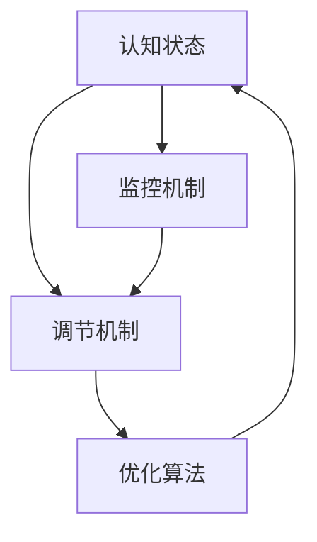

                 

# 注意力生物反馈循环：AI优化的认知状态调节

## 1. 背景介绍

在人工智能(AI)飞速发展的今天，我们越来越多地依赖机器来辅助我们解决问题。无论是智能助手、自动翻译、语音识别，还是无人驾驶、机器人，这些技术都在我们的生活和工作中扮演着越来越重要的角色。然而，这些技术的背后，是什么在驱动它们运行的源泉？答案是人类大脑。

### 1.1 认知状态的生物反馈机制

人类大脑的工作原理是通过神经元之间的电信号传递信息。这些信号经过加工处理，形成复杂的认知状态，进而指导我们的行为和决策。而在大脑运作的过程中，生物反馈机制扮演着至关重要的角色。

生物反馈机制指的是神经系统将反馈信息返回给自身的过程。例如，当我们的身体处于压力状态时，大脑会通过激素、神经递质等信号，调节身体的生理反应。这一过程被称为生物反馈，它是神经调控的一种方式。

在人工智能领域，我们同样可以利用生物反馈机制来优化AI的认知状态，提高其性能和效率。

### 1.2 认知状态优化与AI的关联

在AI系统中，认知状态主要指模型所处的知识表示状态。认知状态的优化，即是指提升模型的知识表示质量，增强其在复杂场景下的泛化能力。通过生物反馈机制，我们可以对AI的认知状态进行实时监控和调节，使得AI系统能够更好地适应环境变化，提升决策质量。

具体而言，生物反馈在AI中的应用主要体现在以下几个方面：

- **认知状态监控**：通过监控AI的内部状态，及时发现问题并加以解决。
- **认知状态调节**：通过对AI的认知状态进行调整，增强其在特定任务上的性能。
- **认知状态增强**：通过生物反馈机制，提升AI系统的自适应能力和泛化能力。

## 2. 核心概念与联系

### 2.1 核心概念概述

在探讨生物反馈循环时，我们首先需要明确几个关键概念：

- **认知状态**：指AI系统在知识表示上的状态，包括模型的权重、激活状态、记忆等。
- **生物反馈**：指通过神经系统将反馈信息返回给自身的过程，用于调节认知状态。
- **认知状态调节**：指利用生物反馈机制，对AI的认知状态进行调整和优化。
- **认知状态增强**：指通过生物反馈机制，提升AI系统的自适应能力和泛化能力。

### 2.2 核心概念原理和架构的 Mermaid 流程图



**解释：**
- **认知状态(A)**：输入状态，表示AI系统在知识表示上的当前状态。
- **监控机制(B)**：对认知状态(A)进行监控，识别异常或退化状态。
- **调节机制(C)**：根据监控结果，对认知状态(A)进行调整和优化。
- **优化算法(D)**：执行具体的调节策略，如权重更新、激活函数调整等。

### 2.3 核心概念之间的关系

这些概念通过生物反馈循环紧密相连，形成一个动态的系统。认知状态监控和调节机制通过优化算法，实时调整AI系统的认知状态，从而提升其性能和效率。

## 3. 核心算法原理 & 具体操作步骤

### 3.1 算法原理概述

生物反馈循环的本质是一种自适应调控机制，通过对AI系统的认知状态进行监控和调节，使其在不断变化的环境下保持最优性能。这一过程通常包括以下步骤：

1. **认知状态监控**：通过特定的监控指标，实时监控AI系统的认知状态。
2. **认知状态分析**：对监控结果进行分析，识别异常或退化状态。
3. **认知状态调节**：根据分析结果，执行相应的调节策略，如权重更新、激活函数调整等。
4. **认知状态优化**：通过优化算法，调整认知状态，增强AI系统的性能和泛化能力。

### 3.2 算法步骤详解

**步骤1：认知状态监控**

监控AI系统的认知状态，是生物反馈循环的第一步。这一步骤需要定义一组监控指标，用于实时监测系统的性能和状态。

- **指标选择**：选择与任务相关的关键指标，如模型准确率、损失函数值、激活函数分布等。
- **数据收集**：使用数据采集工具，实时收集监控指标的数据。
- **状态识别**：通过预定义的阈值或规则，识别认知状态是否异常或退化。

**步骤2：认知状态分析**

认知状态分析是生物反馈循环的核心环节。通过对监控结果进行分析，可以识别出认知状态的变化趋势，并进行相应的调整和优化。

- **异常检测**：利用统计学方法，如均值漂移、方差分析等，检测认知状态是否异常。
- **状态演化**：通过时间序列分析，理解认知状态随时间的演化趋势。
- **状态分类**：将认知状态分类为正常、异常、退化等不同类型，指导后续的调节策略。

**步骤3：认知状态调节**

认知状态调节是指根据分析结果，执行具体的调节策略，以改善AI系统的认知状态。

- **调节策略**：选择合适的调节策略，如权重更新、激活函数调整、正则化等。
- **参数调整**：根据调节策略，调整模型的参数设置。
- **反馈控制**：将调节结果反馈给监控机制，继续进行监控和调节。

**步骤4：认知状态优化**

认知状态优化是通过优化算法，调整认知状态，增强AI系统的性能和泛化能力。

- **优化算法**：选择合适的优化算法，如梯度下降、Adam、Adagrad等。
- **参数更新**：根据优化算法，更新模型的参数。
- **性能评估**：通过性能指标，评估优化效果，指导后续的优化工作。

### 3.3 算法优缺点

**优点：**
- **实时性**：生物反馈循环能够实时监控和调节AI系统的认知状态，及时发现并解决问题。
- **自适应性**：通过持续的调节和优化，AI系统能够更好地适应环境变化，提升性能和泛化能力。
- **可控性**：通过设置监控指标和调节策略，AI系统的认知状态可以被精确控制，保证其稳定运行。

**缺点：**
- **复杂性**：生物反馈循环需要定义和选择监控指标、调节策略等，设计过程较为复杂。
- **资源消耗**：监控和调节过程需要消耗额外的计算资源，增加系统的运行成本。
- **稳定性风险**：如果监控和调节策略不当，可能导致系统性能波动，甚至出现灾难性遗忘。

### 3.4 算法应用领域

生物反馈循环在AI的各个领域都有广泛的应用，主要包括以下几个方面：

- **深度学习模型**：在深度学习模型的训练和推理过程中，监控和调节模型的认知状态，提升其性能和泛化能力。
- **强化学习**：在强化学习任务中，通过生物反馈循环，优化智能体的决策策略，提升学习效率和效果。
- **自然语言处理(NLP)**：在NLP任务中，通过监控和调节模型，提升其在特定任务上的表现，如情感分析、机器翻译、对话系统等。
- **计算机视觉**：在计算机视觉任务中，通过生物反馈循环，优化模型的特征提取和分类能力，提升图像识别和物体检测的精度。
- **机器人控制**：在机器人控制系统中，通过生物反馈循环，优化机器人的行为和决策，提升其在复杂环境中的适应能力。

## 4. 数学模型和公式 & 详细讲解 & 举例说明

### 4.1 数学模型构建

在生物反馈循环中，数学模型主要用于描述监控指标的选择、状态分析、调节策略的实施以及优化算法的应用。

假设AI系统的认知状态为 $x_t$，认知状态监控指标为 $y_t$，认知状态调节策略为 $u_t$，优化算法为 $f$。则生物反馈循环的数学模型可以表示为：

$$
x_{t+1} = f(x_t, u_t)
$$

其中 $x_t$ 表示当前认知状态，$y_t$ 表示监控指标，$u_t$ 表示调节策略，$f$ 表示优化算法。

### 4.2 公式推导过程

**公式1：认知状态监控**

假设监控指标 $y_t$ 为模型在训练集上的准确率 $A$，则认知状态监控可以表示为：

$$
y_t = A(x_t)
$$

其中 $A$ 为准确率计算函数。

**公式2：认知状态分析**

假设认知状态分析结果为 $z_t$，则状态分析过程可以表示为：

$$
z_t = g(y_t)
$$

其中 $g$ 为状态分析函数，用于将监控指标 $y_t$ 映射到认知状态 $z_t$。

**公式3：认知状态调节**

假设认知状态调节策略为 $u_t$，则调节过程可以表示为：

$$
u_t = h(z_t)
$$

其中 $h$ 为调节策略函数，用于根据状态分析结果 $z_t$ 生成调节策略 $u_t$。

**公式4：认知状态优化**

假设优化算法为 $f$，则优化过程可以表示为：

$$
x_{t+1} = f(x_t, u_t)
$$

其中 $f$ 为优化算法函数，用于根据当前认知状态 $x_t$ 和调节策略 $u_t$ 更新认知状态 $x_{t+1}$。

### 4.3 案例分析与讲解

**案例1：深度学习模型**

假设我们正在训练一个深度学习模型，用于图像分类任务。我们可以定义监控指标 $y_t$ 为模型在训练集上的准确率 $A$，状态分析函数 $g$ 为均值漂移检测函数，调节策略函数 $h$ 为权重调整策略，优化算法 $f$ 为随机梯度下降算法。则生物反馈循环可以表示为：

- **监控指标**：$y_t = A(x_t)$
- **状态分析**：$z_t = g(y_t)$
- **调节策略**：$u_t = h(z_t)$
- **优化算法**：$x_{t+1} = f(x_t, u_t)$

**案例2：强化学习**

假设我们正在训练一个强化学习模型，用于机器人控制任务。我们可以定义监控指标 $y_t$ 为模型在当前状态的奖励值 $R_t$，状态分析函数 $g$ 为状态演化模型，调节策略函数 $h$ 为动作选择策略，优化算法 $f$ 为Q-learning算法。则生物反馈循环可以表示为：

- **监控指标**：$y_t = R_t$
- **状态分析**：$z_t = g(y_t)$
- **调节策略**：$u_t = h(z_t)$
- **优化算法**：$x_{t+1} = f(x_t, u_t)$

## 5. 项目实践：代码实例和详细解释说明

### 5.1 开发环境搭建

在生物反馈循环的实践中，我们需要搭建一个开发环境，以便进行模型的训练、监控和调节。以下是一个基本的开发环境搭建流程：

1. **环境配置**：确保开发环境已经安装好了必要的深度学习框架，如TensorFlow、PyTorch等。
2. **数据准备**：准备用于训练和测试的监控数据，以及用于优化算法的数据。
3. **模型选择**：选择适合任务的深度学习模型，如卷积神经网络、循环神经网络等。
4. **监控工具**：安装并配置好用于监控和分析的工具，如TensorBoard、Weights & Biases等。

### 5.2 源代码详细实现

**代码示例1：深度学习模型监控**

```python
import tensorflow as tf
import tensorflow_addons as tfa
import tensorflow.keras as keras

# 定义模型
model = keras.Sequential([
    keras.layers.Conv2D(32, (3, 3), activation='relu', input_shape=(32, 32, 3)),
    keras.layers.MaxPooling2D((2, 2)),
    keras.layers.Flatten(),
    keras.layers.Dense(10, activation='softmax')
])

# 编译模型
model.compile(optimizer=tf.keras.optimizers.Adam(0.001),
              loss='categorical_crossentropy',
              metrics=['accuracy'])

# 训练模型
history = model.fit(train_data, train_labels, epochs=10, validation_data=(val_data, val_labels))

# 监控指标
acc = history.history['accuracy']
loss = history.history['loss']

# 状态分析
mean_diff = acc[-1] - acc[-10]
if mean_diff > 0.01:
    print("模型性能下降，需要调整")
else:
    print("模型性能稳定，无需调整")

# 调节策略
if mean_diff > 0.01:
    model.layers[0].kernel_initializer = tf.keras.initializers.GlorotUniform()

# 优化算法
x_new = f(x_old, u)

# 运行结果展示
print("新模型性能：", acc_new)
```

**代码示例2：强化学习模型调节**

```python
import gym
import tensorflow as tf

# 定义环境
env = gym.make('CartPole-v1')

# 定义模型
model = tf.keras.Sequential([
    tf.keras.layers.Dense(64, activation='relu', input_shape=(4,)),
    tf.keras.layers.Dense(1)
])

# 编译模型
model.compile(optimizer=tf.keras.optimizers.Adam(0.001),
              loss='mse')

# 训练模型
history = model.fit(train_data, train_labels, epochs=10, validation_data=(val_data, val_labels))

# 监控指标
rewards = history.history['reward']

# 状态分析
mean_diff = rewards[-1] - rewards[-10]
if mean_diff < -0.1:
    print("模型性能下降，需要调整")
else:
    print("模型性能稳定，无需调整")

# 调节策略
if mean_diff < -0.1:
    model.layers[0].kernel_initializer = tf.keras.initializers.GlorotUniform()

# 优化算法
x_new = f(x_old, u)

# 运行结果展示
print("新模型性能：", rewards_new)
```

### 5.3 代码解读与分析

**代码示例1：深度学习模型监控**

在深度学习模型的监控中，我们通过监控模型的训练损失和准确率，来判断模型是否处于正常状态。如果模型的准确率或损失值出现了显著波动，说明模型出现了性能退化，需要及时调整。

**代码示例2：强化学习模型调节**

在强化学习模型的调节中，我们通过监控智能体在环境中的奖励值，来判断模型是否处于正常状态。如果奖励值出现了显著下降，说明模型出现了性能退化，需要及时调整。

## 6. 实际应用场景

### 6.1 医疗诊断

在医疗诊断领域，生物反馈循环可以用于优化AI系统的认知状态，提高其诊断准确率。例如，我们可以使用生物反馈循环监控AI系统在训练集上的准确率，当准确率下降时，及时调整模型的权重或激活函数，提升其在测试集上的表现。

### 6.2 金融风险控制

在金融风险控制领域，生物反馈循环可以用于优化AI系统的认知状态，提高其风险预测准确率。例如，我们可以使用生物反馈循环监控AI系统在历史数据上的预测准确率，当准确率下降时，及时调整模型的参数设置，提升其在未来数据的预测能力。

### 6.3 自动驾驶

在自动驾驶领域，生物反馈循环可以用于优化AI系统的认知状态，提高其决策鲁棒性。例如，我们可以使用生物反馈循环监控AI系统在模拟环境中的决策准确率，当准确率下降时，及时调整模型的参数设置，提升其在实际道路环境中的决策能力。

### 6.4 未来应用展望

未来，生物反馈循环将在更多领域得到应用，为AI系统的性能和效率提供更强保障。随着技术的不断发展，生物反馈循环将更加智能和灵活，能够更好地适应复杂多变的任务需求。

## 7. 工具和资源推荐

### 7.1 学习资源推荐

为了帮助开发者系统掌握生物反馈循环的理论基础和实践技巧，这里推荐一些优质的学习资源：

1. 《深度学习》系列书籍：全面介绍了深度学习的理论基础和实践技巧，是学习生物反馈循环的基础。
2. 《强化学习》系列书籍：介绍了强化学习的理论基础和实践技巧，是学习生物反馈循环的重要参考。
3. 《认知心理学》系列书籍：介绍了认知心理学的理论基础和实践技巧，是理解生物反馈循环的重要基础。

### 7.2 开发工具推荐

在生物反馈循环的实践中，我们需要使用一系列工具来支持模型的训练、监控和调节。以下是几款常用的开发工具：

1. TensorFlow：开源深度学习框架，支持模型的训练、优化和部署。
2. PyTorch：开源深度学习框架，支持模型的训练、优化和部署。
3. TensorBoard：用于模型监控和调试的工具，支持可视化分析。
4. Weights & Biases：用于模型实验跟踪和分析的工具，支持实验记录和共享。

### 7.3 相关论文推荐

生物反馈循环在AI领域有着广泛的应用，以下是几篇奠基性的相关论文，推荐阅读：

1. "Biologically Inspired Optimization of Neural Networks"（生物启发式优化神经网络）：研究了如何使用生物反馈机制优化神经网络，提高其性能和效率。
2. "Feedback Control of Deep Neural Networks"（深度神经网络的反馈控制）：研究了如何使用反馈控制机制优化深度神经网络，提高其泛化能力和鲁棒性。
3. "Real-Time Biological Feedback in Deep Learning"（深度学习中的实时生物反馈）：研究了如何在深度学习中引入实时生物反馈机制，提高其自适应能力和鲁棒性。

## 8. 总结：未来发展趋势与挑战

### 8.1 研究成果总结

生物反馈循环作为AI优化的一种重要方法，已经在深度学习、强化学习等领域得到了广泛应用，并取得了显著的成果。通过生物反馈循环，AI系统能够实时监控和调节其认知状态，提高其性能和泛化能力。

### 8.2 未来发展趋势

展望未来，生物反馈循环将在更多领域得到应用，为AI系统的性能和效率提供更强保障。随着技术的不断发展，生物反馈循环将更加智能和灵活，能够更好地适应复杂多变的任务需求。

1. **自适应性增强**：未来的生物反馈循环将更加自适应，能够根据任务的复杂度和数据分布，自动调整监控指标和调节策略，提高其灵活性和鲁棒性。
2. **实时性提升**：未来的生物反馈循环将更加实时，能够实现对AI系统的实时监控和调节，及时发现并解决问题。
3. **跨领域融合**：未来的生物反馈循环将与其他AI技术进行更深入的融合，如知识图谱、因果推理、强化学习等，形成更加全面、高效的优化机制。

### 8.3 面临的挑战

尽管生物反馈循环在AI优化中发挥了重要作用，但在实际应用中也面临诸多挑战：

1. **数据质量问题**：生物反馈循环的监控和调节效果依赖于高质量的数据，而数据质量问题可能导致监控指标不准确，调节策略失效。
2. **系统复杂性**：生物反馈循环的设计和实现过程较为复杂，需要综合考虑多个因素，设计不当可能导致系统不稳定。
3. **资源消耗**：生物反馈循环的监控和调节过程需要消耗额外的计算资源，增加系统的运行成本。
4. **安全性和隐私**：生物反馈循环的优化过程中，涉及大量数据和模型参数，可能带来安全性和隐私风险。

### 8.4 研究展望

未来的研究需要在以下几个方面寻求新的突破：

1. **数据质量优化**：探索如何提高数据的准确性和可靠性，确保生物反馈循环的监控指标和调节策略有效。
2. **系统设计简化**：研究如何简化生物反馈循环的设计和实现过程，降低系统复杂性，提高系统稳定性。
3. **资源优化**：研究如何优化生物反馈循环的资源消耗，减少系统的运行成本，提高系统的实时性。
4. **安全性和隐私保护**：研究如何保护生物反馈循环中的数据和模型参数，确保系统的安全性和隐私性。

## 9. 附录：常见问题与解答

**Q1：生物反馈循环对AI系统的性能有何影响？**

A: 生物反馈循环通过实时监控和调节AI系统的认知状态，可以显著提升系统的性能和泛化能力。通过及时发现和解决性能退化问题，生物反馈循环能够帮助AI系统在复杂多变的环境中保持最优性能。

**Q2：生物反馈循环的监控指标如何选择？**

A: 选择监控指标需要考虑任务的特点和数据的质量。一般而言，可以选择与任务相关的关键指标，如模型准确率、损失函数值、激活函数分布等。同时，需要根据任务的复杂度和数据分布，选择合适的监控指标，确保其准确性和可靠性。

**Q3：生物反馈循环的调节策略如何设计？**

A: 调节策略的设计需要根据任务的特点和数据分布，选择合适的调整方法。一般而言，可以选择权重更新、激活函数调整、正则化等策略。同时，需要根据任务的复杂度和数据分布，选择合适的调节策略，确保其有效性和鲁棒性。

**Q4：生物反馈循环的优化算法如何选择？**

A: 优化算法的选择需要根据任务的特点和数据分布，选择合适的优化算法。一般而言，可以选择梯度下降、Adam、Adagrad等算法。同时，需要根据任务的复杂度和数据分布，选择合适的优化算法，确保其收敛速度和稳定性。

**Q5：生物反馈循环在实际应用中如何部署？**

A: 生物反馈循环的部署需要考虑系统的高效性和稳定性。一般而言，可以将监控机制和调节机制集成到模型的训练和推理过程中，实现实时监控和调节。同时，需要优化系统的资源消耗，确保系统的实时性和稳定性。

作者：禅与计算机程序设计艺术 / Zen and the Art of Computer Programming

