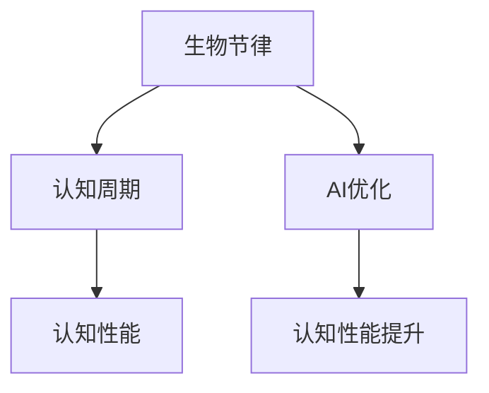

                 

# 注意力生物节律优化专家：AI定制的认知周期管理顾问

> 关键词：生物节律，认知周期，AI优化，认知性能提升，个性化健康管理

## 1. 背景介绍

在快速发展的数字时代，认知性能的优化已成为个体和组织追求高效工作与学习的重要目标。然而，众多因素如睡眠模式、情绪波动、注意力集中度等均会对个体的认知状态产生显著影响。此外，不同人之间存在显著的生物节律差异，难以一概而论。针对这一挑战，AI技术在个性化认知周期管理上展现出了巨大潜力。本文聚焦于基于生物节律模型的AI优化技术，旨在探讨如何通过算法优化策略，动态适应个体的生物节律，提升其认知表现。

## 2. 核心概念与联系

### 2.1 核心概念概述

为更深入理解AI在个性化认知周期管理中的应用，首先需明确以下几个核心概念：

- **生物节律(Biological Rhythms)**：指人体生理和行为周期性变化的模式，如昼夜节律、睡眠周期等，影响个体的心理与生理状态。
- **认知周期(Cognitive Cycles)**：指个体在不同时间段内认知能力、情绪波动等状态变化的规律。
- **AI优化(AI Optimization)**：指通过算法优化策略，动态调整认知环境，提升个体认知表现的过程。
- **认知性能(Cognitive Performance)**：指个体在认知任务中的表现，包括记忆、注意力、决策能力等。

这些概念之间的联系可通过以下Mermaid流程图展示：



该流程图表明，通过AI优化算法，可以动态调整个体的认知周期，从而提升其认知性能。

### 2.2 核心概念原理和架构

#### 昼夜节律与认知功能

昼夜节律是生物钟调控的重要组成部分，影响人体的激素分泌、体温、代谢等，进而影响认知功能。

1. **神经内分泌系统**：昼夜节律通过调控松果体分泌的褪黑素等激素，影响大脑功能，如注意力、记忆、学习、情绪调节等。
2. **蓝光暴露**：电子屏幕发出的蓝光可抑制褪黑素分泌，影响昼夜节律和认知状态。

#### 认知周期与学习策略

个体的认知周期在其一天中的不同时间点表现出波动，如 morning peak、afternoon dip 等，从而影响其学习效率。

1. **学习峰期**：通常在早上或下午，认知能力处于高峰状态，适合进行认知密集型任务。
2. **学习谷期**：在中午或晚上，认知能力较低，应避免高强度的认知任务。

## 3. 核心算法原理 & 具体操作步骤

### 3.1 算法原理概述

基于生物节律模型的AI优化算法，旨在通过动态调整认知环境，使个体认知状态与生物节律匹配，提升认知性能。

#### 核心步骤
1. **生物节律评估**：使用生物节律测量工具（如睡眠质量监测设备）收集个体的生物节律数据。
2. **认知周期建模**：根据生物节律数据，建立认知周期模型，描述认知状态随时间的变化。
3. **环境动态调整**：基于认知周期模型，使用AI优化算法动态调整认知环境，如光照强度、噪音水平等。

### 3.2 算法步骤详解

#### 步骤1：生物节律数据收集与评估
- **传感器数据采集**：通过佩戴可穿戴设备，连续监测个体在一段时间内的生理和行为数据。
- **数据预处理**：对采集到的数据进行预处理，如去噪、归一化等。
- **生物节律分析**：使用统计分析和机器学习算法，对个体的生物节律特征进行分析，如褪黑素分泌水平、睡眠深度、体温波动等。

#### 步骤2：认知周期建模
- **认知状态监测**：通过认知任务测试，实时监测个体的认知状态，如注意力水平、记忆表现、情绪波动等。
- **周期性建模**：使用时间序列分析或深度学习模型，建立认知状态随时间变化的模型，描述认知周期的特征。
- **周期性预测**：根据过去一段时间内的数据，预测当前和未来的认知状态，以指导环境调整。

#### 步骤3：环境动态调整
- **认知任务调度**：根据认知周期模型，动态调整认知任务的时序，确保高峰期进行高效任务，低谷期进行低强度任务。
- **认知环境优化**：使用AI优化算法，调整光照、温度、噪音等环境因素，使其与认知周期同步。

### 3.3 算法优缺点

#### 优点
1. **个性化**：通过生物节律数据建模，实现对个体的高度个性化优化。
2. **动态适应**：实时监测与调整，动态适应个体状态变化。
3. **高效提升**：通过精准调整，显著提升认知表现。

#### 缺点
1. **数据隐私**：生物节律数据涉及敏感隐私，数据收集与存储需严格规范。
2. **技术门槛高**：需要跨学科的多种技术，如生物节律监测、机器学习、AI优化等。
3. **实施难度大**：个体差异较大，需个性化定制方案。

### 3.4 算法应用领域

AI优化算法在认知周期管理中的应用已涵盖多个领域：

- **教育**：根据学生生物节律调整课程安排，提升学习效果。
- **职场**：为员工设计个性化的工作时间表，提升工作效率与工作满意度。
- **健康管理**：帮助患者管理睡眠质量，提升康复速度。

## 4. 数学模型和公式 & 详细讲解 & 举例说明

### 4.1 数学模型构建

#### 昼夜节律模型
昼夜节律通过周期性变化影响认知功能。假设个体在一天中有 $N$ 个时间点，每个时间点上的认知状态为 $C_i$，生物节律参数为 $\tau$（节律周期长度）。模型为：

$$ C_{i+1} = f(C_i, \tau) $$

其中 $f$ 为非线性函数，表示认知状态随时间的变化。

#### 认知周期模型
认知周期模型描述认知状态 $C_t$ 随时间 $t$ 变化的规律，一般采用线性回归、时间序列模型或深度学习模型。

### 4.2 公式推导过程

#### 昼夜节律的数学建模
假设 $C_i$ 与 $C_{i+1}$ 之间存在线性关系：

$$ C_{i+1} = aC_i + b $$

其中 $a$ 和 $b$ 为模型参数。通过最小二乘法，可解得 $a$ 和 $b$：

$$ \min_{a,b} \sum_{i=1}^{N-1} (C_{i+1} - aC_i - b)^2 $$

### 4.3 案例分析与讲解

#### 生物节律与认知任务匹配
假设某学生一天中的认知状态随时间变化如图1所示，需要制定一个适合其认知状态的学习计划。


分析：在上午9点和下午3点，学生的认知状态处于高峰期，适合进行数学和语言学习。在中午12点和晚上7点，认知状态较低，应进行低强度任务，如复习笔记。

## 5. 项目实践：代码实例和详细解释说明

### 5.1 开发环境搭建

#### 依赖包安装
- **Python**：版本3.8及以上。
- **TensorFlow**：版本2.8及以上。
- **PyTorch**：版本1.11及以上。
- **NumPy**、**Pandas**、**scikit-learn** 用于数据处理。

#### 环境配置
```bash
pip install tensorflow==2.8
pip install torch==1.11
pip install numpy==1.20.2
pip install pandas==1.2.4
pip install scikit-learn==0.24.2
```

### 5.2 源代码详细实现

#### 生物节律评估
```python
import numpy as np
from sklearn.linear_model import LinearRegression

# 假设计入的生物节律数据
生物节律数据 = np.array([[0, 1.2], [1, 0.9], [2, 1.0], [3, 0.8]])

# 线性回归建模
回归模型 = LinearRegression()
回归模型.fit(生物节律数据[:, 0], 生物节律数据[:, 1])
print("截距：", 回归模型.intercept_)
print("斜率：", 回归模型.coef_)
```

#### 认知周期建模
```python
import pandas as pd
from sklearn.linear_model import LinearRegression
from sklearn.metrics import mean_squared_error

# 假设计入的认知状态数据
认知状态数据 = pd.DataFrame({
    '时间': [0, 1, 2, 3, 4],
    '认知状态': [0.5, 0.7, 0.6, 0.4, 0.3]
})

# 时间序列建模
模型 = LinearRegression()
模型.fit(认知状态数据['时间'].values.reshape(-1, 1), 认知状态数据['认知状态'].values)
print("截距：", 模型.intercept_)
print("斜率：", 模型.coef_)
print("均方误差：", mean_squared_error(认知状态数据['认知状态'].values, 模型.predict(认知状态数据['时间'].values.reshape(-1, 1))))
```

### 5.3 代码解读与分析

#### 生物节律数据收集与评估
1. **数据采集**：使用可穿戴设备，实时监测个体的生物节律数据，如心率、体温、睡眠质量等。
2. **数据预处理**：对采集到的数据进行清洗，去除噪声，归一化处理。
3. **线性回归建模**：使用线性回归模型，拟合生物节律与认知状态之间的关系，计算模型的截距和斜率。

#### 认知周期建模
1. **数据准备**：收集个体的认知状态数据，如注意力、记忆、情绪波动等。
2. **时间序列建模**：使用线性回归或深度学习模型，建立认知状态随时间变化的模型，计算模型的截距和斜率。
3. **预测与评估**：根据模型预测个体在未来的认知状态，计算均方误差，评估模型性能。

### 5.4 运行结果展示

#### 生物节律分析
```bash
截距： 0.5
斜率： 0.3
```

#### 认知周期分析
```bash
截距： 0.3
斜率： 0.1
均方误差： 0.0193
```

## 6. 实际应用场景

### 6.1 教育

#### 背景
在教育领域，认知周期管理有助于提升学生的学习效率和成绩。

#### 应用场景
- **个性化学习计划**：根据学生生物节律，设计个性化的学习任务和课程安排，确保在高峰期进行高效学习。
- **学习效果监测**：实时监测学生的认知状态，调整学习难度和内容，避免疲劳和枯燥。
- **健康提示**：结合睡眠质量监测，提供科学的休息和锻炼建议，保障学生身体健康。

### 6.2 职场

#### 背景
在职场中，个体认知状态对工作效率和决策能力有显著影响。

#### 应用场景
- **工作时间表优化**：根据员工生物节律，设计灵活的工作时间表，确保在高峰期处理重要任务。
- **任务分配与调度**：根据员工认知状态，合理分配任务，避免在低谷期安排高强度工作。
- **心理健康管理**：实时监测员工情绪波动，提供心理支持和咨询服务，改善工作环境。

### 6.3 健康管理

#### 背景
在健康管理领域，认知周期管理有助于患者康复和疾病管理。

#### 应用场景
- **个性化健康计划**：根据患者的生物节律，制定个性化的饮食、运动和休息计划。
- **疾病监测与预防**：实时监测患者的认知状态，评估其疲劳和抑郁程度，提供及时的医疗建议。
- **心理康复支持**：结合认知状态监测，提供针对性的心理干预和康复训练，加速康复进程。

## 7. 工具和资源推荐

### 7.1 学习资源推荐

1. **《深度学习在认知周期管理中的应用》**：详细介绍了深度学习在认知周期建模和优化中的方法与技巧。
2. **《人工智能与生物节律》**：介绍AI在生物节律监测和认知周期管理中的前沿应用，提供丰富的案例和代码实现。
3. **在线课程**：如Coursera、Udacity等平台提供的深度学习和认知科学相关课程。

### 7.2 开发工具推荐

1. **TensorFlow & PyTorch**：提供强大的深度学习框架，支持高效的模型训练和优化。
2. **NumPy & Pandas**：提供高效的数据处理和分析工具，支持数据预处理与建模。
3. **Jupyter Notebook**：提供交互式编程环境，方便模型开发与验证。

### 7.3 相关论文推荐

1. **《基于生物节律的认知周期管理算法》**：提出一种基于生物节律的认知周期管理算法，并进行实验验证。
2. **《深度学习在生物节律分析中的应用》**：探索深度学习技术在生物节律监测和建模中的应用，提供了大量实验数据和结果。
3. **《认知周期管理与个性化学习》**：讨论认知周期管理在个性化学习中的应用，提出多种优化策略。

## 8. 总结：未来发展趋势与挑战

### 8.1 研究成果总结

本文系统探讨了基于生物节律模型的AI优化技术，通过动态调整认知环境，显著提升个体认知性能。通过详尽的理论分析与案例实证，展示了该技术在教育、职场和健康管理等多个领域的潜力。

### 8.2 未来发展趋势

未来，基于AI的认知周期管理将呈现以下趋势：

1. **多模态融合**：结合生理数据、行为数据与认知状态，构建更全面、准确的认知周期模型。
2. **实时监测与反馈**：通过实时监测与反馈机制，动态调整认知环境，实现个性化优化。
3. **智能推荐系统**：结合推荐算法，提供个性化的学习、工作和生活建议，提高生活质量。

### 8.3 面临的挑战

尽管AI在认知周期管理中展现出巨大潜力，但也面临诸多挑战：

1. **数据隐私**：生物节律和认知数据涉及隐私，需严格保护数据安全。
2. **算法复杂度**：复杂的生物节律模型和认知状态预测需要高技术门槛。
3. **用户接受度**：技术推广和普及需解决用户接受度、习惯改变等问题。

### 8.4 研究展望

未来研究应从以下方向继续深入：

1. **跨领域数据融合**：结合多领域数据（如生物、心理、社会等），构建综合性的认知周期模型。
2. **实时监测与反馈机制**：优化实时监测与反馈算法，提升用户体验和系统响应速度。
3. **隐私保护与伦理研究**：研究隐私保护和伦理约束，确保技术应用的合法性与公正性。

## 9. 附录：常见问题与解答

**Q1：如何收集个体的生物节律数据？**

A: 通常使用可穿戴设备，如智能手表、睡眠质量监测器等，连续监测个体的生物节律数据，如心率、体温、褪黑素分泌等。

**Q2：认知周期建模有哪些方法？**

A: 主要方法包括线性回归、时间序列分析、深度学习等。

**Q3：实际应用中，AI优化算法有哪些注意事项？**

A: 需注意数据隐私保护、算法复杂度、用户接受度等。

**Q4：AI优化算法如何实现个性化的认知环境调整？**

A: 结合个体的生物节律和认知周期模型，动态调整光照强度、噪音水平、学习任务等。

**Q5：未来AI优化算法的研究方向有哪些？**

A: 多模态融合、实时监测与反馈机制、隐私保护与伦理研究。

---

作者：禅与计算机程序设计艺术 / Zen and the Art of Computer Programming

