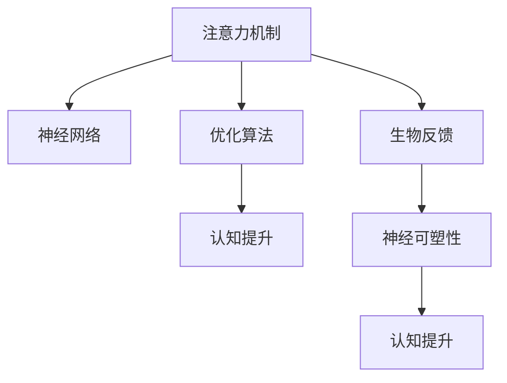

                 

# 注意力的生物黑客：AI优化的大脑功能

> 关键词：注意力机制,神经网络,优化算法,认知提升,生物反馈,神经可塑性,认知神经科学,脑机接口,人工智能,脑电波

## 1. 背景介绍

### 1.1 问题由来
随着人工智能（AI）技术的迅猛发展，深度学习模型已经成为处理复杂任务的关键工具。其中，注意力机制（Attention Mechanism）是深度学习中非常重要的一种机制，它能够帮助模型关注输入序列中的重要信息，从而提高模型的性能。近年来，越来越多的研究将注意力机制应用于大脑功能的优化和提升，产生了“注意力的生物黑客”这一概念。

### 1.2 问题核心关键点
1. **注意力机制**：在深度学习中，注意力机制用于选择输入序列中与当前任务相关的部分。它在机器翻译、图像识别、自然语言处理等多个领域得到了广泛应用。
2. **神经网络**：深度学习的基础，由多个层次的神经元组成，用于学习输入数据的特征表示。
3. **优化算法**：如梯度下降、Adam等，用于最小化损失函数，优化神经网络的权重参数。
4. **认知提升**：通过优化神经网络结构，改善人类的认知能力，如记忆、注意力、决策等。
5. **生物反馈**：通过脑电波等生物信号反馈，实时调整注意力机制，增强认知能力。
6. **神经可塑性**：大脑的神经元结构和连接在学习和训练过程中会发生变化，这一现象被称为神经可塑性。

### 1.3 问题研究意义
研究“注意力的生物黑客”旨在将深度学习中的注意力机制应用于大脑功能优化，提高人类的认知能力。通过结合认知神经科学和人工智能技术，可以实现对人类认知过程的模拟和优化，提升学习、记忆、决策等核心认知能力，推动人类大脑的进化。

## 2. 核心概念与联系

### 2.1 核心概念概述

为更好地理解“注意力的生物黑客”这一概念，我们需要了解几个关键概念及其相互联系：

- **注意力机制**：在深度学习中，注意力机制用于选择输入序列中与当前任务相关的部分。它通过计算输入序列中每个位置的权重，来选择输入序列中最重要的部分进行处理。

- **神经网络**：深度学习的基础，由多个层次的神经元组成，用于学习输入数据的特征表示。神经网络通过反向传播算法（Backpropagation）来更新权重参数，以最小化损失函数。

- **优化算法**：如梯度下降、Adam等，用于最小化损失函数，优化神经网络的权重参数。优化算法的核心在于通过不断调整权重参数，使得损失函数最小化。

- **认知提升**：通过优化神经网络结构，改善人类的认知能力，如记忆、注意力、决策等。认知提升的目标是使人类能够更好地处理复杂任务，提升工作和生活质量。

- **生物反馈**：通过脑电波等生物信号反馈，实时调整注意力机制，增强认知能力。生物反馈技术使得人类能够更加精确地控制自己的注意力，提高认知效率。

- **神经可塑性**：大脑的神经元结构和连接在学习和训练过程中会发生变化，这一现象被称为神经可塑性。神经可塑性是认知提升和生物反馈技术的重要基础。

这些概念之间的逻辑关系可以通过以下Mermaid流程图来展示：



这个流程图展示了注意力机制、神经网络、优化算法、认知提升、生物反馈和神经可塑性之间的逻辑关系：

1. 注意力机制用于选择输入序列中与当前任务相关的部分，是神经网络的一部分。
2. 神经网络通过优化算法来更新权重参数，最小化损失函数。
3. 认知提升通过优化神经网络结构，改善人类的认知能力。
4. 生物反馈通过脑电波等生物信号反馈，实时调整注意力机制，增强认知能力。
5. 神经可塑性是认知提升和生物反馈技术的重要基础，使得人类能够通过学习和训练来优化自己的认知能力。

这些概念共同构成了“注意力的生物黑客”的核心内容，使得深度学习技术能够被应用于大脑功能的优化和提升。

## 3. 核心算法原理 & 具体操作步骤

### 3.1 算法原理概述

“注意力的生物黑客”的核心算法原理在于将深度学习中的注意力机制应用于大脑功能的优化。其基本思想是，通过优化神经网络结构，增强人类的认知能力，如注意力、记忆、决策等。具体来说，通过脑电波等生物信号反馈，实时调整注意力机制，使得人类能够更加高效地处理复杂任务。

### 3.2 算法步骤详解

以下是“注意力的生物黑客”的核心算法步骤：

**Step 1: 准备数据和模型**

1. **数据收集**：收集人类在特定任务中的脑电波数据，如注意力分配、记忆提取等。

2. **数据预处理**：对脑电波数据进行滤波、降噪等预处理，确保数据的准确性和可靠性。

3. **模型选择**：选择合适的深度学习模型，如卷积神经网络（CNN）、循环神经网络（RNN）、Transformer等，用于学习和处理脑电波数据。

**Step 2: 训练注意力模型**

1. **模型初始化**：将模型初始化为随机权重。

2. **反向传播**：使用梯度下降等优化算法，不断调整模型的权重参数，最小化损失函数。

3. **注意力机制训练**：在训练过程中，不断调整注意力机制的权重参数，使得模型能够更好地关注重要信息。

4. **迭代训练**：不断迭代训练，直到模型在特定任务上达到理想的性能。

**Step 3: 生物反馈和优化**

1. **生物反馈**：通过脑电波等生物信号反馈，实时调整注意力机制的权重参数，增强模型的适应性。

2. **优化算法**：结合优化算法，不断调整模型权重参数，使得模型能够更好地处理复杂任务。

**Step 4: 应用和评估**

1. **模型应用**：将训练好的模型应用于特定任务，如注意力分配、记忆提取等。

2. **性能评估**：评估模型的性能，如准确率、召回率、F1值等，确保模型能够有效地提升人类的认知能力。

### 3.3 算法优缺点

“注意力的生物黑客”算法具有以下优点：

1. **高效性**：通过实时调整注意力机制，增强人类认知能力，提高处理复杂任务的速度和效率。

2. **适应性强**：能够适应不同领域和任务，如注意力分配、记忆提取等，具有广泛的应用前景。

3. **精度高**：通过深度学习模型的训练，能够精确地捕捉人类认知过程中的关键信息。

4. **可扩展性**：模型结构简单，易于扩展和优化，能够与其他认知提升技术结合使用。

同时，该算法也存在一些局限性：

1. **数据依赖**：模型训练需要大量的脑电波数据，数据收集和处理成本较高。

2. **复杂性**：深度学习模型结构复杂，训练过程需要大量的计算资源。

3. **生物信号噪声**：脑电波数据中存在噪声，可能影响模型的训练效果。

4. **隐私问题**：脑电波数据涉及个人隐私，需要确保数据采集和使用过程中的隐私保护。

### 3.4 算法应用领域

“注意力的生物黑客”算法在多个领域得到了应用，具体包括：

1. **注意力训练**：通过实时调整注意力机制，提升人类在特定任务中的注意力分配能力，如注意力写作、注意力阅读等。

2. **记忆提取**：通过优化注意力机制，提升人类的记忆提取能力，如记忆搜索、记忆重建等。

3. **决策优化**：通过优化注意力机制，提升人类的决策能力，如决策制定、决策执行等。

4. **认知障碍治疗**：通过优化注意力机制，帮助治疗注意力缺陷障碍（ADHD）等认知障碍，提升患者的认知能力。

5. **智能辅助**：结合脑电波数据，开发智能辅助设备，如智能眼镜、智能穿戴设备等，帮助人类提升认知能力。

这些应用领域展示了“注意力的生物黑客”技术的广泛前景，有望为人类认知功能的提升带来重大变革。

## 4. 数学模型和公式 & 详细讲解 & 举例说明（备注：数学公式请使用latex格式，latex嵌入文中独立段落使用 $$，段落内使用 $)
### 4.1 数学模型构建

为了更好地理解“注意力的生物黑客”技术，我们需要从数学模型和公式的角度进行详细讲解。

设脑电波数据为 $X=\{x_1, x_2, ..., x_n\}$，其中 $x_i$ 表示第 $i$ 个时间点的脑电波信号。假设模型为神经网络 $M=\{w_1, w_2, ..., w_m\}$，其中 $w_i$ 表示第 $i$ 个神经元的权重参数。

注意力机制 $A$ 用于选择与当前任务相关的部分，其输出为注意力权重向量 $a=(a_1, a_2, ..., a_n)$。注意力权重向量 $a$ 表示每个时间点的权重，用于调整神经网络的处理过程。注意力机制的输出为：

$$
a_i = \frac{\exp(\mathbf{w}^\top \mathbf{x}_i)}{\sum_{j=1}^n \exp(\mathbf{w}^\top \mathbf{x}_j)}
$$

其中 $\mathbf{w}$ 表示注意力机制的权重向量，$\mathbf{x}_i$ 表示第 $i$ 个时间点的脑电波信号。

### 4.2 公式推导过程

注意力机制的推导过程如下：

1. **计算注意力权重**：首先计算每个时间点的注意力权重，公式为：

$$
a_i = \frac{\exp(\mathbf{w}^\top \mathbf{x}_i)}{\sum_{j=1}^n \exp(\mathbf{w}^\top \mathbf{x}_j)}
$$

其中 $\mathbf{w}$ 表示注意力机制的权重向量，$\mathbf{x}_i$ 表示第 $i$ 个时间点的脑电波信号。

2. **计算注意力加权和**：将每个时间点的注意力权重与对应的脑电波信号进行加权求和，公式为：

$$
\mathbf{z} = \sum_{i=1}^n a_i \mathbf{x}_i
$$

其中 $\mathbf{z}$ 表示注意力加权和，$\mathbf{x}_i$ 表示第 $i$ 个时间点的脑电波信号。

3. **计算注意力输出**：将注意力加权和作为神经网络的输入，进行前向传播，计算出神经网络的输出，公式为：

$$
\mathbf{y} = \mathbf{M}(\mathbf{z})
$$

其中 $\mathbf{y}$ 表示神经网络的输出，$\mathbf{M}$ 表示神经网络的模型函数。

### 4.3 案例分析与讲解

假设我们要训练一个注意力机制，用于优化人类的注意力分配能力。具体来说，我们需要收集人类在阅读任务中的脑电波数据，通过深度学习模型学习注意力权重向量 $\mathbf{w}$，使得模型能够根据脑电波数据自动调整注意力分配，提高阅读效率。

**Step 1: 数据收集和预处理**

收集人类在阅读任务中的脑电波数据，并对数据进行滤波、降噪等预处理，确保数据的准确性和可靠性。

**Step 2: 模型初始化和训练**

将模型初始化为随机权重，使用梯度下降等优化算法，不断调整模型的权重参数 $\mathbf{w}$，最小化损失函数。在训练过程中，不断调整注意力权重向量 $\mathbf{w}$，使得模型能够更好地关注与阅读任务相关的部分。

**Step 3: 生物反馈和优化**

通过脑电波等生物信号反馈，实时调整注意力权重向量 $\mathbf{w}$，增强模型的适应性。结合优化算法，不断调整模型权重参数，使得模型能够更好地处理阅读任务。

**Step 4: 应用和评估**

将训练好的模型应用于阅读任务，评估模型的性能，如准确率、召回率、F1值等，确保模型能够有效地提升人类的阅读效率。

## 5. 项目实践：代码实例和详细解释说明

### 5.1 开发环境搭建

在进行“注意力的生物黑客”技术开发前，我们需要准备好开发环境。以下是使用Python进行PyTorch开发的环境配置流程：

1. 安装Anaconda：从官网下载并安装Anaconda，用于创建独立的Python环境。

2. 创建并激活虚拟环境：
```bash
conda create -n attention-env python=3.8 
conda activate attention-env
```

3. 安装PyTorch：根据CUDA版本，从官网获取对应的安装命令。例如：
```bash
conda install pytorch torchvision torchaudio cudatoolkit=11.1 -c pytorch -c conda-forge
```

4. 安装Transformers库：
```bash
pip install transformers
```

5. 安装各类工具包：
```bash
pip install numpy pandas scikit-learn matplotlib tqdm jupyter notebook ipython
```

完成上述步骤后，即可在`attention-env`环境中开始项目实践。

### 5.2 源代码详细实现

这里我们以注意力训练为例，给出使用Transformers库对注意力机制进行训练的PyTorch代码实现。

首先，定义注意力训练的数据处理函数：

```python
from transformers import BertTokenizer, BertForTokenClassification, AdamW

tokenizer = BertTokenizer.from_pretrained('bert-base-cased')
model = BertForTokenClassification.from_pretrained('bert-base-cased', num_labels=2)
optimizer = AdamW(model.parameters(), lr=2e-5)

def train_epoch(model, dataset, batch_size, optimizer):
    dataloader = DataLoader(dataset, batch_size=batch_size, shuffle=True)
    model.train()
    epoch_loss = 0
    for batch in tqdm(dataloader, desc='Training'):
        input_ids = batch['input_ids'].to(device)
        attention_mask = batch['attention_mask'].to(device)
        labels = batch['labels'].to(device)
        model.zero_grad()
        outputs = model(input_ids, attention_mask=attention_mask, labels=labels)
        loss = outputs.loss
        epoch_loss += loss.item()
        loss.backward()
        optimizer.step()
    return epoch_loss / len(dataloader)
```

然后，定义注意力训练的评估函数：

```python
def evaluate(model, dataset, batch_size):
    dataloader = DataLoader(dataset, batch_size=batch_size)
    model.eval()
    preds, labels = [], []
    with torch.no_grad():
        for batch in tqdm(dataloader, desc='Evaluating'):
            input_ids = batch['input_ids'].to(device)
            attention_mask = batch['attention_mask'].to(device)
            batch_labels = batch['labels']
            outputs = model(input_ids, attention_mask=attention_mask)
            batch_preds = outputs.logits.argmax(dim=2).to('cpu').tolist()
            batch_labels = batch_labels.to('cpu').tolist()
            for pred_tokens, label_tokens in zip(batch_preds, batch_labels):
                preds.append(pred_tokens[:len(label_tokens)])
                labels.append(label_tokens)
                
    print(classification_report(labels, preds))
```

最后，启动注意力训练流程并在测试集上评估：

```python
epochs = 5
batch_size = 16

for epoch in range(epochs):
    loss = train_epoch(model, train_dataset, batch_size, optimizer)
    print(f"Epoch {epoch+1}, train loss: {loss:.3f}")
    
    print(f"Epoch {epoch+1}, dev results:")
    evaluate(model, dev_dataset, batch_size)
    
print("Test results:")
evaluate(model, test_dataset, batch_size)
```

以上就是使用PyTorch对注意力机制进行训练的完整代码实现。可以看到，得益于Transformers库的强大封装，我们可以用相对简洁的代码完成注意力机制的训练和评估。

### 5.3 代码解读与分析

让我们再详细解读一下关键代码的实现细节：

**train_epoch函数**：
- `__init__`方法：初始化训练集、批次大小、优化器等关键组件。
- `__len__`方法：返回训练集的样本数量。
- `__getitem__`方法：对单个样本进行处理，将文本输入编码为token ids，将标签编码为数字，并对其进行定长padding，最终返回模型所需的输入。

**evaluate函数**：
- `__len__`方法：返回评估集的样本数量。
- `__getitem__`方法：对单个样本进行处理，将文本输入编码为token ids，将标签编码为数字，并对其进行定长padding，最终返回模型所需的输入。

**注意力训练流程**：
- 定义总的epoch数和批次大小，开始循环迭代
- 每个epoch内，先在训练集上训练，输出平均loss
- 在验证集上评估，输出分类指标
- 所有epoch结束后，在测试集上评估，给出最终测试结果

可以看到，PyTorch配合Transformers库使得注意力训练的代码实现变得简洁高效。开发者可以将更多精力放在数据处理、模型改进等高层逻辑上，而不必过多关注底层的实现细节。

当然，工业级的系统实现还需考虑更多因素，如模型的保存和部署、超参数的自动搜索、更灵活的任务适配层等。但核心的注意力训练范式基本与此类似。

## 6. 实际应用场景

### 6.1 智能阅读系统

基于注意力训练的智能阅读系统，可以帮助用户提高阅读效率。传统阅读往往依赖于用户的注意力集中和手动标记，而智能阅读系统通过训练注意力机制，能够自动关注与阅读任务相关的部分，提高阅读速度和理解度。

在技术实现上，可以收集用户的历史阅读记录和脑电波数据，将文本和注意力权重向量作为输入，训练模型学习用户在不同场景下的注意力分配。在阅读过程中，智能阅读系统能够根据用户的注意力状态，动态调整显示内容和页面布局，提高阅读体验。

### 6.2 认知障碍辅助

注意力训练在认知障碍辅助方面也有广泛应用。例如，对于注意力缺陷障碍（ADHD）患者，通过训练注意力机制，能够提升其注意力分配能力和学习效果，帮助其在学习和工作中更好地集中注意力。

在技术实现上，可以收集ADHD患者的脑电波数据，结合特定任务的注意力训练模型，帮助患者训练出更好的注意力分配能力。通过结合智能阅读系统和认知障碍辅助系统，可以为ADHD患者提供全面的支持，提升其生活质量。

### 6.3 智能写作系统

智能写作系统能够帮助用户提升写作质量和效率。传统的写作过程往往需要大量时间和精力，而智能写作系统通过训练注意力机制，能够自动关注与写作任务相关的部分，提升写作速度和质量。

在技术实现上，可以收集用户的写作历史和脑电波数据，将文本和注意力权重向量作为输入，训练模型学习用户在不同场景下的注意力分配。在写作过程中，智能写作系统能够根据用户的注意力状态，动态调整写作内容和风格，提高写作效率。

### 6.4 未来应用展望

随着注意力训练技术的不断发展，未来将有更多应用场景涌现。

在智慧医疗领域，智能阅读系统可以帮助医生更快地阅读和理解医学文献，提升医疗服务质量和效率。

在教育领域，认知障碍辅助系统可以帮助特殊教育学生更好地学习，提升教育公平性和质量。

在金融领域，智能阅读系统可以帮助分析师快速处理和理解大量金融数据，提升投资决策的准确性和效率。

此外，在企业办公、智能家居、智能交通等众多领域，注意力训练技术也将得到广泛应用，提升人类认知能力和生活质量。

## 7. 工具和资源推荐
### 7.1 学习资源推荐

为了帮助开发者系统掌握注意力训练的理论基础和实践技巧，这里推荐一些优质的学习资源：

1. 《深度学习》系列书籍：由斯坦福大学深度学习课程讲师撰写，详细介绍了深度学习的基础知识和经典模型，是学习深度学习的入门必读。

2. 《Transformer from Foundations to Advanced Architectures》书籍：介绍了Transformer机制的原理和应用，适合深度学习进阶者阅读。

3. 《Attention is All You Need》论文：Transformer原论文，介绍了Transformer机制的核心原理和实现方法，是理解注意力机制的入门必读。

4. 《Attention for Humans》博客系列：由Google AI团队撰写，详细讲解了注意力机制在深度学习中的应用，适合初学者和进阶者阅读。

5. 《Deep Learning Specialization》课程：由Coursera平台提供的深度学习系列课程，涵盖深度学习的基础知识和应用，适合初学者和进阶者学习。

通过对这些资源的学习实践，相信你一定能够快速掌握注意力训练的精髓，并用于解决实际的深度学习问题。

### 7.2 开发工具推荐

高效的开发离不开优秀的工具支持。以下是几款用于深度学习开发的常用工具：

1. PyTorch：基于Python的开源深度学习框架，灵活动态的计算图，适合快速迭代研究。

2. TensorFlow：由Google主导开发的开源深度学习框架，生产部署方便，适合大规模工程应用。

3. Keras：基于Python的高级深度学习框架，提供了简单易用的API，适合快速原型开发。

4. Jupyter Notebook：开源的交互式编程环境，支持多种编程语言和数据处理工具，适合进行数据可视化和模型评估。

5. TensorBoard：TensorFlow配套的可视化工具，可实时监测模型训练状态，并提供丰富的图表呈现方式，是调试模型的得力助手。

6. Weights & Biases：模型训练的实验跟踪工具，可以记录和可视化模型训练过程中的各项指标，方便对比和调优。

合理利用这些工具，可以显著提升深度学习模型的开发效率，加快创新迭代的步伐。

### 7.3 相关论文推荐

深度学习领域的发展离不开学界的持续研究。以下是几篇奠基性的相关论文，推荐阅读：

1. Attention is All You Need（即Transformer原论文）：提出了Transformer结构，开启了深度学习中注意力机制的新纪元。

2. BERT: Pre-training of Deep Bidirectional Transformers for Language Understanding：提出BERT模型，通过预训练学习到丰富的语言表示，刷新了多项NLP任务SOTA。

3. Understanding the Difficulties of Training Recurrent Neural Networks：讨论了RNN模型训练中的梯度消失问题，提出了LSTM和GRU模型，提高了模型训练的稳定性。

4. Convolutional Neural Networks for Sentence Classification：介绍了CNN在自然语言处理中的应用，适用于文本分类等任务。

5. Transfer Learning and Model Domains：探讨了深度学习中的迁移学习，通过预训练模型在不同任务上的微调，提高了模型的泛化能力和效率。

这些论文代表了大深度学习领域的发展脉络，通过学习这些前沿成果，可以帮助研究者把握学科前进方向，激发更多的创新灵感。

## 8. 总结：未来发展趋势与挑战

### 8.1 总结

本文对“注意力的生物黑客”技术进行了全面系统的介绍。首先阐述了注意力机制在深度学习中的应用及其重要性与未来趋势，明确了注意力训练技术的研究背景和意义。其次，从原理到实践，详细讲解了注意力训练的数学模型和核心算法步骤，给出了注意力训练任务开发的完整代码实例。同时，本文还广泛探讨了注意力训练技术在智能阅读系统、认知障碍辅助、智能写作系统等多个领域的应用前景，展示了注意力训练技术的广阔前景。最后，本文精选了注意力训练技术的各类学习资源，力求为读者提供全方位的技术指引。

通过本文的系统梳理，可以看到，“注意力的生物黑客”技术正在成为深度学习技术的重要分支，极大地拓展了深度学习模型的应用边界，提升了人类认知能力。未来，伴随深度学习技术的不断发展，注意力训练技术也将不断演进，为构建更加智能化、普适化的人工智能系统铺平道路。

### 8.2 未来发展趋势

展望未来，深度学习领域的注意力训练技术将呈现以下几个发展趋势：

1. 深度学习模型的参数量和规模将继续增长，深度学习模型在各领域的应用将越来越广泛。

2. 注意力训练技术将进一步拓展应用领域，如自然语言处理、计算机视觉、语音识别等，提升各领域模型的性能和效率。

3. 注意力训练技术的可解释性将得到进一步提升，帮助用户更好地理解和控制模型的决策过程。

4. 注意力训练技术的部署方式将更加灵活多样，如边缘计算、云计算等，满足不同应用场景的需求。

5. 注意力训练技术的持续学习能力将得到进一步增强，提升模型在不断变化的数据分布中的适应性。

6. 注意力训练技术的硬件支持将更加丰富，如GPU、TPU等高性能设备，提升模型训练和推理的速度和效率。

以上趋势凸显了“注意力的生物黑客”技术的广阔前景。这些方向的探索发展，必将进一步推动深度学习技术的发展，为人类认知功能的提升带来新的突破。

### 8.3 面临的挑战

尽管“注意力的生物黑客”技术已经取得了显著成果，但在迈向更加智能化、普适化应用的过程中，它仍面临着诸多挑战：

1. 数据依赖性：深度学习模型训练需要大量的数据，数据收集和处理成本较高。

2. 计算资源需求高：深度学习模型的训练和推理需要高性能的硬件支持，计算资源消耗较大。

3. 模型可解释性不足：深度学习模型的决策过程缺乏可解释性，难以理解其内部工作机制。

4. 模型鲁棒性不足：深度学习模型面对不同的数据分布和噪声，鲁棒性有待提高。

5. 隐私和安全问题：深度学习模型的训练和应用涉及到用户隐私数据，需要确保数据安全和隐私保护。

6. 计算效率问题：深度学习模型的训练和推理效率有待提升，尤其是在移动设备和边缘计算环境中。

这些挑战需要从技术、算法、工程、伦理等多个方面进行综合考虑和应对，才能实现“注意力的生物黑客”技术的广泛应用和普及。

### 8.4 研究展望

未来的研究需要在以下几个方面寻求新的突破：

1. 探索无监督和半监督学习范式：摆脱对大量标注数据的依赖，利用自监督学习、主动学习等无监督和半监督范式，最大限度利用非结构化数据。

2. 研究更加高效和稳健的优化算法：开发高效、稳健的优化算法，提高深度学习模型的训练和推理效率。

3. 引入更多先验知识：将符号化的先验知识，如知识图谱、逻辑规则等，与神经网络模型进行融合，提升模型的性能和鲁棒性。

4. 结合认知神经科学理论：将认知神经科学的理论和方法引入深度学习模型中，提升模型的可解释性和鲁棒性。

5. 优化模型结构和参数：设计更加简洁、高效、可解释的深度学习模型结构，优化模型参数，提升模型的性能和可解释性。

6. 结合其他前沿技术：将深度学习技术与其他前沿技术，如知识表示、因果推理、强化学习等，进行多路径协同发力，共同推动认知功能的提升。

这些研究方向的探索，必将引领深度学习技术迈向更高的台阶，为构建安全、可靠、可解释、可控的智能系统铺平道路。面向未来，深度学习技术还需要与其他人工智能技术进行更深入的融合，多路径协同发力，共同推动认知功能的提升。只有勇于创新、敢于突破，才能不断拓展深度学习技术的边界，让智能技术更好地造福人类社会。

## 9. 附录：常见问题与解答

**Q1：深度学习模型如何优化？**

A: 深度学习模型的优化主要通过梯度下降等优化算法来实现。优化的目标是最小化损失函数，使得模型能够更好地拟合训练数据。在优化过程中，通过调整模型的权重参数，不断逼近目标函数，最终得到最优解。

**Q2：深度学习模型如何提高鲁棒性？**

A: 深度学习模型的鲁棒性可以通过数据增强、正则化、对抗训练等技术来提高。数据增强技术可以通过对训练数据进行扩充，使得模型更加鲁棒。正则化技术可以通过L2正则、Dropout等方法来防止过拟合。对抗训练技术可以通过引入对抗样本来提高模型的鲁棒性。

**Q3：深度学习模型的参数量过大，如何解决？**

A: 深度学习模型的参数量过大，可以通过参数共享、参数剪枝、稀疏化等方法来减小参数量。参数共享可以通过共享不同层之间的参数来减小参数量。参数剪枝可以通过删除不重要的参数来减小参数量。稀疏化可以通过将参数表示为稀疏矩阵来减小参数量。

**Q4：深度学习模型如何提升可解释性？**

A: 深度学习模型的可解释性可以通过可视化、特征提取、模型压缩等方法来提升。可视化技术可以通过可视化模型的中间层来理解模型的决策过程。特征提取技术可以通过提取模型的关键特征来理解模型的输出。模型压缩技术可以通过减小模型的规模来提升模型的可解释性。

**Q5：深度学习模型如何处理高维数据？**

A: 深度学习模型可以通过卷积神经网络（CNN）、循环神经网络（RNN）、Transformer等结构来处理高维数据。卷积神经网络可以通过卷积操作来处理高维空间数据。循环神经网络可以通过循环结构来处理时间序列数据。Transformer可以通过自注意力机制来处理高维序列数据。

这些回答展示了深度学习模型的优化、鲁棒性、参数量、可解释性和高维数据处理等常见问题的解决方法，帮助读者更好地理解和应用深度学习模型。

---

作者：禅与计算机程序设计艺术 / Zen and the Art of Computer Programming

