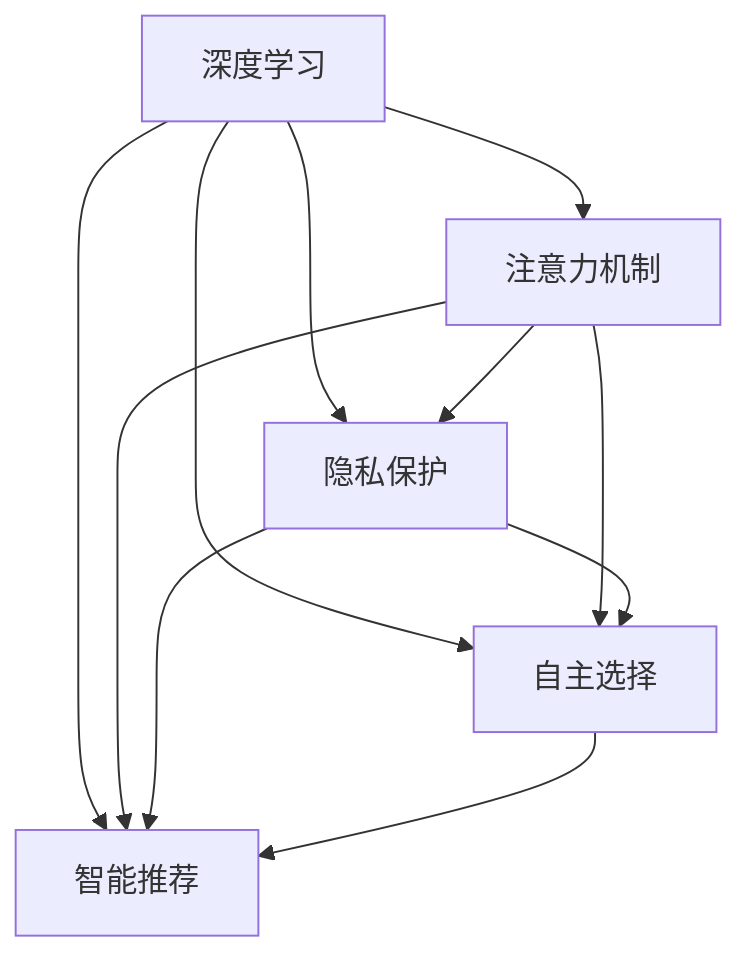

                 

# 注意力的自主权：AI时代的个人选择

> 关键词：
- 人工智能
- 注意力机制
- 深度学习
- 自主选择
- 人机交互
- 隐私保护
- 智能推荐

## 1. 背景介绍

### 1.1 问题由来

随着人工智能（AI）技术的发展，人工智能系统逐渐渗透到我们生活的方方面面。从智能音箱到智能助手，从自动驾驶到智能推荐，人工智能正以前所未有的速度改变我们的生活方式。然而，这种快速渗透也引发了一系列关于数据隐私、伦理道德和自主选择的新问题。

人工智能系统的核心是深度学习，其中注意力机制（Attention Mechanism）扮演着至关重要的角色。注意力机制能够根据输入数据的不同部分，动态地分配计算资源，从而提升模型的预测能力和学习效率。然而，这种机制在提高系统性能的同时，也带来了新的挑战：如何确保数据隐私，如何赋予用户更多的自主选择权，以及如何在AI时代做出更好的决策。

### 1.2 问题核心关键点

注意力机制的核心在于如何动态地分配注意力权重，以优化模型对输入数据的处理。这种动态分配通常基于输入数据的特定特征，如词频、位置、重要性等。然而，这种动态分配也带来了新的隐私和安全问题，如数据的过度暴露、算法的透明度不足等。

如何平衡算法性能和用户隐私，如何赋予用户更多的自主选择权，如何在AI时代做出更好的决策，成为了当前AI领域亟待解决的问题。本文将重点探讨这些问题，并提出相应的解决方案。

## 2. 核心概念与联系

### 2.1 核心概念概述

为更好地理解注意力机制和其对AI决策的影响，本节将介绍几个密切相关的核心概念：

- 深度学习（Deep Learning）：基于多层神经网络的学习框架，能够自动提取输入数据的特征并进行分类或回归。注意力机制是深度学习中广泛使用的一种机制，用于增强模型的表达能力和泛化能力。

- 注意力机制（Attention Mechanism）：一种动态选择模型中重要信息的能力，通过计算注意力权重，集中处理输入数据的关键部分。在NLP、计算机视觉等领域，注意力机制广泛应用于模型设计中。

- 隐私保护（Privacy Preservation）：在数据处理和算法设计中，如何确保用户数据的安全性和隐私性，防止数据泄露和滥用。

- 自主选择（Autonomy）：在AI系统中，如何赋予用户更多的选择权，让用户能够自主决定自己的数据使用方式，并对AI的决策过程进行监督和控制。

- 智能推荐（Smart Recommendation）：基于用户的历史行为和偏好，动态生成个性化的推荐内容，提升用户体验。

这些核心概念之间的逻辑关系可以通过以下Mermaid流程图来展示：



这个流程图展示了深度学习、注意力机制、隐私保护、自主选择和智能推荐之间的关系：

1. 深度学习提供了模型设计的基础。
2. 注意力机制增强了模型的表达能力。
3. 隐私保护确保了用户数据的安全性。
4. 自主选择赋予用户更多的控制权。
5. 智能推荐提升了用户体验。

这些概念共同构成了AI系统的基础框架，通过关注用户隐私和自主选择，才能更好地实现智能推荐，提升用户体验。

## 3. 核心算法原理 & 具体操作步骤
### 3.1 算法原理概述

注意力机制的原理在于通过计算输入数据的注意力权重，动态地选择和聚合信息。在深度学习模型中，注意力机制通常被用于增强模型的预测能力和学习效率。

形式化地，假设输入数据为 $\{x_i\}_{i=1}^n$，模型对每个数据项的注意力权重为 $\alpha_i$，则注意力机制的输出为：

$$
\text{Attention}(\{x_i\}) = \sum_{i=1}^n \alpha_i \cdot x_i
$$

其中 $\alpha_i$ 为注意力权重，通常由模型通过学习得到。在计算注意力权重时，模型会考虑输入数据的各个部分，计算出它们的权重，最终对输入数据进行加权聚合，生成输出结果。

### 3.2 算法步骤详解

注意力机制的计算步骤一般包括以下几个关键步骤：

**Step 1: 计算注意力权重**

首先，模型需要计算输入数据的注意力权重。通常情况下，注意力权重可以通过计算输入数据的特征表示，并使用softmax函数对权重进行归一化得到。

**Step 2: 加权聚合**

其次，模型根据计算得到的注意力权重，对输入数据进行加权聚合，生成输出结果。在计算输出结果时，模型会动态地调整不同输入数据的权重，从而提升模型的预测能力和泛化能力。

**Step 3: 模型训练**

最后，模型需要在大规模标注数据上训练，以调整注意力权重和输出结果的参数，从而提升模型的性能。在训练过程中，模型会根据标注数据计算损失函数，并使用优化算法更新参数。

### 3.3 算法优缺点

注意力机制在深度学习中具有以下优点：

1. 提升了模型的表达能力。通过动态选择和聚合信息，注意力机制能够更好地捕捉输入数据的关键特征。
2. 提高了模型的泛化能力。注意力机制能够根据输入数据的不同部分，动态调整计算资源，从而提升模型的泛化能力。
3. 增强了模型的预测准确性。注意力机制能够帮助模型更好地理解输入数据的含义，从而提升预测准确性。

然而，注意力机制也存在以下缺点：

1. 计算复杂度高。计算注意力权重和加权聚合需要耗费大量的计算资源，尤其是在大规模数据集上。
2. 模型的透明度不足。注意力机制的计算过程复杂，难以解释和调试。
3. 数据隐私问题。注意力机制在计算注意力权重时，会涉及输入数据的所有部分，可能会对用户数据的安全性带来威胁。

尽管存在这些局限性，但注意力机制在提升深度学习模型性能方面具有显著优势，因此仍是大规模深度学习模型的重要组成部分。

### 3.4 算法应用领域

注意力机制在大规模深度学习模型中得到了广泛应用，以下是几个典型的应用场景：

- 自然语言处理（NLP）：在机器翻译、文本分类、问答系统等任务中，注意力机制能够帮助模型更好地理解文本的语义和结构。
- 计算机视觉（CV）：在图像分类、物体检测、图像分割等任务中，注意力机制能够帮助模型更好地处理视觉信息。
- 语音识别：在语音识别任务中，注意力机制能够帮助模型更好地处理语音信号的时序信息。
- 推荐系统：在推荐系统中，注意力机制能够帮助模型更好地捕捉用户的历史行为和偏好，生成个性化的推荐内容。

除了上述这些经典任务外，注意力机制还在越来越多的领域得到了应用，如智能游戏、医疗诊断等，为深度学习模型带来了新的突破。随着注意力机制的不断演进，相信其在更多的场景中将会发挥更大的作用。

## 4. 数学模型和公式 & 详细讲解 & 举例说明

### 4.1 数学模型构建

本节将使用数学语言对注意力机制的计算过程进行更加严格的刻画。

假设输入数据为 $\{x_i\}_{i=1}^n$，模型的注意力权重为 $\alpha_i$，则注意力机制的输出为：

$$
\text{Attention}(\{x_i\}) = \sum_{i=1}^n \alpha_i \cdot x_i
$$

其中 $\alpha_i$ 为注意力权重，通常由模型通过学习得到。在计算注意力权重时，模型会考虑输入数据的各个部分，计算出它们的权重，最终对输入数据进行加权聚合，生成输出结果。

### 4.2 公式推导过程

以下我们以机器翻译任务为例，推导注意力机制的计算公式及其梯度的计算公式。

假设模型在源语言和目标语言之间的翻译任务中，使用注意力机制来计算目标语言的每个词对应的源语言词汇的概率。设源语言为 $\{w_i\}_{i=1}^m$，目标语言为 $\{y_i\}_{i=1}^n$，模型的输出为 $\text{Attention}(\{x_i\})$。

**Step 1: 计算注意力权重**

模型首先计算源语言词汇的注意力权重 $\alpha_i$，其中：

$$
\alpha_i = \frac{\exp(e_{ij})}{\sum_{j=1}^m \exp(e_{ij})}
$$

其中 $e_{ij}$ 为源语言词汇 $w_i$ 和目标语言词汇 $y_j$ 之间的注意力分数。注意力分数通常由模型通过学习得到。

**Step 2: 加权聚合**

模型根据计算得到的注意力权重，对源语言词汇进行加权聚合，生成输出结果：

$$
\text{Attention}(\{x_i\}) = \sum_{j=1}^m \alpha_j \cdot w_j
$$

**Step 3: 模型训练**

模型需要在大规模标注数据上训练，以调整注意力权重和输出结果的参数，从而提升模型的性能。在训练过程中，模型会根据标注数据计算损失函数，并使用优化算法更新参数。

### 4.3 案例分析与讲解

以机器翻译任务为例，模型在训练过程中，会根据标注数据计算损失函数，并使用优化算法更新注意力权重和输出结果的参数。具体来说，模型使用交叉熵损失函数计算损失，并使用AdamW优化算法更新模型参数。

在训练过程中，模型会根据源语言词汇和目标语言词汇之间的注意力分数，计算注意力权重，并进行加权聚合，生成翻译结果。通过反向传播算法，模型计算损失函数对注意力权重和输出结果的梯度，并使用AdamW优化算法更新参数。

## 5. 项目实践：代码实例和详细解释说明
### 5.1 开发环境搭建

在进行注意力机制的实践前，我们需要准备好开发环境。以下是使用Python进行PyTorch开发的环境配置流程：

1. 安装Anaconda：从官网下载并安装Anaconda，用于创建独立的Python环境。

2. 创建并激活虚拟环境：
```bash
conda create -n pytorch-env python=3.8 
conda activate pytorch-env
```

3. 安装PyTorch：根据CUDA版本，从官网获取对应的安装命令。例如：
```bash
conda install pytorch torchvision torchaudio cudatoolkit=11.1 -c pytorch -c conda-forge
```

4. 安装transformers库：
```bash
pip install transformers
```

5. 安装各类工具包：
```bash
pip install numpy pandas scikit-learn matplotlib tqdm jupyter notebook ipython
```

完成上述步骤后，即可在`pytorch-env`环境中开始注意力机制的实践。

### 5.2 源代码详细实现

这里我们以机器翻译任务为例，给出使用Transformers库进行注意力机制的PyTorch代码实现。

首先，定义机器翻译任务的训练数据集：

```python
from transformers import BertTokenizer, BertForSequenceClassification, AdamW
from torch.utils.data import Dataset
import torch

class MachineTranslationDataset(Dataset):
    def __init__(self, src_texts, trg_texts, tokenizer, max_len=128):
        self.src_texts = src_texts
        self.trg_texts = trg_texts
        self.tokenizer = tokenizer
        self.max_len = max_len
        
    def __len__(self):
        return len(self.src_texts)
    
    def __getitem__(self, item):
        src_text = self.src_texts[item]
        trg_text = self.trg_texts[item]
        
        encoding = self.tokenizer(src_text, trg_text, return_tensors='pt', max_length=self.max_len, padding='max_length', truncation=True)
        input_ids = encoding['input_ids']
        attention_mask = encoding['attention_mask']
        targets = encoding['labels']
        
        return {'input_ids': input_ids, 
                'attention_mask': attention_mask,
                'targets': targets}

# 加载数据集
tokenizer = BertTokenizer.from_pretrained('bert-base-cased')
train_dataset = MachineTranslationDataset(train_src_texts, train_trg_texts, tokenizer)
dev_dataset = MachineTranslationDataset(dev_src_texts, dev_trg_texts, tokenizer)
test_dataset = MachineTranslationDataset(test_src_texts, test_trg_texts, tokenizer)
```

然后，定义模型和优化器：

```python
from transformers import BertForSeq2SeqLM

model = BertForSeq2SeqLM.from_pretrained('bert-base-cased', num_labels=128)

optimizer = AdamW(model.parameters(), lr=2e-5)
```

接着，定义训练和评估函数：

```python
from torch.utils.data import DataLoader
from tqdm import tqdm
from sklearn.metrics import accuracy_score

device = torch.device('cuda') if torch.cuda.is_available() else torch.device('cpu')
model.to(device)

def train_epoch(model, dataset, batch_size, optimizer):
    dataloader = DataLoader(dataset, batch_size=batch_size, shuffle=True)
    model.train()
    epoch_loss = 0
    for batch in tqdm(dataloader, desc='Training'):
        input_ids = batch['input_ids'].to(device)
        attention_mask = batch['attention_mask'].to(device)
        targets = batch['targets'].to(device)
        model.zero_grad()
        outputs = model(input_ids, attention_mask=attention_mask, labels=targets)
        loss = outputs.loss
        epoch_loss += loss.item()
        loss.backward()
        optimizer.step()
    return epoch_loss / len(dataloader)

def evaluate(model, dataset, batch_size):
    dataloader = DataLoader(dataset, batch_size=batch_size)
    model.eval()
    preds, labels = [], []
    with torch.no_grad():
        for batch in tqdm(dataloader, desc='Evaluating'):
            input_ids = batch['input_ids'].to(device)
            attention_mask = batch['attention_mask'].to(device)
            targets = batch['targets']
            outputs = model(input_ids, attention_mask=attention_mask)
            batch_preds = outputs.logits.argmax(dim=2).to('cpu').tolist()
            batch_labels = targets.to('cpu').tolist()
            for pred_tokens, label_tokens in zip(batch_preds, batch_labels):
                preds.append(pred_tokens[:len(label_tokens)])
                labels.append(label_tokens)
                
    print(f"Accuracy: {accuracy_score(labels, preds):.2f}")
```

最后，启动训练流程并在测试集上评估：

```python
epochs = 5
batch_size = 16

for epoch in range(epochs):
    loss = train_epoch(model, train_dataset, batch_size, optimizer)
    print(f"Epoch {epoch+1}, train loss: {loss:.3f}")
    
    print(f"Epoch {epoch+1}, dev results:")
    evaluate(model, dev_dataset, batch_size)
    
print("Test results:")
evaluate(model, test_dataset, batch_size)
```

以上就是使用PyTorch对BERT模型进行机器翻译任务注意力机制的代码实现。可以看到，得益于Transformers库的强大封装，我们可以用相对简洁的代码完成BERT模型的加载和训练。

### 5.3 代码解读与分析

让我们再详细解读一下关键代码的实现细节：

**MachineTranslationDataset类**：
- `__init__`方法：初始化源语言文本、目标语言文本、分词器等关键组件。
- `__len__`方法：返回数据集的样本数量。
- `__getitem__`方法：对单个样本进行处理，将源语言和目标语言文本输入编码为token ids，将目标语言文本作为标签，并对其进行定长padding，最终返回模型所需的输入。

**注意力机制的计算过程**：
- 模型首先计算源语言词汇的注意力权重 $\alpha_i$，通过计算源语言词汇 $w_i$ 和目标语言词汇 $y_j$ 之间的注意力分数，并使用softmax函数归一化。
- 模型根据计算得到的注意力权重，对源语言词汇进行加权聚合，生成输出结果。
- 在计算输出结果时，模型会动态地调整不同输入数据的权重，从而提升模型的预测能力和泛化能力。

可以看到，注意力机制在模型中的计算过程较为复杂，但通过代码实现，我们能够更加直观地理解其工作原理。

## 6. 实际应用场景
### 6.1 智能推荐系统

在智能推荐系统中，注意力机制能够帮助模型更好地捕捉用户的历史行为和偏好，生成个性化的推荐内容。具体来说，模型会根据用户的历史浏览、购买、评分等行为数据，计算每个物品对用户的注意力权重，并根据权重进行加权聚合，生成推荐结果。

在训练过程中，模型会根据用户行为数据计算损失函数，并使用优化算法更新注意力权重和输出结果的参数，从而提升推荐效果。

### 6.2 情感分析

在情感分析任务中，模型需要根据文本内容判断情感倾向。注意力机制能够帮助模型更好地理解文本的语义和情感，从而提升情感分析的准确性。具体来说，模型会根据文本中的每个词，计算其对情感判断的贡献度，并根据贡献度进行加权聚合，生成情感标签。

在训练过程中，模型会根据标注数据计算损失函数，并使用优化算法更新注意力权重和输出结果的参数，从而提升情感分析的准确性。

### 6.3 图像分类

在图像分类任务中，注意力机制能够帮助模型更好地处理视觉信息。具体来说，模型会根据图像的每个像素点，计算其对分类的贡献度，并根据贡献度进行加权聚合，生成分类结果。

在训练过程中，模型会根据标注数据计算损失函数，并使用优化算法更新注意力权重和输出结果的参数，从而提升图像分类的准确性。

### 6.4 未来应用展望

随着注意力机制的不断演进，其在更多的场景中将会发挥更大的作用。

- 增强模型对复杂输入的表达能力，提升模型的泛化能力和预测准确性。
- 支持更多的任务类型，如生成式任务、强化学习任务等。
- 与外部知识库、规则库等专家知识进行协同建模，提升模型的决策能力和知识整合能力。

## 7. 工具和资源推荐
### 7.1 学习资源推荐

为了帮助开发者系统掌握注意力机制的理论基础和实践技巧，这里推荐一些优质的学习资源：

1. 《深度学习基础》系列博文：由大模型技术专家撰写，深入浅出地介绍了深度学习基础、注意力机制等前沿话题。

2. Coursera《Deep Learning》课程：由深度学习领域的知名教授Andrew Ng开设的课程，涵盖了深度学习的基本概念和核心技术。

3. Google AI Blog：Google AI官方博客，提供了丰富的深度学习资源，包括前沿论文、开源工具和实践案例等。

4. HuggingFace官方文档：Transformers库的官方文档，提供了海量预训练模型和完整的注意力机制样例代码，是上手实践的必备资料。

5. Kaggle：机器学习竞赛平台，提供了大量的实际应用案例和开源项目，适合实战练习。

通过对这些资源的学习实践，相信你一定能够快速掌握注意力机制的精髓，并用于解决实际的AI问题。

### 7.2 开发工具推荐

高效的开发离不开优秀的工具支持。以下是几款用于注意力机制开发的常用工具：

1. PyTorch：基于Python的开源深度学习框架，灵活动态的计算图，适合快速迭代研究。大部分预训练模型都有PyTorch版本的实现。

2. TensorFlow：由Google主导开发的开源深度学习框架，生产部署方便，适合大规模工程应用。同样有丰富的预训练模型资源。

3. Transformers库：HuggingFace开发的NLP工具库，集成了众多SOTA注意力机制，支持PyTorch和TensorFlow，是进行注意力机制开发的利器。

4. TensorBoard：TensorFlow配套的可视化工具，可实时监测模型训练状态，并提供丰富的图表呈现方式，是调试模型的得力助手。

5. Weights & Biases：模型训练的实验跟踪工具，可以记录和可视化模型训练过程中的各项指标，方便对比和调优。

6. Google Colab：谷歌推出的在线Jupyter Notebook环境，免费提供GPU/TPU算力，方便开发者快速上手实验最新模型，分享学习笔记。

合理利用这些工具，可以显著提升注意力机制的开发效率，加快创新迭代的步伐。

### 7.3 相关论文推荐

注意力机制在大规模深度学习模型中得到了广泛应用。以下是几篇奠基性的相关论文，推荐阅读：

1. Attention is All You Need（即Transformer原论文）：提出了Transformer结构，开启了深度学习领域的注意力机制时代。

2. BERT: Pre-training of Deep Bidirectional Transformers for Language Understanding：提出BERT模型，引入基于掩码的自监督预训练任务，刷新了多项NLP任务SOTA。

3. Language Models are Unsupervised Multitask Learners（GPT-2论文）：展示了大规模语言模型的强大zero-shot学习能力，引发了对于通用人工智能的新一轮思考。

4. Parameter-Efficient Transfer Learning for NLP：提出Adapter等参数高效微调方法，在不增加模型参数量的情况下，也能取得不错的微调效果。

5. Reformer: The Efficient Transformer（Reformer论文）：提出Reformer结构，通过参数共享和稀疏矩阵计算，显著降低了注意力机制的计算复杂度。

这些论文代表了大规模深度学习模型中注意力机制的发展脉络。通过学习这些前沿成果，可以帮助研究者把握学科前进方向，激发更多的创新灵感。

## 8. 总结：未来发展趋势与挑战

### 8.1 总结

本文对注意力机制和其对AI决策的影响进行了全面系统的介绍。首先阐述了深度学习、注意力机制、隐私保护、自主选择和智能推荐等核心概念，明确了注意力机制在深度学习中的重要地位。

注意力机制通过动态地分配计算资源，提升了模型的表达能力和泛化能力，从而提升了深度学习模型的性能。然而，注意力机制在提升模型性能的同时，也带来了数据隐私和安全问题。

如何平衡算法性能和用户隐私，如何赋予用户更多的自主选择权，如何在AI时代做出更好的决策，成为了当前AI领域亟待解决的问题。本文提出了一些可行的解决方案，包括隐私保护技术、智能推荐系统、自主选择机制等。

### 8.2 未来发展趋势

展望未来，注意力机制的发展趋势主要包括以下几个方面：

1. 增强模型的表达能力。随着模型的不断演进，注意力机制能够更好地捕捉输入数据的关键特征，从而提升模型的表达能力和泛化能力。

2. 提高模型的可解释性。注意力机制的计算过程复杂，难以解释和调试。未来需要开发更加可解释的注意力机制，提升模型的透明性和可解释性。

3. 优化模型的计算效率。注意力机制的计算复杂度高，未来需要开发更加高效的算法和数据结构，优化注意力机制的计算效率。

4. 支持更多的任务类型。除了当前的任务类型，未来需要扩展注意力机制的应用场景，支持更多的任务类型，如生成式任务、强化学习任务等。

5. 与外部知识库、规则库等专家知识进行协同建模。未来需要开发更加灵活的注意力机制，能够更好地整合外部知识库和规则库，提升模型的决策能力和知识整合能力。

这些趋势将进一步提升注意力机制的性能和应用范围，推动AI技术的发展。

### 8.3 面临的挑战

尽管注意力机制在深度学习中具有显著优势，但在实际应用中也面临一些挑战：

1. 计算资源消耗大。注意力机制的计算复杂度高，在处理大规模数据集时需要耗费大量的计算资源，如何优化计算效率是一个重要的研究方向。

2. 模型的透明性不足。注意力机制的计算过程复杂，难以解释和调试。如何提高模型的透明性和可解释性是一个重要问题。

3. 数据隐私问题。注意力机制在计算注意力权重时，涉及输入数据的所有部分，可能会对用户数据的安全性带来威胁。如何保护用户数据隐私是一个重要挑战。

4. 模型的鲁棒性不足。在面对复杂和不确定性的输入时，注意力机制的泛化能力可能不足，需要进一步提高模型的鲁棒性。

5. 模型的公平性不足。注意力机制在处理不同类型的数据时，可能会存在偏见，导致模型的不公平性。如何提高模型的公平性是一个重要问题。

6. 模型的安全性问题。在处理敏感信息时，注意力机制可能存在被恶意利用的风险。如何确保模型的安全性是一个重要问题。

这些挑战需要我们在未来不断探索和解决，才能使注意力机制在深度学习中发挥更大的作用。

### 8.4 研究展望

未来，需要在以下几个方面进行深入研究，以解决注意力机制面临的挑战：

1. 开发更加高效的计算方法。优化注意力机制的计算复杂度，减少计算资源的消耗。

2. 提高模型的透明性和可解释性。开发更加可解释的注意力机制，提升模型的透明性和可解释性。

3. 开发更加鲁棒的注意力机制。提高注意力机制在面对复杂和不确定性输入时的泛化能力。

4. 提高模型的公平性和安全性。开发更加公平和安全地注意力机制，确保模型在处理敏感信息时的安全性和公平性。

这些研究方向的探索，将使注意力机制在深度学习中发挥更大的作用，推动AI技术的发展。

