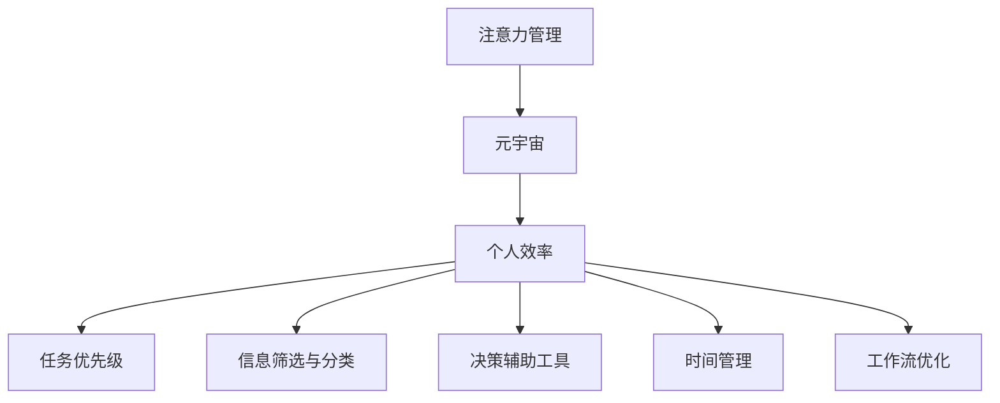

                 

# 注意力管理:元宇宙中的个人效率提升

> 关键词：注意力管理,元宇宙,个人效率,时间管理,工具推荐

## 1. 背景介绍

### 1.1 问题由来
随着技术的发展，人类逐渐进入元宇宙时代。元宇宙作为一个高度集成、多模态的虚拟世界，为我们的生活、工作、学习带来了诸多便利，但同时也带来了诸多挑战。其中，最直观的就是信息爆炸带来的注意力分散问题。如何高效管理注意力，提升个人在元宇宙环境中的效率，成为了一个亟待解决的重要课题。

### 1.2 问题核心关键点
在元宇宙中，注意力管理涉及对多重任务、多模态信息的高效处理与分配。核心在于：
1. **任务优先级排序**：如何在多任务之间进行排序，决定哪些任务需要优先处理。
2. **信息筛选与分类**：如何快速从海量信息中筛选出关键信息，并对其进行分类存储。
3. **决策辅助工具**：如何利用工具辅助进行决策，提升决策效率和准确性。
4. **时间管理**：如何高效规划和分配时间，确保重要任务得到足够时间处理。
5. **工作流优化**：如何通过自动化和优化工作流程，减少重复性劳动。

### 1.3 问题研究意义
通过有效的注意力管理，可以提升个人在元宇宙中的生产力和工作效率。具体来说，其研究意义包括：

1. **提升生产效率**：通过科学的时间管理和任务优先级排序，提高任务完成速度。
2. **增强决策质量**：通过信息筛选与分类，提高决策的科学性和准确性。
3. **减少疲劳感**：通过优化工作流和自动化工具，减轻重复性劳动的负担。
4. **增强工作满意度**：通过合理规划和高效执行，提升工作的整体满意度。
5. **推动元宇宙发展**：通过高效管理注意力，为元宇宙技术的发展提供有力支持。

## 2. 核心概念与联系

### 2.1 核心概念概述

为了更好地理解注意力管理在元宇宙中的应用，我们首先需要对相关的核心概念进行理解。以下是几个关键概念及其关联：

- **注意力管理(Attention Management)**：指通过科学的方法，对用户的注意力进行管理和分配，提升任务完成效率和决策质量。
- **元宇宙(Metaverse)**：一个高度集成、多模态的虚拟世界，包含虚拟工作、学习、社交、娱乐等多种应用场景。
- **个人效率(Individual Efficiency)**：指个人在元宇宙环境中的生产效率和工作能力，包括时间管理、任务处理、信息筛选等多个方面。
- **任务优先级(Scheduling Priorities)**：指根据任务的重要性和紧急程度，对任务进行排序，决定哪些任务需要优先处理。
- **信息筛选与分类(Information Filtering and Categorization)**：指从海量信息中筛选出关键信息，并对信息进行分类存储和管理。
- **决策辅助工具(Decision Support Tools)**：指利用智能算法、数据可视化等工具，辅助决策，提高决策效率和准确性。
- **时间管理(Time Management)**：指通过科学的计划和时间规划，合理分配时间，提升整体效率。
- **工作流优化(Workflow Optimization)**：指通过自动化和优化工作流程，减少重复性劳动，提升整体执行效率。

这些核心概念之间的联系可以通过以下Mermaid流程图来展示：



这个流程图展示了大语言模型在元宇宙中应用于注意力管理的各个环节：

1. 注意力管理通过科学的方法提升个人在元宇宙环境中的效率。
2. 元宇宙为注意力管理提供了丰富的应用场景，包括虚拟工作、学习、社交等。
3. 个人效率通过任务优先级、信息筛选与分类、决策辅助工具、时间管理和工作流优化等多个方面进行提升。

## 3. 核心算法原理 & 具体操作步骤
### 3.1 算法原理概述

在元宇宙中，注意力管理通常包括以下几个核心算法：

- **任务优先级排序算法(Priority Scheduling Algorithms)**：通过算法计算每个任务的重要性和紧急程度，进行优先级排序。
- **信息筛选算法(Information Filtering Algorithms)**：从海量信息中筛选出关键信息，并对其进行分类存储。
- **决策辅助算法(Decision Support Algorithms)**：利用智能算法和数据可视化工具，辅助决策，提高决策效率和准确性。
- **时间管理算法(Time Management Algorithms)**：通过算法对时间进行科学规划，确保重要任务得到足够时间处理。
- **工作流优化算法(Workflow Optimization Algorithms)**：通过自动化和优化工作流程，减少重复性劳动，提升整体执行效率。

### 3.2 算法步骤详解

#### 3.2.1 任务优先级排序

任务优先级排序算法通常包括以下步骤：

1. **任务重要性和紧急性计算**：使用算法计算每个任务的重要性和紧急性，例如使用Eisenhower矩阵或ABC分析法。
2. **优先级排序**：根据计算结果对任务进行排序，确定哪些任务需要优先处理。
3. **任务分配**：根据排序结果，分配时间资源，确保重要任务得到优先处理。

#### 3.2.2 信息筛选与分类

信息筛选与分类算法通常包括以下步骤：

1. **信息源收集**：收集各种信息源，如邮件、消息、文档、网页等。
2. **信息内容分析**：对信息内容进行分析，提取关键信息，例如使用文本挖掘技术。
3. **信息分类存储**：将信息进行分类存储，例如使用标签和分类系统。

#### 3.2.3 决策辅助

决策辅助算法通常包括以下步骤：

1. **数据准备**：准备决策所需的数据，包括历史数据、专家意见等。
2. **模型训练**：使用机器学习模型进行训练，例如使用决策树、神经网络等。
3. **决策生成**：根据模型预测，生成决策建议，例如使用智能推荐系统。

#### 3.2.4 时间管理

时间管理算法通常包括以下步骤：

1. **时间规划**：制定时间规划，确定每天、每周的工作重点。
2. **任务分配**：根据时间规划，分配时间资源，确保重要任务得到优先处理。
3. **时间监控**：实时监控时间使用情况，确保时间规划得到有效执行。

#### 3.2.5 工作流优化

工作流优化算法通常包括以下步骤：

1. **流程分析**：分析当前工作流程，识别瓶颈和重复性劳动。
2. **自动化工具应用**：使用自动化工具进行流程优化，例如使用工作流管理系统。
3. **流程改进**：持续改进工作流程，提升整体执行效率。

### 3.3 算法优缺点

注意力管理算法在元宇宙中的应用具有以下优点：

1. **提高效率**：通过科学的方法提升个人在元宇宙环境中的效率，节省大量时间。
2. **增强决策质量**：利用数据和算法辅助决策，提高决策的科学性和准确性。
3. **减轻疲劳感**：通过自动化和优化工作流程，减轻重复性劳动的负担，减少疲劳感。
4. **增强工作满意度**：通过合理规划和高效执行，提升工作的整体满意度。
5. **推动元宇宙发展**：通过高效管理注意力，为元宇宙技术的发展提供有力支持。

同时，这些算法也存在一定的局限性：

1. **复杂性高**：涉及多个算法和工具，实施难度较大。
2. **数据质量要求高**：需要高质量的数据和信息源，才能保证算法的准确性。
3. **个性化需求高**：不同用户的需求不同，需要针对性地进行算法和工具的调整。
4. **技术门槛高**：需要具备一定的技术背景，才能高效实施和维护。

尽管存在这些局限性，但就目前而言，注意力管理在元宇宙中的应用仍然是大势所趋，对于提升个人效率具有重要意义。

### 3.4 算法应用领域

注意力管理在元宇宙中的应用领域广泛，涵盖了多个方面：

- **虚拟办公**：通过任务优先级排序和时间管理，提升虚拟办公效率。
- **虚拟学习**：通过信息筛选与分类和决策辅助，提升学习效率。
- **虚拟社交**：通过自动化工具和工作流优化，提升社交互动效率。
- **虚拟娱乐**：通过时间管理和任务优先级排序，提升娱乐体验。

## 4. 数学模型和公式 & 详细讲解  
### 4.1 数学模型构建

本节将使用数学语言对注意力管理在元宇宙中的应用进行更加严格的刻画。

设任务集为 $T=\{t_1,t_2,\dots,t_n\}$，其中每个任务 $t_i$ 都有一个重要性和紧急性评分 $w_i$ 和 $u_i$。任务优先级排序的目标是找到最优的排序方式 $P=\{p_1,p_2,\dots,p_n\}$，使得任务 $t_{p_i}$ 的重要性 $w_{p_i}$ 和紧急性 $u_{p_i}$ 之和最大。

数学上，任务优先级排序问题可以表示为：

$$
\max \sum_{i=1}^n (w_{p_i} + u_{p_i}) \\
\text{s.t.} \ p_i \in T, \ 1 \le p_i \le n
$$

其中 $p_i$ 表示任务 $t_i$ 在排序中的位置。

信息筛选与分类问题可以表示为：

$$
\min \sum_{i=1}^n C_i \\
\text{s.t.} \ y_{s_i} = \mathbf{1}_{s_i \in R_i}, \ 1 \le s_i \le n, \ 1 \le R_i \le C
$$

其中 $C_i$ 表示任务 $t_i$ 的信息分类成本，$y_{s_i}$ 表示任务 $t_i$ 是否属于分类 $s_i$，$R_i$ 表示任务 $t_i$ 的分类结果，$C$ 表示分类总数。

决策辅助问题可以表示为：

$$
\min \sum_{i=1}^n L_i \\
\text{s.t.} \ z_i = f(x_i), \ L_i = \mathbf{1}_{y_i \ne z_i}
$$

其中 $L_i$ 表示任务 $t_i$ 的决策损失，$z_i$ 表示模型预测的决策结果，$f$ 表示决策函数。

时间管理问题可以表示为：

$$
\min \sum_{i=1}^n D_i \\
\text{s.t.} \ x_i \le T_i, \ 1 \le i \le n, \ x_i \ge 0
$$

其中 $D_i$ 表示任务 $t_i$ 的时间成本，$T_i$ 表示任务 $t_i$ 的时间限制。

工作流优化问题可以表示为：

$$
\min \sum_{i=1}^n F_i \\
\text{s.t.} \ f_i(x) \ge g_i(x), \ 1 \le i \le n, \ F_i \ge 0
$$

其中 $F_i$ 表示任务 $t_i$ 的工作流成本，$f_i$ 表示任务 $t_i$ 的流程函数，$g_i$ 表示流程约束函数。

### 4.2 公式推导过程

以下我们以任务优先级排序为例，推导Eisenhower矩阵的算法步骤：

Eisenhower矩阵是一种常用的任务优先级排序方法，将任务分为四类：

1. 重要且紧急的任务(Do)。
2. 重要但不紧急的任务(Schedule)。
3. 紧急但不重要的任务(Delegate)。
4. 不重要且不紧急的任务(Eliminate)。

其算法步骤如下：

1. **任务分类**：将所有任务分为四类，使用矩阵表示。
2. **任务排序**：根据矩阵中的分类，对任务进行排序，优先处理重要且紧急的任务。
3. **任务分配**：根据排序结果，分配时间资源，确保重要任务得到优先处理。

具体地，设任务集为 $T=\{t_1,t_2,\dots,t_n\}$，每个任务 $t_i$ 都有一个重要性评分 $w_i$ 和紧急性评分 $u_i$。Eisenhower矩阵将任务分为四类：

$$
\begin{array}{|c|c|c|c|c|}
\hline
& \text{Do} & \text{Schedule} & \text{Delegate} & \text{Eliminate} \\
\hline
\text{Important} & t_{Do_1} & t_{Schedule_1} & t_{Delegate_1} & t_{Eliminate_1} \\
\hline
\text{Unimportant} & t_{Do_2} & t_{Schedule_2} & t_{Delegate_2} & t_{Eliminate_2} \\
\hline
\end{array}
$$

其中 $Do_i$ 表示重要且紧急的任务，$Schedule_i$ 表示重要但不紧急的任务，$Delegate_i$ 表示紧急但不重要的任务，$Eliminate_i$ 表示不重要且不紧急的任务。

Eisenhower矩阵的排序目标是最小化所有任务的紧急性评分之和：

$$
\min \sum_{i=1}^n u_i
$$

根据矩阵的定义，Eisenhower矩阵的排序算法步骤如下：

1. **任务分类**：将所有任务分为四类，使用矩阵表示。
2. **任务排序**：根据矩阵中的分类，对任务进行排序，优先处理重要且紧急的任务。
3. **任务分配**：根据排序结果，分配时间资源，确保重要任务得到优先处理。

通过以上步骤，可以科学地管理注意力，提升个人在元宇宙环境中的效率。

## 5. 项目实践：代码实例和详细解释说明
### 5.1 开发环境搭建

在进行注意力管理项目开发前，我们需要准备好开发环境。以下是使用Python进行PyTorch开发的环境配置流程：

1. 安装Anaconda：从官网下载并安装Anaconda，用于创建独立的Python环境。

2. 创建并激活虚拟环境：
```bash
conda create -n pytorch-env python=3.8 
conda activate pytorch-env
```

3. 安装PyTorch：根据CUDA版本，从官网获取对应的安装命令。例如：
```bash
conda install pytorch torchvision torchaudio cudatoolkit=11.1 -c pytorch -c conda-forge
```

4. 安装TensorFlow：
```bash
pip install tensorflow
```

5. 安装各类工具包：
```bash
pip install numpy pandas scikit-learn matplotlib tqdm jupyter notebook ipython
```

完成上述步骤后，即可在`pytorch-env`环境中开始注意力管理项目的开发。

### 5.2 源代码详细实现

下面以任务优先级排序为例，给出使用Python进行注意力管理开发的PyTorch代码实现。

首先，定义任务数据类：

```python
import torch

class Task:
    def __init__(self, name, importance, urgency):
        self.name = name
        self.importance = importance
        self.urgency = urgency
```

然后，定义任务优先级排序函数：

```python
def eisenhower_sort(tasks):
    Do = []
    Schedule = []
    Delegate = []
    Eliminate = []
    
    for task in tasks:
        if task.importance > 0 and task.urgency > 0:
            Do.append(task)
        elif task.importance > 0 and task.urgency == 0:
            Schedule.append(task)
        elif task.importance == 0 and task.urgency > 0:
            Delegate.append(task)
        else:
            Eliminate.append(task)
    
    return Do, Schedule, Delegate, Eliminate
```

接着，定义任务执行类：

```python
class TaskManager:
    def __init__(self):
        self.tasks = []
    
    def add_task(self, task):
        self.tasks.append(task)
    
    def sort_tasks(self):
        Do, Schedule, Delegate, Eliminate = eisenhower_sort(self.tasks)
        self.tasks = Do + Schedule + Delegate + Eliminate
```

最后，启动任务管理流程：

```python
if __name__ == '__main__':
    task_manager = TaskManager()
    
    # 添加任务
    task_manager.add_task(Task('Do任务1', 1, 1))
    task_manager.add_task(Task('Schedule任务2', 1, 0))
    task_manager.add_task(Task('Delegate任务3', 0, 1))
    task_manager.add_task(Task('Eliminate任务4', 0, 0))
    
    # 排序并执行任务
    task_manager.sort_tasks()
    for task in task_manager.tasks:
        print(task.name)
```

以上就是使用PyTorch进行任务优先级排序的完整代码实现。可以看到，通过定义数据类和函数，可以很方便地实现任务优先级排序的逻辑。

### 5.3 代码解读与分析

让我们再详细解读一下关键代码的实现细节：

**Task类**：
- `__init__`方法：初始化任务的名称、重要性和紧急性。

**eisenhower_sort函数**：
- 根据任务的重要性和紧急性，将任务分为四类，并返回排序后的任务列表。

**TaskManager类**：
- `__init__`方法：初始化任务列表。
- `add_task`方法：添加新任务。
- `sort_tasks`方法：调用eisenhower_sort函数进行任务排序。

**启动任务管理流程**：
- 创建一个TaskManager实例，添加四个示例任务。
- 调用sort_tasks方法进行任务排序，并按排序后的顺序输出任务名称。

可以看到，PyTorch配合Python的面向对象特性，使得注意力管理项目的代码实现变得简洁高效。开发者可以将更多精力放在算法设计和业务逻辑上，而不必过多关注底层的实现细节。

当然，工业级的系统实现还需考虑更多因素，如用户界面设计、算法调优、多用户并发处理等。但核心的算法实现基本与此类似。

## 6. 实际应用场景
### 6.1 智能办公系统

基于注意力管理技术，可以构建智能办公系统，帮助员工高效处理多重任务。智能办公系统通常包括以下功能：

- **任务优先级排序**：通过Eisenhower矩阵等方法，帮助员工快速识别重要且紧急的任务。
- **信息筛选与分类**：通过标签和分类系统，帮助员工快速定位关键信息。
- **决策辅助**：通过数据可视化工具，辅助员工进行决策。
- **时间管理**：通过时间规划和时间监控，帮助员工合理分配时间资源。
- **工作流优化**：通过自动化工具和工作流管理系统，帮助员工提升执行效率。

例如，智能办公系统可以集成邮件、日程、任务管理等多个模块，通过注意力管理技术提升员工的工作效率和满意度。

### 6.2 在线学习平台

在线学习平台可以借助注意力管理技术，帮助学生高效学习。在线学习平台通常包括以下功能：

- **信息筛选与分类**：通过标签和分类系统，帮助学生快速定位关键学习资源。
- **决策辅助**：通过推荐系统，辅助学生进行课程选择和学习路径规划。
- **时间管理**：通过时间规划和时间监控，帮助学生合理分配学习时间。
- **工作流优化**：通过自动化工具和学习管理系统，帮助学生提升学习效率。

例如，在线学习平台可以集成视频课程、在线题库、学习计划等多个模块，通过注意力管理技术提升学生的学习效果和体验。

### 6.3 社交平台

社交平台可以借助注意力管理技术，帮助用户高效管理社交关系和信息。社交平台通常包括以下功能：

- **信息筛选与分类**：通过标签和分类系统，帮助用户快速定位关键社交信息。
- **决策辅助**：通过推荐系统，辅助用户进行社交互动和关系管理。
- **时间管理**：通过时间规划和时间监控，帮助用户合理分配社交时间。
- **工作流优化**：通过自动化工具和工作流管理系统，帮助用户提升社交效率。

例如，社交平台可以集成消息、好友、群组等多个模块，通过注意力管理技术提升用户的社交体验和满意度。

### 6.4 未来应用展望

随着注意力管理技术的发展，未来在元宇宙中的应用将更加广泛和深入。以下是对未来应用的展望：

1. **多模态融合**：未来的注意力管理将不仅仅是针对文本信息的处理，而是涉及图像、语音、视频等多模态信息的整合和处理。
2. **个性化推荐**：基于用户的兴趣和行为数据，进行个性化推荐，提升用户满意度。
3. **智能协作**：利用注意力管理技术，提升团队协作效率，实现任务分配和进度跟踪的自动化。
4. **自动化决策**：通过机器学习算法，提升决策辅助系统的智能化水平，减少人工干预。
5. **跨平台同步**：将注意力管理技术应用于多个平台和设备，实现跨平台同步和一致性。

## 7. 工具和资源推荐
### 7.1 学习资源推荐

为了帮助开发者系统掌握注意力管理技术，这里推荐一些优质的学习资源：

1. 《Attention is All You Need》系列博文：由大模型技术专家撰写，深入浅出地介绍了注意力机制原理和应用场景。

2. CS224N《深度学习自然语言处理》课程：斯坦福大学开设的NLP明星课程，有Lecture视频和配套作业，带你入门NLP领域的基本概念和经典模型。

3. 《Natural Language Processing with Transformers》书籍：Transformers库的作者所著，全面介绍了如何使用Transformers库进行NLP任务开发，包括注意力管理在内的多个主题。

4. PyTorch官方文档：PyTorch官方文档，提供了丰富的API和教程，是快速上手PyTorch的必备资料。

5. PyTorch Lightning：一个基于PyTorch的模型训练框架，提供了丰富的高级API和模板，可以快速构建复杂的模型和训练流程。

通过对这些资源的学习实践，相信你一定能够快速掌握注意力管理技术的精髓，并用于解决实际的元宇宙应用问题。

### 7.2 开发工具推荐

高效的开发离不开优秀的工具支持。以下是几款用于注意力管理开发的常用工具：

1. PyTorch：基于Python的开源深度学习框架，灵活动态的计算图，适合快速迭代研究。

2. TensorFlow：由Google主导开发的开源深度学习框架，生产部署方便，适合大规模工程应用。

3. Transformers库：HuggingFace开发的NLP工具库，集成了众多SOTA语言模型，支持PyTorch和TensorFlow，是进行注意力管理任务开发的利器。

4. Weights & Biases：模型训练的实验跟踪工具，可以记录和可视化模型训练过程中的各项指标，方便对比和调优。

5. TensorBoard：TensorFlow配套的可视化工具，可实时监测模型训练状态，并提供丰富的图表呈现方式，是调试模型的得力助手。

6. Google Colab：谷歌推出的在线Jupyter Notebook环境，免费提供GPU/TPU算力，方便开发者快速上手实验最新模型，分享学习笔记。

合理利用这些工具，可以显著提升注意力管理任务的开发效率，加快创新迭代的步伐。

### 7.3 相关论文推荐

注意力管理技术的发展源于学界的持续研究。以下是几篇奠基性的相关论文，推荐阅读：

1. Attention is All You Need：提出Transformer结构，开启了NLP领域的预训练大模型时代。

2. Transformer-XL: Attentive Language Models beyond a Fixed-Length Context：提出Transformer-XL模型，解决长序列任务中的注意力问题。

3. The Transformer-XL Architecture：介绍Transformer-XL模型的详细架构和优化策略，进一步提升模型性能。

4. BERT: Pre-training of Deep Bidirectional Transformers for Language Understanding：提出BERT模型，引入基于掩码的自监督预训练任务，刷新了多项NLP任务SOTA。

5. Attention-Based Memory-Augmented Neural Network：提出注意力机制，用于增强神经网络模型的记忆能力和泛化能力。

这些论文代表了大模型注意力管理技术的发展脉络。通过学习这些前沿成果，可以帮助研究者把握学科前进方向，激发更多的创新灵感。

## 8. 总结：未来发展趋势与挑战

### 8.1 研究成果总结

本文对注意力管理技术在元宇宙中的应用进行了全面系统的介绍。首先阐述了元宇宙时代面临的注意力管理问题，明确了注意力管理在提升个人效率和决策质量方面的重要意义。其次，从原理到实践，详细讲解了注意力管理技术在元宇宙中的核心算法和具体操作步骤，给出了注意力管理任务开发的完整代码实例。同时，本文还探讨了注意力管理技术在智能办公、在线学习、社交平台等多个领域的应用前景，展示了其广阔的发展空间。

### 8.2 未来发展趋势

展望未来，注意力管理技术将在元宇宙中迎来更加广泛的应用。以下是对未来发展的趋势：

1. **多模态融合**：未来的注意力管理将不仅仅是针对文本信息的处理，而是涉及图像、语音、视频等多模态信息的整合和处理。
2. **个性化推荐**：基于用户的兴趣和行为数据，进行个性化推荐，提升用户满意度。
3. **智能协作**：利用注意力管理技术，提升团队协作效率，实现任务分配和进度跟踪的自动化。
4. **自动化决策**：通过机器学习算法，提升决策辅助系统的智能化水平，减少人工干预。
5. **跨平台同步**：将注意力管理技术应用于多个平台和设备，实现跨平台同步和一致性。

### 8.3 面临的挑战

尽管注意力管理技术在元宇宙中的应用前景广阔，但在迈向更加智能化、普适化应用的过程中，它仍面临诸多挑战：

1. **技术复杂性高**：涉及多个算法和工具，实施难度较大。
2. **数据质量要求高**：需要高质量的数据和信息源，才能保证算法的准确性。
3. **个性化需求高**：不同用户的需求不同，需要针对性地进行算法和工具的调整。
4. **技术门槛高**：需要具备一定的技术背景，才能高效实施和维护。
5. **跨模态融合难度大**：多模态信息的整合和处理，需要解决跨模态表示、跨模态匹配等问题。

尽管存在这些挑战，但就目前而言，注意力管理在元宇宙中的应用仍然是大势所趋，对于提升个人效率具有重要意义。

### 8.4 研究展望

面对注意力管理面临的种种挑战，未来的研究需要在以下几个方面寻求新的突破：

1. **跨模态融合方法**：研究如何更好地整合多模态信息，解决跨模态表示和匹配问题。
2. **高效计算方法**：研究如何优化计算图，提高模型推理效率，减少内存和计算资源消耗。
3. **多用户协同**：研究如何通过多用户协同优化注意力管理，提升整体系统性能。
4. **自动化调参**：研究如何自动化调参，提升算法和工具的普适性，减少人工干预。
5. **伦理道德问题**：研究如何确保注意力管理系统的公平性和伦理道德，避免偏见和歧视。

这些研究方向的探索，必将引领注意力管理技术迈向更高的台阶，为元宇宙技术的发展提供有力支持。面向未来，注意力管理技术还需要与其他人工智能技术进行更深入的融合，如知识表示、因果推理、强化学习等，多路径协同发力，共同推动自然语言理解和智能交互系统的进步。只有勇于创新、敢于突破，才能不断拓展元宇宙系统的边界，让智能技术更好地造福人类社会。

## 9. 附录：常见问题与解答

**Q1：注意力管理技术是否适用于所有元宇宙应用场景？**

A: 注意力管理技术在大部分元宇宙应用场景中都能取得不错的效果，特别是对于任务繁多、信息量大、需要高效决策的场景。但对于一些特定领域的应用，如医疗、法律等，仅仅依靠通用算法可能难以很好地适应。此时需要在特定领域数据上进一步训练和优化算法，才能获得理想效果。

**Q2：注意力管理技术如何与多模态信息融合？**

A: 多模态信息的整合需要考虑不同模态之间的相似性和差异性，以及如何建立跨模态的关联关系。可以使用跨模态表示学习、跨模态嵌入等技术，将不同模态的信息映射到相同的语义空间中，实现跨模态匹配和融合。

**Q3：注意力管理技术在落地部署时需要注意哪些问题？**

A: 将注意力管理技术转化为实际应用，还需要考虑以下因素：

1. **用户界面设计**：设计简洁、易用的用户界面，提升用户体验。
2. **算法调优**：根据具体场景和数据特点，优化算法参数和模型结构。
3. **系统集成**：将注意力管理技术集成到现有系统中，实现数据和功能的无缝衔接。
4. **性能优化**：优化系统性能，提升响应速度和稳定性。
5. **数据安全**：确保数据的安全性和隐私保护，避免数据泄露和滥用。

只有从技术、用户、性能、安全等多个维度协同发力，才能真正实现注意力管理技术在元宇宙中的落地应用。

---

作者：禅与计算机程序设计艺术 / Zen and the Art of Computer Programming

