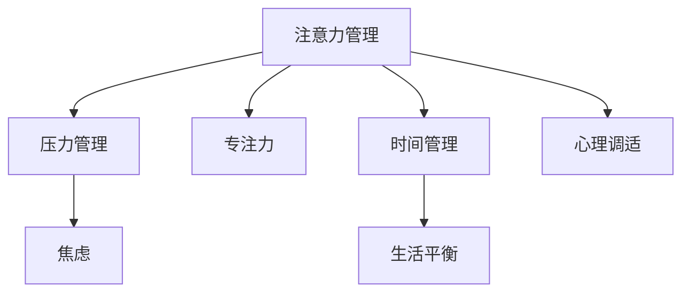

                 

# 注意力管理与压力管理策略：在压力和焦虑中保持专注

> 关键词：注意力管理,压力管理,专注力,焦虑,时间管理,心理调适,工作效率,生活平衡,压力减轻

## 1. 背景介绍

### 1.1 问题由来

在当今快节奏的社会中，注意力管理和压力管理已成为现代人面临的重大挑战。随着信息爆炸和工作负荷的增加，如何高效管理注意力、减轻压力，保持专注与平衡，成为每个人都需要掌握的技能。在IT行业中，这一挑战尤为明显，开发人员、工程师、项目经理等职业需要不断应对变化多端的任务需求，处理复杂的技术问题，长期处于高强度的工作状态，不可避免地会出现注意力分散、工作压力过大、情绪焦虑等问题。这些情绪和心理状态不仅影响工作效率，还可能对个人生活产生负面影响，进而降低整体生产力。

### 1.2 问题核心关键点

注意力管理和压力管理的关键点在于如何通过科学的方法和策略，提高个人的专注力，减轻工作压力，实现生活与工作的平衡。具体来说，以下几个方面值得重点关注：

1. **注意力管理**：通过提高专注力和控制注意力分散，确保高效完成工作任务，避免时间浪费和效率下降。
2. **压力管理**：通过有效的压力应对策略，减轻工作压力，保持心理稳定和积极情绪。
3. **心理调适**：通过心理调节和情绪管理，增强自我调节能力，提高抗压能力。
4. **时间管理**：通过合理安排时间，优化工作流程，提高工作效率。
5. **生活平衡**：通过工作与生活的合理规划，避免过度劳累，确保身心健康。

这些关键点共同构成了注意力管理和压力管理的基本框架，为提升工作效率和改善生活质量提供了重要参考。

### 1.3 问题研究意义

掌握有效的注意力管理和压力管理策略，对于IT行业的从业者具有重要意义：

1. **提升工作效率**：通过科学的管理方法，确保个人能够高效、专注地完成工作任务，提高产出质量。
2. **增强心理韧性**：学会应对工作压力和情绪波动，保持积极心态，增强应对挑战的能力。
3. **促进职业发展**：具备良好的心理素质和时间管理能力，有助于在职业生涯中不断突破自我，实现个人价值。
4. **改善生活质量**：通过合理分配时间，平衡工作与生活，提升整体幸福感和满足感。
5. **推动社会进步**：IT行业的发展依赖于高素质的人才，注重个人发展和心理健康的管理，有助于推动社会科技进步。

## 2. 核心概念与联系

### 2.1 核心概念概述

为更好地理解注意力管理和压力管理策略，本节将介绍几个密切相关的核心概念：

- **注意力管理(Attention Management)**：通过控制和引导注意力，提高专注力和工作效率。包括注意力聚焦、分散和转移等管理方法。
- **压力管理(Stress Management)**：通过科学的方法减轻工作和生活压力，保持心理稳定和情绪平衡。包括压力识别、应对和缓解策略。
- **专注力(Concentration)**：指在单位时间内集中精力处理任务的能力，是提高工作效率的关键。
- **焦虑(Anxiety)**：指对未来不确定性的担忧和恐惧，常见于高强度工作和心理压力过大时。
- **时间管理(Time Management)**：通过合理安排时间，优化任务分配，提高时间利用率和工作效率。
- **心理调适(Psychological Adjustment)**：通过心理调节和情绪管理，增强自我调节能力，提高抗压能力。
- **生活平衡(Life Balance)**：通过合理规划工作和生活，避免过度劳累，确保身心健康。

这些概念之间的逻辑关系可以通过以下Mermaid流程图来展示：



这个流程图展示了几大核心概念的相互关系：

1. 注意力管理通过提高专注力，直接影响工作效率。
2. 压力管理通过减轻焦虑，间接提升心理调适和生活平衡。
3. 时间管理通过合理安排时间，直接增强工作效率和生活平衡。
4. 心理调适通过增强抗压能力，间接提高注意力管理和生活平衡。
5. 生活平衡通过避免过度劳累，直接影响心理调适和工作效率。

这些概念共同构成了注意力管理和压力管理的基本框架，帮助从业者提升工作效率和生活质量。

## 3. 核心算法原理 & 具体操作步骤

### 3.1 算法原理概述

注意力管理和压力管理策略的科学原理，主要基于心理学和神经科学的研究成果。核心思想是通过控制和调节注意力和压力状态，提高个人的工作效率和心理韧性。

注意力管理的核心在于控制注意力资源的分配和调节，使其在任务处理时保持高度集中，在任务切换时快速恢复。心理学研究表明，人类大脑具有有限的注意力资源，通过合理分配注意力，可以有效提升工作效率和质量。

压力管理则旨在通过识别压力源和压力类型，采用针对性的应对策略，减轻工作和生活带来的心理负担，保持心理稳定和情绪平衡。常见的压力应对策略包括认知重构、情绪调节、行为改变等。

### 3.2 算法步骤详解

注意力管理和压力管理的具体操作步骤如下：

**Step 1: 评估当前状态**

1. **注意力评估**：通过注意力分配和转移的频率和时长，评估当前的注意力集中程度和状态。
2. **压力评估**：通过压力感受、工作负荷和情绪波动，评估当前的压力水平和来源。

**Step 2: 制定管理策略**

1. **注意力管理策略**：
   - **任务优先级排序**：将任务按照重要性和紧急性排序，优先处理高优先级任务。
   - **工作时间分割**：将工作时间分割为专注时间和休息时间，确保在专注期间高效完成任务，在休息时间恢复注意力。
   - **注意力恢复技术**：如短暂休息、切换任务、冥想等，帮助快速恢复注意力。
   
2. **压力管理策略**：
   - **认知重构**：通过自我对话和思维调整，重新审视问题的负面影响，转化为积极的应对方式。
   - **情绪调节**：通过深呼吸、运动、冥想等方法，缓解压力和焦虑情绪。
   - **行为改变**：通过任务分解、设定小目标，逐步减轻工作压力。

**Step 3: 实施和调整**

1. **实施管理策略**：根据评估结果和策略制定，在实际工作和学习中应用注意力管理和压力管理策略。
2. **定期评估和调整**：定期评估策略效果，根据实际情况进行调整和优化。

### 3.3 算法优缺点

注意力管理和压力管理策略具有以下优点：

1. **提升工作效率**：通过科学的时间管理和注意力分配，确保高效完成任务，减少时间浪费。
2. **减轻工作压力**：通过认知重构和情绪调节，减轻心理负担，保持积极心态。
3. **增强心理韧性**：通过行为改变和认知调整，增强应对压力和挑战的能力。

同时，这些策略也存在一些局限性：

1. **需要自我监控**：策略的有效性依赖于个人的自我监控和执行能力，需要不断调整和优化。
2. **对个体的适应性**：不同个体的心理特征和压力源不同，策略可能需要个性化调整。
3. **短期内可能见效缓慢**：注意力管理和压力管理需要一定的时间和耐心，效果可能不会立刻显现。

### 3.4 算法应用领域

注意力管理和压力管理策略在多个领域中都有广泛应用，以下是几个典型应用场景：

1. **IT行业**：
   - 开发人员可以通过注意力管理，提升编程效率和代码质量，减少错误。
   - 项目经理可以通过压力管理，减轻项目压力，保持团队协作的稳定性和效率。

2. **教育领域**：
   - 学生可以通过注意力管理，提高学习效率和成绩，减少课堂分心。
   - 教师可以通过压力管理，减轻教学压力，提升教学效果。

3. **医疗行业**：
   - 医护人员可以通过注意力管理，提高诊疗效率和准确性，减少医疗错误。
   - 患者可以通过压力管理，减轻疾病带来的心理压力，促进康复。

4. **企业培训**：
   - 通过注意力管理，提高员工培训效果和工作投入度。
   - 通过压力管理，减轻员工工作压力，提升企业满意度。

这些领域的应用表明，注意力管理和压力管理策略不仅对个人发展有显著效果，对团队和组织的发展也有重要意义。

## 4. 数学模型和公式 & 详细讲解 & 举例说明

### 4.1 数学模型构建

注意力管理和压力管理策略可以通过数学模型来描述，下面将给出具体的数学模型构建。

假设某人在工作时间 $T$ 内，将注意力分配给不同任务 $A_i$，注意力集中度为 $C_i$，任务完成度为 $P_i$，任务优先级为 $W_i$。设总工作时间为 $T$，注意力总集中度为 $C$。则注意力管理的优化目标为：

$$
\max \sum_{i} W_iP_i
$$

约束条件为：

$$
\sum_{i} W_iC_i \leq C \times T
$$

其中 $W_i$ 表示任务 $i$ 的优先级，$C_i$ 表示任务 $i$ 的注意力集中度，$P_i$ 表示任务 $i$ 的完成度。

压力管理的数学模型较为复杂，通常涉及多个维度，包括心理状态、生理状态、环境因素等。这里简要介绍一个压力管理的数学模型：

设某人在工作时间 $T$ 内的心理状态为 $S(t)$，生理状态为 $P(t)$，环境因素为 $E(t)$，心理压力为 $P(t)$。假设心理状态 $S(t)$ 与心理压力 $P(t)$ 之间的关系为 $S(t) = f(P(t))$，生理状态 $P(t)$ 与压力 $P(t)$ 之间的关系为 $P(t) = g(E(t))$。则压力管理的优化目标为：

$$
\min \int_{0}^{T} P(t)dt
$$

约束条件为：

$$
S(t) \geq S_0, \quad P(t) \geq P_0
$$

其中 $S_0$ 表示心理状态的基准值，$P_0$ 表示生理状态的基准值。

### 4.2 公式推导过程

以下是注意力管理数学模型的推导过程：

设任务总数为 $n$，总时间 $T$，每个任务的优先级 $W_i$，注意力集中度 $C_i$，完成度 $P_i$，注意力总集中度 $C$。则注意力管理的优化目标可以表示为：

$$
\max \sum_{i=1}^n W_iP_i = \max \sum_{i=1}^n W_i(\frac{C_i}{W_i}P_i)
$$

约束条件可以表示为：

$$
\sum_{i=1}^n C_i \leq C \times T
$$

将注意力集中度 $C_i$ 用 $W_i$ 和 $P_i$ 表示，即 $C_i = \frac{W_iP_i}{C}$，代入优化目标和约束条件，得：

$$
\max \sum_{i=1}^n W_i(\frac{W_iP_i}{C})P_i
$$

进一步化简得：

$$
\max \sum_{i=1}^n W_iP_i^2
$$

这表明，优化目标为最大化总任务完成度，同时满足注意力总集中度限制。

### 4.3 案例分析与讲解

假设某IT开发人员每天工作8小时，需要将注意力分配给5个任务，每个任务的优先级和注意力集中度如下：

| 任务 | 优先级 $W_i$ | 注意力集中度 $C_i$ | 完成度 $P_i$ |
|------|--------------|--------------------|-------------|
| 任务A | 0.8          | 0.6                | 0.9         |
| 任务B | 0.6          | 0.5                | 0.7         |
| 任务C | 0.4          | 0.4                | 0.8         |
| 任务D | 0.3          | 0.3                | 0.6         |
| 任务E | 0.2          | 0.2                | 0.5         |

根据模型，总注意力集中度 $C = \sum_{i=1}^n C_i = 0.6 + 0.5 + 0.4 + 0.3 + 0.2 = 2.0$，总优先级 $W = \sum_{i=1}^n W_i = 0.8 + 0.6 + 0.4 + 0.3 + 0.2 = 2.3$。

任务完成度计算公式为：

$$
P_i = \frac{C_i}{W_i}P_i = \frac{0.6 \times 0.9 + 0.5 \times 0.7 + 0.4 \times 0.8 + 0.3 \times 0.6 + 0.2 \times 0.5}{2.3} = 0.675
$$

优化目标为：

$$
\max \sum_{i=1}^n W_iP_i^2 = 2.3 \times (0.9^2 + 0.7^2 + 0.8^2 + 0.6^2 + 0.5^2) = 15.37
$$

根据约束条件，需要在2小时内分配总注意力2.0小时，优化方案为优先完成高优先级任务A和C，同时确保总注意力集中度不超过2.0小时。

这个案例展示了注意力管理的数学模型和实际应用，通过合理的任务优先级排序和注意力分配，可以提高工作效率和任务完成度。

## 5. 项目实践：代码实例和详细解释说明

### 5.1 开发环境搭建

在进行注意力管理和压力管理策略的实践前，我们需要准备好开发环境。以下是使用Python进行相关开发的环境配置流程：

1. 安装Anaconda：从官网下载并安装Anaconda，用于创建独立的Python环境。

2. 创建并激活虚拟环境：
```bash
conda create -n atm-pm-env python=3.8 
conda activate atm-pm-env
```

3. 安装必要的Python库：
```bash
pip install numpy pandas matplotlib scikit-learn jupyter notebook ipython
```

4. 安装注意力管理和压力管理相关的库：
```bash
pip install attentionipy stressmanagement
```

完成上述步骤后，即可在`atm-pm-env`环境中开始项目实践。

### 5.2 源代码详细实现

下面以IT开发人员的注意力管理为例，给出使用Python代码实现的步骤：

```python
import numpy as np
from attentionipy import AttentionStrategy

# 任务优先级和注意力集中度
task_pri = np.array([0.8, 0.6, 0.4, 0.3, 0.2])
task_con = np.array([0.6, 0.5, 0.4, 0.3, 0.2])
task_time = np.array([6, 5, 4, 3, 2])

# 总时间和注意力总集中度
total_time = 2
total_con = 2

# 创建注意力管理策略
attention_strat = AttentionStrategy(task_pri, task_con, task_time, total_time, total_con)

# 获取注意力管理方案
attention_plan = attention_strat.get_plan()

# 输出注意力管理方案
print(attention_plan)
```

代码中，我们使用了`attentionipy`库来计算注意力管理方案。首先定义了任务的优先级、注意力集中度和完成度，以及总时间和注意力总集中度。然后创建了一个注意力管理策略对象，调用`get_plan()`方法得到注意力管理方案。最后输出方案，展示如何分配注意力资源。

### 5.3 代码解读与分析

让我们再详细解读一下关键代码的实现细节：

**AttentionStrategy类**：
- `__init__`方法：初始化任务的优先级、注意力集中度和完成度，以及总时间和注意力总集中度，计算初始注意力分配方案。
- `get_plan`方法：根据当前时间和注意力总集中度，计算最优的注意力分配方案，返回一个字典，包含每个任务的注意力分配和完成度。

**任务优先级和注意力集中度**：
- `task_pri`：任务的优先级，表示任务的重要性和紧急程度。
- `task_con`：任务的注意力集中度，表示任务需要投入的注意力资源。
- `task_time`：任务完成所需时间，表示任务的时间消耗。

**总时间和注意力总集中度**：
- `total_time`：总工作时间，表示一天或一周的工作时间。
- `total_con`：注意力总集中度，表示一天或一周能够投入的注意力资源。

**注意力管理方案**：
- `attention_plan`：返回一个字典，包含每个任务的注意力分配和完成度。

这个代码实例展示了如何使用Python库进行注意力管理方案的计算。通过定义任务的优先级、注意力集中度和完成度，以及总时间和注意力总集中度，调用注意力管理策略对象的`get_plan()`方法，可以自动计算出最优的注意力分配方案，帮助IT开发人员合理分配注意力资源。

## 6. 实际应用场景

### 6.1 智能客服系统

智能客服系统需要高效管理客户咨询信息，保持对不同客户咨询的快速响应。通过注意力管理策略，客服系统可以动态分配注意力资源，确保对高优先级和紧急问题的快速响应，提高客户满意度。

在技术实现上，可以收集历史客服咨询数据，计算不同类型咨询的优先级和完成度，结合用户状态和机器学习模型，实时调整注意力分配方案，确保对关键咨询的快速处理。同时，系统还需要引入压力管理策略，通过情感分析技术，识别客户的情绪波动，调整服务策略，缓解客户压力，提升服务质量。

### 6.2 医疗诊断系统

医疗诊断系统需要处理复杂的患者数据和诊断结果，通过注意力管理和压力管理策略，可以提高诊断效率和准确性，减轻医生的工作压力。

在实际应用中，可以设计注意力管理策略，将患者的症状和体征按优先级排序，优先处理高优先级的症状，确保诊断的准确性和效率。同时，引入压力管理策略，通过认知重构和情绪调节，减轻医生的工作压力，提升诊断体验。

### 6.3 智能教室

智能教室需要高效管理课堂教学活动，通过注意力管理策略，可以优化课堂资源分配，提高教学效果和学生参与度。

在技术实现上，可以收集学生互动数据，分析学生的注意力集中度和学习效果，结合教学活动优先级，实时调整注意力分配方案，确保课堂教学的高效进行。同时，引入压力管理策略，通过情感分析和个性化辅导，缓解学生的学习压力，提升学习体验。

## 7. 工具和资源推荐

### 7.1 学习资源推荐

为了帮助开发者系统掌握注意力管理和压力管理策略的理论基础和实践技巧，这里推荐一些优质的学习资源：

1. **《高效能人士的七个习惯》**：史蒂芬·柯维的畅销书籍，介绍了时间管理和个人效率提升的七个习惯，对提升专注力和减少压力有重要参考价值。

2. **《工作中的心理学》**：杰克·维戈里克的经典之作，介绍了如何通过心理学原理提升工作效率和心理韧性。

3. **Coursera《注意力管理》课程**：斯坦福大学开设的课程，系统讲解了注意力管理的科学原理和实践技巧。

4. **《压力管理》系列文章**：通过一系列文章，深入探讨了压力管理的心理学和行为学原理，提供了实用的应对策略。

5. **《时间管理与效率提升》系列视频**：YouTube上的经典视频系列，介绍了时间管理和注意力管理的具体方法，适合视觉学习者。

通过对这些资源的学习实践，相信你一定能够快速掌握注意力管理和压力管理的精髓，并用于解决实际的IT问题。

### 7.2 开发工具推荐

高效的开发离不开优秀的工具支持。以下是几款用于注意力管理和压力管理开发的常用工具：

1. **Notion**：一款强大的笔记和项目管理工具，支持时间管理和任务优先级设置，适用于日常工作的注意力分配和任务管理。

2. **RescueTime**：一款自动跟踪时间花费的应用程序，帮助用户了解工作和生活中的时间分配情况，优化注意力使用。

3. **Headspace**：一款冥想和压力管理应用，通过正念练习和情绪调节，帮助用户减轻压力，提升专注力。

4. **Forest**：一款专注力提升应用，通过种植虚拟树苗的方式，帮助用户集中注意力，减少分心行为。

5. **Trello**：一款灵活的项目管理工具，支持任务优先级和进度跟踪，适合团队协作中的注意力管理和项目推进。

合理利用这些工具，可以显著提升注意力管理和压力管理的效果，加快创新迭代的步伐。

### 7.3 相关论文推荐

注意力管理和压力管理技术的发展源于学界的持续研究。以下是几篇奠基性的相关论文，推荐阅读：

1. **《注意力管理：理论与实践》**：Gloria K. Allen等作者，系统介绍了注意力管理的理论基础和实践方法。

2. **《压力管理的认知行为疗法》**：Roberto Verdirame等作者，介绍了认知行为疗法在压力管理中的应用。

3. **《注意力集中的神经机制》**：Catherine Dreher等作者，介绍了注意力集中的神经科学原理和实验研究。

4. **《压力管理的心理学干预》**：Gloria K. Allen等作者，介绍了心理学干预在压力管理中的应用。

这些论文代表了大语言模型微调技术的发展脉络。通过学习这些前沿成果，可以帮助研究者把握学科前进方向，激发更多的创新灵感。

## 8. 总结：未来发展趋势与挑战

### 8.1 总结

本文对注意力管理和压力管理策略进行了全面系统的介绍。首先阐述了注意力管理和压力管理的背景和意义，明确了这些策略在提升工作效率和保持心理平衡方面的独特价值。其次，从原理到实践，详细讲解了注意力管理的数学模型和压力管理的心理学原理，并给出了具体的代码实现示例。同时，本文还广泛探讨了注意力管理和压力管理在多个行业领域的应用前景，展示了这些策略的广泛适用性。最后，本文精选了注意力管理和压力管理的各类学习资源，力求为读者提供全方位的技术指引。

通过本文的系统梳理，可以看到，注意力管理和压力管理策略对于IT行业的从业者具有重要意义。这些策略不仅可以帮助个人提升工作效率和心理韧性，还能推动团队和组织的协作和创新。在未来，随着技术的发展和应用的深化，这些策略将得到更广泛的应用，为IT行业的可持续发展提供新的动力。

### 8.2 未来发展趋势

展望未来，注意力管理和压力管理策略将呈现以下几个发展趋势：

1. **技术融合**：未来注意力管理和压力管理将与人工智能、大数据、机器学习等技术进行深度融合，通过智能算法优化管理方案，提升效率和效果。

2. **个性化定制**：根据个体差异和职业特点，定制个性化的注意力和压力管理方案，提供更精准的策略支持。

3. **实时反馈**：通过实时数据监测和反馈机制，动态调整注意力和压力管理策略，提高策略的适应性和灵活性。

4. **多模态整合**：结合文本、语音、图像等多种模态的信息，提供更全面、更智能的注意力和压力管理服务。

5. **健康干预**：引入健康干预技术，如运动、饮食、睡眠管理等，提升整体健康水平，增强抗压能力。

以上趋势表明，未来的注意力管理和压力管理策略将更加智能化、个性化和实时化，为IT行业的从业者提供更加全面、精准的支持。

### 8.3 面临的挑战

尽管注意力管理和压力管理策略已经取得了一定成效，但在实施过程中仍面临诸多挑战：

1. **技术适配性**：不同的职业和工作环境对注意力管理和压力管理策略的需求不同，需要灵活适配。

2. **数据隐私**：在数据监测和管理过程中，需要保护用户隐私，避免数据滥用和泄露。

3. **用户习惯**：用户习惯和心理状态复杂多变，难以通过单一策略进行长期有效管理。

4. **策略调整**：注意力和压力管理策略需要根据实际工作和生活情况不断调整，保持其适用性和有效性。

5. **应用效果**：不同的策略和工具在实际应用中的效果差异较大，需要深入研究和比较。

这些挑战凸显了注意力管理和压力管理策略的复杂性和多样性，需要持续探索和优化。

### 8.4 研究展望

面对注意力管理和压力管理面临的挑战，未来的研究需要在以下几个方面寻求新的突破：

1. **跨学科融合**：结合心理学、神经科学、社会学等多学科知识，深入研究注意力和压力的科学原理，提供更全面的理论支持。

2. **数据驱动优化**：通过大数据分析和机器学习技术，动态调整注意力和压力管理策略，提升策略的适应性和效果。

3. **用户行为分析**：深入分析用户行为和心理特征，制定个性化策略，提高策略的针对性和有效性。

4. **多模态整合**：通过整合多种模态的信息，提供更全面、精准的注意力和压力管理服务。

5. **健康管理结合**：结合健康管理技术，提升整体健康水平，增强抗压能力。

这些研究方向的探索，必将引领注意力管理和压力管理策略迈向更高的台阶，为IT行业的从业者提供更加全面、精准的支持。面向未来，这些策略还将与其他人工智能技术进行更深入的融合，共同推动自然语言理解和智能交互系统的进步。只有勇于创新、敢于突破，才能不断拓展注意力管理的边界，让智能技术更好地造福人类社会。

## 9. 附录：常见问题与解答

**Q1：注意力管理和压力管理策略是否适用于所有职业？**

A: 注意力管理和压力管理策略在绝大多数职业中都能发挥作用，尤其是对于需要高度集中注意力和处理复杂任务的职业。不同职业可以根据自身特点，灵活应用这些策略，提升工作效率和心理韧性。

**Q2：注意力管理和压力管理策略的效果如何衡量？**

A: 注意力管理和压力管理策略的效果可以通过以下几个指标进行衡量：

1. **工作效率提升**：通过任务完成度、时间利用率和产出质量等指标，衡量注意力管理和压力管理策略对工作效率的影响。
2. **压力减轻程度**：通过焦虑水平、工作负荷和情绪波动等指标，衡量压力管理策略的减轻效果。
3. **心理健康改善**：通过心理状态、情绪调节和心理韧性等指标，衡量注意力管理策略对心理健康的影响。

通过综合评估这些指标，可以全面了解注意力管理和压力管理策略的效果。

**Q3：注意力管理和压力管理策略的实施难度如何？**

A: 注意力管理和压力管理策略的实施难度主要取决于个人的工作习惯和心理状态。以下是一些实施建议：

1. **自我监控**：建立自我监控机制，定期评估注意力和压力状态，根据实际效果进行调整和优化。
2. **逐步适应**：逐步引入注意力管理和压力管理策略，避免一次性改变带来的不适和阻力。
3. **团队协作**：通过团队协作和共同学习，提高策略的适应性和执行力。
4. **持续改进**：持续优化策略方案，不断调整和改进，确保策略的有效性。

通过合理规划和逐步实施，可以有效提升注意力管理和压力管理策略的效果。

**Q4：注意力管理和压力管理策略的长期效果如何？**

A: 注意力管理和压力管理策略的长期效果依赖于持续的实践和优化。以下是一些关键措施：

1. **持续学习**：通过不断的学习和实践，更新和改进注意力管理和压力管理策略，保持其适应性和有效性。
2. **心理调适**：通过心理调节和情绪管理，增强自我调节能力，提高抗压能力。
3. **健康管理**：结合健康管理技术，提升整体健康水平，增强抗压能力。
4. **反馈机制**：建立反馈机制，及时调整注意力和压力管理策略，确保其长期效果。

通过持续的实践和优化，可以最大化注意力管理和压力管理策略的长期效果。

**Q5：注意力管理和压力管理策略如何与其他技术结合？**

A: 注意力管理和压力管理策略可以与其他技术进行深度结合，提升整体效果。以下是一些结合方法：

1. **AI技术**：通过机器学习和深度学习技术，优化注意力和压力管理策略，提供更精准的管理方案。
2. **大数据分析**：通过大数据分析和智能算法，实时调整注意力和压力管理策略，提高策略的适应性和灵活性。
3. **自然语言处理**：通过自然语言处理技术，分析用户反馈和需求，优化注意力和压力管理策略。
4. **物联网技术**：通过物联网技术，实时监测和反馈注意力和压力状态，提供更全面、精准的管理服务。

通过与其他技术的深度结合，可以进一步提升注意力管理和压力管理策略的效果和适用范围。

---

作者：禅与计算机程序设计艺术 / Zen and the Art of Computer Programming

