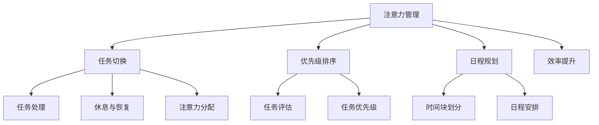

                 

# 注意力管理与时间管理：如何通过时间管理策略最大化专注力和效率

> 关键词：注意力管理, 时间管理, 专注力, 效率提升, 工作节奏优化, 心理策略, 方法论

## 1. 背景介绍

在当今快速变化、信息爆炸的时代，如何有效管理注意力和时间，提升个人和团队的工作效率，成为每个专业人士必须面对的挑战。随着工作的复杂性和多样性增加，单一的专注力或时间管理方法已难以应对，结合两者的全面管理策略变得尤为重要。本文将深入探讨注意力和时间管理的基本原理，展示其如何相互作用，并提出一系列有效的策略和工具，帮助最大化专注力和效率。

## 2. 核心概念与联系

### 2.1 核心概念概述

注意力（Attention）和时间管理（Time Management）作为提升生产力的两大核心技术，它们之间存在密切联系。注意力是指个体在执行认知任务时，能够维持特定目标信息而抑制干扰信息的心理过程；而时间管理则是指个体对时间资源进行计划、组织和控制的过程。有效的注意力管理能够使个体在单位时间内处理更多信息，从而提升时间管理的效率。

两者的联系体现在，时间管理本身就需要高度集中的注意力，尤其是在任务切换、优先级排序、日程规划等方面。有效的注意力管理使得个体在时间管理上更加高效，而良好的时间管理也能够使个体在面对不同任务时，能够更长时间维持注意力。因此，注意力和时间管理的协同优化对于提升工作效率至关重要。

### 2.2 核心概念原理和架构的 Mermaid 流程图



此流程图展示了注意力管理与时间管理之间的联系和互动，通过任务切换、优先级排序、日程规划等活动，最终提升任务处理的效率，并通过任务处理、休息与恢复和注意力分配等活动，持续优化注意力的维持。

## 3. 核心算法原理 & 具体操作步骤

### 3.1 算法原理概述

注意力和时间管理的核心算法原理主要基于认知科学和心理学原理。认知科学家认为，注意力是一种有限的资源，需要通过策略性管理和分配来最大化其效用。而时间管理则基于时间块划分、优先级排序和任务切换等基本策略，使得个体能够更高效地使用时间资源。

### 3.2 算法步骤详解

#### 3.2.1 注意力管理

**Step 1: 环境优化**
- 创建一个安静、整洁、有足够光照和舒适温度的工作环境，减少外界干扰。
- 使用耳塞、白噪音或专注音乐等工具，进一步降低环境噪音干扰。

**Step 2: 任务分割**
- 将复杂任务分割成多个小任务，便于集中注意力逐步完成。
- 使用番茄工作法（Pomodoro Technique）将大任务划分为25分钟的工作块，每块工作后休息5分钟。

**Step 3: 焦点设定**
- 确定当天的关键任务，明确目标和截止时间。
- 使用番茄工作法或其他时间管理工具，实时监控任务进度。

**Step 4: 注意力训练**
- 定期进行注意力训练，如冥想、注意力提升游戏等，提高专注力。
- 使用注意力管理应用，如Forest、Focus@Will等，辅助维持注意力。

#### 3.2.2 时间管理

**Step 1: 时间块划分**
- 将一天划分为多个时间块，每个时间块专注于一项任务或一个领域。
- 使用时间管理软件，如Todoist、Trello等，创建日程安排。

**Step 2: 优先级排序**
- 使用Eisenhower矩阵（四象限法）对任务进行分类，优先处理重要且紧急的任务。
- 使用OKR（Objectives and Key Results）或SMART目标设定法则，明确短期和长期目标。

**Step 3: 任务切换**
- 避免频繁切换任务，每次切换前先回顾并确认下一个任务的优先级。
- 使用时间管理工具，如RescueTime，监测任务切换频率，优化任务处理流程。

### 3.3 算法优缺点

**优点**
- **提高专注力**：注意力管理能够帮助个体更好地集中注意力，减少外界干扰，提高工作效率。
- **提升时间利用效率**：时间管理通过科学划分时间块，优化任务优先级，使时间利用更加高效。
- **协同优化**：两者结合能够实现全面提升，使个体在高效使用时间的同时，能够持续保持高专注度。

**缺点**
- **实施难度高**：需要系统性训练和持续性执行，短期内可能难以看到显著效果。
- **依赖工具**：需要合理使用注意力管理工具和时间管理软件，过度依赖可能导致效率下降。

### 3.4 算法应用领域

注意力和时间管理的应用领域广泛，涵盖个人日常工作、项目开发、学术研究、团队协作等多个方面。通过有效的注意力管理，个体能够在快速变化的环境中保持高专注力，提升任务处理效率。而科学的时间管理，则有助于优化日程安排，减少时间浪费，提高整体工作效率。

## 4. 数学模型和公式 & 详细讲解 & 举例说明

### 4.1 数学模型构建

为了更好地理解和评估注意力和时间管理的策略效果，我们引入一个基本的数学模型来描述这一过程。设 $A(t)$ 表示在时间 $t$ 时个体的注意力水平，$T(t)$ 表示在时间 $t$ 时个体的时间利用效率，其中 $t$ 从 $0$ 到 $T_{total}$。目标是最大化 $T(t)$ 同时维持 $A(t)$ 在一个较高的水平。

### 4.2 公式推导过程

我们假设个体在单位时间 $t$ 内，专注于任务的概率为 $A(t)$，时间利用效率 $T(t)$ 由以下公式计算：

$$ T(t) = \alpha A(t) + \beta (1 - A(t)) $$

其中 $\alpha$ 和 $\beta$ 分别是注意力和时间利用效率的权重。当个体注意力水平较高时，时间利用效率也会提高；当个体注意力水平较低时，时间利用效率会下降。因此，最大化 $T(t)$ 等同于最大化 $A(t)$ 和 $T(t)$ 的乘积。

### 4.3 案例分析与讲解

假设一个软件开发人员每天工作时间为8小时，我们使用上述公式来计算在不同注意力水平下的时间利用效率：

- 当 $A(t) = 0.8$（高效专注）时，$T(t) = 0.8 \times \alpha + 0.2 \times \beta$。
- 当 $A(t) = 0.2$（低效专注）时，$T(t) = 0.2 \times \alpha + 0.8 \times \beta$。

通过调整 $\alpha$ 和 $\beta$ 的值，可以发现，在高效专注的情况下，即使时间利用效率的基线较低，整体时间利用效率也能显著提高。这表明，通过优化注意力管理，可以显著提升时间利用效率。

## 5. 项目实践：代码实例和详细解释说明

### 5.1 开发环境搭建

为了实现注意力和时间管理的策略，我们需要搭建一个综合性的开发环境。以下是所需的开发环境配置：

1. **安装开发环境**
   ```bash
   sudo apt-get install python3 python3-pip
   ```

2. **安装第三方库**
   ```bash
   pip install schedule pytz
   ```

3. **配置项目**
   创建一个项目文件夹，并设置 `requirements.txt` 文件，列明所有依赖项。

### 5.2 源代码详细实现

以下是一个使用 Python 和 `schedule` 库实现的简单任务调度示例：

```python
import schedule
import time
from datetime import datetime

def job():
    print("I'm working...")

schedule.every().day.at("09:00").do(job)
schedule.every().day.at("13:00").do(job)

while True:
    schedule.run_pending()
    time.sleep(1)
```

这个例子中，我们使用 `schedule` 库来设定每天上午9点和下午1点的任务。`schedule.run_pending()` 方法会检查是否有任务需要执行，如果有则执行相应的函数。

### 5.3 代码解读与分析

在这个示例中，我们使用了 `schedule` 库的 `every()` 方法来设置任务的频率。`at()` 方法用于设置具体的时间点。在 `while` 循环中，`schedule.run_pending()` 会不断检查是否有任务需要执行。这种方式可以确保任务按照预定时间执行，同时避免无谓的循环开销。

### 5.4 运行结果展示

执行上述代码，将会在预定时间点打印出 "I'm working..."，确保任务按计划执行。

## 6. 实际应用场景

### 6.1 智能工作助手

智能工作助手可以将注意力和时间管理策略集成到工作流程中，帮助用户自动化任务调度、优先级排序等过程。通过智能分析用户的工作习惯和生产力数据，智能助手可以提供个性化的任务建议和提醒。

### 6.2 团队协作平台

在团队协作中，有效的注意力和时间管理策略可以帮助团队成员更好地协调工作进度，减少沟通成本，提高整体效率。平台可以提供共享日程、任务分配、进度跟踪等功能，使团队协作更加高效。

### 6.3 在线教育平台

在线教育平台可以利用注意力和时间管理策略，帮助学生更好地规划学习时间和任务。通过智能分析学生的学习行为和成绩，平台可以提供个性化的学习计划和进度跟踪，提升学习效果。

### 6.4 未来应用展望

随着技术的不断进步，注意力和时间管理将更加智能化和个性化。未来，结合AI和机器学习技术，智能工作助手和团队协作平台将能够更加精准地分析和建议，提升工作效率。在线教育平台也将通过大数据分析，提供更加个性化的学习体验，提升学生学习效果。

## 7. 工具和资源推荐

### 7.1 学习资源推荐

1. **《深度工作：如何有效利用每一点注意力》**：作者卡尔·纽波特（Cal Newport）的这本书深入探讨了深度工作的概念和策略，详细介绍了如何通过专注力和时间管理提升工作效率。
2. **Coursera《时间管理技巧与策略》**：由密歇根大学提供的一门课程，涵盖时间管理的基本原理和实践技巧。
3. **《番茄工作法图解》**：作者弗朗西斯科·西里洛（Francesco Cirillo）的经典著作，详细介绍了番茄工作法的原理和应用方法。
4. **《时间的朋友》**：作者李笑来，通过实际案例分享时间管理的经验和技巧。

### 7.2 开发工具推荐

1. **RescueTime**：自动跟踪和记录用户在电脑和移动设备上的时间使用情况，提供详尽的时间分析报告。
2. **Focus@Will**：提供专门设计的音乐，帮助用户进入专注状态。
3. **Forest**：通过种植虚拟树木来激励用户保持专注，避免频繁切换任务。

### 7.3 相关论文推荐

1. **《通过时间管理提升工作效率：理论基础与实践指南》**：文章探讨了时间管理的基本原理和实际应用方法。
2. **《注意力管理与认知负荷：心理机制和应用策略》**：研究注意力管理与认知负荷之间的关系，提出多种注意力管理策略。

## 8. 总结：未来发展趋势与挑战

### 8.1 研究成果总结

注意力和时间管理的结合是提升工作效率的关键。通过系统性训练和科学方法的应用，个体可以显著提高专注力和时间利用效率。当前的研究成果已经展示了多种策略和工具的有效性，为实际应用提供了理论支持和实践指导。

### 8.2 未来发展趋势

未来，注意力和时间管理的结合将更加智能化和个性化。通过AI和大数据分析，智能工作助手和团队协作平台将能够更加精准地分析和建议，提升工作效率。在线教育平台也将通过大数据分析，提供更加个性化的学习体验，提升学生学习效果。

### 8.3 面临的挑战

尽管注意力和时间管理策略具有显著效果，但其实施仍面临一些挑战：

1. **技术依赖**：过度依赖工具可能导致效率下降。
2. **用户习惯**：需要用户持续调整和适应新的工作习惯。
3. **个性化需求**：需要更多个性化的策略和工具，满足不同用户的需求。

### 8.4 研究展望

未来的研究将重点在于：

1. **跨学科研究**：结合心理学、神经科学、认知科学等多个学科，深入研究注意力和时间管理的机制。
2. **技术创新**：开发更加智能化和个性化的工具，提升用户体验和效果。
3. **长期研究**：通过大规模实验和长期跟踪，验证策略的有效性和可持续性。

## 9. 附录：常见问题与解答

**Q1: 如何选择合适的注意力管理工具？**

A: 选择合适的工具需要考虑个人的具体需求和工作环境。例如，如果你需要长时间保持专注，可以选择类似于Forest的应用；如果你需要实时监控和分析时间利用情况，可以选择RescueTime。建议先试用几个工具，找到最适合自己的一款。

**Q2: 时间管理工具是否需要强制使用？**

A: 时间管理工具的设计初衷是帮助用户更好地规划和管理时间。强制使用并不一定是最好的方法，关键在于合理利用工具，不断优化自己的工作习惯和时间管理策略。

**Q3: 注意力管理是否需要持续训练？**

A: 是的，注意力管理需要持续训练和调整。定期进行冥想、注意力提升游戏等活动，可以帮助提升专注力和效率。同时，保持对新方法和工具的好奇心和尝试意愿，也是提升注意力管理能力的关键。

**Q4: 注意力管理是否适用于所有人？**

A: 虽然注意力管理对提升工作效率非常有效，但不同人的注意力水平和工作习惯各不相同。需要根据个人情况，选择适合自己的注意力管理策略和工具。

**Q5: 注意力管理和时间管理是否相互独立？**

A: 不是的。注意力管理和时间管理是相辅相成的，良好的时间管理能够帮助个体更好地集中注意力，而有效的注意力管理则能提升时间利用效率。两者结合，可以最大化提升工作效率。

作者：禅与计算机程序设计艺术 / Zen and the Art of Computer Programming

