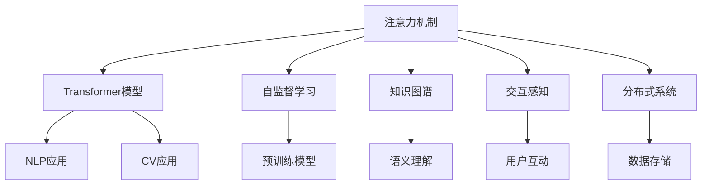

                 

# 注意力管理在元宇宙中的重要性

> 关键词：元宇宙、注意力机制、人工智能、自然语言处理、计算机视觉、深度学习

## 1. 背景介绍

### 1.1 元宇宙概念与发展历程

元宇宙（Metaverse）是近年来的热门概念，指由多个维度（时间、空间、逻辑、语义等）组成的虚拟世界，人们可以在其中进行社交、娱乐、工作、创造等活动。元宇宙融合了虚拟现实（VR）、增强现实（AR）、混合现实（MR）等多种技术，构建了一个高度沉浸的虚拟环境，打破了现实世界与虚拟世界的界限，提供了全新的交互方式和体验。

自1992年科幻小说《雪崩》首次提出元宇宙概念以来，经过多年的技术积累和市场培育，元宇宙正在逐步从科幻走向现实。从2006年的虚拟世界平台Second Life到2010年社交平台Facebook发布Horizon Worlds，再到2020年沙盒游戏Roblox上市并快速崛起，以及2021年全球巨头纷纷布局元宇宙，元宇宙已经逐渐成为数字化时代的下一场重大变革。

### 1.2 元宇宙的关键技术

构建元宇宙的核心技术包括计算机图形学、虚拟现实、增强现实、云计算、网络通信、人工智能、区块链、物联网等。这些技术相互融合，共同构建了元宇宙的基础架构。其中，人工智能在元宇宙中的应用尤为关键，尤其是自然语言处理、计算机视觉、深度学习等技术。

人工智能在元宇宙中主要承担以下几个任务：
1. **自然语言处理（NLP）**：帮助用户通过自然语言与虚拟环境进行交互，实现文本生成、语音识别、语义理解等。
2. **计算机视觉（CV）**：处理视觉信息，进行对象识别、场景分析、图像生成等，提供沉浸式体验。
3. **深度学习（DL）**：通过大规模数据分析，训练出具备强大理解和生成能力的模型，支持元宇宙的智能决策和自主行为。

## 2. 核心概念与联系

### 2.1 核心概念概述

为了深入理解注意力管理在元宇宙中的重要性，本节将介绍几个核心概念：

- **注意力机制（Attention Mechanism）**：注意力机制是一种能够动态选择信息并赋予不同权重的方法，广泛应用在自然语言处理、计算机视觉等任务中，使得模型能够更好地处理复杂的多模态数据，提升模型的泛化能力和性能。

- **自监督学习（Self-supervised Learning）**：自监督学习是一种无需标签即可通过数据内在的关联性进行模型训练的方法，广泛应用于预训练和微调任务中，可以大幅提升模型的语言和视觉理解能力。

- **Transformer模型**：Transformer模型是当前NLP和CV领域中最流行的模型之一，引入了自注意力机制，能够在处理长序列和复杂任务时表现优异。

- **知识图谱（Knowledge Graph）**：知识图谱是一种语义化的数据表示形式，用于存储和检索大量结构化信息，支持复杂关系推理，是元宇宙中重要的知识表示手段。

- **交互感知（Interactivity）**：交互感知指元宇宙中用户与虚拟环境的互动能力，通过AI技术实现智能化的内容生成和动态交互，提升用户体验和参与感。

- **分布式系统（Distributed System）**：分布式系统是元宇宙中的基础设施，通过高性能计算、海量数据存储、低延迟网络等技术，支持大规模用户同时在线和实时互动。

这些核心概念之间的逻辑关系可以通过以下Mermaid流程图来展示：



这个流程图展示了注意力机制在元宇宙中的核心地位，它通过与其他关键技术的相互作用，驱动了元宇宙的多项应用，包括自然语言处理、计算机视觉、知识图谱、交互感知和分布式系统等。

## 3. 核心算法原理 & 具体操作步骤

### 3.1 算法原理概述

在元宇宙中，注意力机制的应用非常广泛，尤其是在自然语言处理和计算机视觉任务中，通过动态选择信息并赋予不同权重，提升模型对关键信息的关注和处理能力。在元宇宙中，注意力机制的应用场景包括但不限于：

- **自然语言处理（NLP）**：在聊天机器人、文本生成、机器翻译等任务中，注意力机制能够帮助模型关注输入序列中的关键部分，提高模型的理解和生成能力。

- **计算机视觉（CV）**：在图像生成、目标检测、图像分割等任务中，注意力机制能够指导模型关注图像中的重要区域，提升模型的识别和处理能力。

- **知识图谱（KG）**：在知识推理、关系抽取、实体链接等任务中，注意力机制能够帮助模型选择重要的实体和关系，提高推理和抽取的准确性。

### 3.2 算法步骤详解

基于注意力机制在元宇宙中的应用，以下是一个典型的基于注意力机制的文本生成算法步骤：

1. **输入编码**：将输入文本序列通过编码器进行编码，得到向量表示。
2. **注意力计算**：计算每个输出位置的注意力权重，动态选择输入序列中的重要部分。
3. **输出生成**：将注意力加权后的输入序列与中间状态进行拼接，通过解码器生成输出序列。
4. **训练优化**：通过反向传播和优化算法，最小化生成序列与目标序列的差异。

### 3.3 算法优缺点

基于注意力机制的文本生成算法具有以下优点：

- **灵活性高**：通过动态选择信息，能够灵活处理不同类型的输入，适用于各种NLP任务。
- **泛化能力强**：通过自监督学习和预训练，可以更好地泛化到不同的数据集和任务中。
- **性能优越**：通过深度学习模型，能够实现高精度的文本生成和自然语言理解。

然而，该算法也存在一些缺点：

- **计算复杂度高**：注意力机制的计算复杂度较高，在大规模数据集上训练时，需要大量的计算资源。
- **模型复杂度高**：由于引入了注意力机制，模型的结构更加复杂，训练和推理的难度增大。
- **解释性差**：注意力机制的内部机制较复杂，模型的决策过程难以解释，缺乏可解释性。

### 3.4 算法应用领域

基于注意力机制的算法在元宇宙中具有广泛的应用，包括但不限于：

- **自然语言处理（NLP）**：聊天机器人、智能客服、语音识别、机器翻译、文本摘要等。
- **计算机视觉（CV）**：图像生成、目标检测、图像分割、视觉问答、视频分析等。
- **知识图谱（KG）**：知识推理、关系抽取、实体链接、问答系统等。

这些应用领域覆盖了元宇宙中最重要的几个方面，包括用户交互、内容生成、智能决策等，展示了注意力机制在元宇宙中的巨大潜力。

## 4. 数学模型和公式 & 详细讲解 & 举例说明（备注：数学公式请使用latex格式，latex嵌入文中独立段落使用 $$，段落内使用 $)
### 4.1 数学模型构建

基于注意力机制的文本生成算法可以形式化表示为：

$$
\begin{aligned}
    \text{Encoder:} &\quad \mathcal{E}(x) = \text{MLP}(x) \\
    \text{Attention:} &\quad \text{Att}(\mathcal{E}(x), h_t) = \text{softmax}(\text{QK}(\mathcal{E}(x), h_t)) \\
    \text{Decoder:} &\quad \mathcal{D}(\text{Att}(\mathcal{E}(x), h_t), y_{t-1}) = \text{MLP}(\text{Att}(\mathcal{E}(x), h_t), y_{t-1}) \\
    \text{Training:} &\quad \mathcal{L}(\theta) = \text{BCE}(y_{t}, \mathcal{D}(\text{Att}(\mathcal{E}(x), h_t), y_{t-1}))
\end{aligned}
$$

其中，$x$ 表示输入文本序列，$y_{t}$ 表示目标输出序列，$h_t$ 表示当前解码器的隐藏状态，$\mathcal{E}(x)$ 表示编码器的输出，$\mathcal{D}(\text{Att}(\mathcal{E}(x), h_t), y_{t-1})$ 表示解码器的输出。

### 4.2 公式推导过程

在注意力机制的计算过程中，假设输入序列为 $x = (x_1, x_2, \cdots, x_n)$，解码器的隐藏状态为 $h_t$，输出序列为 $y_t$，则注意力计算公式为：

$$
\text{Att}(Q, K, V) = \text{softmax}(\frac{QK^T}{\sqrt{d_k}} + b)
$$

其中，$Q$ 表示查询矩阵，$K$ 表示键矩阵，$V$ 表示值矩阵，$d_k$ 表示键的维度，$b$ 表示可调参数。

注意力权重矩阵 $A$ 计算为：

$$
A = \text{Att}(Q, K, V)
$$

将注意力权重矩阵 $A$ 与值矩阵 $V$ 进行矩阵乘法，得到加权后的值矩阵 $V_A$：

$$
V_A = AV
$$

最终的输出结果为：

$$
\mathcal{D}(V_A, y_{t-1}) = \text{MLP}(V_A, y_{t-1})
$$

其中，$MLP$ 表示多层感知器。

### 4.3 案例分析与讲解

以基于注意力机制的聊天机器人为例，该模型通过动态选择输入文本序列中的关键部分，生成与用户交流的回复。在训练过程中，模型通过自监督学习和监督学习相结合的方式，先在大规模无标签文本上预训练，然后在标注数据上进行微调，提升模型的泛化能力和性能。

在推理时，模型通过输入用户的问题，通过编码器生成文本表示，然后通过解码器生成回复。在解码器中，注意力机制动态选择输入序列中的关键部分，提高模型的生成能力和效果。

## 5. 项目实践：代码实例和详细解释说明

### 5.1 开发环境搭建

在进行注意力机制的实践前，我们需要准备好开发环境。以下是使用Python进行PyTorch开发的环境配置流程：

1. 安装Anaconda：从官网下载并安装Anaconda，用于创建独立的Python环境。

2. 创建并激活虚拟环境：
```bash
conda create -n attention-env python=3.8 
conda activate attention-env
```

3. 安装PyTorch：根据CUDA版本，从官网获取对应的安装命令。例如：
```bash
conda install pytorch torchvision torchaudio cudatoolkit=11.1 -c pytorch -c conda-forge
```

4. 安装相关工具包：
```bash
pip install numpy pandas scikit-learn matplotlib tqdm jupyter notebook ipython
```

完成上述步骤后，即可在`attention-env`环境中开始注意力机制的实践。

### 5.2 源代码详细实现

下面以基于注意力机制的文本生成模型为例，给出使用PyTorch进行代码实现。

首先，定义模型和优化器：

```python
import torch
import torch.nn as nn
import torch.optim as optim
from torch.nn import functional as F

class AttentionModel(nn.Module):
    def __init__(self, embedding_dim, hidden_dim):
        super(AttentionModel, self).__init__()
        self.encoder = nn.Embedding(num_embeddings=vocab_size, embedding_dim=embedding_dim)
        self.encoder_weight = nn.Parameter(torch.randn(embedding_dim, hidden_dim))
        self.encoder_bias = nn.Parameter(torch.randn(embedding_dim))
        self.decoder = nn.Linear(embedding_dim * 2, hidden_dim)
        self.decoder_weight = nn.Parameter(torch.randn(hidden_dim, vocab_size))
        self.decoder_bias = nn.Parameter(torch.randn(vocab_size))
        self.activation = nn.Tanh()
        self.softmax = nn.Softmax(dim=1)

    def forward(self, x, h):
        q = self.encoder(x)
        q = q * self.encoder_weight + self.encoder_bias
        q = self.activation(q)
        k = h.unsqueeze(1).expand(q.size(0), -1, -1)
        v = self.decoder(q * self.encoder_weight + self.encoder_bias)
        v = v * self.decoder_weight + self.decoder_bias
        a = self.softmax(q * k.unsqueeze(2))
        v_a = (a * v).sum(dim=1)
        o = self.activation(v_a + q)
        o = self.softmax(o)
        return o

    def loss(self, x, h, y):
        y_hat = self.forward(x, h)
        loss = F.cross_entropy(y_hat, y)
        return loss

# 加载数据
data = load_data()
vocab_size = len(data.vocab)
embedding_dim = 256
hidden_dim = 512
model = AttentionModel(embedding_dim, hidden_dim)
optimizer = optim.Adam(model.parameters(), lr=0.001)
criterion = nn.CrossEntropyLoss()

# 训练模型
for epoch in range(num_epochs):
    for batch in data:
        x, h, y = batch
        optimizer.zero_grad()
        loss = model.loss(x, h, y)
        loss.backward()
        optimizer.step()

# 测试模型
test_data = load_test_data()
with torch.no_grad():
    for batch in test_data:
        x, h, y = batch
        y_hat = model.forward(x, h)
        loss = criterion(y_hat, y)
```

以上代码实现了基于注意力机制的文本生成模型，通过编码器和解码器结构，动态选择输入序列中的关键部分，生成回复。

### 5.3 代码解读与分析

让我们再详细解读一下关键代码的实现细节：

**AttentionModel类**：
- `__init__`方法：初始化编码器、解码器、注意力机制等关键组件，包括嵌入层、线性层、激活函数等。
- `forward`方法：定义模型的前向传播过程，包括编码、解码、注意力计算等步骤。
- `loss`方法：定义模型的损失函数，使用交叉熵损失函数计算预测输出与真实标签之间的差异。

**训练和测试流程**：
- 使用PyTorch的DataLoader对数据集进行批次化加载，供模型训练和推理使用。
- 在每个epoch内，对训练集数据进行迭代，更新模型参数。
- 在每个batch结束后，计算损失并反向传播更新模型参数。
- 使用测试集数据评估模型性能，获取模型在未见过的数据上的表现。

通过上述代码，我们可以看到，PyTorch通过简洁的API和强大的动态图机制，使得构建基于注意力机制的模型变得非常简单和高效。

## 6. 实际应用场景

### 6.1 智能客服系统

在智能客服系统中，基于注意力机制的聊天机器人可以为用户提供即时、个性化的服务，提升客户满意度。通过微调模型，聊天机器人可以更好地理解用户问题，提供准确的回答，甚至根据上下文信息进行智能引导。

例如，在处理用户投诉时，聊天机器人可以通过注意力机制动态选择用户提供的上下文信息，快速定位问题，并提供相应的解决方案。此外，聊天机器人还可以通过回译和改写，将自然语言转换为结构化数据，便于后续分析和处理。

### 6.2 医疗诊断系统

在医疗诊断系统中，基于注意力机制的模型可以辅助医生进行疾病诊断和治疗方案推荐。例如，通过分析患者的病历记录和实验室数据，模型可以动态关注重要的症状和检查结果，帮助医生快速做出准确的诊断。

此外，模型还可以通过分析医学文献和知识图谱，提供最新的治疗方案和药物推荐，提升医疗服务的智能化水平。

### 6.3 金融风险评估

在金融风险评估系统中，基于注意力机制的模型可以实时监测市场舆情和交易数据，进行风险预警和风险控制。例如，通过分析新闻、社交媒体等非结构化数据，模型可以动态关注重要的市场动态和舆情变化，快速识别潜在的风险点。

此外，模型还可以通过分析历史交易数据和知识图谱，提供风险评估和投资建议，提升金融决策的智能化水平。

### 6.4 未来应用展望

随着技术的发展，基于注意力机制的模型在元宇宙中的应用将越来越广泛。未来，该技术有望在以下几个方面得到进一步发展：

1. **多模态数据融合**：元宇宙中的数据类型多样，包括文本、图像、视频等。基于注意力机制的模型可以通过动态选择不同模态的信息，实现多模态数据的融合，提升模型的综合理解和生成能力。

2. **知识推理和图谱**：元宇宙中的知识表示和推理是关键任务之一。基于注意力机制的模型可以通过动态选择实体和关系，实现知识图谱的构建和推理，提升系统的智能决策能力。

3. **交互感知和用户体验**：元宇宙中的用户互动是核心任务之一。基于注意力机制的模型可以通过动态选择重要信息，提升系统的交互感知和用户体验，实现更自然、更流畅的人机交互。

4. **分布式系统和计算优化**：元宇宙中的系统需要支持大规模用户同时在线，基于注意力机制的模型可以通过分布式计算和资源优化，提升系统的计算效率和稳定性。

未来，随着技术的不断进步和应用场景的不断扩展，基于注意力机制的模型必将在元宇宙中发挥更大的作用，推动人工智能技术的普及和应用。

## 7. 工具和资源推荐

### 7.1 学习资源推荐

为了帮助开发者系统掌握注意力机制在元宇宙中的应用，这里推荐一些优质的学习资源：

1. **自然语言处理（NLP）**：
   - 《自然语言处理综论》（"The Natural Language Book"）：全面介绍NLP的基本概念和经典模型，适合初学者和高级开发者。
   - Stanford NLP课程（Stanford CS224N）：斯坦福大学开设的NLP明星课程，涵盖NLP的基础理论和实际应用，适合深入学习。

2. **计算机视觉（CV）**：
   - 《计算机视觉：模型、学习和推理》（"Computer Vision: Models, Learning, and Inference"）：全面介绍CV的基本概念和经典模型，适合初学者和高级开发者。
   - PyImageSearch：提供大量CV学习资源，包括教程、代码和数据集，适合动手实践。

3. **深度学习（DL）**：
   - 《深度学习》（"Deep Learning"）：由Ian Goodfellow等撰写的经典深度学习教材，适合全面了解DL的基本概念和算法。
   - DeepLearning.ai课程：由Andrew Ng等开设的深度学习课程，涵盖DL的基础理论和实际应用，适合深入学习。

4. **知识图谱（KG）**：
   - 《知识图谱技术与应用》（"Knowledge Graphs"）：全面介绍KG的基本概念和经典技术，适合初学者和高级开发者。
   - Semantic Technologies：提供大量KG学习资源，包括教程、代码和数据集，适合动手实践。

### 7.2 开发工具推荐

为了提高开发效率和优化模型性能，以下是几款推荐的开发工具：

1. **PyTorch**：基于Python的开源深度学习框架，支持动态图和静态图，适合快速迭代研究。
2. **TensorFlow**：由Google主导开发的开源深度学习框架，生产部署方便，适合大规模工程应用。
3. **TensorBoard**：TensorFlow配套的可视化工具，支持实时监测模型训练状态，提供丰富的图表呈现方式。
4. **Weights & Biases**：模型训练的实验跟踪工具，记录和可视化模型训练过程中的各项指标，方便对比和调优。
5. **Notebook**：提供便捷的交互式编程环境，支持多种编程语言和库，适合数据分析和模型开发。

### 7.3 相关论文推荐

以下是几篇奠基性的相关论文，推荐阅读：

1. Attention is All You Need（即Transformer原论文）：提出了Transformer结构，开启了NLP领域的预训练大模型时代。
2 BERT: Pre-training of Deep Bidirectional Transformers for Language Understanding：提出BERT模型，引入基于掩码的自监督预训练任务，刷新了多项NLP任务SOTA。
3 In-Depth Understanding of Transformers：深入讲解Transformer模型的工作原理和应用，适合全面理解。

## 8. 总结：未来发展趋势与挑战

### 8.1 总结

本文对注意力机制在元宇宙中的重要性进行了全面系统的介绍。首先阐述了元宇宙的概念和发展历程，明确了注意力机制在元宇宙中的核心地位。其次，从原理到实践，详细讲解了注意力机制的数学模型和核心算法，给出了模型实现的代码实例。同时，本文还广泛探讨了注意力机制在元宇宙中的广泛应用，包括智能客服、医疗诊断、金融风险评估等，展示了其巨大潜力。此外，本文精选了注意力机制相关的学习资源和开发工具，力求为读者提供全方位的技术指引。

通过本文的系统梳理，可以看到，注意力机制在元宇宙中的重要性不容小觑，它通过动态选择信息并赋予不同权重，显著提升了模型的泛化能力和性能，成为元宇宙中不可或缺的核心技术。未来，伴随技术的不断进步和应用场景的不断扩展，基于注意力机制的模型必将在元宇宙中发挥更大的作用，推动人工智能技术的普及和应用。

### 8.2 未来发展趋势

展望未来，注意力机制在元宇宙中的应用将呈现以下几个发展趋势：

1. **多模态融合**：元宇宙中的数据类型多样，包括文本、图像、视频等。基于注意力机制的模型可以通过动态选择不同模态的信息，实现多模态数据的融合，提升模型的综合理解和生成能力。

2. **知识推理和图谱**：元宇宙中的知识表示和推理是关键任务之一。基于注意力机制的模型可以通过动态选择实体和关系，实现知识图谱的构建和推理，提升系统的智能决策能力。

3. **交互感知和用户体验**：元宇宙中的用户互动是核心任务之一。基于注意力机制的模型可以通过动态选择重要信息，提升系统的交互感知和用户体验，实现更自然、更流畅的人机交互。

4. **分布式系统和计算优化**：元宇宙中的系统需要支持大规模用户同时在线，基于注意力机制的模型可以通过分布式计算和资源优化，提升系统的计算效率和稳定性。

以上趋势凸显了注意力机制在元宇宙中的巨大潜力。这些方向的探索发展，必将进一步提升元宇宙的系统性能和用户体验，为人类数字化生活的进步贡献力量。

### 8.3 面临的挑战

尽管注意力机制在元宇宙中的应用已经取得了瞩目成就，但在迈向更加智能化、普适化应用的过程中，它仍面临诸多挑战：

1. **计算资源瓶颈**：注意力机制的计算复杂度较高，在大规模数据集上训练时，需要大量的计算资源。如何在保持模型性能的同时，优化计算资源的使用，是未来需要解决的重要问题。

2. **模型复杂度**：由于引入了注意力机制，模型的结构更加复杂，训练和推理的难度增大。如何设计简单高效的模型架构，是未来需要优化的关键方向。

3. **可解释性不足**：注意力机制的内部机制较复杂，模型的决策过程难以解释，缺乏可解释性。如何在保证性能的同时，增强模型的可解释性，是未来需要解决的重要问题。

4. **数据质量问题**：元宇宙中的数据类型多样，数据质量参差不齐。如何处理和清洗数据，提升数据质量，是未来需要解决的重要问题。

5. **伦理和隐私问题**：元宇宙中的用户数据涉及隐私保护和伦理问题，如何保证数据安全和隐私保护，是未来需要解决的重要问题。

6. **跨模态融合的挑战**：多模态数据的融合是元宇宙中的重要任务，但不同模态的数据表示形式和处理方式存在差异，如何实现无缝融合，是未来需要解决的重要问题。

正视注意力机制在元宇宙中面临的这些挑战，积极应对并寻求突破，将是大规模应用的关键。相信随着学界和产业界的共同努力，这些问题终将一一被克服，注意力机制必将在元宇宙中发挥更大的作用。

### 8.4 研究展望

面对注意力机制在元宇宙中面临的挑战，未来的研究需要在以下几个方面寻求新的突破：

1. **优化计算资源使用**：开发更加高效和轻量级的模型架构，减少计算资源的使用，提升计算效率。

2. **增强模型可解释性**：引入可解释性技术，如注意力可视化、因果推断等，增强模型的决策过程的透明性和可解释性。

3. **提升数据质量**：采用数据清洗、数据增强等技术，提升元宇宙中数据的质量和多样性。

4. **解决伦理和隐私问题**：设计隐私保护机制，如差分隐私、联邦学习等，保护用户隐私和数据安全。

5. **实现跨模态融合**：开发跨模态数据融合技术，如多模态注意力机制、跨模态对齐等，实现不同模态数据的无缝融合。

这些研究方向将推动注意力机制在元宇宙中的应用不断深入，为构建智能化、普适化、可解释的元宇宙系统提供技术支持。面向未来，基于注意力机制的模型必将在元宇宙中发挥更大的作用，推动人工智能技术的普及和应用。

## 9. 附录：常见问题与解答

**Q1：元宇宙中的注意力机制如何处理长序列？**

A: 元宇宙中的数据序列较长时，传统的注意力机制可能会面临计算资源和时间成本的挑战。为解决这个问题，可以采用自适应注意力机制，如Transformer-XL、Transformer-Decoder等，通过引入局部性约束或前向指针机制，提高模型的计算效率和性能。

**Q2：注意力机制是否适用于所有元宇宙任务？**

A: 注意力机制在元宇宙中的应用非常广泛，但在某些特定任务上可能存在限制。例如，在图像分割任务中，注意力机制可能不如传统卷积神经网络（CNN）效果显著。此时，需要根据具体任务的特点，选择合适的模型架构和技术手段，确保模型的高效和准确。

**Q3：如何提升注意力机制的计算效率？**

A: 提升注意力机制的计算效率可以从以下几个方面入手：
1. 采用自适应注意力机制，如Transformer-XL、Transformer-Decoder等，减少计算资源和时间成本。
2. 采用混合精度训练和梯度积累技术，减少内存占用和计算量。
3. 优化模型结构，减少不必要的层和参数，提升模型效率。

**Q4：如何提升注意力机制的可解释性？**

A: 提升注意力机制的可解释性可以从以下几个方面入手：
1. 使用注意力可视化技术，展示模型在每个时间步的关注点，增强模型的透明性和可解释性。
2. 引入因果推断技术，解释模型决策的因果关系，提升模型的逻辑性和可解释性。
3. 采用模型压缩和稀疏化技术，减少模型的复杂度，提高模型的可解释性。

通过上述常见问题的解答，可以看到，基于注意力机制的模型在元宇宙中具有广泛的应用前景，但需要根据具体任务和数据特点，进行全面优化和改进，才能实现最佳的性能和效果。

