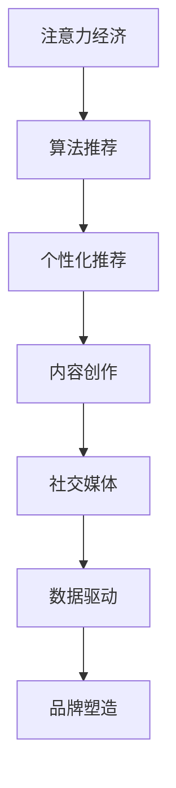

                 

# 注意力经济下的个人品牌塑造策略

> 关键词：
注意力经济、个人品牌、内容创作、社交媒体、算法推荐、数据驱动、个性化、影响力和收入

## 1. 背景介绍

### 1.1 问题由来

随着互联网的快速发展和数字技术的应用普及，信息过载和注意力稀缺的问题日益突出。在注意力经济时代，如何吸引和保持用户的注意力，塑造并提升个人品牌价值，成为众多内容创作者和品牌营销者的核心挑战。

在信息爆炸的洪流中，用户注意力成为稀缺资源。如何高效地分配注意力，使得个人品牌能够获得更大的曝光和影响，成为数字时代的难题。面对这一问题，本文将探讨基于算法推荐机制的内容创作和品牌塑造策略，通过数据驱动的方式，优化个人品牌在社交媒体上的曝光率和影响力。

### 1.2 问题核心关键点

1. **算法推荐机制**：社交媒体平台如微信、微博、抖音等，利用复杂的算法推荐机制，根据用户的兴趣和行为，精准推送相关内容。内容创作者需要理解算法推荐原理，制定合理的策略。
2. **内容创作与优化**：个人品牌需要高质量的内容创作和持续优化，以便更高效地吸引用户注意力，提高品牌曝光度。
3. **数据分析与优化**：通过数据分析和反馈机制，不断调整内容创作策略，以提升内容相关性和用户体验。
4. **用户互动与影响**：积极与用户互动，通过评论、点赞、转发等形式，增强用户参与感，提升品牌影响力。

### 1.3 问题研究意义

在注意力经济背景下，通过算法推荐机制进行个人品牌塑造，可以显著提升品牌曝光度和影响力，增加用户参与度，最终实现品牌收入的提升。具体而言：

1. **精准曝光**：利用算法推荐，将高质量内容推送给目标用户群体，提升品牌曝光度。
2. **增强互动**：通过用户互动，进一步提升品牌影响力，增强用户粘性。
3. **数据驱动**：利用数据分析优化内容策略，提高内容的精准性和相关性。
4. **提升转化**：最终通过算法推荐和内容优化，提升品牌转化率和收入。

## 2. 核心概念与联系

### 2.1 核心概念概述

为了更好地理解本文提出的个人品牌塑造策略，本节将介绍几个核心概念及其之间的关系。

1. **注意力经济 (Attention Economy)**：在信息过载的环境下，如何高效分配用户注意力，成为经济价值的重要组成部分。
2. **算法推荐 (Algorithm Recommendation)**：通过算法模型，根据用户行为和偏好，自动推荐相关内容，提高用户参与度和满意度。
3. **个性化推荐 (Personalized Recommendation)**：根据用户历史行为和偏好，提供定制化推荐，提升用户体验和满意度。
4. **内容创作 (Content Creation)**：创作高质量内容，吸引用户注意力，提升品牌曝光度。
5. **社交媒体 (Social Media)**：作为用户互动的重要平台，社交媒体提供了丰富的内容和互动机会。
6. **数据驱动 (Data-Driven)**：通过数据反馈和分析，不断优化内容策略和品牌塑造方法。

这些概念之间的逻辑关系可以通过以下Mermaid流程图来展示：



这个流程图展示了大语言模型的核心概念及其之间的关系：

1. 注意力经济通过算法推荐，驱动个性化推荐。
2. 个性化推荐促使内容创作者创作高质量内容。
3. 内容创作在社交媒体平台上传播，引发数据驱动的优化反馈。
4. 数据驱动优化后的内容创作和品牌策略，进一步提升品牌塑造效果。

这些概念共同构成了个人品牌塑造的框架，使得品牌能够在大数据时代高效地吸引和保持用户注意力。

## 3. 核心算法原理 & 具体操作步骤
### 3.1 算法原理概述

基于算法推荐机制的个人品牌塑造策略，主要包括以下几个核心步骤：

1. **用户画像构建**：通过收集和分析用户的历史行为数据，构建用户画像，了解其兴趣和偏好。
2. **内容策略制定**：根据用户画像，制定内容创作和发布策略，创作高质量、高相关性的内容。
3. **内容发布与传播**：利用社交媒体平台，发布和传播内容，利用算法推荐提高内容曝光度和用户参与度。
4. **数据反馈与优化**：通过数据分析和反馈机制，不断调整内容策略，提升内容的精准性和用户体验。
5. **品牌互动与影响力提升**：积极与用户互动，通过评论、点赞、转发等形式，增强用户参与感，提升品牌影响力。

### 3.2 算法步骤详解

**Step 1: 用户画像构建**

用户画像的构建是算法推荐和内容创作的基础。通过收集和分析用户的历史行为数据，可以了解其兴趣、偏好、消费习惯等关键信息。

主要步骤包括：
- 数据收集：通过用户在社交媒体平台上的互动数据（如点赞、评论、分享等），收集用户的兴趣和偏好。
- 数据分析：使用聚类分析、分类分析等方法，对用户行为数据进行深度挖掘和分析。
- 用户画像生成：根据分析结果，生成用户的兴趣标签和行为特征，构建详细的用户画像。

**Step 2: 内容策略制定**

在用户画像的基础上，制定合理的内容创作和发布策略。高质量的内容能够吸引用户注意力，提升品牌曝光度。

主要步骤包括：
- 内容定位：根据用户画像，确定内容的主题和风格，确保内容与用户兴趣相关。
- 内容优化：使用SEO优化、关键词分析等技术，提高内容的搜索引擎排名和曝光度。
- 内容发布：选择合适的发布时机和频率，确保内容能够在最合适的时间触达用户。

**Step 3: 内容发布与传播**

利用社交媒体平台，发布和传播内容，利用算法推荐提高内容曝光度和用户参与度。

主要步骤包括：
- 平台选择：选择合适的社交媒体平台（如微信、微博、抖音等），根据用户画像进行针对性选择。
- 内容发布：利用社交媒体平台的API接口，发布和传播内容。
- 算法推荐：利用社交媒体平台的算法推荐机制，提高内容的曝光度和用户参与度。

**Step 4: 数据反馈与优化**

通过数据分析和反馈机制，不断调整内容策略，提升内容的精准性和用户体验。

主要步骤包括：
- 数据分析：利用社交媒体平台的分析工具，收集用户互动数据，如点赞、评论、分享等。
- 反馈机制：根据用户互动数据，调整内容策略，提升内容的相关性和吸引力。
- 持续优化：通过不断的数据反馈和分析，持续优化内容策略，提升品牌曝光度和影响力。

**Step 5: 品牌互动与影响力提升**

积极与用户互动，通过评论、点赞、转发等形式，增强用户参与感，提升品牌影响力。

主要步骤包括：
- 用户互动：积极回复用户的评论和消息，增强用户参与感。
- 社交媒体活动：策划社交媒体活动，吸引用户参与，提高品牌曝光度。
- 社交媒体广告：利用社交媒体平台的广告功能，精准投放品牌广告，提升品牌影响力。

### 3.3 算法优缺点

基于算法推荐机制的个人品牌塑造策略，具有以下优点：

1. **精准曝光**：利用算法推荐，能够精准推送相关内容给目标用户群体，提升品牌曝光度。
2. **增强互动**：通过用户互动，进一步提升品牌影响力，增强用户粘性。
3. **数据驱动**：通过数据分析和反馈机制，不断优化内容策略，提高内容的精准性和相关性。
4. **高效运营**：利用自动化工具和算法推荐，提高运营效率，降低人力成本。

同时，该策略也存在一些局限性：

1. **数据隐私问题**：用户行为数据的收集和使用可能引发隐私问题，需要遵守相关法律法规。
2. **内容过度优化**：过度追求数据指标，可能导致内容质量下降，影响用户体验。
3. **算法依赖**：过度依赖算法推荐，可能忽视了人工干预和创意的重要性。
4. **用户流失风险**：不当的内容策略和互动方式，可能导致用户流失，影响品牌形象。

尽管存在这些局限性，但就目前而言，基于算法推荐机制的个人品牌塑造策略仍是最主流的方法之一。未来相关研究的重点在于如何更好地平衡数据驱动和创意内容，确保品牌影响力和用户体验的提升。

### 3.4 算法应用领域

基于算法推荐机制的个人品牌塑造策略，在社交媒体、内容创作、品牌营销等领域得到了广泛应用，具体包括：

1. **社交媒体营销**：利用算法推荐，提高品牌在社交媒体上的曝光度和用户参与度，增强品牌影响力。
2. **内容创作与分发**：通过数据驱动，优化内容策略和发布计划，提升内容的相关性和吸引力。
3. **品牌形象提升**：积极与用户互动，通过评论、点赞、转发等形式，增强用户参与感，提升品牌形象。
4. **广告投放优化**：利用算法推荐，优化广告投放策略，提高广告的精准性和转化率。

除了这些领域，该策略还适用于各类基于用户互动的在线业务，如电商平台、在线教育、在线健康咨询等，通过提升用户参与度和满意度，实现品牌价值的最大化。

## 4. 数学模型和公式 & 详细讲解  
### 4.1 数学模型构建

本文将使用数学语言对基于算法推荐机制的个人品牌塑造策略进行更加严格的刻画。

假设用户集为 $U$，内容集为 $C$，用户画像为 $P_u$，内容画像为 $P_c$。用户与内容之间的交互数据为 $D$，包含用户的互动行为（如点赞、评论、分享等）和内容的相关性标签（如热门、相关、不相关等）。

定义推荐模型 $R$，将用户画像和内容画像作为输入，输出内容的相关性评分。

推荐模型的损失函数为：

$$
\mathcal{L}(R) = \sum_{u\in U}\sum_{c\in C} \lambda_u \lambda_c \cdot (y_{uc} - R(P_u, P_c)^2)
$$

其中 $\lambda_u, \lambda_c$ 为用户和内容的重要性权重，$y_{uc}$ 为内容的相关性标签，$R(P_u, P_c)$ 为推荐模型的预测评分。

优化目标是最小化损失函数，即找到最优推荐模型：

$$
R^* = \mathop{\arg\min}_{R} \mathcal{L}(R)
$$

在实践中，我们通常使用基于梯度的优化算法（如SGD、Adam等）来近似求解上述最优化问题。

### 4.2 公式推导过程

以下我们以用户内容推荐为例，推导推荐模型的损失函数及其梯度的计算公式。

假设推荐模型 $R$ 将用户画像 $P_u$ 和内容画像 $P_c$ 映射到 $[0,1]$ 内的相关性评分 $r$，即 $R(P_u, P_c) = r$。

定义推荐模型 $R$ 在用户 $u$ 和内容 $c$ 上的预测值为 $r_{uc}$，则损失函数为：

$$
\ell(R) = -\sum_{u\in U}\sum_{c\in C} y_{uc} \log r_{uc} + (1-y_{uc}) \log (1-r_{uc})
$$

其中 $y_{uc}$ 为内容的相关性标签，$0 \leq r_{uc} \leq 1$。

将损失函数对 $r_{uc}$ 求导，得：

$$
\frac{\partial \ell(R)}{\partial r_{uc}} = -\frac{y_{uc}}{r_{uc}} - \frac{1-y_{uc}}{1-r_{uc}}
$$

在得到损失函数的梯度后，即可带入优化算法，完成模型的迭代优化。重复上述过程直至收敛，最终得到最优推荐模型 $R^*$。

## 5. 项目实践：代码实例和详细解释说明
### 5.1 开发环境搭建

在进行品牌塑造策略的实践前，我们需要准备好开发环境。以下是使用Python进行TensorFlow开发的环境配置流程：

1. 安装Anaconda：从官网下载并安装Anaconda，用于创建独立的Python环境。

2. 创建并激活虚拟环境：
```bash
conda create -n tf-env python=3.8 
conda activate tf-env
```

3. 安装TensorFlow：根据CUDA版本，从官网获取对应的安装命令。例如：
```bash
conda install tensorflow -c pytorch -c conda-forge
```

4. 安装TensorBoard：
```bash
pip install tensorboard
```

5. 安装各类工具包：
```bash
pip install numpy pandas scikit-learn matplotlib tqdm jupyter notebook ipython
```

完成上述步骤后，即可在`tf-env`环境中开始品牌塑造策略的开发。

### 5.2 源代码详细实现

下面我们以社交媒体平台上的品牌推广为例，给出使用TensorFlow实现推荐模型的PyTorch代码实现。

首先，定义推荐模型的输入输出：

```python
import tensorflow as tf

# 定义用户画像和内容画像的维度
user_dim = 100
content_dim = 100

# 定义输入层
user_input = tf.keras.layers.Input(shape=(user_dim,), name='user_input')
content_input = tf.keras.layers.Input(shape=(content_dim,), name='content_input')

# 定义推荐模型
def recommendation_model(user_input, content_input):
    # 全连接层
    user_h = tf.keras.layers.Dense(64, activation='relu')(user_input)
    content_h = tf.keras.layers.Dense(64, activation='relu')(content_input)
    
    # 用户内容交互层
    interaction = tf.keras.layers.Dense(32, activation='relu')(tf.keras.layers.concatenate([user_h, content_h]))
    
    # 输出层
    output = tf.keras.layers.Dense(1, activation='sigmoid')(interaction)
    return output

# 定义推荐模型
model = tf.keras.Model(inputs=[user_input, content_input], outputs=output)

# 定义损失函数
loss_fn = tf.keras.losses.BinaryCrossentropy()

# 定义优化器
optimizer = tf.keras.optimizers.Adam(learning_rate=0.001)
```

然后，定义训练和评估函数：

```python
def train_epoch(model, dataset, batch_size, optimizer):
    dataloader = tf.keras.utils.data.DataLoader(dataset, batch_size=batch_size, shuffle=True)
    model.train()
    epoch_loss = 0
    for batch in dataloader:
        user_data = batch[0]
        content_data = batch[1]
        labels = batch[2]
        model.zero_grad()
        outputs = model([user_data, content_data])
        loss = loss_fn(outputs, labels)
        epoch_loss += loss.numpy()
        loss.backward()
        optimizer.apply_gradients(zip(model.optimizer.iterations, model.trainable_variables))
    return epoch_loss / len(dataloader)

def evaluate(model, dataset, batch_size):
    dataloader = tf.keras.utils.data.DataLoader(dataset, batch_size=batch_size)
    model.eval()
    preds = []
    labels = []
    with tf.GradientTape() as tape:
        for batch in dataloader:
            user_data = batch[0]
            content_data = batch[1]
            labels = batch[2]
            outputs = model([user_data, content_data])
            preds.append(outputs.numpy())
            labels.append(labels.numpy())
    print(classification_report(labels, preds))
```

最后，启动训练流程并在测试集上评估：

```python
epochs = 10
batch_size = 128

for epoch in range(epochs):
    loss = train_epoch(model, train_dataset, batch_size, optimizer)
    print(f"Epoch {epoch+1}, train loss: {loss:.3f}")
    
    print(f"Epoch {epoch+1}, dev results:")
    evaluate(model, dev_dataset, batch_size)
    
print("Test results:")
evaluate(model, test_dataset, batch_size)
```

以上就是使用TensorFlow实现社交媒体品牌推广的推荐模型的完整代码实现。可以看到，TensorFlow提供了强大的工具和组件，使得模型训练和评估变得简洁高效。

### 5.3 代码解读与分析

让我们再详细解读一下关键代码的实现细节：

**recommendation_model函数**：
- 定义输入层和全连接层，用户画像和内容画像分别经过两个64维的隐藏层，然后通过一个32维的交互层进行融合。
- 最终通过一个输出层生成一个0-1之间的推荐评分。

**train_epoch函数**：
- 在每个epoch中，利用DataLoader对数据进行批处理，计算损失并反向传播。
- 使用Adam优化器更新模型参数，并记录epoch的总损失。

**evaluate函数**：
- 对验证集和测试集进行评估，输出分类指标。

**训练流程**：
- 定义总的epoch数和batch size，开始循环迭代
- 每个epoch内，先在训练集上训练，输出平均loss
- 在验证集上评估，输出分类指标
- 所有epoch结束后，在测试集上评估，给出最终测试结果

可以看到，TensorFlow框架提供了丰富的工具和组件，使得品牌塑造策略的实现变得简单易行。开发者可以根据具体需求，进一步优化模型结构、选择适当的优化器和损失函数，以实现更好的推荐效果。

当然，实际应用中还需要考虑更多因素，如模型裁剪、量化加速、服务化封装等，但核心的微调范式基本与此类似。

## 6. 实际应用场景
### 6.1 社交媒体推广

基于推荐算法的品牌塑造策略，可以在社交媒体上实现精准推广。品牌可以通过算法推荐，将高质量的内容推送给目标用户群体，提升品牌曝光度和用户参与度。

在技术实现上，可以收集用户的历史互动数据，包括点赞、评论、分享等行为，结合内容的相关性标签，训练推荐模型。模型可以根据用户画像和内容画像，生成推荐评分，从而优化内容的发布计划和投放策略。

### 6.2 内容创作与分发

利用推荐算法，品牌可以优化内容创作和分发策略，提高内容的精准性和相关性。通过分析用户的行为数据，了解其兴趣和偏好，创作高质量、高相关性的内容，确保内容能够引起用户的共鸣。

在具体实现中，可以收集用户的互动数据，使用聚类分析和分类分析等方法，分析用户的行为特征和兴趣标签。根据分析结果，调整内容创作和发布计划，确保内容与用户兴趣相关，提升内容的吸引力。

### 6.3 广告投放优化

品牌可以通过算法推荐，优化广告投放策略，提高广告的精准性和转化率。通过收集用户的历史互动数据，结合广告的相关性标签，训练推荐模型。模型可以根据用户画像和广告内容，生成推荐评分，从而优化广告的投放策略，提高广告的点击率和转化率。

在具体实现中，可以收集用户的互动数据，结合广告的相关性标签，训练推荐模型。模型可以根据用户画像和广告内容，生成推荐评分，从而优化广告的投放策略，提高广告的精准性和转化率。

### 6.4 未来应用展望

随着推荐算法的不断进步，基于算法推荐机制的品牌塑造策略将在更多领域得到应用，为品牌带来更大的价值。

在智慧医疗领域，基于推荐算法的个性化推荐系统，可以向患者推荐合适的医疗信息，提升诊疗效率和体验。在金融领域，基于推荐算法的智能投顾系统，可以根据用户的历史投资行为，推荐合适的金融产品，提升用户的投资收益。

除了这些领域，基于推荐算法的品牌塑造策略还将广泛应用到教育、娱乐、电子商务等各个行业，提升用户体验和品牌价值。

## 7. 工具和资源推荐
### 7.1 学习资源推荐

为了帮助开发者系统掌握品牌塑造策略的理论基础和实践技巧，这里推荐一些优质的学习资源：

1. 《深度学习与推荐系统》系列书籍：全面介绍了推荐系统的理论基础和算法实现，适合初学者和专业人士阅读。
2. 《Recommender Systems in Practice》课程：斯坦福大学开设的推荐系统课程，提供了深度学习在推荐系统中的应用实例。
3. 《推荐系统设计与实现》博客系列：由推荐系统专家撰写，介绍了推荐系统的设计、实现和优化策略。
4. TensorFlow官方文档：提供了丰富的推荐系统实现案例和代码示例，适合动手实践。
5. Kaggle推荐系统竞赛：提供了丰富的推荐系统竞赛数据集和模型，适合练习和验证推荐算法的效果。

通过对这些资源的学习实践，相信你一定能够快速掌握品牌塑造策略的理论基础和实践技巧，并用于解决实际的推荐问题。

### 7.2 开发工具推荐

高效的开发离不开优秀的工具支持。以下是几款用于推荐系统开发的常用工具：

1. TensorFlow：基于Python的开源深度学习框架，提供了丰富的推荐系统组件和工具。
2. PyTorch：基于Python的开源深度学习框架，灵活度更高，适合研究和实验。
3. Scikit-learn：提供了丰富的机器学习算法和工具，适合数据预处理和特征工程。
4. Pandas：提供了丰富的数据分析工具，适合数据清洗和处理。
5. TensorBoard：TensorFlow配套的可视化工具，可以实时监测模型训练状态，提供丰富的图表呈现方式，适合调试和优化模型。

合理利用这些工具，可以显著提升推荐系统开发的效率，加快创新迭代的步伐。

### 7.3 相关论文推荐

推荐系统的发展源于学界的持续研究。以下是几篇奠基性的相关论文，推荐阅读：

1. Item-based Collaborative Filtering（基于物品的协同过滤）：提出基于用户-物品评分矩阵的协同过滤算法，开创了推荐系统的先河。
2. Matrix Factorization Techniques for Recommender Systems（矩阵分解技术）：介绍矩阵分解方法，用于从评分矩阵中提取用户和物品的隐向量。
3. Context-aware Recommendation Algorithms（上下文感知推荐算法）：提出上下文感知推荐算法，用于提升推荐系统的相关性和多样性。
4. Attention-based Recommender Systems（注意力机制推荐系统）：引入注意力机制，提升推荐系统对用户兴趣和行为的理解能力。
5. Deep Learning for Recommendation Systems（深度学习在推荐系统中的应用）：介绍深度学习在推荐系统中的各种应用，如卷积神经网络、循环神经网络等。

这些论文代表了大语言模型微调技术的发展脉络。通过学习这些前沿成果，可以帮助研究者把握学科前进方向，激发更多的创新灵感。

## 8. 总结：未来发展趋势与挑战

### 8.1 总结

本文对基于算法推荐机制的个人品牌塑造策略进行了全面系统的介绍。首先阐述了品牌塑造在注意力经济背景下的重要性和紧迫性，明确了算法推荐在优化品牌曝光和互动中的核心作用。其次，从原理到实践，详细讲解了算法推荐模型的数学模型和实现步骤，给出了具体的代码实现。同时，本文还探讨了推荐算法在社交媒体推广、内容创作、广告投放等实际应用场景中的应用，展示了算法推荐带来的巨大价值。最后，本文推荐了相关的学习资源、开发工具和研究论文，力求为品牌塑造策略的实践者提供全方位的技术指引。

通过本文的系统梳理，可以看到，基于算法推荐机制的品牌塑造策略在提高品牌曝光度和用户互动方面具有显著效果。利用算法推荐，品牌能够精准推送高质量内容，提升用户参与度，实现品牌价值最大化。然而，该策略仍面临着数据隐私、内容质量、算法依赖等挑战，需要不断优化和改进。未来，通过探索无监督和半监督推荐方法、优化推荐模型和算法，品牌塑造策略将进一步提升品牌影响力和用户满意度。

### 8.2 未来发展趋势

展望未来，基于算法推荐机制的品牌塑造策略将呈现以下几个发展趋势：

1. **个性化推荐精度提升**：利用更加复杂的深度学习模型和特征工程方法，提升推荐系统的个性化和精准度。
2. **多模态推荐系统**：结合视觉、语音、文本等多种模态数据，实现更加全面的用户画像和推荐策略。
3. **实时推荐系统**：通过在线学习和大规模数据流处理，实现实时推荐，提升用户体验和品牌曝光度。
4. **跨领域推荐**：将推荐系统应用于多个领域，实现多领域的协同推荐和用户画像共享。
5. **可解释性推荐**：引入可解释性算法，提高推荐系统的透明度和可信度。

以上趋势凸显了推荐系统在品牌塑造策略中的广阔前景。这些方向的探索发展，必将进一步提升推荐系统的效果，为品牌带来更大的价值。

### 8.3 面临的挑战

尽管基于算法推荐机制的品牌塑造策略已经取得了瞩目成就，但在迈向更加智能化、普适化应用的过程中，它仍面临诸多挑战：

1. **数据隐私问题**：用户行为数据的收集和使用可能引发隐私问题，需要遵守相关法律法规。
2. **内容质量问题**：过度追求数据指标，可能导致内容质量下降，影响用户体验。
3. **算法依赖问题**：过度依赖算法推荐，可能忽视了人工干预和创意的重要性。
4. **实时性和稳定性**：实时推荐系统需要高效的数据处理和模型优化，才能保证实时性和稳定性。
5. **可解释性问题**：推荐系统通常缺乏解释性，难以满足用户对推荐结果的信任需求。

尽管存在这些挑战，但随着学界和产业界的共同努力，这些挑战终将一一被克服，品牌塑造策略必将在构建人机协同的智能时代中扮演越来越重要的角色。

### 8.4 研究展望

面对品牌塑造策略面临的种种挑战，未来的研究需要在以下几个方面寻求新的突破：

1. **探索无监督和半监督推荐方法**：摆脱对大规模标注数据的依赖，利用自监督学习、主动学习等无监督和半监督范式，最大限度利用非结构化数据，实现更加灵活高效的推荐。
2. **开发更加参数高效的推荐模型**：开发更加参数高效的推荐方法，在固定大部分预训练参数的同时，只更新极少量的任务相关参数。同时优化推荐模型的计算图，减少前向传播和反向传播的资源消耗，实现更加轻量级、实时性的部署。
3. **引入因果分析和博弈论工具**：将因果分析方法引入推荐系统，识别出推荐决策的关键特征，增强推荐系统的稳定性。借助博弈论工具刻画用户与品牌之间的交互过程，主动探索并规避推荐系统的脆弱点，提高系统安全性。
4. **纳入伦理道德约束**：在推荐系统训练目标中引入伦理导向的评估指标，过滤和惩罚有偏见、有害的推荐结果。同时加强人工干预和审核，建立推荐系统的监管机制，确保推荐结果符合人类价值观和伦理道德。

这些研究方向的探索，必将引领品牌塑造策略技术迈向更高的台阶，为构建安全、可靠、可解释、可控的推荐系统铺平道路。面向未来，品牌塑造策略还需要与其他人工智能技术进行更深入的融合，如知识表示、因果推理、强化学习等，多路径协同发力，共同推动自然语言理解和智能交互系统的进步。只有勇于创新、敢于突破，才能不断拓展品牌塑造策略的边界，让品牌塑造技术更好地造福人类社会。

## 9. 附录：常见问题与解答

**Q1：推荐算法如何平衡推荐效果和用户体验？**

A: 推荐算法需要平衡推荐效果和用户体验，通常采用以下策略：
1. **多样化推荐**：引入多样性约束，确保推荐内容的多样性，避免过度个性化导致的用户疲劳。
2. **冷启动优化**：对于新用户和新物品，采用基于内容的推荐方法，提高推荐的泛化能力和相关性。
3. **用户反馈机制**：引入用户反馈机制，根据用户对推荐内容的满意度，调整推荐策略，提升用户体验。

**Q2：推荐算法如何处理冷启动问题？**

A: 推荐算法在处理冷启动问题时，通常采用以下方法：
1. **基于内容的推荐**：利用用户的历史行为数据和物品的属性信息，推荐相关内容。
2. **协同过滤推荐**：通过分析用户的历史行为和相似用户的行为，推荐相关内容。
3. **混合推荐**：结合基于内容的推荐和协同过滤推荐，提高推荐的准确性和覆盖面。

**Q3：推荐算法如何应对数据隐私问题？**

A: 推荐算法在处理数据隐私问题时，通常采用以下方法：
1. **差分隐私**：通过在推荐模型中添加噪声，保护用户数据的隐私。
2. **数据匿名化**：对用户数据进行匿名化处理，避免直接关联到具体用户。
3. **用户控制权**：赋予用户对数据使用的控制权，允许用户自主选择数据的使用方式。

这些方法可以在保证推荐效果的同时，保护用户隐私，确保数据使用的合规性和安全性。

---

作者：禅与计算机程序设计艺术 / Zen and the Art of Computer Programming

