                 

# 注意力经济与个性化推荐系统：为受众提供定制、有针对性的内容和体验

## 1. 背景介绍

在信息爆炸的时代，我们面对海量且多样化的信息资源，如何在海量的信息中快速找到对我们有价值的内容，成为了现代社会面临的重要挑战。个性化推荐系统，正是旨在帮助我们筛选出最符合我们兴趣和需求的信息，从而提升用户满意度和平台粘性。

个性化推荐系统通过分析和理解用户的行为和兴趣，从海量的内容库中精准推荐个性化内容，已成为互联网公司吸引用户和提升服务质量的核心技术之一。它们广泛应用于电商平台、视频平台、新闻媒体等，并取得了显著的成效。

随着技术的不断进步，推荐系统也经历了从基于规则、协同过滤到基于深度学习的演进，并在数据量和模型复杂度上实现了突破。然而，如何在海量数据中提取有效信息，实现高质量的个性化推荐，仍然是该领域的一个重要研究方向。

## 2. 核心概念与联系

### 2.1 核心概念概述

- **个性化推荐系统**：通过分析和理解用户行为、兴趣和需求，为用户推荐个性化内容的技术。目标是提升用户满意度、增强用户粘性和平台的商业价值。

- **协同过滤**：一种基于用户行为相似性的推荐方法，包括用户协同过滤和物品协同过滤。利用用户对物品的评分数据，找到与目标用户或物品相似的用户或物品，推荐相关内容。

- **深度学习**：一类通过多层神经网络实现特征提取和模式识别的机器学习技术，用于从复杂数据中提取高级抽象特征，广泛应用于个性化推荐系统的特征学习和模型训练中。

- **自监督学习**：利用未标注数据，通过学习数据的内在结构和规律来提高模型的泛化能力。常用于预训练模型和特征学习中。

- **注意力机制**：一种机制，用于在输入序列中选择关键信息，并给予其更多的关注，提升模型的表示能力和效果。常用于序列建模和自然语言处理。

- **Transformer**：一种基于自注意力机制的神经网络结构，广泛应用于序列建模和自然语言处理领域，特别是在语言模型和文本生成任务中。

- **无监督学习和有监督学习**：无监督学习不依赖标注数据，旨在从数据中自发学习结构；有监督学习则利用标注数据指导模型学习。

### 2.2 核心概念原理和架构的 Mermaid 流程图

```mermaid
graph TD
    A[用户数据] --> B[协同过滤]
    A --> C[深度学习]
    C --> D[自监督学习]
    C --> E[有监督学习]
    C --> F[注意力机制]
    C --> G[Transformer]
    B --> H[推荐列表]
    F --> I[序列建模]
    G --> J[语言模型]
```



## 3. 核心算法原理 & 具体操作步骤

### 3.1 算法原理概述

个性化推荐系统通过以下几个关键步骤实现用户和内容的推荐：

1. **用户建模**：收集用户的各种行为数据，包括浏览记录、购买记录、评分数据等，构建用户兴趣和行为的表示向量。
2. **物品建模**：利用用户行为数据或其他数据源，构建物品特征和表示向量。
3. **相似度计算**：根据用户和物品的表示向量，计算它们之间的相似度或亲和度。
4. **推荐排序**：基于相似度计算结果，对所有可能推荐给用户的内容进行排序，选择最符合用户兴趣的内容进行推荐。

### 3.2 算法步骤详解

#### 3.2.1 用户建模

用户建模通常包括以下几个步骤：

1. **数据收集**：收集用户的基本信息、历史行为数据、社交关系数据等。
2. **特征提取**：对收集到的数据进行特征提取，例如将浏览记录转化为时间、频率、类别等特征。
3. **向量化表示**：将特征提取结果转化为向量形式，通常采用TF-IDF、词袋模型、嵌入向量等方法。
4. **用户向量**：构建用户的向量表示，可以使用均值化、矩阵分解、K-means聚类等方法。

#### 3.2.2 物品建模

物品建模同样包括数据收集、特征提取和向量化表示等步骤。常见的方法包括：

1. **提取物品属性**：如物品的类别、品牌、价格等。
2. **收集用户评分**：通过用户对物品的评分来构建物品的向量表示。
3. **自动编码器**：利用深度学习模型（如自动编码器）对物品特征进行编码。

#### 3.2.3 相似度计算

相似度计算是推荐系统中的核心步骤之一，通过计算用户和物品之间的相似度或亲和度，来确定推荐的相关性。常用的方法包括：

1. **余弦相似度**：计算两个向量之间的夹角余弦值，作为相似度。
2. **皮尔逊相关系数**：衡量两个向量之间线性相关的程度。
3. **欧式距离**：计算两个向量之间的欧几里得距离。

#### 3.2.4 推荐排序

推荐排序的目标是根据计算得到的相似度，对所有可能推荐给用户的内容进行排序，选择最符合用户兴趣的内容进行推荐。常用方法包括：

1. **基于排序算法**：如基于K-means聚类的排序方法、基于神经网络的排序方法等。
2. **协同过滤排序**：如基于用户的协同过滤排序、基于物品的协同过滤排序。
3. **混合排序**：结合多个排序算法的结果，进行加权融合排序。

### 3.3 算法优缺点

个性化推荐系统的优点包括：

1. **提升用户体验**：通过推荐用户感兴趣的内容，提升用户满意度和留存率。
2. **提高转化率**：精准的推荐能够提高用户的购买率、点击率等转化指标。
3. **降低运营成本**：通过个性化推荐，减少盲目广告投放，提高广告转化率，降低运营成本。

其缺点包括：

1. **冷启动问题**：对于新用户或新物品，难以快速获得足够的行为数据进行建模。
2. **数据隐私问题**：需要收集大量的用户行为数据，存在数据隐私和安全问题。
3. **信息过载**：个性化推荐可能导致用户陷入信息过载，难以发现新内容。
4. **系统复杂度**：大规模推荐系统的维护和优化具有较高复杂度。

### 3.4 算法应用领域

个性化推荐系统在多个领域得到了广泛应用，如：

- **电商平台**：推荐用户可能感兴趣的商品。
- **视频平台**：推荐用户可能喜欢的视频内容。
- **新闻媒体**：推荐用户可能感兴趣的新闻和文章。
- **社交媒体**：推荐用户可能感兴趣的朋友和内容。

## 4. 数学模型和公式 & 详细讲解 & 举例说明

### 4.1 数学模型构建

假设用户的兴趣向量为 $u$，物品的特征向量为 $v$，用户物品之间的相似度为 $s$。推荐系统的目标是通过计算相似度 $s$，选择与用户兴趣向量最相似的物品向量 $v$，作为推荐结果。

### 4.2 公式推导过程

假设用户 $u$ 对物品 $v$ 的评分 $r$ 为 $u^Tv$，其中 $u$ 和 $v$ 分别为用户和物品的向量表示，$^T$ 表示转置。

在协同过滤中，用户 $u$ 与物品 $v$ 的相似度 $s$ 可以表示为：

$$
s = u^Tv
$$

推荐系统通过计算相似度 $s$，选择与用户兴趣向量最相似的物品向量 $v$，作为推荐结果。

### 4.3 案例分析与讲解

假设用户 $u$ 对物品 $v_1$ 的评分为 $r_{u1} = 4$，物品 $v_2$ 的评分为 $r_{u2} = 5$。

1. **用户建模**：用户 $u$ 的兴趣向量 $u = (1, 1, 0, 0)$，物品 $v_1$ 和 $v_2$ 的特征向量 $v_1 = (1, 0, 1, 0)$，$v_2 = (1, 1, 0, 0)$。
2. **相似度计算**：物品 $v_1$ 和 $v_2$ 与用户 $u$ 的相似度分别为 $s_{v1} = 1$，$s_{v2} = 2$。
3. **推荐排序**：根据相似度排序，选择与用户 $u$ 兴趣最相似的物品 $v_2$ 进行推荐。

## 5. 项目实践：代码实例和详细解释说明

### 5.1 开发环境搭建

在进行推荐系统开发前，我们需要准备好开发环境。以下是使用Python进行TensorFlow开发的环境配置流程：

1. 安装Anaconda：从官网下载并安装Anaconda，用于创建独立的Python环境。

2. 创建并激活虚拟环境：
```bash
conda create -n tf-env python=3.8 
conda activate tf-env
```

3. 安装TensorFlow：根据CUDA版本，从官网获取对应的安装命令。例如：
```bash
pip install tensorflow tensorflow-addons
```

4. 安装各类工具包：
```bash
pip install numpy pandas scikit-learn matplotlib tqdm jupyter notebook ipython
```

完成上述步骤后，即可在`tf-env`环境中开始推荐系统开发。

### 5.2 源代码详细实现

这里我们以基于协同过滤的推荐系统为例，给出使用TensorFlow进行开发的代码实现。

首先，定义协同过滤模型的输入和输出：

```python
import tensorflow as tf

def create_model(input_dim, output_dim):
    model = tf.keras.models.Sequential([
        tf.keras.layers.Dense(128, activation='relu', input_shape=(input_dim,)),
        tf.keras.layers.Dense(output_dim)
    ])
    return model
```

然后，定义训练函数：

```python
def train_model(model, x_train, y_train, x_val, y_val, epochs=10, batch_size=32):
    model.compile(optimizer='adam', loss='mse', metrics=['mse'])
    history = model.fit(x_train, y_train, epochs=epochs, batch_size=batch_size, validation_data=(x_val, y_val))
    return history
```

接下来，加载和处理数据：

```python
import pandas as pd
from sklearn.model_selection import train_test_split

# 加载数据
df = pd.read_csv('data/user_item_ratings.csv')

# 数据处理
x = df[['user_id', 'item_id']].to_numpy()
y = df['rating'].to_numpy()

# 构建训练集和测试集
x_train, x_test, y_train, y_test = train_test_split(x, y, test_size=0.2, random_state=42)
```

最后，启动模型训练和评估：

```python
# 构建模型
model = create_model(x_train.shape[1], 1)

# 训练模型
history = train_model(model, x_train, y_train, x_test, y_test)

# 评估模型
score = model.evaluate(x_test, y_test)
print(f'Test loss: {score[0]}')

# 使用模型进行预测
y_pred = model.predict(x_test)
```

以上就是使用TensorFlow进行基于协同过滤的推荐系统开发的完整代码实现。可以看到，TensorFlow提供了高效的数值计算和模型构建能力，使得推荐系统的开发变得简单高效。

### 5.3 代码解读与分析

让我们再详细解读一下关键代码的实现细节：

**create_model函数**：
- `tf.keras.models.Sequential`：用于创建顺序模型。
- `tf.keras.layers.Dense`：全连接层，用于特征学习和模型输出。
- `input_shape`：指定输入维度，通常为2（用户ID和物品ID）。

**train_model函数**：
- `model.compile`：编译模型，指定优化器和损失函数。
- `model.fit`：训练模型，使用验证集监控性能。
- `metrics`：指定评估指标，这里使用均方误差。

**数据加载和处理**：
- `pd.read_csv`：读取CSV文件。
- `x = df[['user_id', 'item_id']].to_numpy()`：将用户ID和物品ID提取并转换为numpy数组。
- `y = df['rating'].to_numpy()`：将评分提取并转换为numpy数组。
- `train_test_split`：将数据划分为训练集和测试集，并进行随机打乱。

可以看到，TensorFlow使得推荐系统的开发变得简单高效，开发者可以将更多精力放在数据处理和模型设计上，而不必过多关注底层实现细节。

当然，工业级的系统实现还需考虑更多因素，如模型的保存和部署、超参数的自动搜索、更灵活的任务适配层等。但核心的推荐过程基本与此类似。

## 6. 实际应用场景

### 6.1 电商推荐

电商平台是推荐系统应用最为广泛的场景之一。电商平台通过收集用户的历史浏览、购买记录等数据，构建用户兴趣和行为模型，结合商品的属性和用户评分，为用户推荐个性化商品。

例如，京东通过分析用户的浏览历史和购买记录，为用户推荐可能感兴趣的商品。推荐系统显著提升了用户购买的转化率和平台营收。

### 6.2 视频推荐

视频平台通过推荐系统为用户推荐个性化的视频内容。推荐系统根据用户的观看历史、评分、标签等数据，为用户推荐相关视频。例如，Netflix通过推荐系统显著提升了用户的观看时长和满意度。

### 6.3 新闻推荐

新闻媒体平台通过推荐系统为用户推荐感兴趣的新闻内容。推荐系统根据用户的浏览历史、阅读时间、点赞数等数据，为用户推荐相关文章。例如，今日头条通过推荐系统大幅提升了用户粘性和平台流量。

### 6.4 社交推荐

社交媒体平台通过推荐系统为用户推荐感兴趣的朋友和内容。推荐系统根据用户的社交关系、兴趣偏好等数据，为用户推荐相关的朋友和内容。例如，Facebook通过推荐系统显著提升了用户的活跃度和平台流量。

## 7. 工具和资源推荐

### 7.1 学习资源推荐

为了帮助开发者系统掌握推荐系统的理论基础和实践技巧，这里推荐一些优质的学习资源：

1. 《Recommender Systems: Algorithms and Applications》书籍：该书系统介绍了推荐系统的算法和应用，是推荐系统领域的经典教材。

2. 《推荐系统实践》书籍：该书由腾讯推荐系统团队编写，详细介绍了推荐系统的工程实践和优化技巧。

3. 《TensorFlow推荐系统》课程：由TensorFlow官方推出的课程，涵盖推荐系统的基础知识和TensorFlow实现。

4. 《Deep Learning for Recommendation Systems》课程：由Coursera提供的课程，涵盖深度学习在推荐系统中的应用。

5. Kaggle推荐系统竞赛：Kaggle平台定期举办推荐系统竞赛，通过实战演练提升推荐系统开发能力。

通过对这些资源的学习实践，相信你一定能够快速掌握推荐系统的精髓，并用于解决实际的推荐问题。

### 7.2 开发工具推荐

高效的开发离不开优秀的工具支持。以下是几款用于推荐系统开发的常用工具：

1. TensorFlow：基于Python的开源深度学习框架，灵活动态的计算图，适合快速迭代研究。推荐系统常使用TensorFlow进行模型构建和训练。

2. PyTorch：基于Python的开源深度学习框架，支持动态计算图，适用于复杂模型和高效优化。推荐系统也可使用PyTorch进行开发。

3. Weights & Biases：模型训练的实验跟踪工具，可以记录和可视化模型训练过程中的各项指标，方便对比和调优。与主流深度学习框架无缝集成。

4. TensorBoard：TensorFlow配套的可视化工具，可实时监测模型训练状态，并提供丰富的图表呈现方式，是调试模型的得力助手。

5. PySpark：基于Python的分布式计算框架，适用于大数据量推荐系统的计算和处理。

6. Elasticsearch：基于分布式内存搜索的查询引擎，适用于推荐系统的数据管理和实时查询。

合理利用这些工具，可以显著提升推荐系统的开发效率，加快创新迭代的步伐。

### 7.3 相关论文推荐

推荐系统的发展源于学界的持续研究。以下是几篇奠基性的相关论文，推荐阅读：

1. The Bell-Karbasi Collaborative Filtering Model：提出协同过滤模型，奠定了推荐系统研究的基础。

2. SVD++：改进矩阵分解算法，提升协同过滤模型的性能。

3. Factorization Machines for Personalized Ranking：提出因子化机器算法，进一步提升协同过滤模型的效果。

4. DeepFM: A Neural Network Approach for Nonlinear Ranking：使用深度学习模型，提升推荐系统的精度和复杂度。

5. Attention Is All You Need：提出Transformer结构，引入注意力机制，提升序列建模效果。

6. Generative Adversarial Models: An Overview：提出生成对抗网络，提供一种新的深度学习框架，用于推荐系统中的生成式建模。

这些论文代表了大规模推荐系统的最新进展。通过学习这些前沿成果，可以帮助研究者把握推荐系统的未来发展方向，激发更多的创新灵感。

## 8. 总结：未来发展趋势与挑战

### 8.1 总结

本文对基于协同过滤的个性化推荐系统进行了全面系统的介绍。首先阐述了推荐系统在现代社会中的重要性和应用场景，明确了推荐系统通过分析和理解用户行为和兴趣，为用户推荐个性化内容的目标。其次，从原理到实践，详细讲解了推荐系统的数学原理和关键步骤，给出了推荐系统开发的完整代码实例。同时，本文还广泛探讨了推荐系统在电商、视频、新闻、社交等多个行业领域的应用前景，展示了推荐系统的巨大潜力。此外，本文精选了推荐系统的各类学习资源，力求为读者提供全方位的技术指引。

通过本文的系统梳理，可以看到，基于协同过滤的推荐系统正在成为互联网公司吸引用户和提升服务质量的核心技术之一，极大地拓展了电商、视频、新闻、社交等领域的商业价值。推荐系统通过精准推荐，显著提升了用户的满意度和粘性，带来了显著的经济效益。未来，伴随推荐算法的不断进步和数据量的持续增长，推荐系统必将在更广泛的应用领域发挥更大的作用，为社会带来更多的价值。

### 8.2 未来发展趋势

展望未来，推荐系统的演进将呈现以下几个趋势：

1. **深度学习推荐**：深度学习推荐系统将继续发展，成为推荐系统的主流技术。基于深度神经网络的推荐模型将提升模型的精度和复杂度。

2. **联合推荐**：通过联合考虑用户行为、物品属性、社交关系等多维数据，实现更加全面、准确的推荐。

3. **实时推荐**：利用实时数据和流处理技术，实现快速、实时的推荐，提升推荐系统的时效性。

4. **多模态推荐**：结合文本、图像、视频等多模态数据，提升推荐系统的表现力和适应性。

5. **跨域推荐**：通过跨领域数据融合，实现不同领域推荐任务的协同优化。

6. **对抗性推荐**：引入对抗样本和对抗训练技术，提升推荐系统的鲁棒性和安全性。

这些趋势将使推荐系统更加智能、精准、全面，为用户带来更好的体验和价值。

### 8.3 面临的挑战

尽管推荐系统已经取得了显著进展，但在迈向更加智能化、普适化应用的过程中，它仍面临着诸多挑战：

1. **数据隐私问题**：推荐系统需要大量用户行为数据，存在数据隐私和安全问题。如何保护用户隐私，构建信任的推荐系统，是一个重要课题。

2. **冷启动问题**：新用户和新物品难以快速获得足够的行为数据进行建模，导致冷启动问题。如何设计有效的推荐策略，解决冷启动问题，是一个重要研究方向。

3. **信息过载**：推荐系统可能导致用户陷入信息过载，难以发现新内容。如何设计合理的推荐策略，避免信息过载，是一个重要研究方向。

4. **系统复杂度**：大规模推荐系统的维护和优化具有较高复杂度。如何设计高效、可扩展的推荐系统，是一个重要研究方向。

5. **鲁棒性和稳定性**：推荐系统面对噪声数据和异常情况，可能产生错误的推荐结果。如何设计鲁棒、稳定的推荐算法，是一个重要研究方向。

6. **多目标优化**：推荐系统需要在准确性和多样性之间进行平衡。如何设计多目标优化算法，提升推荐系统的表现力，是一个重要研究方向。

这些挑战需要研究者不断探索和创新，才能使推荐系统走向更加成熟和稳定。

### 8.4 研究展望

面对推荐系统面临的挑战，未来的研究需要在以下几个方面寻求新的突破：

1. **多目标优化算法**：设计能够同时优化准确性和多样性的推荐算法，提升推荐系统的表现力。

2. **模型解释性**：提升推荐模型的可解释性，让用户了解推荐结果的来源和依据，增强用户信任感。

3. **跨领域推荐**：结合不同领域的数据，实现跨领域的推荐。例如，将电商商品推荐与新闻推荐相结合，提升推荐系统的适应性。

4. **自适应推荐**：利用用户反馈和实时数据，动态调整推荐策略，提升推荐系统的及时性和个性化。

5. **多模态推荐**：结合文本、图像、视频等多模态数据，提升推荐系统的表现力和适应性。

6. **鲁棒推荐**：引入对抗训练、噪声鲁棒性等技术，提升推荐系统的鲁棒性和稳定性。

这些研究方向将使推荐系统更加智能、精准、全面，为用户带来更好的体验和价值。

## 9. 附录：常见问题与解答

**Q1：推荐系统如何提高用户满意度？**

A: 推荐系统通过分析用户的历史行为和兴趣，为用户推荐其感兴趣的内容。推荐系统的高效性和个性化为用户带来更好的体验和满意度。用户满意度的提高，进一步增强了用户对平台的粘性和忠诚度，推动了平台的商业化进程。

**Q2：推荐系统如何避免信息过载？**

A: 推荐系统可以采用多目标优化算法，平衡推荐结果的准确性和多样性，避免用户陷入信息过载。例如，通过引入噪声鲁棒性、多目标优化等技术，提升推荐系统的表现力，满足用户的个性化需求。

**Q3：推荐系统如何解决冷启动问题？**

A: 推荐系统可以采用基于内容的推荐算法，结合物品的属性和特征，为冷启动用户和新物品提供初步的推荐结果。例如，通过物品相似性排序、基于内容的推荐等方法，减少对行为数据的依赖，提高推荐效果。

**Q4：推荐系统如何保护用户隐私？**

A: 推荐系统可以采用差分隐私、联邦学习等技术，保护用户隐私。例如，通过差分隐私技术，在推荐模型训练过程中，引入噪声，保护用户数据的隐私性。联邦学习技术可以在不共享用户数据的情况下，进行模型训练和优化。

**Q5：推荐系统如何提升推荐效果？**

A: 推荐系统可以采用深度学习推荐算法，结合多维数据，提升推荐效果。例如，通过深度神经网络，学习复杂模式和特征，提升推荐系统的精度和表现力。

总之，推荐系统通过精准推荐，显著提升了用户满意度和平台粘性，带来了显著的经济效益。未来的研究需要在算法、数据、工程等多个维度进行全面优化，才能使推荐系统更加智能、精准、全面，为用户带来更好的体验和价值。

