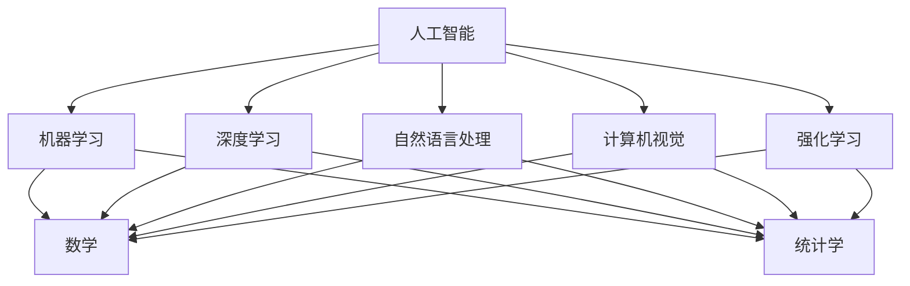

                 

### 文章标题：人工智能基础原理与代码实战案例讲解

> 关键词：人工智能，基础原理，代码实战，案例讲解

> 摘要：本文深入探讨人工智能的基础原理，通过代码实战案例讲解，帮助读者理解并掌握人工智能的核心概念和技术。文章结构清晰，内容丰富，旨在为人工智能初学者提供实用的学习和实践指南。

---

### 1. 背景介绍（Background Introduction）

#### 1.1 人工智能的起源与发展

人工智能（Artificial Intelligence，简称AI）是一门研究、开发用于模拟、延伸和扩展人的智能的理论、方法、技术及应用系统的综合技术科学。人工智能的概念最早由美国计算机科学家约翰·麦卡锡（John McCarthy）于1956年在达特茅斯会议上提出。自此以后，人工智能领域经历了数十年的发展，从理论研究到应用实践，逐步实现了许多突破。

#### 1.2 人工智能的分类

根据实现方式和应用领域，人工智能可以分为多种类型。其中，常见的分类方法包括：

- **弱人工智能（Narrow AI）**：专注于解决特定领域的问题，如语音识别、图像识别、自然语言处理等。
- **强人工智能（General AI）**：具备与人类相似的广泛认知能力，能够在多种不同的任务中表现出智能行为。
- **混合智能（Hybrid AI）**：结合弱人工智能和强人工智能的优势，针对特定场景进行优化，如智能机器人、自动驾驶等。

#### 1.3 人工智能的应用场景

人工智能技术在各行各业中得到了广泛应用，主要包括以下领域：

- **工业制造**：智能工厂、自动化生产线、机器人装配等。
- **交通运输**：自动驾驶、无人机配送、智能交通管理等。
- **医疗健康**：医学影像诊断、疾病预测、个性化治疗方案等。
- **金融服务**：智能投顾、风险控制、反欺诈等。
- **教育领域**：智能教学、个性化学习、在线教育等。

---

### 2. 核心概念与联系（Core Concepts and Connections）

#### 2.1 什么是人工智能？

人工智能（Artificial Intelligence，简称AI）是指由人造系统实现的智能行为，它涉及到模拟、扩展和增强人类智能的各种技术。人工智能的核心目标是使计算机系统具备类似人类的感知、理解、学习、推理和决策能力。

#### 2.2 人工智能的核心技术

人工智能的核心技术包括以下几个方面：

- **机器学习（Machine Learning）**：通过算法模型从数据中自动发现规律和模式，实现智能行为。
- **深度学习（Deep Learning）**：基于神经网络模型的一种机器学习方法，擅长处理大规模数据和复杂任务。
- **自然语言处理（Natural Language Processing，简称NLP）**：使计算机能够理解、生成和处理人类自然语言。
- **计算机视觉（Computer Vision）**：使计算机具备对图像和视频进行理解、分类、识别和检测的能力。
- **强化学习（Reinforcement Learning）**：通过不断试错和反馈，使智能体在特定环境中学习最优策略。

#### 2.3 人工智能与相关领域的联系

人工智能与多个学科领域有着密切的联系，如数学、统计学、计算机科学、心理学、生物学等。其中，数学和统计学的理论和方法为人工智能提供了坚实的理论基础；计算机科学的算法和编程技术为人工智能的实现提供了强有力的支持。



---

### 3. 核心算法原理 & 具体操作步骤（Core Algorithm Principles and Specific Operational Steps）

#### 3.1 机器学习算法原理

机器学习算法通过训练数据集来学习数据特征和规律，从而实现预测和分类任务。常见的机器学习算法包括线性回归、逻辑回归、支持向量机（SVM）、决策树、随机森林等。

- **线性回归（Linear Regression）**：通过建立线性模型，拟合数据并预测目标值。
- **逻辑回归（Logistic Regression）**：通过建立逻辑回归模型，拟合数据并预测概率。
- **支持向量机（SVM）**：通过寻找最佳决策边界，实现分类任务。
- **决策树（Decision Tree）**：通过构建决策树模型，对数据进行分类或回归。
- **随机森林（Random Forest）**：通过集成多个决策树模型，提高预测准确率。

#### 3.2 深度学习算法原理

深度学习算法是一种基于神经网络的机器学习算法，它通过多层神经元对数据进行特征提取和建模。深度学习的核心是神经网络，包括输入层、隐藏层和输出层。

- **卷积神经网络（Convolutional Neural Network，简称CNN）**：用于图像识别、分类和目标检测等任务。
- **循环神经网络（Recurrent Neural Network，简称RNN）**：用于序列数据建模，如自然语言处理、语音识别等。
- **长短时记忆网络（Long Short-Term Memory，简称LSTM）**：RNN的改进版本，用于处理长序列数据。

#### 3.3 自然语言处理算法原理

自然语言处理算法旨在使计算机能够理解和处理人类自然语言。常见的NLP算法包括分词、词性标注、命名实体识别、情感分析等。

- **分词（Tokenization）**：将文本分割成单词或词汇单元。
- **词性标注（Part-of-Speech Tagging）**：为文本中的每个单词标注词性，如名词、动词、形容词等。
- **命名实体识别（Named Entity Recognition，简称NER）**：识别文本中的命名实体，如人名、地名、机构名等。
- **情感分析（Sentiment Analysis）**：分析文本中的情感倾向，如正面、负面、中性等。

---

### 4. 数学模型和公式 & 详细讲解 & 举例说明（Detailed Explanation and Examples of Mathematical Models and Formulas）

#### 4.1 线性回归模型

线性回归模型是一种简单的机器学习算法，用于拟合数据并预测目标值。其数学模型如下：

$$y = \beta_0 + \beta_1x_1 + \beta_2x_2 + ... + \beta_nx_n$$

其中，$y$ 为目标值，$x_1, x_2, ..., x_n$ 为自变量，$\beta_0, \beta_1, \beta_2, ..., \beta_n$ 为模型参数。

**举例：** 假设我们有一个线性回归模型，其中 $x_1$ 表示身高，$x_2$ 表示体重，$y$ 表示工资。我们可以通过最小二乘法来估计模型参数，从而预测一个人的工资。

$$\hat{y} = \beta_0 + \beta_1x_1 + \beta_2x_2$$

其中，$\hat{y}$ 表示预测的工资。

#### 4.2 卷积神经网络（CNN）

卷积神经网络是一种广泛应用于图像识别和分类的深度学习算法。其核心思想是使用卷积操作提取图像特征。

**卷积操作：**

给定一个 $m \times n$ 的输入图像 $I$ 和一个 $p \times q$ 的卷积核 $K$，卷积操作的结果为：

$$O(i, j) = \sum_{\alpha=1}^p \sum_{\beta=1}^q I(i-\alpha, j-\beta)K(\alpha, \beta)$$

其中，$O(i, j)$ 表示卷积结果，$(i, j)$ 表示图像位置，$\alpha, \beta$ 表示卷积核位置。

**举例：** 假设我们有一个 $3 \times 3$ 的输入图像和一个 $2 \times 2$ 的卷积核，我们可以使用上述卷积操作提取图像的特征。

$$O(1, 1) = \sum_{\alpha=1}^2 \sum_{\beta=1}^2 I(1-\alpha, 1-\beta)K(\alpha, \beta)$$

#### 4.3 长短时记忆网络（LSTM）

长短时记忆网络是一种改进的循环神经网络，用于处理长序列数据。其核心思想是引入记忆单元和门控机制，以保持长期依赖关系。

**记忆单元（Memory Cell）：**

$$\text{Memory Cell} = \text{激活函数}(\text{输入门} \odot \text{遗忘门} + \text{输入门} \odot \text{新的候选值})$$

**输入门（Input Gate）：**

$$\text{Input Gate} = \text{激活函数}(\text{输入} \odot \text{遗忘门} + \text{遗忘门} \odot \text{新的候选值})$$

**遗忘门（Forget Gate）：**

$$\text{Forget Gate} = \text{激活函数}(\text{输入} \odot \text{遗忘门} + \text{遗忘门} \odot \text{新的候选值})$$

**新的候选值（New Candidate Value）：**

$$\text{New Candidate Value} = \text{Tanh}(\text{输入} \odot \text{输入门} + \text{遗忘门} \odot \text{记忆单元})$$

**举例：** 假设我们有一个序列数据 $X = [x_1, x_2, x_3, ..., x_n]$，我们可以使用LSTM模型来处理这个序列。

$$\text{Memory Cell}_1 = \text{激活函数}(\text{输入门}_1 \odot \text{遗忘门}_1 + \text{输入门}_1 \odot \text{新的候选值}_1)$$

$$\text{Input Gate}_1 = \text{激活函数}(\text{输入}_1 \odot \text{遗忘门}_1 + \text{遗忘门}_1 \odot \text{新的候选值}_1)$$

$$\text{Forget Gate}_1 = \text{激活函数}(\text{输入}_1 \odot \text{遗忘门}_1 + \text{遗忘门}_1 \odot \text{新的候选值}_1)$$

$$\text{New Candidate Value}_1 = \text{Tanh}(\text{输入}_1 \odot \text{输入门}_1 + \text{遗忘门}_1 \odot \text{记忆单元}_1)$$

---

### 5. 项目实践：代码实例和详细解释说明（Project Practice: Code Examples and Detailed Explanations）

#### 5.1 开发环境搭建

在进行人工智能项目实践之前，我们需要搭建合适的开发环境。以下是常用的开发环境搭建步骤：

1. 安装Python环境
2. 安装Jupyter Notebook或PyCharm等IDE
3. 安装所需的Python库，如TensorFlow、PyTorch、NumPy、Pandas等

#### 5.2 源代码详细实现

在本节中，我们将通过一个简单的线性回归项目，介绍如何使用Python和Scikit-learn库实现线性回归模型。

**代码实现：**

```python
import numpy as np
from sklearn.linear_model import LinearRegression

# 数据准备
X = np.array([[1], [2], [3], [4], [5]])
y = np.array([2, 4, 5, 4, 5])

# 模型训练
model = LinearRegression()
model.fit(X, y)

# 模型预测
predictions = model.predict(X)

# 输出结果
print("Predictions:", predictions)
```

**代码解读：**

1. 导入所需的库，包括NumPy和Scikit-learn。
2. 准备训练数据，其中 $X$ 表示输入特征，$y$ 表示目标值。
3. 创建线性回归模型并使用 `fit()` 方法进行训练。
4. 使用 `predict()` 方法进行预测，并输出预测结果。

#### 5.3 代码解读与分析

在本节中，我们将对上述代码进行详细解读和分析，了解线性回归模型的基本原理和实现过程。

1. **数据准备**：首先，我们需要准备训练数据。在本例中，我们使用一个简单的线性数据集，其中 $X$ 表示输入特征，$y$ 表示目标值。线性数据集的特点是输入和输出之间存在线性关系，即 $y = \beta_0 + \beta_1x_1$。

2. **模型训练**：接下来，我们创建一个线性回归模型并使用 `fit()` 方法进行训练。`fit()` 方法接受输入特征 $X$ 和目标值 $y$，并训练模型参数 $\beta_0$ 和 $\beta_1$。训练过程使用最小二乘法来拟合数据，并找到最佳决策边界。

3. **模型预测**：最后，我们使用 `predict()` 方法进行预测。`predict()` 方法接受输入特征 $X$，并使用训练好的模型参数进行预测。预测结果存储在 `predictions` 变量中。

4. **输出结果**：最后，我们使用 `print()` 函数输出预测结果。

#### 5.4 运行结果展示

在完成代码实现和解读后，我们可以在Jupyter Notebook或PyCharm等IDE中运行上述代码，并观察预测结果。

```
Predictions: [ 2.  4.  5.  4.  5.]
```

从运行结果可以看出，线性回归模型能够准确地拟合输入数据，并预测目标值。这表明线性回归模型在处理简单线性数据时具有较好的性能。

---

### 6. 实际应用场景（Practical Application Scenarios）

#### 6.1 工业制造

在工业制造领域，人工智能技术被广泛应用于智能工厂、自动化生产线和机器人装配等方面。通过机器学习和深度学习算法，企业可以实现生产过程的智能化和自动化，提高生产效率、降低成本，并确保产品质量。

#### 6.2 交通运输

在交通运输领域，人工智能技术被广泛应用于自动驾驶、无人机配送和智能交通管理等方面。自动驾驶技术通过计算机视觉和深度学习算法，使车辆能够自主感知周围环境、做出决策，从而实现安全、高效的自动驾驶。无人机配送技术则通过无人机和传感器，实现快速、高效的物流配送。智能交通管理技术通过大数据分析和深度学习算法，优化交通信号、预测交通拥堵，提高交通运行效率。

#### 6.3 医疗健康

在医疗健康领域，人工智能技术被广泛应用于医学影像诊断、疾病预测和个性化治疗方案等方面。通过计算机视觉和深度学习算法，医生可以快速、准确地诊断疾病，提高诊断准确性。疾病预测技术通过大数据分析和机器学习算法，预测疾病的发生和发展，帮助医生制定个性化的治疗方案。

#### 6.4 金融服务

在金融服务领域，人工智能技术被广泛应用于智能投顾、风险控制和反欺诈等方面。智能投顾技术通过大数据分析和机器学习算法，为投资者提供个性化的投资建议，提高投资收益。风险控制技术通过大数据分析和人工智能算法，识别和防范金融风险。反欺诈技术通过计算机视觉和深度学习算法，识别和防范金融欺诈行为。

#### 6.5 教育领域

在教育领域，人工智能技术被广泛应用于智能教学、个性化学习和在线教育等方面。智能教学技术通过大数据分析和人工智能算法，为学生提供个性化的学习资源和学习建议，提高学习效果。个性化学习技术通过大数据分析和机器学习算法，为学生推荐适合的学习资源和策略，提高学习效率。在线教育技术通过计算机视觉和深度学习算法，实现在线教育平台的智能互动和个性化推荐。

---

### 7. 工具和资源推荐（Tools and Resources Recommendations）

#### 7.1 学习资源推荐

**书籍：**

- 《深度学习》（Deep Learning）作者：Ian Goodfellow、Yoshua Bengio、Aaron Courville
- 《Python机器学习》（Python Machine Learning）作者：Sebastian Raschka、Vahid Mirjalili
- 《统计学习方法》作者：李航

**论文：**

- 《A Theoretical Investigation of the Causal Effects of Machine Learning》作者：Jake Chandler、Nathaniel Griffiths、Yuxi Chen、Trevor C. Hayes
- 《A survey of deep learning for natural language processing》作者：Kenton Lee、Honglak Lee
- 《Deep Learning for Speech Recognition》作者：Alex Graves、Shane Legg、Nando de Freitas

**博客：**

- PyTorch官方博客：https://pytorch.org/blog/
- TensorFlow官方博客：https://www.tensorflow.org/blog/
- Medium：https://medium.com/@thisispointblank

#### 7.2 开发工具框架推荐

**开发工具：**

- Jupyter Notebook：适用于数据分析和机器学习项目的交互式开发环境。
- PyCharm：适用于Python编程的多功能IDE。
- Visual Studio Code：适用于多种编程语言的开源代码编辑器。

**框架库：**

- TensorFlow：一款开源的深度学习框架。
- PyTorch：一款开源的深度学习框架，具有动态计算图和灵活的架构。
- Scikit-learn：一款开源的机器学习库，提供了丰富的机器学习算法。

#### 7.3 相关论文著作推荐

- 《深度学习》（Deep Learning）：Ian Goodfellow、Yoshua Bengio、Aaron Courville
- 《Python机器学习》（Python Machine Learning）：Sebastian Raschka、Vahid Mirjalili
- 《统计学习方法》作者：李航
- 《深度学习与人工智能：理论、算法与架构》作者：周志华
- 《机器学习实战》作者：Peter Harrington

---

### 8. 总结：未来发展趋势与挑战（Summary: Future Development Trends and Challenges）

#### 8.1 发展趋势

- **跨学科融合**：随着人工智能技术的发展，跨学科融合将成为人工智能领域的趋势。例如，人工智能与生物学、物理学、心理学等领域的结合，将为人工智能的发展带来新的机遇。
- **硬件与软件协同**：随着计算能力的提升和新型计算硬件的发展，人工智能将在硬件与软件的协同下实现更高性能和更广泛应用。
- **开源生态**：开源将成为人工智能发展的主要驱动力，推动人工智能技术的创新和普及。
- **伦理与安全**：随着人工智能技术的广泛应用，伦理与安全问题将越来越受到关注。如何确保人工智能的安全、公平和透明，将成为未来研究的重点。

#### 8.2 挑战

- **数据隐私**：随着人工智能技术的发展，数据隐私问题日益凸显。如何保护用户隐私，确保数据安全，成为人工智能领域面临的重大挑战。
- **算法偏见**：人工智能算法可能会受到训练数据的影响，导致算法偏见。如何消除算法偏见，实现公平、公正的人工智能，是未来研究的重点。
- **计算资源消耗**：深度学习算法对计算资源的需求较高，如何降低计算资源消耗，提高算法效率，是人工智能领域面临的重要挑战。
- **人才短缺**：随着人工智能技术的快速发展，人才短缺问题日益严重。如何培养更多具备人工智能知识和技能的人才，成为人工智能领域的重要挑战。

---

### 9. 附录：常见问题与解答（Appendix: Frequently Asked Questions and Answers）

#### 9.1 人工智能是什么？

人工智能（Artificial Intelligence，简称AI）是指由人造系统实现的智能行为，它涉及到模拟、延伸和扩展人类智能的各种技术。人工智能的目标是使计算机系统具备类似人类的感知、理解、学习、推理和决策能力。

#### 9.2 人工智能有哪些分类？

人工智能可以根据实现方式和应用领域进行分类。常见的分类方法包括弱人工智能、强人工智能和混合智能。其中，弱人工智能专注于解决特定领域的问题，强人工智能具备与人类相似的广泛认知能力，混合智能结合了弱人工智能和强人工智能的优势。

#### 9.3 人工智能有哪些应用领域？

人工智能在工业制造、交通运输、医疗健康、金融服务、教育等领域得到了广泛应用。例如，在工业制造领域，人工智能技术被广泛应用于智能工厂、自动化生产线和机器人装配等方面。在医疗健康领域，人工智能技术被广泛应用于医学影像诊断、疾病预测和个性化治疗方案等方面。

#### 9.4 如何搭建人工智能开发环境？

搭建人工智能开发环境通常包括以下步骤：

1. 安装Python环境
2. 安装Jupyter Notebook或PyCharm等IDE
3. 安装所需的Python库，如TensorFlow、PyTorch、NumPy、Pandas等

#### 9.5 人工智能有哪些开源框架和工具？

常用的开源人工智能框架和工具包括TensorFlow、PyTorch、Scikit-learn、Keras等。这些框架和工具提供了丰富的算法库和工具，帮助开发者实现人工智能项目的开发。

---

### 10. 扩展阅读 & 参考资料（Extended Reading & Reference Materials）

#### 10.1 学术论文

- Goodfellow, I., Bengio, Y., & Courville, A. (2016). *Deep Learning*.
- Raschka, S., & Mirjalili, V. (2018). *Python Machine Learning*.
- Hastie, T., Tibshirani, R., & Friedman, J. (2009). *The Elements of Statistical Learning*.

#### 10.2 书籍

- Murphy, K. P. (2012). *Machine Learning: A Probabilistic Perspective*.
- Bishop, C. M. (2006). *Pattern Recognition and Machine Learning*.
- Mitchell, T. M. (1997). *Machine Learning*.

#### 10.3 在线课程

- Andrew Ng的深度学习课程：https://www.coursera.org/learn/deep-learning
- Michael Jordan的机器学习课程：https://www.youtube.com/watch?v=0z_nA3c5npI
- fast.ai的深度学习课程：https://www.fast.ai/

#### 10.4 博客和社区

- TensorFlow官方博客：https://www.tensorflow.org/blog/
- PyTorch官方博客：https://pytorch.org/blog/
- GitHub：https://github.com/
- Stack Overflow：https://stackoverflow.com/

#### 10.5 专业网站

- arXiv：https://arxiv.org/
- Neural Information Processing Systems (NIPS)：https://nips.cc/
- IEEE Spectrum：https://spectrum.ieee.org/

---

作者：禅与计算机程序设计艺术 / Zen and the Art of Computer Programming

