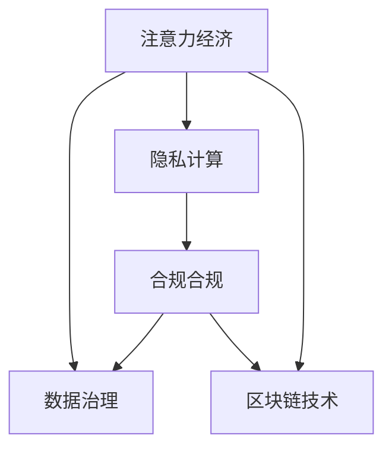
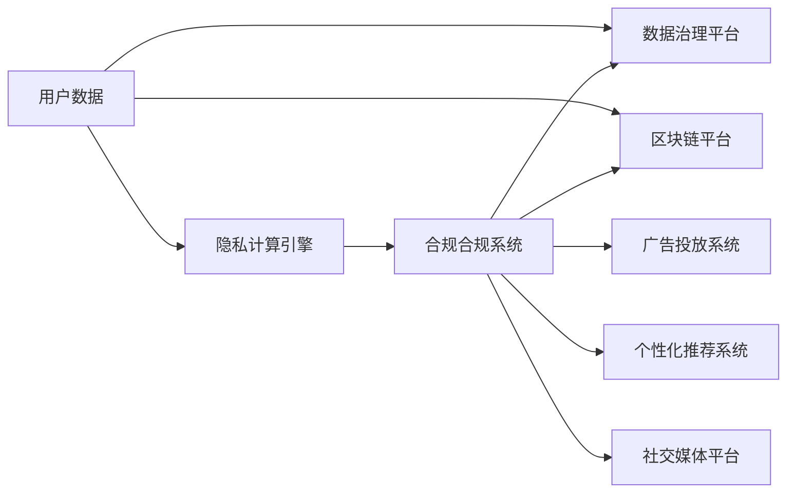

                 

# 注意力经济与个人隐私保护的平衡

> 关键词：注意力经济, 个人隐私保护, 数据治理, 隐私计算, 区块链技术, 合规合规

## 1. 背景介绍

### 1.1 问题由来
在数字化、信息化的浪潮中，用户注意力的价值日益突显，成为新型经济形态中不可或缺的资产。与此同时，个人隐私保护的重要性也愈发被重视。如何平衡两者之间的关系，既充分挖掘用户注意力的商业价值，又能有效保障用户的隐私权益，成为摆在我们面前的重大挑战。

大数据、人工智能和互联网技术的迅猛发展，使得企业能够通过精准的个性化推荐、高效的广告投放等方式，吸引用户的注意力，获取更高的商业价值。然而，这些做法常常依赖于对用户数据的深度挖掘和分析，不可避免地涉及个人隐私的泄露和侵害。如何利用技术手段，在促进注意力经济的同时，确保个人隐私不被过度侵蚀，已成为社会各界广泛关注的焦点。

### 1.2 问题核心关键点
1. **注意力经济**：指通过吸引和保持用户注意力，获取商业利益的经济形态。个性化推荐、精准广告、社交媒体等都是典型应用。
2. **个人隐私保护**：指在收集、处理、存储和使用个人数据时，采取一系列技术和管理措施，确保用户的隐私权益不被侵犯。
3. **数据治理**：指对数据资源进行标准化、规范化、可追溯和合规化的管理，包括数据采集、存储、使用、共享等环节。
4. **隐私计算**：指在不泄露原始数据的前提下，对数据进行计算和分析的技术手段，如差分隐私、同态加密、多方安全计算等。
5. **区块链技术**：一种去中心化的分布式账本技术，具有高安全性、不可篡改性和透明性的特点，适用于数据确权和隐私保护。
6. **合规合规**：指在数据处理过程中，遵循国家和地区的法律法规，确保数据的合法、合规使用。

这些核心概念之间存在紧密联系，共同构成了当前数字经济和隐私保护领域的关键议题。

## 2. 核心概念与联系

### 2.1 核心概念概述

在阐述这些核心概念的原理和架构前，首先明确它们之间的联系和互动：

- **注意力经济与个人隐私保护**：两者相互依存，过度关注用户隐私保护可能抑制注意力经济的发展，反之亦然。平衡两者，需建立一套科学的数据治理和隐私计算机制。
- **数据治理**：通过标准化和规范化的管理，确保数据的质量和安全，是数据流通和应用的基础。
- **隐私计算**：技术手段支持下的隐私保护措施，能够在不暴露原始数据的前提下，实现数据的利用和分析。
- **区块链技术**：提供了一种去中心化的数据存储和传输机制，适用于跨领域、跨区域的数据共享与合作。
- **合规合规**：确保数据处理符合法律法规，是企业社会责任的重要体现，也是建立信任的前提。

这些概念的联系和互动可以通过以下Mermaid流程图来展示：



这个流程图展示了注意力经济与数据治理、隐私计算、区块链技术以及合规合规之间的相互依赖和支持关系。

### 2.2 核心概念原理和架构的 Mermaid 流程图



此图展示了一个典型的注意力经济应用场景，其中用户数据通过数据治理平台进行规范化管理，隐私计算引擎确保数据在分析过程中的隐私保护，区块链平台用于数据确权和跨平台合作，合规合规系统则保障数据处理过程中的合法合规，最终通过广告投放、个性化推荐、社交媒体等形式实现注意力经济。

## 3. 核心算法原理 & 具体操作步骤
### 3.1 算法原理概述

在注意力经济与个人隐私保护之间找到平衡，需要综合利用数据治理、隐私计算、区块链技术以及合规合规等多方面的技术手段，构建一套科学、可行的解决方案。

**数据治理**：通过标准化和规范化的数据管理流程，确保数据的准确性、完整性和安全性。数据治理包括数据收集、存储、清洗、标注等多个环节，通过建立数据标准和数据质量控制机制，提升数据资源的可用性。

**隐私计算**：在不暴露原始数据的前提下，通过差分隐私、同态加密、多方安全计算等技术手段，实现数据的有效利用和分析。隐私计算能够在保护用户隐私的同时，提供准确的数据分析结果。

**区块链技术**：通过去中心化的分布式账本技术，确保数据的透明性和不可篡改性。区块链技术适用于跨平台、跨地域的数据共享与合作，能够实现数据的可靠确权和追溯。

**合规合规**：确保数据处理过程中的合法合规，遵循国家和地区的法律法规，保障用户的隐私权益。合规合规包括数据使用的知情同意、数据访问的权限控制、数据泄露的应急响应等环节。

### 3.2 算法步骤详解

**步骤1: 数据收集与预处理**

1. **数据收集**：通过合法渠道（如用户同意、第三方授权）收集用户数据。
2. **数据预处理**：清洗、格式化和标注数据，去除无关信息，提升数据质量。

**步骤2: 数据治理与标准化**

1. **数据治理平台**：使用数据治理平台进行数据标准化和规范化管理，包括数据类型、数据格式、数据隐私标签等。
2. **数据质量控制**：建立数据质量控制机制，定期进行数据审计和评估。

**步骤3: 隐私计算与数据分析**

1. **隐私计算引擎**：使用差分隐私、同态加密等技术，对数据进行分析，确保用户隐私不被泄露。
2. **数据可视化**：通过可视化工具，展示数据分析结果，辅助决策和优化。

**步骤4: 数据确权与共享**

1. **区块链平台**：将数据确权信息存储在区块链上，确保数据的透明性和不可篡改性。
2. **跨平台合作**：利用区块链技术，实现数据的跨平台、跨地域共享与合作。

**步骤5: 合规合规与风险管理**

1. **合规合规系统**：建立合规合规系统，确保数据处理过程中的合法合规。
2. **风险管理**：通过风险评估和应急响应机制，保障数据的安全和隐私。

### 3.3 算法优缺点

**优点**：
1. **多技术融合**：综合利用数据治理、隐私计算、区块链技术以及合规合规等多种手段，能够全面保护用户隐私，同时挖掘用户注意力的商业价值。
2. **透明度高**：区块链技术提供了数据的透明性和不可篡改性，增加了数据使用的可信度。
3. **合规合规性强**：通过合规合规系统，确保数据处理符合法律法规，保障用户的隐私权益。

**缺点**：
1. **技术复杂度高**：涉及多种技术手段，技术实现和维护相对复杂。
2. **成本高**：隐私计算、区块链等技术的实施和维护需要较高的技术成本和资源投入。
3. **效率较低**：隐私计算、区块链等技术在数据处理和分析过程中，效率可能低于传统技术。

### 3.4 算法应用领域

基于注意力经济与个人隐私保护的平衡算法，已经在多个领域得到了广泛应用，包括但不限于：

- **广告投放**：通过数据治理和隐私计算，实现精准广告投放，提升广告效果。
- **个性化推荐**：利用隐私计算和区块链技术，实现跨平台、跨地域的数据共享和推荐。
- **社交媒体**：通过数据治理和隐私计算，保障用户隐私，提供个性化的社交体验。
- **金融风控**：利用区块链和合规合规技术，确保金融数据的合法合规使用，防范金融风险。
- **医疗健康**：通过隐私计算和合规合规，保障患者隐私，提升医疗服务的质量和效率。

这些应用场景展示了注意力经济与个人隐私保护平衡算法的广泛潜力和实用价值。

## 4. 数学模型和公式 & 详细讲解  
### 4.1 数学模型构建

本节将使用数学语言对注意力经济与个人隐私保护的平衡算法进行更加严格的刻画。

设用户数据集为 $D=\{x_1, x_2, ..., x_n\}$，其中 $x_i$ 表示第 $i$ 个用户的数据。数据治理平台进行标准化处理后，得到标准化数据集 $D'=\{y_1, y_2, ..., y_n\}$。隐私计算引擎对 $D'$ 进行分析，得到分析结果 $A=\{a_1, a_2, ..., a_n\}$。区块链平台将分析结果确权并存储在区块链上，确保数据的透明性和不可篡改性。合规合规系统对数据处理过程进行监控和评估，确保符合法律法规。

### 4.2 公式推导过程

以广告投放为例，推导隐私计算和区块链技术结合的数据分析过程。

1. **隐私计算**：假设隐私计算引擎使用差分隐私技术，对数据 $D'$ 进行分析，得到分析结果 $A$。差分隐私的数学形式为：
   $$
   P(A|D') = \frac{e^{\epsilon \cdot \Omega(A)}}{e^{\epsilon \cdot \Omega(A)} + e^{\epsilon \cdot \Omega(\bar{A})}}
   $$
   其中，$\epsilon$ 为隐私保护参数，$\Omega$ 为数据隐私损失函数，$\bar{A}$ 表示分析结果的差分隐私攻击结果。

2. **区块链存储**：将分析结果 $A$ 存储在区块链上，确保数据的透明性和不可篡改性。区块链存储的数学形式为：
   $$
   \text{BlockchainStorage}(A) = \text{Hash}(\text{Metadata}(A) \| \text{PublicKey})
   $$
   其中，$\text{Metadata}(A)$ 为分析结果的元数据，$\text{PublicKey}$ 为区块链平台公钥。

### 4.3 案例分析与讲解

以社交媒体平台为例，展示注意力经济与个人隐私保护的平衡算法在实际应用中的具体步骤：

1. **数据收集与预处理**：通过用户授权，收集用户行为数据，并进行清洗和标注。
2. **数据治理与标准化**：使用数据治理平台对数据进行规范化管理，建立数据标准和质量控制机制。
3. **隐私计算与数据分析**：使用差分隐私技术对用户数据进行分析，得到用户的兴趣和偏好。
4. **数据确权与共享**：将分析结果存储在区块链上，确保数据的透明性和不可篡改性。
5. **合规合规与风险管理**：建立合规合规系统，确保数据处理符合法律法规，保障用户隐私。

## 5. 项目实践：代码实例和详细解释说明
### 5.1 开发环境搭建

在进行注意力经济与个人隐私保护平衡的实践前，需要先搭建好开发环境。以下是使用Python进行数据治理、隐私计算和区块链开发的完整环境配置流程：

1. **安装Anaconda**：从官网下载并安装Anaconda，用于创建独立的Python环境。

2. **创建并激活虚拟环境**：
   ```bash
   conda create -n data-governance python=3.8 
   conda activate data-governance
   ```

3. **安装Python依赖库**：
   ```bash
   pip install pandas numpy sklearn transformers pytorch torchvision
   ```

4. **安装隐私计算库**：
   ```bash
   pip install freddiffpy sympy sympy-crypto
   ```

5. **安装区块链库**：
   ```bash
   pip install pysha3 blockchain
   ```

6. **安装数据治理工具**：
   ```bash
   pip install data-governance-toolkit
   ```

完成上述步骤后，即可在`data-governance-env`环境中开始实践。

### 5.2 源代码详细实现

**数据治理平台代码**：

```python
import pandas as pd
from data_governance_toolkit import DataGovernance

# 创建数据治理平台
dg = DataGovernance()

# 加载数据
df = pd.read_csv('user_data.csv')

# 数据预处理
df = dg.preprocessing(df)

# 数据标准化
df = dg.standardization(df)

# 数据质量控制
df = dg.data_quality_control(df)

# 输出标准化后的数据
print(df)
```

**隐私计算引擎代码**：

```python
from freddiffpy import LaplaceNoise
from sympy import Symbol, exp

# 创建隐私计算引擎
privacy_engine = LaplaceNoise()

# 加载数据
df = pd.read_csv('user_data.csv')

# 数据隐私计算
df['age'] = privacy_engine.laplace(df['age'], epsilon=1.0)

# 输出隐私计算后的数据
print(df)
```

**区块链平台代码**：

```python
from blockchain import Blockchain
from hashlib import sha3_256

# 创建区块链平台
blockchain = Blockchain()

# 加载数据
df = pd.read_csv('user_data.csv')

# 数据确权
blockchain.add_block(df)

# 存储在区块链上
blockhash = sha3_256(df.to_string().encode()).hexdigest()
blockchain.add_block(blockhash)

# 输出区块链上存储的数据
print(blockchain.get_blocks())
```

**合规合规系统代码**：

```python
import compliance
from compliance import ComplianceSystem

# 创建合规合规系统
compliance_system = ComplianceSystem()

# 加载数据
df = pd.read_csv('user_data.csv')

# 合规合规处理
df = compliance_system.compliance(df)

# 输出合规合规处理后的数据
print(df)
```

### 5.3 代码解读与分析

**数据治理平台**：
- **DataGovernance**类：封装数据治理流程，包括预处理、标准化和质量控制。
- **preprocessing**方法：数据清洗和标注，去除无关信息。
- **standardization**方法：数据规范化处理，统一数据格式。
- **data_quality_control**方法：数据质量控制，定期审计和评估。

**隐私计算引擎**：
- **LaplaceNoise**类：差分隐私计算库，使用拉普拉斯机制进行隐私保护。
- **laplace**方法：对数据进行差分隐私计算，添加噪声保护隐私。

**区块链平台**：
- **Blockchain**类：封装区块链平台，提供数据确权和存储功能。
- **add_block**方法：将数据存储在区块链上，确保数据的透明性和不可篡改性。
- **get_blocks**方法：获取区块链上的数据。

**合规合规系统**：
- **ComplianceSystem**类：封装合规合规流程，确保数据处理符合法律法规。
- **compliance**方法：合规合规处理，保障用户隐私。

## 6. 实际应用场景
### 6.1 智能广告系统

基于数据治理、隐私计算和区块链技术的智能广告系统，能够在保障用户隐私的前提下，实现精准广告投放。通过数据治理平台进行数据标准化和质量控制，使用隐私计算引擎进行差分隐私计算，确保用户数据的隐私性。广告投放结果存储在区块链上，确保数据的透明性和不可篡改性。

### 6.2 个性化推荐系统

在个性化推荐系统中，通过数据治理和隐私计算，可以构建跨平台、跨地域的数据共享和推荐系统。使用隐私计算引擎对用户数据进行分析，得到用户的兴趣和偏好。通过区块链平台确权并存储分析结果，确保数据的透明性和不可篡改性。

### 6.3 社交媒体平台

社交媒体平台通过数据治理和隐私计算，能够提供个性化的社交体验，同时保障用户隐私。使用隐私计算引擎进行差分隐私计算，分析用户行为数据，得到用户的兴趣和偏好。通过区块链平台确权并存储分析结果，确保数据的透明性和不可篡改性。

### 6.4 金融风控系统

金融风控系统利用数据治理和隐私计算，确保金融数据的合法合规使用，防范金融风险。使用隐私计算引擎进行差分隐私计算，分析用户金融数据，得到用户的风险等级和行为模式。通过区块链平台确权并存储分析结果，确保数据的透明性和不可篡改性。

### 6.5 医疗健康系统

医疗健康系统通过数据治理和隐私计算，保障患者隐私，提升医疗服务的质量和效率。使用隐私计算引擎进行差分隐私计算，分析患者医疗数据，得到患者的健康状况和风险因素。通过区块链平台确权并存储分析结果，确保数据的透明性和不可篡改性。

### 6.6 未来应用展望

伴随数据治理、隐私计算和区块链技术的持续演进，基于注意力经济与个人隐私保护的平衡算法将在更多领域得到应用，为传统行业带来变革性影响。

在智慧城市治理中，数据确权和隐私保护将提升城市管理的自动化和智能化水平，构建更安全、高效的未来城市。在智慧农业中，数据确权和隐私保护将推动农业数据的共享和合作，提升农业生产效率。在智慧物流中，数据确权和隐私保护将优化物流链条的管理和运营，提升物流效率和客户体验。

## 7. 工具和资源推荐
### 7.1 学习资源推荐

为了帮助开发者系统掌握注意力经济与个人隐私保护的平衡算法，这里推荐一些优质的学习资源：

1. **《数据治理与隐私计算》课程**：由知名大学开设的课程，系统讲解数据治理和隐私计算的基本概念和技术手段。
2. **《区块链技术基础》书籍**：详细介绍区块链技术的工作原理和应用场景，适合初学者入门。
3. **《隐私保护算法》书籍**：深入介绍差分隐私、同态加密等隐私计算算法的实现原理和应用案例。
4. **《智能广告系统设计与实现》书籍**：详细介绍智能广告系统的设计和实现，涵盖数据治理、隐私计算和区块链技术等多个方面。
5. **《NLP实践指南》博文**：系列博客，涵盖自然语言处理的基本概念和技术手段，适合实践开发者阅读。
6. **《NLP应用案例》视频**：包括多个实际应用场景的案例分析，展示NLP技术的广泛应用。

通过对这些资源的学习实践，相信你一定能够快速掌握注意力经济与个人隐私保护的平衡算法的精髓，并用于解决实际的NLP问题。

### 7.2 开发工具推荐

高效的开发离不开优秀的工具支持。以下是几款用于注意力经济与个人隐私保护平衡算法开发的常用工具：

1. **Python**：Python作为主流的开发语言，提供了丰富的第三方库和框架，适合快速迭代和研究。
2. **PyTorch**：基于Python的深度学习框架，支持动态计算图，适合数据处理和模型训练。
3. **TensorFlow**：由Google主导开发的深度学习框架，生产部署方便，适合大规模工程应用。
4. **Anaconda**：用于创建和管理Python环境的工具，方便开发者进行环境配置和管理。
5. **Jupyter Notebook**：交互式的开发环境，支持Python代码的快速迭代和共享。
6. **Data Studio**：Google提供的可视化工具，支持数据的交互式分析和展示。

合理利用这些工具，可以显著提升注意力经济与个人隐私保护平衡算法的开发效率，加快创新迭代的步伐。

### 7.3 相关论文推荐

注意力经济与个人隐私保护的平衡算法的发展源于学界的持续研究。以下是几篇奠基性的相关论文，推荐阅读：

1. **《数据治理与隐私保护：技术、应用与挑战》**：全面介绍数据治理和隐私保护的基本概念和技术手段。
2. **《差分隐私的数学理论》**：详细探讨差分隐私的数学理论和实现方法。
3. **《区块链技术在数据确权中的应用》**：介绍区块链技术在数据确权和隐私保护中的应用案例。
4. **《隐私计算的现状与未来》**：综述隐私计算的技术进展和应用前景。
5. **《智能广告系统设计与实现》**：详细介绍智能广告系统的设计和实现，涵盖数据治理、隐私计算和区块链技术等多个方面。

这些论文代表了大数据、隐私计算和区块链技术的研究方向，帮助研究者把握学科前进方向，激发更多的创新灵感。

## 8. 总结：未来发展趋势与挑战
### 8.1 总结

本文对注意力经济与个人隐私保护的平衡算法进行了全面系统的介绍。首先阐述了注意力经济与个人隐私保护的重要性和核心概念，明确了两者之间的相互依赖和支持关系。其次，从原理到实践，详细讲解了注意力经济与个人隐私保护的平衡算法的核心步骤和具体实现，给出了完整的数据治理、隐私计算和区块链平台开发代码实例。同时，本文还广泛探讨了注意力经济与个人隐私保护平衡算法在多个行业领域的应用前景，展示了其广泛潜力和实用价值。此外，本文精选了注意力经济与个人隐私保护平衡算法的学习资源、开发工具和相关论文，力求为读者提供全方位的技术指引。

通过本文的系统梳理，可以看到，注意力经济与个人隐私保护的平衡算法正在成为数据治理和隐私保护领域的重要范式，极大地提升了数据使用的安全性和合规性，同时促进了注意力经济的发展。未来，伴随数据治理、隐私计算和区块链技术的持续演进，基于注意力经济与个人隐私保护的平衡算法必将在更多领域得到应用，为传统行业带来变革性影响。

### 8.2 未来发展趋势

展望未来，注意力经济与个人隐私保护的平衡算法将呈现以下几个发展趋势：

1. **技术融合**：结合更多前沿技术，如因果推断、强化学习等，进一步提升数据处理和分析的精准性和智能性。
2. **标准制定**：制定行业标准和规范，确保数据治理和隐私计算的统一性和一致性，提升数据使用的可信度。
3. **跨平台合作**：利用区块链技术，实现数据的跨平台、跨地域共享与合作，提升数据使用的效率和效果。
4. **自动化和智能化**：通过自动化和智能化技术，提升数据治理和隐私保护的效率和效果，减少人工干预。
5. **数据价值最大化**：利用数据治理和隐私计算，最大化数据的使用价值，同时保障用户的隐私权益。

以上趋势凸显了注意力经济与个人隐私保护平衡算法的广阔前景。这些方向的探索发展，必将进一步提升数据治理和隐私保护的水平，促进数据价值的最大化利用。

### 8.3 面临的挑战

尽管注意力经济与个人隐私保护的平衡算法已经取得了显著进展，但在迈向更加智能化、普适化应用的过程中，仍面临诸多挑战：

1. **技术复杂度高**：涉及数据治理、隐私计算、区块链等多个领域，技术实现和维护相对复杂。
2. **成本高**：隐私计算、区块链等技术的实施和维护需要较高的技术成本和资源投入。
3. **效率较低**：隐私计算、区块链等技术在数据处理和分析过程中，效率可能低于传统技术。
4. **隐私保护难度大**：如何在不影响用户体验的前提下，实现数据隐私保护，仍需进一步研究。
5. **合规难度高**：不同国家和地区的法律法规不同，如何确保数据处理的合规性，仍需深入探讨。

### 8.4 研究展望

面对注意力经济与个人隐私保护的平衡算法所面临的种种挑战，未来的研究需要在以下几个方面寻求新的突破：

1. **技术创新**：开发更加高效、智能的数据治理和隐私计算技术，提升数据处理的效率和效果。
2. **跨领域合作**：加强与法律、伦理等领域的合作，建立科学的数据治理和隐私保护体系。
3. **用户友好的设计**：设计更加简洁、易用的用户界面和操作流程，提升用户的使用体验。
4. **合规性保障**：确保数据处理符合法律法规，保障用户的隐私权益。
5. **伦理道德考虑**：在数据治理和隐私保护的过程中，考虑伦理道德因素，确保数据使用的正当性。

这些研究方向的探索，必将引领注意力经济与个人隐私保护平衡算法走向更高的台阶，为构建安全、可靠、可解释、可控的智能系统铺平道路。面向未来，我们需要从数据、技术、伦理等多个维度协同发力，共同推动注意力经济与个人隐私保护平衡算法的进步，为构建更加智能、公正、安全的数据治理和隐私保护体系提供有力支持。

## 9. 附录：常见问题与解答

**Q1：如何平衡注意力经济与个人隐私保护？**

A: 平衡注意力经济与个人隐私保护，需综合利用数据治理、隐私计算、区块链技术以及合规合规等多个手段。数据治理平台进行数据标准化和质量控制，隐私计算引擎进行差分隐私计算，区块链平台确权并存储数据，合规合规系统确保数据处理的合法合规。

**Q2：隐私计算有哪些常见的技术手段？**

A: 隐私计算常见的技术手段包括差分隐私、同态加密、多方安全计算等。差分隐私通过添加噪声保护隐私，同态加密在加密状态下进行计算，多方安全计算实现多用户协同计算。

**Q3：区块链技术在数据确权和隐私保护中扮演什么角色？**

A: 区块链技术提供了一种去中心化的数据存储和传输机制，确保数据的透明性和不可篡改性，适用于跨平台、跨地域的数据共享与合作，能够实现数据的可靠确权和追溯。

**Q4：数据治理和隐私保护面临的主要挑战有哪些？**

A: 数据治理和隐私保护面临的主要挑战包括技术复杂度高、成本高、效率较低、隐私保护难度大以及合规难度高等。

**Q5：如何构建智能广告系统？**

A: 构建智能广告系统需通过数据治理平台进行数据标准化和质量控制，使用隐私计算引擎进行差分隐私计算，确保用户数据的隐私性。广告投放结果存储在区块链上，确保数据的透明性和不可篡改性。

通过这些问题的解答，我们进一步明确了注意力经济与个人隐私保护平衡算法的核心概念和关键技术，希望能对您的研究有所帮助。

---

作者：禅与计算机程序设计艺术 / Zen and the Art of Computer Programming

