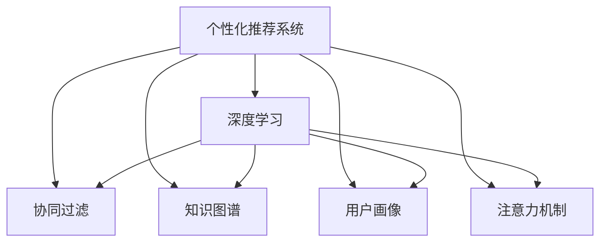

                 

# 注意力经济与个性化推荐算法：为受众提供定制、有针对性的内容

> 关键词：注意力经济, 个性化推荐算法, 深度学习, 协同过滤, 知识图谱, 用户画像, 推荐系统, 用户体验

## 1. 背景介绍

在数字化时代，信息爆炸和注意力稀缺并存，注意力成为了一种稀缺的资源。如何高效地吸引和利用用户注意力，成为了企业核心竞争力的关键。个性化推荐系统应运而生，通过精准分析用户行为和兴趣，为用户提供定制化的内容推荐，提升用户体验，增强用户粘性，促进消费转化。个性化推荐系统已经成为各大互联网平台标配，广泛应用于电商、视频、社交网络等诸多场景，显著提高了业务效率和用户满意度。

### 1.1 问题由来

个性化推荐系统的核心目标是为用户推荐其感兴趣的内容，提升用户体验和平台满意度。然而，随着用户数量的激增和数据维度的复杂化，如何高效、准确地进行个性化推荐，成为了一大难题。传统推荐系统普遍存在冷启动问题、数据稀疏问题、推荐结果多样性不足等瓶颈。

### 1.2 问题核心关键点

为了解决这些问题，现代推荐系统引入了深度学习、协同过滤、知识图谱等技术，提升推荐的精度和多样性。其中，深度学习技术利用神经网络对用户行为进行建模，协同过滤技术通过挖掘用户之间的隐式关系，知识图谱技术通过将现实世界的知识结构化，优化推荐过程。

本文将从理论到实践，系统介绍基于深度学习的个性化推荐算法，并结合真实案例，展示其如何在注意力经济下为受众提供定制、有针对性的内容。

## 2. 核心概念与联系

### 2.1 核心概念概述

为更好地理解个性化推荐系统的构建，本节将介绍几个密切相关的核心概念：

- **个性化推荐系统**：基于用户的历史行为、兴趣偏好等数据，自动推荐用户可能感兴趣的内容的系统。
- **深度学习**：利用神经网络结构对数据进行建模，提取数据高层次特征，进行分类、回归、聚类等任务。
- **协同过滤**：通过挖掘用户之间的隐式关系，推测用户偏好，推荐相似用户的推荐结果。
- **知识图谱**：将现实世界的知识结构化，构建多关系图谱，提升推荐模型的泛化能力。
- **用户画像**：基于用户的历史行为和属性，构建用户概览，刻画用户特征。
- **注意力机制**：通过对输入信息加权，提升模型对重要信息的关注度，增强推荐效果。

这些核心概念之间的逻辑关系可以通过以下Mermaid流程图来展示：



这个流程图展示了几类个性化推荐方法的核心概念及其之间的关系：

1. 个性化推荐系统通过深度学习、协同过滤、知识图谱、用户画像、注意力机制等多种技术，进行多维度建模，提升推荐效果。
2. 深度学习利用神经网络提取数据特征，用于推荐模型的训练和预测。
3. 协同过滤通过用户行为相似性进行推荐，有效处理数据稀疏性问题。
4. 知识图谱融合现实世界的知识结构，提升推荐模型的泛化能力。
5. 用户画像通过综合分析用户属性和行为，构建用户概览，刻画用户特征。
6. 注意力机制对输入信息加权，提升模型对重要信息的关注度。

这些概念共同构成了个性化推荐系统的技术框架，为其提供了强大的技术支撑。

## 3. 核心算法原理 & 具体操作步骤
### 3.1 算法原理概述

基于深度学习的个性化推荐算法，利用神经网络对用户行为进行建模，提取高层次特征，用于推荐模型的训练和预测。其中，常用的深度学习框架包括卷积神经网络(CNN)、循环神经网络(RNN)、长短时记忆网络(LSTM)、自编码器(AE)、变分自编码器(VAE)、图神经网络(GNN)等。这些框架通过提取用户行为中的隐含信息，生成更精确、多样化的推荐结果。

形式化地，假设用户行为数据为 $X$，推荐系统为 $M_{\theta}$，其中 $\theta$ 为模型参数。推荐目标为最大化用户的满意度，记为 $Y$。推荐过程的目标是最小化预测误差：

$$
\theta^* = \mathop{\arg\min}_{\theta} \sum_{i=1}^{N} (Y_i - M_{\theta}(X_i))^2
$$

其中 $N$ 为用户总数。

### 3.2 算法步骤详解

基于深度学习的个性化推荐算法一般包括以下几个关键步骤：

**Step 1: 数据预处理**
- 收集用户行为数据，如浏览记录、点击记录、购买记录等。
- 对数据进行清洗、去噪、归一化等处理，形成输入向量 $X$。

**Step 2: 模型选择与训练**
- 选择合适的深度学习模型框架，如CNN、RNN、LSTM等。
- 使用用户行为数据 $X$ 进行模型训练，优化模型参数 $\theta$，得到推荐模型 $M_{\theta}$。

**Step 3: 特征提取与模型预测**
- 使用训练好的模型 $M_{\theta}$，对用户行为数据 $X$ 进行特征提取，生成推荐特征向量 $X'$。
- 将推荐特征向量 $X'$ 输入推荐模型 $M_{\theta}$，得到推荐结果 $Y'$。

**Step 4: 推荐结果排序与展示**
- 根据推荐结果 $Y'$ 进行排序，选择排名靠前的推荐内容展示给用户。

**Step 5: 反馈与迭代**
- 收集用户对推荐内容的反馈，如点击、购买、评分等，更新推荐模型 $M_{\theta}$ 的参数。
- 使用新一轮的用户行为数据重新训练推荐模型 $M_{\theta}$，迭代更新推荐结果。

### 3.3 算法优缺点

基于深度学习的个性化推荐算法具有以下优点：
1. 精度高。利用神经网络对用户行为进行建模，能够提取高层次的特征，提升推荐精度。
2. 适应性强。深度学习模型具有较强的泛化能力，能够在不同数据集和场景下进行迁移学习。
3. 数据处理能力强。深度学习模型能够处理大规模、高维度的数据，适用于多源异构数据的融合。

同时，该算法也存在以下缺点：
1. 计算资源消耗大。深度学习模型参数量较大，训练和推理过程消耗大量计算资源。
2. 对标注数据依赖高。深度学习模型通常需要大量的标注数据进行训练，数据标注成本高。
3. 可解释性差。深度学习模型内部的决策过程不透明，难以解释和调试。

尽管存在这些局限性，但就目前而言，基于深度学习的个性化推荐算法仍是推荐系统的主流范式。未来相关研究的方向在于如何进一步降低对标注数据的依赖，提高模型的可解释性和计算效率。

### 3.4 算法应用领域

基于深度学习的个性化推荐算法在电商、视频、社交网络等诸多领域得到广泛应用，具体包括：

- **电商推荐**：推荐用户可能感兴趣的商品，提升销售转化率。
- **视频推荐**：推荐用户可能喜欢的视频内容，提高观看时间。
- **社交网络**：推荐用户可能感兴趣的朋友和内容，增强用户粘性。

除了这些常见场景外，深度学习推荐系统还被应用于智能广告投放、内容聚合、智能客服等领域，推动了各行业数字化转型的进程。

## 4. 数学模型和公式 & 详细讲解  
### 4.1 数学模型构建

本节将使用数学语言对基于深度学习的个性化推荐过程进行更加严格的刻画。

记用户行为数据为 $X = [x_1, x_2, ..., x_N]$，推荐系统为 $M_{\theta}$，其中 $x_i$ 为第 $i$ 个用户的推荐特征向量，$\theta$ 为模型参数。推荐目标为最大化用户的满意度 $Y = [y_1, y_2, ..., y_N]$，其中 $y_i$ 为用户对推荐内容 $x_i$ 的满意度。

定义推荐模型 $M_{\theta}$ 在用户行为数据 $X$ 上的损失函数为：

$$
\mathcal{L}(\theta) = \sum_{i=1}^{N} (y_i - M_{\theta}(x_i))^2
$$

推荐过程的目标是最小化损失函数：

$$
\theta^* = \mathop{\arg\min}_{\theta} \mathcal{L}(\theta)
$$

在实践中，我们通常使用基于梯度的优化算法（如Adam、SGD等）来近似求解上述最优化问题。设 $\eta$ 为学习率，$\lambda$ 为正则化系数，则参数的更新公式为：

$$
\theta \leftarrow \theta - \eta \nabla_{\theta}\mathcal{L}(\theta) - \eta\lambda\theta
$$

其中 $\nabla_{\theta}\mathcal{L}(\theta)$ 为损失函数对参数 $\theta$ 的梯度，可通过反向传播算法高效计算。

### 4.2 公式推导过程

以下我们以视频推荐任务为例，推导卷积神经网络(CNN)模型在推荐系统中的应用。

假设视频数据为 $x_i = [x_{i1}, x_{i2}, ..., x_{iT}]$，其中 $x_{it}$ 为第 $i$ 个用户在第 $t$ 个时刻的观看行为特征向量。推荐系统为卷积神经网络 $M_{\theta}$，其中 $\theta$ 为模型参数。定义推荐模型 $M_{\theta}$ 在视频数据 $x_i$ 上的输出为 $\hat{y}_i$，表示用户对视频内容 $x_i$ 的满意度。则卷积神经网络模型的推荐损失函数定义为：

$$
\mathcal{L}(\theta) = -\frac{1}{N}\sum_{i=1}^{N} y_i\log \hat{y}_i
$$

将其代入经验风险公式，得：

$$
\mathcal{L}(\theta) = -\frac{1}{N}\sum_{i=1}^{N} y_i\log \hat{y}_i
$$

根据链式法则，损失函数对参数 $\theta_k$ 的梯度为：

$$
\frac{\partial \mathcal{L}(\theta)}{\partial \theta_k} = \sum_{i=1}^{N} \frac{\partial \hat{y}_i}{\partial \theta_k} \frac{\partial (\log \hat{y}_i)}{\partial \hat{y}_i}
$$

其中 $\frac{\partial \hat{y}_i}{\partial \theta_k}$ 为模型输出 $\hat{y}_i$ 对参数 $\theta_k$ 的偏导数，$\frac{\partial (\log \hat{y}_i)}{\partial \hat{y}_i}$ 为对数函数对输出 $\hat{y}_i$ 的偏导数。

在得到损失函数的梯度后，即可带入参数更新公式，完成模型的迭代优化。重复上述过程直至收敛，最终得到适应视频推荐任务的最优模型参数 $\theta^*$。

## 5. 项目实践：代码实例和详细解释说明
### 5.1 开发环境搭建

在进行深度学习推荐系统开发前，我们需要准备好开发环境。以下是使用Python进行TensorFlow开发的环境配置流程：

1. 安装Anaconda：从官网下载并安装Anaconda，用于创建独立的Python环境。

2. 创建并激活虚拟环境：
```bash
conda create -n tf-env python=3.8 
conda activate tf-env
```

3. 安装TensorFlow：根据CUDA版本，从官网获取对应的安装命令。例如：
```bash
conda install tensorflow=2.7
```

4. 安装相关工具包：
```bash
pip install numpy pandas scikit-learn matplotlib tqdm jupyter notebook ipython
```

完成上述步骤后，即可在`tf-env`环境中开始推荐系统开发。

### 5.2 源代码详细实现

下面我们以视频推荐任务为例，给出使用TensorFlow实现卷积神经网络推荐系统的代码实现。

首先，定义视频数据的处理函数：

```python
import tensorflow as tf
import numpy as np

def preprocess_video_data(video_data):
    # 将视频数据转换为推荐特征向量
    features = []
    for video in video_data:
        features.append([tf.abs(video - np.mean(video)), np.std(video)])
    return np.array(features)
```

然后，定义卷积神经网络模型：

```python
model = tf.keras.Sequential([
    tf.keras.layers.Dense(64, activation='relu', input_shape=(2,)),
    tf.keras.layers.Dense(32, activation='relu'),
    tf.keras.layers.Dense(1, activation='sigmoid')
])
```

接着，定义优化器和学习率：

```python
optimizer = tf.keras.optimizers.Adam(learning_rate=0.001)
```

最后，定义训练和评估函数：

```python
def train_model(model, video_data, labels, epochs):
    # 数据预处理
    features = preprocess_video_data(video_data)
    # 训练模型
    model.compile(optimizer=optimizer, loss='binary_crossentropy', metrics=['accuracy'])
    model.fit(features, labels, epochs=epochs, validation_split=0.2)
    # 评估模型
    test_features = preprocess_video_data(test_data)
    test_labels = labels
    model.evaluate(test_features, test_labels, verbose=0)

# 假设训练数据和标签已经加载完成
train_data = ...
train_labels = ...
test_data = ...
test_labels = ...
epochs = 10
train_model(model, train_data, train_labels, epochs)
```

以上就是使用TensorFlow实现卷积神经网络推荐系统的完整代码实现。可以看到，TensorFlow提供了强大的深度学习框架，使得模型训练和推理变得高效便捷。

### 5.3 代码解读与分析

让我们再详细解读一下关键代码的实现细节：

**preprocess_video_data函数**：
- 将视频数据转换为推荐特征向量，计算每个时刻与平均值的绝对差和标准差，形成二维特征向量。

**模型定义**：
- 使用Sequential模型搭建卷积神经网络，依次添加全连接层和输出层，分别使用ReLU和Sigmoid激活函数。

**优化器和损失函数定义**：
- 使用Adam优化器，设置学习率为0.001。
- 使用二分类交叉熵损失函数，用于预测用户满意度的二分类问题。

**模型训练和评估**：
- 使用模型编译方法指定优化器和损失函数，并进行训练。
- 训练过程中使用数据集进行划分，分为训练集和验证集。
- 在训练完成后，使用测试集进行模型评估，输出准确率指标。

可以看到，TensorFlow提供了丰富的API接口和自动微分功能，使得模型训练和推理过程简洁高效。开发者可以专注于模型设计和高层次逻辑，而无需过多关注底层实现细节。

## 6. 实际应用场景
### 6.1 智能广告投放

基于深度学习的个性化推荐系统，可以广泛应用于智能广告投放领域。传统广告投放方式往往存在精准度低、成本高、效果差等问题。通过深度学习推荐系统，可以为广告主精准推荐目标用户，显著提高广告的转化率和投放效果。

在技术实现上，可以收集广告主的历史投放数据，广告与用户的互动记录等，将用户行为数据作为输入，广告点击率、转化率等指标作为监督信号，在此基础上对推荐模型进行微调。微调后的推荐模型能够识别用户的广告偏好，匹配最合适的广告内容，显著提升广告的精准度和投放效果。

### 6.2 内容聚合平台

内容聚合平台如今日头条、搜狐新闻等，旨在为用户提供海量、多样化的内容推荐。通过个性化推荐系统，平台能够根据用户的浏览历史、点击记录、阅读时长等行为，自动生成个性化的新闻、视频、文章等内容推荐，提升用户体验和平台粘性。

在推荐过程中，平台可以使用深度学习模型对用户行为进行建模，结合知识图谱技术，整合外部知识库的信息，进一步提升推荐精度。此外，平台还可以引入对抗训练、数据增强等技术，增强推荐模型的鲁棒性和泛化能力。

### 6.3 智能客服系统

智能客服系统是现代企业的重要应用之一，能够显著提升客户服务质量和效率。通过个性化推荐系统，系统可以基于用户的历史行为、对话内容等信息，自动推荐最合适的回答模板，辅助客服人员快速响应客户需求。

在推荐过程中，系统可以使用协同过滤技术，利用用户间的隐式关系，推荐相似用户的历史问答记录。同时，系统还可以引入自然语言处理技术，解析用户意图，生成最匹配的回答。

### 6.4 未来应用展望

随着深度学习推荐系统的不断发展，其在各行各业的应用将不断拓展，带来更广泛的影响。

在智慧医疗领域，基于推荐系统的医疗咨询、药品推荐、手术建议等应用，将提升医疗服务的智能化水平，辅助医生诊疗，加速新药研发进程。

在智能教育领域，推荐系统可应用于个性化作业批改、学习路径推荐、知识图谱构建等方面，因材施教，促进教育公平，提高教学质量。

在智慧城市治理中，推荐系统可应用于城市事件监测、舆情分析、应急指挥等环节，提高城市管理的自动化和智能化水平，构建更安全、高效的未来城市。

此外，在企业生产、社会治理、文娱传媒等众多领域，基于深度学习的个性化推荐系统也将不断涌现，为各行各业带来变革性影响。

## 7. 工具和资源推荐
### 7.1 学习资源推荐

为了帮助开发者系统掌握深度学习推荐技术的理论基础和实践技巧，这里推荐一些优质的学习资源：

1. 《深度学习推荐系统：原理与实践》系列博文：由大模型技术专家撰写，深入浅出地介绍了推荐系统的基本原理和前沿技术。

2. Coursera《深度学习与推荐系统》课程：由斯坦福大学教授开设，详细讲解了推荐系统的基本概念和经典算法。

3. 《Recommender Systems: Algorithms, Techniques and Applications》书籍：由Recommender Systems领域的权威专家编写，全面介绍了推荐系统的各种技术和应用。

4. PyTorch官方文档：PyTorch提供了丰富的API接口和自动微分功能，是深度学习推荐系统的首选框架。

5. Weights & Biases：模型训练的实验跟踪工具，可以记录和可视化模型训练过程中的各项指标，方便对比和调优。

6. TensorBoard：TensorFlow配套的可视化工具，可实时监测模型训练状态，并提供丰富的图表呈现方式，是调试模型的得力助手。

通过对这些资源的学习实践，相信你一定能够快速掌握深度学习推荐技术的精髓，并用于解决实际的推荐问题。

### 7.2 开发工具推荐

高效的开发离不开优秀的工具支持。以下是几款用于深度学习推荐系统开发的常用工具：

1. PyTorch：基于Python的开源深度学习框架，灵活动态的计算图，适合快速迭代研究。

2. TensorFlow：由Google主导开发的开源深度学习框架，生产部署方便，适合大规模工程应用。

3. Scikit-learn：Python中的机器学习库，提供丰富的算法和工具，适用于多源异构数据的融合。

4. Keras：高层次的深度学习API，易于使用，适合快速原型开发。

5. FastAI：基于PyTorch的深度学习库，提供了预训练模型和可视化工具，适用于快速开发推荐系统。

6. Jupyter Notebook：交互式编程环境，支持代码、文本、数学公式的混合编辑，方便模型开发和调试。

合理利用这些工具，可以显著提升深度学习推荐系统的开发效率，加快创新迭代的步伐。

### 7.3 相关论文推荐

深度学习推荐系统的研究源于学界的持续研究。以下是几篇奠基性的相关论文，推荐阅读：

1. Deep Networks for Recommendations：提出基于深度学习的推荐模型，利用神经网络对用户行为进行建模。

2. collaborative filtering for implicit feedback datasets：介绍了协同过滤技术的基本原理和应用场景。

3. Deep Knowledge Tracing：结合知识图谱和深度学习，提升推荐系统的知识推荐能力。

4. Recommender Systems in Scientific Collaboration：利用深度学习推荐系统，为科研人员提供文献推荐。

5. Recommender Systems in Telecommunications：利用深度学习推荐系统，为电信运营商提供用户推荐服务。

这些论文代表了大数据推荐系统的发展脉络。通过学习这些前沿成果，可以帮助研究者把握学科前进方向，激发更多的创新灵感。

## 8. 总结：未来发展趋势与挑战

### 8.1 总结

本文对基于深度学习的个性化推荐系统进行了全面系统的介绍。首先阐述了个性化推荐系统的背景和意义，明确了推荐系统在提升用户体验和平台满意度方面的独特价值。其次，从原理到实践，详细讲解了深度学习推荐算法的数学模型和操作步骤，给出了推荐系统开发的完整代码实例。同时，本文还广泛探讨了推荐系统在智能广告投放、内容聚合平台、智能客服系统等诸多领域的应用前景，展示了深度学习推荐技术的巨大潜力。此外，本文精选了推荐系统的各类学习资源，力求为读者提供全方位的技术指引。

通过本文的系统梳理，可以看到，基于深度学习的个性化推荐系统已经成为现代推荐系统的重要范式，极大地提升了推荐精度和用户体验。未来，伴随深度学习推荐技术的不断演进，推荐系统必将在更多领域得到应用，为各行各业带来变革性影响。

### 8.2 未来发展趋势

展望未来，深度学习推荐系统将呈现以下几个发展趋势：

1. 多模态融合：推荐系统将融合文本、图像、音频、视频等多种模态的数据，提升推荐模型的感知能力和泛化能力。

2. 自适应推荐：推荐系统将根据用户行为和环境变化，动态调整推荐策略，提升推荐的个性化和实时性。

3. 对抗性推荐：推荐系统将引入对抗性训练，提升模型的鲁棒性和泛化能力，抵御对抗样本攻击。

4. 分布式推荐：推荐系统将采用分布式计算技术，提升模型的训练和推理效率，支持大规模用户数据的处理。

5. 联邦推荐：推荐系统将引入联邦学习技术，保护用户隐私的同时，进行分布式模型训练和优化。

以上趋势凸显了深度学习推荐系统的发展方向，这些方向的探索发展，必将进一步提升推荐系统的性能和应用范围，为各行各业带来更大的经济效益和社会价值。

### 8.3 面临的挑战

尽管深度学习推荐系统已经取得了显著进展，但在迈向更加智能化、普适化应用的过程中，它仍面临着诸多挑战：

1. 数据冷启动问题：对于新用户和新物品，推荐系统缺乏历史行为数据，难以进行有效的推荐。

2. 数据稀疏性问题：用户和物品之间的交互数据通常较少，导致推荐模型难以进行精确预测。

3. 数据隐私保护：在推荐过程中，如何保护用户隐私，防止用户数据泄露，是一大挑战。

4. 模型可解释性：深度学习模型通常难以解释其内部决策过程，用户难以理解推荐系统的决策逻辑。

5. 计算资源消耗：深度学习推荐模型参数量大，计算资源消耗大，需要高效的计算平台支持。

这些挑战需要学术界和工业界共同努力，不断探索和突破，才能实现推荐系统的智能化和普及化。

### 8.4 研究展望

面对推荐系统面临的挑战，未来的研究需要在以下几个方面寻求新的突破：

1. 探索无监督和半监督推荐方法。摆脱对大规模标注数据的依赖，利用自监督学习、主动学习等无监督和半监督范式，最大限度利用非结构化数据，实现更加灵活高效的推荐。

2. 研究参数高效和计算高效的推荐范式。开发更加参数高效的推荐方法，在固定大部分预训练参数的同时，只更新极少量的推荐特征参数。同时优化推荐模型的计算图，减少前向传播和反向传播的资源消耗，实现更加轻量级、实时性的部署。

3. 引入更多先验知识。将符号化的先验知识，如知识图谱、逻辑规则等，与推荐模型进行巧妙融合，引导推荐过程学习更准确、合理的用户行为模型。

4. 融合因果分析和博弈论工具。将因果分析方法引入推荐模型，识别出模型决策的关键特征，增强推荐结果的因果性和逻辑性。借助博弈论工具刻画人机交互过程，主动探索并规避模型的脆弱点，提高系统稳定性。

5. 纳入伦理道德约束。在推荐目标中引入伦理导向的评估指标，过滤和惩罚有偏见、有害的输出倾向。同时加强人工干预和审核，建立推荐行为的监管机制，确保推荐系统的公平性和合法性。

这些研究方向的探索，必将引领深度学习推荐系统迈向更高的台阶，为构建安全、可靠、可解释、可控的智能系统铺平道路。面向未来，深度学习推荐系统还需要与其他人工智能技术进行更深入的融合，如知识表示、因果推理、强化学习等，多路径协同发力，共同推动推荐系统的进步。只有勇于创新、敢于突破，才能不断拓展推荐系统的边界，让智能技术更好地造福人类社会。

## 9. 附录：常见问题与解答

**Q1：深度学习推荐系统是否适用于所有推荐场景？**

A: 深度学习推荐系统在大多数推荐场景上都能取得不错的效果，特别是对于数据量较大的场景。但对于一些特定领域的推荐场景，如社交网络、广告投放等，深度学习推荐系统可能需要结合其他推荐技术，如协同过滤、矩阵分解等，进行多模态融合，才能取得更好的推荐效果。

**Q2：推荐系统如何应对数据冷启动问题？**

A: 推荐系统通常采用多种方法应对数据冷启动问题，如基于物品的推荐、基于内容的推荐、基于模型的推荐等。其中，基于模型的推荐方法可以利用协同过滤、知识图谱等技术，从用户的历史行为和外部知识中挖掘用户偏好，提升推荐效果。

**Q3：推荐系统如何提升推荐多样性？**

A: 推荐系统通常使用基于贪心策略的方法提升推荐多样性，如基于召回率的推荐、基于多样性的推荐等。同时，还可以通过引入对抗训练、数据增强等技术，扩大推荐结果的多样性，避免推荐结果的单一性。

**Q4：推荐系统如何保护用户隐私？**

A: 推荐系统通常使用匿名化、差分隐私等技术保护用户隐私。例如，在推荐过程中，只使用用户的特征数据，而非具体的行为数据，以保护用户隐私。同时，通过差分隐私技术，对推荐结果进行扰动，防止用户数据泄露。

**Q5：推荐系统如何提高推荐模型的可解释性？**

A: 推荐系统通常使用基于规则的方法提高推荐模型的可解释性。例如，在推荐过程中，通过引入用户反馈和人工干预，对推荐结果进行解释和修正，确保推荐过程的透明性和公平性。同时，通过知识图谱等技术，将推荐过程可视化，提升用户对推荐结果的理解和信任度。

这些回答可以帮助你更好地理解深度学习推荐系统的核心问题，并找到适合的解决方案。相信通过本文的系统梳理，你能够快速掌握深度学习推荐技术的精髓，并应用于实际的推荐系统开发中。

---

作者：禅与计算机程序设计艺术 / Zen and the Art of Computer Programming

