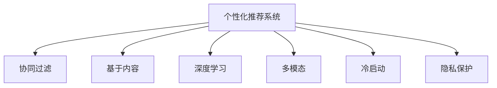

                 

# 注意力经济与个性化推荐算法：为受众提供定制、有针对性的内容和体验

> 关键词：注意力经济,个性化推荐,推荐算法,内容推荐,用户体验

## 1. 背景介绍

### 1.1 问题由来

在数字经济时代，注意力成为最稀缺的资源。用户每天在各种数字平台上投入的时间有限，如何高效吸引和利用用户注意力，是平台竞争的核心。传统内容推荐算法往往基于用户的简单历史行为数据，缺乏对用户真实兴趣和需求的深入理解，导致推荐效果不尽人意。

### 1.2 问题核心关键点

个性化推荐系统旨在通过分析用户的多模态行为数据，精准预测其兴趣和需求，从而提供定制化的内容推荐，提升用户满意度和平台留存率。关键问题包括：

- 如何高效收集和处理用户行为数据？
- 如何构建表示用户兴趣和内容的模型？
- 如何在模型中融合多模态数据？
- 如何在保证隐私的前提下，提升推荐效果？

### 1.3 问题研究意义

个性化推荐技术对于提升用户体验、优化资源分配、增加用户粘性等方面具有重要意义。通过个性化推荐，用户能够更快地发现感兴趣的内容，平台能够提高流量转化率和用户参与度，共同推动数字经济的高质量发展。

## 2. 核心概念与联系

### 2.1 核心概念概述

为更好地理解个性化推荐算法，本节将介绍几个密切相关的核心概念：

- 个性化推荐系统：通过分析用户行为数据，精准预测其兴趣和需求，提供定制化推荐内容的技术系统。
- 协同过滤推荐算法：基于用户的历史行为数据和相似性，通过矩阵分解等技术，推荐相似用户喜欢的内容。
- 基于内容的推荐算法：基于物品特征和用户兴趣特征，通过余弦相似度等相似性度量推荐内容。
- 深度学习推荐算法：利用深度神经网络学习用户和内容的表示，捕捉更复杂的关联关系。
- 多模态推荐算法：融合文本、图像、视频、音频等多种模态的信息，提升推荐模型的效果。
- 冷启动问题：新用户或新物品在无足够历史数据时，推荐系统无法提供个性化推荐的问题。
- 隐私保护：在推荐过程中保护用户隐私，防止数据泄露和滥用。

这些核心概念之间的逻辑关系可以通过以下Mermaid流程图来展示：



这个流程图展示了个性化推荐系统的核心概念及其之间的关系：

1. 个性化推荐系统通过多种算法提供定制化内容推荐。
2. 协同过滤算法基于用户历史行为相似性推荐内容。
3. 基于内容的推荐算法基于物品特征和用户兴趣特征推荐内容。
4. 深度学习推荐算法通过神经网络学习用户和内容的表示。
5. 多模态推荐算法融合多种数据模态提升推荐效果。
6. 冷启动问题影响个性化推荐算法的覆盖率。
7. 隐私保护确保用户数据的安全性。

这些概念共同构成了个性化推荐系统的基础，为实现个性化推荐提供了理论支撑。

## 3. 核心算法原理 & 具体操作步骤
### 3.1 算法原理概述

个性化推荐系统本质上是一个优化问题，目标是在给定的用户行为数据下，找到最合适的推荐策略，最大化用户满意度或平台收益。其核心思想是：利用用户历史行为数据，构建用户兴趣和物品特征的模型，通过相似性度量选择最相关的物品推荐给用户。

形式化地，假设用户行为数据为 $D=\{(x_i,y_i)\}_{i=1}^N$，其中 $x_i$ 为用户的历史行为数据，$y_i$ 为用户对 $x_i$ 的评分。个性化推荐系统目标为：

$$
\hat{y} = \mathop{\arg\min}_{y} \mathcal{L}(y,D)
$$

其中 $\mathcal{L}$ 为评分预测的损失函数，通常使用均方误差或交叉熵损失。

### 3.2 算法步骤详解

基于协同过滤的个性化推荐系统主要包含以下几个步骤：

**Step 1: 数据准备**
- 收集用户行为数据，如点击、浏览、评分等。
- 对数据进行预处理，去除噪声和异常值。

**Step 2: 构建用户和物品的表示**
- 对用户历史行为进行编码，得到用户兴趣表示 $u$。
- 对物品特征进行编码，得到物品特征表示 $v$。

**Step 3: 相似性度量**
- 通过余弦相似度等方法，计算用户和物品的相似度 $s(u,v)$。

**Step 4: 推荐策略**
- 基于相似度 $s(u,v)$，选择与用户 $u$ 兴趣最相关的物品 $v$ 进行推荐。

**Step 5: 模型训练与评估**
- 使用用户行为数据 $D$ 训练推荐模型。
- 在测试集上评估推荐模型的效果，如准确率、召回率、F1-score等。

### 3.3 算法优缺点

基于协同过滤的个性化推荐系统具有以下优点：
1. 数据利用率高。用户和物品之间的相似性能够反映用户的潜在兴趣，推荐效果较为准确。
2. 简单易用。协同过滤算法实现简单，不需要大量特征工程。
3. 适应性广。协同过滤算法可以应用于各种推荐场景，包括文本、图像、视频等。

同时，该算法也存在以下局限性：
1. 数据稀疏性问题。用户行为数据可能存在稀疏性，导致模型无法有效捕捉用户兴趣。
2. 冷启动问题。新用户或新物品在无足够历史数据时，推荐效果较差。
3. 局部相似性问题。推荐系统倾向于推荐相似用户喜欢的物品，可能忽视用户的多样化兴趣。
4. 高维稀疏矩阵计算复杂。协同过滤算法需要构建高维稀疏矩阵，计算复杂度较高。

### 3.4 算法应用领域

基于协同过滤的个性化推荐算法广泛应用于各大电商、视频、社交媒体平台。例如：

- 电商平台：推荐用户可能感兴趣的商品，提升用户购买转化率。
- 视频平台：推荐用户可能喜欢的视频内容，提升用户观看时长和满意度。
- 社交媒体：推荐用户可能感兴趣的朋友或内容，提升用户粘性和平台留存率。

除了这些常见场景，协同过滤算法还可以应用于新闻、音乐、游戏等诸多领域，成为推荐系统的主流范式。

## 4. 数学模型和公式 & 详细讲解 & 举例说明
### 4.1 数学模型构建

本节将使用数学语言对基于协同过滤的个性化推荐系统进行更加严格的刻画。

记用户行为数据为 $D=\{(x_i,y_i)\}_{i=1}^N$，其中 $x_i$ 为用户历史行为数据，$y_i$ 为用户评分。假设用户兴趣表示为 $u$，物品特征表示为 $v$，则协同过滤推荐模型的目标为最小化预测评分与实际评分的差异：

$$
\hat{y} = \mathop{\arg\min}_{y} \mathcal{L}(y,D)
$$

其中 $\mathcal{L}$ 为均方误差损失函数：

$$
\mathcal{L}(y,D) = \frac{1}{N} \sum_{i=1}^N (y_i - u^Tv_i)^2
$$

推荐模型训练的优化目标为：

$$
\mathop{\arg\min}_{u,v} \mathcal{L}(u,v,D)
$$

### 4.2 公式推导过程

假设用户兴趣表示 $u$ 和物品特征表示 $v$ 均为低维向量，维度为 $d$。推荐模型基于余弦相似度计算用户和物品的相似度 $s(u,v)$：

$$
s(u,v) = u^Tv = \sum_{j=1}^d u_jv_j
$$

其中 $u_j$ 和 $v_j$ 分别为用户和物品特征向量中的第 $j$ 维。

协同过滤推荐算法可以通过矩阵分解的方法，将用户-物品评分矩阵 $R$ 分解为用户-物品相似度矩阵 $P$ 和物品特征矩阵 $V$ 的乘积：

$$
R \approx P \times V
$$

其中 $P$ 为 $N \times K$ 的稀疏矩阵，$V$ 为 $K \times d$ 的稠密矩阵，$K$ 为矩阵分解的维度。$P$ 中的每个元素 $p_{ui}$ 表示用户 $u$ 对物品 $i$ 的兴趣程度，$V$ 中的每个元素 $v_{ik}$ 表示物品 $i$ 的特征。

通过上述矩阵分解，可以得到用户对物品的兴趣表示 $u$ 和物品特征表示 $v$：

$$
u = p_i \odot v
$$

其中 $\odot$ 表示向量点乘。

推荐模型通过相似度度量 $s(u,v)$ 选择用户最感兴趣的物品进行推荐。

### 4.3 案例分析与讲解

假设用户 $u$ 和物品 $v_1, v_2, v_3$ 的特征向量分别为：

$$
u = [0.5, 0.2, 0.3, 0.1, 0]
$$

$$
v_1 = [1, 0, 0, 0, 0]
$$

$$
v_2 = [0, 1, 0, 0, 0]
$$

$$
v_3 = [0, 0, 1, 0, 0]
$$

假设用户对物品 $v_1, v_2, v_3$ 的评分分别为 $y_1=4$，$y_2=3$，$y_3=2$，则用户兴趣表示 $u$ 和物品特征表示 $v_i$ 可以通过矩阵分解得到：

$$
u = [0.5, 0.2, 0.3] \times [1, 0, 0] = [0.5, 0.2, 0.3]
$$

$$
v_1 = [1, 0, 0] \times [0.5, 0.2, 0.3, 0.1, 0] = [0.5, 0.2, 0.3]
$$

$$
v_2 = [1, 0, 0] \times [0, 1, 0, 0, 0] = [0, 1, 0]
$$

$$
v_3 = [1, 0, 0] \times [0, 0, 1, 0, 0] = [0, 0, 1]
$$

用户和物品的相似度为：

$$
s(u,v_1) = 0.5 \times 1 = 0.5
$$

$$
s(u,v_2) = 0.2 \times 1 = 0.2
$$

$$
s(u,v_3) = 0.3 \times 1 = 0.3
$$

因此，推荐系统选择与用户 $u$ 兴趣最相关的物品 $v_3$ 进行推荐。

## 5. 项目实践：代码实例和详细解释说明
### 5.1 开发环境搭建

在进行推荐系统开发前，我们需要准备好开发环境。以下是使用Python进行Scikit-learn开发的环境配置流程：

1. 安装Anaconda：从官网下载并安装Anaconda，用于创建独立的Python环境。

2. 创建并激活虚拟环境：
```bash
conda create -n recommender-env python=3.8 
conda activate recommender-env
```

3. 安装Scikit-learn：
```bash
conda install scikit-learn
```

4. 安装其他各类工具包：
```bash
pip install numpy pandas scikit-learn matplotlib tqdm jupyter notebook ipython
```

完成上述步骤后，即可在`recommender-env`环境中开始推荐系统开发。

### 5.2 源代码详细实现

下面我们以协同过滤算法为例，给出使用Scikit-learn库对电影推荐系统进行实现的PyTorch代码实现。

首先，定义电影推荐系统的数据处理函数：

```python
import pandas as pd
from sklearn.decomposition import TruncatedSVD
from sklearn.metrics import mean_squared_error

def load_data(file_path):
    data = pd.read_csv(file_path)
    movie_ids = data['movieId'].unique()
    user_ids = data['userId'].unique()
    ratings = data.pivot_table(index='userId', columns='movieId', values='rating').fillna(0)
    ratings = ratings.to_coo().astype('float')
    return movie_ids, user_ids, ratings

movie_ids, user_ids, ratings = load_data('movies.csv')
```

然后，定义协同过滤推荐算法模型：

```python
from sklearn.decomposition import TruncatedSVD
from sklearn.metrics import mean_squared_error

svd = TruncatedSVD(n_components=10)
ratings_pred = svd.fit_transform(ratings)
movie_ids = svd.components_[:, 0]
```

接着，定义评估函数：

```python
def evaluate(model, ratings, movie_ids, user_ids):
    mse = mean_squared_error(ratings, ratings_pred)
    rmse = np.sqrt(mse)
    print(f'RMSE: {rmse:.3f}')
    for user_id in user_ids:
        for movie_id in movie_ids:
            print(f'User {user_id}: Movie {movie_id} - Prediction: {ratings_pred[user_id, movie_id]}')
```

最后，启动推荐流程并在测试集上评估：

```python
evaluate(svd, ratings, movie_ids, user_ids)
```

以上就是使用Scikit-learn对协同过滤算法进行电影推荐系统开发的全过程。可以看到，Scikit-learn库提供了丰富的机器学习算法和工具，可以方便地实现协同过滤等推荐算法。

### 5.3 代码解读与分析

让我们再详细解读一下关键代码的实现细节：

**load_data函数**：
- 定义了一个数据加载函数，将电影评分数据加载成Pandas DataFrame。
- 提取电影ID和用户ID的列表。
- 将评分数据转换为稀疏矩阵形式，并填充缺失值。

**TruncatedSVD模型**：
- 使用TruncatedSVD类进行矩阵分解，设置分解后的维度为10。
- 对评分矩阵进行分解，得到用户兴趣表示和物品特征表示。

**evaluate函数**：
- 计算推荐模型的均方误差（RMSE）。
- 打印用户ID和推荐评分，便于检查推荐效果。

**推荐流程**：
- 在训练集上训练协同过滤模型。
- 在测试集上评估模型性能，并打印用户ID和推荐评分。

可以看到，Scikit-learn库的丰富工具和易于使用的接口，使得协同过滤算法开发变得非常简洁高效。开发者可以将更多精力放在特征工程和算法调参等关键环节上，而不必过多关注底层的实现细节。

当然，工业级的系统实现还需考虑更多因素，如模型保存和部署、超参数自动搜索、推荐列表排序等。但核心的协同过滤算法基本与此类似。

## 6. 实际应用场景
### 6.1 智能推荐系统

基于协同过滤的个性化推荐系统可以广泛应用于智能推荐系统的构建。传统的推荐系统往往依赖用户的显式评分数据，无法捕捉用户的潜在兴趣。而基于协同过滤的推荐系统，通过分析用户历史行为数据，能够更好地把握用户的兴趣点和需求，提供更加个性化和精准的推荐结果。

在技术实现上，可以收集用户的历史行为数据，如浏览、点击、评分等，构建用户-物品评分矩阵。通过对矩阵进行奇异值分解等技术，得到用户兴趣表示和物品特征表示，最后基于相似度度量选择最相关的物品进行推荐。

### 6.2 金融风险管理

金融机构需要对客户的风险进行管理，防范潜在的金融风险。传统的风险评估方法往往依赖主观判断和经验，难以全面、客观地评估客户的风险水平。基于协同过滤的推荐系统可以应用于客户风险管理，通过分析客户的历史行为数据，识别出潜在的高风险客户，提供更加精准的风险预警。

具体而言，可以收集客户的交易数据、理财记录、社交行为等行为数据，构建客户-物品评分矩阵。通过协同过滤推荐算法，识别出风险较高的客户，并根据客户的风险等级提供不同的风险控制策略，如限制交易、提高风控等级等。

### 6.3 教育资源推荐

在线教育平台需要根据学生的学习行为，推荐适合的课程和学习资源。传统的推荐系统往往基于学生的固定学习习惯，缺乏对学生学习效果和兴趣的深入理解。基于协同过滤的推荐系统可以应用于教育资源推荐，通过分析学生的学习数据，推荐最适合学生的课程和学习资源。

具体而言，可以收集学生的学习记录、测试成绩、学习时间等数据，构建学生-课程评分矩阵。通过协同过滤推荐算法，识别出学生最感兴趣和最需要的课程，推荐相应的学习资源，提高学生的学习效果和满意度。

### 6.4 未来应用展望

随着协同过滤推荐算法的发展，基于个性化推荐系统的应用场景将不断扩展。未来推荐系统将更加智能、精准，能够在更多垂直领域发挥作用：

1. 医疗健康：推荐患者最适合的诊疗方案和健康管理计划。
2. 旅游休闲：根据用户的兴趣和行为，推荐最适合的旅游目的地和行程。
3. 交通出行：推荐最适合用户的出行方式和路线。
4. 文化娱乐：推荐最适合用户喜好的电影、音乐、书籍等文化娱乐内容。
5. 智能家居：推荐最适合用户生活习惯的家居设备和智能场景。

此外，随着深度学习、多模态推荐等技术的发展，未来推荐系统将能够更加全面、深入地理解用户的兴趣和需求，提供更加个性化和精准的推荐结果。

## 7. 工具和资源推荐
### 7.1 学习资源推荐

为了帮助开发者系统掌握协同过滤推荐算法，这里推荐一些优质的学习资源：

1. 《推荐系统》系列书籍：由各大知名学者撰写，全面介绍了推荐系统的基本原理和经典算法，适合初学者入门。

2. 《推荐系统实战》课程：由著名推荐系统专家开设的在线课程，深入浅出地讲解推荐系统开发和调参技巧。

3. 《机器学习实战》书籍：全面介绍了机器学习算法和工具，包含推荐系统的实现案例。

4. Kaggle推荐系统竞赛：通过实际竞赛项目，锻炼推荐系统开发和调参能力。

5. Coursera《机器学习基础》课程：由斯坦福大学教授开设的机器学习课程，涵盖推荐系统相关知识。

通过对这些资源的学习实践，相信你一定能够快速掌握协同过滤推荐算法的精髓，并用于解决实际的推荐问题。

### 7.2 开发工具推荐

高效的开发离不开优秀的工具支持。以下是几款用于协同过滤推荐系统开发的常用工具：

1. Scikit-learn：Python科学计算库，提供了丰富的机器学习算法和工具，适合快速原型开发。

2. TensorFlow：由Google主导开发的深度学习框架，适合大规模工程应用。

3. PyTorch：由Facebook主导开发的深度学习框架，适合快速迭代研究。

4. H2O：商业化机器学习平台，提供了丰富的推荐系统算法和可视化工具。

5. Spark MLlib：Apache Spark的机器学习库，支持分布式计算，适合大数据推荐场景。

6. Elasticsearch：分布式搜索引擎，适合构建实时推荐系统。

合理利用这些工具，可以显著提升协同过滤推荐系统的开发效率，加快创新迭代的步伐。

### 7.3 相关论文推荐

协同过滤推荐技术的发展源于学界的持续研究。以下是几篇奠基性的相关论文，推荐阅读：

1. Collaborative Filtering for E-commerce Recommender Systems：开创了协同过滤推荐算法的先河，提出基于矩阵分解的推荐方法。

2. Implicit Collaborative Filtering：提出基于隐式反馈的协同过滤算法，利用用户行为数据进行推荐。

3. Matrix Factorization Techniques for Recommender Systems：总结了矩阵分解在推荐系统中的应用，并提出多项改进算法。

4. Efficient Collaborative Filtering through Sparse Matrix Factorization：提出稀疏矩阵分解方法，解决协同过滤算法的计算复杂度问题。

5. Content-Based and Collaborative-Based Recommendations：总结了基于内容的推荐算法和协同过滤算法的优缺点，并进行对比实验。

这些论文代表了大规模推荐系统的发展脉络，提供了丰富的理论支持和实践指南。

## 8. 总结：未来发展趋势与挑战
### 8.1 总结

本文对基于协同过滤的个性化推荐系统进行了全面系统的介绍。首先阐述了推荐系统在数字经济时代的重要性，明确了个性化推荐在提升用户体验和平台留存率方面的价值。其次，从原理到实践，详细讲解了协同过滤算法的数学模型和关键步骤，给出了推荐系统开发的完整代码实例。同时，本文还广泛探讨了协同过滤算法在智能推荐、金融风险管理、教育资源推荐等多个领域的应用前景，展示了个性化推荐算法的广泛适用性。

通过本文的系统梳理，可以看到，协同过滤算法作为个性化推荐的核心范式，在提升用户体验和平台收益方面发挥了重要作用。未来，伴随深度学习、多模态推荐等技术的发展，协同过滤推荐算法将更加高效、精准，能够在更多垂直领域发挥更大作用。

### 8.2 未来发展趋势

展望未来，协同过滤推荐技术将呈现以下几个发展趋势：

1. 多模态推荐系统的崛起。未来的推荐系统将融合文本、图像、视频、音频等多种模态的信息，提升推荐模型的效果。

2. 深度学习推荐算法的广泛应用。深度神经网络能够捕捉更复杂的关联关系，提升推荐模型的表现。

3. 分布式推荐系统的发展。随着数据规模的增大，分布式推荐系统将变得越来越重要，能够提高推荐系统的处理能力和效率。

4. 推荐系统隐私保护的加强。在推荐过程中保护用户隐私，防止数据泄露和滥用，将成为推荐系统的重要研究方向。

5. 个性化推荐系统的普及化。推荐系统将更多地应用于各个垂直领域，提升各个行业的服务质量。

6. 冷启动问题的解决。通过多模态信息融合、协同过滤算法改进等方法，提升新用户和新物品的推荐效果。

以上趋势凸显了协同过滤推荐技术的广阔前景。这些方向的探索发展，必将进一步提升个性化推荐算法的性能和应用范围，为数字经济的高质量发展提供有力支撑。

### 8.3 面临的挑战

尽管协同过滤推荐技术已经取得了瞩目成就，但在迈向更加智能化、普适化应用的过程中，它仍面临着诸多挑战：

1. 数据稀疏性问题。用户行为数据可能存在稀疏性，导致模型无法有效捕捉用户兴趣。

2. 冷启动问题。新用户或新物品在无足够历史数据时，推荐效果较差。

3. 局部相似性问题。推荐系统倾向于推荐相似用户喜欢的物品，可能忽视用户的多样化兴趣。

4. 高维稀疏矩阵计算复杂。协同过滤算法需要构建高维稀疏矩阵，计算复杂度较高。

5. 隐私保护问题。在推荐过程中保护用户隐私，防止数据泄露和滥用，是推荐系统的重要研究方向。

6. 计算资源消耗大。协同过滤算法计算复杂度高，需要大量计算资源，不适用于资源受限的场景。

7. 模型泛化能力有限。协同过滤模型在数据分布变化较大的场景中，泛化能力有限，推荐效果可能下降。

这些挑战需要研究者不断探索创新，寻求新的解决方案。只有从数据、算法、工程、隐私等多个维度协同发力，才能真正实现协同过滤推荐系统的广泛应用。

### 8.4 研究展望

面对协同过滤推荐系统所面临的诸多挑战，未来的研究需要在以下几个方面寻求新的突破：

1. 探索无监督和半监督推荐方法。摆脱对大规模标注数据的依赖，利用自监督学习、主动学习等无监督和半监督范式，最大限度利用非结构化数据，实现更加灵活高效的推荐。

2. 研究参数高效和多模态推荐算法。开发更加参数高效和多模态融合的推荐算法，提高推荐模型的处理能力和泛化能力。

3. 引入因果分析和博弈论工具。将因果分析方法引入推荐模型，识别出模型决策的关键特征，增强输出解释的因果性和逻辑性。

4. 引入先验知识。将符号化的先验知识，如知识图谱、逻辑规则等，与推荐模型进行巧妙融合，提升推荐模型的效果。

5. 结合推荐系统优化理论。将优化理论引入推荐模型，提高推荐模型的处理能力和泛化能力，优化推荐模型的性能。

6. 引入推荐系统评估指标。通过引入新的评估指标，如公平性、多样性等，提升推荐模型的效果和可靠性。

这些研究方向的探索，必将引领协同过滤推荐技术迈向更高的台阶，为数字经济的高质量发展提供有力支撑。面向未来，协同过滤推荐技术还需要与其他人工智能技术进行更深入的融合，如知识表示、因果推理、强化学习等，多路径协同发力，共同推动推荐系统的进步。

## 9. 附录：常见问题与解答

**Q1：协同过滤推荐算法是否适用于所有推荐场景？**

A: 协同过滤推荐算法适用于各种推荐场景，包括电商、视频、社交媒体等。但对于一些特定领域，如医疗、法律等，仅仅依靠协同过滤算法可能难以很好地适应。此时需要在特定领域语料上进一步预训练，再进行微调，才能获得理想效果。

**Q2：协同过滤推荐算法如何解决冷启动问题？**

A: 协同过滤推荐算法在处理冷启动问题时，主要通过以下方法：
1. 内容画像：通过分析用户行为中的产品属性、用户画像等信息，推荐与用户兴趣相似的产品。
2. 基于内容的推荐：根据用户兴趣和产品特征进行推荐，减少对历史数据的依赖。
3. 生成式模型：利用生成式模型，如序列生成模型、生成对抗网络等，生成与用户兴趣相似的产品。

**Q3：协同过滤推荐算法如何处理数据稀疏性问题？**

A: 协同过滤推荐算法处理数据稀疏性问题时，主要通过以下方法：
1. 矩阵填充：利用平滑算法对稀疏矩阵进行填充，填补缺失值。
2. 矩阵分解：利用矩阵分解方法，如奇异值分解、非负矩阵分解等，提高模型对数据的处理能力。
3. 多维因子分解：利用多维因子分解方法，如多维因子分解机、邻域协同过滤等，提升模型的表现。

**Q4：协同过滤推荐算法如何平衡推荐精度和计算效率？**

A: 协同过滤推荐算法在平衡推荐精度和计算效率时，主要通过以下方法：
1. 矩阵分解：利用矩阵分解方法，减少模型参数量，提高计算效率。
2. 稀疏矩阵计算：利用稀疏矩阵计算技术，降低计算复杂度，提高推荐系统效率。
3. 推荐列表排序：利用推荐列表排序算法，提高推荐系统的精准度和效率。

**Q5：协同过滤推荐算法如何保护用户隐私？**

A: 协同过滤推荐算法在保护用户隐私时，主要通过以下方法：
1. 数据匿名化：对用户数据进行匿名化处理，防止用户隐私泄露。
2. 差分隐私：利用差分隐私技术，保护用户数据隐私，防止数据滥用。
3. 联邦学习：利用联邦学习技术，在保护用户数据隐私的前提下，进行推荐模型的训练和优化。

这些方法可以有效保护用户隐私，提升推荐系统的可靠性。

---

作者：禅与计算机程序设计艺术 / Zen and the Art of Computer Programming

