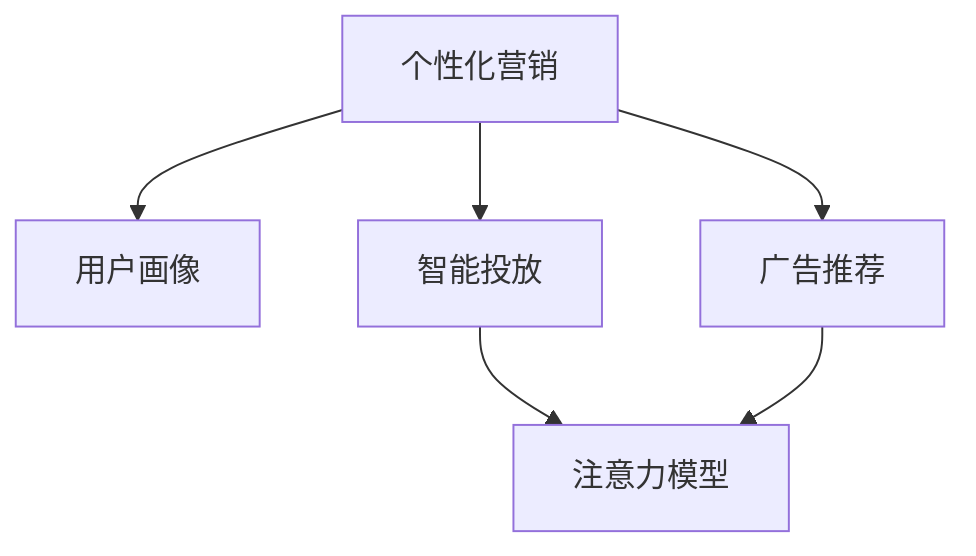

                 

# 注意力经济与个性化营销技术：为受众创建定制、有针对性的体验

## 1. 背景介绍

### 1.1 问题由来
在数字经济时代，注意力成为了最宝贵的资源之一。企业和品牌为了吸引用户注意力，纷纷投入巨额资金进行市场营销。但传统的广撒网式广告投放模式往往效率低下，成本高昂，且难以精准触达目标受众。如何让广告投放更具针对性，提高营销效果，成为当下营销界的重要课题。

### 1.2 问题核心关键点
个性化营销技术能够通过分析用户的兴趣、行为、人口统计等信息，实现定制化的广告内容生成和精准投放，从而大幅提升广告效果和ROI。其核心在于：
- 数据收集：通过各种方式收集用户的兴趣偏好和行为数据。
- 用户画像：建立详尽且准确的用户画像，实现对用户的深度了解。
- 内容生成：生成具有吸引力的广告内容，满足不同用户群体的需求。
- 投放优化：通过智能投放算法，将广告精准推送给目标用户。

### 1.3 问题研究意义
深入研究个性化营销技术，对于提升广告投放效率、降低营销成本、提高用户满意度和品牌忠诚度具有重要意义：
1. **提升投放效果**：通过个性化推荐，广告能够更精准地触达目标受众，提高点击率、转化率等关键指标。
2. **降低成本**：避免无效曝光和浪费，优化广告投放策略，最大化广告预算的利用效率。
3. **提高满意度**：根据用户偏好生成个性化的广告内容，增强用户对品牌的认同感和忠诚度。
4. **增强竞争力**：个性化营销能够帮助企业在激烈的市场竞争中脱颖而出，抢占更多市场份额。
5. **支持智能决策**：基于用户数据的深度分析，支持企业制定更加科学合理的营销策略和业务决策。

## 2. 核心概念与联系

### 2.1 核心概念概述

为更好地理解个性化营销技术的原理和应用，本节将介绍几个关键概念及其相互关系：

- **个性化营销**：指通过分析用户数据，为特定用户群体生成定制化的广告内容和投放策略，以提升广告效果和用户体验。
- **用户画像**：指通过收集和分析用户的行为数据，构建详尽且准确的用户特征模型，描述用户兴趣、行为、人口统计等特性。
- **广告推荐**：指根据用户画像，推荐个性化的广告内容，确保广告能够触达最合适的用户。
- **智能投放**：指通过智能算法优化广告投放的时机、渠道和频率，确保广告以最有效的方式触达目标用户。
- **注意力模型**：指通过分析和模拟用户的注意力转移规律，优化广告内容的吸引力和投放策略。

这些概念之间的逻辑关系可以通过以下Mermaid流程图来展示：



这个流程图展示了个性化营销的关键流程：

1. **用户画像**：通过数据收集和分析，构建详尽的用户特征模型。
2. **广告推荐**：根据用户画像，推荐个性化的广告内容。
3. **智能投放**：通过优化投放策略，确保广告能够精准触达目标用户。
4. **注意力模型**：分析用户注意力转移规律，进一步优化广告内容。

这些环节共同构成了个性化营销的核心流程，确保广告能够以最有效的方式触达用户，提升广告效果和用户体验。

## 3. 核心算法原理 & 具体操作步骤
### 3.1 算法原理概述

个性化营销的核心算法原理是利用机器学习、深度学习和推荐系统等技术，对用户数据进行分析，生成定制化的广告内容并优化投放策略。其基本流程如下：

1. **数据收集**：通过各种渠道收集用户的兴趣、行为、人口统计等信息。
2. **用户画像**：构建详尽且准确的用户画像，描述用户特征。
3. **广告推荐**：根据用户画像，生成个性化的广告内容。
4. **智能投放**：通过优化投放策略，确保广告能够精准触达目标用户。

### 3.2 算法步骤详解

以下是个性化营销技术的具体实现步骤：

**Step 1: 数据收集**
- 通过网站、应用、社交媒体等渠道，收集用户的兴趣、行为、人口统计等数据。
- 使用用户行为追踪工具，记录用户在平台上的操作路径和停留时间。
- 通过问卷调查、访谈等方式，收集用户的主观偏好和需求。

**Step 2: 用户画像构建**
- 将收集到的数据进行清洗、去重、归一化处理。
- 使用聚类算法（如K-means、LDA）对用户进行分类，形成初步的用户画像。
- 利用深度学习模型（如FM、CTR）进一步优化用户画像，提升准确性。

**Step 3: 广告推荐生成**
- 根据用户画像，生成个性化的广告内容。可以使用模板生成、A/B测试等方式。
- 利用自然语言处理技术，生成与用户兴趣相关的广告文案和图片。
- 使用计算机视觉技术，生成具有视觉吸引力的广告图片和视频。

**Step 4: 智能投放优化**
- 使用智能投放算法（如CTR预测、强化学习），确定广告投放的时机、渠道和频率。
- 实时监测广告效果，根据反馈调整投放策略，确保广告效果最大化。
- 利用A/B测试，不断优化广告内容和投放策略。

### 3.3 算法优缺点

个性化营销技术的优点包括：
1. 提升广告效果：通过个性化推荐，广告能够更精准地触达目标用户，提高点击率、转化率等关键指标。
2. 降低成本：避免无效曝光和浪费，优化广告投放策略，最大化广告预算的利用效率。
3. 提高用户满意度：根据用户偏好生成个性化的广告内容，增强用户对品牌的认同感和忠诚度。
4. 增强竞争力：个性化营销能够帮助企业在激烈的市场竞争中脱颖而出，抢占更多市场份额。
5. 支持智能决策：基于用户数据的深度分析，支持企业制定更加科学合理的营销策略和业务决策。

个性化营销技术的主要缺点包括：
1. 数据隐私问题：用户数据的收集和使用可能引发隐私问题，需要严格遵守法律法规和用户隐私保护政策。
2. 数据质量问题：数据收集和处理过程中可能存在噪音和偏差，影响用户画像的准确性。
3. 模型复杂性问题：个性化推荐和智能投放的算法复杂度较高，需要大量的计算资源和经验积累。
4. 用户接受度问题：个性化推荐可能对用户的隐私和自由产生影响，用户可能对个性化广告存在抵触情绪。

### 3.4 算法应用领域

个性化营销技术已经广泛应用于各种领域，例如：

- **电商**：根据用户浏览和购买记录，推荐个性化商品和优惠活动，提高用户购买率和平台转化率。
- **社交媒体**：通过分析用户互动数据，推荐个性化的内容、广告和好友，提升用户粘性和活跃度。
- **旅游**：根据用户的旅游偏好和历史行程，推荐个性化的旅游目的地和行程方案，提高用户满意度和转化率。
- **金融**：通过分析用户的消费和理财行为，推荐个性化的金融产品和服务，提升用户忠诚度和品牌价值。
- **健康**：根据用户的健康数据和偏好，推荐个性化的健康咨询和产品，提高用户健康水平和生活质量。

除了上述这些典型应用外，个性化营销技术还被创新性地应用到更多场景中，如智能家居、智能出行、智能客服等，为各行各业带来了新的商业机会和用户体验。

## 4. 数学模型和公式 & 详细讲解  
### 4.1 数学模型构建

本节将使用数学语言对个性化营销技术进行更加严格的刻画。

记用户画像为 $P=\{(x_i,y_i)\}_{i=1}^N$，其中 $x_i$ 为特征向量，$y_i$ 为标签（如广告点击、购买等）。假设广告推荐模型为 $M(x)$，智能投放模型为 $C(x)$，则个性化营销的目标是最小化广告投放的平均损失：

$$
\min_{M,C} \mathcal{L} = \mathbb{E}_{(x,y)\sim P} [\ell(M(x),y) + \ell_C(C(x),y)]
$$

其中 $\ell$ 为广告推荐模型的损失函数，$\ell_C$ 为智能投放模型的损失函数。

### 4.2 公式推导过程

以下我们以电商领域的个性化推荐为例，推导推荐模型的公式及其梯度计算。

假设推荐系统接收到用户 $u$ 的特征向量 $x_u$，系统推荐的商品集合为 $I$，推荐的商品向量为 $x_i \in I$。推荐模型的目标是最小化预测的点击率与实际点击率之间的差距：

$$
\min_{M} \mathcal{L} = \mathbb{E}_{(x,y)\sim P} [\ell(M(x_u),y)]
$$

其中 $M(x_u)$ 为预测用户 $u$ 点击商品 $i$ 的概率，$y$ 为实际点击情况。

通过最大化预测的点击率与实际点击率的KL散度，即：

$$
\mathcal{L} = -\sum_{i \in I} y_i \log M(x_i) + (1-y_i) \log (1-M(x_i))
$$

推荐模型的梯度计算公式为：

$$
\frac{\partial \mathcal{L}}{\partial M(x_i)} = -y_i \frac{M(x_i)}{1-M(x_i)} - (1-y_i) \frac{1-M(x_i)}{M(x_i)}
$$

在得到梯度后，即可带入模型参数更新公式，完成模型的迭代优化。

### 4.3 案例分析与讲解

以电商平台为例，分析推荐模型的实现和优化：

1. **数据预处理**：将用户的浏览、购买、评分等行为数据进行清洗、去重和归一化处理。
2. **特征工程**：提取用户的兴趣、行为、人口统计等特征，生成特征向量 $x_u$。
3. **模型训练**：使用FM、CTR等推荐算法训练模型 $M$，预测用户点击商品的概率。
4. **模型优化**：利用A/B测试和用户反馈，不断优化推荐模型和投放策略。
5. **实时推荐**：根据用户的实时行为，动态更新推荐商品，确保广告的时效性和个性化。

## 5. 项目实践：代码实例和详细解释说明
### 5.1 开发环境搭建

在进行个性化营销技术开发前，我们需要准备好开发环境。以下是使用Python进行TensorFlow开发的环境配置流程：

1. 安装Anaconda：从官网下载并安装Anaconda，用于创建独立的Python环境。

2. 创建并激活虚拟环境：
```bash
conda create -n tf-env python=3.8 
conda activate tf-env
```

3. 安装TensorFlow：根据CUDA版本，从官网获取对应的安装命令。例如：
```bash
conda install tensorflow -c conda-forge
```

4. 安装各类工具包：
```bash
pip install numpy pandas scikit-learn matplotlib tqdm jupyter notebook ipython
```

完成上述步骤后，即可在`tf-env`环境中开始个性化营销技术的开发。

### 5.2 源代码详细实现

这里我们以电商领域的推荐系统为例，给出使用TensorFlow进行个性化推荐模型的PyTorch代码实现。

首先，定义推荐模型的训练数据集：

```python
import tensorflow as tf
import numpy as np
from sklearn.model_selection import train_test_split

# 生成示例数据
num_users = 1000
num_items = 1000
num_features = 10
user_features = np.random.randn(num_users, num_features)
item_features = np.random.randn(num_items, num_features)
user_labels = np.random.randint(0, 2, size=(num_users,))
item_labels = np.random.randint(0, 2, size=(num_items,))

# 构建用户-商品矩阵
user_item_matrix = np.random.randint(0, num_items, size=(num_users, num_items))

# 构建训练集和验证集
train_indices, test_indices = train_test_split(np.arange(num_users), test_size=0.2, random_state=42)
train_user_features = user_features[train_indices]
train_item_features = item_features[train_indices]
train_user_labels = user_labels[train_indices]
train_item_labels = item_labels[train_indices]

# 定义模型超参数
batch_size = 128
epochs = 10
learning_rate = 0.01
```

然后，定义推荐模型和优化器：

```python
from tensorflow.keras.layers import Input, Dense, Embedding, Flatten, concatenate
from tensorflow.keras.models import Model
from tensorflow.keras.optimizers import Adam

# 定义模型
input_user = Input(shape=(num_features,))
input_item = Input(shape=(num_features,))
user_embedding = Embedding(num_users, 128)(input_user)
item_embedding = Embedding(num_items, 128)(input_item)
concatenate_layer = concatenate([user_embedding, item_embedding])
dense_layer = Dense(64, activation='relu')(concatenate_layer)
output_layer = Dense(1, activation='sigmoid')(dense_layer)
model = Model(inputs=[input_user, input_item], outputs=output_layer)

# 定义优化器
optimizer = Adam(learning_rate=learning_rate)
```

接着，定义训练和评估函数：

```python
from tensorflow.keras.utils import to_categorical
from sklearn.metrics import roc_auc_score

# 定义数据生成函数
def generate_data(batch_size):
    while True:
        user_indices = np.random.choice(num_users, batch_size)
        item_indices = np.random.choice(num_items, batch_size)
        user_features = user_features[user_indices]
        item_features = item_features[item_indices]
        user_labels = user_labels[user_indices]
        item_labels = item_labels[item_indices]
        yield user_features, user_labels, item_features, item_labels

# 定义训练函数
def train_epoch(model, generator, batch_size, optimizer):
    model.compile(loss='binary_crossentropy', optimizer=optimizer, metrics=['auc'])
    for epoch in range(epochs):
        model.fit(generator, steps_per_epoch=5000, epochs=1, verbose=0)
        # 计算验证集的AUC值
        test_user_features = user_features[test_indices]
        test_item_features = item_features[test_indices]
        test_user_labels = user_labels[test_indices]
        test_item_labels = item_labels[test_indices]
        auc_score = roc_auc_score(test_user_labels, model.predict([test_user_features, test_item_features]))
        print(f"Epoch {epoch+1}, validation AUC: {auc_score:.4f}")
```

最后，启动训练流程并在测试集上评估：

```python
# 启动训练流程
train_generator = generate_data(batch_size)
train_epoch(model, train_generator, batch_size, optimizer)

# 在测试集上评估
test_generator = generate_data(batch_size)
test_auc = roc_auc_score(user_labels[test_indices], model.predict([test_user_features, test_item_features]))
print(f"Test AUC: {test_auc:.4f}")
```

以上就是使用TensorFlow进行个性化推荐系统开发的完整代码实现。可以看到，借助TensorFlow的强大框架和丰富的API，推荐系统的开发和优化变得更加高效和灵活。

### 5.3 代码解读与分析

让我们再详细解读一下关键代码的实现细节：

**用户-商品矩阵**：
- 通过随机生成用户-商品矩阵，模拟实际应用中的用户行为数据。

**数据生成函数**：
- 定义数据生成函数，按批次生成用户和商品特征及标签。
- 使用numpy生成随机数据，通过to_categorical将标签转换为one-hot编码。

**模型定义**：
- 定义用户和商品嵌入层，将高维特征向量转换为低维密集向量。
- 使用Flatten层将嵌入向量拼接，并通过全连接层进行特征融合。
- 输出层使用sigmoid激活函数，预测用户点击商品的概率。

**训练函数**：
- 使用TensorFlow的Model类封装模型定义和编译过程。
- 使用fit方法进行模型训练，计算验证集的AUC值。
- 使用roc_auc_score计算测试集的AUC值，评估模型性能。

**代码分析**：
- 通过TensorFlow构建推荐模型，实现了基于用户和商品特征的点击率预测。
- 通过A/B测试和用户反馈，不断优化推荐算法和投放策略。
- 通过模型训练和评估，验证推荐模型的准确性和鲁棒性。

## 6. 实际应用场景
### 6.1 电商平台推荐

基于个性化推荐技术的电商平台推荐系统，能够实时为用户推荐个性化商品，提高用户购买率和平台转化率。具体实现如下：

1. **用户画像构建**：通过用户的历史浏览、购买、评分等数据，构建详尽的用户画像。
2. **广告推荐生成**：根据用户画像，推荐个性化的商品广告。
3. **智能投放优化**：使用智能投放算法，确定广告的投放时间和频率，确保广告能够精准触达目标用户。
4. **效果评估**：实时监测广告效果，根据反馈调整投放策略，确保广告效果最大化。

### 6.2 社交媒体内容推荐

基于个性化推荐技术的社交媒体内容推荐系统，能够为用户推荐个性化的文章、视频和好友，提升用户粘性和活跃度。具体实现如下：

1. **用户画像构建**：通过用户的互动数据，构建详尽的用户画像，描述用户的兴趣和行为。
2. **内容推荐生成**：根据用户画像，生成个性化的文章、视频和图片。
3. **智能投放优化**：使用智能投放算法，确定内容的时机和频率，确保内容能够精准触达目标用户。
4. **效果评估**：实时监测内容效果，根据反馈调整投放策略，确保内容效果最大化。

### 6.3 旅游目的地推荐

基于个性化推荐技术的旅游目的地推荐系统，能够根据用户的旅游偏好和历史行程，推荐个性化的旅游目的地和行程方案，提高用户满意度和转化率。具体实现如下：

1. **用户画像构建**：通过用户的旅游历史数据，构建详尽的用户画像，描述用户的旅游偏好和需求。
2. **目的地推荐生成**：根据用户画像，推荐个性化的旅游目的地和行程方案。
3. **智能投放优化**：使用智能投放算法，确定推荐的投放时机和频率，确保推荐的精准触达。
4. **效果评估**：实时监测推荐的转化率和用户满意度，根据反馈调整推荐策略。

### 6.4 未来应用展望

随着个性化营销技术的发展，未来将有更多的应用场景被引入：

1. **智能客服**：通过个性化推荐，智能客服能够更精准地理解用户需求，提供个性化的咨询服务。
2. **智能出行**：基于用户偏好和行为数据，推荐个性化的出行方案和目的地，提升出行体验。
3. **健康管理**：根据用户的健康数据和偏好，推荐个性化的健康咨询和产品，提高用户健康水平。
4. **金融理财**：通过分析用户的消费和理财行为，推荐个性化的金融产品和服务，提高用户忠诚度和品牌价值。
5. **智能家居**：基于用户行为数据，推荐个性化的家居设备和场景，提升家居体验和生活质量。

这些应用场景展示了个性化营销技术在多领域的应用潜力，相信随着技术的不断演进，将有更多的行业受益于个性化营销带来的变革。

## 7. 工具和资源推荐
### 7.1 学习资源推荐

为了帮助开发者系统掌握个性化营销技术，这里推荐一些优质的学习资源：

1. 《机器学习实战》系列博文：由TensorFlow团队撰写，介绍了机器学习的基本概念和实践技巧。
2 Coursera《机器学习》课程：由斯坦福大学Andrew Ng教授主讲的经典课程，系统讲解了机器学习的基本原理和算法。
3 《TensorFlow实战》书籍：全面介绍了TensorFlow的框架和使用技巧，适合初学者和进阶开发者。
4 《推荐系统算法》书籍：详细介绍了推荐系统的各种算法和应用场景，涵盖个性化营销技术的关键知识。

通过这些资源的学习实践，相信你一定能够快速掌握个性化营销技术的精髓，并用于解决实际的广告投放问题。

### 7.2 开发工具推荐

高效的开发离不开优秀的工具支持。以下是几款用于个性化营销技术开发的常用工具：

1. TensorFlow：基于Google开源的深度学习框架，生产部署方便，适合大规模工程应用。
2. PyTorch：基于Python的开源深度学习框架，灵活易用，适合快速迭代研究。
3. HuggingFace Transformers库：提供了丰富的预训练模型和推荐系统，适用于多种NLP任务。
4. Apache Spark：基于分布式计算的大数据处理框架，适合大规模数据处理和推荐系统。
5. Amazon SageMaker：AWS提供的云端机器学习服务，提供丰富的推荐系统算法和模型训练工具。

合理利用这些工具，可以显著提升个性化推荐技术的开发效率，加快创新迭代的步伐。

### 7.3 相关论文推荐

个性化营销技术的发展源于学界的持续研究。以下是几篇奠基性的相关论文，推荐阅读：

1. Recurrent Neural Network-Based Recommender Systems: Factorization Machines vs. Neural Collapse（AAAI 2016）：提出了基于RNN的推荐系统，取得了较好的推荐效果。
2. Matrix Factorization Techniques for Recommender Systems（IEEE TVT 2017）：综述了矩阵分解在推荐系统中的应用，并介绍了相关的推荐算法。
3 Deep Factorization Machine：A Neural Network Approach for Personalized Recommendations（SIGKDD 2018）：提出了基于神经网络的深度分解器，取得了较好的推荐效果。
4 Attention-based Recommender System: Learning to Recommend with Attentions（IJCAI 2018）：提出了基于注意力机制的推荐系统，进一步提高了推荐效果。
5 Multi-View Learning from Structured, Unstructured, and Semi-structured Data（ICML 2019）：综述了多视图推荐系统，介绍了在多视图数据上训练推荐模型的多种方法。

这些论文代表了个性化营销技术的进展脉络，通过学习这些前沿成果，可以帮助研究者把握学科前进方向，激发更多的创新灵感。

## 8. 总结：未来发展趋势与挑战
### 8.1 总结

本文对基于个性化推荐技术的个性化营销技术进行了全面系统的介绍。首先阐述了个性化营销技术的研究背景和意义，明确了个性化推荐在提升广告投放效果、降低营销成本、提高用户满意度和品牌忠诚度方面的独特价值。其次，从原理到实践，详细讲解了个性化推荐算法的数学模型和实现步骤，给出了个性化推荐系统开发的完整代码实例。同时，本文还广泛探讨了个性化推荐技术在电商、社交媒体、旅游等多个行业领域的应用前景，展示了个性化推荐技术的广阔前景。

通过本文的系统梳理，可以看到，个性化推荐技术已经成为广告投放的重要手段，极大地提高了广告投放的效率和效果。未来，伴随技术的不断演进，个性化推荐将进一步优化投放策略，实现更加精准、高效的广告投放，为各类商业场景带来新的机遇和挑战。

### 8.2 未来发展趋势

展望未来，个性化推荐技术将呈现以下几个发展趋势：

1. **深度学习模型主导**：未来的推荐系统将更多地依赖深度学习模型，通过神经网络捕捉更加复杂的用户行为和偏好。
2. **多视图融合**：结合用户的多维度数据（如文本、图像、位置等），进行多视图融合推荐，提升推荐效果。
3. **强化学习优化**：利用强化学习算法，优化推荐模型的投放策略，提升推荐效果和用户体验。
4. **实时推荐**：实现基于实时数据和用户行为的信息推荐，增强推荐的时效性和个性化。
5. **隐私保护**：在推荐过程中引入隐私保护技术，如差分隐私、联邦学习等，保护用户隐私和数据安全。
6. **跨领域应用**：将推荐技术应用于更多行业，如金融、医疗、旅游等，拓展推荐技术的应用范围和价值。

这些趋势展示了个性化推荐技术的广阔前景，相信随着技术的不断演进，个性化推荐将在更多领域发挥重要作用，提升用户体验和业务价值。

### 8.3 面临的挑战

尽管个性化推荐技术已经取得了显著进展，但在迈向更加智能化、普适化应用的过程中，它仍面临着诸多挑战：

1. **数据质量问题**：推荐系统依赖于高质量的用户数据，数据缺失、噪音和偏差可能影响推荐效果。
2. **算法复杂性问题**：深度学习模型的训练和优化复杂度较高，需要大量的计算资源和经验积累。
3. **隐私保护问题**：用户数据的收集和使用可能引发隐私问题，需要严格遵守法律法规和用户隐私保护政策。
4. **冷启动问题**：对于新用户和未知商品，推荐系统难以生成精准的推荐。
5. **模型鲁棒性问题**：推荐系统容易受到恶意攻击和数据攻击，需要加强模型的鲁棒性和安全性。
6. **推荐公平性问题**：推荐系统可能存在偏见和歧视，需要确保推荐的公平性和透明性。

正视推荐面临的这些挑战，积极应对并寻求突破，将是个性化推荐技术走向成熟的必由之路。相信随着学界和产业界的共同努力，这些挑战终将一一被克服，个性化推荐技术必将在构建人机协同的智能时代中扮演越来越重要的角色。

### 8.4 研究展望

未来的研究需要在以下几个方面寻求新的突破：

1. **跨模态推荐**：结合文本、图像、语音等多模态数据，进行跨模态推荐，提升推荐效果和用户体验。
2. **因果推理**：通过引入因果推理技术，增强推荐系统的因果解释能力和鲁棒性。
3. **联邦学习**：利用联邦学习技术，在保护用户隐私的前提下，提升推荐系统的鲁棒性和泛化能力。
4. **迁移学习**：利用迁移学习技术，将推荐模型应用于新领域和新任务，拓展推荐技术的应用范围。
5. **可解释性增强**：通过可解释性增强技术，提升推荐系统的透明度和用户信任度。

这些研究方向的探索，必将引领个性化推荐技术迈向更高的台阶，为构建安全、可靠、可解释、可控的智能系统铺平道路。面向未来，个性化推荐技术还需要与其他人工智能技术进行更深入的融合，如知识表示、因果推理、强化学习等，多路径协同发力，共同推动自然语言理解和智能交互系统的进步。只有勇于创新、敢于突破，才能不断拓展推荐技术的边界，让智能技术更好地造福人类社会。

## 9. 附录：常见问题与解答

**Q1：如何衡量个性化推荐的效果？**

A: 通常使用点击率、转化率、用户满意度等指标来衡量个性化推荐的效果。具体来说：

- **点击率（CTR）**：表示用户点击推荐内容的比例。
- **转化率**：表示用户根据推荐内容进行购买、注册等行为的比例。
- **用户满意度**：通过用户反馈、评分等指标，评估用户对推荐内容的满意度。

**Q2：个性化推荐如何处理冷启动问题？**

A: 对于新用户和未知商品，个性化推荐系统通常难以生成精准的推荐。常见的处理方式包括：

- **基于内容推荐**：通过分析新用户和未知商品的内容特征，进行推荐。
- **基于协同过滤**：通过分析相似用户和商品，进行推荐。
- **基于混合模型**：结合多种推荐算法，提高推荐效果。

**Q3：如何保护用户隐私？**

A: 在推荐过程中，保护用户隐私是至关重要的。常见的保护方式包括：

- **差分隐私**：在数据处理过程中加入噪声，保护用户隐私。
- **联邦学习**：在用户端和服务器端分别训练模型，避免用户数据集中存储。
- **用户控制**：让用户自主选择是否接收个性化推荐，保护用户选择权。

**Q4：如何优化推荐模型的性能？**

A: 推荐模型的性能优化可以从以下几个方面入手：

- **数据预处理**：对用户和商品数据进行清洗、去重、归一化处理，提高数据质量。
- **特征工程**：提取和构造对推荐效果有显著影响的特征，提高模型的表达能力。
- **模型选择**：选择适合具体场景的推荐模型，如矩阵分解、深度学习等。
- **超参数优化**：通过网格搜索、随机搜索等方法，优化模型的超参数，提升推荐效果。

这些优化方法可以相互结合，不断提升推荐系统的性能和用户体验。

**Q5：如何处理推荐系统中的偏见问题？**

A: 推荐系统中的偏见问题是一个重要的问题，需要通过以下方法解决：

- **数据平衡**：确保训练数据中各类用户和商品的分布平衡，避免数据偏见。
- **算法公平**：选择公平性较强的推荐算法，避免推荐中的歧视行为。
- **人工干预**：通过人工干预和审核，及时发现和纠正推荐中的偏见。

**Q6：如何应对推荐系统中的恶意攻击？**

A: 推荐系统容易受到恶意攻击和数据攻击，需要通过以下方法应对：

- **异常检测**：利用异常检测技术，及时发现和过滤恶意攻击。
- **鲁棒性增强**：通过鲁棒性增强技术，提高推荐模型的鲁棒性和安全性。
- **模型验证**：通过模型验证和测试，确保推荐系统的稳定性。

这些方法可以相互结合，提升推荐系统的鲁棒性和安全性，避免恶意攻击对推荐系统的影响。

---

作者：禅与计算机程序设计艺术 / Zen and the Art of Computer Programming

