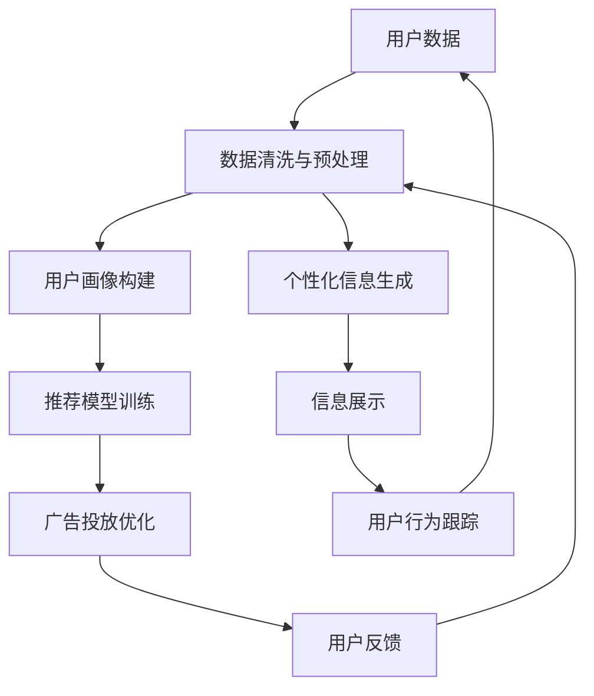

                 

# 注意力经济与个性化营销策略：如何为受众创建定制信息

## 1. 背景介绍

### 1.1 问题由来
随着互联网技术的迅猛发展和全球化进程的加快，信息流通变得前所未有的广泛和高效。海量的数据为各行各业带来了巨大的机会，也带来了巨大的挑战。传统的“广播式”信息传播方式已经无法适应个性化和精准化的时代需求。如何在信息泛滥的海洋中吸引和留住用户的注意力，如何高效地转化用户的注意力为实际价值，成为了营销和商业领域亟待解决的问题。

### 1.2 问题核心关键点
注意力经济与个性化营销的核心理念在于如何利用技术手段，为每个用户量身定制最适合的信息内容，以最大化其对品牌和产品的认知和兴趣。这一过程涉及到了用户数据的收集、处理、分析和应用，通过机器学习、数据挖掘、自然语言处理等技术，将大量零散的、分散的用户行为数据转化为个性化的信息推荐，进而提升用户的满意度和转化率。

### 1.3 问题研究意义
通过提升用户的注意力和经济价值，个性化营销能够帮助企业构建更稳固的客户关系，提高品牌忠诚度和市场竞争力。个性化推荐系统、广告投放优化、精准营销等应用，在电商、社交媒体、内容分发平台等各个领域都取得了显著的成效。个性化营销技术的应用不仅能够提升用户体验，还能够为企业带来直接的收益增长，推动数字化转型和创新发展。

## 2. 核心概念与联系

### 2.1 核心概念概述

为更好地理解注意力经济与个性化营销策略，本节将介绍几个密切相关的核心概念：

- 注意力经济（Attention Economy）：是指在信息爆炸的时代，用户对于注意力的价值日益凸显，如何吸引和利用用户的注意力成为企业成功的关键。
- 个性化营销（Personalized Marketing）：通过大数据分析和机器学习技术，将用户的行为和偏好数据转化为个性化的信息内容，以提升用户的满意度和转化率。
- 信息定制（Information Customization）：针对不同用户的需求和偏好，定制出符合其兴趣和行为特征的信息内容，实现信息的最优匹配。
- 推荐系统（Recommendation System）：利用用户数据和机器学习算法，推荐用户可能感兴趣的产品、内容和服务，是实现个性化营销的重要手段。
- 广告投放优化（Advertising Optimization）：通过优化广告的投放策略和展示方式，提高广告的曝光率、点击率和转化率。

这些概念之间紧密联系，共同构成了个性化营销的核心框架。

### 2.2 核心概念原理和架构的 Mermaid 流程图



这个流程图展示了个性化营销的整个流程：

1. 从用户数据开始，经过数据清洗和预处理，构建用户画像。
2. 基于用户画像，训练推荐模型，进行个性化信息的生成。
3. 通过广告投放优化，将个性化信息展示给用户。
4. 收集用户反馈，进行数据更新和模型优化。

## 3. 核心算法原理 & 具体操作步骤

### 3.1 算法原理概述

基于注意力经济与个性化营销的推荐系统主要涉及以下几个关键算法：

- 协同过滤算法（Collaborative Filtering）：通过分析用户之间的行为相似性，推荐其他用户喜欢的物品。
- 基于内容的推荐算法（Content-based Filtering）：根据物品的特征和用户的兴趣，推荐相似的物品。
- 矩阵分解算法（Matrix Factorization）：通过分解用户-物品评分矩阵，得到用户和物品的隐含特征，进而进行推荐。
- 深度学习算法：使用神经网络模型，如卷积神经网络（CNN）、循环神经网络（RNN）、自注意力机制（Transformer）等，对用户行为数据进行深度学习，实现更加精准的推荐。

这些算法共同构成了推荐系统的核心技术框架，通过协同工作，能够实现个性化信息的有效生成和展示。

### 3.2 算法步骤详解

基于注意力经济与个性化营销的推荐系统主要分为以下几个关键步骤：

**Step 1: 用户数据收集与预处理**

- 从多个渠道（如网站、应用、社交媒体等）收集用户数据，包括浏览行为、购买记录、搜索关键词、评分数据等。
- 对收集到的数据进行清洗和预处理，去除噪声和异常值，填补缺失值。
- 将处理后的数据进行标准化和归一化，以便后续算法处理。

**Step 2: 用户画像构建**

- 对用户行为数据进行聚类分析，生成用户兴趣和行为特征的向量表示。
- 利用聚类结果构建用户画像，描述用户的兴趣偏好和行为模式。

**Step 3: 推荐模型训练**

- 根据用户画像，选择合适的推荐算法，训练推荐模型。
- 将用户画像和物品特征输入模型，训练得到用户-物品评分预测模型。

**Step 4: 个性化信息生成**

- 利用训练好的推荐模型，对新用户行为数据进行预测，生成个性化推荐信息。
- 对推荐信息进行排序和筛选，根据用户的兴趣和行为特征，选择最符合其需求的信息。

**Step 5: 信息展示与反馈收集**

- 将生成的个性化信息展示给用户，如搜索结果、商品推荐、广告等。
- 收集用户对推荐信息的反馈，如点击率、购买率、评分等，用于优化模型。

**Step 6: 模型优化与迭代**

- 根据用户反馈数据，更新用户画像和物品特征。
- 对推荐模型进行重新训练，提高模型的准确性和鲁棒性。

通过以上步骤，可以实现一个完整的基于注意力经济与个性化营销的推荐系统，为用户的决策提供精准的信息支持。

### 3.3 算法优缺点

基于注意力经济与个性化营销的推荐系统具有以下优点：

1. 个性化程度高：通过分析用户行为数据，能够生成高度个性化的信息内容，提升用户体验和满意度。
2. 精准率高：使用深度学习等先进算法，能够对用户行为进行精准预测，减少误推荐。
3. 可扩展性强：能够处理大规模数据，支持多维度数据融合和实时更新。

同时，该系统也存在以下局限性：

1. 数据隐私问题：用户数据的收集和处理需要考虑隐私保护和数据安全。
2. 冷启动问题：新用户或物品没有足够的历史数据，难以生成个性化推荐。
3. 算法复杂度高：深度学习等复杂算法对计算资源要求较高。
4. 用户依赖度高：过分依赖推荐系统，可能导致用户主动探索能力下降。

### 3.4 算法应用领域

基于注意力经济与个性化营销的推荐系统在多个领域都有广泛应用，包括：

- 电子商务：根据用户浏览和购买行为，推荐商品、优惠券等，提升转化率。
- 内容分发平台：推荐新闻、文章、视频等，提高用户粘性和平台流量。
- 社交媒体：推荐用户可能感兴趣的内容，提升用户参与度和活跃度。
- 旅游出行：推荐目的地、行程路线、酒店等，优化用户出行体验。
- 金融投资：推荐基金、股票等，帮助用户进行投资决策。

这些领域的应用都显著提升了用户的满意度和品牌忠诚度，推动了业务增长。

## 4. 数学模型和公式 & 详细讲解 & 举例说明

### 4.1 数学模型构建

基于注意力经济与个性化营销的推荐系统主要包括以下数学模型：

- 用户画像模型（User Profile Model）：表示用户兴趣和行为特征的向量。
- 物品画像模型（Item Profile Model）：表示物品特征的向量。
- 协同过滤模型（Collaborative Filtering Model）：表示用户-物品评分矩阵。
- 深度学习模型（Deep Learning Model）：如卷积神经网络（CNN）、循环神经网络（RNN）、自注意力机制（Transformer）等。

### 4.2 公式推导过程

以协同过滤算法中的基于用户-物品相似度的方法为例，推导用户-物品评分预测公式。

设用户 $u$ 对物品 $i$ 的评分记为 $R_{ui}$，用户 $u$ 对物品 $i$ 的兴趣表示为 $I_u$，物品 $i$ 的属性表示为 $A_i$，则协同过滤算法可以表示为：

$$
R_{ui} = \sum_{j=1}^K \alpha_j \times I_u \times A_j \times A_i
$$

其中 $K$ 为物品的属性数量，$\alpha_j$ 为权重系数。

通过训练得到用户-物品评分预测模型，可以预测新用户对物品的评分，进而生成个性化推荐。

### 4.3 案例分析与讲解

假设有一个电商网站，需要对用户进行个性化推荐，推荐商品和优惠券。根据用户浏览和购买数据，构建用户画像和物品画像。使用协同过滤算法，预测用户对不同商品的评分。根据评分预测结果，生成个性化推荐列表，展示给用户。收集用户点击、购买数据，用于模型优化和迭代。

## 5. 项目实践：代码实例和详细解释说明

### 5.1 开发环境搭建

在进行项目实践前，我们需要准备好开发环境。以下是使用Python进行TensorFlow开发的环境配置流程：

1. 安装Anaconda：从官网下载并安装Anaconda，用于创建独立的Python环境。

2. 创建并激活虚拟环境：
```bash
conda create -n tf-env python=3.8 
conda activate tf-env
```

3. 安装TensorFlow：根据CUDA版本，从官网获取对应的安装命令。例如：
```bash
conda install tensorflow-gpu=2.5.0
```

4. 安装其他必要的库：
```bash
pip install pandas numpy scipy scikit-learn
```

完成上述步骤后，即可在`tf-env`环境中开始项目实践。

### 5.2 源代码详细实现

这里我们以电子商务推荐系统为例，给出使用TensorFlow对用户行为数据进行协同过滤推荐系统的PyTorch代码实现。

首先，定义用户画像和物品画像的编码器：

```python
import tensorflow as tf

class UserEmbedding(tf.keras.Model):
    def __init__(self, embedding_dim):
        super(UserEmbedding, self).__init__()
        self.embedding = tf.keras.layers.Embedding(input_dim=num_users, output_dim=embedding_dim)
    
    def call(self, x):
        return self.embedding(x)

class ItemEmbedding(tf.keras.Model):
    def __init__(self, embedding_dim):
        super(ItemEmbedding, self).__init__()
        self.embedding = tf.keras.layers.Embedding(input_dim=num_items, output_dim=embedding_dim)
    
    def call(self, x):
        return self.embedding(x)
```

然后，定义协同过滤模型的解码器：

```python
class Decoder(tf.keras.Model):
    def __init__(self, num_factors):
        super(Decoder, self).__init__()
        self.w1 = tf.keras.layers.Dense(units=num_factors, activation='relu')
        self.w2 = tf.keras.layers.Dense(units=1, activation='sigmoid')
    
    def call(self, x):
        x = self.w1(x)
        return self.w2(x)
```

最后，定义协同过滤模型的训练和预测函数：

```python
from sklearn.model_selection import train_test_split

def train_model(user_embeddings, item_embeddings, ratings, batch_size=128, epochs=10):
    num_factors = 10
    user_model = UserEmbedding(num_factors)
    item_model = ItemEmbedding(num_factors)
    decoder = Decoder(num_factors)
    
    # 构建模型
    model = tf.keras.Sequential([
        user_embeddings,
        item_embeddings,
        decoder
    ])
    
    # 编译模型
    model.compile(optimizer='adam', loss='binary_crossentropy', metrics=['mae'])
    
    # 分割数据集
    train_ratings, val_ratings = train_test_split(ratings, test_size=0.2, random_state=42)
    
    # 训练模型
    history = model.fit(user_embeddings(train_ratings[:, 0]), item_embeddings(train_ratings[:, 1]), 
                       labels=train_ratings[:, 2], 
                       validation_data=(user_embeddings(val_ratings[:, 0]), item_embeddings(val_ratings[:, 1]), 
                                       val_ratings[:, 2]), 
                       epochs=epochs, batch_size=batch_size)
    
    return model

def predict(model, user_embeddings, item_embeddings, batch_size=128):
    predictions = []
    for i in range(0, len(user_embeddings), batch_size):
        start = i
        end = min(start+batch_size, len(user_embeddings))
        user_data = user_embeddings[start:end]
        item_data = item_embeddings[start:end]
        predictions.extend(model.predict(user_data, item_data))
    return predictions
```

启动训练流程并生成推荐结果：

```python
from numpy import loadtxt

# 加载数据
ratings = loadtxt('ratings.csv', delimiter=',')
user_embeddings = loadtxt('user_embeddings.csv', delimiter=',')
item_embeddings = loadtxt('item_embeddings.csv', delimiter=',')

# 构建模型
model = train_model(user_embeddings, item_embeddings, ratings)

# 生成推荐
users = loadtxt('users.csv', delimiter=',')
predictions = predict(model, user_embeddings, item_embeddings)
```

以上就是使用TensorFlow对电子商务推荐系统进行协同过滤推荐的完整代码实现。可以看到，TensorFlow的高级API使得模型构建和训练变得非常简单，开发者可以将更多精力放在业务逻辑和数据处理上。

### 5.3 代码解读与分析

让我们再详细解读一下关键代码的实现细节：

**UserEmbedding类和ItemEmbedding类**：
- `__init__`方法：初始化用户画像和物品画像的嵌入层。
- `call`方法：将输入的ID序列转化为嵌入向量。

**Decoder类**：
- `__init__`方法：初始化解码器的权重层。
- `call`方法：将用户和物品的嵌入向量相乘，通过两个线性层，输出用户对物品的评分预测。

**train_model函数**：
- 定义用户和物品嵌入层，以及解码器。
- 构建模型，并编译优化器和损失函数。
- 使用`train_test_split`分割数据集，训练模型。

**predict函数**：
- 使用模型进行预测，生成推荐结果。
- 循环遍历数据，逐批次进行预测，并记录所有预测结果。

通过以上代码实现，可以完成一个基本的基于协同过滤算法的电子商务推荐系统。

## 6. 实际应用场景

### 6.1 智能推荐系统

智能推荐系统是个性化营销的重要应用，通过分析用户行为数据，为用户推荐最符合其需求的商品、内容等。电商、视频、音乐、社交媒体等平台都在广泛应用智能推荐系统，提升用户体验和平台粘性。

### 6.2 广告投放优化

广告投放优化是实现个性化营销的重要手段，通过精准定位用户，优化广告的展示方式和时机，提高广告的点击率和转化率。广告主可以根据不同的广告目标和用户特征，设置多维度的投放策略，提高广告效果和ROI。

### 6.3 内容生成与推荐

基于用户行为数据，智能内容生成系统可以自动生成个性化的文章、视频、音乐等内容，推荐给用户。新闻媒体、短视频平台、在线教育等领域都在尝试这种技术，提升内容的吸引力和用户的参与度。

### 6.4 未来应用展望

随着大数据和人工智能技术的进一步发展，基于注意力经济与个性化营销的推荐系统将在更多领域得到应用，为传统行业带来变革性影响。

在智慧医疗领域，智能推荐系统可以用于推荐药物、诊疗方案等，提高医疗服务的效率和精准度。

在智慧教育领域，基于个性化学习的推荐系统可以推荐个性化的学习资源、习题等，提高学习效果和效率。

在智慧城市治理中，智能推荐系统可以用于推荐出行路线、旅游攻略等，提升城市的治理水平和居民的幸福指数。

此外，在企业生产、社会治理、文娱传媒等众多领域，基于大语言模型的推荐系统也将不断涌现，为各行各业带来新的技术突破和价值增长。

## 7. 工具和资源推荐

### 7.1 学习资源推荐

为了帮助开发者系统掌握注意力经济与个性化营销的理论基础和实践技巧，这里推荐一些优质的学习资源：

1. 《推荐系统实践》书籍：由深度学习专家撰写，全面介绍了推荐系统的核心算法和实现技巧。

2. 《Python推荐系统实战》书籍：通过实际案例，介绍了推荐系统的设计与实现。

3. 《广告优化与精准营销》课程：斯坦福大学开设的课程，介绍了广告投放优化的原理和策略。

4. UCI推荐系统数据集：包含多种推荐系统任务的数据集，便于开发者进行实验和研究。

5. TensorFlow推荐系统官方文档：提供了多种推荐算法的实现和优化技巧，是实践推荐系统的重要参考资料。

通过这些资源的学习实践，相信你一定能够快速掌握个性化营销技术的精髓，并用于解决实际的营销问题。

### 7.2 开发工具推荐

高效的开发离不开优秀的工具支持。以下是几款用于推荐系统开发的常用工具：

1. TensorFlow：由Google主导开发的深度学习框架，提供了丰富的推荐算法实现。

2. PyTorch：由Facebook开发的深度学习框架，灵活的动态计算图，适合快速迭代研究。

3. LightFM：基于TensorFlow实现的推荐系统框架，支持多种推荐算法和模型。

4. Surprise：基于Python的推荐系统库，提供了多种协同过滤算法和模型。

5. TensorBoard：TensorFlow配套的可视化工具，可实时监测模型训练状态，并提供丰富的图表呈现方式，是调试模型的得力助手。

合理利用这些工具，可以显著提升推荐系统开发的效率，加快创新迭代的步伐。

### 7.3 相关论文推荐

注意力经济与个性化营销的研究源于学界的持续研究。以下是几篇奠基性的相关论文，推荐阅读：

1. 《推荐系统与协同过滤》：介绍推荐系统的基本概念和协同过滤算法。

2. 《深度学习在推荐系统中的应用》：介绍了深度学习在推荐系统中的应用和效果。

3. 《基于深度学习的个性化推荐系统》：探讨了深度学习在推荐系统中的实现和优化。

4. 《广告投放优化与精准营销》：介绍了广告投放优化的方法和策略。

5. 《多维广告投放优化研究》：探讨了多维广告投放优化的原理和实现。

这些论文代表了大语言模型微调技术的发展脉络。通过学习这些前沿成果，可以帮助研究者把握学科前进方向，激发更多的创新灵感。

## 8. 总结：未来发展趋势与挑战

### 8.1 研究成果总结

本文对基于注意力经济与个性化营销的推荐系统进行了全面系统的介绍。首先阐述了推荐系统的发展背景和应用前景，明确了个性化营销在提升用户体验和业务价值方面的独特价值。其次，从原理到实践，详细讲解了推荐系统的核心算法和操作步骤，给出了推荐系统开发的完整代码实例。同时，本文还广泛探讨了推荐系统在多个行业领域的应用前景，展示了推荐系统技术的巨大潜力。

通过本文的系统梳理，可以看到，基于注意力经济与个性化营销的推荐系统正在成为各行各业的重要工具，极大地提升了用户的满意度和业务收益。未来，伴随推荐系统技术的不断演进，基于大数据和人工智能的推荐系统必将进一步提升各行业的智能化水平，推动数字化转型和创新发展。

### 8.2 未来发展趋势

展望未来，推荐系统将呈现以下几个发展趋势：

1. 深度学习算法的应用将更加广泛。深度学习技术在大规模数据上的表现越来越出色，未来的推荐系统将更多地使用深度学习算法，提高推荐精准率和鲁棒性。

2. 推荐系统将更多地依赖多模态数据。除了文本数据，推荐系统将更多地利用图像、音频等多模态数据，提升对用户行为的理解和预测能力。

3. 推荐系统的实时性将进一步提高。通过分布式计算和实时数据流处理，推荐系统将能够实现更快速的推荐服务。

4. 推荐系统将更多地融合社交网络信息。社交网络数据对用户行为有重要影响，未来的推荐系统将更多地利用社交网络数据，提高推荐的个性化和精准性。

5. 推荐系统的透明性和可解释性将增强。推荐系统作为用户决策的重要工具，需要具备更强的透明性和可解释性，使用户能够理解和信任推荐结果。

6. 推荐系统将更多地考虑用户隐私。在数据隐私保护日益重视的背景下，推荐系统需要更多地关注用户隐私保护，提高数据使用的合规性。

以上趋势凸显了推荐系统技术的广阔前景。这些方向的探索发展，必将进一步提升推荐系统的性能和应用范围，为用户的决策提供更加精准、高效的信息支持。

### 8.3 面临的挑战

尽管推荐系统技术已经取得了显著成效，但在迈向更加智能化、普适化应用的过程中，它仍面临着诸多挑战：

1. 数据隐私问题：用户数据的收集和处理需要考虑隐私保护和数据安全。

2. 冷启动问题：新用户或物品没有足够的历史数据，难以生成个性化推荐。

3. 算法复杂度高：深度学习等复杂算法对计算资源要求较高。

4. 用户依赖度高：过分依赖推荐系统，可能导致用户主动探索能力下降。

5. 推荐公平性问题：推荐系统可能存在隐性偏见，导致推荐结果不公平。

6. 推荐效果评估问题：缺乏统一的评估标准，难以衡量推荐系统的实际效果。

7. 用户反馈机制问题：用户反馈机制不完善，可能无法及时更新推荐模型。

这些挑战需要开发者从数据、算法、工程、业务等多个维度进行全面优化，才能更好地实现推荐系统的目标。

### 8.4 研究展望

面对推荐系统面临的挑战，未来的研究需要在以下几个方面寻求新的突破：

1. 探索更多高效的数据收集和处理方式，如隐私保护技术、冷启动技术等。

2. 开发更加高效、鲁棒的推荐算法，如多模态数据融合、实时推荐算法等。

3. 引入更多先验知识，如知识图谱、规则库等，提高推荐系统的决策逻辑和透明性。

4. 加强用户隐私保护，如差分隐私、联邦学习等技术。

5. 探索更加公平、公正的推荐算法，如去偏算法、公平性评估等。

6. 建立更加完善的推荐效果评估机制，如多指标评估、实时效果监测等。

7. 引入更多用户反馈机制，如即时反馈、用户满意度调查等。

这些研究方向的探索，必将引领推荐系统技术迈向更高的台阶，为构建更加智能、高效、安全的推荐系统铺平道路。面向未来，推荐系统技术还需要与其他人工智能技术进行更深入的融合，如知识表示、因果推理、强化学习等，多路径协同发力，共同推动推荐系统的进步。

## 9. 附录：常见问题与解答

**Q1：推荐系统是否适用于所有业务场景？**

A: 推荐系统在大多数业务场景中都有广泛应用，特别是在用户行为数据可获取的领域，如电商、社交媒体、视频平台等。但对于一些需要专业知识和决策的领域，如医疗、金融、教育等，推荐系统可能需要更多的领域知识和规则支持。

**Q2：如何选择合适的推荐算法？**

A: 选择推荐算法时，需要考虑业务场景、数据特性、推荐目标等因素。常见的推荐算法包括协同过滤、基于内容的推荐、矩阵分解、深度学习等。需要根据具体业务需求，选择适合的推荐算法。

**Q3：如何优化推荐系统的性能？**

A: 推荐系统的性能优化可以从多个方面入手，包括数据预处理、算法优化、模型调参、特征工程等。例如，使用深度学习算法时，可以通过网络结构设计、超参数调优等方式提高模型的精度和鲁棒性。

**Q4：推荐系统在应用中需要注意哪些问题？**

A: 推荐系统在应用中需要注意数据隐私、冷启动、算法复杂度、推荐公平性等问题。需要根据具体业务场景，采取相应的技术手段，平衡推荐效果和隐私保护、公平性等。

**Q5：推荐系统的未来发展方向有哪些？**

A: 推荐系统的未来发展方向包括深度学习算法的应用、多模态数据的融合、实时推荐的实现、隐私保护技术的引入、公平推荐算法的探索等。这些方向的研究将进一步提升推荐系统的性能和应用范围。

通过本文的系统梳理，可以看到，基于注意力经济与个性化营销的推荐系统正在成为各行各业的重要工具，极大地提升了用户的满意度和业务收益。未来，伴随推荐系统技术的不断演进，基于大数据和人工智能的推荐系统必将进一步提升各行业的智能化水平，推动数字化转型和创新发展。

