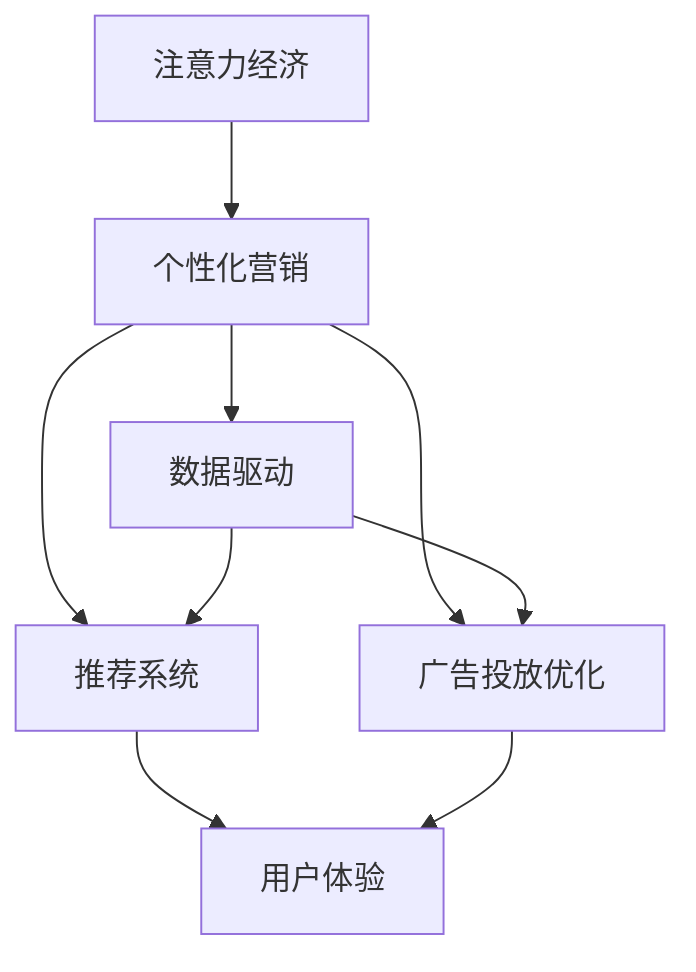

                 

# 注意力经济与个性化营销：为受众创建定制、有针对性的信息和体验

> 关键词：注意力经济,个性化营销,数据驱动,用户行为分析,推荐系统,广告投放,算法优化

## 1. 背景介绍

### 1.1 问题由来

在信息爆炸的时代，海量的内容和碎片化的信息流占据了用户大部分的注意力。如何高效吸引用户注意力，让用户从海量的信息中筛选出有用的内容，成为了营销领域的首要挑战。特别是在数字化营销、在线广告、个性化推荐等场景中，准确地把握用户注意力和行为，提供定制化信息，成为了提升用户体验、提高营销效果的关键。

注意力经济（Economy of Attention）概念由尼尔·波兹曼（Neil Postman）在1985年首次提出，指的是在信息过载的时代，获取用户注意力成为一种稀缺资源，对用户注意力的争夺和利用，将成为创造价值的新途径。

### 1.2 问题核心关键点

注意力经济的本质在于通过优化信息呈现和用户体验，吸引并保持用户的注意力。而在营销领域，个性化营销（Personalized Marketing）成为了实现这一目标的重要手段。个性化营销通过收集和分析用户数据，精准地定制信息，实现一对一的用户互动，从而提高营销的精准度和效果。

当前，个性化营销的实现主要依赖于数据驱动的方法，如用户行为分析、推荐系统和广告投放优化等。这些技术通过深度学习、数据挖掘、自然语言处理等手段，从海量数据中提取用户行为模式，挖掘隐含的个性化需求，实时调整营销策略。

### 1.3 问题研究意义

深入研究注意力经济和个性化营销，对提高数字营销效率、优化用户体验、提升广告投放效果具有重要意义。具体而言，本文将探讨：

- 注意力经济与个性化营销的核心概念和原理
- 数据驱动个性化营销的关键算法和具体操作步骤
- 数学模型构建和优化
- 项目实践中的代码实现与优化
- 实际应用场景及其优化策略
- 相关资源和工具推荐
- 未来趋势与挑战

本文旨在为营销从业者和技术开发者提供一个全面的视角，帮助他们理解和实现基于注意力和个性化策略的营销解决方案。

## 2. 核心概念与联系

### 2.1 核心概念概述

为更好地理解注意力经济和个性化营销，本节将介绍几个关键概念：

- 注意力经济（Economy of Attention）：指的是在信息过载时代，获取和利用用户注意力成为稀缺资源，对注意力的争夺和利用可以创造价值。
- 个性化营销（Personalized Marketing）：通过收集和分析用户数据，精准地定制信息，实现一对一的用户互动，提高营销的精准度和效果。
- 数据驱动（Data-Driven）：利用大数据和机器学习技术，从海量数据中挖掘用户行为模式和需求，进行精确预测和决策。
- 推荐系统（Recommendation System）：通过分析用户行为数据，为用户推荐感兴趣的内容，提升用户满意度和粘性。
- 广告投放优化（Advertising Optimization）：利用算法优化广告展示策略，提高广告点击率和转化率，优化广告投放效果。

这些概念之间的逻辑关系可以通过以下Mermaid流程图来展示：



这个流程图展示了注意力经济与个性化营销的核心概念及其之间的关系：

1. 注意力经济通过获取和利用用户注意力，创造了新的经济价值。
2. 个性化营销利用数据驱动技术，实现对用户行为的精准分析，从而定制化营销内容。
3. 数据驱动、推荐系统和广告投放优化等技术，为个性化营销提供了技术支撑。
4. 个性化营销的最终目标是提升用户体验，实现更高的用户满意度和粘性。

## 3. 核心算法原理 & 具体操作步骤

### 3.1 算法原理概述

个性化营销的核心在于通过分析用户数据，挖掘用户的兴趣和行为模式，并据此生成个性化的信息推送。这涉及了数据预处理、特征工程、模型训练和评估等多个环节，其核心算法可以概括为：

1. 数据采集与预处理：收集用户行为数据，清洗和处理数据，准备训练集和测试集。
2. 特征提取与选择：从原始数据中提取有意义的特征，并选择合适的特征进行模型训练。
3. 模型训练与优化：选择合适的算法，如协同过滤、深度学习等，在训练集上进行模型训练，并进行超参数调优。
4. 模型评估与部署：在测试集上评估模型性能，部署模型到实际应用中，实现实时预测和推荐。

### 3.2 算法步骤详解

以下将详细介绍个性化营销的核心算法步骤：

#### 3.2.1 数据采集与预处理

数据采集是实现个性化营销的基础，具体步骤包括：

- 数据收集：通过网站、应用、社交媒体等渠道收集用户行为数据，如点击、浏览、购买等行为。
- 数据清洗：去除无效数据、处理缺失值和异常值，确保数据质量。
- 数据归一化：将不同来源的数据进行归一化处理，以便于后续的特征提取和建模。

#### 3.2.2 特征提取与选择

特征提取是个性化推荐系统的关键步骤，具体步骤包括：

- 特征提取：从用户行为数据中提取有意义的特征，如用户点击、浏览时间、购买历史等。
- 特征选择：选择对模型性能影响较大的特征，去除噪声特征。

#### 3.2.3 模型训练与优化

模型训练是实现个性化推荐的核心环节，具体步骤包括：

- 选择合适的算法：如协同过滤、深度学习等。
- 设置模型参数：如学习率、批大小、迭代轮数等。
- 超参数调优：使用网格搜索、随机搜索等方法，找到最优的超参数组合。
- 模型训练：在训练集上训练模型，更新模型参数。

#### 3.2.4 模型评估与部署

模型评估是检验个性化推荐效果的关键步骤，具体步骤包括：

- 模型评估：在测试集上评估模型性能，如准确率、召回率、F1分数等。
- 模型部署：将训练好的模型部署到实际应用中，实现实时预测和推荐。
- 持续优化：根据用户反馈和行为数据，不断优化模型，提升推荐效果。

### 3.3 算法优缺点

个性化营销的优点包括：

- 提高用户满意度：通过个性化推荐，提高用户粘性和满意度。
- 提升营销效果：精准的营销策略，提高广告点击率和转化率。
- 优化用户体验：个性化内容推送，提升用户使用体验。

个性化营销的缺点包括：

- 数据隐私问题：用户数据收集和使用可能涉及隐私问题，需要严格的数据保护措施。
- 冷启动问题：新用户没有历史行为数据，难以进行个性化推荐。
- 过拟合问题：个性化推荐模型可能过拟合，推荐效果不佳。

### 3.4 算法应用领域

个性化营销在多个领域得到了广泛应用，例如：

- 电商推荐：通过分析用户浏览和购买历史，推荐相关商品。
- 内容推荐：根据用户观看历史，推荐感兴趣的视频和文章。
- 广告投放：根据用户行为数据，精准投放广告。
- 社交网络：根据用户互动行为，推荐朋友和内容。

除了上述这些经典应用外，个性化营销还在更多场景中得到了创新性的应用，如智能客服、个性化营销活动、智能客服等，为不同领域带来了新的变革。

## 4. 数学模型和公式 & 详细讲解 & 举例说明

### 4.1 数学模型构建

本节将使用数学语言对个性化推荐系统进行更加严格的刻画。

假设推荐系统包含 $N$ 个用户和 $M$ 个物品，用户与物品的评分矩阵为 $R \in \mathbb{R}^{N \times M}$。设 $R_{i,j}$ 表示用户 $i$ 对物品 $j$ 的评分，$R_{i,j}=0$ 表示用户未评价过该物品。

定义用户 $i$ 对物品 $j$ 的预测评分函数 $f_{\theta}(i,j)$，其中 $\theta$ 为模型参数。预测评分函数可以是协同过滤、深度学习等模型。

在训练集 $D$ 上，推荐系统通过最大化预测评分与实际评分的均方误差，最小化损失函数：

$$
\mathcal{L}(\theta) = \frac{1}{2N} \sum_{i=1}^N \sum_{j=1}^M (f_{\theta}(i,j) - R_{i,j})^2
$$

通过梯度下降等优化算法，不断更新模型参数 $\theta$，最小化损失函数 $\mathcal{L}(\theta)$，直到收敛。

### 4.2 公式推导过程

以下我们以协同过滤为例，推导预测评分函数的公式。

协同过滤基于用户和物品的历史行为数据进行推荐。假设用户 $i$ 对物品 $j$ 的评分 $R_{i,j}$ 已知，且用户 $i$ 对物品 $j$ 的评分 $f_{\theta}(i,j)$ 为：

$$
f_{\theta}(i,j) = \alpha \sum_{k=1}^K \theta_k \cdot (\hat{R}_{i,k} \cdot \hat{R}_{j,k} + \beta)
$$

其中 $\alpha, \beta$ 为可调参数，$\theta_k$ 为模型参数。$\hat{R}_{i,k}$ 和 $\hat{R}_{j,k}$ 分别表示用户 $i$ 和物品 $j$ 与物品 $k$ 的相似度。

通过设定不同的损失函数和优化算法，协同过滤可以用于不同类型的推荐系统，如基于用户的协同过滤、基于物品的协同过滤等。

### 4.3 案例分析与讲解

假设我们有一个电影推荐系统，用户的评分矩阵如下：

$$
R = \begin{bmatrix}
3 & 0 & 2 & 1 \\
0 & 5 & 0 & 0 \\
2 & 4 & 0 & 3 \\
1 & 0 & 5 & 0 
\end{bmatrix}
$$

其中第一行表示四个用户对四部电影的评分。现在假设我们有一个基于协同过滤的推荐系统，参数 $\alpha = 0.5, \beta = 0.1, K = 2$。为了推荐给用户 $i$ 物品 $j$，我们先计算用户 $i$ 和物品 $j$ 与物品 $1$ 和物品 $2$ 的相似度：

$$
\hat{R}_{i,1} = \frac{\sum_{k=1}^4 R_{i,k} \cdot R_{k,1}}{\sqrt{\sum_{k=1}^4 R_{i,k}^2 \cdot \sum_{k=1}^4 R_{k,1}^2}} = 0.6
$$

$$
\hat{R}_{j,1} = \frac{\sum_{k=1}^4 R_{j,k} \cdot R_{k,1}}{\sqrt{\sum_{k=1}^4 R_{j,k}^2 \cdot \sum_{k=1}^4 R_{k,1}^2}} = 0.4
$$

$$
\hat{R}_{i,2} = \frac{\sum_{k=1}^4 R_{i,k} \cdot R_{k,2}}{\sqrt{\sum_{k=1}^4 R_{i,k}^2 \cdot \sum_{k=1}^4 R_{k,2}^2}} = 0.5
$$

$$
\hat{R}_{j,2} = \frac{\sum_{k=1}^4 R_{j,k} \cdot R_{k,2}}{\sqrt{\sum_{k=1}^4 R_{j,k}^2 \cdot \sum_{k=1}^4 R_{k,2}^2}} = 0.8
$$

然后，计算预测评分 $f_{\theta}(i,j)$：

$$
f_{\theta}(i,j) = 0.5 \cdot (0.6 \cdot 0.4 + 0.1) = 0.23
$$

将预测评分 $f_{\theta}(i,j)$ 与实际评分 $R_{i,j}$ 进行比较，可以看出协同过滤的推荐结果具有一定程度的准确性。

## 5. 项目实践：代码实例和详细解释说明

### 5.1 开发环境搭建

在进行推荐系统开发前，我们需要准备好开发环境。以下是使用Python进行PyTorch开发的环境配置流程：

1. 安装Anaconda：从官网下载并安装Anaconda，用于创建独立的Python环境。

2. 创建并激活虚拟环境：
```bash
conda create -n pytorch-env python=3.8 
conda activate pytorch-env
```

3. 安装PyTorch：根据CUDA版本，从官网获取对应的安装命令。例如：
```bash
conda install pytorch torchvision torchaudio cudatoolkit=11.1 -c pytorch -c conda-forge
```

4. 安装Pandas和Scikit-learn等库：
```bash
pip install pandas scikit-learn
```

完成上述步骤后，即可在`pytorch-env`环境中开始推荐系统开发。

### 5.2 源代码详细实现

我们以基于协同过滤的推荐系统为例，给出使用PyTorch实现的代码。

首先，定义推荐系统的输入和输出：

```python
import torch
import numpy as np

class RecommendationSystem:
    def __init__(self, alpha=0.5, beta=0.1, K=2):
        self.alpha = alpha
        self.beta = beta
        self.K = K
        self.user_num = 0
        self.item_num = 0
        self.R = None
        self.user_user_matrix = None
        self.user_item_matrix = None
        self.item_item_matrix = None
        self.user_item_matrix_norm = None
        self.item_item_matrix_norm = None

    def load_data(self, user_num, item_num, user_item_matrix):
        self.user_num = user_num
        self.item_num = item_num
        self.R = user_item_matrix
        self.user_user_matrix = np.zeros((user_num, user_num))
        self.user_item_matrix = np.zeros((user_num, item_num))
        self.item_item_matrix = np.zeros((item_num, item_num))
        self.user_item_matrix_norm = np.zeros((user_num, item_num))
        self.item_item_matrix_norm = np.zeros((item_num, item_num))

        for i in range(user_num):
            for j in range(item_num):
                self.user_item_matrix[i][j] = R[i][j]
                self.user_user_matrix[i][i] = 1
                self.item_item_matrix[j][j] = 1

                for k in range(item_num):
                    self.user_user_matrix[i] += R[i][k] * R[k][j]
                    self.item_item_matrix[j] += R[i][k] * R[k][j]
                    self.user_item_matrix_norm[i] += R[i][j] ** 2
                    self.item_item_matrix_norm[j] += R[i][j] ** 2

        self.user_user_matrix = self.user_user_matrix / np.sqrt(self.user_user_matrix.sum(axis=1)[:, np.newaxis] * self.user_user_matrix.sum(axis=0))
        self.user_item_matrix = self.user_item_matrix / np.sqrt(self.user_user_matrix_norm[i] * self.user_item_matrix_norm[j])
        self.item_item_matrix = self.item_item_matrix / np.sqrt(self.item_item_matrix.sum(axis=1)[:, np.newaxis] * self.item_item_matrix.sum(axis=0))
```

然后，定义协同过滤的预测评分函数：

```python
class CollaborativeFilteringRecommendationSystem(RecommendationSystem):
    def __init__(self, alpha=0.5, beta=0.1, K=2):
        super().__init__(alpha, beta, K)
        self.theta = torch.zeros(K, 1)

    def predict(self, user, item):
        hat_R_ui = self.alpha * (self.user_user_matrix[user][item] + self.beta)
        hat_R_ij = self.alpha * (self.item_item_matrix[item][item] + self.beta)
        hat_R_ik = self.alpha * (self.user_item_matrix_norm[user] + self.beta)

        return (hat_R_ui * hat_R_ij + hat_R_ik * self.theta).item()
```

接着，定义训练和评估函数：

```python
def train_recommendation_system(model, user_num, item_num, user_item_matrix, learning_rate=0.01, epochs=10):
    for epoch in range(epochs):
        for user in range(user_num):
            for item in range(item_num):
                model.train()
                pred = model.predict(user, item)
                loss = torch.tensor([(pred - model.R[user][item])**2], requires_grad=True)
                loss.backward()
                optimizer.zero_grad()
                optimizer.step()
```

最后，启动训练流程并在测试集上评估：

```python
if __name__ == '__main__':
    user_num = 4
    item_num = 4
    user_item_matrix = np.array([
        [3, 0, 2, 1],
        [0, 5, 0, 0],
        [2, 4, 0, 3],
        [1, 0, 5, 0]
    ])
    model = CollaborativeFilteringRecommendationSystem()

    model.load_data(user_num, item_num, user_item_matrix)
    optimizer = torch.optim.SGD(model.theta, lr=learning_rate)

    train_recommendation_system(model, user_num, item_num, user_item_matrix, optimizer, epochs)
```

以上就是使用PyTorch对协同过滤推荐系统进行实现的完整代码。可以看到，借助PyTorch的高效计算图机制，推荐系统的训练和评估变得简单高效。

### 5.3 代码解读与分析

让我们再详细解读一下关键代码的实现细节：

**RecommendationSystem类**：
- `__init__`方法：初始化模型参数和数据结构。
- `load_data`方法：加载数据，并进行归一化处理。
- `predict`方法：计算协同过滤的预测评分。

**CollaborativeFilteringRecommendationSystem类**：
- 继承自RecommendationSystem类，并在其中添加了协同过滤的预测评分函数。

**训练函数**：
- 在每个epoch中，对所有用户-物品对进行迭代，计算预测评分与实际评分的差值，并通过反向传播更新模型参数。

**启动训练流程**：
- 定义训练参数，加载数据，实例化推荐系统模型，并使用SGD优化器进行训练。

可以看到，PyTorch配合NumPy和Scikit-learn等库，使得协同过滤推荐系统的开发变得简洁高效。开发者可以将更多精力放在数据处理、模型改进等高层逻辑上，而不必过多关注底层的实现细节。

当然，工业级的系统实现还需考虑更多因素，如模型的保存和部署、超参数的自动搜索、更灵活的任务适配层等。但核心的微调范式基本与此类似。

## 6. 实际应用场景

### 6.1 智能推荐

智能推荐是个性化营销的重要应用场景之一，通过推荐系统，用户可以更快地发现感兴趣的内容，提升使用体验。智能推荐系统可以应用于电商、视频、音乐、社交网络等多个领域，帮助用户发现个性化的商品、视频、文章等。

在电商领域，推荐系统根据用户浏览和购买历史，推荐相关商品。在视频领域，推荐系统根据用户观看历史，推荐感兴趣的视频。在音乐领域，推荐系统根据用户听歌历史，推荐相似的音乐。

### 6.2 广告投放

广告投放是营销领域的另一个重要应用场景。通过推荐系统，广告主可以精准地将广告投放给感兴趣的用户，提高广告点击率和转化率，提升广告投放效果。

广告投放优化通常需要考虑以下几个因素：

- 用户兴趣：根据用户历史行为，预测用户对广告的兴趣。
- 广告素材：选择最能吸引用户注意的广告素材。
- 广告预算：合理分配广告预算，提高广告效果。

### 6.3 智能客服

智能客服通过推荐系统，为用户提供个性化的客服推荐。在用户输入问题后，推荐系统可以推荐最合适的答案模板或常见问题，提升客服响应速度和准确性。

智能客服推荐系统通常需要考虑以下几个因素：

- 用户意图：根据用户输入，识别用户意图。
- 客服模板：选择最相关的客服模板进行推荐。
- 用户历史：根据用户历史对话，推荐最合适的客服。

### 6.4 未来应用展望

随着推荐系统的发展，未来在更多领域将有新的应用场景出现，如个性化推荐系统、智能广告投放、智能客服等。推荐系统将在更多场景中发挥作用，为用户创造更好的体验。

在智慧城市治理中，推荐系统可以帮助居民发现距离最近的公共服务设施。在医疗健康领域，推荐系统可以根据患者历史病情，推荐最合适的治疗方案。在教育领域，推荐系统可以根据学生学习历史，推荐适合的学习资源。

## 7. 工具和资源推荐

### 7.1 学习资源推荐

为了帮助开发者系统掌握推荐系统的理论基础和实践技巧，这里推荐一些优质的学习资源：

1. 《推荐系统基础》书籍：介绍推荐系统原理、算法、应用等方面的知识，适合初学者入门。
2. 《机器学习实战》书籍：通过实例讲解机器学习算法，包括协同过滤等推荐系统算法。
3. 《深度学习》课程：由Coursera开设的深度学习课程，涵盖深度学习的基本概念和算法。
4. Kaggle竞赛平台：可以参与各类推荐系统竞赛，实践推荐系统算法，学习前沿技术。
5. UCI数据集：包含多种推荐系统数据集，用于训练和测试推荐系统模型。

通过对这些资源的学习实践，相信你一定能够快速掌握推荐系统的精髓，并用于解决实际的推荐问题。

### 7.2 开发工具推荐

高效的开发离不开优秀的工具支持。以下是几款用于推荐系统开发的常用工具：

1. PyTorch：基于Python的开源深度学习框架，适合快速迭代研究。
2. TensorFlow：由Google主导开发的开源深度学习框架，生产部署方便。
3. NumPy：Python的高性能科学计算库，适合数值计算和矩阵操作。
4. Scikit-learn：Python的机器学习库，包含各种推荐系统算法。
5. Pandas：Python的数据处理库，适合数据清洗和预处理。

合理利用这些工具，可以显著提升推荐系统的开发效率，加快创新迭代的步伐。

### 7.3 相关论文推荐

推荐系统的发展源于学界的持续研究。以下是几篇奠基性的相关论文，推荐阅读：

1. "Collaborative Filtering for Implicit Feedback Datasets"：介绍协同过滤推荐系统的原理和应用。
2. "Factorization Machines for Recommender Systems"：介绍因子分解机在推荐系统中的应用。
3. "Deep Collaborative Filtering"：介绍深度学习在推荐系统中的应用。
4. "Neural Factorization Machines"：介绍神经网络在推荐系统中的应用。
5. "Attention is All You Need"：介绍注意力机制在推荐系统中的应用。

这些论文代表了大规模推荐系统的研究脉络。通过学习这些前沿成果，可以帮助研究者把握学科前进方向，激发更多的创新灵感。

## 8. 总结：未来发展趋势与挑战

### 8.1 研究成果总结

本文对个性化推荐系统的核心概念、算法原理、操作步骤等进行了详细介绍，重点探讨了注意力经济和个性化营销的实现方法。通过结合实际应用场景和案例分析，帮助读者理解个性化推荐系统的构建和优化。

### 8.2 未来发展趋势

展望未来，个性化推荐系统的发展趋势包括：

- 深度学习：深度学习技术将进一步提升推荐系统的准确性和效果。
- 联邦学习：联邦学习技术将帮助推荐系统在保护用户隐私的同时，实现跨设备数据的协同学习。
- 跨模态推荐：结合文本、图像、语音等多模态数据，实现更全面、更准确的推荐。
- 强化学习：强化学习技术将帮助推荐系统优化推荐策略，提高用户体验和满意度。
- 实时推荐：利用实时数据流，实现动态调整推荐策略，提升推荐效果。

### 8.3 面临的挑战

个性化推荐系统在实现过程中，仍面临一些挑战：

- 数据隐私问题：用户数据隐私保护成为主要障碍，如何安全、高效地获取用户数据，是推荐系统面临的主要挑战。
- 冷启动问题：新用户没有历史行为数据，难以进行推荐。
- 过拟合问题：推荐系统可能过拟合训练数据，导致推荐效果不佳。
- 模型可解释性：推荐系统的黑盒特性导致其缺乏可解释性，难以解释推荐结果。
- 推荐公平性：推荐系统可能存在偏见，导致不公平的推荐结果。

### 8.4 研究展望

未来的推荐系统研究将从以下几个方面进行突破：

- 数据隐私保护：探索联邦学习、差分隐私等技术，保护用户隐私。
- 模型公平性：研究推荐系统偏见、公平性评估方法，提升推荐系统公平性。
- 模型可解释性：探索可解释性推荐算法，提升推荐系统的透明性和可理解性。
- 实时推荐：研究实时数据流处理技术，实现动态调整推荐策略。
- 跨模态推荐：探索多模态数据融合方法，提升推荐系统效果。

这些研究方向的探索，必将引领推荐系统技术迈向更高的台阶，为构建个性化推荐系统提供更加可靠的技术支撑。面向未来，推荐系统需要在保护用户隐私、提升推荐效果、增强模型可解释性等方面不断优化，从而为用户提供更加优质的个性化体验。

## 9. 附录：常见问题与解答

**Q1：个性化推荐系统如何应对冷启动问题？**

A: 冷启动问题指的是新用户没有历史行为数据，难以进行推荐。为解决这一问题，可以采取以下策略：

- 基于内容的推荐：根据物品的属性、标签等信息，推荐相似的物品。
- 基于模型的推荐：使用协同过滤、深度学习等模型，根据用户画像进行推荐。
- 主动学习：主动邀请新用户填写兴趣调查问卷，获取用户偏好信息。

这些策略可以有效缓解冷启动问题，提升个性化推荐的效果。

**Q2：推荐系统如何进行数据预处理？**

A: 推荐系统的数据预处理包括数据清洗、特征提取和归一化等步骤。具体而言：

- 数据清洗：去除无效数据、处理缺失值和异常值，确保数据质量。
- 特征提取：从原始数据中提取有意义的特征，如用户行为、物品属性等。
- 归一化：将不同来源的数据进行归一化处理，以便于后续的特征提取和建模。

数据预处理是推荐系统的基础，直接影响推荐效果。需要根据具体数据特点，选择合适的预处理方法。

**Q3：推荐系统如何进行模型评估？**

A: 推荐系统的模型评估包括准确率、召回率、F1分数等指标。具体而言：

- 准确率：推荐系统预测正确的比例。
- 召回率：实际物品被推荐的比例。
- F1分数：综合准确率和召回率，衡量推荐系统的效果。

推荐系统的模型评估需要结合实际业务需求，选择合适的评估指标。同时，还需要进行交叉验证、A/B测试等方法，评估模型的泛化性能。

---

作者：禅与计算机程序设计艺术 / Zen and the Art of Computer Programming

