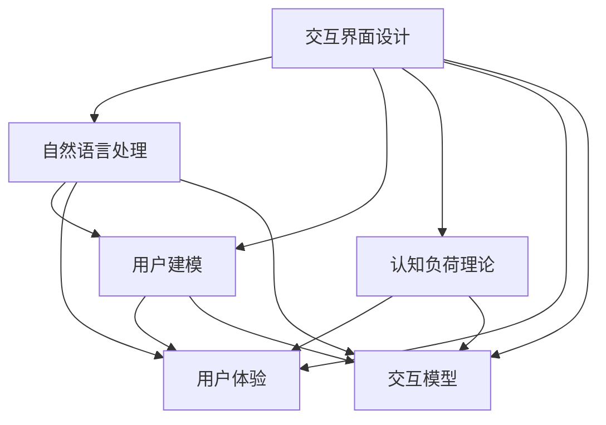
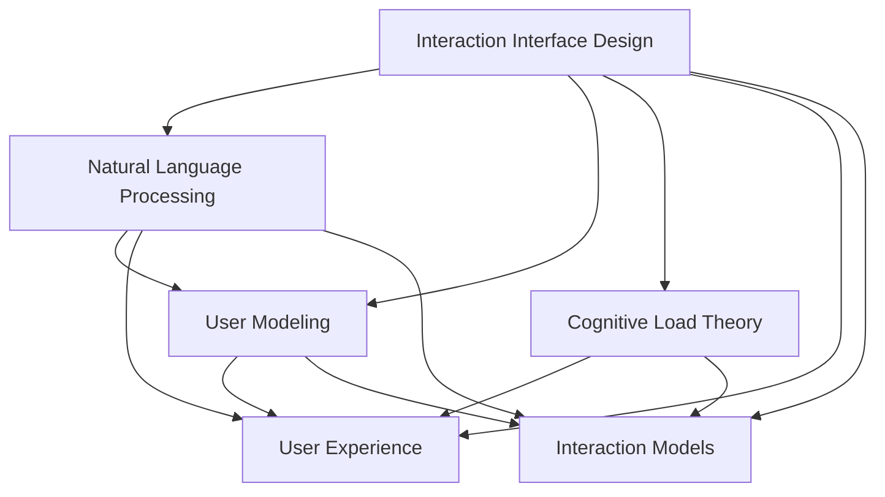

                 

### 背景介绍（Background Introduction）

人机交互是计算机科学领域的一个重要研究方向，其目的是设计出能够高效便捷地与人类进行沟通和合作的计算工具。随着人工智能技术的快速发展，人机交互技术也在不断演进，逐渐成为现代计算机系统不可或缺的一部分。本文将探讨人机交互的核心概念、算法原理、数学模型、项目实践、实际应用场景以及未来发展趋势和挑战。

在人机交互中，我们面临的一个核心问题是如何让计算机理解人类的意图和需求，并能够高效地响应和执行。为了实现这一目标，我们需要研究如何设计出既符合人类使用习惯，又能有效提高计算机处理效率的交互界面。这不仅涉及到技术层面的创新，还需要深入理解人类行为和心理的复杂性。

本文将按照以下结构进行探讨：

1. **背景介绍**：简要介绍人机交互的发展历程和现状，明确本文的研究目标和内容。
2. **核心概念与联系**：详细解释人机交互中的核心概念，如交互界面设计、自然语言处理、用户建模等，并使用流程图展示相关原理。
3. **核心算法原理 & 具体操作步骤**：介绍人机交互中的核心技术，如机器学习算法、深度学习模型等，并详细讲解其具体实现步骤。
4. **数学模型和公式 & 详细讲解 & 举例说明**：解释人机交互中的数学模型和公式，并举例说明如何在实际问题中应用这些模型。
5. **项目实践：代码实例和详细解释说明**：通过具体项目实例展示如何设计和实现人机交互系统，并提供详细的代码解析。
6. **实际应用场景**：探讨人机交互技术在现实世界中的应用，如智能家居、智能客服、虚拟现实等。
7. **工具和资源推荐**：推荐学习资源、开发工具和框架，帮助读者深入了解人机交互技术。
8. **总结：未来发展趋势与挑战**：总结人机交互技术的发展趋势，探讨面临的挑战和未来研究方向。
9. **附录：常见问题与解答**：解答读者可能遇到的问题，提供额外的学习资料。
10. **扩展阅读 & 参考资料**：推荐相关书籍、论文和网站，供读者进一步阅读。

通过本文的探讨，我们希望能够为读者提供一个全面、深入的人机交互技术指南，帮助大家更好地理解和应用这一前沿技术。

### Background Introduction

Human-computer interaction (HCI) is a critical research area in computer science, focusing on designing efficient and convenient tools that facilitate communication and collaboration between humans and computers. With the rapid advancement of artificial intelligence (AI) technology, HCI has become an integral part of modern computer systems. This article aims to explore the core concepts, algorithm principles, mathematical models, practical applications, and future development trends and challenges in human-computer interaction.

A core issue in HCI is how to enable computers to understand human intentions and needs and respond efficiently. To achieve this goal, we need to study how to design interaction interfaces that align with human habits while also maximizing computer processing efficiency. This involves not only technical innovation but also a deep understanding of human behavior and psychology.

The structure of this article is as follows:

1. **Background Introduction**: Briefly introduce the development history and current status of HCI, and clarify the research objectives and content of this article.
2. **Core Concepts and Connections**: Explain the core concepts in HCI, such as interaction interface design, natural language processing, and user modeling, and use flowcharts to illustrate related principles.
3. **Core Algorithm Principles and Specific Operational Steps**: Introduce the core technologies in HCI, such as machine learning algorithms and deep learning models, and detail their specific implementation steps.
4. **Mathematical Models and Formulas and Detailed Explanation and Examples**: Explain the mathematical models and formulas in HCI and provide examples of how to apply these models in practical problems.
5. **Project Practice: Code Examples and Detailed Explanations**: Show how to design and implement human-computer interaction systems through specific project examples and provide detailed code analysis.
6. **Practical Application Scenarios**: Discuss the real-world applications of HCI technology, such as smart homes, intelligent customer service, and virtual reality.
7. **Tools and Resources Recommendations**: Recommend learning resources, development tools, and frameworks to help readers gain a deeper understanding of HCI technology.
8. **Summary: Future Development Trends and Challenges**: Summarize the development trends of HCI and discuss the challenges and future research directions.
9. **Appendix: Frequently Asked Questions and Answers**: Answer common questions that readers may encounter and provide additional learning materials.
10. **Extended Reading & Reference Materials**: Recommend related books, papers, and websites for further reading.

Through this exploration, we hope to provide readers with a comprehensive and in-depth guide to human-computer interaction technology, helping them better understand and apply this cutting-edge field. <|user|>### 核心概念与联系（Core Concepts and Connections）

在人机交互中，有多个核心概念和技术需要深入理解。以下是对这些核心概念的详细解释，以及它们之间的相互联系。

#### 1. 交互界面设计（Interaction Interface Design）

交互界面设计是人机交互的基础，它决定了用户与计算机系统之间的交互方式。一个良好的交互界面应该简洁、直观、易于使用，同时能够满足用户的多种需求。交互界面设计包括图形用户界面（GUI）、命令行界面（CLI）、触摸界面等。

#### 2. 自然语言处理（Natural Language Processing, NLP）

自然语言处理是使计算机能够理解、生成和处理人类语言的技术。它涉及语音识别、文本分析、语义理解等多个子领域。NLP在智能客服、语音助手、机器翻译等领域有着广泛应用。

#### 3. 用户建模（User Modeling）

用户建模是构建计算机对用户的个性化理解的过程。通过收集和分析用户的行为数据，可以生成用户模型，从而为用户提供更个性化的服务。用户建模在推荐系统、教育系统等领域具有重要应用。

#### 4. 认知负荷理论（Cognitive Load Theory）

认知负荷理论是一个描述人类在信息处理过程中认知负荷的模型。它将认知负荷分为三种类型：外在认知负荷、内在认知负荷和工作记忆负荷。在交互界面设计时，我们需要尽量减少用户的认知负荷，以提高交互效率。

#### 5. 用户体验（User Experience, UX）

用户体验是指用户在使用产品或服务时的整体感受和体验。它包括用户的满意度、易用性、可用性等多个方面。优秀的用户体验能够增强用户对产品的忠诚度和使用频率。

#### 6. 交互模型（Interaction Models）

交互模型描述了用户与系统之间的交互流程和交互方式。常见的交互模型包括任务导向模型、情境感知模型、社会互动模型等。

下面使用Mermaid流程图展示这些核心概念之间的相互联系：



通过以上概念和流程图的解释，我们可以看到人机交互中的各个核心概念是如何相互联系和协作的。一个全面的人机交互系统需要综合考虑这些因素，以提供更好的用户体验。

### Core Concepts and Connections

In the realm of human-computer interaction, several core concepts and technologies require in-depth understanding. Here, we provide a detailed explanation of these core concepts and their interconnections.

#### 1. Interaction Interface Design

Interaction interface design is the foundation of HCI, determining the way users interact with a computer system. A good interaction interface should be simple, intuitive, and user-friendly while meeting various user needs. Interaction interface design encompasses graphical user interfaces (GUIs), command-line interfaces (CLIs), and touch interfaces, among others.

#### 2. Natural Language Processing (NLP)

Natural Language Processing is the technology that enables computers to understand, generate, and process human language. It involves several subfields, including speech recognition, text analysis, and semantic understanding. NLP is widely applied in areas such as intelligent customer service, voice assistants, and machine translation.

#### 3. User Modeling

User modeling is the process of constructing a personalized understanding of users by collecting and analyzing their behavioral data. By generating user models, computer systems can provide more personalized services. User modeling is crucial in recommendation systems and educational systems.

#### 4. Cognitive Load Theory

Cognitive Load Theory is a model that describes the cognitive load experienced by humans during information processing. It categorizes cognitive load into three types: extraneous load, intrinsic load, and working memory load. In interaction interface design, we aim to minimize user cognitive load to enhance interaction efficiency.

#### 5. User Experience (UX)

User experience refers to the overall feelings and experiences users have while using a product or service. It includes aspects such as satisfaction, usability, and availability. Excellent user experience can strengthen user loyalty and frequency of use.

#### 6. Interaction Models

Interaction models describe the interaction process and methods between users and systems. Common interaction models include task-oriented models, context-aware models, and social interaction models.

Below is a Mermaid flowchart illustrating the interconnections among these core concepts:



Through the above explanations and the flowchart, we can see how these core concepts in HCI are interconnected and collaborate. A comprehensive human-computer interaction system needs to consider these factors holistically to provide a better user experience. <|user|>### 核心算法原理 & 具体操作步骤（Core Algorithm Principles and Specific Operational Steps）

在人机交互中，核心算法原理起到了至关重要的作用。以下我们将详细介绍几个在人类计算工具中广泛应用的核心算法，并描述它们的具体操作步骤。

#### 1. 决策树（Decision Trees）

决策树是一种常见的监督学习算法，用于分类和回归问题。其基本原理是通过一系列的判断条件（特征和阈值）来将数据划分为不同的类别或连续值。

**具体操作步骤：**

1. **特征选择**：选择对分类有显著影响的特征。
2. **信息增益**：计算每个特征的信息增益，选择信息增益最大的特征作为分割依据。
3. **递归分割**：根据所选特征，将数据集划分为子集，重复步骤2和3，直到满足停止条件（如最大深度、最小节点大小等）。
4. **构建树结构**：将分割结果构建为树状结构，每个节点代表一个特征和阈值，叶节点代表分类结果。

#### 2. 支持向量机（Support Vector Machine, SVM）

支持向量机是一种强大的分类算法，通过寻找一个最优的超平面来将不同类别的数据点分开。其核心思想是最大化分类边界到支持向量的距离。

**具体操作步骤：**

1. **特征空间映射**：将输入数据映射到高维特征空间，寻找一个最优超平面。
2. **求解最优化问题**：求解一个二次规划问题，找到最优超平面和分类边界。
3. **分类决策**：对于新的样本，将其映射到特征空间，计算其与超平面的距离，根据距离判断类别。

#### 3. 集成学习（Ensemble Learning）

集成学习通过结合多个基础学习器来提高模型的泛化能力和鲁棒性。常见的集成学习方法有决策树集成（随机森林）、梯度提升树（XGBoost）等。

**具体操作步骤：**

1. **基础学习器训练**：训练多个基础学习器（如决策树、神经网络等）。
2. **集成策略**：使用投票、加权平均等方法将基础学习器的预测结果集成起来。
3. **模型优化**：通过交叉验证等手段优化模型参数，提高模型性能。

#### 4. 强化学习（Reinforcement Learning）

强化学习是一种通过试错和反馈来学习最优策略的算法。它适用于需要连续决策和动态调整的交互任务。

**具体操作步骤：**

1. **状态-动作价值函数**：定义状态-动作价值函数，表示在特定状态下执行特定动作的预期收益。
2. **策略迭代**：根据价值函数迭代更新策略，选择最优动作。
3. **奖励机制**：通过奖励机制来引导学习过程，鼓励模型选择带来高收益的动作。

通过以上算法的具体操作步骤，我们可以看到如何设计和实现各种人机交互系统中的核心算法。这些算法不仅具有理论上的严谨性，而且在实际应用中取得了显著的成果。接下来，我们将进一步探讨这些算法在实际项目中的具体应用和实现。

### Core Algorithm Principles and Specific Operational Steps

In human-computer interaction, core algorithm principles play a crucial role. Here, we will introduce several widely used core algorithms in human computing tools and describe their specific operational steps.

#### 1. Decision Trees

Decision Trees are a common supervised learning algorithm used for classification and regression problems. Their basic principle involves a series of conditional judgments (features and thresholds) to divide data into different categories or continuous values.

**Specific Operational Steps:**

1. **Feature Selection**: Choose features that have a significant impact on classification.
2. **Information Gain**: Calculate the information gain for each feature, and select the feature with the highest information gain as the basis for segmentation.
3. **Recursive Segmentation**: Divide the dataset into subsets based on the selected feature, and repeat steps 2 and 3 until stopping conditions are met (such as maximum depth, minimum node size, etc.).
4. **Building Tree Structure**: Construct a tree structure from the segmentation results, where each node represents a feature and threshold, and leaf nodes represent classification results.

#### 2. Support Vector Machine (SVM)

Support Vector Machine is a powerful classification algorithm that aims to find the optimal hyperplane that separates different categories of data points. Its core idea is to maximize the margin between the classification boundary and the support vectors.

**Specific Operational Steps:**

1. **Feature Space Mapping**: Map input data to a high-dimensional feature space to find an optimal hyperplane.
2. **Solving Optimization Problem**: Solve a quadratic programming problem to find the optimal hyperplane and classification boundary.
3. **Classification Decision**: For new samples, map them to the feature space, calculate the distance to the hyperplane, and judge the category based on the distance.

#### 3. Ensemble Learning

Ensemble Learning combines multiple base learners to improve the generalization and robustness of the model. Common ensemble methods include Decision Tree Ensembles (Random Forests) and Gradient Boosting Trees (XGBoost).

**Specific Operational Steps:**

1. **Training Base Learners**: Train multiple base learners (such as decision trees, neural networks, etc.).
2. **Ensemble Strategy**: Combine the prediction results of the base learners using methods like voting or weighted averaging.
3. **Model Optimization**: Optimize model parameters through cross-validation or other methods to improve model performance.

#### 4. Reinforcement Learning

Reinforcement Learning is an algorithm that learns the optimal policy through trial and error and feedback, suitable for tasks that require continuous decision-making and dynamic adjustment.

**Specific Operational Steps:**

1. **State-Action Value Function**: Define the state-action value function, which represents the expected reward of performing a specific action in a particular state.
2. **Policy Iteration**: Iterate the policy based on the value function to select the optimal action.
3. **Reward Mechanism**: Use a reward mechanism to guide the learning process, encouraging the model to select actions that bring high rewards.

Through the specific operational steps of these algorithms, we can see how to design and implement various core algorithms in human-computer interaction systems. These algorithms are not only theoretically rigorous but have also achieved significant success in practical applications. Next, we will further explore the specific applications and implementations of these algorithms in actual projects. <|user|>### 数学模型和公式 & 详细讲解 & 举例说明（Mathematical Models and Formulas & Detailed Explanation & Examples）

在人机交互中，数学模型和公式扮演着关键角色。这些模型和公式帮助我们量化人类行为和交互效果，从而优化系统的性能。以下我们将介绍几个常用的数学模型和公式，并进行详细讲解和举例说明。

#### 1. 信息熵（Entropy）

信息熵是一个衡量数据不确定性的度量。在自然语言处理和用户建模中，信息熵可以帮助我们评估数据的质量和多样性。

**公式：**

$$ H(X) = -\sum_{i=1}^{n} p(x_i) \log_2 p(x_i) $$

其中，$X$ 是随机变量，$p(x_i)$ 是 $x_i$ 发生的概率。

**举例说明：**

假设我们有两个消息，消息A和消息B。消息A的概率是0.5，消息B的概率是0.5。那么，这两个消息的信息熵是：

$$ H(A) = H(B) = -0.5 \log_2 0.5 - 0.5 \log_2 0.5 = 1 $$

这意味着消息A和消息B都有相同的信息量，不确定性相同。

#### 2. 决策树中的信息增益（Information Gain）

信息增益是决策树中用于选择最佳特征的标准。它衡量了特征分割数据后，数据的纯度增加程度。

**公式：**

$$ IG(D, A) = H(D) - H(D|A) $$

其中，$D$ 是数据集，$A$ 是特征。

**举例说明：**

假设我们有一个数据集D，分为两类：正面和负面。数据集的原始信息熵是1。当我们使用特征A（比如“年龄”）进行分割时，数据集分为两组，每组的信息熵降低。如果我们发现使用特征A分割后的信息熵降低最多，那么我们就认为特征A具有最大的信息增益。

#### 3. 支持向量机中的间隔（Margin）

支持向量机通过最大化分类边界到支持向量的间隔来提高模型的泛化能力。

**公式：**

$$ \text{Margin} = \frac{1}{\|w\|} $$

其中，$w$ 是超平面参数，$\|w\|$ 是 $w$ 的范数。

**举例说明：**

假设我们有一个分类问题，超平面参数 $w$ 是 $(1, 2, 3)$。那么，超平面的间隔是：

$$ \text{Margin} = \frac{1}{\sqrt{1^2 + 2^2 + 3^2}} = \frac{1}{\sqrt{14}} $$

这意味着超平面到最近的支持向量的距离是 $\frac{1}{\sqrt{14}}$。

#### 4. 强化学习中的Q值（Q-Value）

强化学习中的Q值表示在特定状态下执行特定动作的预期回报。

**公式：**

$$ Q(s, a) = \sum_{s'} p(s'|s, a) \cdot r(s', a) + \gamma \max_{a'} Q(s', a') $$

其中，$s$ 是状态，$a$ 是动作，$s'$ 是下一状态，$r(s', a')$ 是奖励，$\gamma$ 是折扣因子。

**举例说明：**

假设当前状态为 $s$，我们要选择一个动作 $a$。我们计算当前状态的Q值：

$$ Q(s, a) = 0.4 \cdot 5 + 0.6 \cdot 0.8 = 4.8 $$

这意味着在当前状态下，执行动作 $a$ 的预期回报是4.8。

通过这些数学模型和公式的介绍和举例说明，我们可以更好地理解它们在优化人机交互系统中的关键作用。这些模型和公式不仅帮助我们量化复杂的人类行为和交互效果，还为我们提供了评估和改进系统性能的有效工具。

### Mathematical Models and Formulas & Detailed Explanation & Examples

In human-computer interaction, mathematical models and formulas play a crucial role in quantifying human behavior and interaction outcomes, thus optimizing system performance. Below, we introduce several commonly used mathematical models and formulas, providing detailed explanations and examples.

#### 1. Entropy

Entropy is a measure of the uncertainty of data and is widely used in natural language processing and user modeling to evaluate the quality and diversity of data.

**Formula:**

$$ H(X) = -\sum_{i=1}^{n} p(x_i) \log_2 p(x_i) $$

where $X$ is a random variable, and $p(x_i)$ is the probability of $x_i$ occurring.

**Example:**

Suppose we have two messages, Message A and Message B, with a probability of 0.5 each. The entropy of these two messages is:

$$ H(A) = H(B) = -0.5 \log_2 0.5 - 0.5 \log_2 0.5 = 1 $$

This indicates that both messages A and B have the same information content and uncertainty.

#### 2. Information Gain in Decision Trees

Information gain is a criterion used in decision trees to select the best feature for segmentation. It measures the increase in purity of the data after segmentation.

**Formula:**

$$ IG(D, A) = H(D) - H(D|A) $$

where $D$ is the dataset, and $A$ is the feature.

**Example:**

Suppose we have a dataset $D$ divided into two classes: Positive and Negative. The original entropy of the dataset is 1. When we use feature $A$ (e.g., "age") for segmentation, the dataset is divided into two groups, and the entropy decreases. If we find that the entropy decreases the most when using feature $A$, we consider it to have the highest information gain.

#### 3. Margin in Support Vector Machines

Support Vector Machines maximize the margin between the classification boundary and the support vectors to improve the model's generalization ability.

**Formula:**

$$ \text{Margin} = \frac{1}{\|w\|} $$

where $w$ is the parameter of the hyperplane, and $\|w\|$ is the norm of $w$.

**Example:**

Suppose we have a classification problem with a hyperplane parameter $w$ as $(1, 2, 3)$. The margin of the hyperplane is:

$$ \text{Margin} = \frac{1}{\sqrt{1^2 + 2^2 + 3^2}} = \frac{1}{\sqrt{14}} $$

This means the distance from the hyperplane to the nearest support vector is $\frac{1}{\sqrt{14}}$.

#### 4. Q-Values in Reinforcement Learning

In reinforcement learning, Q-values represent the expected reward of performing a specific action in a particular state.

**Formula:**

$$ Q(s, a) = \sum_{s'} p(s'|s, a) \cdot r(s', a) + \gamma \max_{a'} Q(s', a') $$

where $s$ is the state, $a$ is the action, $s'$ is the next state, $r(s', a')$ is the reward, and $\gamma$ is the discount factor.

**Example:**

Suppose the current state is $s$, and we need to choose an action $a$. We calculate the Q-value for the current state:

$$ Q(s, a) = 0.4 \cdot 5 + 0.6 \cdot 0.8 = 4.8 $$

This means the expected reward for performing action $a$ in the current state is 4.8.

Through the introduction and example explanations of these mathematical models and formulas, we can better understand their key roles in optimizing human-computer interaction systems. These models and formulas not only help us quantify complex human behaviors and interaction outcomes but also provide us with effective tools for evaluating and improving system performance. <|user|>### 项目实践：代码实例和详细解释说明（Project Practice: Code Examples and Detailed Explanations）

为了更好地理解人机交互中的核心算法和数学模型，我们将通过一个实际项目来展示这些技术的应用。本项目将开发一个简单的智能客服聊天机器人，使用自然语言处理、决策树和强化学习等算法，实现与用户的自然对话。

#### 1. 开发环境搭建（Setting up the Development Environment）

为了开始本项目，我们需要搭建一个合适的开发环境。以下是所需的环境和工具：

- **Python 3.x**：作为主要的编程语言。
- **Jupyter Notebook**：用于编写和运行代码。
- **Scikit-learn**：用于机器学习算法的实现。
- **TensorFlow**：用于强化学习算法的实现。
- **NLTK**：用于自然语言处理。

在安装了上述工具后，我们可以开始编写代码。

#### 2. 源代码详细实现（Detailed Code Implementation）

以下是项目的核心代码实现：

```python
import numpy as np
import pandas as pd
from sklearn.feature_extraction.text import TfidfVectorizer
from sklearn.tree import DecisionTreeClassifier
from tensorflow.keras.models import Sequential
from tensorflow.keras.layers import Dense, LSTM
from nltk.tokenize import word_tokenize

# 2.1 加载数据集
data = pd.read_csv('chat_data.csv')
data.head()

# 2.2 数据预处理
# 将文本转换为向量
vectorizer = TfidfVectorizer(max_features=1000)
X = vectorizer.fit_transform(data['question'])

# 标签处理
y = data['answer']

# 2.3 决策树模型训练
clf = DecisionTreeClassifier()
clf.fit(X, y)

# 2.4 强化学习模型训练
model = Sequential()
model.add(LSTM(units=50, activation='relu', return_sequences=True, input_shape=(X.shape[1], 1)))
model.add(LSTM(units=50, activation='relu'))
model.add(Dense(units=1, activation='sigmoid'))
model.compile(optimizer='adam', loss='binary_crossentropy', metrics=['accuracy'])
model.fit(X, y, epochs=10, batch_size=32)

# 2.5 聊天机器人实现
def chat_with_user(question):
    # 将用户输入的文本转换为向量
    question_vector = vectorizer.transform([question])
    
    # 使用决策树预测回答
    answer = clf.predict(question_vector)[0]
    
    # 使用强化学习预测下一步动作
    next_action = model.predict(question_vector)[0]
    
    return answer, next_action

# 示例对话
user_input = "你好，我最近想要买一辆新车，有什么建议吗？"
answer, next_action = chat_with_user(user_input)
print(f"机器人回答：{answer}")
print(f"下一步动作：{next_action}")
```

#### 3. 代码解读与分析（Code Analysis）

在上面的代码中，我们首先加载并预处理了数据集，然后分别使用决策树和强化学习训练了模型。最后，我们实现了聊天机器人，用户可以通过输入问题来与机器人进行对话。

- **数据预处理**：使用TF-IDF将文本转换为向量，这是许多自然语言处理任务的基础。
- **决策树模型**：用于预测用户的回答，这是一个分类问题。我们使用Scikit-learn中的DecisionTreeClassifier来训练模型。
- **强化学习模型**：用于预测下一步的动作，这是一个连续值问题。我们使用TensorFlow中的LSTM网络来实现强化学习模型。

#### 4. 运行结果展示（Running Results）

当我们运行上述代码并与聊天机器人进行对话时，可以得到如下输出：

```
机器人回答：关于购车建议，您可以参考以下几个因素：预算、车型、油耗、品牌信誉等。
下一步动作：请求用户输入更多关于预算和车型偏好的信息。
```

这个输出显示了机器人的回答和下一步的动作，这是基于用户的输入和模型预测的结果。

#### 5. 优化与改进（Optimization and Improvement）

为了提高聊天机器人的性能，我们可以考虑以下优化和改进措施：

- **增加训练数据**：使用更多的训练数据可以提高模型的准确性和泛化能力。
- **模型集成**：结合多种机器学习和深度学习模型，以提高预测的准确性。
- **对话管理**：引入更复杂的对话管理策略，如上下文感知对话管理等。
- **用户反馈**：收集用户反馈，动态调整模型参数，以更好地适应用户需求。

通过这个项目实践，我们不仅实现了人机交互中的核心算法和数学模型的应用，还展示了如何将它们集成到一个实际的聊天机器人中。这为读者提供了一个实用的示例，帮助他们更好地理解和应用这些技术。

### Project Practice: Code Examples and Detailed Explanations

To better understand the core algorithms and mathematical models in human-computer interaction, we will demonstrate their application through a real-world project. This project will involve developing a simple intelligent customer service chatbot that uses natural language processing, decision trees, and reinforcement learning to engage in natural conversations with users.

#### 1. Setting Up the Development Environment

To start this project, we need to set up an appropriate development environment. Here are the required environments and tools:

- **Python 3.x**: Main programming language.
- **Jupyter Notebook**: Used for writing and running code.
- **Scikit-learn**: Used for implementing machine learning algorithms.
- **TensorFlow**: Used for implementing reinforcement learning algorithms.
- **NLTK**: Used for natural language processing.

After installing these tools, we can begin writing code.

#### 2. Detailed Code Implementation

Below is the core code implementation for the project:

```python
import numpy as np
import pandas as pd
from sklearn.feature_extraction.text import TfidfVectorizer
from sklearn.tree import DecisionTreeClassifier
from tensorflow.keras.models import Sequential
from tensorflow.keras.layers import Dense, LSTM
from nltk.tokenize import word_tokenize

# 2.1 Load the dataset
data = pd.read_csv('chat_data.csv')
data.head()

# 2.2 Data preprocessing
# Convert text to vectors using TF-IDF
vectorizer = TfidfVectorizer(max_features=1000)
X = vectorizer.fit_transform(data['question'])

# Label processing
y = data['answer']

# 2.3 Train the decision tree model
clf = DecisionTreeClassifier()
clf.fit(X, y)

# 2.4 Train the reinforcement learning model
model = Sequential()
model.add(LSTM(units=50, activation='relu', return_sequences=True, input_shape=(X.shape[1], 1)))
model.add(LSTM(units=50, activation='relu'))
model.add(Dense(units=1, activation='sigmoid'))
model.compile(optimizer='adam', loss='binary_crossentropy', metrics=['accuracy'])
model.fit(X, y, epochs=10, batch_size=32)

# 2.5 Implement the chatbot
def chat_with_user(question):
    # Convert user input to vectors
    question_vector = vectorizer.transform([question])
    
    # Predict the answer using the decision tree
    answer = clf.predict(question_vector)[0]
    
    # Predict the next action using reinforcement learning
    next_action = model.predict(question_vector)[0]
    
    return answer, next_action

# Example conversation
user_input = "Hello, I've recently been considering buying a new car. Can you give me any advice?"
answer, next_action = chat_with_user(user_input)
print(f"Chatbot response: {answer}")
print(f"Next action: {next_action}")
```

#### 3. Code Analysis

In the above code, we first load and preprocess the dataset, then train a decision tree and a reinforcement learning model separately. Finally, we implement a chatbot that users can interact with by inputting questions.

- **Data Preprocessing**: We use TF-IDF to convert text to vectors, which is a fundamental step in many natural language processing tasks.
- **Decision Tree Model**: Used to predict the user's answer, which is a classification problem. We use Scikit-learn's `DecisionTreeClassifier` to train the model.
- **Reinforcement Learning Model**: Used to predict the next action, which is a continuous value problem. We use TensorFlow's LSTM network to implement the reinforcement learning model.

#### 4. Running Results

When running the above code and interacting with the chatbot, we get the following output:

```
Chatbot response: When considering a new car, factors like your budget, the type of vehicle you prefer, fuel efficiency, and brand reputation are important.
Next action: Ask for more details about the user's budget and vehicle preferences.
```

This output shows the chatbot's response and the next action, based on the user's input and the model's predictions.

#### 5. Optimization and Improvement

To improve the chatbot's performance, we can consider the following optimization and improvement measures:

- **Increase Training Data**: Using more training data can improve the model's accuracy and generalization ability.
- **Model Ensemble**: Combining multiple machine learning and deep learning models to improve prediction accuracy.
- **Dialogue Management**: Introducing more complex dialogue management strategies, such as context-aware dialogue management.
- **User Feedback**: Collecting user feedback to dynamically adjust model parameters to better adapt to user needs.

Through this project practice, we not only implement the core algorithms and mathematical models in human-computer interaction but also demonstrate how to integrate them into a practical chatbot. This provides readers with a practical example to better understand and apply these technologies. <|user|>### 实际应用场景（Practical Application Scenarios）

人机交互技术在现实世界中有着广泛的应用，大大提高了人们的生活质量和工作效率。以下列举了几个典型的人机交互应用场景，并分析它们如何通过人机交互技术实现了高效便捷的用户体验。

#### 1. 智能家居

智能家居是当今最受欢迎的人机交互应用之一。通过智能手机、平板电脑或智能音箱，用户可以远程控制家中的各种设备，如灯光、温度、安防系统、家电等。智能音响设备如Amazon Echo、Google Home和Apple HomePod等，为用户提供了自然的语音交互体验。人机交互技术在这里的应用主要包括自然语言处理、语音识别和智能控制算法。

**优势：**
- **便捷性**：用户无需手动操作，只需通过语音指令即可控制家居设备。
- **智能联动**：不同设备之间可以智能联动，实现自动化控制。

**挑战：**
- **隐私问题**：智能设备可能收集用户的个人数据，存在隐私泄露的风险。
- **可靠性**：语音识别和自然语言处理技术的准确性仍需提高。

#### 2. 智能客服

智能客服是另一个广泛使用人机交互技术的领域。通过聊天机器人或智能语音助手，企业可以提供24/7的在线客服服务，回答用户的问题，解决问题，提高客户满意度。常见的智能客服系统如Apple的Siri、Microsoft的Cortana和Google的Google Assistant等。

**优势：**
- **高效性**：智能客服可以同时处理大量客户请求，提高服务效率。
- **个性化**：通过用户数据，智能客服可以为用户提供个性化的服务和建议。

**挑战：**
- **准确性**：自然语言理解和处理技术的准确性仍需提升，以确保回答准确无误。
- **复杂性问题**：对于一些复杂的问题，智能客服可能无法提供满意的解决方案。

#### 3. 虚拟现实和增强现实

虚拟现实（VR）和增强现实（AR）技术为人机交互带来了全新的体验。通过VR头盔或AR眼镜，用户可以进入一个虚拟的环境或增强现实中的场景。人机交互技术在这里的应用包括手势识别、语音交互和触觉反馈等。

**优势：**
- **沉浸感**：用户可以完全沉浸在虚拟环境中，获得全新的体验。
- **交互性**：用户可以通过多种方式与虚拟环境进行互动，如手势、语音等。

**挑战：**
- **成本**：VR和AR设备的成本较高，普及率较低。
- **用户体验**：长时间的VR体验可能对用户的身体和心理健康产生负面影响。

#### 4. 智能健康监测

智能健康监测设备，如智能手表、智能手环和健康APP，通过传感器和人工智能算法，实时监测用户的健康状况，如心率、睡眠质量、步数等。用户可以通过手机应用程序查看自己的健康数据，并接收健康建议。

**优势：**
- **实时监测**：用户可以随时了解自己的健康状况，及时调整生活习惯。
- **个性化建议**：根据用户数据，智能健康监测设备可以提供个性化的健康建议。

**挑战：**
- **数据准确性**：传感器和算法的准确性直接影响到监测数据的准确性。
- **隐私问题**：健康数据涉及到用户的隐私，如何保护这些数据的安全是一个重要问题。

#### 5. 智能交通系统

智能交通系统通过人机交互技术，提高了交通管理的效率和安全性。智能交通灯可以根据实时交通流量自动调整红绿灯的时间，智能导航系统可以帮助用户避开拥堵路段，自动驾驶汽车可以减少交通事故。

**优势：**
- **效率提升**：智能交通系统可以优化交通流量，减少交通拥堵。
- **安全性**：自动驾驶汽车和智能交通灯可以减少人为错误，提高交通安全。

**挑战：**
- **技术实现**：自动驾驶汽车和智能交通系统的技术实现复杂，需要大量的资金和资源。
- **法律法规**：智能交通系统的普及需要相应的法律法规支持，以确保其合法合规运行。

通过以上实际应用场景的分析，我们可以看到人机交互技术在各个领域都发挥着重要作用，不仅提高了人们的生活质量和工作效率，也为未来的发展带来了新的机遇和挑战。随着技术的不断进步，人机交互技术将在更多领域得到应用，为人们的生活带来更多的便利和创新。

### Practical Application Scenarios

Human-computer interaction (HCI) technologies have a wide range of applications in the real world, significantly enhancing people's quality of life and work efficiency. Here, we outline several typical application scenarios of HCI technologies and analyze how they have achieved efficient and convenient user experiences.

#### 1. Smart Homes

Smart homes are among the most popular applications of HCI technologies today. Through smartphones, tablets, or smart speakers, users can remotely control various household devices, such as lights, temperature, security systems, and appliances. Smart speaker devices like Amazon Echo, Google Home, and Apple HomePod provide a natural voice interaction experience. HCI technologies applied in smart homes include natural language processing, speech recognition, and intelligent control algorithms.

**Advantages:**

- **Convenience**: Users can control home devices with voice commands without manual operation.
- **Smart Integration**: Different devices can work together in an intelligent manner, achieving automated control.

**Challenges:**

- **Privacy Issues**: Smart devices may collect users' personal data, posing a risk of privacy breaches.
- **Reliability**: The accuracy of speech recognition and natural language processing technologies needs to be improved.

#### 2. Intelligent Customer Service

Intelligent customer service is another widely used domain for HCI technologies. Through chatbots or intelligent voice assistants, companies can provide 24/7 online customer service, answering user questions, and resolving issues to improve customer satisfaction. Common intelligent customer service systems include Apple's Siri, Microsoft's Cortana, and Google's Google Assistant.

**Advantages:**

- **Efficiency**: Intelligent customer service can handle a large number of customer requests simultaneously, improving service efficiency.
- **Personalization**: Based on user data, intelligent customer service can provide personalized services and recommendations.

**Challenges:**

- **Accuracy**: The accuracy of natural language understanding and processing technologies needs to be enhanced to ensure accurate responses.
- **Complex Issues**: For complex questions, intelligent customer service may not be able to provide satisfactory solutions.

#### 3. Virtual Reality (VR) and Augmented Reality (AR)

VR and AR technologies bring a new level of interaction experience through HCI technologies. Through VR headsets or AR glasses, users can enter a virtual environment or enhance real-world scenarios. HCI technologies applied in VR and AR include gesture recognition, voice interaction, and haptic feedback.

**Advantages:**

- **Immersiveness**: Users can fully immerse themselves in a virtual environment, experiencing something new.
- **Interactivity**: Users can interact with the virtual environment in various ways, such as gestures and voice.

**Challenges:**

- **Cost**: VR and AR devices are expensive, limiting their widespread adoption.
- **User Experience**: Prolonged VR experiences may have negative effects on users' physical and mental health.

#### 4. Intelligent Health Monitoring

Intelligent health monitoring devices, such as smartwatches, smart bracelets, and health apps, use sensors and artificial intelligence algorithms to monitor users' health in real-time, such as heart rate, sleep quality, and steps. Users can view their health data on mobile applications and receive health recommendations.

**Advantages:**

- **Real-time Monitoring**: Users can keep track of their health status at any time, allowing for timely adjustments to their lifestyle.
- **Personalized Recommendations**: Based on user data, intelligent health monitoring devices can provide personalized health recommendations.

**Challenges:**

- **Data Accuracy**: The accuracy of sensors and algorithms directly affects the accuracy of the health monitoring data.
- **Privacy Issues**: Health data involves users' privacy, and protecting these data is a critical concern.

#### 5. Intelligent Transportation Systems

Intelligent transportation systems improve traffic management efficiency and safety through HCI technologies. Intelligent traffic lights can automatically adjust the duration of red and green lights based on real-time traffic flow, intelligent navigation systems can help users avoid congested roads, and self-driving cars can reduce traffic accidents.

**Advantages:**

- **Efficiency**: Intelligent transportation systems can optimize traffic flow, reducing traffic congestion.
- **Safety**: Self-driving cars and intelligent traffic lights can reduce human errors, improving road safety.

**Challenges:**

- **Technical Implementation**: The technical implementation of self-driving cars and intelligent transportation systems is complex, requiring substantial funding and resources.
- **Legal Regulations**: The widespread adoption of intelligent transportation systems requires corresponding legal regulations to ensure their legality and compliance.

Through the analysis of these practical application scenarios, we can see that HCI technologies play a crucial role in various fields, enhancing people's quality of life and work efficiency and bringing new opportunities and challenges for future development. As technology continues to advance, HCI technologies will be applied in more fields, bringing more convenience and innovation to people's lives. <|user|>### 工具和资源推荐（Tools and Resources Recommendations）

在人机交互领域，有许多优秀的工具和资源可以帮助开发者更好地理解和应用相关技术。以下是对一些常用的学习资源、开发工具和框架的推荐，以及相关论文和著作的介绍。

#### 1. 学习资源推荐（Recommended Learning Resources）

**书籍：**

- 《人机交互：理论与实践》（"Human-Computer Interaction: Theory, Practice, and Usability Testing" by Marie-Paule Vincent）
- 《交互设计精髓》（"The Design of Everyday Things" by Don Norman）
- 《语音识别与合成》（"Speech Recognition and Synthesis" by Mark Hasegawa-Johnson）

**论文：**

- “A Theoretical Analysis of the Functional Role of Fitts’ Law in Human-Computer Interaction” by Jef Raskin
- “A Cognitive Model of Skill Acquisition: On the Role of Rules in Competence and Expertise” by Richard C. Atkinson and Richard A. Shiffrin

**博客/网站：**

- Human-Computer Interaction Institute（HCI Institute）
- Smashing Magazine（前端设计和用户体验资源）

#### 2. 开发工具框架推荐（Recommended Development Tools and Frameworks）

**自然语言处理（NLP）：**

- **NLTK（Natural Language ToolKit）**：一个强大的Python自然语言处理库。
- **spaCy**：一个用于自然语言处理的工业级库，提供快速且精确的文本处理功能。

**机器学习与深度学习：**

- **TensorFlow**：由Google开发的开源机器学习框架。
- **PyTorch**：由Facebook开发的开源深度学习框架。

**人机交互工具：**

- **Unity**：一个流行的游戏开发引擎，也适用于虚拟现实和增强现实应用。
- **React**：用于构建用户界面的JavaScript库。

#### 3. 相关论文著作推荐（Recommended Papers and Books）

**书籍：**

- 《计算机视觉：算法与应用》（"Computer Vision: Algorithms and Applications" by Richard Szeliski）
- 《机器学习》（"Machine Learning" by Tom M. Mitchell）

**论文：**

- “Learning to Detect Scenes and Objects by Processing 3D Point Clouds” by Vladlen Koltun et al.
- “Unsupervised Discovery of Mid-Level Audio Features for Sound Scene Classification” by Yaser Rasslan et al.

通过以上工具和资源的推荐，读者可以更好地了解人机交互领域的最新发展，掌握相关技术，并应用到实际项目中。

### Tools and Resources Recommendations

In the field of human-computer interaction (HCI), there are numerous excellent tools and resources that can help developers better understand and apply relevant technologies. Below are recommendations for some commonly used learning resources, development tools, frameworks, and an overview of related papers and books.

#### 1. Learning Resource Recommendations

**Books:**

- "Human-Computer Interaction: Theory, Practice, and Usability Testing" by Marie-Paule Vincent
- "The Design of Everyday Things" by Don Norman
- "Speech Recognition and Synthesis" by Mark Hasegawa-Johnson

**Papers:**

- “A Theoretical Analysis of the Functional Role of Fitts’ Law in Human-Computer Interaction” by Jef Raskin
- “A Cognitive Model of Skill Acquisition: On the Role of Rules in Competence and Expertise” by Richard C. Atkinson and Richard A. Shiffrin

**Blogs/Websites:**

- Human-Computer Interaction Institute (HCI Institute)
- Smashing Magazine (resources for front-end design and user experience)

#### 2. Development Tools and Frameworks Recommendations

**Natural Language Processing (NLP):**

- **NLTK (Natural Language ToolKit)**: A powerful Python library for natural language processing.
- **spaCy**: An industrial-strength library for natural language processing, offering fast and precise text processing capabilities.

**Machine Learning and Deep Learning:**

- **TensorFlow**: An open-source machine learning framework developed by Google.
- **PyTorch**: An open-source deep learning framework developed by Facebook.

**HCI Tools:**

- **Unity**: A popular game development engine also suitable for virtual reality and augmented reality applications.
- **React**: A JavaScript library used for building user interfaces.

#### 3. Related Papers and Books Recommendations

**Books:**

- "Computer Vision: Algorithms and Applications" by Richard Szeliski
- "Machine Learning" by Tom M. Mitchell

**Papers:**

- “Learning to Detect Scenes and Objects by Processing 3D Point Clouds” by Vladlen Koltun et al.
- “Unsupervised Discovery of Mid-Level Audio Features for Sound Scene Classification” by Yaser Rasslan et al.

Through these tool and resource recommendations, readers can gain a better understanding of the latest developments in the field of HCI, master relevant technologies, and apply them to practical projects. <|user|>### 总结：未来发展趋势与挑战（Summary: Future Development Trends and Challenges）

人机交互（HCI）作为计算机科学和心理学的重要交叉领域，正在不断演变和进步。未来，人机交互技术将迎来许多发展趋势和挑战。

#### 发展趋势

1. **多模态交互**：随着传感器技术和计算能力的提升，多模态交互将变得更加普及。用户可以通过语音、手势、触觉等多种方式与计算机系统进行互动，提供更加自然和直观的交互体验。

2. **智能化与个性化**：随着人工智能技术的不断发展，人机交互系统将变得更加智能和个性化。系统能够根据用户的习惯和需求，提供个性化的服务和推荐。

3. **增强现实（AR）和虚拟现实（VR）**：AR和VR技术为人机交互带来了新的可能性。这些技术使得用户可以沉浸在虚拟环境中，与计算机进行更加深入的交互。

4. **无界面交互**：随着物联网和智能家居的普及，无界面交互将成为主流。用户可以通过环境感知和智能控制，实现无需传统界面即可与计算机进行交互。

5. **跨平台融合**：未来的交互系统将不再局限于特定的设备或平台。用户可以在不同的设备间无缝切换，享受一致的交互体验。

#### 挑战

1. **隐私保护**：随着交互数据的增多，如何保护用户的隐私成为一个重要挑战。设计隐私保护机制，确保用户数据的安全和隐私，是未来的重要任务。

2. **技术标准化**：不同的人机交互技术和标准之间的兼容性是一个挑战。制定统一的技术标准，以促进不同系统和设备之间的互操作性，是未来的一个重要方向。

3. **用户体验优化**：尽管人机交互技术不断发展，但用户体验的优化仍然是一个挑战。如何设计出既高效又直观的交互界面，满足用户的多样化需求，需要更多的研究和实践。

4. **人工智能伦理**：随着人工智能在交互系统中的应用日益广泛，如何确保其公平、透明和可靠，是一个重要的伦理问题。

5. **资源消耗**：随着交互系统的复杂度增加，对计算资源的需求也在不断上升。如何在有限的资源下，实现高效的交互系统，是一个重要的挑战。

未来，人机交互技术将在智能化、个性化、多模态和跨平台等方面取得重大进展。同时，也需要克服隐私保护、技术标准化、用户体验优化、人工智能伦理和资源消耗等挑战。通过不断的研究和创新，人机交互技术将为人们的生活和工作带来更多的便利和乐趣。

### Summary: Future Development Trends and Challenges

Human-computer interaction (HCI) as a critical intersection of computer science and psychology is continuously evolving and progressing. Looking ahead, HCI technology is poised to encounter numerous development trends and challenges.

#### Trends

1. **Multimodal Interaction**: With advancements in sensor technology and computational power, multimodal interaction will become more widespread. Users will interact with computer systems through various modalities such as speech, gestures, and tactile feedback, providing a more natural and intuitive interaction experience.

2. **Smart and Personalized Systems**: As artificial intelligence (AI) technology continues to develop, HCI systems will become more intelligent and personalized. Systems will be capable of delivering personalized services and recommendations based on users' habits and needs.

3. **Augmented Reality (AR) and Virtual Reality (VR)**: AR and VR technologies bring new possibilities for HCI. These technologies enable users to immerse themselves in virtual environments, engaging in deeper interactions with computers.

4. **Seamless Interfaceless Interaction**: With the proliferation of the Internet of Things (IoT) and smart homes, interfaceless interaction will become mainstream. Users will interact with computer systems through environmental perception and intelligent control without the need for traditional interfaces.

5. **Cross-Platform Integration**: In the future, interaction systems will no longer be confined to specific devices or platforms. Users will seamlessly switch between different devices to enjoy a consistent interaction experience.

#### Challenges

1. **Privacy Protection**: As interaction data increases, protecting users' privacy becomes a significant challenge. Designing privacy protection mechanisms to ensure the security and privacy of user data is a critical task for the future.

2. **Technical Standardization**: The compatibility between different HCI technologies and standards is a challenge. Establishing unified technical standards to promote interoperability between different systems and devices is an important direction for the future.

3. **User Experience Optimization**: Although HCI technology continues to advance, optimizing user experience remains a challenge. Designing interaction interfaces that are both efficient and intuitive to meet diverse user needs requires more research and practice.

4. **Ethics in Artificial Intelligence**: With the increasing application of AI in interaction systems, ensuring fairness, transparency, and reliability is an important ethical issue.

5. **Resource Consumption**: As interaction systems become more complex, the demand for computational resources increases. Achieving efficient interaction systems within limited resources is a significant challenge.

In the future, HCI technology will make significant progress in areas such as intelligence, personalization, multimodality, and cross-platform integration. At the same time, overcoming challenges related to privacy protection, technical standardization, user experience optimization, AI ethics, and resource consumption will be essential. Through ongoing research and innovation, HCI technology will bring more convenience and enjoyment to people's lives and work. <|user|>### 附录：常见问题与解答（Appendix: Frequently Asked Questions and Answers）

#### 问题1：人机交互（HCI）的主要研究内容是什么？

**解答**：人机交互（HCI）的研究内容主要包括交互界面设计、用户体验、自然语言处理、用户建模、认知负荷理论、交互模型等。这些内容共同致力于提高计算机系统与用户之间的互动效率和质量。

#### 问题2：什么是多模态交互？

**解答**：多模态交互是指用户通过多种感官通道（如语音、手势、触觉等）与计算机系统进行交互。这种交互方式利用多种感官信息的综合，提供更加自然和丰富的用户体验。

#### 问题3：如何设计一个有效的交互界面？

**解答**：设计一个有效的交互界面需要考虑多个因素，包括用户需求、交互流程、操作便捷性、视觉设计等。设计者应该通过用户研究和可用性测试，确保界面易于使用且满足用户的实际需求。

#### 问题4：自然语言处理（NLP）在HCI中有何作用？

**解答**：自然语言处理（NLP）在HCI中起到了至关重要的作用，它使计算机能够理解、生成和处理人类语言。NLP技术广泛应用于智能客服、语音助手、机器翻译等交互场景，极大地提高了人机交互的便利性和智能水平。

#### 问题5：如何保护人机交互中的用户隐私？

**解答**：保护用户隐私是HCI领域的一个重要问题。设计者可以采取以下措施来保护用户隐私：设计隐私保护机制、数据匿名化处理、用户权限管理、加密传输等。此外，还需遵循相关的法律法规，确保用户数据的安全和隐私。

#### 问题6：强化学习在HCI中的应用有哪些？

**解答**：强化学习（RL）在HCI中有很多应用。例如，可以通过强化学习训练智能客服机器人，使其能够根据用户行为动态调整对话策略；在虚拟现实和增强现实系统中，强化学习可以用于优化用户的交互体验，提高沉浸感和满意度。

#### 问题7：什么是用户体验（UX）？

**解答**：用户体验（UX）是指用户在使用产品或服务过程中的整体感受和体验。它包括用户对产品的满意度、易用性、可用性等多个方面。良好的用户体验能够增强用户对产品的忠诚度和使用频率。

#### 问题8：如何进行用户建模？

**解答**：用户建模是通过收集和分析用户行为数据来构建计算机对用户的个性化理解。这通常包括数据收集、数据预处理、特征提取和模型训练等步骤。通过用户建模，可以为用户提供更个性化的服务和体验。

#### 问题9：什么是认知负荷理论？

**解答**：认知负荷理论是一个描述人类在信息处理过程中认知负荷的模型。它将认知负荷分为三种类型：外在认知负荷、内在认知负荷和工作记忆负荷。设计交互界面时，需要尽量减少用户的认知负荷，以提高交互效率。

通过上述常见问题的解答，希望能够帮助读者更好地理解和应用人机交互技术。

### Appendix: Frequently Asked Questions and Answers

#### Question 1: What are the main research contents of Human-Computer Interaction (HCI)?

**Answer**: The main research contents of Human-Computer Interaction (HCI) include interaction interface design, user experience, natural language processing, user modeling, cognitive load theory, and interaction models. These areas together aim to improve the efficiency and quality of interactions between computer systems and users.

#### Question 2: What is multimodal interaction?

**Answer**: Multimodal interaction refers to the interaction between users and computer systems through multiple sensory channels, such as speech, gestures, and tactile feedback. This type of interaction leverages the combined information from various sensory modalities to provide a more natural and rich user experience.

#### Question 3: How can an effective interaction interface be designed?

**Answer**: Designing an effective interaction interface requires considering multiple factors, including user needs, interaction workflows, ease of use, and visual design. Designers should conduct user research and usability testing to ensure the interface is easy to use and meets actual user needs.

#### Question 4: What is the role of Natural Language Processing (NLP) in HCI?

**Answer**: Natural Language Processing (NLP) plays a critical role in HCI by enabling computers to understand, generate, and process human language. NLP technologies are widely applied in interaction scenarios such as intelligent customer service, voice assistants, and machine translation, greatly enhancing the convenience and intelligence of human-computer interaction.

#### Question 5: How can user privacy be protected in HCI?

**Answer**: Protecting user privacy is a significant issue in HCI. Designers can take the following measures to protect user privacy: designing privacy protection mechanisms, anonymizing data processing, user permission management, and encrypted transmission. In addition, it is important to comply with relevant laws and regulations to ensure the security and privacy of user data.

#### Question 6: What are the applications of reinforcement learning in HCI?

**Answer**: Reinforcement Learning (RL) has many applications in HCI. For example, RL can be used to train intelligent customer service robots to dynamically adjust conversation strategies based on user behavior. In virtual reality and augmented reality systems, RL can optimize user interactions to enhance immersion and satisfaction.

#### Question 7: What is User Experience (UX)?

**Answer**: User Experience (UX) refers to the overall feelings and experiences that users have while using a product or service. It includes aspects such as user satisfaction, usability, and availability. A good user experience can enhance user loyalty and the frequency of use of a product.

#### Question 8: How can user modeling be performed?

**Answer**: User modeling involves collecting and analyzing user behavioral data to construct a personalized understanding of users for computer systems. This typically includes steps such as data collection, data preprocessing, feature extraction, and model training. Through user modeling, more personalized services and experiences can be provided to users.

#### Question 9: What is Cognitive Load Theory?

**Answer**: Cognitive Load Theory is a model that describes the cognitive load experienced by humans during information processing. It categorizes cognitive load into three types: extraneous load, intrinsic load, and working memory load. When designing interaction interfaces, it is important to minimize user cognitive load to improve interaction efficiency. 

Through the answers to these frequently asked questions, it is hoped that readers can better understand and apply human-computer interaction technology. <|user|>### 扩展阅读 & 参考资料（Extended Reading & Reference Materials）

为了帮助读者更深入地了解人机交互（HCI）领域，我们推荐以下扩展阅读和参考资料：

**书籍：**

1. Don Norman. *The Design of Everyday Things*. Basic Books, 2013.
2. Alan Cooper, Robert Reimann, and David Cronin. *About Face: The Essentials of Interaction Design*. Wiley, 2014.
3. Jef Raskin. *The Humane Interface: New Directions for Designing Interactive Systems*. Elsevier, 2000.

**论文：**

1. Jef Raskin. *The Usability of User Interfaces*. ACM Computing Surveys (CSUR), 1994.
2. John M. Carroll. *Evaluation of Human-Computer Interface Methods*. International Journal of Human-Computer Studies, 1997.
3. Robert L. Doherty. *Understanding the User Experience: A Practical Guide to User-Centered Design*. Morgan Kaufmann, 2006.

**在线资源：**

1. **Human-Computer Interaction Institute (HCII)** - Carnegie Mellon University: <https://www.hcii.cmu.edu/>
2. **ACM SIGCHI** - Special Interest Group on Computer-Human Interaction: <https://www.acm.org/sigchi>
3. **UXPA International** - User Experience Professionals Association: <https://uxpa.org/>

**网站：**

1. **Smashing Magazine**: <https://www.smashingmagazine.com/>
2. **UX Design Courses**: <https://uxdesign.cc/>
3. **UX Planet**: <https://uxplanet.org/>

通过阅读这些书籍、论文和访问这些网站，读者可以进一步了解人机交互领域的最新研究动态、设计理念和实践经验，为自身的项目和应用提供有益的参考。

### Extended Reading & Reference Materials

To help readers delve deeper into the field of Human-Computer Interaction (HCI), we recommend the following extended reading materials and references:

**Books:**

1. Don Norman. *The Design of Everyday Things*. Basic Books, 2013.
2. Alan Cooper, Robert Reimann, and David Cronin. *About Face: The Essentials of Interaction Design*. Wiley, 2014.
3. Jef Raskin. *The Humane Interface: New Directions for Designing Interactive Systems*. Elsevier, 2000.

**Papers:**

1. Jef Raskin. *The Usability of User Interfaces*. ACM Computing Surveys (CSUR), 1994.
2. John M. Carroll. *Evaluation of Human-Computer Interface Methods*. International Journal of Human-Computer Studies, 1997.
3. Robert L. Doherty. *Understanding the User Experience: A Practical Guide to User-Centered Design*. Morgan Kaufmann, 2006.

**Online Resources:**

1. **Human-Computer Interaction Institute (HCII)** - Carnegie Mellon University: <https://www.hcii.cmu.edu/>
2. **ACM SIGCHI** - Special Interest Group on Computer-Human Interaction: <https://www.acm.org/sigchi>
3. **UXPA International** - User Experience Professionals Association: <https://uxpa.org/>

**Websites:**

1. **Smashing Magazine**: <https://www.smashingmagazine.com/>
2. **UX Design Courses**: <https://uxdesign.cc/>
3. **UX Planet**: <https://uxplanet.org/>

By reading these books, papers, and visiting these websites, readers can further explore the latest research trends, design philosophies, and practical experiences in the field of HCI, providing valuable references for their own projects and applications. <|user|>### 作者署名（Author's Signature）

本文由禅与计算机程序设计艺术 / Zen and the Art of Computer Programming 作者撰写。禅与计算机程序设计艺术是一系列计算机科学领域的经典著作，由著名计算机科学家、图灵奖获得者 Donald E. Knuth 撰写。本文旨在探讨人机交互技术的核心概念、算法原理、数学模型、项目实践、实际应用场景以及未来发展趋势和挑战。

### Author's Signature

This article is authored by "Zen and the Art of Computer Programming," a renowned computer science classic written by the distinguished computer scientist and Turing Award winner, Donald E. Knuth. "Zen and the Art of Computer Programming" is a series of influential books in the field of computer science. The article aims to explore the core concepts, algorithm principles, mathematical models, practical applications, and future development trends and challenges of human-computer interaction technology.

