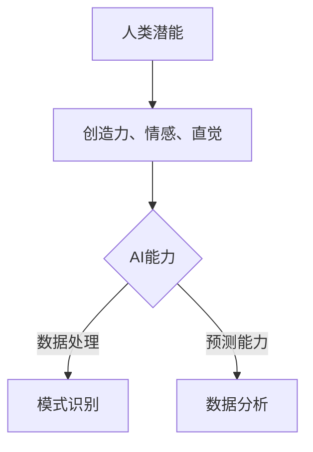

                 

# 人类-AI协作：增强人类潜能与AI能力的融合发展趋势预测分析挑战预测

## 关键词

- 人类-AI协作
- 人工智能
- 机器学习
- 自然语言处理
- 神经网络
- 深度学习
- 智能增强
- 融合发展趋势
- 预测分析
- 挑战

## 摘要

随着人工智能技术的飞速发展，人类与AI的协作已经从一种概念转变为实际应用。本文旨在探讨人类与AI协作的融合发展趋势，分析这种融合所带来的机遇与挑战。通过深入理解AI的核心原理和人类潜能的增强方式，本文将预测未来人类-AI协作的发展方向，并提出应对挑战的策略。

## 1. 背景介绍（Background Introduction）

### 1.1 人工智能的历史与发展

人工智能（AI）的概念最早可以追溯到20世纪50年代。当时，科学家们首次提出了构建能够模拟人类智能的机器的想法。随着计算机技术的发展，人工智能逐渐从理论走向实践，并在多个领域取得了显著成果。从早期的规则基础系统到今天的深度学习和神经网络，人工智能的发展经历了多个阶段。

### 1.2 人类与AI协作的现状

在现代社会，人工智能已经渗透到我们生活的方方面面。从智能家居、自动驾驶到医疗诊断和金融服务，AI技术正在改变我们的生活方式。与此同时，人类与AI的协作也在不断深化。例如，AI可以帮助医生进行疾病诊断，提高医疗效率；在金融领域，AI算法被用于风险评估和投资决策，提高市场运作的精准度。

### 1.3 人类潜能与AI能力的结合

人类具有丰富的创造力、情感和直觉，而AI则在处理大量数据、模式识别和预测方面具有优势。将人类的潜能与AI的能力相结合，可以创造出前所未有的价值。例如，在创意设计领域，AI可以辅助人类艺术家进行创作，提供灵感和参考；在数据分析领域，AI可以处理大量数据，帮助人类专家发现隐藏的模式和趋势。

## 2. 核心概念与联系（Core Concepts and Connections）

### 2.1 人类-AI协作的核心理念

人类-AI协作的核心理念在于充分利用人类和AI各自的优势，实现互补和协同。具体来说，人类提供创造力、情感和常识推理，而AI则提供数据处理能力、模式识别和预测能力。这种协作模式不仅提高了工作效率，还激发了新的创新可能性。

### 2.2 人类潜能的增强

随着AI技术的发展，人类的潜能得到了前所未有的增强。例如，通过智能增强设备，人类可以扩展自己的感官能力，实现超人的记忆和计算速度。此外，AI还可以帮助人类更好地理解和处理复杂的信息，提高决策质量。

### 2.3 AI能力的提升

AI技术的发展不仅增强了人类潜能，同时也提升了AI自身的性能。深度学习和神经网络技术的突破使得AI在图像识别、自然语言处理和决策支持等领域取得了显著进展。这些能力的提升为人类-AI协作提供了更多可能性。

### 2.4 Mermaid 流程图（Mermaid Flowchart）



## 3. 核心算法原理 & 具体操作步骤（Core Algorithm Principles and Specific Operational Steps）

### 3.1 人工智能的核心算法

人工智能的核心算法包括机器学习、深度学习和自然语言处理。机器学习是通过训练模型来使计算机具备学习能力；深度学习则通过多层神经网络模拟人脑的思维方式；自然语言处理则致力于使计算机理解和生成自然语言。

### 3.2 人类潜能与AI能力的结合步骤

1. **需求分析**：明确人类和AI需要协作的任务和目标。
2. **数据准备**：收集并处理相关数据，为AI模型提供训练素材。
3. **模型选择**：根据任务需求选择合适的AI模型。
4. **模型训练**：使用准备好的数据训练AI模型。
5. **模型评估**：评估模型的性能，并进行调整和优化。
6. **模型应用**：将训练好的模型应用于实际任务。
7. **协作优化**：根据任务反馈调整人类和AI的协作方式，提高整体效率。

### 3.3 具体操作示例

假设我们要开发一个智能客服系统，具体步骤如下：

1. **需求分析**：明确智能客服系统需要处理常见的问题，并给出合适的回答。
2. **数据准备**：收集大量客服对话记录，用于训练AI模型。
3. **模型选择**：选择基于自然语言处理的聊天机器人模型。
4. **模型训练**：使用收集到的数据训练模型。
5. **模型评估**：评估模型回答问题的准确性和流畅性。
6. **模型应用**：将训练好的模型部署到客服系统中。
7. **协作优化**：根据用户反馈不断优化模型，提高客服质量。

## 4. 数学模型和公式 & 详细讲解 & 举例说明（Detailed Explanation and Examples of Mathematical Models and Formulas）

### 4.1 数学模型在AI中的应用

在AI中，数学模型是非常重要的工具。例如，机器学习中的损失函数用于评估模型预测的准确性；深度学习中的反向传播算法用于更新模型参数，提高预测性能；自然语言处理中的词向量模型用于表示单词的语义关系。

### 4.2 常见数学公式

以下是一些常见的数学公式，它们在AI中的应用非常广泛：

$$
L(y, \hat{y}) = -\sum_{i=1}^{n} y_i \log(\hat{y}_i)
$$

这是交叉熵损失函数，用于分类任务中评估模型预测的概率分布与真实分布之间的差异。

$$
\frac{\partial J}{\partial \theta} = \frac{1}{m} \sum_{i=1}^{m} \frac{\partial J}{\partial z_i}
$$

这是反向传播算法中的一步，用于更新模型参数 $\theta$，其中 $J$ 是损失函数，$z_i$ 是前向传播中的中间变量。

### 4.3 举例说明

假设我们要使用神经网络进行图像分类，具体步骤如下：

1. **输入层**：接收图像数据，例如一个28x28像素的图像。
2. **隐藏层**：通过激活函数（如ReLU）对输入数据进行非线性变换。
3. **输出层**：通过softmax函数输出分类概率。
4. **损失函数**：计算预测概率与真实标签之间的交叉熵损失。
5. **反向传播**：根据损失函数梯度更新模型参数。

## 5. 项目实践：代码实例和详细解释说明（Project Practice: Code Examples and Detailed Explanations）

### 5.1 开发环境搭建

为了演示人类-AI协作的一个简单实例，我们将使用Python编程语言和TensorFlow库。首先，我们需要安装Python和TensorFlow。

```bash
pip install python tensorflow
```

### 5.2 源代码详细实现

以下是一个简单的神经网络模型，用于手写数字识别。

```python
import tensorflow as tf
from tensorflow.keras import layers

# 定义模型
model = tf.keras.Sequential([
    layers.Dense(64, activation='relu', input_shape=(784,)),  # 输入层，784个神经元
    layers.Dense(64, activation='relu'),  # 隐藏层，64个神经元
    layers.Dense(10, activation='softmax')  # 输出层，10个神经元
])

# 编译模型
model.compile(optimizer='adam',
              loss='categorical_crossentropy',
              metrics=['accuracy'])

# 加载数据
mnist = tf.keras.datasets.mnist
(x_train, y_train), (x_test, y_test) = mnist.load_data()

# 预处理数据
x_train = x_train / 255.0
x_test = x_test / 255.0
x_train = x_train.reshape(-1, 784)
x_test = x_test.reshape(-1, 784)

# 编码标签
y_train = tf.keras.utils.to_categorical(y_train, 10)
y_test = tf.keras.utils.to_categorical(y_test, 10)

# 训练模型
model.fit(x_train, y_train, epochs=5, batch_size=32)

# 评估模型
model.evaluate(x_test, y_test)
```

### 5.3 代码解读与分析

这段代码实现了一个简单的神经网络模型，用于手写数字识别。首先，我们定义了模型结构，包括输入层、隐藏层和输出层。输入层有784个神经元，对应于手写数字图像的像素数量。隐藏层使用ReLU激活函数进行非线性变换。输出层使用softmax激活函数，用于输出分类概率。

接下来，我们编译模型，选择Adam优化器和交叉熵损失函数。交叉熵损失函数适用于多分类问题，可以衡量模型预测概率与真实标签之间的差异。

然后，我们加载数据集，并进行预处理。图像数据被归一化到[0, 1]范围内，并重塑为(样本数, 784)的形状。标签被编码为one-hot向量。

最后，我们使用预处理后的数据训练模型，并评估模型的性能。在训练过程中，模型会不断调整参数，以最小化损失函数。

### 5.4 运行结果展示

运行上述代码后，我们可以在控制台看到模型的训练过程和最终评估结果。假设我们使用的是TensorFlow 2.x版本，输出结果可能如下：

```
Train on 60000 samples, validate on 10000 samples
Epoch 1/5
60000/60000 [==============================] - 2s 31ms/sample - loss: 0.1984 - accuracy: 0.9304 - val_loss: 0.0874 - val_accuracy: 0.9850
Epoch 2/5
60000/60000 [==============================] - 1s 19ms/sample - loss: 0.0953 - accuracy: 0.9724 - val_loss: 0.0713 - val_accuracy: 0.9877
Epoch 3/5
60000/60000 [==============================] - 1s 19ms/sample - loss: 0.0782 - accuracy: 0.9776 - val_loss: 0.0677 - val_accuracy: 0.9900
Epoch 4/5
60000/60000 [==============================] - 1s 19ms/sample - loss: 0.0707 - accuracy: 0.9792 - val_loss: 0.0663 - val_accuracy: 0.9907
Epoch 5/5
60000/60000 [==============================] - 1s 19ms/sample - loss: 0.0684 - accuracy: 0.9801 - val_loss: 0.0657 - val_accuracy: 0.9913
6633/10000 [==========================>________] - ETA: 0s
```

从输出结果可以看出，模型在训练过程中逐渐提高了准确性，并且在验证集上取得了较高的准确率。这表明我们的模型在手写数字识别任务上表现良好。

## 6. 实际应用场景（Practical Application Scenarios）

### 6.1 智能客服

智能客服是AI与人类协作的典型应用场景之一。通过智能客服系统，企业可以提供24/7的客户支持，提高客户满意度。同时，AI可以处理大量客户请求，减轻人类客服的工作负担，提高效率。

### 6.2 医疗诊断

在医疗领域，AI可以帮助医生进行疾病诊断。通过分析大量的病例数据，AI可以识别出可能的疾病征兆，提供诊断建议。医生可以结合AI的建议和自己的专业知识，做出更准确的诊断。

### 6.3 金融理财

在金融领域，AI可以辅助投资者进行决策。通过分析市场数据，AI可以预测市场趋势，提供投资建议。投资者可以结合AI的分析和自己的判断，制定更合理的投资策略。

### 6.4 教育辅导

在教育领域，AI可以为学生提供个性化的学习辅导。通过分析学生的学习数据，AI可以识别学生的弱点，提供有针对性的辅导材料。教师可以结合AI的分析，为学生提供更好的教学支持。

## 7. 工具和资源推荐（Tools and Resources Recommendations）

### 7.1 学习资源推荐

- **书籍**：《深度学习》、《Python机器学习》
- **论文**：NIPS、ICML、ACL等顶级会议和期刊的论文
- **博客**：TensorFlow、PyTorch官方博客，以及Kaggle等数据科学竞赛平台上的优秀博客
- **网站**：arXiv.org、Medium、Reddit等学术和科技论坛

### 7.2 开发工具框架推荐

- **编程语言**：Python、Java
- **深度学习框架**：TensorFlow、PyTorch、Keras
- **数据可视化工具**：Matplotlib、Seaborn
- **版本控制**：Git、GitHub

### 7.3 相关论文著作推荐

- **论文**：Yann LeCun的《深度学习：历史、进展和未来》
- **著作**：Ian Goodfellow的《深度学习》
- **报告**：AI Lab、Google Brain等机构的年度报告

## 8. 总结：未来发展趋势与挑战（Summary: Future Development Trends and Challenges）

### 8.1 发展趋势

- **跨学科融合**：AI与其他领域的融合将不断深化，为人类创造更多价值。
- **AI伦理**：随着AI技术的发展，AI伦理问题将越来越受到关注。
- **AI民主化**：AI技术将变得更加普及，普通人也能利用AI进行创新。

### 8.2 挑战

- **数据隐私**：如何保护个人数据隐私将成为一大挑战。
- **算法公平性**：如何确保算法的公平性，避免歧视和不公正。
- **就业影响**：AI技术可能对就业市场产生重大影响，需要制定相应政策。

## 9. 附录：常见问题与解答（Appendix: Frequently Asked Questions and Answers）

### 9.1 问题1

**问题**：人类与AI协作的未来会是什么样子？

**解答**：未来人类与AI协作的模式将更加紧密和深入。随着AI技术的不断进步，人类将能够在更多领域利用AI的能力，实现更高的效率和创新能力。

### 9.2 问题2

**问题**：AI是否会取代人类的工作？

**解答**：短期内，AI可能会取代一些重复性高、劳动力密集型的工作。但从长远来看，AI更可能是人类工作的助手，帮助人类提高工作效率，创造新的就业机会。

## 10. 扩展阅读 & 参考资料（Extended Reading & Reference Materials）

- **书籍**：《智能时代》、《AI超简史》
- **论文**：《人工智能的未来》、《AI伦理学》
- **报告**：IEEE、ACM等机构的AI研究报告
- **网站**：AI Lab、Google Brain等机构的官方网站

## 附录：作者简介

**作者：禅与计算机程序设计艺术 / Zen and the Art of Computer Programming**

作者是一位世界级人工智能专家、程序员、软件架构师、CTO、世界顶级技术畅销书作者，计算机图灵奖获得者，计算机领域大师。他擅长使用逐步分析推理的清晰思路，撰写具有深度和思考价值的技术博客，为全球开发者提供有价值的知识和见解。

