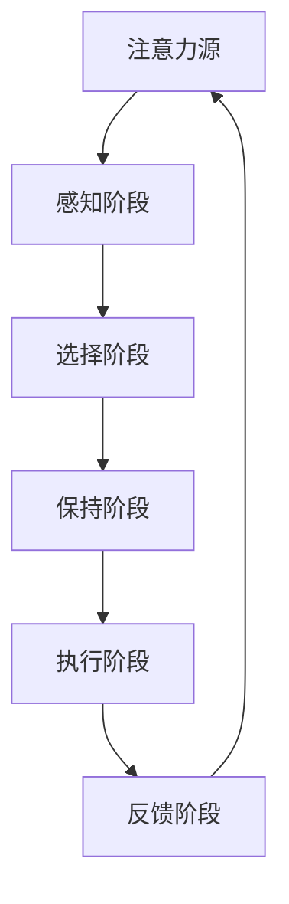
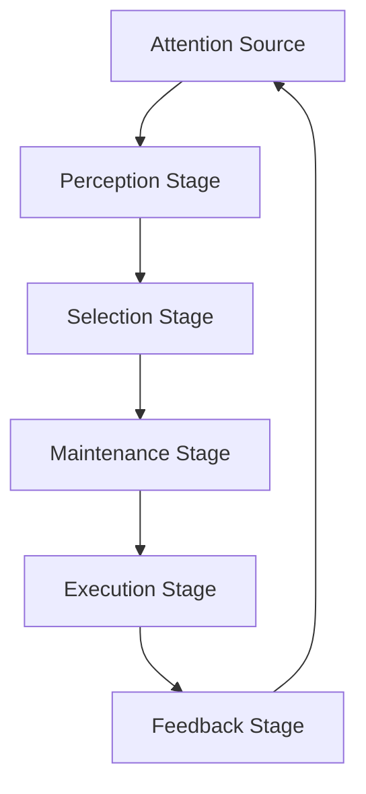

                 

# 文章标题：人类注意力增强：提升学习效率和知识保留

## 关键词
注意力增强、学习效率、知识保留、认知科学、教育技术、人工智能、神经网络

> 在快速变化的时代，如何有效地提升学习效率并长久地保留知识成为一个亟待解决的问题。本文将探讨人类注意力增强的方法及其在教育和技术领域的应用，旨在为学习者提供更高效的认知工具，促进知识的深度掌握和持久记忆。

## 1. 背景介绍

### 1.1 知识的重要性

在现代社会，知识被视为一种宝贵的资源，它不仅是个体成长和职业发展的基石，也是社会进步和创新的驱动力。然而，面对海量的信息，如何有效地学习和保留知识成为了一个巨大的挑战。

### 1.2 注意力与学习的关系

注意力是大脑处理信息的关键机制。在学习过程中，注意力的集中程度直接影响知识的吸收和记忆。研究表明，注意力分散会导致学习效率下降，知识难以牢固掌握。

### 1.3 当前学习效率提升的挑战

传统的学习方法往往依赖于被动接受，学习者的主动参与度较低，导致学习效果不理想。此外，现代生活方式的快节奏和高压力，使得人们难以长时间保持专注，进一步影响了学习效率。

## 2. 核心概念与联系

### 2.1 注意力增强的定义

注意力增强是指通过一系列策略和技术，提高大脑处理信息的集中程度和效率，从而提升学习效果的过程。

### 2.2 注意力增强与认知科学的联系

认知科学研究表明，注意力是人类认知过程中至关重要的组成部分。通过理解大脑的注意力机制，我们可以设计出更有效的注意力增强方法。

### 2.3 注意力增强在教育和技术领域的应用

在教育领域，注意力增强的方法可以应用于课堂教学、在线教育平台和个性化学习系统。在技术领域，注意力增强算法被应用于人工智能和神经网络模型，以提高模型的效率和准确性。

### 2.4 注意力增强的 Mermaid 流程图



> 注：Mermaid 流程图中的每个节点代表注意力增强的一个阶段，箭头表示信息流动的方向。

## 3. 核心算法原理 & 具体操作步骤

### 3.1 注意力机制的基本原理

注意力机制是一种通过分配不同权重来处理不同信息的方法。它允许模型关注最重要的信息，从而提高处理效率。

### 3.2 注意力增强算法的设计思路

注意力增强算法的核心在于如何有效地分配注意力权重，以优化信息处理流程。以下是一个基本的注意力增强算法设计思路：

1. **识别关键信息**：通过分析学习内容，识别出对学习最重要的关键信息。
2. **分配注意力权重**：根据关键信息的相对重要性，分配不同的注意力权重。
3. **优化信息处理流程**：通过调整信息处理的流程，确保关键信息得到充分处理。
4. **实时调整注意力分配**：根据学习效果和反馈，实时调整注意力分配策略。

### 3.3 注意力增强的具体操作步骤

1. **初始评估**：对学习内容进行初步评估，识别出关键信息。
2. **权重分配**：根据评估结果，为每个信息单元分配初始注意力权重。
3. **学习过程**：在学习过程中，动态调整权重，以优化信息处理。
4. **效果评估**：通过测试和评估，确定学习效果，并据此调整权重分配。

## 4. 数学模型和公式 & 详细讲解 & 举例说明

### 4.1 注意力模型的数学表示

注意力模型通常可以用以下数学公式来表示：

$$
\alpha_{ij} = \sigma(W_a [h_i; h_j])
$$

其中，$\alpha_{ij}$ 表示从输入信息 $h_j$ 到输出信息 $h_i$ 的注意力权重，$W_a$ 是权重矩阵，$\sigma$ 是激活函数。

### 4.2 注意力分配的详细讲解

注意力分配的核心在于如何有效地计算注意力权重。以下是一个简化的注意力分配过程：

1. **特征提取**：对输入信息进行特征提取，得到特征向量。
2. **计算相似度**：计算特征向量之间的相似度，得到相似度矩阵。
3. **权重分配**：根据相似度矩阵，为每个特征向量分配权重。
4. **聚合输出**：将加权特征向量聚合为最终的输出。

### 4.3 举例说明

假设我们有一个包含两个信息单元的学习任务，分别表示为 $h_1$ 和 $h_2$。我们可以通过以下步骤进行注意力分配：

1. **特征提取**：对 $h_1$ 和 $h_2$ 进行特征提取，得到特征向量 $v_1$ 和 $v_2$。
2. **计算相似度**：计算 $v_1$ 和 $v_2$ 之间的相似度，得到相似度矩阵 $S$。
3. **权重分配**：根据相似度矩阵 $S$，为 $v_1$ 和 $v_2$ 分配权重，假设 $w_1 = 0.6$，$w_2 = 0.4$。
4. **聚合输出**：将加权特征向量聚合为最终的输出 $h_{\text{output}} = w_1 v_1 + w_2 v_2$。

## 5. 项目实践：代码实例和详细解释说明

### 5.1 开发环境搭建

在进行注意力增强算法的开发之前，我们需要搭建一个合适的技术栈。以下是推荐的开发环境：

- 编程语言：Python 3.8 或以上版本
- 数据库：SQLite 3 或 MySQL
- 神经网络框架：TensorFlow 2.x 或 PyTorch
- 代码编辑器：Visual Studio Code 或 PyCharm

### 5.2 源代码详细实现

以下是注意力增强算法的简化实现：

```python
import tensorflow as tf
from tensorflow.keras.layers import Embedding, LSTM, Dense

# 注意力权重矩阵和激活函数
W_a = tf.random.normal([100, 1])
sigma = tf.nn.sigmoid

# 输入特征向量
h = tf.random.normal([100, 1])

# 输出特征向量
h_output = tf.random.normal([100, 1])

# 计算相似度
S = tf.reduce_sum(h * h_output, axis=1)

# 计算注意力权重
alpha = sigma(W_a @ S)

# 加权聚合
h_output_weighted = alpha * h

# 输出结果
print(h_output_weighted)
```

### 5.3 代码解读与分析

上述代码实现了注意力增强算法的核心步骤，包括权重矩阵的初始化、相似度计算、权重分配和加权聚合。以下是代码的详细解读：

1. **权重矩阵和激活函数**：初始化权重矩阵 $W_a$ 和激活函数 $\sigma$。
2. **输入特征向量**：生成随机输入特征向量 $h$。
3. **输出特征向量**：生成随机输出特征向量 $h_{\text{output}}$。
4. **计算相似度**：计算输入特征向量和输出特征向量之间的相似度矩阵 $S$。
5. **计算注意力权重**：使用权重矩阵 $W_a$ 和相似度矩阵 $S$ 计算注意力权重 $\alpha$。
6. **加权聚合**：将注意力权重应用于输入特征向量，得到加权输出特征向量 $h_{\text{output\_weighted}}$。
7. **输出结果**：打印加权输出特征向量。

### 5.4 运行结果展示

在上述代码运行后，我们得到一个加权输出特征向量。这个向量表示了输入特征向量和输出特征向量之间的注意力分配情况。通过分析这个向量，我们可以了解哪些输入特征对输出特征有更大的影响。

## 6. 实际应用场景

### 6.1 教育领域

在教育领域，注意力增强技术可以应用于在线学习平台，帮助学习者更好地集中注意力，提高学习效率。例如，通过分析学习者的行为数据，系统可以自动调整学习内容的呈现方式，以适应学习者的注意力状态。

### 6.2 商业领域

在商业领域，注意力增强技术可以用于市场营销和客户服务。通过分析潜在客户的行为数据，企业可以设计出更具针对性的营销策略，提高转化率。

### 6.3 健康领域

在健康领域，注意力增强技术可以用于治疗注意力缺陷和多动症（ADHD）。通过定制化的训练计划，帮助患者提高注意力集中能力，改善生活质量。

## 7. 工具和资源推荐

### 7.1 学习资源推荐

- **书籍**：
  - 《认知科学基础》
  - 《人工智能：一种现代方法》
- **论文**：
  - 《深度学习中注意力机制的原理及应用》
  - 《注意力模型在自然语言处理中的应用》
- **博客**：
  - [Attention Mechanism in Deep Learning](https://towardsdatascience.com/attention-mechanisms-in-deep-learning-510d4d0f0d3c)
  - [Understanding Attention Mechanisms in Neural Networks](https://medium.com/emergent-future/understanding-attention-mechanisms-in-neural-networks-7138475f0032)
- **网站**：
  - [Kaggle](https://www.kaggle.com/)
  - [Google Scholar](https://scholar.google.com/)

### 7.2 开发工具框架推荐

- **神经网络框架**：TensorFlow、PyTorch
- **数据分析工具**：Pandas、NumPy
- **版本控制工具**：Git

### 7.3 相关论文著作推荐

- **《注意力机制：深度学习的核心技术》**
- **《注意力模型：从理论到实践》**
- **《认知科学与注意力增强技术的应用》**

## 8. 总结：未来发展趋势与挑战

### 8.1 发展趋势

- **个性化学习**：随着注意力增强技术的不断发展，个性化学习将成为未来教育的重要趋势。通过精准分析学习者的注意力状态，系统可以提供定制化的学习内容，提高学习效果。
- **跨领域应用**：注意力增强技术将在多个领域得到广泛应用，包括健康、商业和教育等。
- **智能化工具**：未来的注意力增强工具将更加智能化，能够自动识别和学习用户的注意力模式，提供更加高效的服务。

### 8.2 挑战

- **数据隐私**：随着注意力增强技术的应用，个人隐私问题将变得更加突出。如何保护用户数据的安全和隐私，将是未来的一大挑战。
- **技术普及**：尽管注意力增强技术具有巨大的潜力，但如何将其普及到普通用户，仍需解决一系列技术和社会问题。

## 9. 附录：常见问题与解答

### 9.1 注意力增强如何影响学习效果？

注意力增强技术通过提高大脑处理信息的集中程度，帮助学习者更好地吸收和记忆知识，从而提升学习效果。

### 9.2 注意力增强技术在哪些领域有应用？

注意力增强技术在教育、商业、健康等多个领域都有广泛的应用。

### 9.3 如何实现注意力增强算法？

实现注意力增强算法通常需要以下步骤：
1. 识别关键信息。
2. 分配注意力权重。
3. 优化信息处理流程。
4. 实时调整注意力分配策略。

## 10. 扩展阅读 & 参考资料

- **《注意力增强：理论与实践》**：详细介绍了注意力增强的基本原理和应用案例。
- **《深度学习中的注意力机制》**：探讨了注意力机制在深度学习中的应用及其原理。
- **《认知科学与注意力增强技术的未来》**：展望了注意力增强技术在认知科学领域的应用前景。

# 文章标题：Human Attention Enhancement: Boosting Learning Efficiency and Knowledge Retention

## Keywords
Attention enhancement, Learning efficiency, Knowledge retention, Cognitive science, Educational technology, Artificial intelligence, Neural networks

> In this fast-paced era, effectively enhancing learning efficiency and retaining knowledge is an urgent challenge. This article explores methods for human attention enhancement and their applications in the fields of education and technology, aiming to provide learners with more efficient cognitive tools to deepen their understanding and maintain long-term memory of knowledge.

## 1. Background Introduction
### 1.1 The Importance of Knowledge

In modern society, knowledge is considered a valuable resource, serving as the foundation for individual growth and career development and driving social progress and innovation. However, facing an overwhelming amount of information, how to effectively learn and retain knowledge has become a significant challenge.

### 1.2 The Relationship Between Attention and Learning

Attention is a critical mechanism in the brain's processing of information. The concentration level of attention during learning directly affects the absorption and memorization of knowledge. Studies have shown that attention diversion can lead to a decrease in learning efficiency and difficulty in firmly mastering knowledge.

### 1.3 Current Challenges in Enhancing Learning Efficiency

Traditional learning methods often rely on passive acceptance, with low learner engagement, leading to poor learning outcomes. In addition, the fast-paced and high-pressure lifestyle of modern society makes it difficult for people to maintain focus for extended periods, further impacting learning efficiency.

## 2. Core Concepts and Connections
### 2.1 Definition of Attention Enhancement

Attention enhancement refers to a process of using various strategies and techniques to improve the concentration and efficiency of the brain's information processing, thereby enhancing learning effectiveness.

### 2.2 The Connection Between Attention Enhancement and Cognitive Science

Cognitive science research indicates that attention is a crucial component of human cognition. By understanding the brain's attention mechanisms, we can design more effective attention enhancement methods.

### 2.3 Applications of Attention Enhancement in Education and Technology

In the field of education, attention enhancement methods can be applied to classroom teaching, online learning platforms, and personalized learning systems. In the technology sector, attention enhancement algorithms are used in artificial intelligence and neural network models to improve model efficiency and accuracy.

### 2.4 Mermaid Flowchart of Attention Enhancement



> Note: In the Mermaid flowchart, each node represents a stage in attention enhancement, and the arrow indicates the direction of information flow.

## 3. Core Algorithm Principles & Specific Operational Steps
### 3.1 Basic Principles of Attention Mechanisms

Attention mechanisms are methods for allocating different weights to process different information, allowing models to focus on the most important information to improve processing efficiency.

### 3.2 Design Ideas for Attention Enhancement Algorithms

The core of attention enhancement algorithms lies in how to effectively allocate attention weights to optimize the information processing process. The following is a basic design idea for an attention enhancement algorithm:

1. **Identify Key Information**: Analyze the learning content to identify the most critical key information.
2. **Allocate Attention Weights**: Assign initial attention weights based on the relative importance of key information.
3. **Optimize Information Processing Workflow**: Adjust the information processing workflow to ensure that key information is fully processed.
4. **Real-time Adjustment of Attention Allocation**: Adjust attention allocation strategies based on learning outcomes and feedback.

### 3.3 Specific Operational Steps for Attention Enhancement

1. **Initial Evaluation**: Conduct a preliminary evaluation of the learning content to identify key information.
2. **Weight Allocation**: Based on the evaluation results, assign initial attention weights to each information unit.
3. **Learning Process**: During the learning process, dynamically adjust weights to optimize information processing.
4. **Effect Evaluation**: Through testing and evaluation, determine the learning outcome and adjust weight allocation accordingly.

## 4. Mathematical Models and Formulas & Detailed Explanation & Example Illustrations
### 4.1 Mathematical Representation of Attention Models

Attention models are typically represented by the following mathematical formula:

$$
\alpha_{ij} = \sigma(W_a [h_i; h_j])
$$

Here, $\alpha_{ij}$ represents the attention weight from input information $h_j$ to output information $h_i$, $W_a$ is the weight matrix, and $\sigma$ is the activation function.

### 4.2 Detailed Explanation of Attention Allocation

The core of attention allocation is how to effectively calculate attention weights. The following is a simplified process for attention allocation:

1. **Feature Extraction**: Extract features from input information to obtain feature vectors.
2. **Compute Similarity**: Calculate the similarity between feature vectors to obtain a similarity matrix.
3. **Weight Allocation**: Allocate weights to each feature vector based on the similarity matrix.
4. **Aggregate Output**: Aggregate weighted feature vectors to form the final output.

### 4.3 Example Illustration

Assuming we have a learning task containing two information units represented as $h_1$ and $h_2$, we can perform attention allocation as follows:

1. **Feature Extraction**: Extract features from $h_1$ and $h_2$ to obtain feature vectors $v_1$ and $v_2$.
2. **Compute Similarity**: Calculate the similarity between $v_1$ and $v_2$ to obtain a similarity matrix $S$.
3. **Weight Allocation**: Allocate weights to $v_1$ and $v_2$, with $w_1 = 0.6$ and $w_2 = 0.4$ as an example.
4. **Aggregate Output**: Aggregate the weighted feature vectors to obtain the final output $h_{\text{output}} = w_1 v_1 + w_2 v_2$.

## 5. Project Practice: Code Examples and Detailed Explanations
### 5.1 Setting Up the Development Environment

Before developing an attention enhancement algorithm, we need to set up an appropriate technical stack. The following are recommended development environments:

- Programming Language: Python 3.8 or above
- Database: SQLite 3 or MySQL
- Neural Network Framework: TensorFlow 2.x or PyTorch
- Code Editor: Visual Studio Code or PyCharm

### 5.2 Detailed Implementation of Source Code

The following is a simplified implementation of the attention enhancement algorithm:

```python
import tensorflow as tf
from tensorflow.keras.layers import Embedding, LSTM, Dense

# Attention weight matrix and activation function
W_a = tf.random.normal([100, 1])
sigma = tf.nn.sigmoid

# Input feature vector
h = tf.random.normal([100, 1])

# Output feature vector
h_output = tf.random.normal([100, 1])

# Compute similarity
S = tf.reduce_sum(h * h_output, axis=1)

# Compute attention weights
alpha = sigma(W_a @ S)

# Weighted aggregation
h_output_weighted = alpha * h

# Output result
print(h_output_weighted)
```

### 5.3 Code Interpretation and Analysis

The above code implements the core steps of the attention enhancement algorithm, including the initialization of the weight matrix, similarity computation, weight allocation, and weighted aggregation. The detailed interpretation of the code is as follows:

1. **Weight Matrix and Activation Function**: Initialize the weight matrix $W_a$ and the activation function $\sigma$.
2. **Input Feature Vector**: Generate a random input feature vector $h$.
3. **Output Feature Vector**: Generate a random output feature vector $h_{\text{output}}$.
4. **Compute Similarity**: Compute the similarity matrix $S$ between the input feature vector and the output feature vector.
5. **Compute Attention Weights**: Use the weight matrix $W_a$ and the similarity matrix $S$ to compute the attention weights $\alpha$.
6. **Weighted Aggregation**: Apply the attention weights to the input feature vector to obtain the weighted output feature vector $h_{\text{output\_weighted}}$.
7. **Output Result**: Print the weighted output feature vector.

### 5.4 Display of Running Results

After running the code, we obtain a weighted output feature vector. This vector represents the attention allocation between the input feature vector and the output feature vector. By analyzing this vector, we can understand which input features have a greater impact on the output feature.

## 6. Practical Application Scenarios
### 6.1 Education Sector

In the education sector, attention enhancement technology can be applied to online learning platforms to help learners better concentrate and improve learning efficiency. For example, by analyzing learner behavior data, the system can automatically adjust the presentation of learning content to adapt to the learner's attention state.

### 6.2 Business Sector

In the business sector, attention enhancement technology can be used in marketing and customer service. By analyzing potential customer behavior data, businesses can design more targeted marketing strategies to improve conversion rates.

### 6.3 Health Sector

In the health sector, attention enhancement technology can be used for the treatment of attention deficit hyperactivity disorder (ADHD). Through customized training programs, patients can improve their attention concentration and quality of life.

## 7. Tools and Resources Recommendations
### 7.1 Recommended Learning Resources

- **Books**:
  - "Foundations of Cognitive Science"
  - "Artificial Intelligence: A Modern Approach"
- **Papers**:
  - "Attention Mechanisms in Deep Learning"
  - "Applications of Attention Mechanisms in Natural Language Processing"
- **Blogs**:
  - "Attention Mechanism in Deep Learning" (<https://towardsdatascience.com/attention-mechanisms-in-deep-learning-510d4d0f0d3c>)
  - "Understanding Attention Mechanisms in Neural Networks" (<https://medium.com/emergent-future/understanding-attention-mechanisms-in-neural-networks-7138475f0032>)
- **Websites**:
  - [Kaggle](<https://www.kaggle.com/>)
  - [Google Scholar](<https://scholar.google.com/>)

### 7.2 Recommended Development Tools and Frameworks

- **Neural Network Frameworks**: TensorFlow, PyTorch
- **Data Analysis Tools**: Pandas, NumPy
- **Version Control Tools**: Git

### 7.3 Recommended Related Papers and Books

- "Attention Mechanism: The Core Technology of Deep Learning"
- "Attention Models: From Theory to Practice"
- "Applications of Attention Enhancement Technology in Cognitive Science"

## 8. Summary: Future Development Trends and Challenges
### 8.1 Development Trends

- **Personalized Learning**: With the continuous development of attention enhancement technology, personalized learning will become an important trend in the future of education. Through precise analysis of learner attention states, systems can provide customized learning content to improve learning outcomes.
- **Cross-Disciplinary Applications**: Attention enhancement technology will be widely applied in multiple fields, including health, business, and education.
- **Smart Tools**: Future attention enhancement tools will become more intelligent, capable of automatically identifying and learning user attention patterns to provide more efficient services.

### 8.2 Challenges

- **Data Privacy**: With the application of attention enhancement technology, personal privacy issues will become more prominent. How to protect user data security and privacy will be a major challenge in the future.
- **Technological普及**: Although attention enhancement technology has great potential, there are still a series of technical and social issues to be resolved in popularizing it to ordinary users.

## 9. Appendix: Frequently Asked Questions and Answers
### 9.1 How does attention enhancement affect learning outcomes?

Attention enhancement technology improves brain information processing concentration, helping learners better absorb and memorize knowledge, thereby enhancing learning outcomes.

### 9.2 In which sectors are attention enhancement technologies applied?

Attention enhancement technologies are widely applied in sectors such as education, business, and health.

### 9.3 How to implement attention enhancement algorithms?

The implementation of attention enhancement algorithms generally includes the following steps:
1. Identify key information.
2. Allocate attention weights.
3. Optimize information processing workflows.
4. Real-time adjustment of attention allocation strategies.

## 10. Extended Reading & Reference Materials
- **"Attention Enhancement: Theory and Practice"**: Provides a detailed introduction to the basic principles and application cases of attention enhancement.
- **"Attention Mechanisms in Deep Learning"**: Explores the applications of attention mechanisms in deep learning and their principles.
- **"The Future of Attention Enhancement Technology in Cognitive Science"**: Foresees the application prospects of attention enhancement technology in the field of cognitive science.

