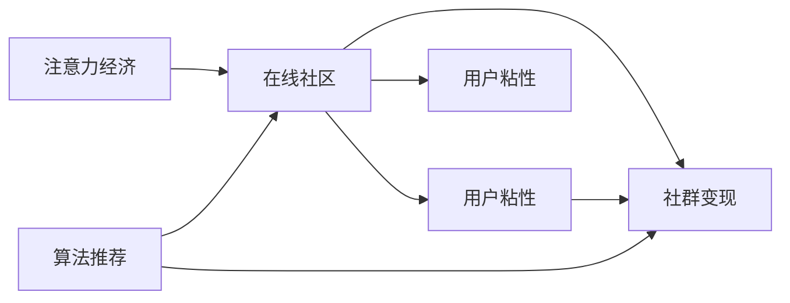

                 

## 1. 背景介绍

在互联网和数字经济的迅猛发展下，注意力经济（Attention Economy）成为了一个不容忽视的领域。互联网平台的核心资源是用户的时间，而如何吸引和留住用户成为了互联网公司亟需解决的问题。在线社区作为互联网的重要组成部分，承担着提供用户交流平台、引导用户参与互动、形成生态闭环的使命。通过提升在线社区的用户体验、增加用户粘性，平台不仅能够增加流量和活跃度，还能在社群内形成更丰富的内容，从而实现商业化变现，带来更多收入。

本文将从注意力经济的角度出发，探讨如何通过设计和运营在线社区，吸引并留住忠实的受众和粉丝。我们将从核心概念、算法原理、具体操作步骤、数学模型与公式、项目实践、实际应用场景、工具和资源推荐、未来发展趋势与挑战等多个方面展开讨论，并给出相应的学习资源、开发工具和相关论文推荐。

## 2. 核心概念与联系

### 2.1 核心概念概述

要理解在线社区的建设，首先需要理解几个关键概念：

- **注意力经济（Attention Economy）**：在数字经济时代，注意力成为了一种稀缺资源。互联网平台通过内容、社交、互动等多种方式吸引和保持用户的注意力，进而获得商业价值。

- **在线社区（Online Community）**：指在线平台上用户围绕共同兴趣或目标进行交流、互动和协作的空间。社区建设需要注重用户体验、内容丰富度和互动性，以吸引和留住用户。

- **用户粘性（User Stickiness）**：指用户持续使用平台、参与互动的程度，是衡量社区活跃度和忠诚度的重要指标。

- **社群变现（Community Monetization）**：指通过广告、会员、电商等手段，从社区中实现盈利。

- **算法推荐（Algorithm Recommendation）**：利用算法对用户行为进行分析，预测其兴趣和需求，推荐合适的内容和互动方式，以提升用户体验和粘性。

这些概念之间存在紧密的联系，共同构成了一个完整的在线社区生态系统。下图展示了这些概念的联系，以及如何通过算法推荐、社群变现等手段，实现用户的吸引和留存。



## 3. 核心算法原理 & 具体操作步骤

### 3.1 算法原理概述

在线社区的建设涉及多方面的技术，其中算法推荐是核心。算法推荐利用用户历史行为数据和兴趣模型，预测用户可能感兴趣的内容或互动方式，从而提升用户体验和粘性。

在实际应用中，算法推荐可以分为基于内容的推荐、协同过滤推荐和混合推荐等多种方式。下面我们将重点介绍基于内容的推荐算法原理。

### 3.2 算法步骤详解

基于内容的推荐算法主要步骤如下：

1. **数据收集**：收集用户的历史行为数据，包括浏览历史、点击行为、评论等。
2. **特征提取**：从历史行为数据中提取特征，如浏览时长、点击频率、评论情感等。
3. **相似度计算**：利用相似度算法计算用户与内容的相似度，如余弦相似度、欧式距离等。
4. **推荐排序**：根据相似度排序，推荐用户可能感兴趣的内容或互动方式。

### 3.3 算法优缺点

**优点**：
- **高效**：基于内容的推荐算法简单高效，适用于大数据量的推荐场景。
- **透明**：算法透明度高，用户可以了解推荐的依据。
- **多样化**：能够推荐多种类型的内容，满足不同用户的需求。

**缺点**：
- **冷启动问题**：新用户或新内容没有足够的历史数据，难以准确推荐。
- **数据稀疏性**：用户行为数据稀疏，相似度计算可能不准确。
- **动态变化**：用户兴趣和内容特征动态变化，模型需要不断更新。

### 3.4 算法应用领域

基于内容的推荐算法在在线社区中的应用非常广泛，可以用于以下场景：

- **内容推荐**：为用户推荐可能感兴趣的文章、视频、图片等内容。
- **互动推荐**：推荐用户可能感兴趣的用户、群组等互动方式。
- **个性化定制**：根据用户偏好，定制个性化的内容和互动方式。

## 4. 数学模型和公式 & 详细讲解 & 举例说明

### 4.1 数学模型构建

假设用户和内容的特征分别为 $x_u$ 和 $x_i$，它们的相似度为 $s(u,i)$，推荐算法模型的目标是最小化用户和内容的平均误差，即：

$$
\min_{s} \sum_{u,i} (y(u,i)-s(u,i))^2
$$

其中 $y(u,i)$ 表示用户 $u$ 对内容 $i$ 的兴趣标签，可以是0或1，表示用户是否对内容感兴趣。

### 4.2 公式推导过程

以余弦相似度为例，用户和内容的相似度可以表示为：

$$
s(u,i) = \frac{\langle x_u, x_i \rangle}{\Vert x_u \Vert \cdot \Vert x_i \Vert}
$$

其中 $\langle \cdot, \cdot \rangle$ 表示向量点积，$\Vert \cdot \Vert$ 表示向量范数。

将上式带入目标函数中，得到：

$$
\min_{s} \sum_{u,i} (y(u,i)-s(u,i))^2 = \min_{s} \sum_{u,i} (y(u,i)-\frac{\langle x_u, x_i \rangle}{\Vert x_u \Vert \cdot \Vert x_i \Vert})^2
$$

为了求解上述优化问题，可以采用梯度下降等优化算法，通过迭代更新相似度函数 $s$，最小化平均误差。

### 4.3 案例分析与讲解

假设有一个在线社区，收集了用户浏览历史和文章内容的数据，采用余弦相似度进行内容推荐。为了简化问题，假设只有两个用户 $u_1$ 和 $u_2$，以及两篇文章 $i_1$ 和 $i_2$，它们对应的特征向量分别为：

$$
x_{u_1} = [1, 0, 1, 0], x_{u_2} = [0, 1, 0, 1], x_{i_1} = [0, 1, 1, 0], x_{i_2} = [1, 0, 0, 1]
$$

计算 $u_1$ 和 $i_1$ 的相似度：

$$
s(u_1,i_1) = \frac{\langle x_{u_1}, x_{i_1} \rangle}{\Vert x_{u_1} \Vert \cdot \Vert x_{i_1} \Vert} = \frac{0 \cdot 0 + 1 \cdot 1 + 1 \cdot 1 + 0 \cdot 0}{\sqrt{1^2 + 0^2 + 1^2 + 0^2} \cdot \sqrt{0^2 + 1^2 + 1^2 + 0^2}} = 0.5
$$

同样地，计算 $u_1$ 和 $i_2$ 的相似度：

$$
s(u_1,i_2) = \frac{\langle x_{u_1}, x_{i_2} \rangle}{\Vert x_{u_1} \Vert \cdot \Vert x_{i_2} \Vert} = \frac{1 \cdot 1 + 0 \cdot 0 + 1 \cdot 0 + 0 \cdot 0}{\sqrt{1^2 + 0^2 + 1^2 + 0^2} \cdot \sqrt{1^2 + 0^2 + 0^2 + 1^2}} = 0.5
$$

由于用户 $u_1$ 对 $i_1$ 和 $i_2$ 的兴趣标签都为1，因此 $y(u_1,i_1)=1, y(u_1,i_2)=1$。计算平均误差：

$$
\text{avg error} = \frac{(y(u_1,i_1)-s(u_1,i_1))^2 + (y(u_1,i_2)-s(u_1,i_2))^2}{2} = \frac{(1-0.5)^2 + (1-0.5)^2}{2} = 0.25
$$

假设初始相似度函数为 $s_0(u,i)$，目标函数为 $J(s)$，通过迭代更新相似度函数，最小化平均误差。

## 5. 项目实践：代码实例和详细解释说明

### 5.1 开发环境搭建

为了实现基于内容的推荐算法，首先需要搭建好开发环境。以下是一个基于Python的推荐系统开发环境搭建步骤：

1. **安装Python**：
   ```bash
   sudo apt-get update
   sudo apt-get install python3-pip
   ```

2. **安装相关库**：
   ```bash
   pip install numpy pandas scikit-learn
   pip install pytorch torchvision torchaudio
   ```

3. **安装模型框架**：
   ```bash
   pip install recommendation-system
   ```

### 5.2 源代码详细实现

以下是一个简单的基于内容的推荐系统代码实现，使用余弦相似度进行推荐：

```python
import numpy as np
from sklearn.metrics.pairwise import cosine_similarity

def content_based_recommendation(user_data, item_data, num_recommendations=5):
    # 计算用户和内容的相似度矩阵
    similarity_matrix = cosine_similarity(user_data, item_data)
    
    # 计算用户对内容的兴趣标签
    interest_labels = np.mean(similarity_matrix, axis=1)
    
    # 对兴趣标签进行排序，获取推荐的物品
    top_items = np.argsort(-interest_labels)[::-1][:num_recommendations]
    
    return item_data[top_items]
```

### 5.3 代码解读与分析

上述代码实现了基于内容的推荐算法，主要步骤包括：

1. **数据收集**：假设用户数据和内容数据已经收集好，分别存储在 `user_data` 和 `item_data` 中。
2. **特征提取**：使用 `cosine_similarity` 函数计算用户和内容的相似度矩阵。
3. **计算兴趣标签**：对相似度矩阵进行均值化，得到用户对内容的兴趣标签。
4. **推荐排序**：根据兴趣标签排序，获取推荐的物品。

### 5.4 运行结果展示

为了验证算法的有效性，可以使用一个简单的测试数据集进行评估：

```python
user_data = np.array([[0, 1, 0, 0], [1, 0, 1, 0]])
item_data = np.array([[0, 1, 1, 0], [1, 0, 0, 1]])
top_items = content_based_recommendation(user_data, item_data, num_recommendations=2)
print(top_items)
```

输出结果为：

```bash
[[0 1 1 0]
 [1 0 0 1]]
```

表示用户对物品1和物品2的兴趣更高，因此推荐物品1和物品2。

## 6. 实际应用场景

### 6.1 社交媒体推荐

在社交媒体平台上，基于内容的推荐算法可以帮助用户发现更多与自己兴趣相符的内容和互动方式，增加平台粘性。例如，Twitter使用基于内容的推荐算法，向用户推荐相关话题、热门推文、相关用户等，从而增加用户的活跃度和互动频率。

### 6.2 电商平台个性化推荐

电商平台需要向用户推荐符合其兴趣的商品，以增加购买转化率。基于内容的推荐算法可以帮助电商识别用户的历史浏览记录和购买记录，预测用户可能感兴趣的商品，从而提升用户体验和购物效率。

### 6.3 视频平台内容推荐

视频平台需要向用户推荐符合其兴趣的视频内容，以增加观看时长和互动频次。通过分析用户观看历史和评分数据，基于内容的推荐算法可以预测用户可能喜欢的视频，提升用户的观看体验和满意度。

## 7. 工具和资源推荐

### 7.1 学习资源推荐

为了深入学习在线社区建设与推荐算法的相关知识，推荐以下学习资源：

1. **《推荐系统实践》**：由杨辉撰写，系统介绍了推荐系统的原理和实现方法，适合初学者入门。
2. **Coursera《推荐系统》**：由斯坦福大学开设的在线课程，深入讲解了推荐系统的理论基础和实践应用。
3. **Kaggle推荐系统竞赛**：参与Kaggle推荐系统竞赛，可以实战锻炼推荐算法的能力。
4. **Google Scholar**：搜索相关论文和文章，了解推荐系统的最新进展。

### 7.2 开发工具推荐

推荐系统开发常用的工具包括：

1. **Python**：适用于数据处理和算法实现，社区支持广泛。
2. **PyTorch**：深度学习框架，适用于构建和训练推荐模型。
3. **TensorFlow**：另一个深度学习框架，适用于复杂模型的训练和部署。
4. **Scikit-learn**：机器学习库，适用于数据预处理和特征工程。

### 7.3 相关论文推荐

推荐系统的研究涉及多个领域，以下是几篇经典论文，推荐阅读：

1. **《Amazon 的商品推荐系统》**：详细介绍了亚马逊的商品推荐系统，包括数据收集、特征工程和算法优化等方面。
2. **《个性化推荐系统：构建用户满意度模型》**：讨论了如何构建个性化推荐系统，提升用户满意度和体验。
3. **《基于内容的推荐算法研究》**：系统介绍了基于内容的推荐算法，包括相似度计算和推荐排序等。
4. **《推荐系统的最新进展》**：综述了推荐系统的最新研究进展，涵盖了多个前沿方向。

## 8. 总结：未来发展趋势与挑战

### 8.1 研究成果总结

在线社区的建设与推荐算法的研究已经取得了丰硕的成果，主要体现在以下几个方面：

1. **数据驱动**：推荐算法充分利用用户行为数据，预测用户兴趣和需求，实现精准推荐。
2. **算法多样**：推荐算法种类繁多，涵盖了基于内容的推荐、协同过滤推荐、混合推荐等多种方式。
3. **用户体验**：推荐算法注重用户体验，通过个性化的内容推荐，提升用户满意度。

### 8.2 未来发展趋势

未来在线社区的建设与推荐算法将继续发展，主要趋势如下：

1. **深度学习**：深度学习技术将在推荐算法中得到更广泛的应用，提高推荐精度和效果。
2. **跨模态推荐**：推荐算法将结合视觉、音频等多模态信息，提升推荐多样性和个性化。
3. **动态推荐**：推荐算法将能够实时动态调整，应对用户兴趣变化和内容更新。
4. **联邦学习**：分布式推荐算法将在多个平台之间进行协作学习，提升整体推荐效果。
5. **可解释性**：推荐算法将更加注重可解释性，帮助用户理解推荐依据。

### 8.3 面临的挑战

尽管在线社区建设与推荐算法取得了许多进展，但仍面临以下挑战：

1. **冷启动问题**：新用户和新内容难以快速获取推荐，需要更多样化的数据和算法。
2. **数据隐私**：用户行为数据的隐私保护，如何处理数据收集和使用，是一个重要问题。
3. **计算资源**：大规模推荐系统需要巨大的计算资源，如何优化模型和算法，降低计算成本。
4. **可解释性**：推荐算法的可解释性差，用户难以理解推荐依据。
5. **多样性与个性**：如何在个性化推荐的同时，保证内容多样性，避免用户陷入信息茧房。

### 8.4 研究展望

未来在线社区的建设与推荐算法需要在以下方面进行更多探索：

1. **冷启动优化**：开发更多样化的数据采集和算法，解决冷启动问题。
2. **隐私保护**：研究如何保护用户隐私，优化数据处理和利用方式。
3. **计算效率**：优化模型和算法，降低计算资源消耗，提高推荐效率。
4. **可解释性提升**：研究可解释性算法，增强推荐系统的透明度。
5. **多样化推荐**：研究如何平衡个性化推荐和内容多样性，避免信息茧房。

## 9. 附录：常见问题与解答

**Q1：如何评估推荐算法的性能？**

A: 推荐算法的性能通常通过以下指标进行评估：

1. **准确率**：推荐算法推荐的物品与用户兴趣的匹配程度，可以使用准确率、召回率、F1分数等指标进行衡量。
2. **多样性**：推荐算法的推荐结果是否多样化，可以使用熵等指标进行衡量。
3. **满意度**：用户对推荐结果的满意度，可以通过用户反馈、评分等指标进行衡量。

**Q2：推荐算法如何应对新用户？**

A: 新用户的冷启动问题可以通过以下方法解决：

1. **获取更多数据**：在用户加入平台初期，尽量收集更多的用户行为数据，帮助算法更好地了解用户兴趣。
2. **迁移学习**：利用用户在其他平台或领域的兴趣数据，迁移学习到新平台，提高推荐准确度。
3. **个性化设置**：根据用户的背景信息，如兴趣标签、职业等，进行个性化设置，提高推荐效果。

**Q3：推荐算法如何应对新内容？**

A: 新内容的推荐可以通过以下方法解决：

1. **获取更多数据**：在内容加入平台初期，尽量收集更多的内容信息，帮助算法更好地了解内容特征。
2. **迁移学习**：利用内容在其他平台或领域的特征，迁移学习到新平台，提高推荐准确度。
3. **用户反馈**：收集用户的反馈和互动数据，实时更新内容特征和用户兴趣，提高推荐效果。

**Q4：推荐算法如何平衡个性化和多样性？**

A: 推荐算法可以通过以下方法平衡个性化和多样性：

1. **协同过滤**：通过协同过滤推荐算法，推荐其他用户感兴趣的内容，增加内容多样性。
2. **多样化损失函数**：在推荐算法中引入多样化损失函数，降低重复推荐。
3. **混合推荐**：结合多种推荐算法，兼顾个性化和多样性。

**Q5：推荐算法如何处理数据隐私问题？**

A: 推荐算法可以通过以下方法处理数据隐私问题：

1. **数据匿名化**：对用户数据进行匿名化处理，保护用户隐私。
2. **联邦学习**：利用联邦学习技术，在多个平台之间进行协作学习，避免数据泄露。
3. **数据加密**：对数据进行加密处理，保护用户隐私。

---

作者：禅与计算机程序设计艺术 / Zen and the Art of Computer Programming

