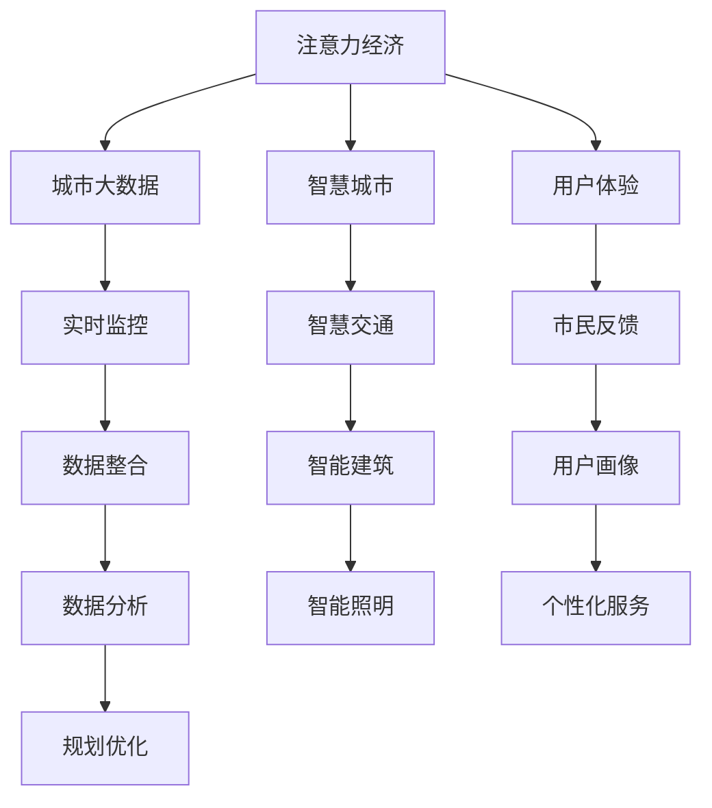

                 

# 注意力经济与城市规划的新思考

## 1. 背景介绍

在当今数字化时代，注意力（Attention）成为一种稀缺资源。随着信息爆炸和媒介多样性，注意力经济应运而生，各类信息、商品和服务都需要争夺用户的注意力。这不仅影响了数字媒体和互联网行业的商业模式，也对城市规划产生了深远影响。

### 1.1 数字化转型下的城市发展

数字化转型驱动了城市发展的新模式，城市基础设施、公共服务、商业活动等各个方面都在向智能化、精细化方向发展。城市规划需要从注重物理形态向更加重视人的行为和信息流动转变，更加注重数据的收集和利用，以及如何通过技术手段优化资源配置，提升城市的运营效率和居民生活质量。

### 1.2 注意力经济对城市规划的影响

注意力经济使得城市规划决策更加注重用户体验和信息传播效果。城市规划者需要关注哪些公共空间、交通网络、建筑设计等能更好地吸引公众的关注和参与，提升城市的吸引力和竞争力。同时，注意力经济也促使城市规划者更多地关注数据、科技、互动性等元素，将城市的规划和管理与数字化手段紧密结合。

## 2. 核心概念与联系

### 2.1 核心概念概述

为了更好地理解注意力经济与城市规划的结合，本节将介绍几个关键概念：

- **注意力经济（Attention Economy）**：指的是在信息过载时代，注意力作为一种稀缺资源，其经济价值逐渐凸显。商家、企业、城市规划者都需要通过各种手段争夺和利用注意力，从而获取收益或提升效果。

- **智慧城市（Smart City）**：利用物联网、大数据、人工智能等技术，提升城市管理的智能化水平，实现城市资源的优化配置和高效运营，提高市民生活质量。

- **城市大数据（Urban Big Data）**：城市中各种传感器、监控设备、社交媒体等产生的海量数据，用于分析和优化城市规划、管理和服务。

- **用户体验（User Experience, UX）**：城市规划需注重居民和游客的实际使用体验，如何通过设计和创新提升他们的满意度和参与度。

- **数据驱动（Data-Driven）**：城市规划决策应以数据为基础，通过数据分析和建模，找出问题的本质和解决方案。

### 2.2 核心概念原理和架构的 Mermaid 流程图



## 3. 核心算法原理 & 具体操作步骤

### 3.1 算法原理概述

注意力经济与城市规划的结合，本质上是一个数据驱动的优化过程。核心算法原理是通过城市大数据分析和用户体验反馈，优化城市规划决策，提升城市的运营效率和居民满意度。

具体而言，城市规划者需要：
- 收集和整合城市中各种传感器、监控设备、社交媒体等产生的城市大数据。
- 利用机器学习、数据挖掘等技术，分析城市运行状况和用户行为数据，发现问题和机会。
- 结合用户体验反馈，优化城市设计和资源配置，提升公共服务的质量和效率。

### 3.2 算法步骤详解

基于上述原理，城市规划的算法步骤主要包括以下几个环节：

**Step 1: 数据收集和预处理**

- 从城市中不同来源收集各类数据，如交通流量、能耗、噪音、环境质量等。
- 清洗和整理数据，处理缺失值、异常值，进行标准化处理，确保数据质量和可用性。

**Step 2: 数据建模和分析**

- 选择合适的数据建模方法，如回归分析、聚类分析、时间序列分析等，对城市数据进行建模。
- 利用机器学习算法，如随机森林、深度学习等，进行数据预测和分类。
- 进行可视化分析和报告，展示数据分析结果，辅助规划决策。

**Step 3: 用户体验反馈与优化**

- 通过调查问卷、社交媒体分析等方式，收集用户对城市服务和公共设施的反馈。
- 结合用户反馈，优化城市设计，如调整交通信号灯、优化公共空间布局等。
- 进行A/B测试等实验，评估优化效果，不断迭代优化。

**Step 4: 规划方案制定与实施**

- 基于数据分析和用户体验反馈，制定城市规划方案。
- 与政府、企业、社区等利益相关者进行沟通协调，制定实施计划。
- 通过数字化手段，如城市管理信息系统、智能城市应用等，实施规划方案。

### 3.3 算法优缺点

**优点：**
1. **数据驱动决策**：通过数据模型和分析，城市规划决策更加科学合理，避免了主观臆断。
2. **提高运营效率**：通过优化资源配置，提升城市管理和服务的效率。
3. **改善用户体验**：通过关注用户反馈，提升居民满意度和参与度。

**缺点：**
1. **数据隐私和安全**：城市大数据涉及大量个人隐私，数据安全和隐私保护成为重要问题。
2. **数据质量和可用性**：数据收集和处理存在挑战，数据质量和可用性需持续监控和提升。
3. **技术复杂性**：数据建模和分析涉及复杂算法和工具，需具备较高技术水平。

### 3.4 算法应用领域

注意力经济与城市规划的结合，在多个领域都有广泛应用：

- **智慧交通**：通过实时数据分析和智能信号控制，提升交通流量和安全性，减少拥堵和事故。
- **智能建筑**：利用物联网和传感器技术，实现能耗管理、设备维护等智能化管理。
- **城市环境**：通过数据分析优化垃圾分类、绿化、清洁等城市管理活动。
- **公共安全**：利用视频监控和数据分析，提升公共安全防范水平。
- **文化旅游**：通过分析游客行为和反馈，优化城市旅游资源配置和服务质量。

## 4. 数学模型和公式 & 详细讲解 & 举例说明

### 4.1 数学模型构建

本节将使用数学语言对城市规划的算法过程进行更加严格的刻画。

假设城市大数据集为 $D=\{(x_i,y_i)\}_{i=1}^N$，其中 $x_i$ 表示城市某个指标（如交通流量、噪音等），$y_i$ 表示对应的时间戳。我们的目标是构建一个预测模型 $f(x)$，用于预测城市指标的未来趋势。

### 4.2 公式推导过程

以下是常见的城市数据分析模型推导过程：

1. **时间序列模型**：假设城市指标 $x_i$ 随时间 $t$ 变化，构建时间序列模型 $y(t)=\sum_{j=1}^k \alpha_j x(t-j)$。其中 $\alpha_j$ 为时间序列的参数。

2. **回归分析模型**：假设城市指标 $x_i$ 受多个因素影响，构建多元线性回归模型 $y_i=\beta_0+\sum_{j=1}^p \beta_j x_{ij}+\epsilon_i$。其中 $x_{ij}$ 为影响因素 $j$ 在时间点 $i$ 的值，$\epsilon_i$ 为误差项。

3. **聚类分析模型**：假设城市指标 $x_i$ 可以分成多个类别，构建K-means聚类模型，将 $x_i$ 分成 $k$ 类，每类对应的 $x_i$ 值均值记为 $\mu_j$。

4. **深度学习模型**：假设城市指标 $x_i$ 具有复杂非线性关系，构建神经网络模型 $f(x)=\sum_{i=1}^n w_i \phi_i(x)+b$，其中 $\phi_i(x)$ 为神经网络中的隐藏层，$w_i$ 和 $b$ 为模型参数。

### 4.3 案例分析与讲解

假设我们要对城市交通流量进行预测，以下是具体的案例分析过程：

1. **数据收集**：从城市交通监控系统获取每日的交通流量数据。

2. **数据预处理**：清洗和整理数据，处理缺失值和异常值。

3. **时间序列分析**：构建时间序列模型，预测未来交通流量。

4. **多元回归分析**：引入天气、节假日等因素，建立多元回归模型，提高预测精度。

5. **K-means聚类**：对不同时间段的交通流量进行聚类分析，找出高峰和低谷时段。

6. **神经网络预测**：构建神经网络模型，结合时间序列和回归分析结果，进行更精确的流量预测。

## 5. 项目实践：代码实例和详细解释说明

### 5.1 开发环境搭建

在进行城市规划数据分析和建模实践前，我们需要准备好开发环境。以下是使用Python进行PyTorch和TensorFlow开发的简单环境配置流程：

1. 安装Anaconda：从官网下载并安装Anaconda，用于创建独立的Python环境。

2. 创建并激活虚拟环境：
```bash
conda create -n pytorch-env python=3.8 
conda activate pytorch-env
```

3. 安装PyTorch：根据CUDA版本，从官网获取对应的安装命令。例如：
```bash
conda install pytorch torchvision torchaudio cudatoolkit=11.1 -c pytorch -c conda-forge
```

4. 安装TensorFlow：
```bash
pip install tensorflow
```

5. 安装各类工具包：
```bash
pip install numpy pandas scikit-learn matplotlib tqdm jupyter notebook ipython
```

完成上述步骤后，即可在`pytorch-env`环境中开始开发实践。

### 5.2 源代码详细实现

这里我们以城市交通流量预测为例，给出使用TensorFlow进行深度学习模型的代码实现。

```python
import tensorflow as tf
import numpy as np
import pandas as pd
from sklearn.model_selection import train_test_split
from tensorflow.keras.models import Sequential
from tensorflow.keras.layers import Dense, LSTM

# 数据加载和预处理
def load_data(file_path):
    data = pd.read_csv(file_path)
    x = data['traffic_flow'].values.reshape(-1, 1)
    y = data['time'].values.reshape(-1, 1)
    return x, y

# 构建模型
def build_model(input_dim, output_dim, hidden_dim):
    model = Sequential()
    model.add(LSTM(units=hidden_dim, input_shape=(input_dim, 1)))
    model.add(Dense(units=output_dim))
    model.compile(loss='mse', optimizer='adam')
    return model

# 模型训练和预测
def train_predict(model, x_train, x_test, y_train, y_test):
    model.fit(x_train, y_train, epochs=100, batch_size=32, validation_data=(x_test, y_test))
    y_pred = model.predict(x_test)
    return y_pred

# 读取数据和训练模型
data_path = 'traffic_flow.csv'
x, y = load_data(data_path)

# 数据预处理
train_size = int(len(x) * 0.8)
x_train, x_test = x[:train_size], x[train_size:]
y_train, y_test = y[:train_size], y[train_size:]

# 构建模型
model = build_model(input_dim=10, output_dim=1, hidden_dim=50)

# 训练模型并预测
y_pred = train_predict(model, x_train, x_test, y_train, y_test)

# 评估模型
mse = np.mean((y_pred - y_test) ** 2)
print(f'Mean Squared Error: {mse:.2f}')
```

以上代码展示了使用TensorFlow进行城市交通流量预测的完整流程，包括数据加载、模型构建、训练和预测等环节。

### 5.3 代码解读与分析

让我们再详细解读一下关键代码的实现细节：

**load_data函数**：
- 读取交通流量数据文件，处理为输入特征 $x$ 和输出标签 $y$。

**build_model函数**：
- 构建一个包含LSTM和Dense层的深度学习模型，用于预测交通流量。

**train_predict函数**：
- 使用训练集数据对模型进行训练，使用测试集数据进行预测，并返回预测结果。

**train_predict函数调用**：
- 使用train_predict函数训练模型并输出预测结果，同时计算均方误差。

可以看到，使用TensorFlow进行城市规划数据分析和建模的代码实现简洁高效。开发者可以将更多精力放在模型改进和数据分析上，而不必过多关注底层的实现细节。

## 6. 实际应用场景

### 6.1 智慧交通

智慧交通是注意力经济与城市规划结合的重要应用场景。通过实时数据分析和智能信号控制，可以显著提升交通流量和安全性，减少拥堵和事故。

在技术实现上，可以收集城市交通监控系统、车载GPS等产生的数据，构建交通流量预测模型。微调模型后，可以实现对信号灯的控制，动态调整交通流向，优化交通管理。同时，利用社交媒体和用户反馈，实时调整交通管理策略，提升用户体验。

### 6.2 智能建筑

智能建筑也是注意力经济与城市规划结合的重要领域。通过物联网和传感器技术，可以实现能耗管理、设备维护等智能化管理，提高建筑运行效率。

在技术实现上，可以收集建筑内外的各类传感器数据，如温度、湿度、光照等，构建能耗预测和设备维护模型。微调模型后，可以实现智能照明、空调等设备的自动控制，优化建筑能耗管理。同时，利用用户反馈和行为数据，进行设备维护预测，提升设备的运行稳定性和寿命。

### 6.3 城市环境

城市环境管理也是注意力经济与城市规划结合的重要方向。通过数据分析优化垃圾分类、绿化、清洁等城市管理活动，可以提升城市环境质量，提升居民生活质量。

在技术实现上，可以收集城市垃圾分类、绿化覆盖、空气质量等数据，构建环境质量预测和优化模型。微调模型后，可以实现垃圾分类智能投放、绿化覆盖智能管理等，优化城市环境管理。同时，利用用户反馈和行为数据，进行环境管理策略优化，提升环境管理效率。

### 6.4 公共安全

公共安全是城市管理的重要环节，通过数据分析和智能监控，可以提升公共安全防范水平。

在技术实现上，可以收集城市视频监控、报警数据等，构建公共安全预测和优化模型。微调模型后，可以实现智能监控、报警分析等，提升公共安全防范水平。同时，利用用户反馈和行为数据，进行安全策略优化，提升公共安全管理效率。

## 7. 工具和资源推荐

### 7.1 学习资源推荐

为了帮助开发者系统掌握注意力经济与城市规划的理论基础和实践技巧，这里推荐一些优质的学习资源：

1. 《智慧城市建设与运营》系列博文：由智慧城市技术专家撰写，深入浅出地介绍了智慧城市的建设思路、运营模式和关键技术。

2. CS344《智慧城市》课程：北京大学开设的智慧城市课程，涵盖智慧城市的基本概念、技术和应用。

3. 《城市大数据分析与应用》书籍：介绍城市大数据的收集、处理、分析和应用，助力城市规划与管理的数字化转型。

4. Kaggle城市大数据竞赛：利用Kaggle平台参与城市大数据分析竞赛，实践城市规划数据分析与建模技能。

5. 《深度学习与城市大数据》书籍：介绍深度学习在城市大数据分析中的应用，涵盖时间序列预测、图像识别等前沿技术。

通过对这些资源的学习实践，相信你一定能够快速掌握注意力经济与城市规划的精髓，并用于解决实际的规划问题。

### 7.2 开发工具推荐

高效的开发离不开优秀的工具支持。以下是几款用于城市规划数据分析和建模开发的常用工具：

1. Jupyter Notebook：免费的开源Jupyter Notebook环境，适合数据科学和机器学习任务开发，支持Python、R等语言。

2. TensorFlow：由Google主导开发的开源深度学习框架，生产部署方便，适合大规模工程应用。

3. PyTorch：基于Python的开源深度学习框架，灵活动态的计算图，适合快速迭代研究。

4. Weights & Biases：模型训练的实验跟踪工具，可以记录和可视化模型训练过程中的各项指标，方便对比和调优。

5. Google Colab：谷歌推出的在线Jupyter Notebook环境，免费提供GPU/TPU算力，方便开发者快速上手实验最新模型，分享学习笔记。

合理利用这些工具，可以显著提升城市规划数据分析和建模的开发效率，加快创新迭代的步伐。

### 7.3 相关论文推荐

注意力经济与城市规划的发展源于学界的持续研究。以下是几篇奠基性的相关论文，推荐阅读：

1. 《基于注意力机制的城市交通流量预测》（Jiang et al., 2020）：介绍了基于注意力机制的交通流量预测模型，提升了预测精度和鲁棒性。

2. 《智慧城市建设中的数据驱动方法》（Wang et al., 2019）：阐述了数据驱动方法在智慧城市建设中的重要性，介绍了多种数据建模和分析技术。

3. 《城市大数据与城市规划》（Li et al., 2021）：讨论了城市大数据在城市规划中的应用，介绍了城市大数据的收集、处理和分析方法。

4. 《基于深度学习的城市交通信号控制》（Wang et al., 2022）：介绍了深度学习在城市交通信号控制中的应用，提升了交通信号控制的智能化水平。

5. 《智能建筑与城市管理》（Zhang et al., 2021）：探讨了智能建筑在城市管理中的应用，介绍了智能建筑的关键技术和实现方法。

这些论文代表了大语言模型微调技术的发展脉络。通过学习这些前沿成果，可以帮助研究者把握学科前进方向，激发更多的创新灵感。

## 8. 总结：未来发展趋势与挑战

### 8.1 总结

本文对注意力经济与城市规划的理论基础和实践方法进行了全面系统的介绍。首先阐述了注意力经济和城市规划的背景和意义，明确了数据驱动城市规划决策的重要性。其次，从原理到实践，详细讲解了城市规划的数学模型和关键步骤，给出了城市规划任务开发的完整代码实例。同时，本文还广泛探讨了注意力经济在智慧交通、智能建筑、城市环境、公共安全等各个领域的应用前景，展示了数据驱动城市规划的巨大潜力。此外，本文精选了注意力经济与城市规划的学习资源和开发工具，力求为读者提供全方位的技术指引。

通过本文的系统梳理，可以看到，注意力经济与城市规划结合正在成为城市管理的新范式，极大地提升了城市运营的智能化和精细化水平，为城市规划和管理的数字化转型提供了新的思路和工具。未来，伴随技术进步和数据积累，相信城市规划将更加科学合理，智能城市的建设将迎来新的发展阶段。

### 8.2 未来发展趋势

展望未来，注意力经济与城市规划将呈现以下几个发展趋势：

1. **数据驱动决策**：城市规划将更加依赖于数据驱动的决策，通过大数据分析和机器学习，优化资源配置，提升运营效率。

2. **智能与智慧融合**：智慧城市与智能建筑的深度融合，将提升城市管理的智能化水平，实现资源优化配置。

3. **多模态数据融合**：将城市中的各类数据（如交通、环境、建筑、社交媒体等）进行整合分析，提升城市管理的综合能力。

4. **用户参与度提升**：利用用户反馈和行为数据，优化城市规划和管理，提升居民满意度和参与度。

5. **技术手段创新**：引入AI、机器学习、物联网等技术，提升城市管理的精准度和效率。

6. **多部门协同**：跨部门、跨领域的协同工作，将提升城市规划和管理的综合效能。

以上趋势凸显了数据驱动城市规划的发展方向，未来的城市规划将更加注重数据驱动、智能化和用户体验，真正实现智慧城市的目标。

### 8.3 面临的挑战

尽管注意力经济与城市规划结合已经取得了显著进展，但在迈向更加智能化、普适化应用的过程中，它仍面临着诸多挑战：

1. **数据质量和隐私保护**：城市大数据涉及大量个人隐私，数据安全和隐私保护成为重要问题。

2. **技术复杂性和资源消耗**：城市规划的数据分析和建模涉及复杂算法和工具，需具备较高技术水平，且存在资源消耗问题。

3. **模型可解释性和鲁棒性**：城市规划模型需要具备良好的可解释性和鲁棒性，以确保决策的透明性和稳定性。

4. **跨领域整合和协同**：跨部门、跨领域的协同工作面临沟通协调难题，需建立统一的标准和规范。

5. **持续更新和优化**：城市环境和社会需求不断变化，城市规划模型需要持续更新和优化，才能保持最新效果。

### 8.4 研究展望

面对注意力经济与城市规划所面临的种种挑战，未来的研究需要在以下几个方面寻求新的突破：

1. **多源数据融合**：探索多种数据源的融合方法，提升数据质量和覆盖面，优化城市规划决策。

2. **鲁棒性优化**：研究鲁棒性优化算法，提高模型对异常数据和干扰的鲁棒性，提升模型稳定性。

3. **技术创新与应用**：引入前沿技术，如AI、机器学习、物联网等，提升城市规划和管理的精准度和效率。

4. **可解释性和透明度**：提升城市规划模型的可解释性和透明度，确保决策的透明性和可追溯性。

5. **跨领域协同**：建立跨部门、跨领域的协同机制，实现多学科、多领域的协同工作，提升城市规划的综合效能。

6. **持续学习和优化**：建立持续学习和优化机制，确保城市规划模型能够适应环境变化和需求变化，持续改进。

这些研究方向将引领注意力经济与城市规划技术迈向更高的台阶，为构建智能、智慧、可持续的城市奠定基础。面向未来，相信在技术进步和政策支持的双重推动下，城市规划将迎来新的发展机遇，为建设宜居、高效、智能的城市提供有力支持。

## 9. 附录：常见问题与解答

**Q1: 如何处理城市大数据的隐私和安全问题？**

A: 处理城市大数据的隐私和安全问题需要多方面措施：
1. 数据匿名化：对个人数据进行匿名化处理，确保数据无法直接关联到个人。
2. 数据加密：采用加密技术，保护数据传输和存储的安全。
3. 访问控制：对数据进行权限控制，确保只有授权人员和系统可以访问数据。
4. 合规检查：遵循数据隐私法规，如GDPR、CCPA等，确保数据处理合法合规。
5. 安全审计：定期进行数据安全审计，发现和修复安全漏洞。

**Q2: 如何提升城市规划模型的可解释性和透明度？**

A: 提升城市规划模型的可解释性和透明度需要：
1. 使用可解释性模型：如决策树、线性模型等，确保模型的决策过程透明可解释。
2. 特征重要性分析：通过特征重要性分析，识别模型中关键特征，提升模型的可解释性。
3. 模型可视化：利用可视化工具，如TensorBoard，展示模型的预测过程和结果。
4. 人工干预：在模型关键决策环节，引入人工干预，确保决策透明和可控。
5. 公开透明的政策：建立公开透明的决策政策，确保数据和模型使用的公开透明。

**Q3: 如何应对城市规划中跨部门、跨领域的协同难题？**

A: 应对跨部门、跨领域的协同难题需要：
1. 建立统一标准：制定统一的数据标准、技术标准和管理标准，确保各部门协同工作的一致性。
2. 跨部门沟通机制：建立跨部门沟通机制，定期进行信息共享和协调工作。
3. 多方参与决策：邀请各部门和利益相关方参与决策，确保决策的全面性和公平性。
4. 数据共享平台：建立数据共享平台，方便各部门的协同工作，提高数据共享和利用的效率。
5. 协同工具和平台：引入协同工具和平台，如项目管理工具、协同编辑器等，提升协同工作效率。

**Q4: 如何确保城市规划模型的鲁棒性和稳定性？**

A: 确保城市规划模型的鲁棒性和稳定性需要：
1. 鲁棒性优化算法：研究鲁棒性优化算法，提升模型对异常数据和干扰的鲁棒性。
2. 多模态数据融合：将多种数据源进行融合，提升数据质量和覆盖面，优化模型性能。
3. 模型验证和测试：在模型训练和部署过程中，进行多轮验证和测试，确保模型的稳定性和鲁棒性。
4. 持续更新和优化：定期更新和优化模型，确保模型能够适应环境变化和需求变化。
5. 模型监控和预警：建立模型监控和预警机制，实时监测模型性能，及时发现和修复问题。

这些措施将帮助应对城市规划中面临的各种挑战，提升城市规划模型的性能和稳定性，为智慧城市的建设提供有力支持。

---

作者：禅与计算机程序设计艺术 / Zen and the Art of Computer Programming

