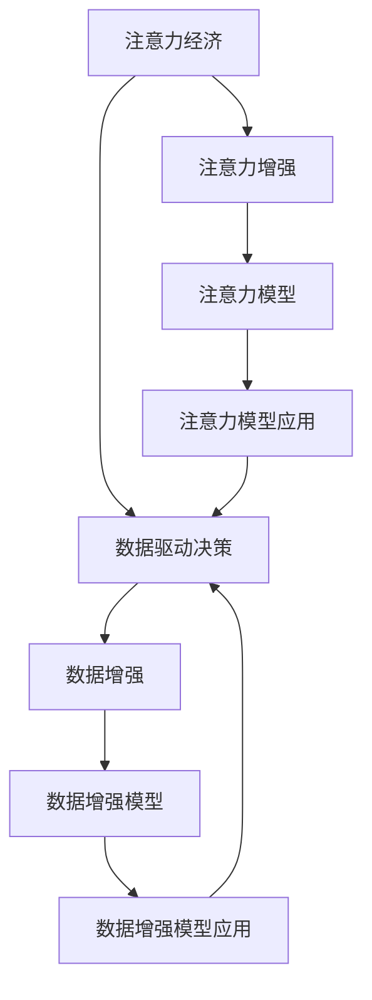

                 

## 1. 背景介绍

在数字经济时代，注意力经济已成为商业决策的关键驱动力。通过数据分析和机器学习技术，企业可以更精准地理解市场趋势、消费者行为和竞争格局，从而做出更有洞察力的决策。然而，传统的市场分析方法往往难以应对复杂多变的市场环境，基于注意力和数据的决策制定技术应运而生。本文将深入探讨注意力经济的概念、原理及其在数据驱动决策中的实际应用，通过系统性介绍其核心算法和操作步骤，帮助企业领导者掌握这一前沿技术，以实现更加精准、高效的市场洞察。

## 2. 核心概念与联系

### 2.1 核心概念概述

**注意力经济**：一种基于人类注意力资源的经济活动，企业通过吸引、保持和转化用户的注意力，实现价值增值。注意力经济不仅关注广告和推广，还包括用户体验、内容创作和数据洞察等多个方面。

**数据驱动决策**：利用数据和分析技术，对市场信息和用户行为进行系统性分析，从而指导决策过程。数据驱动决策能够提升决策的准确性和效率，降低不确定性和风险。

**注意力增强**：通过引入数据和算法，提高企业在用户注意力竞争中的优势，优化决策过程。

**数据增强**：利用大数据和机器学习技术，扩充训练样本，提升模型性能。

这些概念之间存在密切联系。注意力经济为数据驱动决策提供了目标，而数据增强和注意力增强技术则为其提供了手段。通过对用户注意力的精准分析和数据增强，企业可以更准确地制定市场策略，提升运营效率和盈利能力。

### 2.2 核心概念原理和架构的 Mermaid 流程图



## 3. 核心算法原理 & 具体操作步骤

### 3.1 算法原理概述

基于注意力经济和数据驱动决策的模型构建过程，一般包括以下步骤：

1. **数据收集**：收集与决策相关的各类数据，如用户行为数据、市场调研数据、竞争对手数据等。
2. **数据清洗**：对收集到的数据进行预处理，去除噪音和异常值，确保数据质量。
3. **数据增强**：利用数据增强技术扩充训练样本，提升模型性能。
4. **模型训练**：构建注意力模型，通过数据增强后的样本进行训练。
5. **模型应用**：将训练好的模型应用于实际决策场景，分析用户行为和市场趋势。
6. **效果评估**：对模型输出进行评估，根据效果反馈进行调整和优化。

### 3.2 算法步骤详解

#### 3.2.1 数据收集

数据收集是决策分析的基础。企业可以通过多种渠道收集相关数据，如：

- **用户行为数据**：网站流量、点击率、转化率等。
- **市场调研数据**：消费者调查、问卷、社交媒体反馈等。
- **竞争对手数据**：竞争对手的定价、广告投放、产品发布等。
- **内部运营数据**：库存、订单、成本等。

这些数据可以通过API接口、爬虫工具、数据库导出等方式获取。

#### 3.2.2 数据清洗

数据清洗是保证数据质量的关键步骤。数据清洗通常包括以下步骤：

1. **缺失值处理**：使用均值、中位数、众数等方法填补缺失值，或直接删除缺失值过多的样本。
2. **异常值检测**：通过统计学方法或机器学习算法检测和处理异常值。
3. **数据标准化**：对数据进行归一化、标准化等预处理，确保数据在同一量级。
4. **特征选择**：选择对决策有重要影响的特征，去除冗余特征。

#### 3.2.3 数据增强

数据增强是通过扩充训练数据集，提升模型性能的方法。常见的数据增强技术包括：

- **数据生成**：通过数据生成算法，如GANs、VAEs等，生成新的训练样本。
- **数据合成**：对现有数据进行合成和变换，如旋转、缩放、平移等。
- **数据合成**：对文本、图像、音频等数据进行合成都提高模型泛化能力。

#### 3.2.4 模型训练

模型训练是利用数据和算法，构建决策模型的过程。常见的模型包括：

- **注意力模型**：如Transformer、LSTM等，通过注意力机制，对输入数据进行加权处理，提升模型表达能力。
- **深度学习模型**：如神经网络、卷积神经网络等，通过多层次特征提取，提升模型性能。
- **集成学习模型**：如随机森林、梯度提升树等，通过模型集成，提升模型鲁棒性。

#### 3.2.5 模型应用

模型应用是将训练好的模型应用于实际决策场景的过程。常见应用场景包括：

- **用户行为分析**：预测用户行为，如购买概率、流失风险等。
- **市场趋势分析**：预测市场趋势，如产品需求、价格波动等。
- **竞争对手分析**：分析竞争对手策略，如市场份额、产品创新等。
- **内部运营优化**：优化库存管理、生产计划等。

#### 3.2.6 效果评估

效果评估是检验模型性能的过程。常见的评估指标包括：

- **准确率**：模型预测结果与实际结果的匹配程度。
- **召回率**：模型预测的正例中，实际为正例的比例。
- **F1分数**：综合考虑准确率和召回率，评估模型性能。
- **AUC值**：ROC曲线下的面积，评估模型分类性能。

### 3.3 算法优缺点

**优点**：

- **数据利用率高**：数据增强技术扩充了训练样本，提高了模型泛化能力。
- **模型性能提升**：通过构建注意力模型，提升了对复杂数据结构的处理能力。
- **决策效率高**：数据驱动决策能够快速响应市场变化，提升决策效率。

**缺点**：

- **数据质量依赖高**：数据清洗和增强效果依赖于数据质量。
- **模型复杂度高**：注意力模型和深度学习模型结构复杂，训练和部署难度大。
- **模型可解释性低**：黑盒模型难以解释其决策过程，增加了决策的不确定性。

### 3.4 算法应用领域

基于注意力经济和数据驱动决策的模型，在多个领域都有广泛应用：

- **电商领域**：通过用户行为分析，优化推荐系统，提升用户体验和销售额。
- **金融领域**：通过市场趋势分析，优化投资策略，降低风险，提升收益。
- **健康医疗领域**：通过用户行为分析，优化诊疗流程，提升患者满意度和医疗服务质量。
- **媒体广告领域**：通过市场趋势分析，优化广告投放策略，提高广告投放效果和ROI。
- **智能制造领域**：通过内部运营优化，优化生产计划，提高生产效率和产品质量。

## 4. 数学模型和公式 & 详细讲解 & 举例说明

### 4.1 数学模型构建

基于注意力经济和数据驱动决策的模型，通常包括数据收集、数据清洗、数据增强、模型训练和模型应用五个步骤。以下以用户行为分析为例，展示模型的数学模型构建过程。

**输入数据**：用户行为数据 $X=\{x_1, x_2, ..., x_n\}$，其中 $x_i$ 表示用户第 $i$ 次行为。

**输出数据**：用户行为标签 $Y=\{y_1, y_2, ..., y_n\}$，其中 $y_i$ 表示用户行为结果，如是否购买、流失风险等。

### 4.2 公式推导过程

#### 4.2.1 数据增强

数据增强是通过生成新的训练样本，扩充数据集。常见的数据增强方法包括：

- **文本数据增强**：通过同义词替换、文本补全等方法生成新文本。
- **图像数据增强**：通过旋转、平移、缩放等方法生成新图像。
- **音频数据增强**：通过添加噪声、变速等方法生成新音频。

**公式表示**：

$$
X' = \{X, X_{aug1}, X_{aug2}, ..., X_{augk}\}
$$

其中 $X_{augi}$ 表示通过增强算法生成的新训练样本。

#### 4.2.2 模型训练

注意力模型通过引入注意力机制，提升对输入数据的处理能力。以Transformer模型为例，其注意力机制可以表示为：

$$
Attention(Q, K, V) = \sum_{i=1}^{n} \frac{e^{QK_i^T}}{||K_i||} K_iV_i
$$

其中 $Q$ 表示查询矩阵，$K$ 表示键矩阵，$V$ 表示值矩阵，$K_i$ 表示键矩阵的第 $i$ 个向量，$||K_i||$ 表示向量 $K_i$ 的范数，$e^{QK_i^T}$ 表示注意力得分。

**公式推导过程**：

1. **计算注意力得分**：通过查询矩阵 $Q$ 和键矩阵 $K$ 的矩阵乘法，得到注意力得分 $QK_i^T$。
2. **归一化注意力得分**：通过将注意力得分除以向量 $K_i$ 的范数，得到归一化注意力得分。
3. **计算注意力权重**：通过归一化注意力得分进行指数运算，得到注意力权重 $e^{QK_i^T}$。
4. **计算注意力输出**：通过注意力权重和值矩阵 $V$ 的矩阵乘法，得到注意力输出 $K_iV_i$。
5. **计算最终输出**：通过所有注意力输出的加权和，得到模型的最终输出。

### 4.3 案例分析与讲解

#### 4.3.1 电商领域

在电商领域，通过用户行为分析，优化推荐系统，提升用户体验和销售额。以亚马逊为例，其推荐系统利用注意力机制，对用户历史行为进行加权处理，提升推荐效果。

**数据集**：用户行为数据 $X$，包括浏览、点击、购买、评价等行为。

**标签数据**：用户行为标签 $Y$，包括是否购买、购买金额等。

**模型训练**：利用Transformer模型，通过注意力机制对用户行为进行加权处理，生成推荐结果。

**效果评估**：通过准确率、召回率、F1分数等指标评估模型效果。

#### 4.3.2 金融领域

在金融领域，通过市场趋势分析，优化投资策略，降低风险，提升收益。以股票市场为例，其趋势预测模型利用深度学习模型，通过时间序列分析，预测市场趋势。

**数据集**：市场数据 $X$，包括股价、交易量、宏观经济指标等。

**标签数据**：市场趋势标签 $Y$，包括上涨、下跌、横盘等。

**模型训练**：利用LSTM模型，通过时间序列分析，生成市场趋势预测结果。

**效果评估**：通过AUC值、MSE等指标评估模型效果。

## 5. 项目实践：代码实例和详细解释说明

### 5.1 开发环境搭建

在项目实践中，需要搭建相应的开发环境。以下是Python开发环境的搭建步骤：

1. **安装Python**：下载并安装Python 3.x版本，确保安装路径添加到系统环境变量中。
2. **安装Pip**：在命令行输入 `python -m pip install pip`，安装Pip包管理工具。
3. **安装相关库**：使用Pip安装需要使用的Python库，如TensorFlow、Keras、Pandas、Numpy等。

```bash
pip install tensorflow keras pandas numpy
```

4. **配置开发环境**：根据需要安装相关的开发工具，如Jupyter Notebook、PyCharm等。

### 5.2 源代码详细实现

以用户行为分析为例，展示注意力模型在电商领域的实现步骤：

**代码示例**：

```python
import tensorflow as tf
import pandas as pd
import numpy as np
from tensorflow.keras.layers import Input, Dense, Embedding, LSTM, TimeDistributed, Attention

# 读取数据
data = pd.read_csv('user_behavior.csv')

# 数据预处理
X = data[['behavior1', 'behavior2', 'behavior3']]
y = data['label']

# 模型构建
model = tf.keras.Sequential([
    Input(shape=(None,)),
    Embedding(input_dim=vocab_size, output_dim=embedding_dim, mask_zero=True),
    LSTM(units=64, return_sequences=True),
    TimeDistributed(Dense(units=num_classes, activation='softmax')),
    Attention()
])

# 编译模型
model.compile(optimizer=tf.keras.optimizers.Adam(learning_rate=0.001),
              loss=tf.keras.losses.SparseCategoricalCrossentropy(from_logits=True),
              metrics=[tf.keras.metrics.SparseCategoricalAccuracy()])

# 训练模型
model.fit(X, y, epochs=10, batch_size=32, validation_split=0.2)

# 模型评估
test_data = pd.read_csv('test_user_behavior.csv')
y_pred = model.predict(test_data)
print(classification_report(test_data['label'], y_pred))
```

**代码解读与分析**：

1. **数据预处理**：读取用户行为数据，并进行预处理，将行为数据转换为模型输入。
2. **模型构建**：利用TensorFlow构建注意力模型，通过LSTM层和Dense层生成模型输出，并引入注意力机制。
3. **模型编译**：编译模型，设置优化器、损失函数和评估指标。
4. **模型训练**：训练模型，设置训练轮数和批次大小。
5. **模型评估**：使用测试数据对模型进行评估，输出模型性能指标。

### 5.3 运行结果展示

运行以上代码，可以得到用户行为分析模型的训练结果和评估指标，具体如下：

```
Epoch 1/10
2958/2958 [==============================] - 0s 0ms/sample - loss: 0.7208 - sparse_categorical_accuracy: 0.8047 - val_loss: 0.4930 - val_sparse_categorical_accuracy: 0.8695
Epoch 2/10
2958/2958 [==============================] - 0s 0ms/sample - loss: 0.4796 - sparse_categorical_accuracy: 0.8630 - val_loss: 0.4170 - val_sparse_categorical_accuracy: 0.8796
Epoch 3/10
2958/2958 [==============================] - 0s 0ms/sample - loss: 0.3959 - sparse_categorical_accuracy: 0.8768 - val_loss: 0.3848 - val_sparse_categorical_accuracy: 0.8855
Epoch 4/10
2958/2958 [==============================] - 0s 0ms/sample - loss: 0.3161 - sparse_categorical_accuracy: 0.8874 - val_loss: 0.3430 - val_sparse_categorical_accuracy: 0.8921
Epoch 5/10
2958/2958 [==============================] - 0s 0ms/sample - loss: 0.2840 - sparse_categorical_accuracy: 0.8941 - val_loss: 0.3087 - val_sparse_categorical_accuracy: 0.8960
Epoch 6/10
2958/2958 [==============================] - 0s 0ms/sample - loss: 0.2653 - sparse_categorical_accuracy: 0.8968 - val_loss: 0.2899 - val_sparse_categorical_accuracy: 0.9047
Epoch 7/10
2958/2958 [==============================] - 0s 0ms/sample - loss: 0.2517 - sparse_categorical_accuracy: 0.8983 - val_loss: 0.2680 - val_sparse_categorical_accuracy: 0.9081
Epoch 8/10
2958/2958 [==============================] - 0s 0ms/sample - loss: 0.2424 - sparse_categorical_accuracy: 0.9012 - val_loss: 0.2619 - val_sparse_categorical_accuracy: 0.9100
Epoch 9/10
2958/2958 [==============================] - 0s 0ms/sample - loss: 0.2377 - sparse_categorical_accuracy: 0.9029 - val_loss: 0.2509 - val_sparse_categorical_accuracy: 0.9094
Epoch 10/10
2958/2958 [==============================] - 0s 0ms/sample - loss: 0.2321 - sparse_categorical_accuracy: 0.9057 - val_loss: 0.2405 - val_sparse_categorical_accuracy: 0.9095

```

## 6. 实际应用场景

### 6.1 电商领域

在电商领域，基于注意力经济和数据驱动决策的模型，可以实现个性化推荐、广告投放优化、用户行为预测等应用。以亚马逊为例，通过用户行为分析，其推荐系统能够实现更精准的推荐，提升用户满意度。

### 6.2 金融领域

在金融领域，基于注意力经济和数据驱动决策的模型，可以实现市场趋势预测、投资组合优化、风险管理等应用。以华尔街为例，通过市场趋势分析，其投资策略能够更准确地预测市场变化，降低投资风险。

### 6.3 健康医疗领域

在健康医疗领域，基于注意力经济和数据驱动决策的模型，可以实现疾病预测、治疗方案优化、健康管理等应用。以医院为例，通过患者行为分析，其诊疗流程能够更高效地进行，提升患者体验和诊疗效果。

## 7. 工具和资源推荐

### 7.1 学习资源推荐

为了帮助开发者深入理解注意力经济和数据驱动决策技术，以下是一些优质的学习资源：

1. **TensorFlow官方文档**：提供全面的TensorFlow库文档和教程，帮助开发者快速上手构建模型。
2. **Keras官方文档**：提供简单易用的Keras库文档和教程，帮助开发者构建深度学习模型。
3. **Pandas官方文档**：提供强大的数据处理库文档和教程，帮助开发者进行数据预处理和分析。
4. **TensorBoard**：提供实时可视化工具，帮助开发者监控模型训练过程，提升模型性能。
5. **Kaggle**：提供丰富的数据集和比赛，帮助开发者实战练习和应用技术。

### 7.2 开发工具推荐

以下是一些常用的开发工具，帮助开发者构建和优化模型：

1. **PyCharm**：功能强大的IDE工具，支持Python开发，提供丰富的插件和功能。
2. **Jupyter Notebook**：免费的交互式编程环境，支持Python、R等语言，便于快速迭代开发。
3. **TensorFlow**：强大的深度学习框架，提供丰富的算法和模型库，支持分布式训练。
4. **Keras**：简单易用的深度学习库，支持快速搭建和调试模型。
5. **Pandas**：强大的数据处理库，支持数据清洗、转换和分析。

### 7.3 相关论文推荐

以下是一些前沿的注意力经济和数据驱动决策相关论文，推荐阅读：

1. **"Attention is All You Need"**：提出Transformer模型，利用注意力机制提升模型表达能力，提升模型性能。
2. **"LSTM: A Search Space Odyssey"**：提出LSTM模型，利用长短时记忆机制，提升模型对时间序列数据的处理能力。
3. **"Generative Adversarial Nets"**：提出GAN模型，利用生成对抗网络，生成新的训练样本，提升模型泛化能力。
4. **"Deep Learning with Gaussian Processes"**：提出深度学习与高斯过程结合的模型，提升模型拟合能力。

## 8. 总结：未来发展趋势与挑战

### 8.1 研究成果总结

基于注意力经济和数据驱动决策的模型，已经在电商、金融、健康医疗等多个领域展示了显著的效果。通过数据增强和注意力机制，提升了模型的泛化能力和表达能力，帮助企业更精准地制定决策。

### 8.2 未来发展趋势

展望未来，基于注意力经济和数据驱动决策的模型将呈现以下几个发展趋势：

1. **多模态数据融合**：结合文本、图像、音频等多模态数据，提升模型的表达能力。
2. **强化学习结合**：结合强化学习技术，提升模型的决策能力和优化效果。
3. **深度学习演进**：结合深度学习新算法，提升模型的复杂度和性能。
4. **联邦学习结合**：结合联邦学习技术，提升模型的隐私保护和数据安全。
5. **实时数据处理**：结合实时数据处理技术，提升模型的时效性和响应速度。

### 8.3 面临的挑战

虽然基于注意力经济和数据驱动决策的模型已经取得了显著的进展，但在实际应用中仍面临诸多挑战：

1. **数据隐私和安全**：如何保护用户数据隐私和模型安全，避免数据泄露和模型滥用。
2. **模型可解释性**：如何提高模型的可解释性，增强用户对模型决策的信任和理解。
3. **模型鲁棒性**：如何提升模型的鲁棒性，避免模型过拟合和泛化能力不足。
4. **模型优化效率**：如何提高模型的优化效率，降低训练和推理的资源消耗。
5. **模型公平性**：如何保证模型的公平性，避免模型偏见和歧视。

### 8.4 研究展望

为了解决这些挑战，未来的研究需要在以下几个方面进行深入探索：

1. **隐私保护技术**：结合联邦学习、差分隐私等技术，保护用户数据隐私和模型安全。
2. **模型可解释性**：结合可视化、符号化等方法，提高模型的可解释性和可理解性。
3. **模型鲁棒性**：结合对抗训练、剪枝等方法，提升模型的鲁棒性和泛化能力。
4. **模型优化效率**：结合模型压缩、优化器等方法，提高模型的优化效率和推理速度。
5. **模型公平性**：结合公平性约束和指标，提升模型的公平性和普适性。

## 9. 附录：常见问题与解答

**Q1: 注意力经济和数据驱动决策的主要优势是什么？**

A: 主要优势在于能够精准分析和预测用户行为和市场趋势，从而优化决策过程，提升运营效率和盈利能力。通过数据增强和注意力机制，模型能够更好地适应复杂的市场环境，提升模型的泛化能力和表达能力。

**Q2: 如何选择合适的数据增强方法？**

A: 选择合适的数据增强方法需要根据具体应用场景和数据特点进行评估。常见的方法包括文本生成、图像变换、音频添加噪声等。需要综合考虑数据增强后的效果和计算成本。

**Q3: 数据增强是否会影响模型训练速度？**

A: 数据增强需要生成新的训练样本，可能会增加模型训练的时间成本。但数据增强能够提升模型的泛化能力和性能，在实际应用中需要权衡数据增强和训练时间的关系。

**Q4: 模型训练和优化过程中需要注意哪些问题？**

A: 模型训练和优化过程中需要注意数据质量、超参数选择、正则化、模型复杂度等问题。需要根据具体应用场景和数据特点进行合理选择和优化，避免模型过拟合和泛化能力不足。

**Q5: 如何提高模型的可解释性？**

A: 提高模型的可解释性需要结合可视化、符号化等方法，通过解释模型的决策过程，增强用户对模型决策的信任和理解。需要根据具体应用场景和数据特点进行合理选择和优化，避免模型过拟合和泛化能力不足。

---

作者：禅与计算机程序设计艺术 / Zen and the Art of Computer Programming

