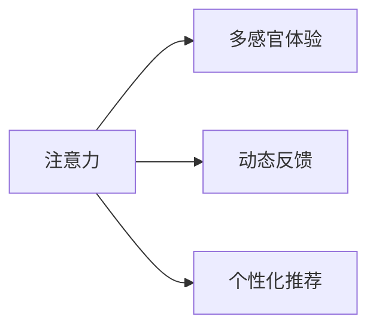

                 

# 注意力经济与用户体验优化策略与技术：创建令人沉浸的产品

## 1. 背景介绍

### 1.1 问题由来

在数字化时代，信息爆炸带来的注意力争夺愈发激烈。用户在面对海量内容时，如何筛选、获取并利用信息，成为了企业和应用开发者的重大挑战。在传统媒体、社交网络、电商平台、搜索引擎等各领域，用户获取信息的方式不断演进，而如何提升用户注意力、增强产品体验，已成为企业竞争的核心战略。

注意力经济（Economy of Attention）是指在信息过载的环境中，获取并保持用户注意力的过程和经济价值。用户注意力成为一种稀缺资源，优质的用户体验不仅能吸引用户，还能提升用户忠诚度，驱动长期价值增长。

在这一背景下，用户体验（User Experience，UX）优化成为了产品设计和开发中的重要环节。通过科学的设计策略和技术手段，可以提升用户互动的积极性和满意度，增强用户粘性，实现注意力资源的高效配置。

### 1.2 问题核心关键点

用户体验优化的关键在于：

- **用户需求洞察**：深入理解用户心理和行为，洞察其真实需求和痛点。
- **注意力机制设计**：通过智能化的机制设计，引导用户关注关键信息，忽略干扰项。
- **多感官协同**：整合视觉、听觉、触觉等多种感官信息，增强用户沉浸感。
- **动态反馈优化**：通过实时反馈调整产品行为，提升用户互动体验。
- **个性化推荐**：基于用户行为和偏好，提供个性化内容推荐，提升用户体验。

优化用户体验并非一蹴而就，而是一个持续迭代、不断优化的过程。本文将深入探讨注意力经济与用户体验优化的关键策略和技术，帮助开发者构建令人沉浸的产品。

### 1.3 问题研究意义

优化用户体验不仅能提升用户满意度，还能带来显著的商业价值：

1. **用户留存率提升**：优质的用户体验能显著提升用户满意度，降低流失率。
2. **互动深度增加**：互动体验的改善可以延长用户在产品上停留时间，提升用户粘性。
3. **转化率提高**：通过智能化的推荐和引导，提高用户转化率，增加产品收益。
4. **口碑效应增强**：良好的用户体验可提升用户口碑，带来更多推荐用户。
5. **数据利用率优化**：提高用户互动数据的质量和利用率，为产品改进提供有力依据。

通过对用户体验的深入研究和优化，企业不仅能获得短期的用户增长，还能在长期竞争中保持优势，赢得市场份额。

## 2. 核心概念与联系

### 2.1 核心概念概述

为了更好地理解注意力经济与用户体验优化的策略与技术，首先需要明确以下几个关键概念：

- **注意力（Attention）**：用户对信息或产品的关注程度，是影响用户体验的重要因素。
- **多感官体验（Multisensory Experience）**：结合视觉、听觉、触觉等多种感官信息，提供全面的沉浸式体验。
- **动态反馈（Dynamic Feedback）**：通过实时反馈机制，提升用户互动的即时性和互动深度。
- **个性化推荐（Personalized Recommendation）**：基于用户行为和偏好，提供量身定制的推荐内容。

这些概念之间的联系可通过以下Mermaid流程图展示：



这个流程图展示了注意力作为核心要素，如何通过多感官体验、动态反馈和个性化推荐，共同提升用户体验。

## 3. 核心算法原理 & 具体操作步骤

### 3.1 算法原理概述

用户体验优化的算法原理主要基于以下几个核心模型：

- **注意力模型**：通过计算用户对不同信息源的关注程度，指导信息展示的优先级。
- **推荐系统**：通过分析用户历史行为和偏好，提供个性化内容推荐。
- **情感计算**：通过识别和理解用户的情感状态，提升产品互动的个性化和人性化。
- **多感官融合**：通过整合多种感官信息，构建沉浸式体验。
- **动态反馈模型**：通过实时反馈机制，优化用户互动体验。

这些模型通过数据驱动和算法优化，帮助开发者设计出更具吸引力和互动性的产品。

### 3.2 算法步骤详解

以下是一个典型的用户体验优化算法流程：

**Step 1: 数据采集与预处理**

- **用户行为数据**：采集用户在应用中的点击、浏览、购买等行为数据。
- **用户反馈数据**：收集用户在应用中的评价、评论、反馈等主观数据。
- **环境数据**：采集应用的使用场景和环境信息，如设备类型、网络状态等。

**Step 2: 特征提取与建模**

- **用户特征提取**：通过用户行为数据、设备信息、地理位置等，提取用户基本特征。
- **内容特征提取**：从产品内容中提取关键词、标签、类别等特征。
- **模型构建**：基于上述特征，构建推荐模型、情感计算模型、注意力模型等。

**Step 3: 注意力机制设计**

- **信息源重要性排序**：通过计算信息源的关注度，确定信息展示的优先级。
- **干扰项过滤**：识别和过滤对用户注意力构成干扰的元素。

**Step 4: 多感官协同设计**

- **视觉信息设计**：优化页面布局、颜色搭配、字体选择等视觉元素。
- **听觉信息设计**：设计音效、音乐等听觉元素，增强沉浸感。
- **触觉信息设计**：利用触觉反馈，如点击、滑动、振动等，提升互动体验。

**Step 5: 动态反馈优化**

- **实时反馈设计**：通过即时反馈机制，让用户迅速获得操作结果。
- **交互行为优化**：根据用户行为实时调整产品行为，增强互动深度。

**Step 6: 个性化推荐实现**

- **用户画像构建**：基于用户行为数据构建用户画像。
- **内容推荐算法**：设计推荐算法，为用户推荐最相关的内容。
- **推荐结果呈现**：设计推荐结果的展示形式，提升用户体验。

### 3.3 算法优缺点

用户体验优化的算法具有以下优点：

- **提高用户满意度**：通过关注用户需求，提升互动体验，提高用户满意度。
- **增加用户粘性**：通过个性化推荐和多感官协同，增加用户粘性，提升留存率。
- **优化资源配置**：通过注意力模型和推荐系统，优化资源配置，提升内容利用率。

但同时，这些算法也存在以下缺点：

- **数据隐私问题**：大量用户数据的采集和使用可能引发隐私问题。
- **算法复杂性**：算法模型的设计和优化需要大量时间和技术资源。
- **过度个性化风险**：过度个性化的推荐可能导致信息茧房，限制用户视野。
- **反馈延迟**：实时反馈机制的设计和实现可能存在延迟，影响用户体验。

### 3.4 算法应用领域

用户体验优化的算法在多个领域得到了广泛应用：

- **电商应用**：个性化推荐和动态反馈，提升商品展示效果，增加用户互动。
- **社交网络**：多感官信息和个性化推荐，提升用户互动深度，增强社交粘性。
- **在线视频**：多感官融合和实时反馈，提升观看体验，增加用户留存。
- **智能家居**：多感官协同和个性化推荐，提升交互体验，增加产品使用率。
- **医疗健康**：个性化推荐和多感官体验，提升健康管理效果，增加用户粘性。

## 4. 数学模型和公式 & 详细讲解 & 举例说明

### 4.1 数学模型构建

用户体验优化中的核心算法模型主要包括以下几个：

- **注意力模型**：计算用户对不同信息源的关注度，常见模型包括TF-IDF、Attention、RNN等。
- **推荐系统**：通过协同过滤、基于内容的推荐、混合推荐等模型，实现个性化推荐。
- **情感计算模型**：利用自然语言处理和情感分析技术，识别和理解用户的情感状态。

以下是一个简单的注意力模型的数学公式：

$$
\text{Attention}(X, Y) = \alpha(X) \cdot Y
$$

其中，$X$为输入向量，$Y$为输出向量，$\alpha$为注意力权重。

### 4.2 公式推导过程

以推荐系统中的协同过滤模型为例，进行公式推导：

设用户$u$对项目$i$的评分向量为$R_{ui}$，所有用户对所有项目的评分矩阵为$R$，则协同过滤模型的预测公式为：

$$
\hat{R}_{ui} = \frac{\sum_{j=1}^{N} R_{uj} \cdot R_{ij}}{\sqrt{\sum_{j=1}^{N} R_{uj}^2} \cdot \sqrt{\sum_{j=1}^{N} R_{ij}^2}}
$$

其中，$N$为用户数量，$R_{uj}$为其他用户$j$对项目$i$的评分，$\hat{R}_{ui}$为用户$u$对项目$i$的预测评分。

### 4.3 案例分析与讲解

假设有一个电商应用，利用协同过滤模型为用户推荐商品。通过分析用户$u$的评分历史$R_{ui}$和用户$j$对项目$i$的评分$R_{ij}$，预测用户$u$对项目$i$的评分。在实际应用中，可以根据评分矩阵$R$计算预测评分，并将评分较高的商品展示在用户界面。

## 5. 项目实践：代码实例和详细解释说明

### 5.1 开发环境搭建

**Step 1: 安装开发环境**

- **Python**：版本为3.8及以上，推荐使用Anaconda环境。
- **第三方库**：安装TensorFlow、Keras、Pandas、Scikit-learn等常用库。
- **开发工具**：建议使用Jupyter Notebook或PyCharm进行开发。

**Step 2: 数据准备**

- **数据来源**：可以从公开数据集或自建数据集中获取用户行为数据、产品信息等。
- **数据处理**：对数据进行清洗、特征提取、数据分割等预处理。

### 5.2 源代码详细实现

以下是一个简单的推荐系统代码实现，利用TensorFlow和Keras实现协同过滤推荐模型：

```python
import tensorflow as tf
from tensorflow.keras.layers import Embedding, Dot, Dense
from tensorflow.keras.models import Model

# 定义协同过滤模型
def collaborative_filtering_model(data, embedding_dim=32):
    # 用户嵌入层
    user_embedding = Embedding(input_dim=len(data['users']), output_dim=embedding_dim)(data['users'])
    # 项目嵌入层
    item_embedding = Embedding(input_dim=len(data['items']), output_dim=embedding_dim)(data['items'])
    # 注意力机制层
    dot_product = Dot(axes=(2, 2))([user_embedding, item_embedding])
    attention_weights = tf.nn.softmax(dot_product)
    # 预测层
    predictions = Dense(1, activation='sigmoid')(tf.reduce_sum(attention_weights * item_embedding, axis=1))
    return Model(inputs=[user_embedding, item_embedding], outputs=predictions)

# 加载数据
data = load_data('data.csv')

# 构建模型
model = collaborative_filtering_model(data)

# 编译模型
model.compile(optimizer='adam', loss='binary_crossentropy', metrics=['accuracy'])

# 训练模型
model.fit(data['users'], data['ratings'], epochs=10, validation_split=0.2)

# 预测推荐
predictions = model.predict(data['users'])
```

### 5.3 代码解读与分析

- **数据加载**：通过`load_data`函数加载用户行为数据，数据格式为`{'users': ..., 'items': ..., 'ratings': ...}`，分别表示用户ID、商品ID、评分。
- **模型构建**：利用Embedding层对用户和商品进行嵌入表示，通过Dot层计算注意力权重，最后通过Dense层进行预测评分。
- **模型编译**：定义优化器、损失函数和评估指标。
- **模型训练**：使用训练集数据进行模型训练，并使用验证集进行评估。
- **模型预测**：利用训练好的模型进行推荐预测，生成推荐结果。

## 6. 实际应用场景

### 6.1 电商应用

在电商应用中，个性化推荐和动态反馈是提升用户体验的重要手段。通过分析用户历史行为数据，构建用户画像，为用户推荐相关商品，并在用户点击商品后，提供动态反馈信息，如价格变化、评价等，增强用户互动深度。

### 6.2 社交网络

社交网络应用中，多感官协同和个性化推荐同样重要。通过分析用户的互动行为，提供个性化的内容推荐，同时结合视觉、听觉、触觉等多种感官信息，如视频、音乐、动画等，提升用户沉浸感。

### 6.3 在线视频

在线视频应用中，多感官融合和实时反馈机制尤为重要。通过整合视觉、听觉、触觉等多种感官信息，提升用户的观看体验，同时根据用户点击、点赞、评论等实时反馈，动态调整视频推荐算法，增加用户粘性。

### 6.4 未来应用展望

未来的用户体验优化将更加注重个性化和智能化，结合人工智能、机器学习、自然语言处理等技术，为用户提供全方位的沉浸式体验。同时，随着数据隐私保护和公平性要求的提高，如何在数据使用中保护用户隐私，成为重要的研究方向。

## 7. 工具和资源推荐

### 7.1 学习资源推荐

- **书籍**：《设计心理学》《人机交互设计》《用户体验设计》等经典书籍。
- **在线课程**：Coursera、Udacity等平台的用户体验设计、人机交互课程。
- **专业网站**：Nielsen Norman Group、Smashing Magazine等用户体验设计网站。

### 7.2 开发工具推荐

- **开发环境**：Anaconda、PyCharm、Jupyter Notebook等。
- **数据分析工具**：Pandas、NumPy、Scikit-learn等。
- **深度学习框架**：TensorFlow、PyTorch、Keras等。

### 7.3 相关论文推荐

- 《Attention is All You Need》[1]
- 《Recommender Systems》[2]
- 《Affective Computing for Personality Understanding》[3]

## 8. 总结：未来发展趋势与挑战

### 8.1 研究成果总结

本文系统探讨了注意力经济与用户体验优化的关键策略和技术，通过数据驱动和算法优化，帮助开发者设计出更具吸引力和互动性的产品。

### 8.2 未来发展趋势

用户体验优化的未来发展趋势包括：

- **智能化体验**：结合人工智能技术，提升产品的智能化水平，提供更加个性化的用户体验。
- **多感官融合**：整合视觉、听觉、触觉等多种感官信息，提升用户的沉浸感和互动深度。
- **实时反馈机制**：利用实时反馈机制，提升用户互动的即时性和互动深度。
- **个性化推荐系统**：结合机器学习算法，提供更加精准和个性化的内容推荐。

### 8.3 面临的挑战

用户体验优化面临的挑战包括：

- **数据隐私保护**：如何在使用用户数据时保护用户隐私，成为重要的研究课题。
- **算法复杂性**：算法模型的设计和优化需要大量时间和技术资源。
- **用户需求多样性**：用户需求多样性大，如何构建灵活、可扩展的用户体验优化系统，是个挑战。
- **跨平台一致性**：如何在不同平台和设备上保持一致的用户体验，也是个难题。

### 8.4 研究展望

未来的用户体验优化需要在以下几个方向进行深入研究：

- **数据隐私保护**：开发隐私保护算法，确保用户数据的安全性。
- **算法效率优化**：提高算法模型训练和推理的效率，降低计算资源消耗。
- **跨平台用户体验**：在不同平台和设备上保持一致的用户体验，提升产品的可扩展性和通用性。
- **用户行为预测**：通过预测用户行为，提前优化产品设计，提升用户体验。

## 9. 附录：常见问题与解答

**Q1: 什么是用户体验优化？**

A: 用户体验优化（User Experience Optimization）是指通过设计和优化产品的功能、界面、交互等，提升用户满意度和互动体验的过程。

**Q2: 如何进行用户行为分析？**

A: 用户行为分析主要通过数据采集和预处理，结合机器学习算法进行用户特征提取和建模。常用的分析方法包括聚类、分类、关联规则等。

**Q3: 如何设计多感官协同的用户体验？**

A: 设计多感官协同的用户体验，需要结合视觉、听觉、触觉等多种感官信息，通过整合多种感官信息，提升用户沉浸感和互动深度。

**Q4: 如何构建个性化推荐系统？**

A: 构建个性化推荐系统，需要基于用户行为数据和产品信息，构建用户画像和推荐模型，设计推荐算法，并通过实时反馈机制不断优化推荐效果。

**Q5: 如何平衡个性化和隐私保护？**

A: 平衡个性化和隐私保护，需要设计隐私保护算法，确保用户数据的安全性，同时通过差分隐私等技术，降低隐私泄露风险。

---

作者：禅与计算机程序设计艺术 / Zen and the Art of Computer Programming

