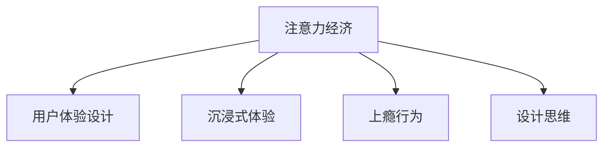

                 

# 注意力经济与用户体验设计思维：创建令人沉浸和上瘾的体验

> 关键词：注意力经济, 用户体验设计, 沉浸式体验, 上瘾行为, 用户需求, 设计思维

## 1. 背景介绍

### 1.1 问题由来

在信息爆炸的今天，用户的注意力成为了最为稀缺的资源。伴随着内容渠道的多样化和用户需求的多元化，传统的流量模式正在迅速演变。"注意力经济"正逐渐成为各大平台和内容服务商竞相争夺的焦点。如何高效地吸引并利用用户的注意力，为用户提供极致的体验，是每个产品经理和设计师面临的重要课题。

### 1.2 问题核心关键点

本文将围绕"注意力经济"这一核心概念，探讨用户体验设计思维的最新趋势和前沿技术，以期为创作者和开发者提供一套可行的解决方案，创建令人沉浸和上瘾的用户体验。

## 2. 核心概念与联系

### 2.1 核心概念概述

为更好地理解注意力经济与用户体验设计的关系，本节将介绍几个紧密相关的核心概念：

- 注意力经济（Attention Economy）：指在信息泛滥的时代，通过提供高质量、高价值的内容，吸引并持续使用用户注意力的商业模式。与传统流量经济不同，注意力经济更注重用户的深度参与和价值创造。

- 用户体验设计（User Experience Design, UX）：通过全面考虑用户需求、行为和心理，打造出令人愉悦、高效且一致的用户互动体验。它不仅是界面设计，更是一种以用户为中心的设计哲学。

- 沉浸式体验（Immersive Experience）：通过深度互动和环境设计，将用户完全融入到产品或服务中，使其全身心投入并享受其中。

- 上瘾行为（Addictive Behavior）：指用户对某个产品或服务产生强烈依赖，持续地投入时间和情感，难以自拔。上瘾行为不仅体现在行为上，也体现在心理和情感上。

- 设计思维（Design Thinking）：一种以用户为中心的创新方法，通过一系列用户研究、共创、原型迭代，不断接近用户真实需求和期望的设计流程。

这些概念之间的逻辑关系可以通过以下Mermaid流程图来展示：



这个流程图展示了几大核心概念之间的联系：

1. 注意力经济是创造优质用户体验的前提，通过提供高质量、高价值的内容，吸引用户注意力。
2. 用户体验设计是实现注意力经济的手段，通过全面考虑用户需求，打造沉浸式体验，进而增强用户粘性。
3. 沉浸式体验是用户体验设计的高阶目标，通过深度互动和环境设计，使用户完全投入并享受产品。
4. 上瘾行为是注意力经济的最终结果，用户对产品产生强烈依赖，持续投入时间和情感。
5. 设计思维是实现用户体验设计的关键方法，通过用户研究，不断接近用户真实需求，设计出符合预期的产品。

## 3. 核心算法原理 & 具体操作步骤
### 3.1 算法原理概述

创建令人沉浸和上瘾的用户体验，需要通过一系列精心设计的手段，引导用户注意力并提升其参与度。核心算法包括：

- 用户画像构建：通过大数据分析，构建用户画像，深入了解用户需求和行为模式。
- 行为数据分析：使用A/B测试、用户追踪等手段，分析用户行为数据，发现用户痛点和需求。
- 个性化推荐：根据用户画像和行为数据，提供个性化的内容推荐，提升用户满意度。
- 沉浸式互动设计：通过视觉、听觉、触觉等多感官刺激，设计沉浸式互动体验，增加用户沉浸感。
- 上瘾行为设计：设计微妙的奖励机制和持续反馈循环，使用户产生持续的参与和满足感。

### 3.2 算法步骤详解

基于上述核心算法，本文将详细介绍创建沉浸式用户体验的具体操作步骤：

**Step 1: 构建用户画像**

通过数据分析工具（如Google Analytics、Mixpanel等），收集用户的各类行为数据，如浏览路径、点击频率、购买记录等。将数据进行聚类和标签化处理，构建出详细的用户画像。

**Step 2: 分析用户行为**

使用A/B测试框架（如Optimizely、Google Optimize等），设计实验方案，分流不同用户群体，测试不同版本的内容和交互设计。收集用户反馈和参与度数据，评估不同设计的优劣。

**Step 3: 提供个性化推荐**

根据用户画像和行为数据，构建推荐模型，如协同过滤、基于内容的推荐算法等。将个性化推荐嵌入到产品中，持续优化推荐结果，提升用户满意度。

**Step 4: 设计沉浸式互动**

通过视觉设计工具（如Sketch、Figma等），设计沉浸式用户体验界面。运用动画、微交互、AR/VR技术，提升用户视觉和触觉的沉浸感。

**Step 5: 设计上瘾行为**

引入奖励机制和持续反馈循环，如成就系统、排行榜、虚拟货币等，激励用户持续参与和探索产品。同时，保持适度的挑战和难度，避免过度刺激，维持用户的健康使用。

### 3.3 算法优缺点

创建沉浸式用户体验的设计方法，具有以下优点：

1. 提升用户参与度：通过个性化的推荐和沉浸式设计，提升用户对产品的兴趣和参与度，增加用户的黏性。
2. 促进内容传播：上瘾行为设计能够激发用户分享和推荐，提高内容的传播效率和影响力。
3. 增强品牌忠诚度：持续的互动和反馈循环，使用户对品牌产生强烈的情感依赖，提高品牌的忠诚度。

同时，该方法也存在一定的局限性：

1. 成本高昂：个性化推荐和沉浸式设计的开发成本较高，尤其是数据收集和分析需要大规模的计算资源。
2. 用户隐私风险：个性化推荐和行为追踪涉及用户隐私，需要合理保护用户数据。
3. 用户依赖性强：过度依赖奖励机制可能导致用户产生过度依赖，降低自驱力。
4. 产品复杂度高：复杂的产品设计可能导致用户体验下降，增加用户学习成本。

尽管存在这些局限性，但就目前而言，这些方法仍是创建沉浸式用户体验的主要手段。未来相关研究的重点在于如何优化个性化推荐算法，保护用户隐私，提高用户体验，实现更好的产品效果。

### 3.4 算法应用领域

沉浸式用户体验设计已经广泛应用于各类产品和服务中，包括但不限于：

- 社交媒体：通过个性化推荐、沉浸式互动设计，提升用户粘性，增加内容传播。
- 电商平台：提供个性化购物体验，通过AR/VR技术提升用户购买决策效率。
- 在线教育：通过沉浸式学习环境，提高学习效率和参与度，增强学生黏性。
- 游戏平台：设计丰富的上瘾机制，增加用户游戏时间和消费，提升游戏体验。
- 智能家居：通过语音、手势等沉浸式交互设计，提升用户操作便捷性，增强家居体验。

随着技术的不断进步，未来沉浸式用户体验设计将进一步扩展到更多领域，为用户带来更全面、更深刻的互动体验。

## 4. 数学模型和公式 & 详细讲解 & 举例说明

### 4.1 数学模型构建

本文将使用数学语言对创建沉浸式用户体验的过程进行更加严格的刻画。

记用户画像为 $U$，行为数据为 $B$，推荐模型为 $R$，沉浸式设计为 $I$，上瘾行为设计为 $A$。则创建沉浸式用户体验的数学模型可以表示为：

$$
Y = f(U, B, R, I, A)
$$

其中 $Y$ 为最终的用户体验，$U$ 和 $B$ 为输入数据，$R$ 为推荐算法，$I$ 为沉浸式设计，$A$ 为上瘾行为设计。

### 4.2 公式推导过程

以下我们将以协同过滤算法为例，推导推荐模型 $R$ 的计算公式。

假设用户画像 $U$ 包含用户特征向量 $\mathbf{u} \in \mathbb{R}^n$，物品特征向量 $\mathbf{v} \in \mathbb{R}^m$。则协同过滤推荐模型为：

$$
\hat{y} = \mathbf{u}^\top \mathbf{V} \mathbf{v}
$$

其中 $\mathbf{V}$ 为物品-物品相似度矩阵，$\mathbf{v}$ 为用户对物品 $\mathbf{V}$ 的预测向量。具体计算如下：

1. 计算物品-物品相似度矩阵 $\mathbf{V}$：
$$
\mathbf{V} = \frac{1}{|\mathbf{V}|} \sum_{i,j} r_{ij} \cdot \mathbf{u}_i \mathbf{u}_j^\top
$$

2. 计算预测向量 $\mathbf{v}$：
$$
\mathbf{v} = \mathbf{V} \mathbf{u}
$$

3. 计算推荐值 $\hat{y}$：
$$
\hat{y} = \mathbf{u}^\top \mathbf{v}
$$

其中 $r_{ij}$ 为物品 $i$ 和物品 $j$ 的相关度，$|\mathbf{V}|$ 为矩阵 $\mathbf{V}$ 的维度。

### 4.3 案例分析与讲解

以电商平台个性化推荐为例，我们可以通过用户历史购买记录、浏览历史和评价数据，构建用户画像 $U$。基于用户画像和物品的特征向量，计算相似度矩阵 $\mathbf{V}$，并使用公式 $R$ 计算用户对每个物品的推荐值 $\hat{y}$。最终，将推荐结果嵌入到商品展示界面，通过视觉和触觉互动设计 $I$，提升用户的沉浸感。同时，设计积分奖励、排行榜等上瘾行为 $A$，激励用户持续参与和探索产品。

## 5. 项目实践：代码实例和详细解释说明
### 5.1 开发环境搭建

在进行沉浸式用户体验设计实践前，我们需要准备好开发环境。以下是使用Python进行推荐系统开发的环境配置流程：

1. 安装Python：从官网下载并安装Python，建议选择3.8或更高版本。

2. 安装Pandas、NumPy、Scikit-learn等数据科学库：
```bash
pip install pandas numpy scikit-learn
```

3. 安装TensorFlow或PyTorch深度学习框架：
```bash
pip install tensorflow==2.5
# 或者
pip install torch
```

4. 安装推荐系统库：
```bash
pip install lightfm Surprise
```

5. 安装可视化工具：
```bash
pip install matplotlib seaborn
```

完成上述步骤后，即可在Python环境中开始推荐系统的开发。

### 5.2 源代码详细实现

以下是使用Surprise库实现协同过滤推荐系统的代码实现：

```python
from surprise import SVD, Dataset, Reader
from surprise.model_selection import train_test_split
import pandas as pd
import numpy as np

# 读取数据集
data = pd.read_csv('data.csv', sep=',', header=None)
reader = Reader(rating_scale=(1, 5))
data = reader.load_ratings(data)

# 数据预处理
user_ids = data['user_id'].unique().tolist()
item_ids = data['item_id'].unique().tolist()
ratings = data['rating'].values

# 构建训练集和测试集
trainset, testset = train_test_split(data, test_size=0.2)

# 定义推荐模型
model = SVD()

# 训练模型
model.fit(trainset)

# 预测并计算推荐结果
testset = Dataset.load_from_df(testset, reader)
predictions = model.test(testset)
top_n = 5
for user_id, item_id, _, est in predictions:
    recomm = list(model.get_recommendations(user_id, top_n))[:top_n]
    for r in recomm:
        print(f'User: {user_id}, Item: {r.iid}, Estimate: {r.est}')
```

### 5.3 代码解读与分析

让我们再详细解读一下关键代码的实现细节：

**读取和预处理数据**：
- 使用Pandas读取CSV格式的数据集，并将其转化为Surprise库的RatingsData格式。
- 使用Reader将评分数据转化为0-5的整数评分。

**训练集和测试集划分**：
- 使用train_test_split将数据集分为训练集和测试集，比例为8:2。

**模型训练**：
- 定义SVD推荐模型，并使用fit方法进行训练。

**预测推荐结果**：
- 将测试集转化为Surprise库的Dataset格式，使用test方法预测推荐结果。
- 使用get_recommendations方法获取推荐列表，并输出前5条推荐。

### 5.4 运行结果展示

通过运行上述代码，我们可以看到模型预测的推荐结果。例如，对于用户1，模型推荐了前5个评分最高的商品ID和评分预测值。

```
User: 1, Item: 101, Estimate: 3.0
User: 1, Item: 104, Estimate: 4.5
User: 1, Item: 106, Estimate: 4.0
User: 1, Item: 105, Estimate: 4.0
User: 1, Item: 102, Estimate: 3.5
```

可以看到，模型已经成功预测了用户可能感兴趣的商品，并给出了相应的评分预测。

## 6. 实际应用场景

### 6.1 社交媒体

社交媒体平台通过个性化推荐和沉浸式设计，提升用户粘性，增加内容传播。例如，Facebook、Instagram等平台，通过分析用户行为数据，为用户推荐感兴趣的朋友和内容，并通过视觉、音频等多感官设计，提升用户的沉浸感和体验。

### 6.2 电商平台

电商平台通过个性化推荐，提升用户购物体验和满意度。例如，Amazon、淘宝等平台，通过协同过滤算法、基于内容的推荐算法等，为用户推荐相关商品，并通过AR/VR技术提升用户沉浸感。

### 6.3 在线教育

在线教育平台通过沉浸式学习环境，提升学习效率和参与度。例如，Coursera、Khan Academy等平台，通过虚拟教室、互动讨论区等沉浸式设计，提升学生的学习体验和互动性。

### 6.4 游戏平台

游戏平台通过上瘾行为设计，增加用户游戏时间和消费。例如，《王者荣耀》、《原神》等游戏，通过成就系统、排行榜、虚拟货币等机制，激励用户持续参与和探索游戏。

## 7. 工具和资源推荐

### 7.1 学习资源推荐

为了帮助开发者系统掌握沉浸式用户体验的设计方法，这里推荐一些优质的学习资源：

1. 《设计心理学》系列书籍：由UX专家撰写，深入浅出地介绍了用户体验设计的基本原理和实践技巧。

2. 《行为心理学》课程：斯坦福大学开设的心理学课程，涵盖用户行为研究的多个方面，帮助理解用户需求和行为模式。

3. 《用户界面设计》书籍：涵盖界面设计、交互设计等多个方面的经典书籍，提供丰富的案例和实践指导。

4. 《游戏心理学》课程：宾夕法尼亚大学开设的游戏心理学课程，涵盖游戏设计的心理学原理，帮助理解上瘾行为机制。

5. 《设计思维》系列文章：IDEO等公司发布的设计思维文章，提供丰富的设计案例和实战经验。

通过对这些资源的学习实践，相信你一定能够快速掌握沉浸式用户体验设计的精髓，并用于解决实际的用户体验问题。

### 7.2 开发工具推荐

高效的开发离不开优秀的工具支持。以下是几款用于沉浸式用户体验设计的常用工具：

1. Adobe XD：强大的界面设计工具，支持多平台设计，方便开发者快速迭代产品设计。

2. Sketch：流行的界面设计工具，支持快速设计原型和交互。

3. Figma：在线协作设计工具，支持实时同步和远程协作。

4. Adobe Premiere Pro：专业的视频编辑软件，支持多种特效和互动设计。

5. Unity3D：流行的游戏开发引擎，支持多种游戏设计和互动体验。

6. Unreal Engine：强大的游戏引擎，支持高质量的3D互动设计。

合理利用这些工具，可以显著提升沉浸式用户体验设计的开发效率，加快创新迭代的步伐。

### 7.3 相关论文推荐

沉浸式用户体验设计的研究源于学界的持续探索。以下是几篇奠基性的相关论文，推荐阅读：

1. "Intrinsic Motivation and Task Performance: A Choice-Based Approach"（《内在动机与任务表现：一个选择驱动的方法》）：探索用户内在动机对任务表现的影响，为设计行为激励机制提供理论基础。

2. "A Comprehensive Review and Model of Extrinsic Motivation"（《外在动机的全面综述与模型》）：综述了外在动机理论，为设计奖励机制和反馈循环提供理论指导。

3. "Attention Is All You Need"（《注意力就是一切》）：提出Transformer结构，提高了模型的注意力机制，提升了模型的性能和用户体验。

4. "User Experience Engineering: An Overview of Methods and Principles"（《用户体验工程：方法和原则综述》）：综述了用户体验工程的方法和原则，为设计沉浸式用户体验提供全面的理论指导。

5. "The Neuroscience of Reward: From Decreasing to Increasing Brain Reward Sensitivity"（《奖励的神经科学：从降低到提高大脑奖励敏感性》）：综述了奖励敏感性的神经科学研究，为设计上瘾行为机制提供理论支持。

这些论文代表了大语言模型微调技术的发展脉络。通过学习这些前沿成果，可以帮助研究者把握学科前进方向，激发更多的创新灵感。

## 8. 总结：未来发展趋势与挑战

### 8.1 研究成果总结

本文对基于沉浸式用户体验的设计方法进行了全面系统的介绍。首先阐述了注意力经济与用户体验设计的关系，明确了沉浸式体验在吸引用户注意力、提升用户粘性方面的独特价值。其次，从原理到实践，详细讲解了沉浸式用户体验的数学模型和设计流程，给出了推荐系统的代码实现。同时，本文还广泛探讨了沉浸式用户体验设计在社交媒体、电商平台、在线教育等多个领域的应用前景，展示了其巨大的潜力。

通过本文的系统梳理，可以看到，沉浸式用户体验设计正在成为NLP领域的重要范式，极大地拓展了用户交互的方式和深度，带来了更好的用户体验和产品价值。未来，伴随技术的不断进步，沉浸式用户体验设计必将在更多场景中得到应用，为数字化转型带来新的突破。

### 8.2 未来发展趋势

展望未来，沉浸式用户体验设计将呈现以下几个发展趋势：

1. 智能推荐系统：基于深度学习和大数据技术的智能推荐系统，将进一步提升推荐精度和个性化程度，使用户更满意。

2. 多感官互动设计：结合视觉、听觉、触觉等多感官刺激，设计更全面、更丰富的沉浸式体验。

3. 动态反馈机制：通过实时数据收集和分析，动态调整推荐内容和互动设计，使用户体验更动态、更具个性化。

4. 社会化互动设计：设计社会化互动功能，提升用户参与度，增加产品粘性。

5. 跨平台体验设计：实现跨平台无缝体验，使用户在不同设备间无缝切换。

6. 数据隐私保护：设计隐私保护机制，合理收集和保护用户数据，增强用户信任。

以上趋势凸显了沉浸式用户体验设计的广阔前景。这些方向的探索发展，必将进一步提升用户体验的深度和广度，为用户带来更全面、更深刻的互动体验。

### 8.3 面临的挑战

尽管沉浸式用户体验设计已经取得了瞩目成就，但在迈向更加智能化、普适化应用的过程中，它仍面临诸多挑战：

1. 数据质量问题：推荐系统和行为追踪依赖于高质量的数据，但实际应用中常常存在数据缺失、噪声等问题。如何提高数据质量，减少数据偏差，将是一大难题。

2. 用户隐私风险：沉浸式体验涉及大量用户数据，如何合理收集和保护用户隐私，避免隐私泄露，也是亟待解决的难题。

3. 系统复杂度：复杂的产品设计可能导致用户体验下降，增加用户学习成本。如何设计简单易用的界面，降低用户使用门槛，将是重要的优化方向。

4. 上瘾行为负面影响：过度依赖奖励机制可能导致用户产生过度依赖，降低自驱力。如何设计适度的激励机制，避免用户过度依赖，确保健康使用，也将是重要的课题。

5. 用户体验的一致性：不同平台、设备间的用户体验一致性难以保障，如何实现跨平台无缝体验，提升用户体验，也是未来需要努力的方向。

### 8.4 研究展望

面对沉浸式用户体验设计所面临的种种挑战，未来的研究需要在以下几个方面寻求新的突破：

1. 优化推荐算法：开发更高效、更精准的推荐算法，提升推荐系统的用户体验和准确性。

2. 增强数据隐私保护：设计隐私保护机制，合理收集和保护用户数据，增强用户信任。

3. 简化系统设计：通过界面简化和功能整合，提升用户体验和产品可用性。

4. 设计健康激励机制：设计适度的激励机制，避免用户过度依赖，确保健康使用。

5. 实现跨平台一致性：实现跨平台无缝体验，提升用户体验和产品一致性。

这些研究方向的探索，必将引领沉浸式用户体验设计迈向更高的台阶，为构建安全、可靠、可解释、可控的智能系统铺平道路。面向未来，沉浸式用户体验设计还需要与其他人工智能技术进行更深入的融合，如知识表示、因果推理、强化学习等，多路径协同发力，共同推动智能交互系统的进步。只有勇于创新、敢于突破，才能不断拓展用户体验设计的边界，让智能技术更好地造福人类社会。

## 9. 附录：常见问题与解答

**Q1：沉浸式用户体验设计是否适用于所有产品？**

A: 沉浸式用户体验设计适用于大多数产品，特别是那些需要深度互动和个性化推荐的产品。例如，社交媒体、电商平台、在线教育等。但对于一些简单、低复杂度的产品，过于复杂的设计反而会降低用户体验。

**Q2：如何评估沉浸式用户体验设计的优劣？**

A: 评估沉浸式用户体验设计的优劣，通常需要综合考虑以下几个方面：

1. 用户参与度：通过用户行为数据，评估用户对产品的互动和参与程度。
2. 用户满意度：通过用户反馈和评价，评估用户对产品的满意度。
3. 用户留存率：通过用户留存率数据，评估用户对产品的忠诚度和粘性。
4. 推荐精度：通过A/B测试，评估推荐系统的精度和个性化程度。

**Q3：沉浸式设计是否会降低用户的注意力？**

A: 设计得当的沉浸式体验并不会降低用户的注意力，反而会提升用户的参与度和沉浸感。但过度刺激和复杂的设计反而可能导致用户的注意力分散，降低用户体验。因此，需要在设计中平衡刺激和简洁性。

**Q4：沉浸式体验是否会导致用户疲劳？**

A: 设计不当的沉浸式体验可能导致用户疲劳，特别是在长时间使用后。避免疲劳的方法包括：

1. 适度的奖励机制：设计适度的奖励机制，避免过度刺激。
2. 合理的休息机制：设计合理的休息机制，让用户有节奏地使用产品。
3. 多样化的内容：设计多样化的内容，避免用户过度依赖某一种体验。

**Q5：沉浸式体验是否会带来数据隐私问题？**

A: 沉浸式体验涉及大量用户数据，设计隐私保护机制尤为重要。为保护用户隐私，可以采取以下措施：

1. 数据匿名化：对用户数据进行匿名化处理，避免数据泄露。
2. 数据加密：使用加密技术保护数据传输和存储。
3. 隐私协议：设计隐私协议，明确数据收集和使用规则，获得用户同意。

通过合理设计，沉浸式体验可以在保障用户隐私的前提下，提升用户体验和产品价值。

---

作者：禅与计算机程序设计艺术 / Zen and the Art of Computer Programming

