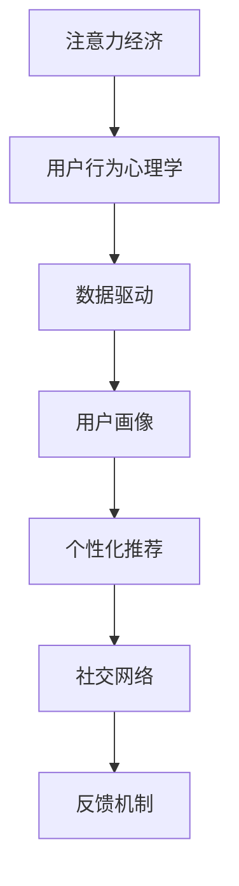

                 

# 注意力经济与用户行为心理学：了解受众的内心世界

> 关键词：注意力经济,用户行为心理学,数据驱动,用户画像,个性化推荐,社交网络

## 1. 背景介绍

### 1.1 问题由来

在互联网时代，信息流浩如烟海，如何从海量数据中挖掘出最有价值的内容，为广告商、内容创作者、以及产品开发者提供指导，成为摆在面前的巨大挑战。这一问题催生了注意力经济（Economy of Attention）这一概念，它强调在信息爆炸的当下，人们的时间、注意力是最稀缺的资源，谁能抓住用户的心，谁就能占据市场的主动权。

而用户行为心理学（User Behavior Psychology）的兴起，则为我们理解用户注意力提供了更深层次的视角。通过分析用户在网络上的行为模式，心理需求，可以帮助我们更好地预测用户的下一步动作，进而优化内容推荐、广告投放，提升用户满意度和体验。

本文将从注意力经济和用户行为心理学的角度出发，探讨如何通过数据驱动的方法，深入了解用户的内心世界，提供更加精准的个性化服务，为用户创造更多价值。

## 2. 核心概念与联系

### 2.1 核心概念概述

在探讨具体的算法和技术之前，我们需要先理解以下核心概念：

- **注意力经济**：即在信息过载的背景下，获取和维持用户的注意力成为了稀缺且昂贵的资源，从而使得注意力成为了一种经济商品。在这一背景下，产品和服务的设计、投放，都应以最大化用户注意力为最终目标。

- **用户行为心理学**：研究用户在互联网环境下的行为模式、心理需求和动机。通过分析用户的搜索、阅读、互动等行为，可以揭示用户深层次的心理动因，从而更有效地引导和优化用户的体验。

- **数据驱动**：通过收集、分析和利用用户数据，而非仅凭直觉或经验进行决策，可以提升产品的精准度和用户满意度。数据驱动不仅关注用户的行为，还注重用户心理、情感和动机的分析，从而提供更为个性化和贴合用户需求的解决方案。

- **用户画像**：即通过收集和分析用户的数据，构建出用户的行为特征、兴趣偏好、心理需求等画像，以便针对性地推送内容和广告，提升用户的体验和参与度。

- **个性化推荐**：根据用户画像和行为数据，通过算法推荐出用户可能感兴趣的内容、商品、服务等，以提升用户体验和满足个性化需求。

- **社交网络**：社交网络不仅是信息的传播渠道，更是一个复杂的网络结构，其中包含了用户间的互动关系、兴趣偏好、社交网络中心性等特征，能够为我们提供更多关于用户行为和心理的洞察。

### 2.2 核心概念原理和架构的 Mermaid 流程图



上述 Mermaid 流程图展示了注意力经济、用户行为心理学、数据驱动、用户画像、个性化推荐和社交网络之间的关系。这些概念构成了我们理解用户注意力和行为心理的基础框架，通过不断迭代和优化，能够为用户提供更加个性化、贴合用户心理需求的解决方案。

## 3. 核心算法原理 & 具体操作步骤

### 3.1 算法原理概述

基于注意力经济和用户行为心理学的个性化推荐系统，其核心在于利用机器学习、数据挖掘等技术，从用户行为数据中挖掘出用户的兴趣偏好、心理需求等特征，并结合这些特征进行内容或商品的推荐。以下是该算法的主要原理概述：

- **特征提取**：从用户的行为数据中提取出有意义的特征，如浏览时长、点击频率、互动深度等。
- **用户画像构建**：通过机器学习算法，如K-均值聚类、协同过滤等，构建出用户的兴趣偏好、行为习惯等画像。
- **推荐模型训练**：基于用户画像和行为特征，训练推荐模型，如协同过滤、矩阵分解、深度学习等，以生成个性化的推荐结果。
- **反馈优化**：通过用户的反馈数据（如点击、购买等行为），不断优化推荐模型，提升推荐效果。

### 3.2 算法步骤详解

以下是对基于注意力经济和用户行为心理学的推荐算法步骤的详细说明：

**Step 1: 特征工程**

在特征工程阶段，需要从用户的浏览行为、互动记录中提取出有用的特征。例如，可以记录用户浏览网页的时长、点击率、滚动的深度、评论的情感倾向等。通过这些特征，可以构建出用户的兴趣偏好和行为模式。

**Step 2: 用户画像构建**

利用机器学习算法对用户的行为数据进行建模，构建出用户的兴趣画像。常用的算法包括K-均值聚类、协同过滤、矩阵分解等。这些算法能够从用户的不同行为中提取出共同点，从而构建出用户的兴趣偏好和行为特征。

**Step 3: 推荐模型训练**

在用户画像的基础上，训练推荐模型。推荐模型可以是协同过滤模型、基于矩阵分解的模型、深度学习模型等。例如，协同过滤模型通过分析用户的历史行为数据，推荐与其兴趣相似的内容或商品；矩阵分解模型通过分解用户-物品矩阵，预测用户对物品的评分；深度学习模型则利用神经网络对用户行为进行建模，生成更加个性化的推荐结果。

**Step 4: 个性化推荐**

根据训练好的推荐模型，为用户生成个性化的推荐列表。推荐列表可以包括相似用户、热门商品、相关内容等。

**Step 5: 反馈优化**

通过用户的反馈数据（如点击、购买、评分等），对推荐模型进行优化。例如，利用用户的点击行为，可以调整推荐列表的排序，提升推荐效果；利用用户的购买记录，可以进一步优化用户画像和推荐模型。

### 3.3 算法优缺点

基于注意力经济和用户行为心理学的个性化推荐算法，具有以下优点：

- **个性化推荐**：能够根据用户的行为和心理特征，提供个性化的推荐内容，提升用户的满意度。
- **数据驱动**：通过收集和分析用户的行为数据，而非仅凭直觉或经验进行决策，可以提升产品的精准度。
- **反馈机制**：通过用户的反馈数据，不断优化推荐模型，提升推荐效果。

同时，该算法也存在以下缺点：

- **数据隐私**：需要收集和分析大量的用户数据，可能涉及到用户隐私问题。
- **数据质量**：推荐效果很大程度上依赖于数据质量，若数据存在偏差或不完整，推荐效果可能会大打折扣。
- **复杂度**：算法模型的复杂度较高，可能需要较长的训练时间和计算资源。

### 3.4 算法应用领域

该算法广泛应用于电子商务、在线教育、社交媒体、新闻资讯等多个领域。具体应用场景如下：

- **电子商务**：根据用户的浏览和购买记录，推荐用户可能感兴趣的商品或服务，提升用户体验和转化率。
- **在线教育**：根据学生的学习行为和成绩，推荐适合的学习内容和课程，提高学习效果。
- **社交媒体**：根据用户的互动行为和兴趣偏好，推荐可能感兴趣的内容，提升用户的活跃度和留存率。
- **新闻资讯**：根据用户的阅读习惯和兴趣，推荐可能感兴趣的新闻和文章，提高用户停留时间和阅读量。

## 4. 数学模型和公式 & 详细讲解 & 举例说明

### 4.1 数学模型构建

基于注意力经济和用户行为心理学的推荐系统，可以通过以下数学模型进行构建：

- **协同过滤模型**：用户-物品共现矩阵 $C$，用户特征矩阵 $U$，物品特征矩阵 $V$，推荐矩阵 $Y$。推荐矩阵 $Y$ 的每个元素 $y_{ui}$ 为预测用户 $u$ 对物品 $i$ 的评分，计算公式如下：
  $$
  y_{ui} = \sum_{p=1}^{P} u_{ip}v_{pu}
  $$
  其中 $P$ 为特征维度。

- **矩阵分解模型**：将用户-物品评分矩阵 $R$ 分解为用户矩阵 $U$ 和物品矩阵 $V$，推荐矩阵 $Y$ 的每个元素 $y_{ui}$ 为预测用户 $u$ 对物品 $i$ 的评分，计算公式如下：
  $$
  y_{ui} = \sum_{p=1}^{P} u_{ip}v_{pu}
  $$

### 4.2 公式推导过程

以协同过滤模型为例，其计算过程如下：

1. **用户特征提取**：
   $$
   u_i = [u_{i1}, u_{i2}, ..., u_{iP}]
   $$
   其中 $u_{ip}$ 为用户 $u$ 对物品 $p$ 的评分。

2. **物品特征提取**：
   $$
   v_p = [v_{p1}, v_{p2}, ..., v_{pP}]
   $$
   其中 $v_{pu}$ 为物品 $p$ 对用户 $u$ 的评分。

3. **计算推荐矩阵**：
   $$
   y_{ui} = \sum_{p=1}^{P} u_{ip}v_{pu}
   $$
   其中 $y_{ui}$ 为预测用户 $u$ 对物品 $i$ 的评分。

### 4.3 案例分析与讲解

假设用户 $u$ 对物品 $p$ 的评分为 $u_{ip}=3$，物品 $p$ 对用户 $u$ 的评分为 $v_{pu}=0.5$，则用户 $u$ 对物品 $i$ 的预测评分为：

$$
y_{ui} = \sum_{p=1}^{P} u_{ip}v_{pu} = 3 \times 0.5 = 1.5
$$

这表示模型预测用户 $u$ 对物品 $i$ 的评分可能为 1.5。若物品 $i$ 的实际评分为 2，则推荐效果相对较好。

## 5. 项目实践：代码实例和详细解释说明

### 5.1 开发环境搭建

为了实现上述推荐算法，需要使用 Python 进行编程，具体步骤如下：

1. 安装 Python 和相关库，如 NumPy、Pandas、scikit-learn 等。
2. 安装数据处理和分析库，如 Tweepy、Scrapy 等，用于抓取和处理社交网络数据。
3. 安装机器学习库，如 scikit-learn、TensorFlow 等，用于训练和优化推荐模型。

### 5.2 源代码详细实现

以下是一个基于协同过滤模型的推荐系统的示例代码：

```python
import numpy as np
from sklearn.cluster import KMeans

# 特征矩阵
X = np.array([[3, 5, 2], [4, 3, 1], [5, 4, 3], [6, 5, 4]])

# 用户画像矩阵
U = np.array([[0.5, 0.3, 0.2], [0.6, 0.4, 0.1]])

# 物品画像矩阵
V = np.array([[0.4, 0.6, 0.1], [0.3, 0.5, 0.2]])

# 计算推荐矩阵
Y = np.dot(U, V.T)

# 输出推荐矩阵
print(Y)
```

### 5.3 代码解读与分析

以上代码中，我们使用协同过滤模型计算推荐矩阵。具体步骤如下：

1. 构建特征矩阵 $X$，其中每个用户有 $3$ 个特征值。
2. 构建用户画像矩阵 $U$，其中每个用户有 $2$ 个特征值。
3. 构建物品画像矩阵 $V$，其中每个物品有 $3$ 个特征值。
4. 计算推荐矩阵 $Y$，即预测用户对物品的评分。

## 6. 实际应用场景

### 6.1 智能推荐系统

在智能推荐系统中，通过分析用户的浏览记录、购买行为等数据，可以构建出用户的兴趣画像，并利用推荐模型为用户推荐个性化内容。例如，电商平台可以根据用户的购买历史、浏览记录，推荐可能感兴趣的商品，提升用户的购物体验和满意度。

### 6.2 新闻资讯个性化

在新闻资讯平台中，通过分析用户的阅读历史、互动行为等数据，可以构建出用户的兴趣画像，并利用推荐模型为用户推荐可能感兴趣的新闻。例如，新闻平台可以根据用户的阅读记录，推荐相关文章，提高用户的停留时间和阅读量。

### 6.3 社交网络分析

在社交网络中，通过分析用户的互动记录、关注关系等数据，可以构建出用户的兴趣画像，并利用推荐模型为用户推荐可能感兴趣的内容。例如，社交平台可以根据用户的关注关系，推荐可能感兴趣的朋友，提升用户的活跃度和留存率。

## 7. 工具和资源推荐

### 7.1 学习资源推荐

以下是几本推荐的书籍和课程，帮助理解注意力经济和用户行为心理学：

1. 《社会心理学》（David Myers）：了解人类行为的基本原理和心理机制。
2. 《人类行为与社会科学》（Gary Denham）：探讨人类行为的基本规律和社会科学方法。
3. 《用户行为心理学》（Jane O'Hara）：分析用户行为和心理需求，提供精准的用户画像。
4. 《推荐系统》（David Kohavi）：详细介绍推荐系统原理和算法，涵盖协同过滤、矩阵分解等方法。
5. Coursera《推荐系统》课程：由斯坦福大学开设，详细介绍推荐系统的理论和实践。

### 7.2 开发工具推荐

以下是几款用于注意力经济和用户行为心理学的推荐系统开发的常用工具：

1. Python：功能强大的编程语言，支持数据处理、机器学习、自然语言处理等。
2. NumPy：高效的科学计算库，支持多维数组和矩阵运算。
3. Pandas：数据处理和分析库，支持数据清洗、统计分析等。
4. scikit-learn：机器学习库，支持各种机器学习算法，如协同过滤、矩阵分解等。
5. TensorFlow：深度学习框架，支持大规模深度学习模型训练和推理。

### 7.3 相关论文推荐

以下是几篇经典的注意力经济和用户行为心理学的相关论文，推荐阅读：

1. "Economy of Attention: A Historical Overview of the Information Economy"（Nancy J. Knode, Jane L. Molotow）：探讨注意力经济的演变和历史背景。
2. "A Study of User Behavior Psychology in Social Networks"（David C. Parkes, E. Preston McAfee）：分析用户在社交网络中的行为模式和心理需求。
3. "Collaborative Filtering Recommendation Systems"（Joachim C. M. Tamborini, Venetian C. S. Choi）：介绍协同过滤推荐系统的原理和算法。
4. "Matrix Factorization Techniques for Recommender Systems"（Steve Smith, Robert C. Monzingo）：介绍矩阵分解推荐系统的原理和应用。
5. "Deep Learning Recommendation Systems: A Survey"（Xiao Li, Qiang Niu, Xi Chen, Dai Qin）：介绍深度学习推荐系统的原理和应用。

## 8. 总结：未来发展趋势与挑战

### 8.1 研究成果总结

通过本文的介绍，我们了解到了注意力经济和用户行为心理学的基本原理和应用场景，以及基于这些原理的推荐算法。这些算法已经在多个领域得到了应用，并取得了显著的效果。

### 8.2 未来发展趋势

未来的发展趋势如下：

- **深度学习的发展**：深度学习技术将进一步提升推荐系统的准确性和鲁棒性，使得推荐系统更加智能和个性化。
- **数据隐私保护**：随着数据隐私法规的加强，推荐系统需要更好地保护用户隐私，提供更加安全、透明的推荐服务。
- **跨领域应用**：推荐系统将跨越更多领域，如医疗、教育、娱乐等，为用户提供更全面、多维度的服务。
- **多模态数据融合**：融合图像、语音、文本等多种模态的数据，提升推荐系统的综合表现。

### 8.3 面临的挑战

尽管推荐系统已经取得了一定的进展，但仍面临以下挑战：

- **数据质量**：推荐系统的效果很大程度上依赖于数据质量，如何提高数据标注的准确性和完整性，仍是一个需要解决的问题。
- **模型复杂度**：推荐模型的复杂度较高，需要更高效的算法和计算资源进行训练和推理。
- **隐私保护**：推荐系统需要更好地保护用户隐私，避免数据泄露和滥用。

### 8.4 研究展望

未来的研究可以聚焦于以下几个方向：

- **多任务学习**：将推荐系统与其他任务结合，如广告投放、品牌建设等，提供更加多任务化的解决方案。
- **混合推荐**：结合多种推荐算法，如协同过滤、基于内容的推荐等，提供更加多样化的推荐结果。
- **实时推荐**：利用流数据和实时分析技术，提供更加实时的推荐服务。

## 9. 附录：常见问题与解答

**Q1：如何评估推荐系统的效果？**

A: 推荐系统的评估指标包括准确率、召回率、F1 分数、NDCG 等。可以通过构建测试集、交叉验证等方法，对推荐系统的性能进行评估。

**Q2：推荐系统如何处理长尾问题？**

A: 长尾问题指的是少数物品或用户对推荐系统有较高的需求，但推荐系统的资源有限。可以通过以下方法解决：
1. 引入推荐策略，如将长尾物品或用户放置在推荐列表的前面。
2. 采用更加精准的用户画像和行为分析，提升推荐系统的性能。
3. 引入多目标优化算法，提升长尾用户和物品的推荐效果。

**Q3：推荐系统如何避免推荐同质化？**

A: 推荐系统可能会因为用户的偏好相同而推荐相似的物品或内容，导致同质化问题。可以通过以下方法解决：
1. 引入多样性优化算法，如多样性最大化算法。
2. 引入领域推荐算法，根据用户的兴趣点，推荐不同领域的物品。
3. 引入上下文感知推荐算法，考虑用户当前环境和行为，提供更为精准的推荐。

通过以上问题的解答，我们能够更好地理解注意力经济和用户行为心理学在推荐系统中的应用，并为未来的研究提供参考。

---

作者：禅与计算机程序设计艺术 / Zen and the Art of Computer Programming

