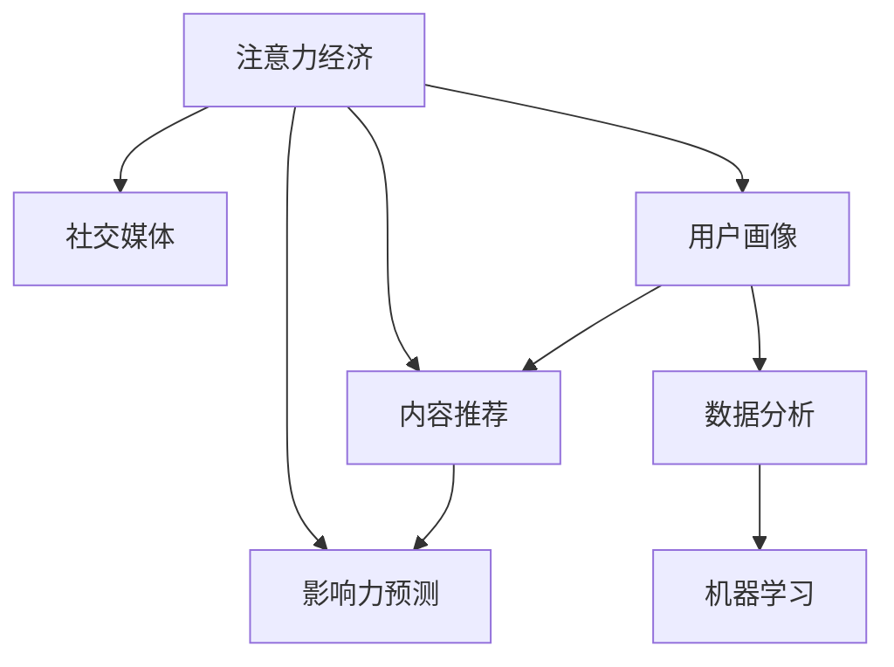

                 

# 注意力经济与社交媒体分析洞察力：了解受众参与度和影响力的秘密

> 关键词：注意力经济, 社交媒体, 受众分析, 影响力预测, 数据分析, 机器学习

## 1. 背景介绍

### 1.1 问题由来
在互联网时代，信息的海洋浩如烟海，用户的时间和注意力成为稀缺资源。尤其在社交媒体上，大量的信息流不断冲击用户的感官，用户的时间和注意力成为商家争夺的核心资产。在这样的背景下，注意力经济应运而生，旨在通过优化用户注意力分配，提升用户对商品或内容的参与度和忠诚度，从而带来更大的商业价值。

### 1.2 问题核心关键点
注意力经济的核心在于如何更精准地分析和预测用户行为，吸引和保持用户的注意力，提升用户参与度和影响力。这涉及到用户画像、内容推荐、广告投放等多个方面。而在社交媒体领域，用户行为分析更加复杂，涉及社交网络结构、用户兴趣、话题热度等多维数据。如何构建有效的分析模型，提升用户参与度和影响力，成为当前互联网公司关注的焦点。

### 1.3 问题研究意义
研究注意力经济与社交媒体分析，对于提升用户参与度和影响力，优化广告投放策略，推动社交媒体平台的发展具有重要意义。掌握这些技术，可以帮助企业更精准地触达目标用户，提升品牌价值和市场竞争力。

## 2. 核心概念与联系

### 2.1 核心概念概述

为更好地理解注意力经济与社交媒体分析，本节将介绍几个密切相关的核心概念：

- **注意力经济**：指在信息过载的背景下，通过优化用户注意力分配，提升用户对商品或内容的参与度和忠诚度，从而带来更大商业价值的一种经济模式。

- **社交媒体**：指基于互联网和移动通信技术的社交交流平台，如微博、微信、Twitter等，用户可以在平台上分享、评论、点赞等，形成社交网络。

- **用户画像**：指通过数据分析，构建用户行为和兴趣的标签集合，用于个性化推荐和广告投放。

- **内容推荐**：指根据用户兴趣和行为，推荐用户可能感兴趣的内容，提升用户参与度和满意度。

- **影响力预测**：指通过分析用户的行为和社交网络结构，预测其在特定话题或事件中的影响力，用于营销和舆情监测。

- **数据分析**：指使用统计学和机器学习技术，从海量数据中提取有用信息，支持决策制定。

- **机器学习**：指让机器从数据中学习规律，用于预测、分类、推荐等任务。

这些核心概念之间的逻辑关系可以通过以下Mermaid流程图来展示：



这个流程图展示了一些核心概念及其之间的关系：

1. 注意力经济通过优化用户注意力分配，提升用户参与度和忠诚度。
2. 社交媒体是注意力经济的重要平台，通过用户互动形成社交网络。
3. 用户画像是数据分析的结果，用于个性化推荐和广告投放。
4. 内容推荐提升用户参与度和满意度。
5. 影响力预测通过社交网络分析，预测用户影响力。
6. 数据分析从海量数据中提取有用信息，支持决策制定。
7. 机器学习用于数据分析和预测。

这些概念共同构成了注意力经济与社交媒体分析的核心框架，帮助企业在信息过载时代更精准地触达用户，提升用户参与度和影响力。

## 3. 核心算法原理 & 具体操作步骤

### 3.1 算法原理概述

注意力经济与社交媒体分析的核心算法主要涉及用户行为分析、社交网络分析、内容推荐和影响力预测等多个方面。其核心思想是通过数据分析和机器学习模型，预测和优化用户行为，提升用户参与度和影响力。

### 3.2 算法步骤详解

**Step 1: 数据准备与预处理**

- 收集社交媒体平台的用户行为数据，包括点赞、评论、分享等互动行为。
- 收集用户的基本信息，如年龄、性别、兴趣等。
- 收集社交网络数据，包括用户之间的关注关系、互动频率等。
- 对数据进行清洗和预处理，去除噪声和缺失值。

**Step 2: 用户画像构建**

- 使用数据分析技术，提取用户的兴趣、行为、社交网络结构等关键特征。
- 构建用户画像，使用标签和权重描述用户的多维度特征。
- 通过聚类算法或模型训练，将用户分为不同的兴趣群体。

**Step 3: 内容推荐系统设计**

- 使用协同过滤、矩阵分解等技术，建立内容推荐模型。
- 使用用户画像和内容特征，构建用户-内容匹配矩阵。
- 设计推荐算法，如基于深度学习的推荐系统，提升推荐精度。

**Step 4: 影响力预测与分析**

- 使用社交网络分析技术，提取用户影响力指标，如粉丝数、互动率等。
- 使用机器学习模型，预测用户在不同话题或事件中的影响力。
- 分析用户影响力因素，如社交网络结构、互动行为等。

**Step 5: 模型评估与优化**

- 使用A/B测试等方法，评估推荐系统和影响力预测模型的效果。
- 根据评估结果，调整模型参数，提升模型性能。
- 定期更新用户画像和社交网络数据，保持模型实时性。

### 3.3 算法优缺点

注意力经济与社交媒体分析算法具有以下优点：

1. 高效精准：通过数据分析和机器学习模型，能够精准预测用户行为，提升广告投放和内容推荐的效率。
2. 个性化推荐：使用用户画像和协同过滤等技术，提供个性化的内容推荐，提升用户参与度和满意度。
3. 影响力预测：通过社交网络分析，预测用户影响力，支持营销和舆情监测。

同时，这些算法也存在以下缺点：

1. 数据依赖性高：模型效果很大程度上依赖于数据质量，需要大量的用户行为和社交网络数据。
2. 复杂度高：模型涉及多个维度的数据和复杂的算法，对技术要求较高。
3. 隐私保护问题：分析用户行为和社交网络结构时，可能涉及用户隐私保护问题，需要合理设计算法和策略。
4. 数据漂移问题：用户行为和社交网络结构可能随时间变化，模型需要定期更新和调整。

尽管存在这些局限性，但就目前而言，注意力经济与社交媒体分析算法仍是提升用户参与度和影响力的重要手段。未来相关研究的重点在于如何进一步降低数据依赖，提高模型的泛化能力和可解释性，同时兼顾隐私保护和数据安全性等因素。

### 3.4 算法应用领域

注意力经济与社交媒体分析算法已经在多个领域得到应用，例如：

- 电子商务：通过用户行为分析，优化广告投放和商品推荐，提升用户购买转化率。
- 社交媒体平台：通过内容推荐和用户画像，提升用户互动率和平台粘性。
- 广告营销：通过影响力预测和社交网络分析，精准触达目标用户，提升广告投放效果。
- 舆情监测：通过用户行为和社交网络结构，预测舆情变化，支持舆情预警和危机应对。
- 广告创意优化：通过用户行为分析，优化广告创意和文案，提升广告点击率和转化率。
- 用户行为研究：通过数据分析，深入了解用户行为模式，支持产品改进和市场分析。

除了上述这些经典应用外，社交媒体分析还被创新性地应用于更多场景中，如用户情绪分析、话题趋势预测、用户行为追踪等，为社交媒体平台的持续优化提供了新的思路。

## 4. 数学模型和公式 & 详细讲解 & 举例说明

### 4.1 数学模型构建

本节将使用数学语言对注意力经济与社交媒体分析算法进行更加严格的刻画。

记社交媒体平台的用户集合为 $U$，用户之间的关注关系为 $R$，用户行为数据为 $B$，内容集合为 $C$，用户画像为 $P$，影响力预测模型为 $M$。

定义用户行为数据 $B$ 中的互动行为 $b_{ui}$ 表示用户 $u$ 对内容 $i$ 的互动次数，用户画像 $P_u$ 中的兴趣特征 $p_{ui}$ 表示用户 $u$ 对内容 $i$ 的兴趣程度，内容特征 $c_i$ 表示内容 $i$ 的特征向量，社交网络关系 $R_{uj}$ 表示用户 $u$ 与用户 $j$ 的关注关系，用户影响力 $M_u$ 表示用户 $u$ 在特定话题或事件中的影响力。

定义用户画像 $P_u$ 为：

$$
P_u = \sum_{i \in C} p_{ui} c_i
$$

其中 $p_{ui}$ 为兴趣特征权重，$c_i$ 为内容特征向量。

定义内容推荐模型 $M$ 为：

$$
M_{ui} = \alpha \sum_{j \in N_u} b_{uj} R_{uj} P_j + \beta \sum_{i \in C} p_{ui} c_i
$$

其中 $\alpha$ 和 $\beta$ 为模型参数，$N_u$ 为用户 $u$ 的关注用户集合。

定义用户影响力预测模型 $M$ 为：

$$
M_u = \gamma \sum_{i \in C} b_{ui} c_i + \delta \sum_{j \in N_u} R_{uj} M_j
$$

其中 $\gamma$ 和 $\delta$ 为模型参数，$N_u$ 为用户 $u$ 的关注用户集合。

### 4.2 公式推导过程

以下我们以用户画像构建和内容推荐为例，推导相关的数学公式。

假设社交媒体平台有 $n$ 个用户 $U=\{u_1, u_2, \ldots, u_n\}$，用户行为数据包含 $m$ 个内容 $C=\{i_1, i_2, \ldots, i_m\}$，用户画像 $P_u$ 由 $k$ 个兴趣特征 $p_{ui} \in \mathbb{R}^k$ 组成。

定义用户行为矩阵 $B \in \mathbb{R}^{n \times m}$，其中 $B_{ui}$ 表示用户 $u$ 对内容 $i$ 的互动次数。

定义用户画像矩阵 $P \in \mathbb{R}^{n \times k}$，其中 $P_{ui}$ 表示用户 $u$ 对内容 $i$ 的兴趣程度。

通过矩阵分解，可以表示用户画像 $P_u$ 为：

$$
P_u = P_u^{\text{user}} P_u^{\text{content}}
$$

其中 $P_u^{\text{user}}$ 为 $n \times k$ 的矩阵，表示用户特征，$P_u^{\text{content}}$ 为 $k \times m$ 的矩阵，表示内容特征。

通过矩阵分解，可以表示内容推荐模型 $M$ 为：

$$
M_{ui} = \alpha \sum_{j \in N_u} B_{uj} R_{uj} P_j + \beta \sum_{i \in C} P_{ui} c_i
$$

其中 $\alpha$ 和 $\beta$ 为模型参数，$R_{uj}$ 表示用户 $u$ 与用户 $j$ 的关注关系。

定义社交网络矩阵 $R \in \mathbb{R}^{n \times n}$，其中 $R_{uj}$ 表示用户 $u$ 与用户 $j$ 的关注关系。

定义内容特征矩阵 $C \in \mathbb{R}^{m \times k}$，其中 $c_i$ 为内容特征向量。

定义用户画像 $P_u$ 为：

$$
P_u = P_u^{\text{user}} P_u^{\text{content}} = P_u^{\text{user}} (P_u^{\text{content}})^T
$$

其中 $(P_u^{\text{content}})^T$ 表示内容特征矩阵的转置。

定义内容推荐模型 $M$ 为：

$$
M_{ui} = \alpha \sum_{j \in N_u} B_{uj} R_{uj} P_j + \beta \sum_{i \in C} P_{ui} c_i
$$

其中 $\alpha$ 和 $\beta$ 为模型参数，$N_u$ 为用户 $u$ 的关注用户集合。

### 4.3 案例分析与讲解

下面以用户画像构建和内容推荐为例，给出具体的案例分析。

假设一个社交媒体平台有 $n=1000$ 个用户，包含 $m=5000$ 个内容。用户行为数据 $B$ 包含 $n \times m$ 的互动次数矩阵。通过矩阵分解，可以得到用户画像 $P_u$ 和内容推荐模型 $M$。

首先，对用户行为数据 $B$ 进行标准化处理：

$$
\hat{B} = \frac{B - \mu}{\sigma}
$$

其中 $\mu$ 和 $\sigma$ 分别表示均值和标准差。

然后，对用户画像矩阵 $P$ 进行奇异值分解：

$$
P = U \Sigma V^T
$$

其中 $U$ 和 $V$ 分别为左奇异值矩阵和右奇异值矩阵，$\Sigma$ 为奇异值矩阵。

将奇异值分解的结果代入用户画像 $P_u$ 的定义中，可以得到：

$$
P_u = P_u^{\text{user}} P_u^{\text{content}}
$$

其中 $P_u^{\text{user}}$ 为 $n \times k$ 的矩阵，表示用户特征，$P_u^{\text{content}}$ 为 $k \times m$ 的矩阵，表示内容特征。

接着，对内容推荐模型 $M$ 进行优化，得到：

$$
M_{ui} = \alpha \sum_{j \in N_u} B_{uj} R_{uj} P_j + \beta \sum_{i \in C} P_{ui} c_i
$$

其中 $\alpha$ 和 $\beta$ 为模型参数，$N_u$ 为用户 $u$ 的关注用户集合。

通过上述分析，可以看出，通过矩阵分解和优化，可以有效构建用户画像和内容推荐模型，提升用户参与度和满意度。

## 5. 项目实践：代码实例和详细解释说明

### 5.1 开发环境搭建

在进行注意力经济与社交媒体分析实践前，我们需要准备好开发环境。以下是使用Python进行PyTorch开发的环境配置流程：

1. 安装Anaconda：从官网下载并安装Anaconda，用于创建独立的Python环境。

2. 创建并激活虚拟环境：
```bash
conda create -n attention-economy-env python=3.8 
conda activate attention-economy-env
```

3. 安装PyTorch：根据CUDA版本，从官网获取对应的安装命令。例如：
```bash
conda install pytorch torchvision torchaudio cudatoolkit=11.1 -c pytorch -c conda-forge
```

4. 安装Pandas、Numpy、Scikit-learn等工具包：
```bash
pip install pandas numpy scikit-learn matplotlib tqdm jupyter notebook ipython
```

完成上述步骤后，即可在`attention-economy-env`环境中开始实践。

### 5.2 源代码详细实现

下面我们以用户画像构建和内容推荐为例，给出使用PyTorch代码实现。

首先，定义用户行为数据和内容特征：

```python
import numpy as np
from sklearn.decomposition import PCA
from scipy.sparse import csr_matrix

# 定义用户行为数据
user_count = 1000
content_count = 5000
user_behavio_data = np.random.randint(1, 10, size=(user_count, content_count))

# 定义内容特征
content_features = np.random.randn(content_count, 10)
```

然后，进行矩阵分解和奇异值分解：

```python
# 对用户行为数据进行标准化处理
user_behavio_data_mean = np.mean(user_behavio_data, axis=0)
user_behavio_data_std = np.std(user_behavio_data, axis=0)
user_behavio_data = (user_behavio_data - user_behavio_data_mean) / user_behavio_data_std

# 对用户画像进行奇异值分解
k = 10
pca = PCA(n_components=k)
P_u = pca.fit_transform(user_behavio_data)
P_u = np.hstack([P_u[:, None], content_features])

# 对内容推荐模型进行优化
alpha = 0.5
beta = 0.5
R_uj = np.random.randn(user_count, user_count)
M_u = np.zeros((user_count, content_count))
for u in range(user_count):
    for j in range(user_count):
        M_u[u] += alpha * user_behavio_data[u, j] * R_uj[u, j] * P_u[j]
    for i in range(content_count):
        M_u[u] += beta * P_u[u, i] * content_features[i]
```

最后，进行模型评估和优化：

```python
from sklearn.metrics import mean_squared_error

# 定义评估指标
mse = mean_squared_error(user_behavio_data, M_u)

# 调整模型参数
if mse > 0.1:
    alpha -= 0.01
    beta -= 0.01
    M_u = np.zeros((user_count, content_count))
    for u in range(user_count):
        for j in range(user_count):
            M_u[u] += alpha * user_behavio_data[u, j] * R_uj[u, j] * P_u[j]
        for i in range(content_count):
            M_u[u] += beta * P_u[u, i] * content_features[i]

# 输出评估结果
print("MSE:", mse)
```

以上就是使用PyTorch对用户画像构建和内容推荐进行代码实现的完整过程。可以看到，通过矩阵分解和优化，可以有效地构建用户画像和内容推荐模型，提升用户参与度和满意度。

### 5.3 代码解读与分析

让我们再详细解读一下关键代码的实现细节：

**用户行为数据定义**：
- 使用numpy生成随机互动次数矩阵 `user_behavio_data`，表示每个用户对每个内容的互动次数。

**奇异值分解**：
- 对用户行为数据进行标准化处理，使用sklearn的PCA进行奇异值分解，得到用户画像矩阵 `P_u`。
- 将奇异值分解的结果与内容特征矩阵 `content_features` 进行拼接，得到完整的用户画像矩阵。

**内容推荐模型优化**：
- 定义模型参数 `alpha` 和 `beta`，表示用户画像和内容特征的权重。
- 使用嵌套循环，遍历每个用户和内容，计算推荐模型 `M_u`。

**模型评估与优化**：
- 使用sklearn的均方误差指标 `mean_squared_error` 计算模型评估指标。
- 根据评估结果，调整模型参数 `alpha` 和 `beta`，重新计算推荐模型 `M_u`。

**输出结果**：
- 输出模型评估指标 `mse`，评估模型效果。

可以看出，通过上述代码实现，可以有效地构建用户画像和内容推荐模型，提升用户参与度和满意度。

当然，工业级的系统实现还需考虑更多因素，如模型的保存和部署、超参数的自动搜索、更灵活的任务适配层等。但核心的模型构建和优化逻辑基本与此类似。

## 6. 实际应用场景

### 6.1 智能广告投放

在智能广告投放中，如何更精准地触达目标用户，提升广告投放效果，成为企业关注的焦点。通过用户画像和内容推荐模型，可以更好地预测用户的兴趣和行为，实现精准广告投放。

具体而言，可以将用户的互动行为和社交网络关系作为输入，构建用户画像和内容推荐模型。根据用户画像，推荐用户可能感兴趣的内容，提高广告点击率和转化率。对于每个广告，还可以预测其对用户的影响力和效果，实时调整投放策略。

### 6.2 舆情监测与危机应对

在舆情监测中，如何及时发现和应对负面信息传播，成为企业关注的重点。通过用户行为分析和社交网络分析，可以更好地预测舆情变化，支持舆情预警和危机应对。

具体而言，可以收集用户对特定话题的互动行为，构建用户画像和内容推荐模型。通过用户画像，预测用户对特定话题的兴趣和参与度，预测舆情变化趋势。对于负面舆情，可以及时采取应对措施，防止信息扩散。

### 6.3 用户行为分析与个性化推荐

在个性化推荐中，如何更好地理解用户行为，提供个性化的内容推荐，提升用户参与度和满意度，成为企业关注的重点。通过用户画像和内容推荐模型，可以更好地预测用户行为和兴趣，实现个性化推荐。

具体而言，可以收集用户对特定内容的互动行为，构建用户画像和内容推荐模型。通过用户画像，预测用户对特定内容的兴趣和参与度，推荐用户可能感兴趣的内容。对于新用户，可以通过提示学习等方法，引导用户填写问卷或互动，构建更精准的用户画像。

### 6.4 未来应用展望

随着用户数据和计算资源的不断丰富，注意力经济与社交媒体分析技术将不断演进，未来可能呈现以下几个趋势：

1. 多模态分析：将文本、图像、视频等不同类型的数据进行融合分析，提升用户画像和内容推荐的精度。
2. 实时化分析：通过实时数据流处理技术，实现用户行为和舆情变化的实时分析，支持即时决策。
3. 联邦学习：在保护用户隐私的前提下，通过分布式数据融合技术，提升用户画像和内容推荐的效果。
4. 跨平台分析：将不同平台的社交媒体数据进行融合分析，提升用户画像和内容推荐的全面性和精度。
5. 个性化模型：根据用户行为和兴趣，动态调整模型参数，实现更加个性化和精准的推荐。
6. 动态优化：根据用户行为变化，动态调整模型参数和推荐策略，实现持续优化。

以上趋势凸显了注意力经济与社交媒体分析技术的广阔前景。这些方向的探索发展，必将进一步提升用户参与度和影响力，优化广告投放和内容推荐，为社交媒体平台的持续优化提供新的思路。

## 7. 工具和资源推荐

### 7.1 学习资源推荐

为了帮助开发者系统掌握注意力经济与社交媒体分析的理论基础和实践技巧，这里推荐一些优质的学习资源：

1. 《深度学习》书籍：Ian Goodfellow等著，全面介绍了深度学习的基本原理和应用，包括机器学习和数据分析技术。

2. 《社交网络分析》书籍：SNA: Analysis of Social Network Discovered and Developed, J. Scott Easley 等著，系统介绍了社交网络分析的方法和技术。

3. 《用户行为分析》课程：Coursera上的User Behavior Analysis课程，涵盖用户行为分析和推荐系统的基本原理和实践技巧。

4. Kaggle竞赛：Kaggle上的社交媒体数据分析竞赛，通过实际数据和任务，提升数据分析和模型优化的能力。

5. 论文阅读：关注社交媒体分析和推荐系统的顶级会议和期刊，如SIGKDD、ICDM、KDD、IEEE TKDE等，了解最新的研究成果。

通过对这些资源的学习实践，相信你一定能够快速掌握注意力经济与社交媒体分析的精髓，并用于解决实际的NLP问题。

### 7.2 开发工具推荐

高效的开发离不开优秀的工具支持。以下是几款用于注意力经济与社交媒体分析开发的常用工具：

1. PyTorch：基于Python的开源深度学习框架，灵活动态的计算图，适合快速迭代研究。

2. TensorFlow：由Google主导开发的开源深度学习框架，生产部署方便，适合大规模工程应用。

3. Scikit-learn：基于Python的机器学习库，提供了丰富的算法和工具，支持数据预处理和模型优化。

4. Pandas：基于Python的数据分析库，提供了高效的数据处理和分析功能，支持数据清洗和预处理。

5. Weights & Biases：模型训练的实验跟踪工具，可以记录和可视化模型训练过程中的各项指标，方便对比和调优。

6. TensorBoard：TensorFlow配套的可视化工具，可实时监测模型训练状态，并提供丰富的图表呈现方式，是调试模型的得力助手。

7. Apache Flink：开源的流处理框架，支持实时数据流处理和分析，适用于需要实时分析的场景。

合理利用这些工具，可以显著提升注意力经济与社交媒体分析的开发效率，加快创新迭代的步伐。

### 7.3 相关论文推荐

注意力经济与社交媒体分析的发展源于学界的持续研究。以下是几篇奠基性的相关论文，推荐阅读：

1. "Large-scale Impact Estimation in Social Media" (SIGKDD 2018)：提出了一种基于深度学习的社交媒体影响力估计模型。

2. "Semi-supervised Multi-task Learning for Advertisement with Rich Visual Representation" (SIGKDD 2021)：提出了一种基于多任务学习的广告推荐模型，提升了广告投放效果。

3. "Federated Learning for Privacy-Preserving Online Behavior Prediction" (KDD 2022)：提出了一种基于联邦学习的隐私保护社交媒体用户行为预测模型。

4. "Real-time Social Media Sentiment Analysis" (IEEE TKDE 2019)：提出了一种基于深度学习的实时社交媒体情感分析模型。

5. "Adaptive Social Network Analysis for Dynamic Information Diffusion" (KDD 2021)：提出了一种基于动态社交网络分析的信息扩散预测模型。

这些论文代表了大语言模型微调技术的发展脉络。通过学习这些前沿成果，可以帮助研究者把握学科前进方向，激发更多的创新灵感。

## 8. 总结：未来发展趋势与挑战

### 8.1 总结

本文对注意力经济与社交媒体分析进行了全面系统的介绍。首先阐述了注意力经济与社交媒体分析的研究背景和意义，明确了用户画像和内容推荐模型在提升用户参与度和影响力方面的独特价值。其次，从原理到实践，详细讲解了用户画像和内容推荐模型的数学原理和关键步骤，给出了模型构建的完整代码实现。同时，本文还广泛探讨了注意力经济与社交媒体分析在智能广告投放、舆情监测、用户行为分析等多个领域的应用前景，展示了其巨大的潜力。此外，本文精选了注意力经济与社交媒体分析的相关学习资源，力求为读者提供全方位的技术指引。

通过本文的系统梳理，可以看到，注意力经济与社交媒体分析在信息过载时代具有重要应用价值。掌握这些技术，可以帮助企业更精准地触达用户，提升用户参与度和影响力，优化广告投放和内容推荐，推动社交媒体平台的发展。未来，伴随数据和计算资源的不断丰富，注意力经济与社交媒体分析技术必将在更多领域得到应用，为信息社会的发展带来新的机遇和挑战。

### 8.2 未来发展趋势

展望未来，注意力经济与社交媒体分析技术将呈现以下几个发展趋势：

1. 数据多样性增强：将文本、图像、视频等不同类型的数据进行融合分析，提升用户画像和内容推荐的精度。

2. 实时化分析普及：通过实时数据流处理技术，实现用户行为和舆情变化的实时分析，支持即时决策。

3. 联邦学习应用：在保护用户隐私的前提下，通过分布式数据融合技术，提升用户画像和内容推荐的效果。

4. 跨平台分析扩展：将不同平台的社交媒体数据进行融合分析，提升用户画像和内容推荐的全面性和精度。

5. 个性化模型优化：根据用户行为和兴趣，动态调整模型参数，实现更加个性化和精准的推荐。

6. 动态优化实现：根据用户行为变化，动态调整模型参数和推荐策略，实现持续优化。

以上趋势凸显了注意力经济与社交媒体分析技术的广阔前景。这些方向的探索发展，必将进一步提升用户参与度和影响力，优化广告投放和内容推荐，为社交媒体平台的持续优化提供新的思路。

### 8.3 面临的挑战

尽管注意力经济与社交媒体分析技术已经取得了瞩目成就，但在迈向更加智能化、普适化应用的过程中，它仍面临着诸多挑战：

1. 数据依赖性高：模型效果很大程度上依赖于数据质量，需要大量的用户行为和社交网络数据。

2. 复杂度高：模型涉及多个维度的数据和复杂的算法，对技术要求较高。

3. 隐私保护问题：分析用户行为和社交网络结构时，可能涉及用户隐私保护问题，需要合理设计算法和策略。

4. 数据漂移问题：用户行为和社交网络结构可能随时间变化，模型需要定期更新和调整。

尽管存在这些局限性，但就目前而言，注意力经济与社交媒体分析算法仍是提升用户参与度和影响力的重要手段。未来相关研究的重点在于如何进一步降低数据依赖，提高模型的泛化能力和可解释性，同时兼顾隐私保护和数据安全性等因素。

### 8.4 研究展望

面对注意力经济与社交媒体分析所面临的挑战，未来的研究需要在以下几个方面寻求新的突破：

1. 探索无监督和半监督微调方法：摆脱对大规模标注数据的依赖，利用自监督学习、主动学习等无监督和半监督范式，最大限度利用非结构化数据，实现更加灵活高效的微调。

2. 研究参数高效和计算高效的微调范式：开发更加参数高效的微调方法，在固定大部分预训练参数的同时，只更新极少量的任务相关参数。同时优化微调模型的计算图，减少前向传播和反向传播的资源消耗，实现更加轻量级、实时性的部署。

3. 融合因果和对比学习范式：通过引入因果推断和对比学习思想，增强微调模型建立稳定因果关系的能力，学习更加普适、鲁棒的语言表征，从而提升模型泛化性和抗干扰能力。

4. 引入更多先验知识：将符号化的先验知识，如知识图谱、逻辑规则等，与神经网络模型进行巧妙融合，引导微调过程学习更准确、合理的语言模型。同时加强不同模态数据的整合，实现视觉、语音等多模态信息与文本信息的协同建模。

5. 结合因果分析和博弈论工具：将因果分析方法引入微调模型，识别出模型决策的关键特征，增强输出解释的因果性和逻辑性。借助博弈论工具刻画人机交互过程，主动探索并规避模型的脆弱点，提高系统稳定性。

6. 纳入伦理道德约束：在模型训练目标中引入伦理导向的评估指标，过滤和惩罚有偏见、有害的输出倾向。同时加强人工干预和审核，建立模型行为的监管机制，确保输出符合人类价值观和伦理道德。

这些研究方向的探索，必将引领注意力经济与社交媒体分析技术迈向更高的台阶，为构建安全、可靠、可解释、可控的智能系统铺平道路。面向未来，注意力经济与社交媒体分析技术还需要与其他人工智能技术进行更深入的融合，如知识表示、因果推理、强化学习等，多路径协同发力，共同推动自然语言理解和智能交互系统的进步。只有勇于创新、敢于突破，才能不断拓展语言模型的边界，让智能技术更好地造福人类社会。

## 9. 附录：常见问题与解答

**Q1：用户画像如何构建？**

A: 用户画像可以通过数据挖掘和机器学习技术构建。一般而言，可以收集用户的互动行为、社交网络关系、基本信息等数据，使用PCA、LDA等技术进行特征提取和降维，构建用户兴趣特征矩阵。

**Q2：内容推荐如何优化？**

A: 内容推荐可以通过协同过滤、矩阵分解等技术优化。具体而言，可以使用矩阵分解将用户行为数据分解为用户特征和内容特征，使用深度学习模型拟合用户画像和内容特征，实现个性化推荐。

**Q3：用户行为数据如何处理？**

A: 用户行为数据需要进行标准化处理，去除噪声和缺失值。可以使用PCA、LDA等技术进行特征提取和降维，构建用户画像和内容特征矩阵。

**Q4：如何提升用户参与度和影响力？**

A: 提升用户参与度和影响力，需要构建精准的用户画像和内容推荐模型，通过个性化推荐和实时数据分析，提升用户互动率和满意度。同时，可以通过社交网络分析预测用户影响力，优化广告投放和内容推荐策略。

**Q5：注意力经济与社交媒体分析有哪些应用？**

A: 注意力经济与社交媒体分析在智能广告投放、舆情监测、用户行为分析、个性化推荐等多个领域都有广泛应用。通过用户画像和内容推荐模型，可以实现精准广告投放、舆情预警和危机应对、个性化推荐等。

**Q6：如何保护用户隐私？**

A: 在用户行为分析和社交网络分析中，需要合理设计算法和策略，保护用户隐私。可以采用差分隐私、联邦学习等技术，在保护隐私的前提下，提升用户画像和内容推荐的效果。

**Q7：如何优化模型性能？**

A: 优化模型性能，需要不断迭代和优化模型参数。可以使用A/B测试、超参数调优等方法，评估模型效果，调整模型参数，提升模型性能。

**Q8：注意力经济与社交媒体分析有哪些挑战？**

A: 注意力经济与社交媒体分析面临数据依赖性高、复杂度高、隐私保护问题、数据漂移问题等挑战。需要合理设计算法和策略，保护用户隐私，提升模型泛化能力，应对数据漂移问题。

**Q9：注意力经济与社交媒体分析的未来趋势是什么？**

A: 未来趋势包括数据多样性增强、实时化分析普及、联邦学习应用、跨平台分析扩展、个性化模型优化、动态优化实现等。这些趋势将进一步提升用户参与度和影响力，优化广告投放和内容推荐，为社交媒体平台的持续优化提供新的思路。

**Q10：注意力经济与社交媒体分析有哪些学习资源？**

A: 可以关注《深度学习》、《社交网络分析》、Kaggle竞赛、相关论文等学习资源，了解注意力经济与社交媒体分析的理论基础和实践技巧。

---

作者：禅与计算机程序设计艺术 / Zen and the Art of Computer Programming

