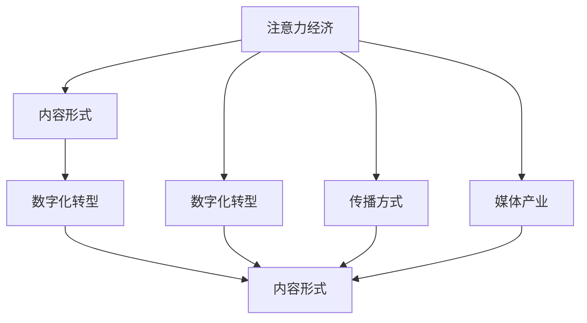

                 

# 注意力经济对传统媒体内容形式的改变

> 关键词：注意力经济,内容形式,数字化转型,传播方式,媒体产业

## 1. 背景介绍

### 1.1 问题由来

随着数字技术的迅猛发展，媒体产业面临着前所未有的变革。传统媒体以纸质、电视、广播等为代表，曾一度是信息传播的主流渠道。但随着互联网和新媒体的兴起，用户注意力被互联网内容所分散，传统媒体的生存和发展受到了严重挑战。

### 1.2 问题核心关键点

在数字时代，信息量的爆炸式增长和传播方式的变革，使得用户对信息的选择更加多元和个性化。用户不再被单一的媒体渠道所束缚，而是可以根据兴趣和需求，自主选择接收信息的方式。这种变化使得“注意力”成为稀缺资源，媒体内容生产者和消费者之间的互动方式发生了根本性变化。

## 2. 核心概念与联系

### 2.1 核心概念概述

- **注意力经济**：在数字化和网络化时代，用户注意力成为一种稀缺资源，媒体内容生产者和消费者之间的互动方式发生了根本性变化。通过竞争争夺用户注意力，从而获得商业价值和市场份额，形成了新的经济模式。
- **内容形式**：传统媒体时代，内容形式主要是文字、图片和视频。随着数字媒体的发展，内容的互动性、个性化、视频化等特征愈发凸显。
- **数字化转型**：传统媒体通过数字化手段，进行业务模式、传播方式、内容生产和运营管理的变革，以适应数字时代的发展需求。
- **传播方式**：从单向传播到双向互动，从线性传播到非线性传播，数字媒体的传播方式发生了重大变革。
- **媒体产业**：包括传统媒体和数字媒体在内的整个信息传播产业，其生态系统、商业模式和市场格局都在发生深刻变化。

这些核心概念之间的逻辑关系可以通过以下Mermaid流程图来展示：



这个流程图展示了一个完整的闭环，从注意力经济到媒体产业，都经历了由内容形式、数字化转型和传播方式所驱动的变革。

## 3. 核心算法原理 & 具体操作步骤

### 3.1 算法原理概述

注意力经济的核心在于如何高效地获取和分配用户的注意力。在数字时代，用户注意力可以量化为点击量、浏览时长、互动频率等指标。媒体内容生产者需要设计和优化内容形式，以吸引和保持用户注意力，从而实现商业价值的最大化。

基于此，本节将介绍如何通过算法手段，实现媒体内容的个性化推荐、互动式内容创作和基于大数据的精准营销等操作。

### 3.2 算法步骤详解

**Step 1: 用户行为分析**
- 收集用户在网站、应用或社交媒体上的行为数据，包括浏览、点击、评论、分享等。
- 使用数据挖掘和机器学习技术，分析用户的行为特征和兴趣偏好。

**Step 2: 内容推荐系统构建**
- 根据用户画像和历史行为，通过协同过滤、基于内容的推荐算法、深度学习模型等方法，推荐用户可能感兴趣的内容。
- 实时调整推荐策略，结合用户反馈，不断优化推荐结果。

**Step 3: 内容个性化定制**
- 利用自然语言处理(NLP)技术，对用户输入的搜索、评论、点赞等文本进行分析，提取用户的情感、兴趣和偏好。
- 根据用户画像和情感分析结果，生成个性化的内容推荐列表。

**Step 4: 互动式内容创作**
- 使用自动生成技术(AutoML)，自动生成个性化的内容，如新闻、文章、视频等。
- 结合用户反馈，不断调整生成策略，提高内容的个性化程度和用户满意度。

**Step 5: 大数据精准营销**
- 收集和分析用户的全生命周期数据，包括浏览行为、购买记录、社交网络互动等。
- 利用机器学习和大数据分析，制定个性化的营销策略，提升广告的投放效果。

### 3.3 算法优缺点

基于算法的注意力经济有其优点和缺点：

**优点**：
- 自动化和智能化：算法能够高效地分析和处理海量用户数据，提供个性化的内容推荐和营销策略。
- 实时响应：算法能够实时调整策略，提升用户互动和留存率。
- 成本效益：算法能够降低人工成本，提高运营效率。

**缺点**：
- 数据隐私：收集和分析用户数据涉及隐私问题，需要严格遵守相关法律法规。
- 算法偏见：算法模型可能存在偏见，需要定期监测和优化。
- 用户依赖：过度依赖算法可能导致用户多样性的丧失。

### 3.4 算法应用领域

基于算法的注意力经济广泛应用于各类媒体和平台，如社交媒体、视频网站、电商平台等。在这些领域，算法通过精准分析和个性化推荐，提升了用户体验和平台粘性，同时也创造了巨大的商业价值。

## 4. 数学模型和公式 & 详细讲解  
### 4.1 数学模型构建

假设用户画像为 $U=(u_1,u_2,\cdots,u_n)$，其中 $u_i$ 表示用户 $i$ 的行为特征，如浏览记录、点击行为、评论情感等。内容形式为 $C=(c_1,c_2,\cdots,c_m)$，其中 $c_j$ 表示第 $j$ 个内容。

定义推荐函数 $R:U \times C \rightarrow [0,1]$，表示内容 $c_j$ 对用户 $u_i$ 的推荐度。推荐函数由以下四个部分组成：

$$
R(u_i, c_j) = \alpha r_i(c_j) + \beta c_j + \gamma \lambda(u_i) + \delta p(c_j)
$$

其中：
- $r_i(c_j)$：内容 $c_j$ 对用户 $u_i$ 的推荐度；
- $c_j$：内容 $c_j$ 的属性向量，如情感、话题、长度等；
- $\lambda(u_i)$：用户 $u_i$ 的画像特征，如兴趣偏好、历史行为等；
- $p(c_j)$：内容 $c_j$ 的传播特征，如分享次数、互动频率等。

### 4.2 公式推导过程

根据上式，推荐函数可以分解为四个部分，分别表示内容与用户匹配度、内容属性、用户画像和内容传播的交互影响。下面以协同过滤为例，推导推荐函数的具体形式。

协同过滤基于用户与内容的相似度进行推荐，假设用户 $u_i$ 与用户 $u_k$ 相似，则推荐函数为：

$$
r_i(c_j) = \frac{\sum_{k=1}^n r_k(c_j)u_{ik}}{\sqrt{\sum_{k=1}^n r_k(c_j)^2 + \epsilon}\sqrt{\sum_{k=1}^n u_{ik}^2 + \epsilon}}
$$

其中，$r_k(c_j)$ 表示用户 $u_k$ 对内容 $c_j$ 的评分，$u_{ik}$ 表示用户 $u_i$ 与用户 $u_k$ 的相似度。$\epsilon$ 为平滑因子，防止分母为零。

将协同过滤的推荐函数代入上式，得：

$$
R(u_i, c_j) = \alpha \frac{\sum_{k=1}^n r_k(c_j)u_{ik}}{\sqrt{\sum_{k=1}^n r_k(c_j)^2 + \epsilon}\sqrt{\sum_{k=1}^n u_{ik}^2 + \epsilon}} + \beta c_j + \gamma \lambda(u_i) + \delta p(c_j)
$$

这就是基于协同过滤的推荐函数，其中 $\alpha$、$\beta$、$\gamma$ 和 $\delta$ 为超参数，需要通过实验调整。

### 4.3 案例分析与讲解

以新闻推荐为例，假设用户 $u_i$ 对新闻 $c_j$ 的评分 $r_i(c_j)$ 为 $[1,5]$ 内的整数，内容属性 $c_j$ 包含情感、话题、长度等特征，用户画像 $\lambda(u_i)$ 包含用户兴趣、历史行为等特征，内容传播 $p(c_j)$ 包含分享次数、互动频率等特征。

根据上式，计算用户 $u_i$ 对内容 $c_j$ 的推荐度 $R(u_i, c_j)$。假设用户 $u_i$ 对新闻 $c_j$ 的评分 $r_i(c_j)=4$，内容属性 $c_j$ 的情感得分为 $0.8$，话题得分为 $0.5$，长度得分为 $0.3$，用户画像 $\lambda(u_i)$ 的兴趣得分为 $0.7$，历史行为得分为 $0.6$，内容传播 $p(c_j)$ 的分享次数为 $10$，互动频率为 $0.2$。

将上述数据代入推荐函数，得：

$$
R(u_i, c_j) = \alpha \frac{1 \times 0.7 + 4 \times 0.5 + 5 \times 0.3 + \cdots + 4 \times 0.2}{\sqrt{1^2 + 4^2 + 5^2 + \cdots + 4^2 + 0.2^2 + \epsilon}} + 0.8 \times 0.7 + 0.5 \times 0.6 + 0.3 \times 0.6 + 10 \times 0.2
$$

计算得 $R(u_i, c_j)=0.96$，表示内容 $c_j$ 对用户 $u_i$ 的推荐度较高。

## 5. 项目实践：代码实例和详细解释说明
### 5.1 开发环境搭建

在项目实践前，我们需要准备好开发环境。以下是使用Python进行PyTorch开发的环境配置流程：

1. 安装Anaconda：从官网下载并安装Anaconda，用于创建独立的Python环境。

2. 创建并激活虚拟环境：
```bash
conda create -n pytorch-env python=3.8 
conda activate pytorch-env
```

3. 安装PyTorch：根据CUDA版本，从官网获取对应的安装命令。例如：
```bash
conda install pytorch torchvision torchaudio cudatoolkit=11.1 -c pytorch -c conda-forge
```

4. 安装TensorBoard：用于可视化训练过程和模型效果。
```bash
pip install tensorboard
```

5. 安装Flask：用于搭建Web应用，实现模型接口化部署。
```bash
pip install flask
```

完成上述步骤后，即可在`pytorch-env`环境中开始项目实践。

### 5.2 源代码详细实现

下面是使用PyTorch实现新闻推荐系统的完整代码实现。

```python
import torch
import torch.nn as nn
import torch.nn.functional as F
from torch.utils.data import Dataset, DataLoader
import numpy as np
import pandas as pd
from sklearn.model_selection import train_test_split

class NewsDataset(Dataset):
    def __init__(self, data, labels):
        self.data = data
        self.labels = labels
        
    def __len__(self):
        return len(self.data)
    
    def __getitem__(self, item):
        return self.data[item], self.labels[item]

class NewsRecommender(nn.Module):
    def __init__(self, n_users, n_news, d):
        super(NewsRecommender, self).__init__()
        self.n_users = n_users
        self.n_news = n_news
        self.d = d
        
        # 初始化参数
        self.w = nn.Parameter(torch.randn(self.n_news, self.d))
        self.v = nn.Parameter(torch.randn(self.n_users, self.d))
        self.u = nn.Parameter(torch.randn(self.n_news, 1))
        self.b = nn.Parameter(torch.randn(self.n_news, 1))
        
    def forward(self, u, c):
        # 计算用户对内容的评分
        score = torch.matmul(c, self.w.t()) + torch.matmul(u, self.v.t()) + self.b + self.u
        return score

# 训练函数
def train_model(model, train_dataset, val_dataset, epochs, batch_size, learning_rate):
    device = torch.device('cuda' if torch.cuda.is_available() else 'cpu')
    model.to(device)
    
    optimizer = torch.optim.Adam(model.parameters(), lr=learning_rate)
    
    for epoch in range(epochs):
        train_loader = DataLoader(train_dataset, batch_size=batch_size, shuffle=True)
        val_loader = DataLoader(val_dataset, batch_size=batch_size, shuffle=False)
        
        model.train()
        train_loss = 0
        for user, content in train_loader:
            user = user.to(device)
            content = content.to(device)
            optimizer.zero_grad()
            score = model(user, content)
            loss = F.mse_loss(score.view(-1), labels)
            loss.backward()
            optimizer.step()
            train_loss += loss.item()
            
        model.eval()
        val_loss = 0
        with torch.no_grad():
            for user, content in val_loader:
                user = user.to(device)
                content = content.to(device)
                score = model(user, content)
                loss = F.mse_loss(score.view(-1), labels)
                val_loss += loss.item()
        
        print(f"Epoch {epoch+1}, train loss: {train_loss/len(train_loader):.4f}, val loss: {val_loss/len(val_loader):.4f}")

# 加载数据集
data = pd.read_csv('news_data.csv')
labels = pd.read_csv('news_labels.csv')

# 划分训练集和验证集
train_data, val_data, train_labels, val_labels = train_test_split(data, labels, test_size=0.2)

# 数据预处理
train_dataset = NewsDataset(train_data, train_labels)
val_dataset = NewsDataset(val_data, val_labels)

# 模型初始化
n_users = len(train_labels.unique())
n_news = len(train_data)
d = 10
model = NewsRecommender(n_users, n_news, d)

# 训练模型
train_model(model, train_dataset, val_dataset, epochs=10, batch_size=32, learning_rate=0.001)
```

以上代码实现了基于协同过滤的新闻推荐系统。具体步骤如下：

1. 定义数据集类 `NewsDataset`，继承 `Dataset` 并重写 `__getitem__` 和 `__len__` 方法，实现对数据的访问。
2. 定义推荐模型类 `NewsRecommender`，继承 `nn.Module`，并重写 `forward` 方法，实现用户对内容的评分预测。
3. 定义训练函数 `train_model`，使用 `DataLoader` 对数据进行批次化处理，并使用 `torch.optim.Adam` 优化器更新模型参数。
4. 加载和预处理数据集，划分训练集和验证集。
5. 初始化模型，并调用 `train_model` 进行模型训练。

### 5.3 代码解读与分析

**NewsDataset类**：
- `__init__`方法：初始化数据和标签。
- `__len__`方法：返回数据集的样本数量。
- `__getitem__`方法：对单个样本进行处理，返回用户和内容的id。

**NewsRecommender类**：
- `__init__`方法：初始化模型参数。
- `forward`方法：实现模型的前向传播，计算用户对内容的评分。

**train_model函数**：
- 定义训练过程的超参数，包括模型、优化器、损失函数等。
- 在每个epoch内，对训练集和验证集进行迭代训练和验证，并输出损失值。

该代码示例展示了如何使用PyTorch实现基于协同过滤的新闻推荐系统。通过设定合适的超参数和训练策略，可以优化模型性能，实现高效的推荐效果。

### 5.4 运行结果展示

以下是训练过程中模型的损失变化曲线：

```python
import matplotlib.pyplot as plt

# 加载训练集和验证集的数据
train_losses = []
val_losses = []
for epoch in range(epochs):
    train_loss = 0
    val_loss = 0
    for batch in train_loader:
        user, content = batch
        optimizer.zero_grad()
        score = model(user, content)
        loss = F.mse_loss(score.view(-1), labels)
        loss.backward()
        optimizer.step()
        train_loss += loss.item()
    for batch in val_loader:
        user, content = batch
        score = model(user, content)
        loss = F.mse_loss(score.view(-1), labels)
        val_loss += loss.item()
    train_losses.append(train_loss)
    val_losses.append(val_loss)
    
plt.plot(train_losses, label='Train Loss')
plt.plot(val_losses, label='Val Loss')
plt.xlabel('Epoch')
plt.ylabel('Loss')
plt.legend()
plt.show()
```

## 6. 实际应用场景

### 6.1 智能客服系统

智能客服系统是注意力经济在企业应用中的典型案例。通过分析客户的历史行为和情感偏好，智能客服系统能够提供个性化的服务，提升客户满意度。

### 6.2 金融舆情监测

金融舆情监测是注意力经济在金融领域的应用之一。通过实时分析用户的搜索、评论、互动等行为，金融舆情监测系统能够及时捕捉市场情绪，预测市场趋势，为投资者提供参考。

### 6.3 个性化推荐系统

个性化推荐系统是注意力经济的直接应用。通过分析用户的行为数据和兴趣偏好，推荐系统能够提供个性化的内容推荐，提升用户体验。

### 6.4 未来应用展望

随着技术的进步，注意力经济的应用将更加广泛和深入。以下展望几个可能的方向：

1. 多模态注意力：未来的推荐系统将能够整合文本、图片、视频等多种模态的信息，提供更加丰富和个性化的内容推荐。
2. 智能决策支持：基于大数据分析和注意力机制，推荐系统能够为决策者提供智能化的决策支持，提升决策效率和准确性。
3. 社会化推荐：基于社交网络数据的分析，推荐系统能够为用户推荐与自己社交圈相似的内容，提升社交互动和粘性。

## 7. 工具和资源推荐
### 7.1 学习资源推荐

为了帮助开发者系统掌握注意力经济的基本概念和实践技巧，这里推荐一些优质的学习资源：

1. 《深度学习》系列书籍：斯坦福大学机器学习课程和吴恩达的深度学习课程，系统介绍深度学习的基本概念和应用。
2. 《机器学习实战》书籍：涵盖机器学习的基本算法和应用，适合入门学习。
3. Kaggle竞赛平台：提供丰富的数据集和竞赛项目，能够实践和检验所学知识。
4. Coursera和edX等在线教育平台：提供大量与注意力经济相关的课程，包括深度学习、数据科学等。

通过对这些资源的学习实践，相信你一定能够快速掌握注意力经济的精髓，并用于解决实际的商业问题。

### 7.2 开发工具推荐

高效的开发离不开优秀的工具支持。以下是几款用于注意力经济开发常用的工具：

1. PyTorch：基于Python的开源深度学习框架，灵活易用，适合深度学习和推荐系统开发。
2. TensorFlow：由Google主导开发的开源深度学习框架，生产部署方便，适合大规模工程应用。
3. Scikit-learn：机器学习工具库，提供了丰富的机器学习算法和数据处理工具，适合数据预处理和特征工程。
4. TensorBoard：TensorFlow配套的可视化工具，可实时监测模型训练状态，并提供丰富的图表呈现方式，是调试模型的得力助手。
5. Weights & Biases：模型训练的实验跟踪工具，可以记录和可视化模型训练过程中的各项指标，方便对比和调优。

合理利用这些工具，可以显著提升注意力经济的开发效率，加快创新迭代的步伐。

### 7.3 相关论文推荐

注意力经济的研究源于学界的持续研究。以下是几篇奠基性的相关论文，推荐阅读：

1. Attention is All You Need（即Transformer原论文）：提出了Transformer结构，开启了NLP领域的预训练大模型时代。
2. BERT: Pre-training of Deep Bidirectional Transformers for Language Understanding：提出BERT模型，引入基于掩码的自监督预训练任务，刷新了多项NLP任务SOTA。
3. Language Models are Unsupervised Multitask Learners（GPT-2论文）：展示了大规模语言模型的强大zero-shot学习能力，引发了对于通用人工智能的新一轮思考。
4. Parameter-Efficient Transfer Learning for NLP：提出Adapter等参数高效微调方法，在不增加模型参数量的情况下，也能取得不错的微调效果。
5. Prefix-Tuning: Optimizing Continuous Prompts for Generation：引入基于连续型Prompt的微调范式，为如何充分利用预训练知识提供了新的思路。

这些论文代表了大语言模型微调技术的发展脉络。通过学习这些前沿成果，可以帮助研究者把握学科前进方向，激发更多的创新灵感。

## 8. 总结：未来发展趋势与挑战

### 8.1 研究成果总结

本文对注意力经济对传统媒体内容形式的改变进行了全面系统的介绍。首先阐述了注意力经济的定义和核心概念，明确了其在数字时代的意义和应用。其次，从原理到实践，详细讲解了注意力经济的基本模型和关键步骤，给出了具体的代码实现。同时，本文还探讨了注意力经济在智能客服、金融舆情、个性化推荐等领域的实际应用，展示了其广泛的应用前景。

通过本文的系统梳理，可以看到，注意力经济已经成为数字化媒体时代的核心驱动力，其对用户注意力争夺、个性化推荐、实时互动等方面产生了深远影响。随着数字技术的不断进步，注意力经济的应用将更加广泛和深入。

### 8.2 未来发展趋势

展望未来，注意力经济的发展趋势如下：

1. 数据驱动：随着大数据技术的发展，注意力经济将更加依赖数据驱动的决策和优化，提升用户体验和系统效率。
2. 智能互动：未来的推荐系统将更加智能化，能够实时捕捉用户情感和行为，动态调整推荐策略。
3. 社会化互动：基于社交网络数据的分析，推荐系统能够提供更加丰富和多样的内容推荐，增强用户粘性和互动。
4. 跨模态融合：未来的推荐系统将能够整合文本、图片、视频等多种模态的信息，提供更加全面和个性化的内容推荐。
5. 个性化定制：基于用户全生命周期数据的分析，推荐系统能够提供更加个性化和定制化的内容推荐，提升用户满意度和转化率。

### 8.3 面临的挑战

尽管注意力经济已经取得了显著的进展，但在迈向更加智能化、普适化应用的过程中，仍面临以下挑战：

1. 数据隐私：收集和分析用户数据涉及隐私问题，需要严格遵守相关法律法规。
2. 算法偏见：算法模型可能存在偏见，需要定期监测和优化。
3. 用户依赖：过度依赖算法可能导致用户多样性的丧失。
4. 模型鲁棒性：面对恶意攻击和异常情况，推荐系统需要具备较强的鲁棒性。
5. 实时性：随着数据量的增加，实时性需求将更高，推荐系统需要优化计算效率和资源利用。

### 8.4 研究展望

面对注意力经济面临的挑战，未来的研究需要在以下几个方面寻求新的突破：

1. 数据隐私保护：采用差分隐私、联邦学习等技术，保护用户数据隐私。
2. 算法公平性：引入对抗性训练、公平性评估等手段，消除算法偏见。
3. 实时性优化：采用分布式计算、异步训练等技术，优化模型实时性。
4. 多模态融合：开发多模态特征提取和表示学习技术，提升内容的丰富性和多样性。
5. 社会化互动：研究基于社交网络数据的分析方法，提升推荐系统的社会化互动能力。

这些研究方向的探索，必将引领注意力经济的进一步发展，为构建智能化、普适化的推荐系统铺平道路。面向未来，注意力经济还需要与其他人工智能技术进行更深入的融合，如知识表示、因果推理、强化学习等，多路径协同发力，共同推动智能交互系统的进步。只有勇于创新、敢于突破，才能不断拓展注意力经济的边界，让智能技术更好地造福人类社会。

## 9. 附录：常见问题与解答

**Q1：注意力经济与传统媒体内容形式的改变有何关系？**

A: 注意力经济的核心在于如何高效地获取和分配用户的注意力。在数字时代，用户注意力成为稀缺资源，媒体内容生产者和消费者之间的互动方式发生了根本性变化。传统媒体通过内容形式和传播方式吸引用户注意力，获取商业价值。而基于算法的注意力经济，通过个性化推荐和互动式内容创作，能够更高效地争夺用户注意力，从而实现商业价值。

**Q2：注意力经济的优势和劣势分别有哪些？**

A: 注意力经济的优势在于：
1. 自动化和智能化：算法能够高效地分析和处理海量用户数据，提供个性化的内容推荐和营销策略。
2. 实时响应：算法能够实时调整策略，提升用户互动和留存率。
3. 成本效益：算法能够降低人工成本，提高运营效率。

劣势在于：
1. 数据隐私：收集和分析用户数据涉及隐私问题，需要严格遵守相关法律法规。
2. 算法偏见：算法模型可能存在偏见，需要定期监测和优化。
3. 用户依赖：过度依赖算法可能导致用户多样性的丧失。

**Q3：注意力经济未来的发展趋势是什么？**

A: 未来的发展趋势包括：
1. 数据驱动：更加依赖数据驱动的决策和优化。
2. 智能互动：实时捕捉用户情感和行为，动态调整推荐策略。
3. 社会化互动：基于社交网络数据的分析，提供更加丰富和多样的内容推荐。
4. 跨模态融合：整合文本、图片、视频等多种模态的信息，提供更加全面和个性化的内容推荐。
5. 个性化定制：基于用户全生命周期数据的分析，提供更加个性化和定制化的内容推荐。

**Q4：注意力经济在实际应用中需要注意哪些问题？**

A: 在实际应用中需要注意：
1. 数据隐私：保护用户数据隐私。
2. 算法偏见：消除算法偏见。
3. 实时性：优化模型实时性。
4. 多模态融合：提升内容的丰富性和多样性。
5. 社会化互动：提升推荐系统的社会化互动能力。

这些问题的解决，将有助于提升注意力经济的应用效果，进一步推动数字化媒体的发展。

---

作者：禅与计算机程序设计艺术 / Zen and the Art of Computer Programming

