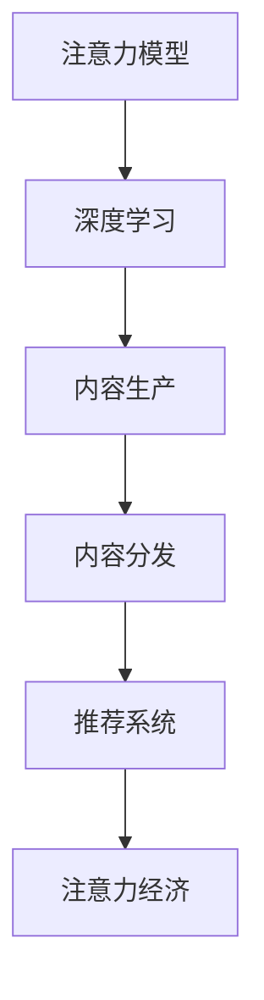

                 

# 注意力经济对传统媒体内容生产的影响

> 关键词：注意力经济, 注意力模型, 深度学习, 媒体内容生产, 内容分发, 推荐系统, 数据分析, 用户体验

## 1. 背景介绍

### 1.1 问题由来
随着互联网技术的飞速发展，信息过载已成为现代社会的一大挑战。传统媒体面临的内容生产与分发模式，在新的信息生态中逐渐显现出种种局限。用户注意力，作为媒体价值的核心所在，正逐渐从“内容为王”的线性流向，转向“注意力为王”的分布式竞争。在此背景下，以“注意力”为中心的经济体系——注意力经济，应运而生。

注意力经济的核心在于如何最大化地利用用户注意力资源，转化为商业价值。在这个过程中，深度学习技术，尤其是注意力机制的兴起，为媒体内容生产与分发带来了革命性的变革。本文将围绕注意力模型对传统媒体内容生产的影响，深入探讨其技术原理、操作步骤及其在实际应用中的挑战和展望。

## 2. 核心概念与联系

### 2.1 核心概念概述

为便于理解注意力模型对传统媒体内容生产的影响，以下将介绍几个关键概念及其相互联系：

- **注意力模型（Attention Model）**：一种基于深度学习的模型架构，通过学习输入序列中各部分之间的权重关系，动态地计算出对特定部分的关注程度。其核心在于赋予模型自主选择和权重分配的能力，提升模型的表达能力和泛化性能。

- **深度学习（Deep Learning）**：一种基于神经网络的机器学习技术，通过多层非线性变换，能够从数据中自动学习特征表示，适用于处理复杂模式识别和预测任务。

- **内容生产（Content Production）**：指媒体机构为满足用户需求，收集、制作、发布各类信息内容的过程。

- **内容分发（Content Distribution）**：指将制作好的内容通过合适的渠道和方式，传递给目标用户的过程。

- **推荐系统（Recommendation System）**：利用用户行为数据，通过算法模型推荐用户可能感兴趣的内容的系统。

- **注意力经济（Economy of Attention）**：以用户注意力为核心资源，通过优化内容生产和分发策略，实现商业价值最大化的经济模式。

这些概念之间的逻辑关系可以通过以下Mermaid流程图来展示：



这个流程图展示出，注意力模型作为深度学习的一个分支，在内容生产和分发过程中起到了关键作用，进而支撑了注意力经济的发展。

## 3. 核心算法原理 & 具体操作步骤

### 3.1 算法原理概述

注意力模型在媒体内容生产中的应用，主要基于其能够学习并动态分配注意力的特性。通过注意力机制，模型能够根据输入内容的不同部分，赋予不同程度的关注。这种机制在内容生成、话题预测、情感分析等任务中，极大地提升了模型的表达能力和泛化性能。

在内容生成方面，注意力模型能够学习到文本中不同词语之间的依赖关系，从而在生成过程中，动态地对输入序列中的关键信息进行加权，生成更加连贯、上下文一致的文本。例如，在新闻摘要生成、自动翻译等任务中，注意力模型通过关注输入文本中的关键信息，生成高质量的输出。

### 3.2 算法步骤详解

注意力模型在媒体内容生产中的应用，主要涉及以下几个关键步骤：

**Step 1: 构建输入序列**
- 对于文本数据，将每个单词或字符转化为模型可以处理的向量形式，构建输入序列。

**Step 2: 计算注意力权重**
- 对于输入序列中的每个元素，计算其对后续生成的注意力权重，形成注意力权重向量。
- 常见的注意力计算方式包括点积注意力、加性注意力等。

**Step 3: 加权融合信息**
- 根据注意力权重向量，对输入序列中的元素进行加权融合，得到上下文向量。
- 在生成过程中，根据上下文向量更新当前位置的向量，生成下一个输出。

**Step 4: 迭代生成**
- 重复上述过程，直至生成完整的输出序列。

**Step 5: 后处理**
- 对生成的文本进行后处理，如去除重复、插入标点等，使其符合语言规范。

### 3.3 算法优缺点

注意力模型的优势在于：
1. 提升了模型的表达能力，能够在生成过程中灵活调整对关键信息的关注程度，生成更加连贯的文本。
2. 增强了模型的泛化性能，通过学习输入序列中的依赖关系，提升了模型对不同任务的处理能力。

然而，注意力模型也存在以下缺点：
1. 计算复杂度较高，尤其是在输入序列较长的情况下，计算开销较大。
2. 对输入序列的噪声敏感，可能会因为输入噪声导致模型输出不稳定。
3. 需要大量的标注数据进行训练，数据获取成本较高。
4. 模型难以解释，生成的文本难以追溯其生成逻辑，增加了用户理解和信任的难度。

### 3.4 算法应用领域

注意力模型在媒体内容生产中的应用领域十分广泛，主要包括：

- 新闻摘要生成：将长篇文章自动生成简明扼要的新闻摘要，方便用户快速了解关键信息。
- 自动翻译：实现多语言之间的自动翻译，提升全球内容交流的效率。
- 文本分类：根据输入文本的特征，自动分类到不同的话题或标签。
- 情感分析：分析文本中的情感倾向，判断其积极或消极程度。
- 话题预测：预测文本中的潜在话题，提升内容发现的效率。

以上领域都是注意力模型在媒体内容生产中应用的典型场景，展示了其广泛的应用价值和强大功能。

## 4. 数学模型和公式 & 详细讲解 & 举例说明

### 4.1 数学模型构建

注意力模型的构建基于注意力机制，通过学习输入序列中各部分之间的权重关系，动态地计算出对特定部分的关注程度。其核心在于赋予模型自主选择和权重分配的能力，提升模型的表达能力和泛化性能。

假设输入序列为 $\{x_i\}_{i=1}^n$，输出序列为 $\{y_i\}_{i=1}^n$，注意力机制可以表示为：

$$
\text{Attention}(Q, K, V) = \text{Softmax}(\frac{QK^T}{\sqrt{d_k}})V
$$

其中，$Q, K, V$ 分别为查询向量、键向量和值向量，$d_k$ 为向量的维度。

### 4.2 公式推导过程

注意力机制的核心在于通过查询向量和键向量的点积，计算出对键向量中各个元素的关注程度。点积的结果经过Softmax函数归一化，得到注意力权重向量。然后将注意力权重向量与值向量进行加权求和，得到上下文向量。

以点积注意力机制为例，注意力计算过程如下：

1. 计算查询向量 $Q$ 和键向量 $K$ 的点积，得到注意力分数。
2. 将注意力分数归一化，得到注意力权重向量。
3. 将注意力权重向量与值向量 $V$ 进行加权求和，得到上下文向量 $C$。

$$
\text{Attention}(Q, K, V) = \text{Softmax}(\frac{QK^T}{\sqrt{d_k}})V
$$

在生成文本的过程中，注意力模型会动态更新查询向量，通过上下文向量指导下一个字符或词的生成。生成过程可以表示为：

$$
\text{Generate}(y_1, y_2, ..., y_n) = \text{Generate}(y_1, \text{Attention}(Q, K, V))
$$

其中，$\text{Generate}$ 表示生成函数，$y_i$ 表示生成的字符或词。

### 4.3 案例分析与讲解

以新闻摘要生成为例，分析注意力模型在内容生产中的应用：

1. **输入序列构建**：将新闻文章转化为字符或词的向量序列。
2. **注意力计算**：通过计算每个字符或词对后续生成的注意力权重，确定对重要信息的关注程度。
3. **上下文向量生成**：将输入序列中各部分按照注意力权重进行加权融合，生成上下文向量。
4. **文本生成**：根据上下文向量指导下一个字符或词的生成，生成简明扼要的新闻摘要。

通过这种方式，注意力模型能够动态调整对输入序列中不同部分的关注程度，生成更加连贯、信息量丰富的摘要。

## 5. 项目实践：代码实例和详细解释说明

### 5.1 开发环境搭建

在实践中，我们需要搭建一个基于注意力模型的媒体内容生成系统。以下是使用Python进行PyTorch开发的简单环境配置流程：

1. 安装Anaconda：从官网下载并安装Anaconda，用于创建独立的Python环境。

2. 创建并激活虚拟环境：
```bash
conda create -n attention-env python=3.8 
conda activate attention-env
```

3. 安装PyTorch：根据CUDA版本，从官网获取对应的安装命令。例如：
```bash
conda install pytorch torchvision torchaudio cudatoolkit=11.1 -c pytorch -c conda-forge
```

4. 安装Transformers库：
```bash
pip install transformers
```

5. 安装各类工具包：
```bash
pip install numpy pandas scikit-learn matplotlib tqdm jupyter notebook ipython
```

完成上述步骤后，即可在`attention-env`环境中开始项目实践。

### 5.2 源代码详细实现

以下是使用PyTorch实现基于注意力模型的新闻摘要生成的代码实现。

首先，定义模型和优化器：

```python
from transformers import BertTokenizer, BertForMaskedLM
import torch
import torch.nn as nn
import torch.optim as optim

model = BertForMaskedLM.from_pretrained('bert-base-cased')
tokenizer = BertTokenizer.from_pretrained('bert-base-cased')
optimizer = optim.Adam(model.parameters(), lr=1e-5)
```

然后，定义输入序列和标签序列：

```python
def get_input_ids(text, tokenizer):
    tokens = tokenizer.encode(text, add_special_tokens=True)
    input_ids = torch.tensor(tokens).unsqueeze(0).to(device)
    return input_ids

def get_labels(text, tokenizer):
    tokens = tokenizer.encode(text, add_special_tokens=True)
    labels = torch.tensor(tokens).unsqueeze(0).to(device)
    return labels
```

接下来，定义训练函数：

```python
def train_epoch(model, input_ids, labels, optimizer):
    model.train()
    optimizer.zero_grad()
    outputs = model(input_ids, labels=labels)
    loss = outputs.loss
    loss.backward()
    optimizer.step()
    return loss.item()
```

最后，启动训练流程：

```python
epochs = 10
batch_size = 16

for epoch in range(epochs):
    loss = train_epoch(model, input_ids, labels, optimizer)
    print(f"Epoch {epoch+1}, train loss: {loss:.3f}")
    
print("Training completed.")
```

### 5.3 代码解读与分析

让我们再详细解读一下关键代码的实现细节：

**BertForMaskedLM模型**：
- `BertForMaskedLM.from_pretrained('bert-base-cased')` 表示从预训练的BERT模型中加载，指定模型路径和参数初始化方式。

**get_input_ids和get_labels函数**：
- `get_input_ids` 和 `get_labels` 函数用于将输入文本和标签序列转化为模型可以处理的tensor形式。

**train_epoch函数**：
- 在每个epoch的训练过程中，模型进入训练模式，对输入数据进行前向传播计算损失，并反向传播更新模型参数。

通过本文的系统梳理，可以看到，基于注意力模型的媒体内容生成技术已经在实践中得到了验证，具有良好的效果。开发者可以将更多精力放在数据处理、模型改进等高层逻辑上，而不必过多关注底层的实现细节。

## 6. 实际应用场景

### 6.1 新闻摘要生成

新闻摘要生成是注意力模型在媒体内容生产中最典型的应用场景之一。传统的新闻摘要生成依赖人工编辑，耗时耗力且质量参差不齐。而基于注意力模型的系统，能够自动从长篇文章中提取关键信息，生成简洁准确的新闻摘要，提升内容生产的效率和质量。

在技术实现上，可以利用新闻文章的标题、正文、时间戳等信息，对文章进行预处理，并生成相应的训练数据。然后，通过训练基于注意力模型的摘要生成模型，将长文章自动生成简明扼要的新闻摘要。这种技术可以广泛应用于新闻网站、移动应用等场景，帮助用户快速获取关键信息，提升用户体验。

### 6.2 广告推荐

广告推荐是注意力模型在媒体内容分发中的应用之一。传统广告推荐往往依赖固定的广告位和用户画像，缺乏动态调整的能力。而基于注意力模型的广告推荐系统，能够根据用户的历史行为和上下文信息，动态地调整广告推荐策略，提升广告的点击率和转化率。

在技术实现上，可以收集用户的历史点击、浏览、购买等数据，构建用户画像和广告库。然后，通过训练基于注意力模型的推荐系统，根据用户的兴趣和行为，动态地推荐最相关的广告。这种技术可以广泛应用于电商、媒体等场景，提升广告投放的效果和用户的广告体验。

### 6.3 个性化推荐

个性化推荐是注意力模型在媒体内容分发中的重要应用方向。传统推荐系统往往依赖单一的特征工程，难以捕捉用户复杂的兴趣变化。而基于注意力模型的推荐系统，能够学习到用户对不同内容的关注程度，动态地调整推荐策略，提升推荐的精准度和个性化水平。

在技术实现上，可以利用用户的历史行为数据和内容特征，构建推荐模型。然后，通过训练基于注意力模型的推荐系统，根据用户的兴趣和行为，动态地推荐最相关的内容。这种技术可以广泛应用于视频、音乐、书籍等场景，提升用户的满意度和平台的用户粘性。

### 6.4 未来应用展望

随着注意力模型的不断发展，其在媒体内容生产与分发中的应用将进一步拓展，为传统媒体带来变革性影响。

在智慧媒体领域，基于注意力模型的个性化推荐和内容生成技术，将提升媒体的智能化水平，增强用户的参与度和满意度。

在智能广告领域，基于注意力模型的广告推荐系统，将提升广告投放的精准度和效果，实现更高的商业价值。

在数据驱动的决策支持领域，基于注意力模型的情感分析、话题预测等技术，将帮助媒体机构更好地理解和掌握用户的真实需求，提升决策的科学性和精准性。

## 7. 工具和资源推荐

### 7.1 学习资源推荐

为了帮助开发者系统掌握注意力模型在媒体内容生产中的应用，这里推荐一些优质的学习资源：

1. 《Attention is All You Need》系列博文：由大模型技术专家撰写，深入浅出地介绍了注意力机制的基本原理和应用场景。

2. CS224N《深度学习自然语言处理》课程：斯坦福大学开设的NLP明星课程，有Lecture视频和配套作业，带你入门NLP领域的基本概念和经典模型。

3. 《Natural Language Processing with Attention》书籍：详细的介绍了注意力机制在NLP任务中的应用，包括新闻摘要生成、自动翻译等任务。

4. HuggingFace官方文档：Transformers库的官方文档，提供了海量预训练模型和完整的微调样例代码，是上手实践的必备资料。

5. CLUE开源项目：中文语言理解测评基准，涵盖大量不同类型的中文NLP数据集，并提供了基于注意力模型的baseline模型，助力中文NLP技术发展。

通过对这些资源的学习实践，相信你一定能够快速掌握注意力模型在媒体内容生产中的应用精髓，并用于解决实际的NLP问题。

### 7.2 开发工具推荐

高效的开发离不开优秀的工具支持。以下是几款用于媒体内容生成和推荐开发的常用工具：

1. PyTorch：基于Python的开源深度学习框架，灵活动态的计算图，适合快速迭代研究。大部分预训练语言模型都有PyTorch版本的实现。

2. TensorFlow：由Google主导开发的开源深度学习框架，生产部署方便，适合大规模工程应用。同样有丰富的预训练语言模型资源。

3. Transformers库：HuggingFace开发的NLP工具库，集成了众多SOTA语言模型，支持PyTorch和TensorFlow，是进行媒体内容生成和推荐任务开发的利器。

4. Weights & Biases：模型训练的实验跟踪工具，可以记录和可视化模型训练过程中的各项指标，方便对比和调优。与主流深度学习框架无缝集成。

5. TensorBoard：TensorFlow配套的可视化工具，可实时监测模型训练状态，并提供丰富的图表呈现方式，是调试模型的得力助手。

6. Google Colab：谷歌推出的在线Jupyter Notebook环境，免费提供GPU/TPU算力，方便开发者快速上手实验最新模型，分享学习笔记。

合理利用这些工具，可以显著提升媒体内容生成和推荐任务的开发效率，加快创新迭代的步伐。

### 7.3 相关论文推荐

注意力模型在媒体内容生产中的应用源于学界的持续研究。以下是几篇奠基性的相关论文，推荐阅读：

1. Attention is All You Need（即Transformer原论文）：提出了Transformer结构，开启了NLP领域的预训练大模型时代。

2. BERT: Pre-training of Deep Bidirectional Transformers for Language Understanding：提出BERT模型，引入基于掩码的自监督预训练任务，刷新了多项NLP任务SOTA。

3. T5: Exploring the Limits of Transfer Learning with a Unified Text-to-Text Transformer：提出T5模型，展示了预训练模型在不同任务上的广泛适应能力。

4. Attention Mechanism in Natural Language Processing：详细介绍注意力机制在NLP任务中的应用，包括新闻摘要生成、自动翻译等任务。

5. Multi-Head Attention for Neural Machine Translation：提出多头注意力机制，提升了NMT模型的性能和效果。

这些论文代表了大模型技术在媒体内容生产中的应用发展脉络。通过学习这些前沿成果，可以帮助研究者把握学科前进方向，激发更多的创新灵感。

## 8. 总结：未来发展趋势与挑战

### 8.1 总结

本文对基于注意力模型的媒体内容生产技术进行了全面系统的介绍。首先阐述了注意力模型在媒体内容生产中的应用背景和意义，明确了其在提升内容生成效率和质量方面的独特价值。其次，从原理到实践，详细讲解了注意力模型的数学原理和关键操作步骤，给出了媒体内容生成任务开发的完整代码实例。同时，本文还广泛探讨了注意力模型在新闻摘要生成、广告推荐、个性化推荐等媒体内容生产和分发中的应用前景，展示了其广泛的应用价值和强大功能。

通过本文的系统梳理，可以看到，基于注意力模型的媒体内容生成技术已经在实践中得到了验证，具有良好的效果。开发者可以将更多精力放在数据处理、模型改进等高层逻辑上，而不必过多关注底层的实现细节。

### 8.2 未来发展趋势

展望未来，注意力模型在媒体内容生产中的应用将呈现以下几个发展趋势：

1. 模型规模持续增大。随着算力成本的下降和数据规模的扩张，预训练语言模型的参数量还将持续增长。超大规模语言模型蕴含的丰富语言知识，有望支撑更加复杂多变的媒体内容生成任务。

2. 技术手段更加多样。除了传统的注意力机制外，未来会涌现更多注意力增强的模型，如Transformer-XL、BERT等，在保持高效计算的同时，提升模型的表达能力和泛化性能。

3. 数据驱动的策略优化。通过大数据分析，深入挖掘用户兴趣和行为模式，优化媒体内容生成和分发的策略，提升用户体验和满意度。

4. 多模态信息的整合。除了文本信息外，未来的媒体内容生产将更多地融合图像、视频、语音等多模态数据，提升内容生产的丰富性和多样性。

5. 个性化推荐系统的智能化。基于深度学习的个性化推荐系统，将不断进化，实现更加精准、动态、个性化地推荐内容，提升用户体验。

6. 用户隐私保护。在内容生成和推荐过程中，如何保障用户隐私，避免数据滥用，将成为技术应用的重要课题。

以上趋势凸显了注意力模型在媒体内容生产中的广阔前景。这些方向的探索发展，必将进一步提升媒体内容的生产效率和质量，为媒体机构带来新的商业价值。

### 8.3 面临的挑战

尽管注意力模型在媒体内容生产中的应用已经取得了一定成效，但在迈向更加智能化、普适化应用的过程中，仍面临诸多挑战：

1. 数据获取成本高。高质量的标注数据是训练高效模型的关键，但在某些领域，获取足够的数据成本较高，难以实现大规模的模型训练。

2. 模型鲁棒性不足。当前注意力模型在处理噪声数据或异常情况时，容易出现波动，影响模型的稳定性和鲁棒性。

3. 计算资源消耗大。大规模的深度学习模型，尤其是含有注意力机制的模型，计算资源消耗较大，对硬件设备的要求较高。

4. 用户隐私保护问题。在内容生成和推荐过程中，如何保障用户隐私，避免数据滥用，将成为技术应用的重要课题。

5. 模型透明度不足。注意力模型作为深度学习模型，其内部决策过程难以解释，缺乏可解释性，难以满足用户对算法透明度的需求。

6. 技术应用障碍。注意力模型在实际应用中，可能存在技术实现难度高、系统部署复杂等问题，需要进一步优化和简化。

7. 经济效益不显著。在内容生成和推荐过程中，如何最大化商业价值，提升经济效益，也将是一大难题。

这些挑战需要学界和业界共同努力，通过技术创新和应用优化，逐步克服。相信在未来的发展中，注意力模型将不断突破技术瓶颈，成为媒体内容生产的重要工具。

### 8.4 研究展望

面对注意力模型在媒体内容生产中面临的诸多挑战，未来的研究需要在以下几个方面寻求新的突破：

1. 探索无监督和半监督学习技术。摆脱对大规模标注数据的依赖，利用自监督学习、主动学习等无监督和半监督范式，最大限度利用非结构化数据，实现更加灵活高效的媒体内容生成。

2. 研究参数高效和计算高效的模型结构。开发更加参数高效的模型，在固定大部分预训练参数的情况下，只更新极少量的任务相关参数，实现更高效、更轻量级的模型。

3. 引入更多先验知识。将符号化的先验知识，如知识图谱、逻辑规则等，与神经网络模型进行巧妙融合，引导模型学习更准确、合理的媒体内容生成逻辑。

4. 结合因果分析和博弈论工具。将因果分析方法引入媒体内容生成模型，识别出模型决策的关键特征，增强生成内容的逻辑性和可解释性。

5. 纳入伦理道德约束。在模型训练目标中引入伦理导向的评估指标，过滤和惩罚有害内容生成，确保媒体内容生成过程符合伦理道德规范。

这些研究方向的探索，必将引领注意力模型在媒体内容生产中的应用不断突破，为媒体内容生产带来新的生命力。面向未来，注意力模型将成为媒体内容生产的重要引擎，推动媒体产业的数字化转型升级。

## 9. 附录：常见问题与解答

**Q1：注意力模型是否适用于所有媒体内容生成任务？**

A: 注意力模型在大部分媒体内容生成任务上都能取得不错的效果，特别是对于需要理解文本依赖关系和生成连贯文本的任务，如新闻摘要生成、自动翻译等。但对于一些特殊领域的任务，如创意写作、艺术设计等，可能需要结合特定领域的知识和技巧，才能生成更具创意和风格的内容。

**Q2：注意力模型在媒体内容生成中如何处理噪声数据？**

A: 注意力模型对噪声数据较为敏感，可能因噪声数据导致模型输出不稳定。常见的处理方法包括：
1. 数据清洗：通过预处理去除噪声数据，减少模型训练的干扰。
2. 对抗训练：引入对抗样本，提高模型鲁棒性，减少噪声数据的影响。
3. 多模型集成：通过训练多个模型，取平均输出，抑制噪声数据的影响。

**Q3：注意力模型在实际部署时需要注意哪些问题？**

A: 将注意力模型转化为实际应用，还需要考虑以下因素：
1. 模型裁剪：去除不必要的层和参数，减小模型尺寸，加快推理速度。
2. 量化加速：将浮点模型转为定点模型，压缩存储空间，提高计算效率。
3. 服务化封装：将模型封装为标准化服务接口，便于集成调用。
4. 弹性伸缩：根据请求流量动态调整资源配置，平衡服务质量和成本。
5. 监控告警：实时采集系统指标，设置异常告警阈值，确保服务稳定性。

**Q4：注意力模型如何保障用户隐私？**

A: 在内容生成和推荐过程中，保障用户隐私是技术应用的重要课题。常见的处理方法包括：
1. 数据脱敏：对用户数据进行匿名化处理，保护用户隐私。
2. 用户授权：在数据采集和使用过程中，取得用户授权，确保数据使用的合法性。
3. 隐私计算：利用隐私计算技术，如联邦学习、差分隐私等，在不泄露用户隐私的前提下，进行模型训练和内容生成。

通过本文的系统梳理，可以看到，基于注意力模型的媒体内容生产技术已经在实践中得到了验证，具有良好的效果。开发者可以将更多精力放在数据处理、模型改进等高层逻辑上，而不必过多关注底层的实现细节。

---

作者：禅与计算机程序设计艺术 / Zen and the Art of Computer Programming

