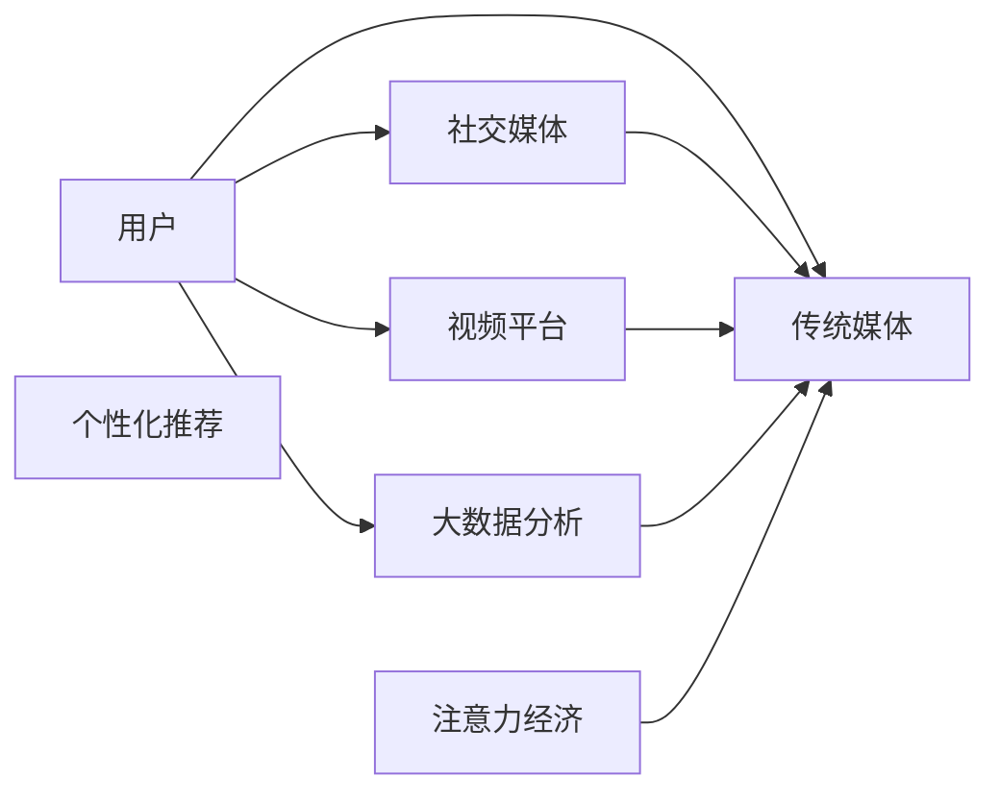

                 

# 注意力经济对传统媒体生存的挑战

## 1. 背景介绍

随着数字媒体的崛起，传统媒体面临着前所未有的生存挑战。数字化浪潮下，用户注意力越来越分散，信息过载成为常态。与此同时，社交媒体、视频平台等新兴媒体形式，以更为互动、即时、个性化的方式吸引用户，传统媒体逐渐被边缘化。传统媒体如何在新时代中生存，如何适应“注意力经济”的新趋势，成为亟待解决的问题。

### 1.1 数字媒体的崛起
数字媒体的兴起始于互联网的普及和智能手机的普及。不同于传统媒体，数字媒体具备以下优势：
- **即时性**：用户可以通过网络即时获取最新信息，不再受时间和地理限制。
- **互动性**：用户可以在线评论、点赞、分享，与内容创作者进行互动。
- **个性化**：数字媒体能够根据用户行为和偏好，推荐个性化内容，提升用户体验。
- **低成本**：相比传统媒体的高成本运营，数字媒体在内容和运营方面具有更低的门槛。

### 1.2 传统媒体的困境
面对数字媒体的冲击，传统媒体陷入了一系列困境：
- **用户流失**：用户不再依赖传统媒体获取信息，纷纷转向网络平台。
- **广告收入下降**：传统媒体的广告收入来源（如电视、报纸）大幅减少。
- **内容同质化**：为争夺用户注意力，媒体内容趋向同质化，缺乏创新。
- **运营成本高**：传统媒体的数字化转型需要投入大量资金，同时运营成本不断攀升。

## 2. 核心概念与联系

### 2.1 核心概念概述

为更好地理解注意力经济对传统媒体的影响，本节将介绍几个关键概念及其相互关系：

- **注意力经济（Attention Economy）**：指在信息爆炸的时代，注意力成为最稀缺的资源。只有争夺到用户的注意力，才能实现商业价值。
- **信息过载（Information Overload）**：用户每天面对海量的信息，难以消化和吸收，需要有效过滤和管理信息。
- **个性化推荐（Personalized Recommendation）**：通过算法分析用户行为，推荐用户可能感兴趣的内容，提升用户体验。
- **社交媒体（Social Media）**：用户可以通过网络进行社交互动，分享和传播内容。
- **视频平台（Video Platforms）**：以视频为载体的在线内容平台，如YouTube、抖音等。
- **大数据分析（Big Data Analysis）**：通过对用户行为数据的分析，挖掘用户需求和偏好。

这些概念共同构成了注意力经济的基础，帮助理解传统媒体在数字化转型中面临的挑战和机遇。

### 2.2 核心概念原理和架构的 Mermaid 流程图



这个流程图展示了各个概念之间的相互关系：用户通过社交媒体和视频平台获取信息，这些平台通过大数据分析，了解用户需求和行为，最终形成个性化推荐，吸引和保持用户注意力。传统媒体则需要适应这种新的经济形态，通过改进内容和运营策略，重获用户青睐。

## 3. 核心算法原理 & 具体操作步骤

### 3.1 算法原理概述

注意力经济的核心在于争夺用户注意力。针对这一挑战，传统媒体需要采用以下算法和技术手段：

- **推荐算法（Recommendation Algorithms）**：通过分析用户行为和偏好，推荐相关内容，提升用户黏性。
- **用户画像（User Profiles）**：建立用户画像，了解用户兴趣和需求，实现个性化推荐。
- **内容定制（Content Customization）**：根据用户画像，定制化生产内容，满足用户需求。
- **数据驱动（Data-Driven）**：利用大数据分析，实时调整内容和运营策略，提升用户满意度。

### 3.2 算法步骤详解

基于注意力经济，传统媒体的微调过程包括以下关键步骤：

**Step 1: 收集用户数据**
- 通过网站、APP等渠道，收集用户的浏览、点击、搜索等行为数据。
- 分析用户的行为模式、兴趣偏好和互动数据，建立用户画像。

**Step 2: 应用推荐算法**
- 选择合适的推荐算法，如协同过滤、基于内容的推荐、混合推荐等。
- 根据用户画像和行为数据，推荐相关内容，提升用户停留时间和满意度。

**Step 3: 进行内容定制**
- 根据用户画像和推荐结果，定制化生产内容，满足用户需求。
- 引入多样化内容形式，如短视频、图文、音频等，提升用户体验。

**Step 4: 数据驱动优化**
- 利用大数据分析工具，实时监测用户行为和反馈。
- 根据分析结果，调整内容策略和推荐算法，实现动态优化。

### 3.3 算法优缺点

推荐算法和数据驱动优化具有以下优点：
- **提升用户满意度**：通过个性化推荐，提升用户体验和满意度，增加用户黏性。
- **精准定位内容**：通过用户画像和数据分析，精准定位用户需求，减少内容同质化。
- **动态调整策略**：利用实时数据分析，动态调整内容和推荐策略，提升运营效率。

同时，这些算法也存在一定的局限性：
- **隐私问题**：大规模数据收集可能引发用户隐私问题，需要加强数据保护。
- **算法偏见**：推荐算法可能存在偏见，如冷启动、长尾问题等，需要改进算法模型。
- **运营成本高**：大数据分析和个性化推荐需要高投入，中小型媒体难以负担。

### 3.4 算法应用领域

基于注意力经济，推荐算法和数据驱动优化在以下领域得到了广泛应用：

- **新闻媒体**：通过个性化推荐，提升用户对新闻的兴趣和黏性。
- **视频平台**：利用推荐算法，为用户推荐相关视频内容，增加用户观看时间和互动。
- **音乐平台**：通过个性化推荐，提升用户对音乐内容的满意度，增加订阅率。
- **社交网络**：根据用户行为数据，推荐相关好友和内容，增加用户互动。
- **电子商务**：通过个性化推荐，提升用户购买决策，增加销售转化率。

## 4. 数学模型和公式 & 详细讲解 & 举例说明

### 4.1 数学模型构建

为构建基于注意力经济的推荐系统，我们需要引入以下几个数学模型：

- **协同过滤（Collaborative Filtering）**：通过用户和物品的协同关系，推荐相关物品。
- **内容为基础推荐（Content-Based Recommendation）**：根据物品的属性和用户的历史行为，推荐相关物品。
- **混合推荐（Hybrid Recommendation）**：结合协同过滤和内容为基础推荐，提升推荐精度。
- **用户画像（User Profile）**：建立用户画像，通过属性和兴趣标签，描述用户特征。

### 4.2 公式推导过程

**协同过滤**：
- **用户-物品矩阵**：$R_{ij} = 1$ 表示用户 $i$ 对物品 $j$ 有正向反馈，$R_{ij} = 0$ 表示无反馈。
- **用户相似度**：通过余弦相似度或皮尔逊相关系数计算用户之间的相似度。
- **物品相似度**：通过余弦相似度或皮尔逊相关系数计算物品之间的相似度。
- **推荐公式**：
  $$
  \hat{R}_{ui} = \sum_{j} R_{uj} \cdot \alpha_{uj} \cdot \alpha_{ui}
  $$
  其中，$\alpha_{uj}$ 和 $\alpha_{ui}$ 为用户和物品的相似度权重。

**内容为基础推荐**：
- **物品属性**：$F_j$ 表示物品 $j$ 的属性向量。
- **用户历史行为**：$R_{ih}$ 表示用户 $i$ 对物品 $h$ 的评分。
- **用户兴趣**：通过 $R_{ih}$ 计算用户 $i$ 对物品 $j$ 的兴趣度 $F_i$。
- **推荐公式**：
  $$
  \hat{R}_{ui} = \sum_{j} F_j \cdot w_j \cdot F_i \cdot w_i
  $$
  其中，$w_j$ 和 $w_i$ 为物品和用户的兴趣度权重。

**混合推荐**：
- **综合权重**：通过加权平均的方式，综合协同过滤和内容为基础推荐的结果。
- **推荐公式**：
  $$
  \hat{R}_{ui} = \lambda_1 \cdot \hat{R}_{ui}^{CF} + \lambda_2 \cdot \hat{R}_{ui}^{CB}
  $$
  其中，$\lambda_1$ 和 $\lambda_2$ 为协同过滤和内容为基础推荐的权重。

### 4.3 案例分析与讲解

假设某新闻网站希望通过推荐系统提升用户黏性。他们收集了用户浏览新闻的点击数据，希望通过个性化推荐提升用户停留时间和满意度。

**Step 1: 数据收集和预处理**
- 收集用户点击新闻的记录，建立用户-物品矩阵 $R$。
- 对数据进行归一化处理，将用户点击转化为评分。

**Step 2: 协同过滤推荐**
- 计算用户和新闻的协同关系，建立用户相似度矩阵 $U$ 和新闻相似度矩阵 $I$。
- 通过用户相似度和新闻相似度，计算推荐结果 $\hat{R}_{ui}$。
- 筛选出评分高于阈值的推荐新闻。

**Step 3: 内容为基础推荐**
- 提取新闻的属性特征，如标题、作者、发布时间等，建立新闻属性向量 $F$。
- 计算用户对新闻的兴趣度 $F_i$，通过物品属性和用户兴趣度，计算推荐结果 $\hat{R}_{ui}$。
- 筛选出评分高于阈值的推荐新闻。

**Step 4: 混合推荐**
- 综合协同过滤和内容为基础推荐的推荐结果，计算最终推荐结果 $\hat{R}_{ui}$。
- 根据用户点击反馈，动态调整权重 $\lambda_1$ 和 $\lambda_2$，优化推荐效果。

## 5. 项目实践：代码实例和详细解释说明

### 5.1 开发环境搭建

在进行推荐系统开发前，我们需要准备好开发环境。以下是使用Python进行Scikit-learn开发的环境配置流程：

1. 安装Anaconda：从官网下载并安装Anaconda，用于创建独立的Python环境。

2. 创建并激活虚拟环境：
```bash
conda create -n recommendation-env python=3.8 
conda activate recommendation-env
```

3. 安装Scikit-learn和其他相关库：
```bash
conda install scikit-learn pandas numpy matplotlib tqdm jupyter notebook ipython
```

完成上述步骤后，即可在`recommendation-env`环境中开始推荐系统开发。

### 5.2 源代码详细实现

下面我们以协同过滤推荐系统为例，给出使用Scikit-learn进行推荐算法开发的PyTorch代码实现。

首先，定义协同过滤推荐系统类：

```python
from sklearn.metrics.pairwise import cosine_similarity
import numpy as np

class CollaborativeFilteringRecommender:
    def __init__(self, user_matrix, item_matrix):
        self.user_matrix = user_matrix
        self.item_matrix = item_matrix
        self.user_num, self.item_num = user_matrix.shape

    def fit(self):
        self.user_similarity = cosine_similarity(self.user_matrix)
        self.item_similarity = cosine_similarity(self.item_matrix)

    def predict(self, user_id, top_n=10):
        user_sim = self.user_similarity[user_id]
        top_items = np.argsort(-np.dot(user_sim, self.item_similarity))[:top_n]
        scores = -self.item_similarity[:, top_items]
        return scores
```

然后，使用推荐系统进行用户推荐：

```python
# 加载数据
user_matrix = load_user_matrix()
item_matrix = load_item_matrix()

# 创建推荐系统
recommender = CollaborativeFilteringRecommender(user_matrix, item_matrix)

# 训练推荐系统
recommender.fit()

# 预测用户推荐新闻
user_id = 12345
scores = recommender.predict(user_id)
top_news = np.argsort(scores)[::-1]
```

以上就是使用Scikit-learn对协同过滤推荐系统进行开发的完整代码实现。可以看到，Scikit-learn的封装使得推荐算法的实现变得简洁高效。开发者可以将更多精力放在数据处理和模型改进等高层逻辑上，而不必过多关注底层的实现细节。

### 5.3 代码解读与分析

让我们再详细解读一下关键代码的实现细节：

**CollaborativeFilteringRecommender类**：
- `__init__`方法：初始化用户矩阵和物品矩阵。
- `fit`方法：计算用户和物品的相似度矩阵。
- `predict`方法：根据用户相似度和物品相似度，计算推荐分数，并返回推荐的物品索引。

**数据加载和推荐实现**：
- `load_user_matrix` 和 `load_item_matrix` 方法：从外部数据源加载用户行为矩阵和物品属性矩阵。
- `recommender.fit()`：在训练集上训练推荐系统，计算用户和物品的相似度矩阵。
- `recommender.predict(user_id)`：在测试集上对指定用户进行推荐，返回推荐的物品索引和评分。

**推荐算法优化**：
- 可以根据具体需求，引入更多优化策略，如邻居选择、相似度加权等，进一步提升推荐效果。

## 6. 实际应用场景

### 6.1 新闻媒体

在新闻媒体领域，个性化推荐可以帮助提升用户黏性和互动率。通过分析用户的历史浏览记录和点击行为，推荐相关新闻和文章，使用户能够持续关注感兴趣的内容，增加网站停留时间和访问频次。

在技术实现上，新闻媒体可以采用协同过滤和内容为基础推荐结合的方式，结合用户画像和实时数据，进行动态调整和优化。推荐系统可以根据用户兴趣和行为，实时推送相关新闻，提升用户的阅读体验和满意度。

### 6.2 视频平台

视频平台同样可以利用个性化推荐，提升用户观看时间和互动。通过分析用户的观看历史和评价数据，推荐相关视频内容，增加用户的观看时间和订阅率。

视频平台还可以引入实时数据分析和推荐算法，根据用户的观看行为和反馈，动态调整推荐策略，提升用户满意度。推荐系统可以根据用户的观看习惯和喜好，推荐相关视频，增加观看时间和互动。

### 6.3 电子商务

电子商务平台可以通过个性化推荐，提升用户的购买决策和转化率。通过分析用户的购买历史和浏览行为，推荐相关商品和优惠信息，增加用户的购买意愿和销售额。

在技术实现上，电子商务平台可以采用协同过滤、基于内容的推荐和混合推荐结合的方式，结合用户画像和实时数据，进行动态调整和优化。推荐系统可以根据用户的浏览行为和购买历史，推荐相关商品，提升用户的购买决策和满意度。

### 6.4 未来应用展望

随着推荐算法的不断进步，个性化推荐将在更多领域得到应用，为传统行业带来变革性影响。

在智慧城市治理中，推荐系统可以用于推荐相关的市政信息和公共服务，提升市民的生活体验。在教育领域，推荐系统可以用于推荐相关课程和资料，提升学习效果和满意度。

在医疗领域，推荐系统可以用于推荐相关医学知识和治疗方案，提升医疗服务的质量和效率。在金融领域，推荐系统可以用于推荐相关投资信息和理财方案，提升用户的财务决策和满意度。

## 7. 工具和资源推荐

### 7.1 学习资源推荐

为了帮助开发者系统掌握推荐系统的理论基础和实践技巧，这里推荐一些优质的学习资源：

1. 《Recommender Systems: Algorithms, Adaptive Methods, and Challenges》书籍：全面介绍了推荐系统的理论基础和前沿技术，适合深入学习推荐算法。
2. Coursera《Machine Learning》课程：斯坦福大学开设的经典机器学习课程，涵盖推荐系统等多个重要主题。
3. Kaggle推荐系统竞赛：参加Kaggle的推荐系统竞赛，通过实战练习推荐算法。
4. HuggingFace官方文档：深度学习模型库HuggingFace的推荐系统模块，提供了丰富的推荐算法样例。
5. PyTorch官方文档：深度学习框架PyTorch的推荐系统模块，提供了丰富的推荐算法实现。

通过对这些资源的学习实践，相信你一定能够快速掌握推荐系统的精髓，并用于解决实际的业务问题。

### 7.2 开发工具推荐

高效的开发离不开优秀的工具支持。以下是几款用于推荐系统开发的常用工具：

1. Scikit-learn：Python机器学习库，提供丰富的推荐算法实现。
2. TensorFlow：Google主导的深度学习框架，适合大规模工程应用。
3. PyTorch：Facebook开发的深度学习框架，适合快速迭代研究。
4. Weights & Biases：模型训练的实验跟踪工具，可以记录和可视化模型训练过程中的各项指标。
5. TensorBoard：TensorFlow配套的可视化工具，可实时监测模型训练状态，并提供丰富的图表呈现方式。

合理利用这些工具，可以显著提升推荐系统的开发效率，加快创新迭代的步伐。

### 7.3 相关论文推荐

推荐系统的发展源于学界的持续研究。以下是几篇奠基性的相关论文，推荐阅读：

1. "Collaborative Filtering for Implicit Feedback Datasets"：提出了协同过滤算法的基本框架和实现方法。
2. "Trustworthiness of Recommendation Systems"：讨论了推荐系统中的信任问题，提出了模型可信性评价指标。
3. "BPR: Bayesian Personalized Ranking from Implicit Feedback"：提出基于贝叶斯方法的推荐算法，用于处理隐式反馈数据。
4. "Neural Collaborative Filtering"：提出基于神经网络的协同过滤算法，提升推荐效果。
5. "Deep Interest-aware Recommendation Networks with Semantic Embeddings"：提出深度兴趣感知的推荐算法，结合语义嵌入提升推荐效果。

这些论文代表了大语言模型微调技术的发展脉络。通过学习这些前沿成果，可以帮助研究者把握学科前进方向，激发更多的创新灵感。

## 8. 总结：未来发展趋势与挑战

### 8.1 总结

本文对基于注意力经济的大语言模型微调方法进行了全面系统的介绍。首先阐述了注意力经济对传统媒体的影响，明确了推荐系统在数字化转型中扮演的重要角色。其次，从原理到实践，详细讲解了推荐算法的数学模型和实现步骤，给出了推荐系统开发的完整代码实例。同时，本文还广泛探讨了推荐系统在新闻媒体、视频平台、电子商务等多个行业领域的应用前景，展示了推荐范式的巨大潜力。此外，本文精选了推荐系统的各类学习资源，力求为读者提供全方位的技术指引。

通过本文的系统梳理，可以看到，推荐系统在数字化时代中的应用前景广阔，通过个性化推荐，提升用户满意度，增加用户黏性，提升运营效率。未来，伴随推荐算法的不断进步和优化，推荐系统必将在更多领域发挥重要作用，推动数字化转型的深入发展。

### 8.2 未来发展趋势

展望未来，推荐系统的发展趋势将呈现以下几个方向：

1. **深度学习化**：通过深度神经网络，提升推荐算法的精度和泛化能力。
2. **多模态化**：结合文本、图像、视频等多模态信息，提升推荐系统的丰富性和准确性。
3. **实时化**：通过实时数据分析，动态调整推荐策略，提升用户体验。
4. **联邦化**：通过联邦学习技术，保护用户隐私，提升推荐系统的可信度。
5. **多边协同**：结合用户、物品、内容等多边数据，提升推荐系统的综合性能。

以上趋势凸显了推荐系统的广阔前景。这些方向的探索发展，必将进一步提升推荐系统的性能和应用范围，为数字化时代带来新的创新和突破。

### 8.3 面临的挑战

尽管推荐系统已经取得了瞩目成就，但在迈向更加智能化、普适化应用的过程中，它仍面临诸多挑战：

1. **数据隐私**：大规模数据收集可能引发用户隐私问题，需要加强数据保护。
2. **算法偏见**：推荐算法可能存在偏见，如冷启动、长尾问题等，需要改进算法模型。
3. **运营成本**：推荐系统的开发和运营需要高投入，中小型媒体难以负担。
4. **用户体验**：推荐系统需要平衡个性化和多样性，避免陷入"信息茧房"。
5. **数据质量**：推荐系统依赖高质量数据，数据质量问题可能影响推荐效果。

这些挑战需要多方协作，共同应对，才能确保推荐系统的健康发展和用户满意度。

### 8.4 研究展望

面对推荐系统面临的种种挑战，未来的研究需要在以下几个方面寻求新的突破：

1. **隐私保护**：引入联邦学习等技术，保护用户隐私，增强用户信任。
2. **算法优化**：改进推荐算法，提高推荐精度和多样性，解决冷启动和长尾问题。
3. **成本控制**：通过模型压缩、量化加速等技术，降低推荐系统的开发和运营成本。
4. **用户激励**：设计用户激励机制，提升用户参与度和互动率。
5. **数据治理**：加强数据治理，提升数据质量和可用性。

这些研究方向的探索，必将引领推荐系统技术迈向更高的台阶，为构建智能化、普适化的推荐系统铺平道路。未来，推荐系统将在更多领域发挥重要作用，推动数字化时代的深入发展。

## 9. 附录：常见问题与解答

**Q1: 推荐算法有哪些类型？**

A: 推荐算法主要分为以下几种类型：
1. **协同过滤**：通过用户和物品的协同关系，推荐相关物品。
2. **内容为基础推荐**：根据物品的属性和用户的历史行为，推荐相关物品。
3. **混合推荐**：结合协同过滤和内容为基础推荐，提升推荐精度。
4. **基于矩阵分解的推荐**：通过矩阵分解技术，求解隐式因子模型。
5. **基于模型的推荐**：通过建立显式或隐式模型，预测用户对物品的评分。

**Q2: 推荐系统如何提升用户体验？**

A: 推荐系统通过个性化推荐，提升用户体验。具体包括以下几个方面：
1. **提升用户黏性**：通过推荐用户感兴趣的内容，增加用户停留时间和访问频次。
2. **增加用户满意度**：通过推荐符合用户需求的内容，提升用户的满意度。
3. **增强用户互动**：通过推荐相关内容和主题，增加用户的互动和参与度。

**Q3: 推荐系统面临哪些挑战？**

A: 推荐系统面临的挑战主要包括以下几个方面：
1. **数据隐私**：大规模数据收集可能引发用户隐私问题，需要加强数据保护。
2. **算法偏见**：推荐算法可能存在偏见，如冷启动、长尾问题等，需要改进算法模型。
3. **运营成本**：推荐系统的开发和运营需要高投入，中小型媒体难以负担。
4. **用户体验**：推荐系统需要平衡个性化和多样性，避免陷入"信息茧房"。
5. **数据质量**：推荐系统依赖高质量数据，数据质量问题可能影响推荐效果。

**Q4: 如何改进推荐算法的推荐效果？**

A: 改进推荐算法的推荐效果，可以从以下几个方面入手：
1. **数据质量提升**：通过数据清洗和标注，提高数据质量。
2. **算法优化**：改进推荐算法，提高推荐精度和多样性，解决冷启动和长尾问题。
3. **模型融合**：结合多种推荐算法，提高推荐系统的综合性能。
4. **用户反馈**：通过用户反馈，动态调整推荐策略，提升推荐效果。

**Q5: 推荐系统如何在多领域应用？**

A: 推荐系统可以在多个领域应用，具体包括以下几个方面：
1. **新闻媒体**：通过个性化推荐，提升用户黏性和互动率。
2. **视频平台**：利用个性化推荐，提升用户观看时间和互动。
3. **电子商务**：通过个性化推荐，提升用户的购买决策和转化率。
4. **社交网络**：根据用户行为数据，推荐相关好友和内容，增加用户互动。
5. **金融领域**：通过个性化推荐，推荐相关投资信息和理财方案，提升用户的财务决策和满意度。

总之，推荐系统在数字化时代中的应用前景广阔，通过个性化推荐，提升用户满意度，增加用户黏性，提升运营效率。未来，伴随推荐算法的不断进步和优化，推荐系统必将在更多领域发挥重要作用，推动数字化转型的深入发展。

---

作者：禅与计算机程序设计艺术 / Zen and the Art of Computer Programming

