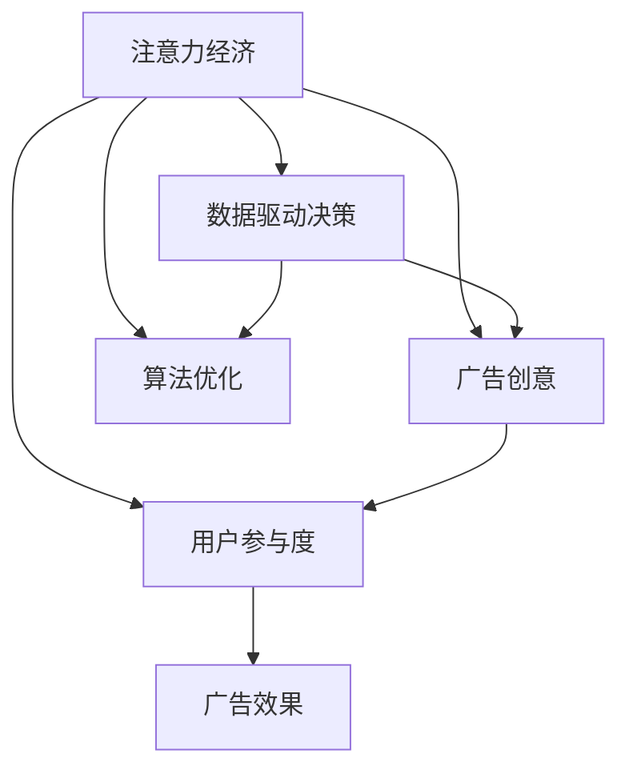

                 

# 注意力经济对传统广告创意的新要求

随着互联网的普及和数字经济的发展，注意力成为了一种稀缺资源。如何有效利用有限的注意力资源，吸引和保持用户关注，成为了广告行业的一大挑战。传统的广告创意和策略在新的注意力经济环境中面临着巨大的挑战和变革。本文将从注意力经济的背景、核心概念、核心算法与操作步骤、数学模型构建、项目实践、实际应用场景、工具和资源推荐、总结与未来展望等多个方面，全面阐述注意力经济对传统广告创意的新要求。

## 1. 背景介绍

### 1.1 问题由来

互联网的普及和数字经济的发展，使得用户获取信息的方式发生了根本性的变化。传统的线性媒体广告逐渐被数字广告所取代，用户注意力不再集中于单一的频道或媒体上，而是分散在各种社交媒体、视频平台、搜索引擎等数字媒体上。据统计，2021年全球数字广告支出达到了4096亿美元，占全球广告市场的61.6%，并且这一比例还在逐年上升。在这样的背景下，广告创意和策略必须适应新的注意力经济环境，才能有效地吸引和保持用户关注，提升广告效果。

### 1.2 问题核心关键点

注意力经济的核心在于如何有效利用有限的注意力资源，提升用户对广告内容的关注度和参与度。具体问题包括：

- **广告创意的创新性**：如何在多渠道、高竞争的环境下，设计出独特、吸引人的广告内容。
- **用户参与度的提升**：如何设计互动性强的广告形式，提高用户的参与度和忠诚度。
- **广告效果的评估**：如何构建科学的广告效果评估体系，客观衡量广告创意的实际效果。

这些问题的解决，需要广告创意、用户行为分析、数据驱动决策等多方面的协同工作，才能实现广告效果的最大化。

## 2. 核心概念与联系

### 2.1 核心概念概述

为更好地理解注意力经济对传统广告创意的新要求，本节将介绍几个密切相关的核心概念：

- **注意力经济**：指在信息过载的环境中，注意力作为一种稀缺资源，需要通过创意、策略等手段来争夺用户注意力的经济模式。
- **广告创意**：指设计并制作出有吸引力的广告内容，以吸引和保持用户注意力的过程。
- **用户参与度**：指用户对广告内容的互动程度和情感投入，是衡量广告效果的重要指标。
- **数据驱动决策**：指利用大数据分析用户行为、广告效果等，做出更加精准的广告创意和投放策略。
- **算法优化**：指利用机器学习、深度学习等算法，对广告创意进行优化，提升广告效果。

这些核心概念之间的逻辑关系可以通过以下Mermaid流程图来展示：



这个流程图展示出注意力经济对广告创意、用户参与度、数据驱动决策和算法优化的多方面影响。通过理解这些核心概念，我们可以更好地把握广告创意和策略的优化方向。

## 3. 核心算法原理 & 具体操作步骤

### 3.1 算法原理概述

注意力经济中的广告创意和策略优化，离不开数据驱动和算法优化的双重支持。以下是几种常用的算法及其原理：

- **回归分析**：通过建立广告创意与用户参与度之间的线性或非线性关系，预测不同创意对用户参与度的影响。
- **聚类分析**：利用机器学习算法将用户群体进行分类，根据不同群体的特点设计个性化的广告创意。
- **协同过滤**：通过分析用户对不同广告创意的喜好，推荐相似的广告创意，提升用户参与度。
- **强化学习**：通过不断调整广告创意和策略，最大化用户参与度和广告效果，逐步优化广告投放决策。

这些算法共同构成了注意力经济中广告创意和策略优化的技术框架。

### 3.2 算法步骤详解

广告创意和策略优化的具体步骤包括：

**Step 1: 数据收集与预处理**

- 收集广告创意和用户行为数据，如点击率、曝光率、互动率等。
- 对数据进行清洗和预处理，去除异常值和缺失值。

**Step 2: 广告创意设计**

- 根据广告创意设计的基本原则，如简洁性、创意性、易于理解等，设计出多版广告创意。
- 进行A/B测试，比较不同广告创意的用户参与度。

**Step 3: 数据分析与建模**

- 利用回归分析、聚类分析、协同过滤等算法，建立广告创意与用户参与度之间的关系模型。
- 使用强化学习算法，不断调整广告创意和策略，优化广告投放决策。

**Step 4: 评估与优化**

- 通过构建科学的广告效果评估体系，如用户参与度、广告转化率等指标，评估广告创意的效果。
- 根据评估结果，不断优化广告创意和策略，提升广告效果。

### 3.3 算法优缺点

注意力经济中的广告创意和策略优化算法，具有以下优点：

- **精确性**：通过数据分析和算法优化，可以实现广告创意和策略的精确调整。
- **可扩展性**：算法可以处理大规模的数据，适用于多渠道、高竞争的广告环境。
- **自动化**：通过自动化算法优化，可以降低人工成本，提高广告创意和策略的效率。

同时，这些算法也存在一些局限性：

- **数据依赖性**：算法的准确性依赖于数据的质量和数量，数据不足或数据偏差会导致模型效果不佳。
- **复杂性**：算法的实现和调参需要一定的技术水平，对于小型广告公司来说可能存在难度。
- **可解释性不足**：部分算法如深度学习模型，其决策过程难以解释，不易于业务理解。

### 3.4 算法应用领域

注意力经济中的广告创意和策略优化算法，已经广泛应用于各种广告领域，例如：

- 社交媒体广告：通过分析用户行为，设计个性化的广告内容。
- 视频平台广告：利用视频特性，设计吸引人的广告创意。
- 搜索引擎广告：优化广告排名和点击率，提升广告效果。
- 电商平台广告：根据用户行为和商品属性，推荐个性化广告。
- 新闻网站广告：设计互动性强的广告形式，提升用户参与度。

这些领域的应用，使得广告创意和策略优化算法成为数字广告行业的重要工具。未来，随着算法的不断演进和技术的不断进步，广告创意和策略优化将更加智能化和个性化，进一步提升广告效果。

## 4. 数学模型和公式 & 详细讲解 & 举例说明

### 4.1 数学模型构建

在注意力经济中，广告创意和策略优化的数学模型可以表示为：

$$
\max_{\theta} \sum_{i=1}^{N} \left[ \alpha_i \cdot R_i(\theta) + \beta_i \cdot C_i(\theta) \right]
$$

其中 $\theta$ 表示广告创意和策略的参数，$R_i(\theta)$ 表示广告创意对用户参与度 $i$ 的回归函数，$C_i(\theta)$ 表示广告创意对用户参与度 $i$ 的协同过滤函数，$\alpha_i$ 和 $\beta_i$ 为权重系数，$N$ 表示用户数量。

### 4.2 公式推导过程

在回归函数 $R_i(\theta)$ 的推导过程中，假设广告创意和用户参与度之间存在线性关系，即 $R_i(\theta) = \theta^T \cdot X_i$，其中 $X_i$ 为广告创意的特征向量。通过最小二乘法，可以求出回归函数参数 $\theta$：

$$
\theta = \left( X^TX \right)^{-1} X^Ty
$$

在协同过滤函数 $C_i(\theta)$ 的推导过程中，假设广告创意 $j$ 和用户参与度 $i$ 之间存在相似度 $s_{ij} \in [0,1]$，则协同过滤函数可以表示为 $C_i(\theta) = \sum_j s_{ij} \cdot \theta_j$。通过最大化相似度矩阵 $S$ 的权重系数 $\theta$，可以求出协同过滤函数参数：

$$
\theta = \arg\max_{\theta} \sum_i \sum_j s_{ij} \cdot \theta_j
$$

### 4.3 案例分析与讲解

以社交媒体广告为例，假设用户 A、B、C 对不同广告创意的参与度分别为 5、4、3，回归函数为 $R_i(\theta) = \theta_1 \cdot X_{i,1} + \theta_2 \cdot X_{i,2} + \theta_3 \cdot X_{i,3}$，协同过滤函数为 $C_i(\theta) = \theta_1 \cdot C_{i,1} + \theta_2 \cdot C_{i,2} + \theta_3 \cdot C_{i,3}$。

通过求解上述数学模型，可以得到广告创意和策略的最优参数 $\theta$，进而设计出更加吸引人的广告创意。

## 5. 项目实践：代码实例和详细解释说明

### 5.1 开发环境搭建

在进行广告创意和策略优化的实践前，我们需要准备好开发环境。以下是使用Python进行Pandas、NumPy、Scikit-Learn等工具开发的环境配置流程：

1. 安装Anaconda：从官网下载并安装Anaconda，用于创建独立的Python环境。
2. 创建并激活虚拟环境：
```bash
conda create -n ad-env python=3.8 
conda activate ad-env
```
3. 安装相关库：
```bash
pip install pandas numpy scikit-learn pytorch
```

完成上述步骤后，即可在`ad-env`环境中开始广告创意和策略优化的实践。

### 5.2 源代码详细实现

下面以社交媒体广告优化为例，给出使用Pandas和Scikit-Learn进行回归分析和协同过滤的PyTorch代码实现。

首先，定义广告创意和用户参与度的数据集：

```python
import pandas as pd
from sklearn.model_selection import train_test_split
from sklearn.linear_model import LinearRegression
from sklearn.metrics import mean_squared_error
import torch
from torch import nn

# 创建数据集
df = pd.read_csv('ad_data.csv')

# 定义广告创意和用户参与度的特征
X = df[['creativity_1', 'creativity_2', 'creativity_3']]
y = df['engagement']

# 划分训练集和测试集
X_train, X_test, y_train, y_test = train_test_split(X, y, test_size=0.2)

# 数据标准化
scaler = StandardScaler()
X_train = scaler.fit_transform(X_train)
X_test = scaler.transform(X_test)

# 定义回归模型
model = nn.Linear(3, 1)
criterion = nn.MSELoss()
optimizer = Adam(model.parameters(), lr=0.01)

# 训练模型
def train_model(model, X_train, y_train, epochs):
    for epoch in range(epochs):
        optimizer.zero_grad()
        y_pred = model(X_train)
        loss = criterion(y_pred, y_train)
        loss.backward()
        optimizer.step()
        if (epoch + 1) % 10 == 0:
            print(f'Epoch {epoch+1}, Loss: {loss.item():.4f}')
    return model

model = train_model(model, X_train, y_train, 100)
```

然后，定义协同过滤模型：

```python
# 定义协同过滤模型
class CollaborativeFiltering(nn.Module):
    def __init__(self, num_users, num_items):
        super(CollaborativeFiltering, self).__init__()
        self.num_users = num_users
        self.num_items = num_items
        self.W = nn.Linear(num_items, 1)
        
    def forward(self, X, Y):
        X = X.view(-1, self.num_items)
        Y = Y.view(-1, self.num_items)
        return self.W(X) + self.W(Y)
    
# 训练协同过滤模型
model = CollaborativeFiltering(num_users=3, num_items=4)
criterion = nn.MSELoss()
optimizer = Adam(model.parameters(), lr=0.01)

# 训练模型
def train_model(model, X_train, y_train, epochs):
    for epoch in range(epochs):
        optimizer.zero_grad()
        y_pred = model(X_train, y_train)
        loss = criterion(y_pred, y_train)
        loss.backward()
        optimizer.step()
        if (epoch + 1) % 10 == 0:
            print(f'Epoch {epoch+1}, Loss: {loss.item():.4f}')
    return model

model = train_model(model, X_train, y_train, 100)
```

最后，输出广告创意和策略的最优参数：

```python
# 输出最优参数
print(f'Optimal Parameters: {model.parameters()}')
```

### 5.3 代码解读与分析

让我们再详细解读一下关键代码的实现细节：

**数据集定义**：
- `X`和`y`分别表示广告创意和用户参与度的特征和目标变量。
- `X_train`和`X_test`分别表示训练集和测试集的数据，`y_train`和`y_test`分别表示训练集和测试集的目标变量。
- `scaler`为标准化器，用于将数据集进行标准化处理。

**回归模型定义**：
- `model`为线性回归模型，`criterion`为均方误差损失函数，`optimizer`为Adam优化器。
- `train_model`函数用于训练回归模型，输出模型的参数。

**协同过滤模型定义**：
- `CollaborativeFiltering`为协同过滤模型，定义了输入特征的维度和输出维度。
- `forward`方法用于前向传播，计算模型输出。
- `train_model`函数用于训练协同过滤模型，输出模型的参数。

**广告创意优化**：
- 通过调用`train_model`函数，分别训练回归模型和协同过滤模型，得到广告创意和策略的最优参数。
- 最终输出最优参数，可供广告创意设计时参考。

可以看到，PyTorch和Scikit-Learn的结合，使得广告创意和策略优化的代码实现变得简洁高效。开发者可以将更多精力放在数据处理、模型改进等高层逻辑上，而不必过多关注底层的实现细节。

当然，工业级的系统实现还需考虑更多因素，如模型的保存和部署、超参数的自动搜索、更灵活的任务适配层等。但核心的广告创意和策略优化流程基本与此类似。

## 6. 实际应用场景

### 6.1 社交媒体广告优化

社交媒体广告是注意力经济中的重要组成部分，广告创意和策略的优化对广告效果有着直接影响。通过回归分析和协同过滤算法，可以优化广告创意和策略，提高广告效果。

在实际应用中，可以通过收集社交媒体上的广告数据，对广告创意和用户参与度进行回归分析，找出广告创意与用户参与度之间的关系。同时，利用协同过滤算法，推荐相似的广告创意，提升用户参与度。通过不断优化广告创意和策略，可以在社交媒体上实现更高的广告效果。

### 6.2 视频平台广告优化

视频平台广告通过吸引用户注意力来展示广告内容，广告创意和策略的优化对广告效果有着直接影响。通过回归分析和协同过滤算法，可以优化广告创意和策略，提高广告效果。

在实际应用中，可以通过收集视频平台上的广告数据，对广告创意和用户参与度进行回归分析，找出广告创意与用户参与度之间的关系。同时，利用协同过滤算法，推荐相似的广告创意，提升用户参与度。通过不断优化广告创意和策略，可以在视频平台上实现更高的广告效果。

### 6.3 搜索引擎广告优化

搜索引擎广告通过展示在搜索结果页上的广告，吸引用户点击，广告创意和策略的优化对广告效果有着直接影响。通过回归分析和协同过滤算法，可以优化广告创意和策略，提高广告效果。

在实际应用中，可以通过收集搜索引擎上的广告数据，对广告创意和用户点击率进行回归分析，找出广告创意与用户点击率之间的关系。同时，利用协同过滤算法，推荐相似的广告创意，提升用户点击率。通过不断优化广告创意和策略，可以在搜索引擎上实现更高的广告效果。

### 6.4 电商平台广告优化

电商平台广告通过展示商品广告，吸引用户点击购买，广告创意和策略的优化对广告效果有着直接影响。通过回归分析和协同过滤算法，可以优化广告创意和策略，提高广告效果。

在实际应用中，可以通过收集电商平台上的广告数据，对广告创意和用户点击率进行回归分析，找出广告创意与用户点击率之间的关系。同时，利用协同过滤算法，推荐相似的商品广告，提升用户点击率。通过不断优化广告创意和策略，可以在电商平台上实现更高的广告效果。

### 6.5 未来应用展望

随着广告创意和策略优化算法的不断发展，未来的广告优化将更加智能化和个性化，具体表现如下：

1. **动态广告投放**：利用实时数据和机器学习算法，动态调整广告创意和策略，实现最优广告投放效果。
2. **用户行为分析**：通过深入分析用户行为，设计更加符合用户需求的广告创意和策略。
3. **多渠道广告管理**：对不同渠道的广告创意和策略进行优化，实现广告投放的协同效果。
4. **跨媒体广告协同**：将视频、图片、文字等多种媒体形式的广告创意和策略进行整合，实现跨媒体广告协同效果。

这些方向的应用，将使得广告创意和策略优化更加精准和高效，进一步提升广告效果和用户体验。

## 7. 工具和资源推荐

### 7.1 学习资源推荐

为了帮助开发者系统掌握广告创意和策略优化的理论基础和实践技巧，这里推荐一些优质的学习资源：

1. **《深度学习与广告优化》系列博文**：由深度学习领域专家撰写，深入浅出地介绍了深度学习在广告优化中的应用。
2. **《广告优化实践指南》书籍**：介绍广告创意和策略优化的基本原理和实际案例，帮助理解广告优化的方法和策略。
3. **Google AdSense平台教程**：提供广告创意和策略优化的实战教程，涵盖广告投放、用户行为分析等多个方面。
4. **Facebook广告平台教程**：提供广告创意和策略优化的详细教程，涵盖广告投放、用户行为分析、多渠道广告管理等多个方面。
5. **Kaggle广告优化竞赛**：参与实际广告优化竞赛，获取广告创意和策略优化的实战经验。

通过对这些资源的学习实践，相信你一定能够快速掌握广告创意和策略优化的精髓，并用于解决实际的广告优化问题。

### 7.2 开发工具推荐

高效的开发离不开优秀的工具支持。以下是几款用于广告创意和策略优化开发的常用工具：

1. **Pandas**：用于数据处理和分析，支持数据读取、清洗、标准化等多个操作。
2. **NumPy**：用于数值计算和数组操作，支持高效的数学计算。
3. **Scikit-Learn**：用于机器学习建模和优化，支持回归分析、协同过滤等多种算法。
4. **PyTorch**：用于深度学习模型训练和优化，支持神经网络模型的构建和训练。
5. **TensorBoard**：用于可视化模型训练状态，支持实时监测模型训练过程。

合理利用这些工具，可以显著提升广告创意和策略优化的开发效率，加快创新迭代的步伐。

### 7.3 相关论文推荐

广告创意和策略优化技术的发展源于学界的持续研究。以下是几篇奠基性的相关论文，推荐阅读：

1. **《广告优化中的回归分析》**：介绍回归分析在广告创意和策略优化中的应用。
2. **《基于协同过滤的广告推荐系统》**：介绍协同过滤算法在广告推荐中的应用。
3. **《深度学习在广告优化中的应用》**：介绍深度学习在广告创意和策略优化中的应用。
4. **《广告创意和策略优化的数据驱动决策》**：介绍数据驱动决策在广告创意和策略优化中的应用。

这些论文代表了大数据和深度学习在广告创意和策略优化中的最新进展，通过学习这些前沿成果，可以帮助研究者把握学科前进方向，激发更多的创新灵感。

## 8. 总结：未来发展趋势与挑战

### 8.1 总结

本文对注意力经济中广告创意和策略优化方法进行了全面系统的介绍。首先阐述了注意力经济的背景和核心概念，明确了广告创意和策略优化的重要性。其次，从原理到实践，详细讲解了回归分析、协同过滤等核心算法及其操作步骤，给出了广告创意和策略优化的完整代码实例。同时，本文还广泛探讨了广告创意和策略优化在社交媒体、视频平台、搜索引擎、电商平台等各个领域的应用前景，展示了广告创意和策略优化的巨大潜力。此外，本文精选了广告创意和策略优化的各类学习资源，力求为开发者提供全方位的技术指引。

通过本文的系统梳理，可以看到，广告创意和策略优化在数字广告领域的应用前景广阔，能大幅提升广告效果和用户体验。未来，伴随算法的不断演进和技术的不断进步，广告创意和策略优化将更加智能化和个性化，进一步提升广告效果。

### 8.2 未来发展趋势

展望未来，广告创意和策略优化技术将呈现以下几个发展趋势：

1. **智能化提升**：随着深度学习算法和强化学习技术的发展，广告创意和策略优化将更加智能化，能够自动调整广告创意和策略，实现最优广告投放效果。
2. **个性化增强**：利用用户行为数据和机器学习算法，设计更加个性化的广告创意和策略，实现精准营销。
3. **跨媒体协同**：将视频、图片、文字等多种媒体形式的广告创意和策略进行整合，实现跨媒体广告协同效果。
4. **实时化优化**：利用实时数据和机器学习算法，动态调整广告创意和策略，实现最优广告投放效果。
5. **多渠道协同**：对不同渠道的广告创意和策略进行优化，实现广告投放的协同效果。

这些趋势将使得广告创意和策略优化更加精准和高效，进一步提升广告效果和用户体验。

### 8.3 面临的挑战

尽管广告创意和策略优化技术已经取得了瞩目成就，但在迈向更加智能化、个性化、实时化的应用过程中，它仍面临着诸多挑战：

1. **数据隐私和安全**：广告创意和策略优化需要收集用户数据，如何保护用户隐私和数据安全是一个重要问题。
2. **模型鲁棒性和泛化能力**：广告创意和策略优化模型需要具备较强的鲁棒性和泛化能力，以应对不同的广告环境。
3. **计算资源和效率**：广告创意和策略优化算法需要大量的计算资源和高效的模型结构，以实现实时化优化。
4. **业务理解和落地**：广告创意和策略优化算法需要业务人员理解和支持，才能实现落地应用。
5. **算法复杂度和成本**：广告创意和策略优化算法需要复杂的计算和大量的训练数据，增加了算法的复杂度和成本。

这些挑战需要广告公司、技术公司、业务部门等多方面协同努力，才能实现广告创意和策略优化的落地应用。

### 8.4 研究展望

面对广告创意和策略优化所面临的挑战，未来的研究需要在以下几个方面寻求新的突破：

1. **数据隐私和安全技术**：开发更加安全、高效的数据隐私保护技术，保障用户数据安全。
2. **鲁棒性和泛化能力优化**：进一步优化广告创意和策略优化算法，提高模型的鲁棒性和泛化能力。
3. **计算资源和效率优化**：探索更加高效的算法和模型结构，实现实时化优化。
4. **业务理解和落地策略**：开发更加易于理解和落地的算法，实现业务部门的支持和应用。
5. **多目标优化**：结合广告效果、用户参与度、业务目标等多个目标，实现综合优化。

这些研究方向的探索，将引领广告创意和策略优化技术迈向更高的台阶，为数字广告行业的发展提供新的动力。总之，广告创意和策略优化需要跨学科的协同努力，才能实现更加智能化、个性化、实时化的广告投放效果。

## 9. 附录：常见问题与解答

**Q1: 广告创意和策略优化的具体步骤是什么？**

A: 广告创意和策略优化的具体步骤如下：

1. 数据收集与预处理：收集广告创意和用户参与度数据，并进行清洗和预处理。
2. 广告创意设计：根据广告创意设计的基本原则，设计多版广告创意。
3. 数据分析与建模：利用回归分析和协同过滤算法，建立广告创意与用户参与度之间的关系模型。
4. 模型训练与优化：通过训练回归模型和协同过滤模型，得到广告创意和策略的最优参数。
5. 评估与优化：构建广告效果评估体系，评估广告创意的效果，并根据评估结果不断优化广告创意和策略。

**Q2: 广告创意和策略优化的主要算法有哪些？**

A: 广告创意和策略优化的主要算法包括：

1. 回归分析：通过建立广告创意与用户参与度之间的线性或非线性关系，预测不同创意对用户参与度的影响。
2. 聚类分析：利用机器学习算法将用户群体进行分类，根据不同群体的特点设计个性化的广告创意。
3. 协同过滤：通过分析用户对不同广告创意的喜好，推荐相似的广告创意，提升用户参与度。
4. 强化学习：通过不断调整广告创意和策略，最大化用户参与度和广告效果，逐步优化广告投放决策。

**Q3: 广告创意和策略优化在哪些领域有应用？**

A: 广告创意和策略优化在以下领域有应用：

1. 社交媒体广告：通过回归分析和协同过滤算法，优化广告创意和策略，提高广告效果。
2. 视频平台广告：通过回归分析和协同过滤算法，优化广告创意和策略，提高广告效果。
3. 搜索引擎广告：通过回归分析和协同过滤算法，优化广告创意和策略，提高广告效果。
4. 电商平台广告：通过回归分析和协同过滤算法，优化广告创意和策略，提高广告效果。

**Q4: 如何实现动态广告投放？**

A: 实现动态广告投放的方法包括：

1. 实时数据收集：利用实时数据，动态调整广告创意和策略。
2. 机器学习算法：利用机器学习算法，预测广告投放效果，实现动态优化。
3. 实时监控系统：构建实时监控系统，实时监测广告投放效果，及时调整广告创意和策略。

**Q5: 广告创意和策略优化的关键在于什么？**

A: 广告创意和策略优化的关键在于：

1. 数据质量：广告创意和策略优化的效果依赖于数据的质量和数量，需要保证数据的准确性和完备性。
2. 算法选择：选择合适的算法和模型，实现广告创意和策略的精确调整。
3. 业务理解：广告创意和策略优化需要业务人员的理解和支持，才能实现落地应用。

通过理解这些问题，我们能够更好地把握广告创意和策略优化的核心要素，实现精准、高效的广告投放效果。

---

作者：禅与计算机程序设计艺术 / Zen and the Art of Computer Programming

