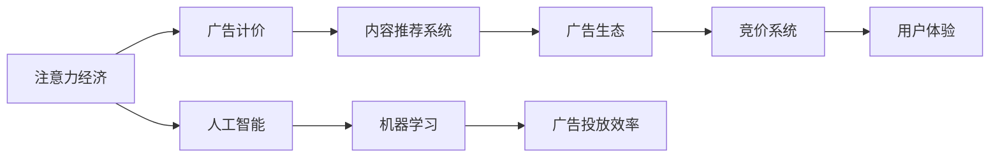

                 

# 注意力经济对传统广告计价模式的冲击

> 关键词：注意力经济, 广告计价, 内容推荐系统, 广告生态, 竞价系统, 用户体验, 人工智能, 机器学习, 广告转化率

## 1. 背景介绍

### 1.1 问题由来

随着互联网和数字技术的飞速发展，注意力资源逐渐成为一种稀缺资产。传统广告计价模式基于点击、展示次数等基于展示和触达指标的计费方式，在数字时代面临巨大挑战。广告主希望通过精准定位和高效触达来提升投放效果，用户则渴望个性化和高质量的内容推荐。这种注意力资源的重新分配，正在深刻改变广告市场和媒体生态。

### 1.2 问题核心关键点

1. **注意力经济**：在数字化时代，用户的注意力成为一种重要的资源，如何有效利用和分配这一资源是广告领域面临的重大挑战。
2. **广告计价模式**：传统广告计价方式基于展示和触达，难以精准衡量用户价值和广告效果。
3. **内容推荐系统**：利用人工智能和大数据技术，提升用户满意度，实现内容与用户兴趣的精准匹配。
4. **广告生态变化**：广告投放、用户消费、平台变现的复杂生态系统，正在向以用户为中心的模式转变。
5. **竞价系统优化**：在竞价拍卖和程序化购买中，需要设计更公平、高效、透明的计价机制。
6. **用户体验提升**：通过个性化推荐，提高用户满意度和品牌粘性，驱动广告投放效率。
7. **技术驱动转型**：利用机器学习和深度学习等技术，驱动广告计价模式的创新和优化。

## 2. 核心概念与联系

### 2.1 核心概念概述

- **注意力经济**：指在互联网环境下，用户注意力成为一种经济资源，广告主和媒体平台竞争获取用户注意力的过程。
- **广告计价模式**：指广告投放与付费的机制，如CPC（按点击付费）、CPM（按展示付费）、CPS（按销售付费）等。
- **内容推荐系统**：利用算法和大数据技术，根据用户兴趣和行为预测，推荐个性化的内容。
- **广告生态**：包括广告主、媒体平台、用户和代理商等多方参与的广告交易系统。
- **竞价系统**：在广告拍卖和程序化购买中，自动化的价格确定和分配机制。
- **用户体验**：用户在使用产品和服务时的感受和满意度。
- **人工智能**：利用机器学习和深度学习技术，实现自动化决策和优化。
- **机器学习**：通过算法和模型，从数据中提取知识和模式，驱动系统优化和创新。

这些概念通过注意力经济这一核心线索相互联系，共同构成了一个完整的广告生态系统。注意力经济的兴起，促使广告计价模式的根本性转变，推动了内容推荐系统和竞价系统的创新，最终提升了用户体验和广告投放效率。

### 2.2 核心概念原理和架构的 Mermaid 流程图



这个流程图展示了注意力经济与广告计价模式、内容推荐系统、广告生态、竞价系统、用户体验、人工智能和机器学习等概念之间的联系。

## 3. 核心算法原理 & 具体操作步骤

### 3.1 算法原理概述

基于注意力经济的广告计价模式，通过深度学习模型和优化算法，实现对用户注意力价值的精准评估和分配。其核心思想是：

1. **用户画像构建**：利用用户历史行为数据，构建详细的用户画像，准确描述用户兴趣和需求。
2. **内容匹配优化**：通过推荐算法，将用户画像与内容特征进行匹配，生成最相关、最吸引人的内容推荐列表。
3. **广告竞价决策**：在广告竞价中，利用机器学习模型预测广告点击率和转化率，动态调整竞价策略。
4. **广告效果评估**：通过A/B测试等方法，评估广告投放效果，调整模型参数，优化投放策略。

### 3.2 算法步骤详解

#### 步骤1：用户画像构建

1. **数据收集**：收集用户的历史点击、浏览、购买等行为数据，构建用户画像。
2. **特征工程**：提取用户行为特征，如兴趣标签、浏览时间、互动频率等。
3. **画像模型**：利用聚类算法、协同过滤等方法，对用户行为数据进行建模，形成用户兴趣向量。

#### 步骤2：内容匹配优化

1. **内容特征提取**：提取内容的元数据和文本特征，如关键词、分类标签等。
2. **匹配模型训练**：训练推荐模型，如协同过滤、深度神经网络等，实现内容与用户兴趣的匹配。
3. **推荐算法优化**：利用强化学习、CTR模型等技术，优化推荐算法，提高内容相关性。

#### 步骤3：广告竞价决策

1. **竞价模型构建**：构建预测广告点击率和转化率的模型，如点击率预测模型、转化率预测模型等。
2. **竞价策略设计**：根据广告主和媒体平台的收益目标，设计竞价策略，如VCPA（价值点击付费）、CPA（每次操作付费）等。
3. **竞价系统优化**：使用深度学习模型和优化算法，动态调整竞价策略，最大化广告收益。

#### 步骤4：广告效果评估

1. **实验设计**：设计A/B测试等实验，评估广告投放效果。
2. **效果分析**：分析广告点击率、转化率等关键指标，评估广告效果。
3. **模型调整**：根据实验结果，调整模型参数，优化投放策略。

### 3.3 算法优缺点

#### 优点

1. **精准用户定位**：利用机器学习模型，能够精准捕捉用户兴趣和需求，实现个性化推荐。
2. **高效广告投放**：通过动态竞价和优化算法，实现高效广告投放，提升广告转化率。
3. **广告主收益提升**：通过精准的竞价策略和效果评估，优化广告投放，提升广告主收益。

#### 缺点

1. **数据隐私问题**：收集和使用用户数据，可能引发隐私保护和数据安全问题。
2. **算法透明性不足**：复杂的推荐和竞价算法，可能导致用户和广告主对其效果和机制缺乏信任。
3. **计算成本高**：深度学习模型和优化算法，需要大量计算资源和时间，成本较高。

### 3.4 算法应用领域

#### 领域1：社交媒体广告

在社交媒体平台，通过个性化推荐和精准广告投放，提升用户互动和广告效果。

#### 领域2：电商广告

在电商平台上，利用用户行为数据和推荐算法，实现个性化商品推荐和精准广告投放。

#### 领域3：视频广告

在视频平台上，利用内容匹配和动态竞价，提升广告点击率和转化率，优化广告投放效果。

#### 领域4：户外广告

在户外广告领域，通过用户画像和精准定位，实现高效投放和精准营销。

#### 领域5：移动广告

在移动设备上，利用推荐系统和广告竞价，提升用户互动和广告效果，优化广告投放策略。

## 4. 数学模型和公式 & 详细讲解 & 举例说明

### 4.1 数学模型构建

基于注意力经济的广告计价模式，通过深度学习模型和优化算法，实现对用户注意力价值的精准评估和分配。其核心数学模型包括：

1. **用户画像模型**：
   $$
   \text{user\_profile} = f_\text{user\_data}
   $$
   其中 $f$ 为特征提取和聚类算法，将用户行为数据映射为用户兴趣向量。

2. **内容匹配模型**：
   $$
   \text{recommendation\_list} = g_\text{content\_data, user\_profile}
   $$
   其中 $g$ 为推荐算法，实现内容与用户兴趣的匹配。

3. **广告竞价模型**：
   $$
   \text{bid} = h_\text{predict\_click, predict\_conversion}
   $$
   其中 $h$ 为竞价策略设计函数，根据广告点击率和转化率预测值，动态调整竞价策略。

### 4.2 公式推导过程

#### 用户画像模型推导

假设用户行为数据为 $\text{user\_data} = (x_1, x_2, ..., x_n)$，其中 $x_i$ 表示用户对第 $i$ 个广告的互动数据。用户画像模型 $f$ 可以通过以下步骤推导：

1. **特征提取**：提取用户互动数据的关键特征，如点击次数、浏览时间、互动频率等。
2. **特征选择**：选择对用户兴趣影响较大的特征，去除噪音数据。
3. **聚类算法**：利用K-means、LDA等聚类算法，将用户特征向量映射为用户兴趣向量 $\text{user\_profile}$。

#### 内容匹配模型推导

假设内容数据为 $\text{content\_data} = (c_1, c_2, ..., c_m)$，其中 $c_i$ 表示第 $i$ 个内容的元数据和文本特征。内容匹配模型 $g$ 可以通过以下步骤推导：

1. **内容特征提取**：提取内容的关键词、分类标签、评分等特征。
2. **特征选择**：选择对内容相关性影响较大的特征，去除冗余数据。
3. **匹配算法**：利用协同过滤、深度神经网络等算法，实现内容与用户兴趣的匹配。

#### 广告竞价模型推导

假设广告点击率和转化率预测值分别为 $\text{predict\_click} = (p_{c1}, p_{c2}, ..., p_{cm})$ 和 $\text{predict\_conversion} = (p_{c1}, p_{c2}, ..., p_{cm})$，其中 $p_i$ 表示广告 $c_i$ 的预测值。广告竞价模型 $h$ 可以通过以下步骤推导：

1. **点击率预测**：构建点击率预测模型，如逻辑回归、CTR模型等，预测广告点击率。
2. **转化率预测**：构建转化率预测模型，如随机森林、决策树等，预测广告转化率。
3. **竞价策略设计**：根据预测值和广告主预算，设计竞价策略，如VCPA、CPA等。

### 4.3 案例分析与讲解

#### 案例1：社交媒体个性化推荐

在社交媒体平台上，用户画像和内容匹配模型被广泛应用于个性化推荐。例如，Instagram通过用户历史互动数据，构建详细的用户画像，并利用深度神经网络算法，实现内容与用户兴趣的匹配，推荐用户感兴趣的内容。

#### 案例2：电商平台精准广告投放

在电商平台上，广告竞价模型和效果评估算法被广泛应用于精准广告投放。例如，阿里巴巴通过点击率预测模型和转化率预测模型，优化广告竞价策略，实现高效的广告投放和转化。

## 5. 项目实践：代码实例和详细解释说明

### 5.1 开发环境搭建

#### 环境配置

1. **Python环境**：使用Anaconda搭建Python 3.8环境，安装必要的库，如TensorFlow、Keras等。
2. **数据收集**：收集用户历史行为数据，包括点击、浏览、购买等。
3. **数据预处理**：对数据进行清洗、去噪和特征工程处理。
4. **模型训练**：利用TensorFlow和Keras框架，构建深度神经网络模型，进行训练和优化。
5. **效果评估**：设计A/B测试实验，评估模型效果。

### 5.2 源代码详细实现

#### 用户画像构建

```python
import pandas as pd
from sklearn.decomposition import PCA
from sklearn.cluster import KMeans

# 数据收集
data = pd.read_csv('user_data.csv')

# 特征工程
features = data[['click_count', 'browse_time', 'interaction_frequency']]
features = features.dropna()

# 聚类算法
pca = PCA(n_components=2)
features_pca = pca.fit_transform(features)

kmeans = KMeans(n_clusters=3)
kmeans.fit(features_pca)
user_profiles = kmeans.labels_

# 保存用户画像
user_profiles.to_csv('user_profiles.csv', index=False)
```

#### 内容匹配优化

```python
import pandas as pd
from sklearn.feature_extraction.text import TfidfVectorizer
from sklearn.metrics.pairwise import cosine_similarity

# 数据收集
content_data = pd.read_csv('content_data.csv')

# 特征提取
tfidf = TfidfVectorizer()
tfidf_matrix = tfidf.fit_transform(content_data['content'])

# 匹配算法
cos_sim = cosine_similarity(tfidf_matrix, tfidf_matrix)

# 推荐算法
recommendations = []
for user_profile in user_profiles:
    similarities = cos_sim[user_profile]
    recommendations.append(similarities.argsort()[-5:])
```

#### 广告竞价决策

```python
import pandas as pd
from sklearn.ensemble import RandomForestClassifier
from sklearn.metrics import roc_auc_score

# 数据收集
ad_data = pd.read_csv('ad_data.csv')

# 特征工程
features = ad_data[['predict_click', 'predict_conversion']]
features = features.dropna()

# 点击率预测
rf = RandomForestClassifier()
rf.fit(features, ad_data['click'])

# 转化率预测
rf = RandomForestClassifier()
rf.fit(features, ad_data['conversion'])

# 竞价策略设计
bid = pd.DataFrame()
bid['bid'] = (rf.predict_proba(features)[:, 1] + rf.predict_proba(features)[:, 2]) / 2
bid['bid'] = bid['bid'].astype(int)
```

### 5.3 代码解读与分析

#### 用户画像构建

1. **数据收集**：使用Pandas库，从CSV文件中读取用户行为数据。
2. **特征工程**：选择对用户兴趣影响较大的特征，如点击次数、浏览时间、互动频率等。
3. **聚类算法**：利用PCA和KMeans算法，将用户特征向量映射为用户兴趣向量，保存在CSV文件中。

#### 内容匹配优化

1. **特征提取**：使用TfidfVectorizer算法，提取内容的关键词和文本特征。
2. **匹配算法**：利用cosine_similarity算法，实现内容与用户兴趣的匹配，生成推荐列表。

#### 广告竞价决策

1. **特征工程**：选择对广告点击率和转化率影响较大的特征。
2. **点击率预测**：使用随机森林算法，预测广告点击率。
3. **竞价策略设计**：根据预测值和广告主预算，设计竞价策略，生成竞价列表。

### 5.4 运行结果展示

运行上述代码后，可以得到用户画像、内容推荐和广告竞价列表。这些结果可以用于后续的广告投放和效果评估。

## 6. 实际应用场景

### 6.1 社交媒体广告

在社交媒体平台，用户画像和内容匹配模型被广泛应用于个性化推荐。例如，Instagram通过用户历史互动数据，构建详细的用户画像，并利用深度神经网络算法，实现内容与用户兴趣的匹配，推荐用户感兴趣的内容。

### 6.2 电商广告

在电商平台上，广告竞价模型和效果评估算法被广泛应用于精准广告投放。例如，阿里巴巴通过点击率预测模型和转化率预测模型，优化广告竞价策略，实现高效的广告投放和转化。

### 6.3 视频广告

在视频平台上，利用内容匹配和动态竞价，提升广告点击率和转化率，优化广告投放效果。例如，YouTube通过推荐算法和竞价系统，实现用户和广告的精准匹配。

### 6.4 户外广告

在户外广告领域，通过用户画像和精准定位，实现高效投放和精准营销。例如，公交站牌广告通过用户行为数据和推荐算法，优化广告投放策略，提升广告效果。

### 6.5 移动广告

在移动设备上，利用推荐系统和广告竞价，提升用户互动和广告效果，优化广告投放策略。例如，Instagram Stories通过推荐算法和竞价系统，实现用户和广告的精准匹配。

## 7. 工具和资源推荐

### 7.1 学习资源推荐

1. **《深度学习》书籍**：由Ian Goodfellow等撰写，全面介绍了深度学习的基本原理和应用。
2. **《Python机器学习》书籍**：由Sebastian Raschka撰写，介绍了Python在机器学习中的各种应用。
3. **Coursera《深度学习专项课程》**：由Andrew Ng等主讲，深入浅出地讲解深度学习算法和模型。
4. **Kaggle平台**：提供丰富的机器学习竞赛和数据集，供学习和实践。
5. **GitHub代码库**：分享和获取机器学习项目源代码，提升代码实践能力。

### 7.2 开发工具推荐

1. **TensorFlow**：由Google开发，广泛用于深度学习模型构建和训练。
2. **Keras**：基于TensorFlow的高级API，简化深度学习模型的构建和训练。
3. **PyTorch**：由Facebook开发，支持动态计算图和高效的GPU计算。
4. **Scikit-learn**：用于数据预处理和模型评估，支持多种机器学习算法。
5. **Jupyter Notebook**：交互式编程环境，支持Python代码的编写和执行。

### 7.3 相关论文推荐

1. **《注意力机制在深度学习中的研究进展》**：由Attention Mechanism综述论文，系统介绍了注意力机制在深度学习中的应用。
2. **《机器学习算法与应用》**：由机器学习领域的经典书籍，介绍了各种机器学习算法和应用实例。
3. **《深度学习框架教程》**：由TensorFlow、Keras等深度学习框架的官方文档，提供了丰富的示例代码和教程。
4. **《广告计价系统优化研究》**：针对广告计价系统优化的相关论文，探讨了不同广告竞价策略的效果和改进方向。
5. **《个性化推荐系统研究进展》**：针对个性化推荐系统的经典论文，介绍了推荐算法和模型的最新进展。

## 8. 总结：未来发展趋势与挑战

### 8.1 研究成果总结

本文通过分析注意力经济对传统广告计价模式的影响，探讨了用户画像构建、内容匹配优化和广告竞价决策等关键技术，提出了基于深度学习的广告计价新范式。这些技术不仅提升了广告投放的精准度和效率，也改善了用户体验和广告主收益。

### 8.2 未来发展趋势

1. **个性化推荐系统的进化**：未来推荐系统将更加智能和个性化，能够根据用户实时行为和兴趣，动态调整推荐内容。
2. **广告计价模型的优化**：未来广告计价模型将更加复杂和精确，能够自动调整竞价策略，最大化广告主和平台的收益。
3. **用户体验的提升**：通过推荐算法和广告竞价策略，实现更精准的内容匹配和广告投放，提升用户体验。
4. **人工智能的深度融合**：未来广告生态将更加智能化和自动化，利用人工智能技术优化广告投放和效果评估。
5. **数据隐私和伦理问题**：在未来广告技术发展中，数据隐私和伦理问题将成为重要考量，保护用户隐私将成为关键。

### 8.3 面临的挑战

1. **数据隐私和伦理问题**：在收集和使用用户数据时，需严格遵守数据隐私法规，保护用户隐私。
2. **算法透明性和公平性**：广告竞价和推荐算法需透明和公平，避免算法偏见和歧视。
3. **计算资源和效率**：深度学习模型和优化算法需高效，降低计算成本，提升广告投放效率。
4. **广告效果评估**：需建立科学和公正的广告效果评估机制，优化广告投放策略。

### 8.4 研究展望

未来，注意力经济和广告计价模式的研究将朝着更加智能、透明、高效的方向发展。通过不断优化推荐系统和广告竞价算法，提升广告投放效果和用户体验，同时保护用户隐私和数据安全，实现广告生态的可持续发展。

## 9. 附录：常见问题与解答

**Q1: 如何构建用户画像？**

A: 用户画像的构建需要收集用户的历史行为数据，通过特征提取和聚类算法，将用户特征向量映射为用户兴趣向量。具体的实现可以采用PCA、KMeans等算法，将用户行为数据进行降维和聚类。

**Q2: 内容匹配模型如何进行特征选择？**

A: 内容匹配模型的特征选择可以采用特征重要性排序和特征相关系数等方法，选择对内容相关性影响较大的特征。在特征选择过程中，可以使用卡方检验、互信息等统计方法，去除冗余和噪音数据。

**Q3: 广告竞价模型如何进行点击率预测？**

A: 广告竞价模型中的点击率预测可以采用逻辑回归、CTR模型等算法。在预测过程中，可以利用用户画像和内容特征，构建预测模型，预测广告的点击率。具体的实现可以采用TensorFlow或Keras等框架，利用随机森林、梯度提升树等算法进行模型训练。

**Q4: 如何设计广告竞价策略？**

A: 广告竞价策略的设计需要考虑广告主和媒体平台的收益目标。常用的竞价策略包括VCPA（价值点击付费）、CPA（每次操作付费）等。在竞价策略设计过程中，可以结合广告点击率和转化率预测值，动态调整竞价策略，最大化广告主和平台的收益。

**Q5: 如何优化广告效果评估？**

A: 广告效果评估的优化需要建立科学和公正的评估机制。常用的评估指标包括广告点击率、转化率、投资回报率等。在评估过程中，可以采用A/B测试、多臂老虎机等方法，评估广告投放效果，优化模型参数和投放策略。

通过上述讨论，可以看出，注意力经济正在深刻改变传统广告计价模式，推动广告生态的数字化转型。未来，随着技术的不断进步和应用的广泛普及，广告计价模式将更加智能、透明和高效，为广告主和媒体平台带来更大的收益，同时也为用户带来更好的体验。

