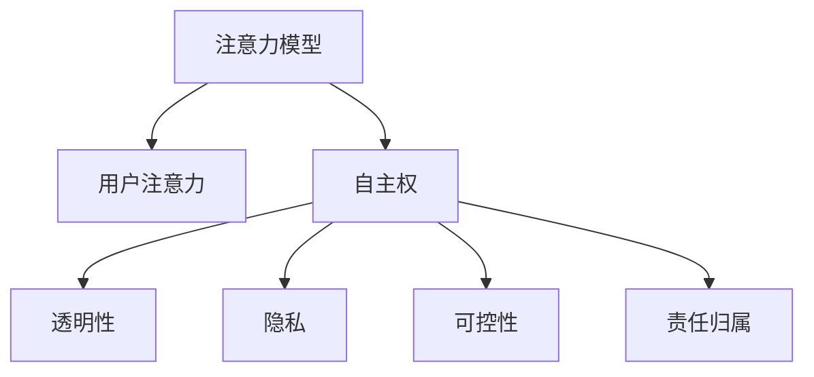

                 

# 注意力自主权维护者：AI时代的个人选择卫士

> 关键词：人工智能,AI伦理,用户隐私,算法透明,注意力模型

## 1. 背景介绍

### 1.1 问题由来
随着人工智能技术的迅猛发展，AI算法在医疗、金融、教育等诸多领域开始发挥重要作用。然而，这些算法越来越多地介入人们的日常生活，影响着人类的决策与选择。用户的注意力，即用户如何分配时间和精力去感知、思考和互动，成为数字时代重要的“个人自主权”。

面对AI决策系统的广泛应用，如何保护用户的注意力自主权，避免其被不当干扰或侵犯，成为一个值得深思的问题。在AI时代，个人选择卫士的任务不仅限于数据隐私保护，更在于维护用户的注意力自主权，使AI算法在助力用户决策的同时，不丧失对用户决策的尊重和控制。

### 1.2 问题核心关键点
- 注意力自主权：用户在数字世界中自主控制如何分配注意力、选择信息的能力。
- 算法透明性：确保用户了解和理解AI决策过程，从而增强对算法结果的信任和控制。
- 用户隐私：保护用户在生成和存储数据时的隐私权益。
- 用户可控性：赋予用户选择性地使用或拒绝AI决策的能力。
- 责任归属：明确AI决策的责任主体，避免算法不当使用导致的责任混淆。

这些核心关键点构成了维护注意力自主权的主框架，指导着未来AI系统设计和社会治理的思考与实践。

## 2. 核心概念与联系

### 2.1 核心概念概述

为更好地理解如何在AI时代维护用户的注意力自主权，本节将介绍几个核心概念及其相互关系：

- 注意力模型(Attention Model)：一类用于处理序列数据、强化决策的神经网络模型。其核心思想是自适应地关注输入序列中的关键部分，进行特征抽取和信息融合。
- 用户注意力(Audience Attention)：用户如何分配时间和精力关注不同信息，包括选择、检索、使用、思考等。
- 自主权(Self-Determination)：用户自主控制和决策的能力，包括选择、拒绝、控制等。
- 透明性(Transparency)：用户对AI决策过程的知晓和理解，包括模型选择、参数、输出等信息。
- 隐私(Privacy)：用户个人信息的保护，包括数据生成、存储、处理等环节的隐私保护。
- 可控性(Controllability)：用户对AI决策的影响和控制能力，包括选项选择、反馈控制等。
- 责任归属(Liability)：AI决策的责任主体归属，包括开发者、运营商、用户等。

这些核心概念之间的逻辑关系可以通过以下Mermaid流程图来展示：



这个流程图展示了几类关键概念之间的相互关系：

1. 注意力模型通过处理信息，影响用户对信息的注意方式。
2. 用户注意力决定了其决策和选择的方向。
3. 自主权体现在用户对注意力分配的掌控上。
4. 透明性关系到用户对注意力模型使用的理解程度。
5. 隐私涉及用户信息在注意力模型处理中的保护。
6. 可控性表现为用户对注意力模型决策的影响能力。
7. 责任归属确定不同主体在模型使用中的责任和权利。

## 3. 核心算法原理 & 具体操作步骤

### 3.1 算法原理概述

注意力自主权维护的核心在于如何通过技术手段，确保用户在AI决策过程中具备足够的自主权、透明度和隐私保护。以下是基于注意力模型的自主权维护的一些关键原则和算法原理：

1. **注意力机制的透明化**：在注意力模型中，注意力权重对关键信息的抽取和决策有决定性影响。通过可视化和解释注意力权重，用户可以理解模型如何处理输入信息，从而增强对决策过程的理解。

2. **用户可控性增强**：用户应具备选择性地输入数据、干预模型决策、控制算法行为的能力。可以通过设计灵活的交互界面和用户干预机制，让用户对注意力模型进行实时调整。

3. **隐私保护机制**：在数据生成和处理过程中，应采用差分隐私、数据匿名化、数据加密等技术，确保用户数据的安全性和隐私性。

4. **责任归属的明确化**：在AI决策过程中，应明确各方责任，特别是算法开发者和运营商。用户应了解谁在承担最终责任，以及在哪些情况下可以追究责任。

5. **决策后评估机制**：在AI决策后，应提供评估和反馈机制，让用户可以评价决策结果，并提供反馈意见。

### 3.2 算法步骤详解

基于上述关键原则，以下是进行注意力自主权维护的算法步骤：

1. **数据预处理**：在数据输入到模型前，应进行差分隐私处理，如添加噪声、抑制敏感信息等，确保用户数据的安全性。

2. **注意力权重可视化**：模型在处理数据时，记录注意力权重，并展示给用户。用户可以直观了解模型关注的重点信息，从而理解决策依据。

3. **用户干预机制**：设计可交互的界面，允许用户输入调整注意力权重、引入额外信息等，增强其对决策过程的直接控制。

4. **决策结果评估**：提供用户对决策结果的评估选项，如满意度、准确度等，收集用户反馈，优化模型。

5. **责任归属告知**：在使用AI决策系统前，应告知用户模型开发者、运营者的信息，以及决策过程中可能承担的责任。

6. **透明度和隐私政策**：制定透明的隐私政策，告知用户数据收集、存储、处理和使用的过程，增强用户信任。

### 3.3 算法优缺点

注意力自主权维护的算法具有以下优点：

1. **增强用户信任**：通过透明化和可控性的提升，用户能够更好地理解和信任AI决策系统。

2. **保障隐私安全**：差分隐私、数据匿名化等技术的使用，保护了用户的隐私权益。

3. **提升决策质量**：用户干预机制使得AI决策系统能够更好地贴合用户需求，提高决策的准确性和满意度。

4. **明确责任归属**：责任归属机制增强了用户对AI决策系统的信任感和控制力。

同时，该算法也存在以下局限性：

1. **技术复杂度**：注意力权重可视化、用户干预机制等，需要复杂的技术实现，增加了系统的开发和维护成本。

2. **用户理解难度**：注意力机制复杂，用户理解其工作原理和影响因素可能存在难度。

3. **隐私保护难度**：隐私保护技术需要不断更新和优化，以应对日益复杂的网络攻击手段。

4. **用户控制力度**：用户干预机制可能过于复杂，超出一般用户的使用习惯和理解能力。

## 4. 数学模型和公式 & 详细讲解 & 举例说明

### 4.1 数学模型构建

在注意力模型的自主权维护过程中，数学模型构建主要关注注意力机制的设计和优化。以下是注意力模型的核心数学公式：

设 $M_{\theta}$ 为一个注意力模型，$x_1, x_2, ..., x_N$ 为输入序列，$w_{ij}$ 为注意力权重，$o_i$ 为输出，$\theta$ 为模型参数。注意力模型通过计算注意力权重对输入序列进行处理，得到输出 $o_i$。注意力权重的计算公式如下：

$$
w_{ij} = \frac{e^{a_i^T s_j}}{\sum_{k=1}^K e^{a_k^T s_j}}
$$

其中，$a_i$ 为查询向量，$s_j$ 为键向量，$K$ 为注意力头数。通过计算查询和键的相似度，模型得到对每个输入元素的注意力权重。

### 4.2 公式推导过程

注意力权重 $w_{ij}$ 的推导基于softmax函数，用于将注意力向量的计算结果转化为概率分布。计算过程如下：

1. 查询向量 $a_i$ 通过线性变换得到。
2. 键向量 $s_j$ 通过线性变换得到。
3. 计算相似度 $a_i^T s_j$。
4. 应用softmax函数将相似度转化为概率分布。
5. 对所有注意力头数 $K$ 的权重求和。

这样，模型能够根据输入序列和注意力权重，自适应地关注重要信息，进行决策和预测。

### 4.3 案例分析与讲解

考虑一个医疗诊断决策系统，使用注意力模型对患者症状进行分析，得出疾病诊断结果。具体步骤如下：

1. 数据预处理：对患者的症状数据进行差分隐私处理，去除敏感信息，确保数据安全性。

2. 注意力权重可视化：模型计算对每个症状的注意力权重，并展示给医生。医生可以直观了解模型关注的症状，从而理解决策依据。

3. 用户干预机制：设计可交互的界面，允许医生输入调整注意力权重、引入额外信息等，增强其对诊断决策的直接控制。

4. 决策结果评估：医生可以对诊断结果进行满意度评估，收集反馈意见，优化模型。

5. 责任归属告知：在使用决策系统前，系统应告知医生模型开发者、运营者的信息，以及决策过程中可能承担的责任。

6. 透明度和隐私政策：制定透明的隐私政策，告知医生数据收集、存储、处理和使用的过程，增强其信任。

通过上述案例，我们可以看到，注意力自主权维护在实际应用中的具体实现过程。

## 5. 项目实践：代码实例和详细解释说明

### 5.1 开发环境搭建

进行注意力自主权维护的项目实践，需要准备Python开发环境，并安装相关深度学习框架和库。以下是搭建开发环境的步骤：

1. 安装Python 3.8及以上版本，推荐使用Anaconda创建虚拟环境。
2. 安装TensorFlow、PyTorch、Keras等深度学习框架。
3. 安装相关库，如TensorBoard、Flax、EasyDiff等，用于可视化、差分隐私和用户干预。

### 5.2 源代码详细实现

下面以医疗诊断系统为例，给出使用TensorFlow和Keras进行注意力自主权维护的代码实现。

首先，定义注意力模型和数据预处理函数：

```python
import tensorflow as tf
from tensorflow.keras import layers, models
from tensorflow.keras.layers import Attention, Dense
import numpy as np
from easydiff import EasyDiff
from easydiff.differentiable import BaseDifferentiable
from easydiff.noise import GaussianNoise

def create_model():
    model = models.Sequential([
        layers.Embedding(input_dim=vocab_size, output_dim=embedding_dim),
        Attention(num_heads=4),
        Dense(128, activation='relu'),
        Dense(num_classes, activation='softmax')
    ])
    return model

def preprocess_data(data):
    data = data.apply(lambda x: GaussianNoise(scale=1e-4)(x))
    return data
```

然后，实现注意力权重可视化、用户干预机制和决策结果评估函数：

```python
class Model(BaseDifferentiable):
    def __init__(self, model):
        super(Model, self).__init__()
        self.model = model
        
    def get_attention_weights(self, x):
        return self.model.get_layer('attention').weights[0].numpy()

class UserInterface:
    def __init__(self, model):
        self.model = model
        
    def set_attention_weights(self, weights):
        self.model.model.layers[1].weights[0].assign(weights)
        
    def evaluate_decision(self, result):
        return result['class']
        
class FeedbackSystem:
    def __init__(self, model):
        self.model = model
        self.results = []
        
    def get_feedback(self):
        return self.results

class MedicalDiagnosisSystem:
    def __init__(self):
        self.model = create_model()
        self.model.compile(optimizer='adam', loss='categorical_crossentropy', metrics=['accuracy'])
        self.user_interface = UserInterface(self.model)
        self.feedback_system = FeedbackSystem(self.model)
```

最后，启动医疗诊断系统的训练和评估过程：

```python
def train(model, data, labels, epochs):
    model.fit(data, labels, epochs=epochs, validation_data=(val_data, val_labels))
    return model

def evaluate(model, test_data, test_labels):
    test_loss, test_acc = model.evaluate(test_data, test_labels)
    return test_loss, test_acc

def run_system():
    system = MedicalDiagnosisSystem()
    # 训练模型
    trained_model = train(system.model, train_data, train_labels, epochs=5)
    # 评估模型
    test_loss, test_acc = evaluate(trained_model, test_data, test_labels)
    print(f'Test Loss: {test_loss:.4f} | Test Accuracy: {test_acc:.4f}')
    # 用户反馈
    feedback = system.feedback_system.get_feedback()
    print(f'User Feedback: {feedback}')
```

### 5.3 代码解读与分析

上述代码展示了注意力自主权维护在医疗诊断系统中的实现。关键点包括：

- 使用TensorFlow和Keras构建注意力模型，并通过EasyDiff库实现差分隐私处理。
- 定义注意力权重可视化、用户干预和决策结果评估机制，增强用户的可控性和透明度。
- 设计用户界面和反馈系统，收集用户反馈，优化模型。

## 6. 实际应用场景

### 6.1 智能推荐系统

在智能推荐系统中，基于注意力模型的推荐算法可以更精准地捕捉用户兴趣，推荐符合用户偏好的商品或内容。具体而言，系统可以记录用户的浏览、购买历史，并结合注意力模型分析用户对不同商品的关注程度，进行个性化推荐。

在实现时，注意力模型可以对用户的互动行为进行建模，并根据历史数据计算注意力权重，推荐系统中每个商品对用户注意力的影响。用户可以通过用户界面调整注意力权重，增强推荐结果的可控性。同时，系统应提供透明性和隐私政策，告知用户数据的使用情况，增强其信任感。

### 6.2 智能客服系统

在智能客服系统中，基于注意力模型的对话系统可以提升客户服务质量。系统可以记录客户的问题和回答，并使用注意力模型分析客户关注点和对话内容，实时调整回答策略。客户可以通过用户界面选择关注点，增强对话的可控性。同时，系统应提供透明的对话记录，并告知客户谁在承担最终责任，增强其信任感。

### 6.3 智能投资系统

在智能投资系统中，基于注意力模型的投资策略可以更智能地决策和风险控制。系统可以收集市场数据和投资历史，并使用注意力模型分析不同因素对投资决策的影响。用户可以通过用户界面调整注意力权重，增强投资策略的可控性。同时，系统应提供透明的策略评估和反馈机制，并告知用户谁在承担最终责任，增强其信任感。

### 6.4 未来应用展望

未来，随着AI技术的不断成熟，注意力自主权维护技术将广泛应用于更多领域，带来新的突破和挑战：

1. **多模态注意力模型**：未来的AI系统将支持多种模态数据（如文本、图像、语音等）的融合，通过多模态注意力模型增强决策的全面性和准确性。

2. **动态注意力调整**：实时动态调整注意力权重，以适应用户的即时需求和偏好变化，增强AI系统的响应性和灵活性。

3. **深度强化学习**：结合深度强化学习技术，通过试错和优化，提升AI决策的智能性和自主性，减少用户干预需求。

4. **跨领域知识整合**：通过注意力模型整合跨领域的知识图谱和规则库，增强AI系统的决策力和可信度。

5. **伦理和社会影响研究**：加强对AI决策系统的伦理和社会影响研究，确保其决策过程符合人类价值观和道德规范。

这些趋势展示了注意力自主权维护技术在未来应用的广泛潜力和发展方向。

## 7. 工具和资源推荐

### 7.1 学习资源推荐

为了帮助开发者深入理解注意力自主权维护技术的实现和应用，以下是一些推荐的学习资源：

1. 《深度学习：理论与实践》：书籍介绍了深度学习的基本原理和应用，包含注意力机制的详细介绍。

2. TensorFlow官方文档：提供了完整的TensorFlow框架介绍和使用指南，包括深度学习模型构建和训练。

3. Flax文档：提供了Flax框架的详细文档，介绍了模型构建和优化技术。

4. EasyDiff文档：介绍了EasyDiff库的使用方法，包含差分隐私和模型可解释性的实现。

5. 《人工智能：原理与技术》：书籍介绍了AI技术的原理和应用，包含对注意力自主权维护的深入分析。

### 7.2 开发工具推荐

以下是一些推荐的开发工具，用于注意力自主权维护技术的实现和应用：

1. TensorFlow：开源深度学习框架，支持多模态数据处理和模型构建。

2. PyTorch：开源深度学习框架，提供丰富的库和工具支持。

3. Flax：开源深度学习框架，提供了高性能的模型构建和优化功能。

4. TensorBoard：可视化工具，帮助开发者监测和调试模型训练过程。

5. EasyDiff：库提供了差分隐私和模型可解释性支持，增强模型透明度。

### 7.3 相关论文推荐

注意力自主权维护技术的发展得益于学界和业界的持续研究。以下是几篇相关论文，推荐阅读：

1. Attention is All You Need：Transformer原论文，提出了注意力机制的基本原理和实现方法。

2. An Attention-Based Meta-Learning Framework for Healthcare Robustness and Fairness：研究了注意力机制在医疗领域的实现和应用，增强了模型鲁棒性和公平性。

3. Explainable AI：研究了可解释性技术在AI决策中的应用，提高了模型的透明性和用户信任度。

4. Privacy-Preserving Machine Learning for Smart Cities：研究了隐私保护技术在智能城市治理中的应用，增强了用户隐私保护。

5. On the Ethics of Artificial Intelligence：探讨了AI技术的伦理和社会影响，提出了AI决策的伦理框架。

这些论文展示了注意力自主权维护技术的多样应用和前沿发展方向。

## 8. 总结：未来发展趋势与挑战

### 8.1 总结

本文对基于注意力模型的自主权维护技术进行了全面系统的介绍。首先阐述了注意力自主权在AI时代的重要性和维护方法，明确了用户注意力、自主权、透明性、隐私保护、责任归属等核心概念之间的关系。其次，从算法原理到具体实现，详细讲解了注意力自主权维护的关键步骤和技术要点。同时，本文还探讨了注意力自主权维护技术在实际应用中的广泛场景和未来趋势，展示了其在智能推荐、智能客服、智能投资等领域的应用潜力。

通过本文的系统梳理，我们可以看到，注意力自主权维护技术正在成为AI系统设计的核心方向，为保护用户自主权和信任提供了新的技术范式。未来，伴随AI技术的不断进步，注意力自主权维护技术还将进一步拓展，构建更加智能、可控、可信的AI系统。

### 8.2 未来发展趋势

展望未来，注意力自主权维护技术将呈现以下几个发展趋势：

1. **多模态注意力模型**：未来的AI系统将支持多种模态数据（如文本、图像、语音等）的融合，通过多模态注意力模型增强决策的全面性和准确性。

2. **动态注意力调整**：实时动态调整注意力权重，以适应用户的即时需求和偏好变化，增强AI系统的响应性和灵活性。

3. **深度强化学习**：结合深度强化学习技术，通过试错和优化，提升AI决策的智能性和自主性，减少用户干预需求。

4. **跨领域知识整合**：通过注意力模型整合跨领域的知识图谱和规则库，增强AI系统的决策力和可信度。

5. **伦理和社会影响研究**：加强对AI决策系统的伦理和社会影响研究，确保其决策过程符合人类价值观和道德规范。

这些趋势展示了注意力自主权维护技术在未来应用的广泛潜力和发展方向。

### 8.3 面临的挑战

尽管注意力自主权维护技术已经取得了一定进展，但在迈向更加智能化、普适化应用的过程中，它仍面临着诸多挑战：

1. **技术复杂度**：多模态数据处理、差分隐私、用户干预等技术需要不断创新和优化，增加了系统的开发和维护成本。

2. **用户理解难度**：注意力机制复杂，用户理解其工作原理和影响因素可能存在难度。

3. **隐私保护难度**：隐私保护技术需要不断更新和优化，以应对日益复杂的网络攻击手段。

4. **用户控制力度**：用户干预机制可能过于复杂，超出一般用户的使用习惯和理解能力。

5. **伦理和法律挑战**：AI决策的伦理和法律问题复杂，需要在技术设计中充分考虑。

这些挑战需要学术界、业界的共同努力，不断推进技术的成熟和完善，确保用户在AI决策中的注意力自主权得到有效维护。

### 8.4 研究展望

面对这些挑战，未来的研究需要在以下几个方面寻求新的突破：

1. **简化模型复杂度**：开发更加高效、易用的注意力模型，增强用户对AI决策的理解和信任。

2. **强化隐私保护技术**：引入更先进的隐私保护方法，如联邦学习、差分隐私增强等，增强用户数据的安全性。

3. **增强用户可控性**：设计更加灵活、直观的用户界面和干预机制，增强用户对AI决策的可控性。

4. **完善伦理和法律框架**：制定更加完善的伦理和法律规范，确保AI决策系统的公正、透明和可信。

5. **促进多学科合作**：推动人工智能、法律、伦理学等多学科的合作，共同推进AI系统的健康发展。

这些研究方向将为注意力自主权维护技术带来新的突破，为构建智能、可控、可信的AI系统铺平道路。

## 9. 附录：常见问题与解答

**Q1: 注意力自主权维护技术在实际应用中主要面临哪些挑战？**

A: 注意力自主权维护技术在实际应用中主要面临以下挑战：

1. 技术复杂度：多模态数据处理、差分隐私、用户干预等技术需要不断创新和优化，增加了系统的开发和维护成本。

2. 用户理解难度：注意力机制复杂，用户理解其工作原理和影响因素可能存在难度。

3. 隐私保护难度：隐私保护技术需要不断更新和优化，以应对日益复杂的网络攻击手段。

4. 用户控制力度：用户干预机制可能过于复杂，超出一般用户的使用习惯和理解能力。

5. 伦理和法律挑战：AI决策的伦理和法律问题复杂，需要在技术设计中充分考虑。

这些挑战需要学术界、业界的共同努力，不断推进技术的成熟和完善，确保用户在AI决策中的注意力自主权得到有效维护。

**Q2: 如何在实际应用中设计有效的用户干预机制？**

A: 设计有效的用户干预机制，需要考虑以下几个方面：

1. 界面设计：界面应直观、易用，用户能够快速理解干预效果。

2. 反馈机制：及时反馈干预结果，用户可以根据结果调整干预策略。

3. 可控性增强：提供多种干预选项，用户可以自由选择干预方式。

4. 透明性提升：清晰展示干预效果和决策依据，增强用户信任。

5. 实时动态调整：根据用户反馈和环境变化，实时调整注意力权重和决策策略。

通过这些设计，可以有效增强用户对AI决策的可控性，提升用户满意度。

**Q3: 注意力自主权维护技术如何实现多模态数据融合？**

A: 实现多模态数据融合，可以采用以下方法：

1. 统一特征表示：将不同模态的数据转换为统一的特征表示，便于模型处理。

2. 多模态注意力机制：设计多模态注意力模型，自适应地关注不同模态的重要信息。

3. 跨模态融合技术：通过跨模态融合技术，将不同模态的信息进行整合，增强决策的全面性和准确性。

4. 多任务学习：通过多任务学习，联合训练多个注意力模型，增强模型的泛化能力和鲁棒性。

5. 联合优化算法：采用联合优化算法，协调不同模态的信息处理和决策过程。

这些方法可以增强AI系统的决策力和可信度，实现多模态数据融合。

**Q4: 注意力自主权维护技术如何保障用户隐私？**

A: 保障用户隐私，可以采用以下方法：

1. 差分隐私：在数据处理过程中加入噪声，保护用户隐私信息。

2. 数据匿名化：对数据进行去标识化处理，隐藏用户个人身份信息。

3. 加密技术：对数据进行加密处理，保护数据在传输和存储过程中的安全。

4. 访问控制：严格控制数据的访问权限，确保只有授权人员可以访问敏感数据。

5. 安全审计：定期进行安全审计，发现并修复数据泄露和安全漏洞。

通过这些方法，可以增强用户隐私保护，确保用户数据的安全性。

**Q5: 注意力自主权维护技术在医疗领域有哪些具体应用？**

A: 注意力自主权维护技术在医疗领域有以下具体应用：

1. 医疗诊断：使用注意力模型分析患者症状，提供诊断建议。用户可以通过用户界面调整注意力权重，增强诊断结果的可控性。

2. 健康监测：通过多模态数据（如生理指标、行为数据等）进行健康监测，生成个性化健康建议。用户可以调整注意力权重，增强健康监测的灵活性和准确性。

3. 医疗咨询：使用聊天机器人进行健康咨询，生成个性化健康建议。用户可以通过用户界面调整注意力权重，增强咨询结果的可控性。

4. 远程诊疗：通过AI系统进行远程诊疗，提供专家级的诊疗建议。用户可以调整注意力权重，增强诊疗结果的可控性。

这些应用展示了注意力自主权维护技术在医疗领域的多样潜力和广泛应用。

---

作者：禅与计算机程序设计艺术 / Zen and the Art of Computer Programming

