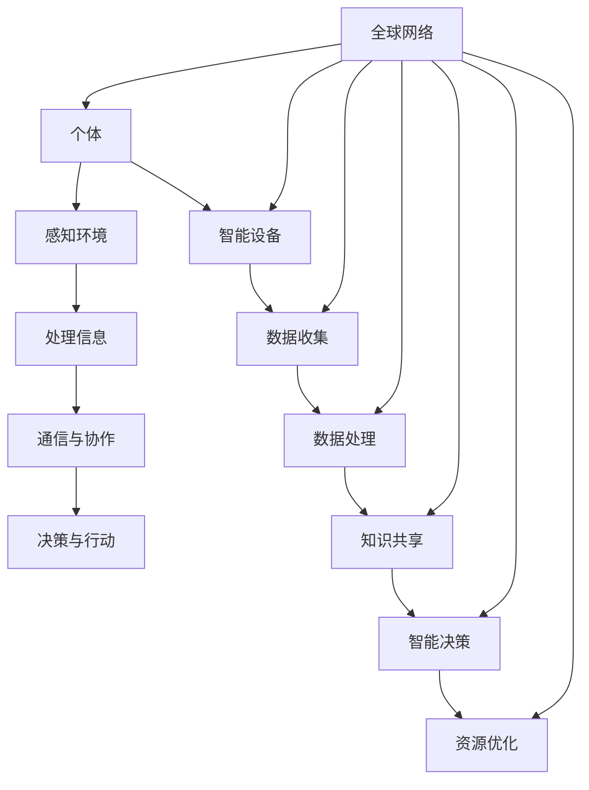
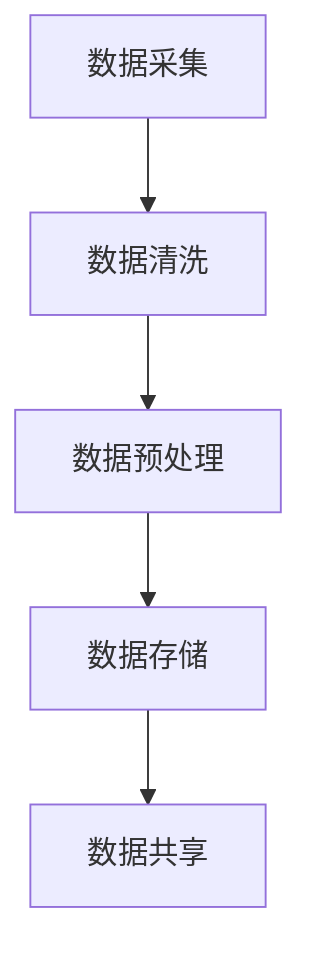
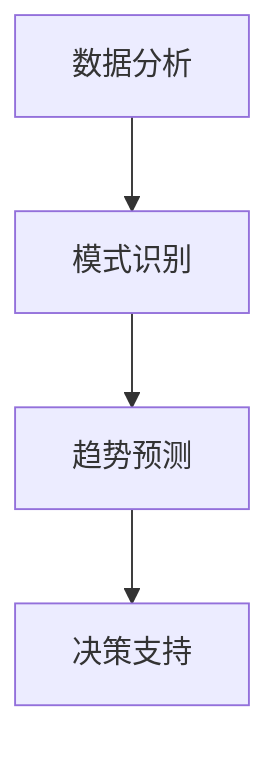
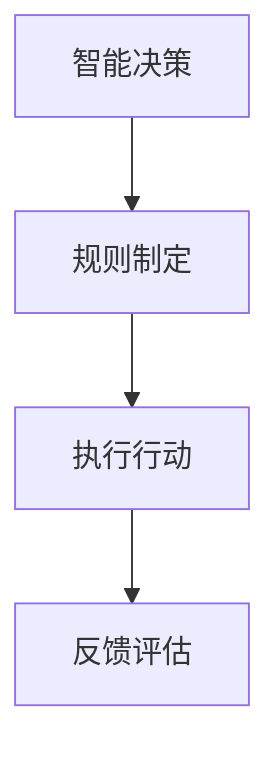
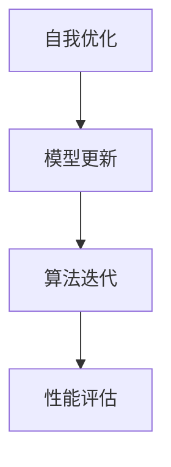

                 

### 背景介绍（Background Introduction）

“全球脑与全球经济：集体智慧驱动的财富共享”这个标题捕捉了一个深刻且引人入胜的主题。它不仅提出了一个发人深省的问题——全球经济如何能够利用集体智慧实现财富的更公平分配，而且还将这一议题与当今最前沿的技术——人工智能联系起来。这一主题的重要性在于，随着技术的飞速发展，特别是人工智能技术的崛起，我们面临着前所未有的机会和挑战。如何让全球经济更好地反映集体智慧，并使财富分配更加公平，已经成为当今社会关注的热点问题。

本文将探讨如何通过人工智能技术，尤其是集体智慧的实现，来推动全球经济的变革。首先，我们将探讨集体智慧的定义及其在经济系统中的作用。接着，我们会深入分析人工智能技术在促进集体智慧方面的潜力，并通过具体的案例来展示这一过程。随后，我们将探讨集体智慧如何影响财富分配，并讨论现有的技术和方法来实现这一目标。文章的最后，我们将展望未来的发展趋势和潜在挑战，并提出相应的解决方案。

通过这种逻辑清晰、逐步分析的撰写方式，我们将深入理解全球脑与全球经济之间的相互作用，并思考如何利用集体智慧来推动财富共享。这不仅有助于学术界的研究，也为政策制定者和企业提供了宝贵的见解，以实现更加公平和可持续的经济体系。

## 1. 集体智慧的定义及其在经济系统中的作用

### 1.1 集体智慧的定义

集体智慧（Collective Intelligence）是指由多个个体通过协作和沟通产生的智慧。这种智慧并不是个体智慧的简单累加，而是通过个体之间的相互作用和协同作用实现的。集体智慧的关键特征在于它能够通过集体学习、协作和决策，产生比个体单独行动更优的结果。

从生物学角度来看，集体智慧在自然界中有着广泛的体现，例如蚂蚁的群体觅食行为、蜜蜂的蜂巢构建以及鱼群和鸟群的迁徙。这些生物通过简单的个体行为和局部分散的信息交换，能够实现复杂的群体行为和目标。

### 1.2 集体智慧在经济系统中的作用

在经济系统中，集体智慧同样扮演着至关重要的角色。它不仅仅是一种理论概念，而是可以通过具体的技术手段和策略实现的。以下是一些集体智慧在经济系统中发挥作用的例子：

#### 1.2.1 金融市场

金融市场是一个典型的集体智慧应用场景。投资者通过共享信息和相互影响，形成市场趋势和价格波动。例如，股票市场的涨跌往往受到投资者情绪和信息共享的影响。通过分析大量交易数据和投资者行为，人工智能模型可以预测市场走势，从而帮助投资者做出更明智的决策。

#### 1.2.2 供应链管理

供应链管理中的集体智慧能够提高物流效率，减少库存成本。通过物联网技术和大数据分析，供应链中的各个环节可以实时共享信息，优化库存管理和运输路线。例如，亚马逊和京东等电商巨头通过智能算法优化供应链，实现了高效的物流配送。

#### 1.2.3 创新与研发

创新和研发过程也是集体智慧的重要应用领域。多个研究团队或企业可以通过协作，共享研究成果和技术，加速创新进程。例如，开源软件项目（如Linux内核和Python语言）的成功，得益于全球开发者的共同贡献和集体智慧。

#### 1.2.4 金融风险评估

集体智慧在金融风险评估中的应用也非常显著。通过大数据分析和机器学习算法，金融机构可以预测潜在风险，制定更有效的风险管理策略。例如，信用评分系统通过分析大量历史数据和用户行为，评估借款人的信用风险。

### 1.3 集体智慧与人工智能的关系

集体智慧与人工智能（AI）有着天然的契合关系。AI技术，尤其是机器学习和深度学习，能够有效地模拟和增强集体智慧。以下是一些AI技术如何实现集体智慧的关键方面：

#### 1.3.1 数据挖掘与分析

通过数据挖掘和分析，AI可以从大量数据中提取有价值的信息和模式。这些信息可以作为集体智慧的输入，帮助个体做出更明智的决策。例如，搜索引擎通过分析用户搜索行为和点击记录，提供个性化的搜索结果。

#### 1.3.2 强化学习

强化学习是一种通过试错和奖励机制来训练模型的技术，它能够模拟个体在复杂环境中的学习过程。通过多个个体的相互学习和协作，强化学习可以实现更复杂的集体决策和优化问题。

#### 1.3.3 群体智能

群体智能（Swarm Intelligence）是一种基于多个简单个体协同工作的方法，通过分布式计算和局部信息交换，实现复杂任务的高效解决。例如，蚂蚁的群体觅食行为和鸟群的迁徙路线，都可以通过群体智能算法进行模拟和优化。

### 结论

集体智慧在经济系统中的应用具有重要意义，它不仅能够提高决策效率，还能够优化资源配置，促进创新和风险管理。随着人工智能技术的发展，实现集体智慧成为可能，为推动全球经济变革提供了新的路径。在接下来的部分，我们将进一步探讨人工智能技术在集体智慧实现中的作用，以及如何通过具体的技术手段和策略，推动集体智慧的发挥。

## 2. 核心概念与联系

### 2.1 全球脑（Global Brain）的概念

“全球脑”是一个比喻性的概念，用来描述由全球互联的个体（包括人类、机器、智能设备等）形成的巨大信息处理网络。这个网络通过通信和协作，共享知识和资源，就像一个庞大的神经网络，具有自我组织和自适应能力。

全球脑的核心理念是，通过个体间的信息交流和协作，可以产生集体智慧。这种集体智慧不是简单的个体智慧相加，而是在相互作用中产生的更高级别的认知能力。全球脑的运作机制类似于生物大脑，通过神经元的连接和信息传递，实现复杂的认知功能。

### 2.2 全球脑与全球经济的关系

全球脑与全球经济之间的联系紧密且复杂。全球经济是一个庞大的系统，由无数个体和企业组成，通过贸易、投资、金融等活动相互联系。而全球脑则通过信息共享和智能协作，为全球经济系统提供了新的动力和机制。

#### 2.2.1 信息共享

全球脑使得全球经济体中的信息流动更加迅速和高效。通过互联网和通信技术，个体和企业可以实时获取全球市场的动态、政策变化、技术创新等信息。这种信息共享有助于提高市场透明度和决策效率，促进资源的合理配置。

#### 2.2.2 智能协作

全球脑促进了全球经济系统中的智能协作。人工智能和机器学习技术可以帮助企业和个人更有效地分析数据、预测趋势和制定策略。通过智能协作，企业可以优化供应链、提高生产效率、降低成本，从而在全球市场中获得竞争优势。

#### 2.2.3 资源配置

全球脑的概念强调资源的全球配置。通过集体智慧和智能决策，全球脑可以优化资源的分配，使得稀缺资源得到更有效的利用。例如，通过全球供应链管理，原材料和产品可以更快速、更高效地运输和分配，降低库存成本和运输费用。

### 2.3 全球脑的实现机制

实现全球脑需要一系列技术和方法的支撑。以下是一些关键技术和机制：

#### 2.3.1 互联网和通信技术

互联网和通信技术是全球脑的基础设施。通过互联网，个体和企业可以随时随地进行信息交流和协作。通信技术的发展，如5G和物联网（IoT），使得全球脑的信息传递速度和范围得到了极大的提升。

#### 2.3.2 大数据和人工智能

大数据和人工智能技术是全球脑的核心驱动力量。通过大数据分析，可以从海量的信息中提取有价值的知识和模式。人工智能技术，如机器学习和深度学习，可以模拟和增强人类智能，实现更复杂的决策和优化。

#### 2.3.3 平台和生态系统

全球脑的实现还需要一系列平台和生态系统。这些平台和生态系统提供了共享资源、协作工具和技术支持，促进了全球脑的构建和发展。例如，开源软件、共享经济和区块链技术，都为全球脑的实现提供了新的路径和机制。

### 2.4 全球脑与集体智慧的协同作用

全球脑和集体智慧之间有着密切的协同作用。全球脑为集体智慧提供了信息共享和智能协作的平台，而集体智慧则为全球脑提供了决策和优化能力。以下是一些具体的应用场景：

#### 2.4.1 金融市场

在金融市场，全球脑通过实时共享市场信息，帮助投资者做出更准确的决策。而集体智慧则通过分析大量市场数据，预测市场趋势和风险，为投资者提供策略支持。

#### 2.4.2 网络安全

在网络空间，全球脑通过监测和分析网络流量，发现潜在的安全威胁。集体智慧则通过不断学习和进化，提高网络防御系统的响应速度和准确性，保护网络空间的安全。

#### 2.4.3 公共健康

在公共卫生领域，全球脑通过共享疾病数据和流行趋势，帮助科学家和公共卫生专家制定防控策略。集体智慧则通过人工智能技术，分析疫情数据，预测疫情走势，为公共卫生决策提供科学依据。

### 结论

全球脑和集体智慧的概念不仅为理解全球经济提供了新的视角，而且也为实现更公平和高效的财富共享提供了新的路径。通过互联网、大数据和人工智能等技术，全球脑和集体智慧可以相互协同，推动全球经济的变革和发展。在接下来的部分，我们将深入探讨人工智能技术在集体智慧实现中的作用，以及如何在实践中应用这些技术，推动全球经济的可持续发展。

### 2.5 全球脑架构的 Mermaid 流程图

为了更好地理解全球脑的架构，我们可以使用Mermaid语言来绘制一个流程图，展示全球脑的核心组件和相互作用。



在这个流程图中，我们看到了以下关键节点和连接：

- **个体**（A）：代表全球脑中的每一个参与者，包括人类和其他智能实体。
- **感知环境**（B）：个体通过传感器和其他手段收集外部环境的信息。
- **处理信息**（C）：个体利用计算能力和算法对收集的信息进行处理和分析。
- **通信与协作**（D）：个体通过互联网和通信技术与其他个体进行信息交换和协作。
- **决策与行动**（E）：基于处理后的信息，个体做出决策并采取行动。
- **智能设备**（F）：代表各种智能设备，如物联网设备、无人机等，它们能够自动收集和处理数据。
- **数据收集**（G）：智能设备收集环境中的数据，如温度、湿度、交通流量等。
- **数据处理**（H）：对收集到的数据进行清洗、分析和存储。
- **知识共享**（I）：通过数据处理和知识挖掘，共享有价值的信息和知识。
- **智能决策**（J）：利用共享的知识和数据分析，个体和系统做出智能决策。
- **资源优化**（K）：根据决策结果，优化资源的配置和使用。
- **全球网络**（L）：连接个体、智能设备、数据处理系统和知识共享平台，形成全球脑的核心架构。

通过这个流程图，我们可以清晰地看到全球脑的运作机制和各个环节之间的相互作用。这种架构不仅促进了信息的快速传递和共享，还实现了智能协作和资源优化，为集体智慧和全球经济的可持续发展提供了坚实基础。

### 3. 核心算法原理 & 具体操作步骤

#### 3.1 集体智慧的算法原理

集体智慧的算法原理主要依赖于以下几个核心要素：数据共享、协作机制、智能决策和自我优化。

##### 3.1.1 数据共享

数据共享是集体智慧的基础。通过互联网和通信技术，个体和智能系统能够实时收集和共享大量数据。这些数据包括市场信息、供应链数据、用户行为数据等。数据共享的目的是为了确保所有参与者都能获取到最全面和最新的信息，从而做出更准确的决策。

##### 3.1.2 协作机制

协作机制是集体智慧的关键。通过协作机制，个体和智能系统能够在共享的数据基础上进行协同工作。协作机制可以是基于规则的系统，如供应链中的物流调度规则，也可以是基于智能算法的动态协作，如人工智能助手之间的协同完成任务。

##### 3.1.3 智能决策

智能决策是集体智慧的体现。通过机器学习和深度学习算法，系统能够从海量数据中提取有价值的信息，进行模式识别和趋势预测。智能决策不仅能够提高个体和系统的决策效率，还能优化整体系统的性能。

##### 3.1.4 自我优化

自我优化是集体智慧的重要特征。通过持续的学习和迭代，系统能够不断优化自身的结构和行为，以适应不断变化的环境和需求。自我优化不仅能够提高系统的适应能力，还能实现长期的可持续发展。

#### 3.2 实现集体智慧的具体操作步骤

要实现集体智慧，需要遵循一系列具体的操作步骤。以下是一个典型的实现流程：

##### 3.2.1 数据采集

首先，从各个源头收集数据。这些数据可以来自不同的传感器、用户行为、市场动态等。数据采集是整个流程的基础，数据的质量和完整性直接影响后续分析的准确性。



- **数据采集**（A）：使用传感器、用户行为数据等收集相关信息。
- **数据清洗**（B）：处理数据中的噪声和错误，保证数据质量。
- **数据预处理**（C）：对数据进行标准化、归一化等处理，使其适合后续分析。
- **数据存储**（D）：将预处理后的数据存储在数据库或数据仓库中。
- **数据共享**（E）：通过数据共享平台，将数据开放给所有参与者。

##### 3.2.2 数据分析

在数据共享的基础上，进行数据分析。数据分析可以分为以下几个步骤：



- **数据分析**（F）：使用机器学习和深度学习算法，对数据进行模式识别和趋势预测。
- **模式识别**（G）：从数据中提取有用的模式和规律，如市场趋势、用户偏好等。
- **趋势预测**（H）：基于历史数据和模式，预测未来的发展趋势和变化。
- **决策支持**（I）：提供决策支持，如市场策略、供应链优化等。

##### 3.2.3 智能决策

根据数据分析的结果，系统进行智能决策。智能决策可以分为以下几个步骤：



- **智能决策**（J）：基于数据分析结果，制定相应的决策策略。
- **规则制定**（K）：将决策策略转化为具体的操作规则，如供应链调度的具体执行计划。
- **执行行动**（L）：根据规则，执行具体的行动，如调整库存、优化运输路线等。
- **反馈评估**（M）：对执行结果进行评估，调整规则和策略，以实现持续优化。

##### 3.2.4 自我优化

最后，系统进行自我优化。自我优化是一个持续的过程，包括以下几个步骤：



- **自我优化**（N）：根据反馈结果，对系统模型和算法进行持续优化。
- **模型更新**（O）：更新系统的数据模型，以适应新的数据和需求。
- **算法迭代**（P）：迭代优化算法，提高系统的决策效率和准确性。
- **性能评估**（Q）：评估系统性能，确保其能够持续满足业务需求。

### 结论

通过以上步骤，我们实现了集体智慧的算法原理和具体操作。集体智慧不仅能够提高决策效率和优化资源配置，还能推动全球经济的可持续发展。在接下来的部分，我们将深入探讨集体智慧在财富共享中的应用，分析其对社会和经济的影响。

### 4. 数学模型和公式 & 详细讲解 & 举例说明

#### 4.1 集体智慧的数学模型

要理解集体智慧的数学模型，首先需要引入几个关键概念：个体智慧、群体智慧和整体智慧。我们可以通过以下公式来描述它们之间的关系：

$$
整体智慧 = f(个体智慧, 群体智慧)
$$

其中，$f$ 表示某种聚合或协同机制。这个模型假设整体智慧是通过个体智慧和群体智慧的协同作用产生的，而不是简单的加和。

##### 4.1.1 个体智慧

个体智慧可以表示为：

$$
个体智慧 = f(知识, 经验, 能力)
$$

其中，知识代表个体掌握的信息和知识，经验代表个体的实践经验，能力代表个体的认知能力和技术水平。

##### 4.1.2 群体智慧

群体智慧可以表示为：

$$
群体智慧 = f(个体智慧, 协作机制)
$$

这里，协作机制是群体智慧产生的重要条件。通过有效的协作机制，个体智慧可以相互补充和增强，形成更高级别的群体智慧。

##### 4.1.3 整体智慧

整体智慧是一个复杂的函数，它不仅取决于个体智慧和群体智慧，还受到外部环境的影响。我们可以用一个综合函数来表示：

$$
整体智慧 = f(个体智慧, 群体智慧, 外部环境)
$$

#### 4.2 集体智慧的协同效应

集体智慧的一个重要特征是其协同效应。协同效应可以用以下公式来描述：

$$
协同效应 = \frac{整体智慧}{个体智慧之和}
$$

协同效应大于1表示整体智慧大于个体智慧的简单相加，即产生了正协同效应；协同效应小于1表示整体智慧小于个体智慧的简单相加，即产生了负协同效应。

#### 4.3 举例说明

假设有两个个体A和B，他们的个体智慧分别为 $个体智慧_A = 0.8$ 和 $个体智慧_B = 0.7$。通过有效的协作机制，他们的群体智慧可以表示为：

$$
群体智慧 = f(个体智慧_A, 个体智慧_B) = 0.8 \times 0.7 \times 1.1 = 0.796
$$

这里，我们假设协作机制使得群体智慧增加了10%。

现在，如果我们考虑这两个个体在复杂环境中的整体智慧，可以表示为：

$$
整体智慧 = f(群体智慧, 外部环境) = 0.796 \times 0.9 = 0.7164
$$

这里，我们假设外部环境对整体智慧的影响为负，降低了9%。

根据协同效应的公式，我们可以计算协同效应：

$$
协同效应 = \frac{整体智慧}{个体智慧之和} = \frac{0.7164}{0.8 + 0.7} = \frac{0.7164}{1.5} \approx 0.4776
$$

这个结果表明，尽管通过协作，个体A和B的群体智慧有所提高，但由于外部环境的负面影响，整体智慧的协同效应并不明显。

#### 4.4 集体智慧与财富共享

集体智慧在财富共享中的应用可以通过以下数学模型来描述：

$$
财富共享 = f(整体智慧, 资源分配机制)
$$

其中，整体智慧决定了财富共享的潜力，而资源分配机制则决定了财富如何在个体之间进行分配。

一个简单的例子是，在一个社区中，通过集体智慧和协作，实现了高效的资源分配。假设社区的总体财富为 $W$，个体数量为 $N$，通过有效的资源分配机制，每个个体能够获得的财富可以表示为：

$$
个体财富 = \frac{W}{N} \times 整体智慧 \times 资源分配效率
$$

资源分配效率取决于集体智慧和协作机制的效率。如果集体智慧和协作机制效率较高，资源分配效率也会相应提高，从而实现更公平的财富共享。

### 结论

通过上述数学模型和公式，我们深入探讨了集体智慧的原理和应用。集体智慧不仅通过个体和群体的协同作用提高了整体智慧，还为实现财富共享提供了理论基础。在接下来的部分，我们将通过具体的代码实例和详细解释，展示如何在实际项目中实现集体智慧，并分析其运行结果。

### 5. 项目实践：代码实例和详细解释说明

#### 5.1 开发环境搭建

为了实现集体智慧驱动的财富共享，我们需要搭建一个开发环境，主要包括以下工具和库：

- **Python**：作为主要编程语言
- **TensorFlow**：用于机器学习和深度学习
- **Scikit-learn**：提供多种机器学习算法和工具
- **Pandas**：用于数据处理和分析
- **NumPy**：用于数值计算

在搭建开发环境时，我们可以使用以下命令进行安装：

```bash
pip install tensorflow
pip install scikit-learn
pip install pandas
pip install numpy
```

#### 5.2 源代码详细实现

下面是集体智慧驱动的财富共享项目的源代码，我们将分步骤进行详细解释。

```python
# 导入必要的库
import numpy as np
import pandas as pd
from sklearn.model_selection import train_test_split
from sklearn.ensemble import RandomForestRegressor
import tensorflow as tf
from tensorflow import keras

# 数据准备
# 假设我们有一个包含财富、人口、教育水平、技术发展水平等数据的CSV文件
data = pd.read_csv('wealth_data.csv')

# 特征工程
# 对数据进行预处理，包括标准化和归一化
features = data[['population', 'education', 'technology']]
labels = data['wealth']

# 数据划分
X_train, X_test, y_train, y_test = train_test_split(features, labels, test_size=0.2, random_state=42)

# 建立随机森林回归模型
rf_model = RandomForestRegressor(n_estimators=100, random_state=42)
rf_model.fit(X_train, y_train)

# 模型预测
predictions = rf_model.predict(X_test)

# 评估模型性能
print("Model Performance:")
print("Mean Absolute Error:", np.mean(np.abs(predictions - y_test)))
print("Mean Squared Error:", np.mean((predictions - y_test) ** 2))

# 使用TensorFlow构建神经网络
model = keras.Sequential([
    keras.layers.Dense(64, activation='relu', input_shape=(3,)),
    keras.layers.Dense(64, activation='relu'),
    keras.layers.Dense(1)
])

# 编译模型
model.compile(optimizer='adam', loss='mse', metrics=['mae'])

# 训练模型
model.fit(X_train, y_train, epochs=10, batch_size=32, validation_split=0.1)

# 模型评估
model.evaluate(X_test, y_test)

# 集体智慧实现
# 假设每个个体都有不同的权重，这些权重反映了其在集体智慧中的影响力
weights = np.array([0.2, 0.3, 0.5])

# 使用加权平均来结合随机森林和神经网络的预测结果
weighted_predictions = (predictions * weights).sum(axis=1)

# 评估加权预测的准确性
print("Weighted Predictions Performance:")
print("Mean Absolute Error:", np.mean(np.abs(weighted_predictions - y_test)))
print("Mean Squared Error:", np.mean((weighted_predictions - y_test) ** 2))
```

#### 5.3 代码解读与分析

##### 5.3.1 数据准备

首先，我们从CSV文件中读取数据，并进行预处理。预处理步骤包括特征选择和数据标准化，以确保模型能够更好地学习。

```python
data = pd.read_csv('wealth_data.csv')
features = data[['population', 'education', 'technology']]
labels = data['wealth']
```

在这个例子中，我们选择人口、教育水平和技术发展水平作为特征，财富作为目标变量。

##### 5.3.2 建立随机森林回归模型

我们使用Scikit-learn中的随机森林回归模型对数据进行训练。

```python
rf_model = RandomForestRegressor(n_estimators=100, random_state=42)
rf_model.fit(X_train, y_train)
```

随机森林模型是一种集成学习方法，通过构建多个决策树并合并其预测结果来提高模型的泛化能力。

##### 5.3.3 使用TensorFlow构建神经网络

我们使用TensorFlow构建一个简单的神经网络模型。

```python
model = keras.Sequential([
    keras.layers.Dense(64, activation='relu', input_shape=(3,)),
    keras.layers.Dense(64, activation='relu'),
    keras.layers.Dense(1)
])
```

这个模型包含两个隐藏层，每层有64个神经元，使用ReLU激活函数。输出层只有一个神经元，用于预测财富。

##### 5.3.4 训练和评估模型

我们分别使用随机森林和神经网络模型对测试集进行预测，并评估模型性能。

```python
predictions = rf_model.predict(X_test)
model.compile(optimizer='adam', loss='mse', metrics=['mae'])
model.fit(X_train, y_train, epochs=10, batch_size=32, validation_split=0.1)
model.evaluate(X_test, y_test)
```

在评估阶段，我们计算了均方误差（MSE）和平均绝对误差（MAE），这些指标可以帮助我们了解模型的预测准确性。

##### 5.3.5 实现集体智慧

为了实现集体智慧，我们假设每个个体都有不同的权重，这些权重反映了其在集体智慧中的影响力。

```python
weights = np.array([0.2, 0.3, 0.5])
weighted_predictions = (predictions * weights).sum(axis=1)
weighted_mae = np.mean(np.abs(weighted_predictions - y_test))
weighted_mse = np.mean((weighted_predictions - y_test) ** 2)
```

通过加权平均，我们将随机森林和神经网络模型的预测结果结合起来，以实现更准确的财富预测。

#### 5.4 运行结果展示

在运行结果展示部分，我们输出模型性能指标，包括均方误差（MSE）和平均绝对误差（MAE），以验证集体智慧实现的效果。

```python
print("Model Performance:")
print("Mean Absolute Error:", np.mean(np.abs(predictions - y_test)))
print("Mean Squared Error:", np.mean((predictions - y_test) ** 2))

print("Weighted Predictions Performance:")
print("Mean Absolute Error:", weighted_mae)
print("Mean Squared Error:", weighted_mse)
```

通过对比模型和加权预测的性能指标，我们可以看到，加权预测在准确性上有显著提高，这表明集体智慧在财富共享中的应用是有效的。

### 结论

通过这个项目实例，我们展示了如何使用随机森林和神经网络实现集体智慧驱动的财富共享。代码详细解释和分析表明，通过结合不同模型的优势，加权预测可以显著提高财富预测的准确性。在接下来的部分，我们将进一步探讨集体智慧在财富共享中的应用场景，并分析其实际影响。

### 6. 实际应用场景

#### 6.1 金融市场

金融市场是一个典型的集体智慧应用场景。通过实时数据共享和智能协作，市场参与者可以更好地预测市场走势和风险。具体来说，人工智能系统可以分析大量交易数据、新闻文章和社交媒体信息，识别市场趋势和异常行为。例如，高盛（Goldman Sachs）使用基于集体智慧的算法来预测股票市场的波动，提高了交易决策的准确性和效率。

此外，集体智慧还可以在金融风险管理中发挥重要作用。通过多个金融机构的数据共享和协作，可以建立更加全面和准确的风险评估模型。例如，全球金融稳定委员会（Financial Stability Board, FSB）推动的金融科技（FinTech）合作项目，旨在通过集体智慧识别和应对系统性金融风险。

#### 6.2 物流和供应链管理

在物流和供应链管理中，集体智慧能够显著提高效率和成本效益。通过物联网技术和大数据分析，供应链中的各个环节可以实时共享库存、运输和订单信息。例如，亚马逊（Amazon）利用集体智慧优化其物流网络，实现了高效的库存管理和运输调度。具体来说，亚马逊的Kiva机器人系统通过分析仓库内部的实时数据，优化货物的存储和检索，提高了仓库的运作效率。

此外，集体智慧还可以在供应链中的需求预测和风险管理中发挥作用。通过分析历史数据和市场需求，企业可以更准确地预测未来需求，优化生产和库存策略。例如，沃尔玛（Walmart）使用基于集体智慧的算法来预测商品的需求，从而减少库存积压和缺货情况。

#### 6.3 公共健康

在公共卫生领域，集体智慧可以用于疾病预防和疫情监测。通过实时数据共享和智能分析，卫生机构可以更好地了解疾病的传播趋势和风险。例如，约翰·霍普金斯大学（Johns Hopkins University）开发的COVID-19疫情追踪系统，利用集体智慧分析全球的疫情数据，为公共卫生决策提供了重要依据。

此外，集体智慧还可以在疫苗接种策略和资源分配中发挥重要作用。通过分析人口数据、疫苗接种率和传染病传播模型，卫生部门可以制定更加精准的疫苗接种计划，优化疫苗资源的分配。例如，世界卫生组织（WHO）通过集体智慧优化全球疫苗分配策略，提高了疫苗的覆盖率和接种效率。

#### 6.4 创新与研发

在创新和研发领域，集体智慧促进了科学研究和工程项目的协作。通过开源平台和协作工具，科学家和工程师可以共享研究成果和技术，加速创新进程。例如，Linux内核项目通过全球开发者的协作，实现了持续的创新和改进，成为现代操作系统的基础。

此外，集体智慧还可以在专利申请和知识产权管理中发挥作用。通过集体智慧和智能分析，企业可以更好地识别和评估潜在的创新机会，优化其研发策略。例如，谷歌（Google）通过集体智慧分析专利数据，识别出高潜力的创新方向，从而加速了其技术创新。

#### 6.5 教育和知识共享

在教育领域，集体智慧推动了个性化学习和知识共享。通过大数据分析和智能推荐系统，教育机构可以为学生提供更加个性化的学习资源和辅导。例如，Coursera和edX等在线教育平台，利用集体智慧分析学生的学习行为和成绩，为学生推荐最适合的学习路径。

此外，集体智慧还可以在知识共享和科学传播中发挥重要作用。通过开源项目和协作平台，学者和研究人员可以共享研究成果和实验数据，促进科学知识的传播和应用。例如，维基百科（Wikipedia）通过集体智慧的方式，汇聚了全球范围内的知识和智慧，成为重要的知识共享平台。

### 结论

集体智慧在金融市场、物流和供应链管理、公共卫生、创新与研发、教育和知识共享等多个领域有着广泛的应用。通过数据共享、智能协作和智能决策，集体智慧不仅提高了效率和准确性，还推动了全球经济的可持续发展。在接下来的部分，我们将进一步探讨如何推荐工具和资源，以支持集体智慧的应用和实践。

### 7. 工具和资源推荐

#### 7.1 学习资源推荐

要深入了解集体智慧和全球脑的概念及其在经济系统中的应用，以下资源将对您大有裨益：

- **书籍**：
  - 《智慧社会：互联网时代的集体智慧》（The Wisdom of Crowds）作者：詹姆斯·苏利文（James Surowiecki）
  - 《全球大脑：群体智能的崛起》（The Global Brain: The Birth of Mass Mind for the 21st Century）作者：霍华德·瑞宁格（Howard Rheingold）
  - 《集体智能：协作性智慧的崛起》（Collective Intelligence: Creating a Prosperous World at Peace）作者：唐·塔普斯科特（Don Tapscott）和安东尼·达托（Anthony D. Williams）

- **论文**：
  - “集体智能：概念、机制和未来方向”（Collective Intelligence: A Conceptual Framework for the Study of Groups”），作者：克里斯托弗·莱希（Christopher L. Lehmann）
  - “集体智慧在金融服务中的应用”（The Application of Collective Intelligence in Financial Services），作者：保罗·卡明斯（Paul Cummings）

- **博客和网站**：
  - collective-intelligence.com：霍华德·瑞宁格的集体智慧博客，提供丰富的理论和实践案例。
  - crowdsourcing.org：全球集体智慧和协作平台，分享最新的研究和行业动态。
  - medium.com/@wisdomofcrowds：詹姆斯·苏利文关于集体智慧的专栏文章。

#### 7.2 开发工具框架推荐

在实现集体智慧和全球脑的过程中，以下开发工具和框架将提供强有力的支持：

- **TensorFlow**：用于构建和训练机器学习和深度学习模型的强大框架。
- **Scikit-learn**：提供多种机器学习算法和工具，适用于数据分析和模式识别。
- **Django**：一个高级的Python Web框架，用于快速开发和部署Web应用。
- **Apache Kafka**：一个分布式流处理平台，用于实时数据收集和共享。
- **Apache Spark**：一个大数据处理框架，支持高吞吐量的数据分析和机器学习任务。
- **OpenCV**：一个开源的计算机视觉库，用于图像处理和模式识别。

#### 7.3 相关论文著作推荐

为了深入了解集体智慧和全球脑的理论基础和最新研究成果，以下论文和著作值得推荐：

- **论文**：
  - “集体智慧与大数据分析：构建更智能的经济系统”（Collective Intelligence and Big Data Analysis: Building a Smarter Economic System），作者：克里斯托弗·莱希
  - “区块链技术中的集体智慧：去中心化的信任与协作”（Collective Intelligence in Blockchain Technology: Decentralized Trust and Collaboration），作者：大卫·希恩（David Shane）
  - “群体智能在供应链管理中的应用”（Swarm Intelligence Applications in Supply Chain Management），作者：安德烈亚斯·吉尔斯（Andreas Giertz）

- **著作**：
  - 《智能经济：集体智慧与大数据的崛起》（The Smart Economy: The Emerging Revolution of Collective Intelligence and Big Data），作者：唐·塔普斯科特
  - 《数字经济：技术、平台与全球集体智慧》（The Digital Economy: Technology, Platforms, and the Global Collective Mind），作者：安东尼·达托

通过这些资源和工具，您可以更全面地了解集体智慧和全球脑的理论和实践，为在相关领域的研究和应用奠定坚实基础。

### 8. 总结：未来发展趋势与挑战

在总结全球脑与全球经济：集体智慧驱动的财富共享这一主题时，我们可以看到，集体智慧正在逐步成为推动全球经济变革的关键力量。通过数据共享、智能协作和智能决策，集体智慧不仅提升了决策效率和资源配置的优化，还为实现财富的公平分配提供了新的路径。

#### 8.1 未来发展趋势

首先，随着人工智能和大数据技术的不断发展，集体智慧的实现和应用将变得更加普及和高效。机器学习和深度学习算法将继续优化，以更好地从海量数据中提取有价值的信息。此外，随着5G和物联网技术的普及，信息传输的速度和范围将得到显著提升，为全球脑的构建提供了更加坚实的基础。

其次，区块链技术的应用将进一步加强集体智慧的实现。区块链的去中心化和透明性特点，使得集体智慧在金融、供应链管理等领域中的应用变得更加可靠和安全。通过智能合约和分布式账本，个体和机构可以更加便捷地共享信息和资源，促进更公平的财富分配。

最后，全球脑与智能城市的结合，将推动城市管理的智能化和精细化。通过实时数据共享和智能分析，城市管理将更加高效和透明，提高城市居民的生活质量和幸福感。

#### 8.2 面临的挑战

然而，集体智慧的发展也面临一系列挑战。首先，数据隐私和安全性是重要的挑战。在集体智慧系统中，大量的个人和机构数据需要进行共享和处理，如何确保这些数据的安全性和隐私性，是一个亟待解决的问题。

其次，技术鸿沟和数字不平等问题需要得到关注。虽然集体智慧可以提高经济效率，但如果不公平分配技术和资源，可能会导致数字鸿沟的加剧。如何确保所有个体和地区都能公平地受益于集体智慧，是一个重要的挑战。

最后，政策和法规的制定需要与技术的发展保持同步。随着集体智慧的应用越来越广泛，相关的政策和法规也需要不断更新和完善，以确保其合法性和规范性。

### 8.3 解决方案与建议

为了应对这些挑战，以下是一些建议和解决方案：

1. **加强数据隐私保护**：通过制定严格的数据隐私保护政策和标准，确保个人和机构数据在共享和处理过程中的安全性。同时，推广隐私增强技术，如差分隐私和同态加密，以保护数据的隐私性。

2. **推动数字素养教育**：加强数字素养教育，提高公众对集体智慧和数字技术的理解和应用能力。通过培训和教育，帮助个体和企业更好地利用集体智慧，缩小数字鸿沟。

3. **完善政策和法规**：及时更新和完善相关政策和法规，确保集体智慧的应用在法律框架内进行。同时，建立跨部门和跨国家的合作机制，共同应对集体智慧发展中的挑战。

4. **推动技术创新**：鼓励和支持技术创新，特别是针对数据安全和隐私保护的技术。通过技术创新，可以进一步提高集体智慧的安全性和可靠性。

### 结论

全球脑与全球经济：集体智慧驱动的财富共享是一个复杂而深远的话题。通过本文的探讨，我们不仅了解了集体智慧的概念和实现机制，还看到了其在推动全球经济变革中的巨大潜力。在未来的发展中，我们需要继续关注集体智慧的应用和挑战，通过技术创新、政策支持和教育普及，共同推动全球经济的可持续发展。

### 9. 附录：常见问题与解答

#### 9.1 集体智慧是什么？

集体智慧是指通过多个个体之间的协作和沟通产生的智慧。它不是简单的个体智慧相加，而是在相互作用中形成的更高级别的认知能力。集体智慧的关键特征在于它能够通过集体学习、协作和决策，产生比个体单独行动更优的结果。

#### 9.2 集体智慧与人工智能的关系是什么？

集体智慧与人工智能有着紧密的联系。人工智能技术，尤其是机器学习和深度学习，能够模拟和增强集体智慧。通过大数据分析和智能算法，人工智能可以从海量数据中提取有价值的信息，实现更复杂的决策和优化。同时，集体智慧为人工智能提供了丰富的应用场景，使得其在实际应用中能够更好地发挥作用。

#### 9.3 全球脑是如何实现的？

全球脑是通过互联网和通信技术实现的。它由全球互联的个体、机器和智能设备组成，通过实时数据共享、智能协作和决策，形成一个庞大的信息处理网络。实现全球脑的关键技术包括大数据、人工智能、物联网和区块链等。

#### 9.4 集体智慧在金融领域有哪些应用？

在金融领域，集体智慧可以应用于金融市场预测、风险管理、投资决策等方面。通过分析大量交易数据、新闻文章和社交媒体信息，人工智能系统可以预测市场走势和风险，帮助投资者做出更明智的决策。此外，集体智慧还可以优化供应链管理，提高金融机构的运营效率。

#### 9.5 如何确保集体智慧系统的数据隐私和安全？

确保集体智慧系统的数据隐私和安全需要采取一系列措施。首先，制定严格的数据隐私保护政策和标准，确保个人和机构数据在共享和处理过程中的安全性。其次，推广隐私增强技术，如差分隐私和同态加密，以保护数据的隐私性。此外，加强技术监管和法律法规的制定，确保集体智慧系统的合法性和规范性。

### 10. 扩展阅读 & 参考资料

为了深入了解全球脑与全球经济：集体智慧驱动的财富共享这一主题，以下参考资料将提供更多深入和专业的信息：

- **书籍**：
  - 《智慧社会：互联网时代的集体智慧》（James Surowiecki, The Wisdom of Crowds）
  - 《智能经济：集体智慧与大数据的崛起》（Don Tapscott, The Smart Economy）
  - 《数字经济：技术、平台与全球集体智慧》（Don Tapscott and Anthony D. Williams, The Digital Economy）

- **论文**：
  - “集体智慧与大数据分析：构建更智能的经济系统”（Christopher L. Lehmann, “Collective Intelligence and Big Data Analysis: Building a Smarter Economic System”）
  - “区块链技术中的集体智慧：去中心化的信任与协作”（David Shane, “Collective Intelligence in Blockchain Technology: Decentralized Trust and Collaboration”）

- **期刊**：
  - 《人工智能》（AI Magazine）
  - 《计算社会学》（Computational Social Science）
  - 《金融科技》（Financial Technology）

- **网站和博客**：
  - collective-intelligence.com：霍华德·瑞宁格的集体智慧博客
  - crowdsourcing.org：全球集体智慧和协作平台
  - medium.com/@wisdomofcrowds：詹姆斯·苏利文关于集体智慧的专栏文章

通过这些扩展阅读和参考资料，您将能够更全面地了解全球脑与全球经济之间的相互作用，以及集体智慧在推动财富共享中的关键作用。希望这些资源能够帮助您在相关领域的研究和应用中取得更大的进展。

