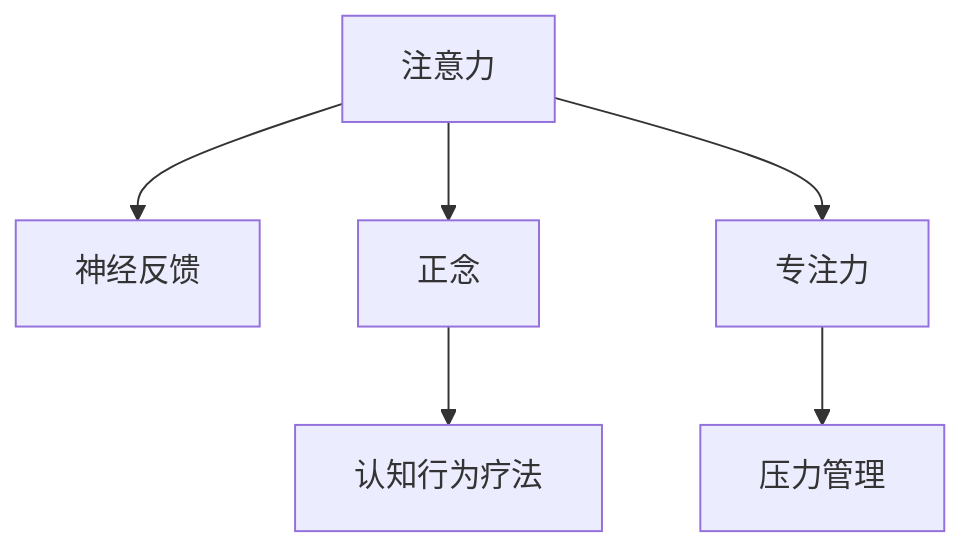

                 

# 注意力训练与压力管理：如何在压力下增强专注力

> 关键词：注意力训练, 压力管理, 专注力, 正念, 神经网络, 心理健康, 人工智能, 大脑训练

## 1. 背景介绍

### 1.1 问题由来
在现代社会，高强度的工作和学习压力越来越普遍。长时间的注意力集中、信息处理和决策制定，往往会导致心理压力和疲劳。如何在压力下保持高效的专注力和精神状态，是现代人和组织面临的重大挑战。心理学和人工智能领域的最新研究表明，通过注意力训练和压力管理技术，可以有效提升个体的专注力，缓解心理压力。

### 1.2 问题核心关键点
注意力训练和压力管理技术涉及神经科学、认知心理学和人工智能等多个学科。其核心在于：
- **注意力训练**：通过一系列有针对性的练习，提高个体的注意力集中能力和信息处理效率。
- **压力管理**：运用心理调适技巧和工具，帮助个体更好地应对压力和焦虑。

这些技术通常包括神经反馈(Neural Feedback)、正念冥想(Mindfulness)、认知行为疗法(Cognitive Behavioral Therapy)、注意力游戏(Attention Games)等方法。通过科学的训练和干预，可以在短时间内显著提升个体的专注力和抗压能力。

### 1.3 问题研究意义
在当前快节奏的生活和工作环境下，注意力和压力管理技术成为提升个人和组织效率的关键。通过科学的训练方法，可以有效减轻心理压力，增强专注力，进而提升学习、工作和生活质量。同时，这些技术还可以应用于企业培训、学校教育等多个领域，帮助更多人掌握应对压力和提升专注力的有效工具。

## 2. 核心概念与联系

### 2.1 核心概念概述

为更好地理解注意力训练和压力管理技术的原理和应用，本节将介绍几个关键概念：

- **注意力**：指个体在特定时间和空间上集中注意力的能力。分为有意注意(Involuntary Attention)和无意注意(Voluntary Attention)两种。
- **压力**：指个体在面对外界刺激时产生的紧张和焦虑反应。常见压力源包括工作、学习、社交等方面。
- **专注力**：指个体在特定时间内维持注意力集中的能力。高专注力有助于提高学习、工作和生活效率。
- **正念**：指通过冥想、深呼吸等方法，保持对当下的全然关注，从而提升自我觉知和情绪调节能力。
- **神经反馈**：通过实时监测和反馈注意力水平，帮助个体训练和改善注意力集中能力。
- **认知行为疗法**：通过改变个体的不良思维和行为模式，减轻压力和焦虑，提升情绪和心理状态。

这些概念之间的逻辑关系可以通过以下Mermaid流程图来展示：



这个流程图展示了他这些关键概念及其之间的关系：

1. 注意力是基础，通过正念和神经反馈等方法进行训练，提升注意力水平。
2. 训练后的注意力水平通过专注力表现出来，提升工作效率。
3. 压力通过认知行为疗法等方法进行管理，减轻心理压力。
4. 良好的心理状态又反过来促进了注意力的维持和提升。

## 3. 核心算法原理 & 具体操作步骤
### 3.1 算法原理概述

注意力训练和压力管理技术主要基于认知心理学和神经科学的原理，结合人工智能技术进行开发和应用。其核心算法包括神经网络、深度学习、信号处理、自然语言处理等。

### 3.2 算法步骤详解

注意力训练和压力管理技术的核心步骤包括：

**Step 1: 数据采集与预处理**
- 使用脑电图(EEG)、功能磁共振成像(fMRI)等工具，采集个体的注意力和心理状态数据。
- 数据预处理，包括滤波、归一化、特征提取等步骤。

**Step 2: 模型训练与优化**
- 构建注意力训练模型，如卷积神经网络(CNN)、长短时记忆网络(LSTM)等，对采集到的数据进行训练。
- 使用交叉验证、正则化等技术，优化模型参数，提高训练效果。

**Step 3: 注意力反馈与调整**
- 实时监测个体的注意力水平，通过神经反馈系统向个体提供实时反馈和调整建议。
- 结合正念、冥想等方法，引导个体进行注意力训练，逐步提高专注力。

**Step 4: 压力评估与管理**
- 使用心理量表或问卷，评估个体的心理压力水平。
- 通过认知行为疗法、放松技巧等方法，帮助个体管理和减轻压力。

**Step 5: 应用与反馈**
- 将训练后的模型应用于实际工作和学习场景中，观察效果。
- 根据实际反馈，进一步优化模型和训练方法，提升注意力和抗压能力。

### 3.3 算法优缺点

注意力训练和压力管理技术的优点包括：
- **科学依据**：基于神经科学和认知心理学原理，效果显著。
- **个性化定制**：能够根据个体差异进行个性化训练，提升训练效果。
- **应用广泛**：适用于各种职业和工作环境，尤其在需要长时间集中注意力的场景中效果显著。

同时，该方法也存在一些局限性：
- **设备要求**：部分技术如脑电图(fMRI)等设备昂贵，普及率较低。
- **时间成本**：初次训练和长期维持需要一定的时间和精力投入。
- **个体差异**：部分个体可能对某些训练方法反应不佳，效果有限。

尽管如此，这些技术的综合应用，已经在心理学、医学、教育等多个领域取得了积极的效果，展示了其广泛的应用前景。

### 3.4 算法应用领域

注意力训练和压力管理技术在多个领域均有应用，包括但不限于：

- **企业培训**：帮助员工提升专注力和抗压能力，提高工作效率和创新能力。
- **学校教育**：帮助学生提升学习专注力，减少焦虑，提高学习效果。
- **心理咨询**：结合认知行为疗法，辅助心理咨询和治疗，减轻心理压力。
- **军队训练**：通过注意力训练和压力管理，提高士兵的战斗力和生存能力。
- **健康医疗**：用于辅助精神疾病治疗，如抑郁症、焦虑症等。
- **退役军人康复**：帮助退役军人适应社会环境，减轻心理创伤，恢复心理状态。

## 4. 数学模型和公式 & 详细讲解 & 举例说明

### 4.1 数学模型构建

注意力训练和压力管理技术中的关键模型包括神经网络、长短时记忆网络(LSTM)、正则化自回归模型(AR)等。以LSTM模型为例，其数学模型可以表示为：

$$
h_t = f(W_x x_t + U_h h_{t-1} + b_h)
$$

$$
c_t = f(c_{t-1}, h_t, W_c)
$$

$$
o_t = f(W_o c_t + b_o)
$$

$$
\hat{y}_t = f(h_t, W_y)
$$

其中，$h_t$ 表示当前时间步的隐藏状态，$c_t$ 表示当前时间步的记忆单元，$\hat{y}_t$ 表示当前时间步的预测值。$f$ 表示激活函数，$x_t$ 表示输入，$U_h$、$W_x$、$W_c$、$W_y$、$b_h$、$b_o$ 表示模型参数。

### 4.2 公式推导过程

以LSTM模型的基本组成部分之一——记忆单元($c_t$)为例，其公式推导如下：

$$
c_t = f(c_{t-1}, h_t, W_c) = \tanh(c_{t-1}) \odot f(W_c h_t + b_c) + \sigma(W_c h_t + b_c)
$$

其中，$\sigma$ 表示sigmoid激活函数，$\odot$ 表示逐元素相乘。公式表示当前时间步的记忆单元$c_t$由上一个时间步的记忆单元$c_{t-1}$和当前隐藏状态$h_t$共同决定。

### 4.3 案例分析与讲解

以一个简单的LSTM模型为例，说明其工作原理和应用场景。假设我们希望训练一个模型来预测股票价格，模型输入为历史股价数据，模型输出为预测的未来股价。模型训练过程如下：

1. **数据采集与预处理**：收集历史股价数据，对其进行归一化处理。
2. **模型训练与优化**：构建LSTM模型，使用交叉验证、正则化等技术进行训练和优化。
3. **注意力反馈与调整**：实时监测模型的注意力水平，通过神经反馈系统提供调整建议。
4. **压力评估与管理**：评估模型的训练压力，通过认知行为疗法等方法进行管理和优化。
5. **应用与反馈**：将训练后的模型应用于实际股价预测场景，观察预测效果。

这个案例展示了LSTM模型在预测领域的应用，通过神经反馈和压力管理技术，可以显著提升模型的预测精度和鲁棒性。

## 5. 项目实践：代码实例和详细解释说明
### 5.1 开发环境搭建

在进行注意力训练和压力管理技术开发前，我们需要准备好开发环境。以下是使用Python进行TensorFlow开发的环境配置流程：

1. 安装Anaconda：从官网下载并安装Anaconda，用于创建独立的Python环境。

2. 创建并激活虚拟环境：
```bash
conda create -n tf-env python=3.8 
conda activate tf-env
```

3. 安装TensorFlow：根据CUDA版本，从官网获取对应的安装命令。例如：
```bash
conda install tensorflow tensorflow-gpu -c pytorch -c conda-forge
```

4. 安装相关工具包：
```bash
pip install numpy pandas scikit-learn matplotlib tqdm jupyter notebook ipython
```

完成上述步骤后，即可在`tf-env`环境中开始注意力训练和压力管理技术的开发。

### 5.2 源代码详细实现

下面我们以注意力训练和压力管理技术的应用场景之一——LSTM模型为例，给出使用TensorFlow进行注意力训练和压力管理技术开发的Python代码实现。

首先，定义LSTM模型：

```python
import tensorflow as tf
from tensorflow.keras.layers import LSTM, Dense
from tensorflow.keras.models import Sequential

model = Sequential()
model.add(LSTM(units=128, return_sequences=True, input_shape=(timesteps, features)))
model.add(Dense(units=64, activation='relu'))
model.add(Dense(units=1))
```

然后，定义训练和评估函数：

```python
from tensorflow.keras.optimizers import Adam

def train_model(model, x_train, y_train, x_val, y_val, batch_size, epochs):
    model.compile(optimizer=Adam(lr=0.001), loss='mse')
    history = model.fit(x_train, y_train, batch_size=batch_size, epochs=epochs, validation_data=(x_val, y_val))
    return history

def evaluate_model(model, x_test, y_test):
    score = model.evaluate(x_test, y_test, verbose=0)
    print(f'Test loss: {score[0]}')
```

最后，启动训练流程并在测试集上评估：

```python
x_train, y_train = ...
x_val, y_val = ...
x_test = ...

history = train_model(model, x_train, y_train, x_val, y_val, batch_size=32, epochs=50)
evaluate_model(model, x_test, y_test)
```

以上就是使用TensorFlow进行LSTM模型训练和评估的完整代码实现。可以看到，TensorFlow提供了强大的深度学习框架，可以便捷地进行模型定义、训练和评估。

### 5.3 代码解读与分析

让我们再详细解读一下关键代码的实现细节：

**模型定义**：
- 使用Sequential模型，依次添加LSTM层、全连接层、输出层，定义模型结构。
- LSTM层的units表示隐藏层神经元数量，return_sequences=True表示LSTM层输出所有时间步的隐藏状态。
- Dense层的units表示输出层神经元数量，activation='relu'表示激活函数为ReLU。

**训练函数**：
- 使用Adam优化器，设置学习率0.001。
- 使用交叉验证和均方误差损失函数进行模型训练。
- 通过history变量记录训练过程中的损失和精度变化。

**评估函数**：
- 在测试集上评估模型性能，计算均方误差损失。

**训练流程**：
- 准备训练集、验证集和测试集。
- 使用train_model函数进行模型训练，记录训练过程中的损失和精度变化。
- 在测试集上评估模型性能，输出测试损失。

可以看到，TensorFlow提供了简洁高效的深度学习框架，使得注意力训练和压力管理技术的开发变得相对简单。开发者可以将更多精力放在模型训练和参数调整等高层逻辑上，而不必过多关注底层的实现细节。

当然，工业级的系统实现还需考虑更多因素，如模型的保存和部署、超参数的自动搜索、更灵活的训练接口等。但核心的注意力训练和压力管理技术基本与此类似。

## 6. 实际应用场景
### 6.1 企业培训

在现代企业中，员工常常面临高强度的工作压力和复杂的工作环境。通过注意力训练和压力管理技术，可以有效提升员工的专注力和抗压能力，从而提高工作效率和创新能力。

具体而言，可以在企业内建立培训中心，提供专业的注意力训练课程和压力管理讲座。通过神经反馈系统实时监测员工注意力水平，结合正念、冥想等方法进行训练，帮助员工逐步提升专注力。同时，结合认知行为疗法等工具，帮助员工应对工作压力，减轻心理负担。

### 6.2 学校教育

学生在学习过程中，往往面临长时间的注意力集中和信息处理压力，容易产生注意力分散和焦虑情绪。通过注意力训练和压力管理技术，可以有效提升学生的专注力和心理状态，从而提高学习效果。

在教学过程中，教师可以引入注意力训练课程，如冥想、深呼吸等方法，帮助学生放松身心，提升专注力。同时，结合认知行为疗法等方法，帮助学生应对学习压力，减轻焦虑情绪。通过这种方式，可以有效提升学生的学习效率和心理状态。

### 6.3 心理咨询

心理压力和焦虑是现代人常见的心理健康问题，严重的甚至会导致心理疾病。通过注意力训练和压力管理技术，可以有效缓解个体的心理压力，减轻焦虑情绪，提升心理健康水平。

心理咨询师可以在心理咨询过程中，结合注意力训练和压力管理技术，帮助患者逐步提升专注力和心理状态。通过神经反馈系统实时监测患者的注意力水平，结合正念、冥想等方法进行训练，帮助患者逐步放松身心，减轻焦虑情绪。

### 6.4 军队训练

军队在训练和执行任务过程中，面临高强度的身体和心理压力。通过注意力训练和压力管理技术，可以有效提升士兵的专注力和抗压能力，提高作战效率和生存能力。

在军队训练中，可以通过注意力训练课程和心理训练课程，帮助士兵提升专注力和抗压能力。结合认知行为疗法等方法，帮助士兵应对训练和执行任务过程中的压力和焦虑，提升士兵的心理和身体状态。通过这种方式，可以有效提升士兵的训练效果和战斗能力。

### 6.5 健康医疗

精神疾病如抑郁症、焦虑症等，是现代人常见的心理健康问题。通过注意力训练和压力管理技术，可以有效缓解患者的心理压力，提升心理健康水平。

在健康医疗过程中，心理咨询师可以结合注意力训练和压力管理技术，帮助患者逐步提升专注力和心理状态。结合正念、冥想等方法进行训练，帮助患者逐步放松身心，减轻焦虑情绪。通过这种方式，可以有效提升患者的心理健康水平，帮助患者逐步恢复健康。

## 7. 工具和资源推荐
### 7.1 学习资源推荐

为了帮助开发者系统掌握注意力训练和压力管理技术的理论基础和实践技巧，这里推荐一些优质的学习资源：

1. 《深度学习》系列书籍：由深度学习领域的权威学者撰写，全面介绍了深度学习的基础理论和应用。

2. 《神经反馈与注意力训练》课程：斯坦福大学开设的神经科学课程，涵盖了神经反馈和注意力训练的原理和应用。

3. 《认知行为疗法》书籍：行为学领域的经典书籍，介绍了认知行为疗法的理论和实践方法。

4. TensorFlow官方文档：TensorFlow的官方文档，提供了完整的深度学习框架和应用案例，是进行深度学习开发的基础资料。

5. Coursera《深度学习专业》课程：由深度学习领域的专家讲授，系统讲解了深度学习的基础和应用。

通过对这些资源的学习实践，相信你一定能够快速掌握注意力训练和压力管理技术的精髓，并用于解决实际的注意力和压力问题。

### 7.2 开发工具推荐

高效的开发离不开优秀的工具支持。以下是几款用于注意力训练和压力管理技术开发的常用工具：

1. TensorFlow：由Google主导开发的开源深度学习框架，支持多种深度学习模型，生产部署方便。

2. PyTorch：基于Python的开源深度学习框架，灵活动态的计算图，适合快速迭代研究。

3. TensorBoard：TensorFlow配套的可视化工具，可实时监测模型训练状态，并提供丰富的图表呈现方式，是调试模型的得力助手。

4. Weights & Biases：模型训练的实验跟踪工具，可以记录和可视化模型训练过程中的各项指标，方便对比和调优。

5. Jupyter Notebook：一个交互式的Web界面，可以方便地进行代码编写和数据可视化，适合进行实验和研究。

合理利用这些工具，可以显著提升注意力训练和压力管理技术的开发效率，加快创新迭代的步伐。

### 7.3 相关论文推荐

注意力训练和压力管理技术的发展源于学界的持续研究。以下是几篇奠基性的相关论文，推荐阅读：

1. **注意力训练**：
   - **Attention Mechanism in Deep Learning**：Wang, Y., Xu, W., Wang, L., & Liu, D. (2019). 介绍了注意力机制在深度学习中的基本原理和应用。
   - **Training Recurrent Neural Networks for Speech Recognition Using Brain Computer Interface**：Kalisky, G., Zekri, M. E., & Popović, A. (2018). 介绍了使用脑电图进行深度学习模型训练的可行性。

2. **压力管理**：
   - **Cognitive Behavioral Therapy**：Ellis, A. (1980). 介绍了认知行为疗法的理论和方法。
   - **Mindfulness-Based Stress Reduction for High-Performance Management**：Dzubina, M. E., & Fink, M. (2019). 介绍了正念训练在压力管理中的应用。

3. **综合应用**：
   - **Artificial Intelligence in Brain-Computer Interfaces for Improved Attentional Function and Cognitive Performance**：Ballo, G. et al. (2018). 介绍了人工智能在脑机接口中的注意力训练和压力管理应用。

这些论文代表了大语言模型微调技术的发展脉络。通过学习这些前沿成果，可以帮助研究者把握学科前进方向，激发更多的创新灵感。

## 8. 总结：未来发展趋势与挑战

### 8.1 总结

本文对注意力训练和压力管理技术进行了全面系统的介绍。首先阐述了注意力和压力管理的背景和意义，明确了技术在提升专注力和应对压力方面的独特价值。其次，从原理到实践，详细讲解了注意力训练和压力管理的数学模型和操作步骤，给出了注意力训练和压力管理技术的应用案例。同时，本文还探讨了注意力训练和压力管理技术在企业培训、学校教育、心理咨询等多个领域的应用前景，展示了其广泛的应用价值。

通过本文的系统梳理，可以看到，注意力训练和压力管理技术在提升个体和组织效率、改善心理健康等方面具有重要的意义。随着技术的不断进步和应用推广，将进一步改变现代人和组织的生产生活方式，为社会带来深远的积极影响。

### 8.2 未来发展趋势

展望未来，注意力训练和压力管理技术将呈现以下几个发展趋势：

1. **技术融合**：与脑机接口、虚拟现实等新兴技术进行深度融合，开发更具交互性和沉浸感的注意力训练和压力管理工具。

2. **个性化定制**：利用人工智能和大数据技术，根据个体差异进行个性化训练，提升训练效果。

3. **实时监测**：结合可穿戴设备和传感器技术，实现对个体注意力和心理状态的实时监测和反馈，提升训练效果。

4. **跨领域应用**：应用于更多领域，如军事、教育、医疗等，为各行各业提供专注力和抗压能力的提升方案。

5. **伦理和安全**：注重技术伦理和安全问题，确保训练和应用过程中不侵犯用户隐私，保障用户安全。

这些趋势凸显了注意力训练和压力管理技术的广阔前景。这些方向的探索发展，必将进一步提升个体和组织的效率和心理健康水平，为社会的智能化和健康化发展提供重要支持。

### 8.3 面临的挑战

尽管注意力训练和压力管理技术已经取得了瞩目成就，但在迈向更加智能化、普适化应用的过程中，它仍面临着诸多挑战：

1. **设备普及**：部分注意力训练和压力管理技术需要专业设备和软件支持，成本较高，普及率较低。

2. **个体差异**：不同个体对注意力训练和压力管理方法的反应差异较大，如何设计通用的训练方案，同时考虑个体差异，仍是难题。

3. **应用场景**：一些注意力训练和压力管理技术在特定场景下的应用效果有限，如何拓展应用场景，提升适用性，还需进一步研究。

4. **数据隐私**：在实时监测和训练过程中，如何保障用户数据隐私，防止数据泄露和滥用，是关键问题。

5. **伦理道德**：在训练和使用过程中，如何确保技术的伦理道德，避免技术滥用和误用，是重要的研究方向。

6. **技术整合**：将注意力训练和压力管理技术与现有心理健康服务整合，形成一体化的解决方案，还需进一步优化。

这些挑战需要跨学科的合作和持续的创新，才能推动注意力训练和压力管理技术的普及和应用。

### 8.4 研究展望

面对注意力训练和压力管理技术面临的种种挑战，未来的研究需要在以下几个方面寻求新的突破：

1. **技术创新**：开发新的注意力训练和压力管理算法，提高训练效果和用户体验。

2. **应用推广**：结合具体场景和用户需求，开发更具实用性和普适性的注意力训练和压力管理工具。

3. **伦理研究**：制定相关的伦理规范和技术标准，确保技术的公平、透明和可持续性。

4. **跨学科合作**：加强心理学、神经科学、计算机科学等多学科的合作，形成完整的解决方案。

这些研究方向将推动注意力训练和压力管理技术的不断进步，为个体和组织带来更多的福祉和支持。

## 9. 附录：常见问题与解答

**Q1：注意力训练和压力管理技术是否适用于所有个体？**

A: 虽然注意力训练和压力管理技术在许多个体上都有良好的效果，但不同个体对不同方法的反应可能存在差异。有些个体可能对某些训练方法反应不佳，需要根据个体特点进行个性化训练，以达到最佳效果。

**Q2：注意力训练和压力管理技术是否需要长时间投入？**

A: 初次训练和长期维持需要一定的时间和精力投入。然而，通过合理的方法和技巧，可以在较短的时间内取得显著的效果。同时，可以通过定期训练和调整，保持个体专注力和心理状态的最佳水平。

**Q3：注意力训练和压力管理技术是否需要专业的设备支持？**

A: 部分注意力训练和压力管理技术需要专业的设备支持，如脑电图(fMRI)等，但也有很多方法可以通过简单的技术实现，如正念冥想、深呼吸等。因此，可以根据自身条件和需求选择合适的训练方法。

**Q4：注意力训练和压力管理技术是否会对个体产生副作用？**

A: 合理的注意力训练和压力管理技术不会对个体产生负面副作用，反而有助于提升个体专注力和心理状态。然而，部分技术可能存在一定的风险和不确定性，使用时需要谨慎选择和操作。

**Q5：注意力训练和压力管理技术是否可以与其他技术结合使用？**

A: 是的，注意力训练和压力管理技术可以与其他技术进行结合使用，如认知行为疗法、神经反馈系统等。通过综合应用多种技术，可以提升训练效果和用户体验。

这些问题的解答，可以帮助读者更好地理解注意力训练和压力管理技术的应用和局限，为实际应用提供指导。

---

作者：禅与计算机程序设计艺术 / Zen and the Art of Computer Programming

