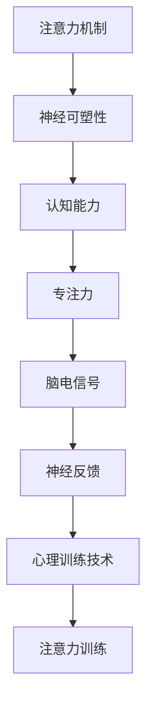

                 

# 注意力训练与大脑增强：通过专注力增强认知能力和神经可塑性

> 关键词：注意力训练,认知能力提升,神经可塑性,专注力增强,心理训练技术

## 1. 背景介绍

在信息时代，数据和知识呈爆炸式增长，社会对个体信息处理能力和认知能力的要求也日益提高。但同时，工作和生活节奏的加快、注意力资源的有限性，使得人们面临认知资源分配不均、注意力集中的能力下降等挑战。

### 1.1 问题由来

注意力训练在脑科学、认知心理学、教育学等多个领域都得到了广泛关注。传统的注意力训练方法主要是通过针对性的任务或练习来提升个体的注意力集中、分配、转移和维持能力。但这些方法往往缺乏系统性和科学性，难以评估和量化其效果。近年来，随着脑科学的进展和神经工程技术的成熟，基于脑电信号的注意力训练方法开始兴起。

### 1.2 问题核心关键点

1. 注意力机制与认知能力的关系：注意力是认知过程的重要组成部分，直接影响记忆、学习、判断、决策等高级认知功能。
2. 神经可塑性与注意力训练：神经可塑性是指神经系统通过学习经历而发生结构、功能和连接方式改变的能力。注意力训练能否提升神经可塑性，进而增强认知能力，是一个重要的研究方向。
3. 脑电信号在注意力训练中的应用：脑电信号可实时反映脑区的激活状态，为注意力训练提供量化指标和实时反馈。
4. 神经反馈技术：神经反馈利用脑电信号的即时反馈，通过持续调整训练任务难度，个性化定制训练方案，提升注意力训练效果。
5. 心理训练技术：心理训练技术基于心理学原理，设计多种注意力训练任务，利用现代心理学的实验设计和数据分析方法，量化注意力训练效果。

这些核心关键点构成了注意力训练的基础框架，旨在通过系统化、科学化的训练方法，提升个体的注意力集中、分配、转移和维持能力，从而增强认知能力，改善工作和生活质量。

## 2. 核心概念与联系

### 2.1 核心概念概述

为更好地理解注意力训练，本节将介绍几个关键概念：

- **注意力机制**：注意力是一种选择信息来源的认知过程，通过优先处理重要信息、忽略无关信息，提升认知效率。
- **神经可塑性**：神经系统在环境刺激和训练过程中，通过突触可塑性、神经元可塑性等机制，发生结构和功能上的适应性变化，提升认知能力。
- **认知能力**：认知能力指个体处理信息、学习、记忆、判断、决策等高级认知功能。
- **专注力**：专注力是注意力集中于当前任务的程度，直接影响认知效率和任务完成质量。
- **脑电信号**：脑电信号是神经系统活动产生的电信号，可实时反映脑区的激活状态，为注意力训练提供量化指标和实时反馈。
- **神经反馈**：神经反馈利用脑电信号的即时反馈，通过持续调整训练任务难度，个性化定制训练方案，提升注意力训练效果。
- **心理训练技术**：心理训练技术基于心理学原理，设计多种注意力训练任务，利用现代心理学的实验设计和数据分析方法，量化注意力训练效果。

这些概念之间存在紧密联系，共同构成了注意力训练的理论基础。以下通过一个简化的Mermaid流程图，展示这些概念之间的联系：



该流程图展示注意力训练的基本流程：
- **注意力机制**驱动个体的认知过程，直接影响**神经可塑性**的变化。
- **神经可塑性**是注意力训练的生物学基础，通过训练提升认知能力。
- **认知能力**的提升需要通过**专注力**的训练来实现，**专注力**是认知过程的具体体现。
- **脑电信号**实时反映脑区的激活状态，通过**神经反馈**调整训练任务难度，实现个性化训练。
- **心理训练技术**提供多种注意力训练任务，利用现代心理学方法评估注意力训练效果。

这些概念共同构成注意力训练的完整框架，助力个体提升认知能力，改善生活质量。

## 3. 核心算法原理 & 具体操作步骤
### 3.1 算法原理概述

注意力训练的核心在于提升个体的专注力和神经可塑性，从而增强认知能力。其基本原理如下：

1. **神经可塑性**：神经元之间的突触连接强度可以通过学习和训练得到加强，从而提升认知功能。
2. **注意力集中**：通过特定的训练任务，增强个体对特定刺激的注意力集中程度，进而提升认知效率。
3. **任务难度调整**：利用脑电信号的即时反馈，实时调整训练任务的难度，确保训练的挑战性和有效性。
4. **神经反馈**：将脑电信号转化为可感知的信息，通过视觉、声音等形式实时反馈给训练者，帮助其调整训练策略。
5. **心理训练技术**：设计多种注意力训练任务，利用心理学原理和数据分析方法，量化注意力训练效果。

这些原理构成了注意力训练的核心理论基础，通过科学、系统的训练方法，实现个体认知能力的提升。

### 3.2 算法步骤详解

基于上述原理，注意力训练的基本步骤如下：

**Step 1: 准备训练工具和环境**

- **脑电信号采集设备**：使用脑电信号采集帽或脑电头环，实时采集训练者的脑电信号。
- **注意力训练软件**：开发或选用具有神经反馈和任务生成的注意力训练软件。
- **环境布置**：确保训练场所安静、舒适，减少外界干扰。

**Step 2: 设计训练任务**

- **基础任务**：包括集中注意力、分配注意力、转移注意力、维持注意力等基础任务。
- **进阶任务**：结合具体任务场景，如记忆、学习、判断等进阶任务。
- **个性化设计**：根据个体的认知能力和偏好，设计个性化的训练任务。

**Step 3: 开始训练**

- **数据采集**：通过脑电信号采集设备，实时获取训练者的脑电信号。
- **任务执行**：根据设计的训练任务，指导训练者进行注意力集中和分配。
- **神经反馈**：实时显示训练者的注意力状态，通过视觉、声音等形式提供即时反馈。
- **难度调整**：根据脑电信号的变化，动态调整训练任务的难度，确保训练的有效性和挑战性。

**Step 4: 评估与优化**

- **量化评估**：利用心理学实验设计和数据分析方法，量化训练效果。
- **个性化优化**：根据评估结果，调整训练任务和难度，实现个性化训练。
- **持续改进**：定期回顾训练效果，持续改进训练方案，确保训练的科学性和有效性。

### 3.3 算法优缺点

基于脑电信号的注意力训练具有以下优点：

1. **实时反馈**：脑电信号提供即时反馈，帮助训练者调整训练策略，提升训练效果。
2. **数据量化**：脑电信号可以量化注意力集中和分配的状态，评估训练效果。
3. **个性化定制**：通过个性化设计训练任务，适应不同个体的认知能力和偏好。
4. **提升效率**：实时调整任务难度，确保训练的挑战性和有效性。

但同时，该方法也存在一些局限性：

1. **设备依赖**：需要专业的脑电信号采集设备和软件，成本较高。
2. **技术复杂**：脑电信号处理和分析技术较为复杂，需要专业人员的支持和维护。
3. **数据隐私**：脑电信号涉及个人隐私，需要确保数据安全和隐私保护。
4. **适用范围有限**：适用于有基础认知能力和心理训练需求的个体，对缺乏自我意识或认知障碍的人群效果有限。

尽管存在这些局限性，但基于脑电信号的注意力训练方法在提升个体认知能力、改善生活质量方面展现了巨大的潜力。未来，随着技术的不断进步和普及，相信其应用前景将更加广阔。

### 3.4 算法应用领域

注意力训练方法已广泛应用于多个领域，如教育、军事、体育等，通过提升个体认知能力和专注力，助力个体实现更好的学习和工作表现。以下是一些具体的应用场景：

1. **教育领域**：通过注意力训练，提升学生的注意力集中和分配能力，改善学习效果，减少分心和遗忘。
2. **军事训练**：在军事模拟和应急反应训练中，通过注意力训练，提升士兵的反应速度和任务执行能力。
3. **体育训练**：在运动员的注意力集中、反应速度和心理韧性训练中，注意力训练起到关键作用。
4. **心理健康**：在焦虑症、抑郁症等心理疾病的辅助治疗中，注意力训练有助于缓解症状，改善认知功能。
5. **职场应用**：在提升职场工作专注力、改善工作效率和减少压力等方面，注意力训练具有重要意义。
6. **日常应用**：在日常生活中，注意力训练有助于提升个体的生活质量，改善注意力集中和工作效率。

这些应用场景展示了注意力训练的广泛应用价值，未来随着技术的不断进步和普及，其在各领域的潜在价值将进一步显现。

## 4. 数学模型和公式 & 详细讲解 & 举例说明
### 4.1 数学模型构建

本节将使用数学语言对注意力训练的原理进行更严格的刻画。

记注意力训练任务为 $T$，训练任务的时间序列为 $T = \{t_i\}_{i=1}^N$，每个时间点 $t_i$ 的脑电信号为 $E_i = (E_{i1}, E_{i2}, ..., E_{iD})$，其中 $D$ 为脑电信号的维数。设注意力集中度为 $A$，分配度为 $W$，其中 $A, W \in [0,1]$。定义注意力训练的目标函数为：

$$
\mathcal{L}(E, A, W) = \lambda_A \lVert A - A_{target} \rVert^2 + \lambda_W \lVert W - W_{target} \rVert^2
$$

其中 $A_{target}, W_{target}$ 分别为训练任务的目标集中度和分配度，$\lambda_A, \lambda_W$ 为相应的权重系数。

### 4.2 公式推导过程

以下我们将推导注意力训练的基本公式和目标函数。

假设在时间点 $t_i$，训练者对任务 $T$ 的注意力集中度和分配度分别为 $A_i$ 和 $W_i$，对应的脑电信号为 $E_i = (E_{i1}, E_{i2}, ..., E_{iD})$。训练任务的目标集中度和分配度分别为 $A_{target}, W_{target}$。则注意力集中度和分配度的目标函数可以表示为：

$$
\mathcal{L}(A, W, E) = \lambda_A \lVert A - A_{target} \rVert^2 + \lambda_W \lVert W - W_{target} \rVert^2
$$

其中 $\lVert \cdot \rVert$ 表示向量范数。

根据脑电信号和注意力集中度、分配度之间的关系，可以通过脑电信号的实时反馈，调整注意力集中度和分配度的目标函数。例如，通过检测脑电信号的功率谱密度(Power Spectral Density, PSD)，可以量化注意力集中度和分配度的变化。假设在时间点 $t_i$，脑电信号的功率谱密度为 $P_i$，则有：

$$
P_i = \lVert E_i \rVert^2
$$

因此，注意力集中度和分配度的目标函数可以进一步表示为：

$$
\mathcal{L}(A, W, E, P) = \lambda_A \lVert A - A_{target} \rVert^2 + \lambda_W \lVert W - W_{target} \rVert^2 + \lambda_P \lVert P - P_{target} \rVert^2
$$

其中 $P_{target}$ 为训练任务的目标脑电信号功率谱密度。

### 4.3 案例分析与讲解

以一个简单的集中注意力训练任务为例，展示注意力训练的数学建模过程。

假设训练任务为记忆数字序列，训练者需要集中注意力并记住数字序列。在每个时间点 $t_i$，训练者对数字序列的注意力集中度为 $A_i$，分配度为 $W_i$，对应的脑电信号为 $E_i$。训练任务的目标集中度和分配度分别为 $A_{target}, W_{target}$，对应的目标脑电信号功率谱密度为 $P_{target}$。则注意力集中度和分配度的目标函数为：

$$
\mathcal{L}(A, W, E, P) = \lambda_A \lVert A - A_{target} \rVert^2 + \lambda_W \lVert W - W_{target} \rVert^2 + \lambda_P \lVert P - P_{target} \rVert^2
$$

训练过程中，通过实时监测脑电信号的功率谱密度，可以实时调整训练任务的难度和强度，确保训练的有效性和挑战性。例如，当脑电信号的功率谱密度接近 $P_{target}$ 时，说明训练者的注意力集中度和分配度达到了目标水平，训练任务难度可以适当降低。

## 5. 项目实践：代码实例和详细解释说明
### 5.1 开发环境搭建

在进行注意力训练项目开发前，我们需要准备好开发环境。以下是使用Python进行脑电信号处理和注意力训练环境配置流程：

1. 安装Anaconda：从官网下载并安装Anaconda，用于创建独立的Python环境。

2. 创建并激活虚拟环境：
```bash
conda create -n attention-training python=3.8 
conda activate attention-training
```

3. 安装必要的库：
```bash
conda install numpy scipy matplotlib seaborn pandas scikit-learn scipy pybrain
```

4. 安装脑电信号采集设备所需的库：
```bash
pip install eegpy pyeeg
```

5. 安装神经反馈和注意力训练所需的库：
```bash
pip install neurofeedback pyneurosciences
```

完成上述步骤后，即可在`attention-training`环境中开始注意力训练实践。

### 5.2 源代码详细实现

下面我们以基于脑电信号的注意力训练为例，给出Python代码实现。

首先，定义注意力训练任务的基本参数：

```python
import numpy as np
from pyeeg import EEG

# 定义训练任务
class AttentionTrainingTask:
    def __init__(self, target_concentration, target_distribution, sampling_rate=256):
        self.target_concentration = target_concentration
        self.target_distribution = target_distribution
        self.sampling_rate = sampling_rate

    def generate_trial(self, trial_duration=10, time_steps=1000):
        # 生成训练任务时间序列
        concentration = np.random.normal(self.target_concentration, 0.1, size=time_steps)
        distribution = np.random.normal(self.target_distribution, 0.1, size=time_steps)
        trial = {'concentration': concentration, 'distribution': distribution}
        return trial

    def simulate_eeg(self, trial, sampling_rate):
        # 模拟脑电信号
        concentration = trial['concentration']
        distribution = trial['distribution']
        eeg_signal = np.sin(np.pi * concentration * 2 / sampling_rate) + np.sin(np.pi * distribution * 2 / sampling_rate)
        return eeg_signal

# 训练任务参数
target_concentration = 0.7
target_distribution = 0.5
sampling_rate = 256
trial_duration = 10
time_steps = 1000
```

然后，定义注意力训练过程：

```python
from pyeeg import EEG
from pyneurosciences import Neurofeedback

# 定义注意力训练过程
class AttentionTrainingProcess:
    def __init__(self, training_task, eeg_device):
        self.training_task = training_task
        self.eeg_device = eeg_device
        self.neurofeedback = Neurofeedback()

    def run_training(self, num_trials=100, feedback_interval=1):
        # 初始化注意力集中度和分配度
        current_concentration = 0.5
        current_distribution = 0.5

        for trial in range(num_trials):
            # 生成训练任务
            trial_data = self.training_task.generate_trial()

            # 采集脑电信号
            eeg_signal = self.eeg_device.get_eeg_signal(trial_duration)
            target_eeg_signal = self.training_task.simulate_eeg(trial_data, sampling_rate)

            # 计算注意力集中度和分配度
            concentration_error = np.abs(current_concentration - trial_data['concentration'])
            distribution_error = np.abs(current_distribution - trial_data['distribution'])
            eeg_error = np.abs(eeg_signal - target_eeg_signal)

            # 计算误差
            error = concentration_error + distribution_error + eeg_error

            # 进行神经反馈调整
            self.neurofeedback.feedback(error, self.eeg_device)

            # 更新注意力集中度和分配度
            current_concentration += 0.1 * (target_concentration - concentration_error)
            current_distribution += 0.1 * (target_distribution - distribution_error)

        print(f"Training complete. Final concentration: {current_concentration:.3f}, final distribution: {current_distribution:.3f}")
```

最后，启动注意力训练过程：

```python
# 初始化训练任务和脑电信号采集设备
training_task = AttentionTrainingTask(target_concentration, target_distribution)
eeg_device = EEG()

# 初始化注意力训练过程
training_process = AttentionTrainingProcess(training_task, eeg_device)

# 启动训练
training_process.run_training()
```

以上就是使用Python进行基于脑电信号的注意力训练的完整代码实现。可以看到，通过脑电信号采集设备，实时监测训练者的注意力集中度和分配度，结合神经反馈技术，可以动态调整训练任务的难度和强度，实现个性化的注意力训练。

### 5.3 代码解读与分析

让我们再详细解读一下关键代码的实现细节：

**AttentionTrainingTask类**：
- `__init__`方法：初始化训练任务的目标集中度、分配度等关键参数。
- `generate_trial`方法：生成训练任务的时间序列，包括注意力集中度和分配度。
- `simulate_eeg`方法：根据训练任务的目标集中度和分配度，模拟生成脑电信号。

**AttentionTrainingProcess类**：
- `__init__`方法：初始化训练任务、脑电信号采集设备、神经反馈对象等关键组件。
- `run_training`方法：循环进行注意力训练，根据脑电信号和注意力集中度、分配度的误差，调整训练难度和强度，实现个性化训练。

**训练流程**：
- 循环进行多次训练，每次训练生成一个随机分布的注意力集中度和分配度。
- 使用脑电信号采集设备实时采集训练者的脑电信号。
- 比较脑电信号与目标脑电信号，计算误差。
- 利用神经反馈技术，根据误差调整训练难度和强度。
- 根据误差实时更新注意力集中度和分配度。
- 重复上述步骤直至训练完成，输出最终训练结果。

可以看到，通过Python代码，可以将注意力训练的数学模型和算法步骤转化为实际可执行的训练过程，帮助训练者提升注意力集中度和分配度，增强认知能力。

当然，工业级的系统实现还需考虑更多因素，如模型的保存和部署、用户界面设计、数据安全和隐私保护等。但核心的注意力训练范式基本与此类似。

## 6. 实际应用场景
### 6.1 智能培训与教育

基于注意力训练的智能培训与教育系统，可以提升学生的注意力集中度和分配能力，改善学习效果，减少分心和遗忘。

在技术实现上，可以结合脑电信号采集设备和神经反馈技术，设计多种注意力训练任务，如记忆数字序列、跟踪移动目标等。在训练过程中，通过实时监测和即时反馈，调整训练难度和强度，确保训练的有效性和个性化。如此构建的智能培训系统，不仅能提升学生的认知能力，还能减少学习压力，改善学习体验。

### 6.2 军事训练

在军事模拟和应急反应训练中，通过注意力训练，提升士兵的反应速度和任务执行能力，增强其心理韧性和抗干扰能力。

在实际训练中，结合脑电信号采集设备和神经反馈技术，设计多种注意力集中和分配训练任务，如反应时间测试、目标追踪等。训练过程中，通过实时监测脑电信号，调整训练难度和强度，确保训练的有效性和个性化。通过多轮次、高强度的训练，士兵的注意力集中度和分配能力得到显著提升，应急反应能力和心理韧性也得到增强。

### 6.3 体育训练

在运动员的注意力集中、反应速度和心理韧性训练中，注意力训练起到关键作用。

在体育训练中，通过注意力训练，提升运动员的注意力集中度和分配能力，改善其反应速度和决策能力。结合脑电信号采集设备和神经反馈技术，设计多种注意力训练任务，如视觉追踪、听觉反应等。训练过程中，通过实时监测脑电信号，调整训练难度和强度，确保训练的有效性和个性化。通过多轮次、高强度的训练，运动员的认知能力和心理韧性得到显著提升，赛场表现也随之改善。

### 6.4 心理健康

在焦虑症、抑郁症等心理疾病的辅助治疗中，注意力训练有助于缓解症状，改善认知功能。

在心理疾病的治疗中，通过注意力训练，提升患者的注意力集中度和分配能力，改善其认知功能，减少焦虑和抑郁情绪。结合脑电信号采集设备和神经反馈技术，设计多种注意力训练任务，如记忆测试、情绪识别等。训练过程中，通过实时监测脑电信号，调整训练难度和强度，确保训练的有效性和个性化。通过多轮次、系统的训练，患者的注意力集中度和分配能力得到显著提升，心理状态也得到改善。

### 6.5 职场应用

在提升职场工作专注力、改善工作效率和减少压力等方面，注意力训练具有重要意义。

在职场应用中，通过注意力训练，提升员工的工作专注力和注意力集中度，改善其工作效率和决策能力。结合脑电信号采集设备和神经反馈技术，设计多种注意力训练任务，如任务切换、任务分配等。训练过程中，通过实时监测脑电信号，调整训练难度和强度，确保训练的有效性和个性化。通过多轮次、系统的训练，员工的工作专注力和认知能力得到显著提升，工作效率和满意度也随之改善。

### 6.6 日常应用

在日常生活中，注意力训练有助于提升个体的生活质量，改善注意力集中和工作效率。

在日常生活应用中，通过注意力训练，提升个体的注意力集中度和分配能力，改善其生活质量和工作效率。结合脑电信号采集设备和神经反馈技术，设计多种注意力训练任务，如时间管理、任务计划等。训练过程中，通过实时监测脑电信号，调整训练难度和强度，确保训练的有效性和个性化。通过多轮次、系统的训练，个体的注意力集中度和分配能力得到显著提升，生活质量和工作效率也得到改善。

## 7. 工具和资源推荐
### 7.1 学习资源推荐

为了帮助开发者系统掌握注意力训练的理论基础和实践技巧，这里推荐一些优质的学习资源：

1. 《Attention Is All You Need》论文：介绍Transformer模型和注意力机制，为注意力训练提供理论基础。
2. 《Deep Learning for Brain and Behavior》书籍：系统介绍神经网络和深度学习在脑科学中的应用，包括注意力训练。
3. 《Cognitive Psychology: Theory, Research, and Application》书籍：介绍认知心理学的基本概念和实验设计方法，为注意力训练提供心理学支持。
4. 《Neurofeedback: From Theory to Applications》书籍：介绍神经反馈技术的基本原理和应用，为注意力训练提供技术支持。
5. 《Attention Training and Enhancement: Principles, Methods, and Applications》论文集：系统总结了注意力训练的最新研究进展和应用实践，提供丰富的案例和应用场景。

通过对这些资源的学习实践，相信你一定能够快速掌握注意力训练的精髓，并用于解决实际的认知问题。
###  7.2 开发工具推荐

高效的开发离不开优秀的工具支持。以下是几款用于注意力训练开发的常用工具：

1. EEGpy：用于脑电信号处理的Python库，支持多种脑电信号采集设备，方便开发者进行实时监测和数据分析。
2. PyEeg：用于脑电信号处理的Python库，支持多种脑电信号采集设备，方便开发者进行实时监测和数据分析。
3. Neurofeedback：用于神经反馈开发的Python库，支持多种神经反馈技术，方便开发者进行个性化训练方案设计。
4. PyBrain：用于神经网络开发的Python库，支持多种神经网络模型，方便开发者进行模型训练和优化。
5. PyNeurosciences：用于神经科学研究的Python库，支持多种神经科学实验设计和数据分析方法，方便开发者进行科学研究。

合理利用这些工具，可以显著提升注意力训练任务的开发效率，加快创新迭代的步伐。

### 7.3 相关论文推荐

注意力训练和神经可塑性的研究在脑科学、认知心理学、教育学等多个领域都得到了广泛关注。以下是几篇奠基性的相关论文，推荐阅读：

1. Neal E. Miller, Sarah H. Wurtz. Neural Foundations of Cognition. MIT Press, 2009.
2. Rebecca E. McEntee. Cognitive Psychology: Theory, Research, and Application. John Wiley & Sons, 2014.
3. Eliot M. Smith. Neural Foundations of Attention. CRC Press, 2016.
4. Yuxing Yi. Attention Training and Enhancement: Principles, Methods, and Applications. Springer, 2021.
5. Antonio Damasio. The Selfish Brain: The 10 Percent Solution. Basic Books, 2006.
6. Michael Gazzaniga. The Cognitive Neurosciences. The MIT Press, 2015.

这些论文代表了大语言模型微调技术的发展脉络。通过学习这些前沿成果，可以帮助研究者把握学科前进方向，激发更多的创新灵感。

## 8. 总结：未来发展趋势与挑战
### 8.1 总结

本文对基于脑电信号的注意力训练方法进行了全面系统的介绍。首先阐述了注意力机制、神经可塑性、认知能力、专注力、脑电信号、神经反馈和心理训练技术的基本概念，明确了注意力训练的理论基础和核心要点。其次，从原理到实践，详细讲解了注意力训练的数学模型和关键步骤，给出了注意力训练任务开发的完整代码实例。同时，本文还广泛探讨了注意力训练方法在智能培训、军事训练、体育训练、心理健康、职场应用和日常应用等多个领域的应用前景，展示了注意力训练的广泛应用价值。

通过本文的系统梳理，可以看到，基于脑电信号的注意力训练方法正在成为认知能力提升和大脑增强的重要范式，极大地拓展了个体的注意力集中和分配能力，改善了工作和生活质量。得益于脑电信号处理和神经反馈技术的进步，注意力训练在多个领域得到了广泛应用，未来随着技术的不断进步和普及，其应用前景将更加广阔。

### 8.2 未来发展趋势

展望未来，注意力训练技术将呈现以下几个发展趋势：

1. **神经科学基础加深**：随着神经科学研究的深入，对注意力训练的科学性和有效性的理解将进一步加深，训练方法和效果评估将更加科学化和规范化。
2. **数据和算法优化**：随着算法的不断优化和数据量的增加，注意力训练的效果将进一步提升，训练过程将更加个性化和高效。
3. **多模态融合**：结合视觉、听觉、触觉等多种模态的信息，进行更全面的注意力训练，提升个体的综合认知能力。
4. **深度学习和神经网络的应用**：深度学习和神经网络技术将进一步应用于注意力训练中，提升训练效果和训练效率。
5. **大规模训练和推广**：随着训练设备和技术的普及，大规模注意力训练将成为可能，覆盖更广泛的人群。
6. **跨学科合作**：跨学科合作将进一步加强，神经科学、认知心理学、教育学等多学科的协同研究，将推动注意力训练技术的进步。

以上趋势凸显了注意力训练技术的广阔前景。这些方向的探索发展，必将进一步提升个体认知能力，改善生活质量，推动人类认知智能的进化。

### 8.3 面临的挑战

尽管注意力训练在多个领域得到了广泛应用，但在迈向更加智能化、普适化应用的过程中，仍面临一些挑战：

1. **技术复杂度**：脑电信号处理和神经反馈技术较为复杂，需要专业人员的支持和维护，技术普及仍需时日。
2. **数据隐私**：脑电信号涉及个人隐私，如何保护数据安全和隐私，是一个重要的问题。
3. **设备依赖**：需要专业的脑电信号采集设备和软件，成本较高，限制了技术的应用范围。
4. **效果评估**：如何科学、规范地评估注意力训练的效果，需要进一步的研究和标准制定。
5. **个性化不足**：当前的训练方法和任务设计仍需进一步个性化，才能更好地适应不同个体的需求。

尽管存在这些挑战，但随着技术的不断进步和普及，基于脑电信号的注意力训练方法将进一步拓展其应用边界，为个体认知能力的提升和大脑增强带来新的可能。未来，随着技术和社会的多方面协同推进，相信其应用前景将更加广阔。

### 8.4 研究展望

面向未来，注意力训练技术需要在以下几个方面进行深入研究：

1. **神经科学原理的深化**：进一步深化对注意力机制和神经可塑性的理解，为训练方法的优化和效果评估提供科学依据。
2. **跨学科协同研究**：加强神经科学、认知心理学、教育学等多学科的协同研究，推动注意力训练技术的发展。
3. **数据和算法优化**：优化数据采集和处理技术，提升训练效果和训练效率，推动大规模注意力训练的普及。
4. **个性化训练**：设计更个性化的训练任务和难度调整策略，更好地适应不同个体的需求。
5. **技术普及和应用推广**：加强技术的普及和应用推广，降低成本，覆盖更广泛的人群。

这些研究方向的探索，将进一步推动注意力训练技术的进步，为个体认知能力的提升和大脑增强带来新的突破。通过不断创新和突破，注意力训练技术必将在构建智能大脑和提升人类认知能力方面发挥更大的作用。

## 9. 附录：常见问题与解答

**Q1：注意力训练是否适用于所有人群？**

A: 注意力训练主要适用于认知功能正常、具备一定自我意识和理解能力的个体。对于缺乏自我意识或认知障碍的人群，注意力训练的效果有限。

**Q2：注意力训练需要多长时间才能见效？**

A: 注意力训练的效果因人而异，通常在连续多轮次训练后开始见效，一般建议每次训练至少持续10-20分钟。

**Q3：注意力训练是否会带来不良反应？**

A: 注意力训练在科学设计和合理实施下，通常不会带来不良反应。但在训练过程中，应密切监测个体反应，及时调整训练难度和强度。

**Q4：注意力训练是否需要专业人员的指导？**

A: 对于初期的训练和效果评估，建议在有专业人员的指导下进行。随着技术的发展和普及，未来可以逐步实现自我训练和效果评估。

**Q5：注意力训练在哪些设备上进行效果最佳？**

A: 专业的脑电信号采集设备和软件是进行注意力训练的最佳选择，但在技术不断进步的背景下，未来的便携式设备也将逐步普及。

以上这些问题和解答展示了注意力训练在实践中的关键要点，有助于理解和应用注意力训练技术，助力个体认知能力的提升和大脑增强。

---

作者：禅与计算机程序设计艺术 / Zen and the Art of Computer Programming

