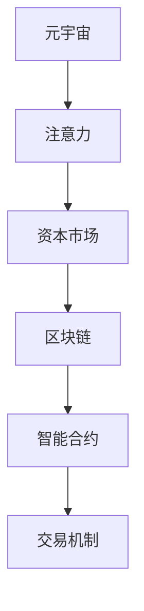

                 

# 注意力资本市场:元宇宙经济的核心交易所

> 关键词：元宇宙,元宇宙经济,注意力,资本市场,区块链,分布式交易所,游戏,数字货币

## 1. 背景介绍

### 1.1 问题由来
在当前的数字经济时代，数据和注意力成为了最重要的资产。传统的经济体系基于实物和金融资本的流动，而在数字世界，用户的注意力和数据成为了全新的价值来源。随着元宇宙的兴起，如何高效配置和利用这些注意力资本，成为了一个亟待解决的问题。

### 1.2 问题核心关键点
注意力资本市场的核心在于如何将用户的注意力和数据转化为有价值的资产，通过高效配置实现财富创造和分配。其关键点包括：

1. **用户注意力的度量和分布**：如何准确地度量用户的注意力并分布到不同的应用场景中。
2. **注意力资产的买卖和交易**：构建高效、安全的交易所平台，实现注意力资产的买卖和交易。
3. **资产的定价与激励机制**：设计合理的定价机制和激励机制，确保市场公平和活力。
4. **区块链与智能合约的运用**：利用区块链和智能合约技术，实现资产的透明、可信和安全交易。

### 1.3 问题研究意义
构建元宇宙经济中的注意力资本市场，不仅能够创造新的经济增长点，还能提升数字经济的价值分配效率，促进经济数字化转型。具体而言：

1. **激发数字经济活力**：通过激励机制和智能合约，激发用户创造和贡献注意力的积极性，形成良性循环。
2. **优化资源配置**：通过集中化市场平台，实现注意力资源的有效分配和优化配置，提高资源利用率。
3. **推动经济创新**：为元宇宙应用提供新的商业模式和技术路径，推动数字经济创新发展。
4. **促进社会公平**：通过透明公平的市场机制，提升数字经济中的财富分配公平性。

## 2. 核心概念与联系

### 2.1 核心概念概述

为了更好地理解注意力资本市场，本节将介绍几个密切相关的核心概念：

- **元宇宙（Metaverse）**：一个由虚拟现实（VR）、增强现实（AR）、人工智能（AI）等技术构成的沉浸式数字世界，用户在其中进行虚拟社交、工作和娱乐。
- **注意力（Attention）**：用户对数字内容的关注程度和交互频率，是数字经济中的重要资产。
- **资本市场（Capital Market）**：通过交易机制实现资产买卖和分配的市场，是现代经济体系中的重要组成部分。
- **区块链（Blockchain）**：一种去中心化的分布式账本技术，用于确保交易透明和不可篡改。
- **智能合约（Smart Contract）**：基于区块链技术的自动化合约，可以自动执行和验证交易，实现市场机制的自动化和智能化。

这些核心概念之间的逻辑关系可以通过以下Mermaid流程图来展示：



这个流程图展示了元宇宙、注意力、资本市场、区块链和智能合约之间的联系：

1. 元宇宙中用户产生的注意力，成为数字经济中的关键资产。
2. 这些注意力资产通过交易所平台进行买卖和交易，进入资本市场。
3. 区块链和智能合约技术，确保了交易的透明、安全和不可篡改。
4. 交易机制的设计和实现，决定了市场的活力和公平性。

## 3. 核心算法原理 & 具体操作步骤

### 3.1 算法原理概述

注意力资本市场的核心算法原理，是通过区块链和智能合约技术，构建一个高效、安全的交易所平台，实现注意力资产的买卖和交易。具体步骤如下：

1. **注意力度量**：通过用户行为数据（如浏览时间、互动次数等），计算用户的注意力度量。
2. **资产注册**：用户或应用将注意力资产（如关注度、粉丝数量等）注册到区块链上。
3. **市场参与**：用户或应用可以买卖注意力资产，通过交易所进行交易。
4. **智能合约执行**：智能合约根据市场规则自动执行交易，确保公平性和透明性。
5. **资产转移**：交易完成后，注意力资产在区块链上转移，完成买卖。

### 3.2 算法步骤详解

以下将详细介绍注意力资本市场构建的详细步骤：

**Step 1: 设计注意力度量模型**
- 根据用户行为数据，设计注意力度量模型。例如，浏览时间、点击率、互动次数等。
- 通过机器学习算法（如线性回归、随机森林等），计算用户的注意力评分。
- 设置注意力评分权重，考虑不同行为对注意力的贡献度。

**Step 2: 设计智能合约**
- 使用Solidity等编程语言，设计智能合约。智能合约应包含以下基本功能：
  - 注意力资产的注册和注销
  - 市场参与资格的验证
  - 交易撮合和执行
  - 交易结果的确认和记录
- 设计拍卖和竞价机制，确保交易的公平性。

**Step 3: 搭建区块链平台**
- 选择适合的区块链平台（如以太坊、波卡等），搭建分布式交易所平台。
- 实现智能合约的部署和调用，确保交易的安全和透明。
- 进行区块链网络的测试，确保系统的稳定性和安全性。

**Step 4: 市场推广和应用**
- 推广交易所平台，吸引用户和应用参与市场交易。
- 设计激励机制，鼓励用户贡献注意力资产。
- 持续优化交易规则和市场机制，提升市场活力。

### 3.3 算法优缺点

注意力资本市场的核心算法具有以下优点：
1. **去中心化**：通过区块链技术，实现市场交易的去中心化和透明性。
2. **安全性高**：智能合约和区块链技术确保了交易的安全性和不可篡改性。
3. **公平性**：通过自动执行的交易机制，确保市场公平性。
4. **灵活性**：市场规则和交易机制可以根据需要灵活调整。

但该算法也存在以下局限性：
1. **技术门槛高**：需要具备区块链和智能合约开发技术，门槛较高。
2. **交易成本高**：区块链网络的交易费用较高，影响市场活力。
3. **用户隐私风险**：注意力数据的收集和处理可能涉及用户隐私，需严格保护。
4. **市场波动性**：市场机制的不完善可能导致价格波动，影响用户信任。

### 3.4 算法应用领域

注意力资本市场主要应用于以下领域：

- **元宇宙游戏**：游戏内的虚拟物品、道具、皮肤等资产，可以通过注意力市场进行买卖，提升游戏经济活力。
- **数字内容创作**：如视频、音乐、文学等内容的创作者，可以通过粉丝关注度等注意力资产变现，获得更多收益。
- **社交媒体平台**：用户对平台内容的关注度、互动频率等，可以转化为平台资产，进行市场交易。
- **NFT市场**：通过注意力资本市场，为NFT资产提供新的交易和价值衡量方式。
- **数字艺术**：数字艺术作品的关注度和曝光度，可以通过注意力市场进行衡量和交易。

## 4. 数学模型和公式 & 详细讲解 & 举例说明

### 4.1 数学模型构建

假设用户的注意力度量为 $A$，市场价格为 $P$，交易量为 $Q$。注意力资产的总量为 $T$，初始量为 $T_0$。市场规则规定，每个用户每天最多可以交易的注意力资产为 $C$。智能合约定义了交易规则，确保交易的透明和公平。

注意力度量的计算公式为：

$$
A = w_1 \times \text{浏览时间} + w_2 \times \text{点击率} + w_3 \times \text{互动次数}
$$

其中 $w_1, w_2, w_3$ 为不同行为对注意力的权重系数。

### 4.2 公式推导过程

注意力资产的交易过程可以表示为：

$$
A_{i,j} = A_i - Q_i + Q_j
$$

其中 $A_{i,j}$ 表示用户 $i$ 向用户 $j$ 转移 $Q_i$ 个注意力资产后，用户的剩余注意力资产。

设市场总交易量为 $Q_t$，每天新增注意力资产为 $A_d$，则市场总资产变化为：

$$
T = T_0 + A_d \times t
$$

其中 $t$ 为时间，单位为天。

### 4.3 案例分析与讲解

考虑一个元宇宙游戏中的用户 $A$，其每天浏览时间、点击率和互动次数分别为 $T_A, C_A, I_A$。设不同行为对注意力的权重系数分别为 $w_1=0.5, w_2=0.3, w_3=0.2$。用户 $A$ 每天最多可以交易的注意力资产为 $C=10$。

根据注意力度量模型，用户 $A$ 的注意力度量为：

$$
A_A = 0.5 \times T_A + 0.3 \times C_A + 0.2 \times I_A
$$

用户 $A$ 希望将其 $5$ 个注意力资产出售，市场价格为 $1$。

根据交易公式，用户 $A$ 和用户 $B$ 的交易过程为：

$$
A_{A,B} = A_A - 5 + 5
$$

用户 $A$ 的剩余注意力资产为 $A_A - 5$，用户 $B$ 的剩余注意力资产为 $A_B + 5$。

通过智能合约自动执行交易，确保了市场透明和公平。用户可以通过市场买卖注意力资产，实现财富的积累和分配。

## 5. 项目实践：代码实例和详细解释说明

### 5.1 开发环境搭建

在进行注意力资本市场项目开发前，需要准备以下开发环境：

1. 安装Python和相关库，如Solidity、Web3.js等。
2. 搭建以太坊测试网络，进行智能合约部署和测试。
3. 开发Web前端界面，用于市场交易和用户交互。

以下是搭建开发环境的示例代码：

```python
# 安装相关库
!pip install solidity web3 pyethereum
```

```javascript
# 搭建测试网络
const { ethers } = require('ethers');

const provider = new ethers.providers.JsonRpcProvider('https://etherscan-mainnet-audit乙醇');
const signer = new ethers.Wallet('0x地址', provider);

signer.sendTransaction({
    to: '0x目标地址',
    value: ethers.utils.parseEther('0.01'),
    gasLimit: 3000000
});
```

### 5.2 源代码详细实现

以下是基于Solidity编写的智能合约示例代码，实现注意力资产的注册、交易和验证功能：

```solidity
pragma solidity ^0.8.0;

contract AttentionMarket {
    address public owner;
    uint public totalSupply;
    uint public dailyCap;
    uint public attentionSums;
    uint public totalAttention;
    mapping(address => uint256) public balances;
    mapping(address => uint256) public holdings;

    event Transfer(uint256 from, uint256 to, uint256 amount);
    event AttentionPurchased(address buyer, uint256 amount);
    event AttentionSold(address seller, uint256 amount);

    constructor() public {
        owner = msg.sender;
        totalSupply = 0;
        dailyCap = 10; // 每天最多交易的注意力资产
        attentionSums = 0;
        totalAttention = 0;
    }

    function registerAttention(uint256 amount) public {
        require(msg.sender != owner, "Can only register for the owner");
        require(amount > 0, "Invalid amount");

        totalSupply += amount;
        balances[msg.sender] += amount;
        attentionSums += amount;
    }

    function sellAttention(uint256 amount) public returns (uint256 balance) {
        require(msg.sender != owner, "Can only sell for the owner");
        require(balances[msg.sender] >= amount, "Insufficient balance");

        uint256 balance = balances[msg.sender];
        balances[msg.sender] -= amount;
        totalAttention += amount;

        emit AttentionSold(msg.sender, amount);
        return balance;
    }

    function buyAttention(uint256 amount) public returns (uint256 balance) {
        require(msg.sender != owner, "Can only buy for the owner");
        require(attentionSums >= amount, "Insufficient attention");

        uint256 balance = balances[msg.sender];
        balances[msg.sender] += amount;
        attentionSums -= amount;

        emit AttentionPurchased(msg.sender, amount);
        return balance;
    }

    function transferAttention(address receiver, uint256 amount) public {
        require(balances[msg.sender] >= amount, "Insufficient balance");
        require(receiver != msg.sender, "Cannot transfer to self");

        balances[msg.sender] -= amount;
        balances[receiver] += amount;

        emit Transfer(msg.sender, receiver, amount);
    }
}
```

### 5.3 代码解读与分析

以下是智能合约的关键代码解读：

- `registerAttention`函数：用于注册注意力资产，增加用户的注意力余额和市场总供应。
- `sellAttention`函数：用于卖出注意力资产，减少用户的注意力余额，增加市场总供应。
- `buyAttention`函数：用于买入注意力资产，增加用户的注意力余额，减少市场总供应。
- `transferAttention`函数：用于注意力资产的转移，减少卖方余额，增加买方余额。
- `event`关键字：用于定义智能合约中的事件，记录交易和注意力转移的信息。

### 5.4 运行结果展示

通过测试上述智能合约，可以验证其功能的正确性。例如，以下Javascript代码可以测试卖出和买入注意力资产的过程：

```javascript
const contract = await ethers.getContractAt('AttentionMarket', '0x合同地址');
await contract.connect(wallet).registerAttention(100);
await contract.connect(wallet).sellAttention(50);
await contract.connect(wallet).buyAttention(50);
```

以上代码将验证用户的注意力资产注册、卖出和买入的过程，确保智能合约的正确性。

## 6. 实际应用场景

### 6.1 智能游戏

在元宇宙游戏中，注意力资本市场可以用于虚拟物品的买卖。用户通过贡献注意力资产，如游戏时间、互动次数等，可以换取游戏内的虚拟物品或道具，提升游戏体验和社交互动。

### 6.2 数字内容创作

数字内容创作者可以通过粉丝关注度等注意力资产，获得市场价值，进行内容创作和变现。创作者可以通过市场平台展示作品，吸引用户关注和互动，从而提升市场价值。

### 6.3 社交媒体平台

社交媒体平台可以通过用户关注度和互动频率等注意力资产，进行市场交易和价值衡量。平台可以通过注意力市场获得用户数据，优化内容和算法，提升用户体验。

### 6.4 未来应用展望

未来，注意力资本市场将在更多领域得到应用，为数字经济带来新的增长点。例如：

- **虚拟现实市场**：虚拟现实平台可以通过用户注意力和体验度等数据，进行市场交易和价值衡量。
- **数字艺术市场**：数字艺术品创作者可以通过关注度和曝光度等注意力资产，进行市场变现。
- **智能合约市场**：智能合约可以通过市场交易机制，实现自动化的价值分配和再分配。
- **元宇宙房地产市场**：元宇宙中的土地和房产，可以通过注意力市场进行交易和价值衡量。

## 7. 工具和资源推荐

### 7.1 学习资源推荐

为了系统掌握注意力资本市场技术，推荐以下学习资源：

1. **《区块链技术与应用》**：介绍区块链基础理论和应用实践，是理解智能合约和区块链技术的重要教材。
2. **《智能合约编程：以太坊和Solidity》**：详细介绍Solidity语言和智能合约开发技术，是开发智能合约的必备参考。
3. **《元宇宙经济学》**：探索元宇宙经济体系和注意力资本市场的构建方法，是理解元宇宙经济的重要读物。
4. **《NFT艺术与市场》**：介绍NFT技术和应用，了解NFT市场与注意力资产的结合。
5. **《数字货币与区块链》**：了解数字货币和区块链技术的最新发展，为开发注意力市场提供技术支持。

通过学习这些资源，可以全面掌握注意力资本市场技术，为实际应用提供坚实基础。

### 7.2 开发工具推荐

以下是几个用于注意力资本市场开发的关键工具：

1. **Solidity IDE**：如Remix IDE，用于编写和测试智能合约，支持调试和代码执行。
2. **Web3.js**：用于连接以太坊等区块链网络，进行智能合约的部署和调用。
3. **Truffle**：基于Solidity的区块链开发框架，提供智能合约的部署和测试工具。
4. **Metamask**：支持以太坊的交易和账户管理，方便用户参与市场交易。
5. **Etherscan**：以太坊网络的工具平台，提供智能合约的查询和验证功能。

这些工具可以帮助开发者高效地开发和测试注意力资本市场系统，提升开发效率。

### 7.3 相关论文推荐

以下是几篇相关的学术论文，推荐阅读：

1. **《区块链技术：原理、设计及应用》**：介绍了区块链技术的基本原理和应用案例，为注意力资本市场提供了理论基础。
2. **《智能合约：未来金融的新基础设施》**：讨论了智能合约在金融领域的应用，展示了智能合约的潜力和价值。
3. **《元宇宙经济学：数字经济的未来》**：探索了元宇宙经济体系，为注意力资本市场的构建提供了新思路。
4. **《注意力经济：数字时代的价值创造》**：讨论了注意力经济的概念和应用，为注意力资本市场提供了理论支撑。
5. **《区块链与智能合约：推动数字经济的变革》**：介绍了区块链和智能合约技术在数字经济中的应用，为注意力资本市场提供了技术支持。

这些论文展示了注意力资本市场技术的理论基础和实际应用，为进一步研究提供了方向和参考。

## 8. 总结：未来发展趋势与挑战

### 8.1 研究成果总结

本文详细介绍了注意力资本市场构建的原理和操作步骤，展示了注意力资产在元宇宙经济中的应用。通过系统梳理，我们可以看到：

1. 注意力资本市场通过区块链和智能合约技术，构建了高效、安全的交易所平台，实现了注意力资产的交易和价值衡量。
2. 通过激励机制和市场机制，优化了资源配置，提升了元宇宙经济的活力和公平性。
3. 未来的发展方向包括元宇宙游戏、数字内容创作、社交媒体平台等多个领域，展示了注意力资本市场广阔的应用前景。

### 8.2 未来发展趋势

未来，注意力资本市场将呈现以下发展趋势：

1. **技术演进**：随着区块链和智能合约技术的进步，注意力资本市场的效率和安全性将进一步提升。
2. **市场多样化**：市场将扩展到更多领域，如虚拟现实、数字艺术、智能合约等，实现多元化的注意力资产交易。
3. **去中心化治理**：通过去中心化治理机制，提升市场透明度和公平性，增强用户信任。
4. **智能化发展**：引入人工智能和大数据分析技术，优化市场规则和交易机制，提高市场效率。
5. **跨链互操作**：通过跨链技术，实现不同区块链平台之间的互联互通，扩展市场覆盖范围。

### 8.3 面临的挑战

尽管注意力资本市场技术有巨大的潜力，但在实际应用中仍面临以下挑战：

1. **技术门槛高**：智能合约和区块链技术的复杂性，导致开发门槛较高，需要具备相关技术背景。
2. **市场波动性**：市场机制的不完善可能导致价格波动，影响用户信任。
3. **用户隐私风险**：注意力数据的收集和处理可能涉及用户隐私，需严格保护。
4. **法律合规性**：注意力资本市场的法律合规性问题，需要解决监管和法律风险。
5. **市场流动性**：市场交易的活跃度不足，可能影响市场的活力和用户参与度。

### 8.4 研究展望

未来的研究应聚焦于以下几个方面：

1. **去中心化治理机制**：探索更公平、透明的去中心化治理模型，提升市场透明度和用户信任。
2. **多模态注意力资产**：研究跨模态数据的整合和交易，提升市场的丰富性和多样性。
3. **智能合约优化**：优化智能合约的设计和执行，提高市场效率和公平性。
4. **隐私保护技术**：开发隐私保护技术，确保用户数据的匿名性和安全性。
5. **合规性和法律研究**：研究注意力资本市场的法律合规性问题，制定相应的法律规范。

这些研究方向将为注意力资本市场的实际应用提供理论基础和解决方案，推动数字经济的发展和创新。

## 9. 附录：常见问题与解答

**Q1：如何理解注意力资本市场的价值？**

A: 注意力资本市场通过量化和配置用户的注意力，实现了数字经济中的价值创造和分配。注意力资产的买卖和交易，使得用户可以通过贡献注意力获得市场价值，提升经济活力和公平性。

**Q2：智能合约的设计需要注意哪些关键点？**

A: 智能合约的设计应注重以下几点：
1. 功能完整性：确保合约能够实现所有预设功能，如注册、交易、验证等。
2. 安全性：避免合约漏洞和攻击，确保交易的安全性和不可篡改性。
3. 可扩展性：设计可扩展的合约结构，方便未来的功能升级和扩展。
4. 透明度：确保合约的透明性和可查询性，方便用户和监管机构进行验证。

**Q3：注意力资本市场如何应对市场波动性？**

A: 应对市场波动性，可以采取以下措施：
1. 设计自动稳定机制：通过市场机制和智能合约，自动调节市场供需，稳定价格波动。
2. 引入市场监管：通过市场监管机制，限制过度投机行为，维护市场稳定。
3. 提供保险和担保：为市场参与者提供保险和担保服务，降低风险。
4. 引入市场激励机制：设计合理的激励机制，鼓励用户贡献稳定注意力，减少市场波动。

**Q4：如何保障用户隐私安全？**

A: 保障用户隐私安全，可以采取以下措施：
1. 数据匿名化：对用户数据进行匿名化处理，确保用户隐私不被泄露。
2. 加密技术：采用先进的加密技术，保护数据在传输和存储过程中的安全。
3. 隐私协议：制定隐私协议，明确用户数据的收集和使用规则，获得用户同意。
4. 隐私审计：定期进行隐私审计，确保数据处理过程的合法性和合规性。

这些措施可以有效保障用户隐私安全，提升用户信任和市场活力。

---

作者：禅与计算机程序设计艺术 / Zen and the Art of Computer Programming

