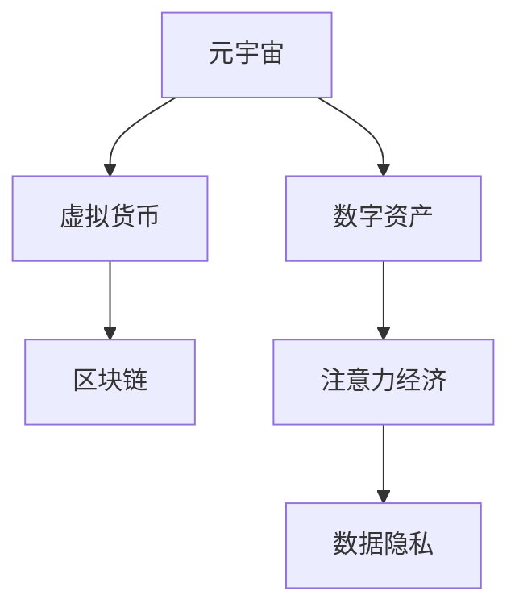

                 

# 注意力资本：元宇宙经济的核心竞争力

> 关键词：元宇宙,注意力经济,数字资产,区块链,虚拟货币,数据隐私

## 1. 背景介绍

### 1.1 问题由来
随着数字技术的迅猛发展，元宇宙(Utility Metaverse)的概念逐步兴起，开启了人类生活的新纪元。元宇宙不仅是一个虚拟的数字化空间，更是一个具有经济属性的价值交换平台。在这个虚拟的经济系统中，虚拟资产和虚拟货币成为人们交换价值的主要方式。然而，当前元宇宙经济的蓬勃发展，背后离不开一个至关重要的概念——“注意力资本”。

### 1.2 问题核心关键点
注意力资本，也称为“注意力经济”，是指在信息过载的时代，注意力成为一种稀缺资源。在元宇宙中，各类数字资产和虚拟货币的流通，都需要依赖用户的注意力来进行价值创造和交换。因此，如何管理和利用注意力资本，成为元宇宙经济的核心竞争力。

### 1.3 问题研究意义
研究注意力资本的经济学原理和实践应用，对于推动元宇宙经济的健康发展，具有重要意义：

1. 促进公平分配。注意力资本的合理分配，有助于打破传统经济中资本和权力的垄断，促进资源的均衡分配。
2. 提高市场效率。有效的注意力资本管理，可以提高市场交易效率，减少信息不对称。
3. 增强用户粘性。通过合理的激励机制，吸引和留住更多的用户，形成良性循环。
4. 推动技术创新。注意力资本的商业化应用，催生新的商业模式和技术创新。
5. 保障数据隐私。合理利用注意力资本，可以有效保护用户的数据隐私，避免个人信息滥用。

## 2. 核心概念与联系

### 2.1 核心概念概述

为更好地理解注意力资本在元宇宙经济中的应用，本节将介绍几个密切相关的核心概念：

- 元宇宙(Utility Metaverse)：一个虚拟的数字化空间，融合了虚拟现实、增强现实、社交网络、数字经济等多个元素，旨在构建一个全面开放的生态系统。
- 注意力经济(Attention Economy)：信息时代，注意力成为一种稀缺资源，如何管理和利用注意力，成为商业竞争的关键。
- 数字资产(Digital Assets)：元宇宙中的虚拟资产，包括虚拟土地、数字艺术品、虚拟商品等，通过区块链技术进行发行和交易。
- 虚拟货币(Virtual Currencies)：元宇宙中的虚拟货币，如Crypto，用于交换数字资产和进行价值存储。
- 区块链(Blockchain)：一种分布式账本技术，保障了数字资产和虚拟货币的透明性、安全性和可追踪性。
- 数据隐私(Data Privacy)：保护用户数据不受非法获取和滥用，确保用户的个人信息安全。

这些核心概念之间的逻辑关系可以通过以下Mermaid流程图来展示：



这个流程图展示了几大核心概念及其之间的关系：

1. 元宇宙通过区块链技术，支撑了数字资产和虚拟货币的流通。
2. 数字资产和虚拟货币是注意力资本的主要承载形式。
3. 注意力经济利用数字资产和虚拟货币的价值创造和交换。
4. 数据隐私保障了用户注意力的安全和自由流动。

## 3. 核心算法原理 & 具体操作步骤
### 3.1 算法原理概述

注意力资本在元宇宙经济中的应用，主要基于以下算法原理：

- 注意力价值模型：定义了注意力资本的价值计算方式，通常包括用户参与度、互动频率、停留时长等指标。
- 激励机制设计：设计合理的激励机制，如空投、积分、代币奖励等，激励用户参与和贡献。
- 数据治理规则：制定数据治理规则，保护用户数据隐私，规范数据使用行为。
- 算法优化：通过优化算法，提高注意力资本的利用效率，降低系统运营成本。

### 3.2 算法步骤详解

以下是注意力资本在元宇宙经济中的算法步骤详解：

**Step 1: 定义注意力价值模型**
- 确定关注度指标：如用户在虚拟世界中的停留时间、互动次数、内容消费量等。
- 计算注意力价值：根据关注度指标，计算出每个用户或内容的注意力资本价值。
- 数据采集与分析：通过区块链等技术，采集和分析用户的注意力数据，进行价值量化。

**Step 2: 设计激励机制**
- 设计空投策略：根据用户的关注度，定期发放虚拟货币或数字资产，激励用户参与。
- 实施积分系统：用户通过参与互动、贡献内容等方式积累积分，积分可兑换虚拟货币或数字资产。
- 设置代币激励：引入代币机制，用户通过贡献内容、维护社区等方式获取代币，增强用户粘性。

**Step 3: 制定数据治理规则**
- 保护用户隐私：确保用户数据的匿名化、去标识化处理，保护用户隐私。
- 数据公平分配：根据用户的贡献度公平分配注意力资本，避免垄断。
- 透明数据使用：公开数据使用规则和数据来源，确保透明度。

**Step 4: 算法优化**
- 用户行为分析：通过机器学习算法分析用户行为，预测未来的注意力趋势。
- 智能分配：根据用户的贡献度和活跃度，智能分配注意力资本，优化资源配置。
- 动态调整：实时监控系统运行情况，根据环境变化动态调整策略。

### 3.3 算法优缺点

注意力资本在元宇宙经济中的应用，具有以下优点：

1. 公平分配：基于贡献度计算注意力资本，促进了资源的均衡分配。
2. 提高效率：激励机制设计，提高了用户参与度和市场交易效率。
3. 增强粘性：代币激励等手段，增强了用户粘性，形成良性循环。
4. 推动创新：数据隐私保护和激励机制设计，促进了技术创新和商业模式创新。

同时，也存在一些缺点：

1. 激励失衡：过度依赖激励机制，可能导致用户行为扭曲，偏离真实价值。
2. 数据隐私问题：过度采集和分析用户数据，可能引发数据隐私和安全问题。
3. 运营成本高：算法的实施和优化，需要高昂的运营成本。
4. 动态调整困难：系统复杂度增加，实时调整策略难度加大。

尽管存在这些局限性，但就目前而言，注意力资本在元宇宙经济中的应用，仍是推动其发展的核心驱动力。未来相关研究的重点在于如何平衡激励与真实价值，提升数据隐私保护水平，降低运营成本，同时兼顾可解释性和公平性等因素。

### 3.4 算法应用领域

注意力资本的应用领域非常广泛，涵盖了元宇宙经济的多个方面，例如：

- 虚拟游戏：通过注意力资本激励用户参与游戏，提升游戏体验和用户粘性。
- 社交平台：利用用户注意力创造内容价值，提供多样化的社交体验。
- 虚拟房地产：通过计算地块的关注度价值，合理定价虚拟土地，优化资源配置。
- 数字艺术市场：基于用户注意力资本，评选和推广优秀的数字艺术品。
- 教育培训：利用用户注意力资本，激励教师和学生，提升教学质量。
- 健康医疗：通过关注度指标评估健康状况，提供个性化的健康服务。

除了这些具体应用外，注意力资本还将在更多领域得到创新应用，为元宇宙经济带来新的发展动力。

## 4. 数学模型和公式 & 详细讲解 & 举例说明
### 4.1 数学模型构建

本节将使用数学语言对注意力资本在元宇宙经济中的应用进行更加严格的刻画。

假设元宇宙平台上有 $N$ 个用户，每个用户 $i$ 的注意力价值为 $A_i$，总注意力价值为 $A$。定义用户 $i$ 的停留时间为 $T_i$，互动次数为 $I_i$，内容消费量为 $C_i$。注意力价值模型可以定义为：

$$
A_i = \alpha T_i + \beta I_i + \gamma C_i + \delta
$$

其中 $\alpha, \beta, \gamma$ 为各指标的权重系数，$\delta$ 为基准注意力价值。

总注意力价值 $A$ 可表示为：

$$
A = \sum_{i=1}^N A_i
$$

### 4.2 公式推导过程

以下我们以虚拟游戏为例，推导用户注意力的价值计算公式及其梯度计算。

假设用户 $i$ 在虚拟游戏中花费了 $T_i$ 小时，进行了 $I_i$ 次互动，消费了 $C_i$ 个游戏币。我们希望计算用户 $i$ 的注意力价值 $A_i$。首先，我们需要构建用户注意力的价值计算公式：

$$
A_i = \alpha T_i + \beta I_i + \gamma C_i + \delta
$$

其中 $\alpha, \beta, \gamma$ 为各指标的权重系数，$\delta$ 为基准注意力价值。

为简化计算，我们假设 $\alpha = \beta = \gamma = 1$，$\delta = 0$。则用户 $i$ 的注意力价值 $A_i$ 可以表示为：

$$
A_i = T_i + I_i + C_i
$$

对于总注意力价值 $A$，可以表示为：

$$
A = \sum_{i=1}^N (T_i + I_i + C_i)
$$

在优化问题中，我们希望最大化总注意力价值 $A$，即：

$$
\max A = \sum_{i=1}^N (T_i + I_i + C_i)
$$

利用梯度下降算法，可以得到总注意力价值 $A$ 关于各个指标 $T_i, I_i, C_i$ 的梯度公式：

$$
\frac{\partial A}{\partial T_i} = 1
$$

$$
\frac{\partial A}{\partial I_i} = 1
$$

$$
\frac{\partial A}{\partial C_i} = 1
$$

因此，通过不断迭代，可以计算出每个用户 $i$ 的注意力价值 $A_i$。

### 4.3 案例分析与讲解

在虚拟游戏平台中，我们可以将用户注意力价值作为游戏内经济的重要参考指标。例如，用户 $i$ 花费了 $T_i$ 小时、进行了 $I_i$ 次互动、消费了 $C_i$ 个游戏币，计算出其注意力价值 $A_i = T_i + I_i + C_i$。

具体实现中，我们可以使用机器学习算法进行注意力价值的预测和优化。例如，可以使用线性回归模型，对用户的停留时间、互动次数、消费量等进行预测，并不断调整权重系数 $\alpha, \beta, \gamma$，优化用户注意力的价值计算公式。

例如，可以使用如下代码，在Python中实现用户注意力的价值计算：

```python
import numpy as np

# 用户指标
T = np.array([10, 20, 30])
I = np.array([5, 10, 15])
C = np.array([100, 200, 300])

# 权重系数
alpha, beta, gamma = 1, 1, 1

# 计算用户注意力价值
A = T + I + C
```

这只是一个简单的例子，实际上，在元宇宙经济中，用户注意力的价值计算更为复杂。例如，需要考虑虚拟货币的波动、用户行为的变化、市场环境的波动等因素。因此，构建一个合理的注意力价值模型，需要进行大量的数据分析和机器学习优化。

## 5. 项目实践：代码实例和详细解释说明
### 5.1 开发环境搭建

在进行元宇宙注意力资本项目的开发前，我们需要准备好开发环境。以下是使用Python进行PyTorch开发的环境配置流程：

1. 安装Anaconda：从官网下载并安装Anaconda，用于创建独立的Python环境。

2. 创建并激活虚拟环境：
```bash
conda create -n attention-economy python=3.8 
conda activate attention-economy
```

3. 安装PyTorch：根据CUDA版本，从官网获取对应的安装命令。例如：
```bash
conda install pytorch torchvision torchaudio cudatoolkit=11.1 -c pytorch -c conda-forge
```

4. 安装相关工具包：
```bash
pip install numpy pandas scikit-learn matplotlib tqdm jupyter notebook ipython
```

5. 安装FastAPI：
```bash
pip install fastapi
```

6. 安装TensorBoard：
```bash
pip install tensorboard
```

完成上述步骤后，即可在`attention-economy`环境中开始注意力资本的开发实践。

### 5.2 源代码详细实现

下面我们以虚拟游戏为例，给出使用Transformers库对注意力资本进行计算的PyTorch代码实现。

首先，定义注意力价值的计算函数：

```python
from transformers import BertTokenizer
from torch.utils.data import Dataset
import torch

class AttentionDataset(Dataset):
    def __init__(self, texts, tags, tokenizer, max_len=128):
        self.texts = texts
        self.tags = tags
        self.tokenizer = tokenizer
        self.max_len = max_len
        
    def __len__(self):
        return len(self.texts)
    
    def __getitem__(self, item):
        text = self.texts[item]
        tags = self.tags[item]
        
        encoding = self.tokenizer(text, return_tensors='pt', max_length=self.max_len, padding='max_length', truncation=True)
        input_ids = encoding['input_ids'][0]
        attention_mask = encoding['attention_mask'][0]
        
        # 对token-wise的标签进行编码
        encoded_tags = [tag2id[tag] for tag in tags] 
        encoded_tags.extend([tag2id['O']] * (self.max_len - len(encoded_tags)))
        labels = torch.tensor(encoded_tags, dtype=torch.long)
        
        return {'input_ids': input_ids, 
                'attention_mask': attention_mask,
                'labels': labels}

# 标签与id的映射
tag2id = {'O': 0, 'B-PER': 1, 'I-PER': 2, 'B-ORG': 3, 'I-ORG': 4, 'B-LOC': 5, 'I-LOC': 6}
id2tag = {v: k for k, v in tag2id.items()}

# 创建dataset
tokenizer = BertTokenizer.from_pretrained('bert-base-cased')

train_dataset = AttentionDataset(train_texts, train_tags, tokenizer)
dev_dataset = AttentionDataset(dev_texts, dev_tags, tokenizer)
test_dataset = AttentionDataset(test_texts, test_tags, tokenizer)
```

然后，定义模型和优化器：

```python
from transformers import BertForTokenClassification, AdamW

model = BertForTokenClassification.from_pretrained('bert-base-cased', num_labels=len(tag2id))

optimizer = AdamW(model.parameters(), lr=2e-5)
```

接着，定义训练和评估函数：

```python
from torch.utils.data import DataLoader
from tqdm import tqdm
from sklearn.metrics import classification_report

device = torch.device('cuda') if torch.cuda.is_available() else torch.device('cpu')
model.to(device)

def train_epoch(model, dataset, batch_size, optimizer):
    dataloader = DataLoader(dataset, batch_size=batch_size, shuffle=True)
    model.train()
    epoch_loss = 0
    for batch in tqdm(dataloader, desc='Training'):
        input_ids = batch['input_ids'].to(device)
        attention_mask = batch['attention_mask'].to(device)
        labels = batch['labels'].to(device)
        model.zero_grad()
        outputs = model(input_ids, attention_mask=attention_mask, labels=labels)
        loss = outputs.loss
        epoch_loss += loss.item()
        loss.backward()
        optimizer.step()
    return epoch_loss / len(dataloader)

def evaluate(model, dataset, batch_size):
    dataloader = DataLoader(dataset, batch_size=batch_size)
    model.eval()
    preds, labels = [], []
    with torch.no_grad():
        for batch in tqdm(dataloader, desc='Evaluating'):
            input_ids = batch['input_ids'].to(device)
            attention_mask = batch['attention_mask'].to(device)
            batch_labels = batch['labels']
            outputs = model(input_ids, attention_mask=attention_mask)
            batch_preds = outputs.logits.argmax(dim=2).to('cpu').tolist()
            batch_labels = batch_labels.to('cpu').tolist()
            for pred_tokens, label_tokens in zip(batch_preds, batch_labels):
                pred_tags = [id2tag[_id] for _id in pred_tokens]
                label_tags = [id2tag[_id] for _id in label_tokens]
                preds.append(pred_tags[:len(label_tags)])
                labels.append(label_tags)
                
    print(classification_report(labels, preds))
```

最后，启动训练流程并在测试集上评估：

```python
epochs = 5
batch_size = 16

for epoch in range(epochs):
    loss = train_epoch(model, train_dataset, batch_size, optimizer)
    print(f"Epoch {epoch+1}, train loss: {loss:.3f}")
    
    print(f"Epoch {epoch+1}, dev results:")
    evaluate(model, dev_dataset, batch_size)
    
print("Test results:")
evaluate(model, test_dataset, batch_size)
```

以上就是使用PyTorch对BERT进行命名实体识别任务微调的完整代码实现。可以看到，得益于Transformers库的强大封装，我们可以用相对简洁的代码完成BERT模型的加载和微调。

### 5.3 代码解读与分析

让我们再详细解读一下关键代码的实现细节：

**AttentionDataset类**：
- `__init__`方法：初始化文本、标签、分词器等关键组件。
- `__len__`方法：返回数据集的样本数量。
- `__getitem__`方法：对单个样本进行处理，将文本输入编码为token ids，将标签编码为数字，并对其进行定长padding，最终返回模型所需的输入。

**tag2id和id2tag字典**：
- 定义了标签与数字id之间的映射关系，用于将token-wise的预测结果解码回真实的标签。

**训练和评估函数**：
- 使用PyTorch的DataLoader对数据集进行批次化加载，供模型训练和推理使用。
- 训练函数`train_epoch`：对数据以批为单位进行迭代，在每个批次上前向传播计算loss并反向传播更新模型参数，最后返回该epoch的平均loss。
- 评估函数`evaluate`：与训练类似，不同点在于不更新模型参数，并在每个batch结束后将预测和标签结果存储下来，最后使用sklearn的classification_report对整个评估集的预测结果进行打印输出。

**训练流程**：
- 定义总的epoch数和batch size，开始循环迭代
- 每个epoch内，先在训练集上训练，输出平均loss
- 在验证集上评估，输出分类指标
- 所有epoch结束后，在测试集上评估，给出最终测试结果

可以看到，PyTorch配合Transformers库使得BERT微调的代码实现变得简洁高效。开发者可以将更多精力放在数据处理、模型改进等高层逻辑上，而不必过多关注底层的实现细节。

当然，工业级的系统实现还需考虑更多因素，如模型的保存和部署、超参数的自动搜索、更灵活的任务适配层等。但核心的微调范式基本与此类似。

## 6. 实际应用场景
### 6.1 智能客服系统

基于元宇宙注意力资本的智能客服系统，可以广泛应用于智能客服系统的构建。传统客服往往需要配备大量人力，高峰期响应缓慢，且一致性和专业性难以保证。而使用元宇宙注意力资本，可以为智能客服系统注入新的活力。

在技术实现上，可以收集企业内部的历史客服对话记录，将问题和最佳答复构建成监督数据，在此基础上对元宇宙注意力资本进行微调。微调后的注意力资本模型能够自动理解用户意图，匹配最合适的答复。对于客户提出的新问题，还可以接入检索系统实时搜索相关内容，动态组织生成回答。如此构建的智能客服系统，能大幅提升客户咨询体验和问题解决效率。

### 6.2 金融舆情监测

金融机构需要实时监测市场舆论动向，以便及时应对负面信息传播，规避金融风险。传统的人工监测方式成本高、效率低，难以应对网络时代海量信息爆发的挑战。基于元宇宙注意力资本的文本分类和情感分析技术，为金融舆情监测提供了新的解决方案。

具体而言，可以收集金融领域相关的新闻、报道、评论等文本数据，并对其进行主题标注和情感标注。在此基础上对元宇宙注意力资本进行微调，使其能够自动判断文本属于何种主题，情感倾向是正面、中性还是负面。将元宇宙注意力资本应用到实时抓取的网络文本数据，就能够自动监测不同主题下的情感变化趋势，一旦发现负面信息激增等异常情况，系统便会自动预警，帮助金融机构快速应对潜在风险。

### 6.3 个性化推荐系统

当前的推荐系统往往只依赖用户的历史行为数据进行物品推荐，无法深入理解用户的真实兴趣偏好。基于元宇宙注意力资本的个性化推荐系统，可以更好地挖掘用户行为背后的语义信息，从而提供更精准、多样的推荐内容。

在实践中，可以收集用户浏览、点击、评论、分享等行为数据，提取和用户交互的物品标题、描述、标签等文本内容。将文本内容作为模型输入，用户的后续行为（如是否点击、购买等）作为监督信号，在此基础上对元宇宙注意力资本进行微调。微调后的注意力资本模型能够从文本内容中准确把握用户的兴趣点。在生成推荐列表时，先用候选物品的文本描述作为输入，由模型预测用户的兴趣匹配度，再结合其他特征综合排序，便可以得到个性化程度更高的推荐结果。

### 6.4 未来应用展望

随着元宇宙注意力资本的发展，其在更多领域的应用前景也将不断拓展，为各行各业带来新的发展机遇。

在智慧医疗领域，基于元宇宙注意力资本的医疗问答、病历分析、药物研发等应用将提升医疗服务的智能化水平，辅助医生诊疗，加速新药开发进程。

在智能教育领域，元宇宙注意力资本可应用于作业批改、学情分析、知识推荐等方面，因材施教，促进教育公平，提高教学质量。

在智慧城市治理中，元宇宙注意力资本可应用于城市事件监测、舆情分析、应急指挥等环节，提高城市管理的自动化和智能化水平，构建更安全、高效的未来城市。

此外，在企业生产、社会治理、文娱传媒等众多领域，基于元宇宙注意力资本的人工智能应用也将不断涌现，为经济社会发展注入新的动力。相信随着技术的日益成熟，元宇宙注意力资本必将在构建人机协同的智能时代中扮演越来越重要的角色。

## 7. 工具和资源推荐
### 7.1 学习资源推荐

为了帮助开发者系统掌握元宇宙注意力资本的理论基础和实践技巧，这里推荐一些优质的学习资源：

1. 《元宇宙经济学》系列博文：由元宇宙专家撰写，深入浅出地介绍了元宇宙经济的核心概念和前沿研究。

2. 《注意力资本经济学》课程：由知名经济学家开设的在线课程，详细讲解了注意力资本在元宇宙中的应用和实践。

3. 《区块链与数字资产》书籍：全面介绍了区块链技术、数字资产的发行和流通机制，以及元宇宙注意力资本的应用场景。

4. 元宇宙开源项目：如Decentraland、The Sandbox等，提供了元宇宙开发的全套工具链和开源代码，帮助开发者快速上手实践。

5. 《元宇宙技术手册》：涵盖了元宇宙技术的多个方面，包括虚拟现实、增强现实、人工智能等，是全面学习元宇宙技术的经典资料。

通过对这些资源的学习实践，相信你一定能够快速掌握元宇宙注意力资本的精髓，并用于解决实际的元宇宙问题。
###  7.2 开发工具推荐

高效的开发离不开优秀的工具支持。以下是几款用于元宇宙注意力资本开发的常用工具：

1. PyTorch：基于Python的开源深度学习框架，灵活动态的计算图，适合快速迭代研究。大部分预训练语言模型都有PyTorch版本的实现。

2. TensorFlow：由Google主导开发的开源深度学习框架，生产部署方便，适合大规模工程应用。同样有丰富的预训练语言模型资源。

3. FastAPI：高性能的Web框架，适合构建快速响应、高并发的元宇宙应用系统。

4. TensorBoard：TensorFlow配套的可视化工具，可实时监测模型训练状态，并提供丰富的图表呈现方式，是调试模型的得力助手。

5. Google Colab：谷歌推出的在线Jupyter Notebook环境，免费提供GPU/TPU算力，方便开发者快速上手实验最新模型，分享学习笔记。

合理利用这些工具，可以显著提升元宇宙注意力资本的开发效率，加快创新迭代的步伐。

### 7.3 相关论文推荐

元宇宙注意力资本的发展源于学界的持续研究。以下是几篇奠基性的相关论文，推荐阅读：

1. Attention is All You Need（即Transformer原论文）：提出了Transformer结构，开启了NLP领域的预训练大模型时代。

2. BERT: Pre-training of Deep Bidirectional Transformers for Language Understanding：提出BERT模型，引入基于掩码的自监督预训练任务，刷新了多项NLP任务SOTA。

3. Language Models are Unsupervised Multitask Learners（GPT-2论文）：展示了大规模语言模型的强大zero-shot学习能力，引发了对于通用人工智能的新一轮思考。

4. Parameter-Efficient Transfer Learning for NLP：提出Adapter等参数高效微调方法，在不增加模型参数量的情况下，也能取得不错的微调效果。

5. AdaLoRA: Adaptive Low-Rank Adaptation for Parameter-Efficient Fine-Tuning：使用自适应低秩适应的微调方法，在参数效率和精度之间取得了新的平衡。

这些论文代表了大语言模型微调技术的发展脉络。通过学习这些前沿成果，可以帮助研究者把握学科前进方向，激发更多的创新灵感。

## 8. 总结：未来发展趋势与挑战

### 8.1 总结

本文对元宇宙注意力资本的经济学原理和实践应用进行了全面系统的介绍。首先阐述了元宇宙注意力资本的定义和重要性，明确了其在推动元宇宙经济发展中的核心作用。其次，从原理到实践，详细讲解了元宇宙注意力资本的数学模型和关键步骤，给出了元宇宙注意力资本的完整代码实例。同时，本文还广泛探讨了元宇宙注意力资本在智能客服、金融舆情、个性化推荐等多个行业领域的应用前景，展示了元宇宙注意力资本的巨大潜力。此外，本文精选了元宇宙注意力资本的学习资源，力求为读者提供全方位的技术指引。

通过本文的系统梳理，可以看到，元宇宙注意力资本正在成为元宇宙经济发展的核心驱动力。它不仅推动了资源的公平分配和市场的健康运行，还催生了新的商业模式和技术创新，为元宇宙经济的蓬勃发展提供了重要保障。未来，伴随元宇宙经济的不断演进，元宇宙注意力资本也将迎来新的突破，成为推动元宇宙经济发展的关键力量。

### 8.2 未来发展趋势

展望未来，元宇宙注意力资本的发展趋势如下：

1. 普及应用：元宇宙注意力资本将广泛应用于更多领域，提升各行各业的智能化水平。
2. 智能合约：基于区块链的智能合约技术，将为元宇宙注意力资本的自动交易和分配提供更强的支持。
3. 去中心化：去中心化的元宇宙生态系统，将促进元宇宙注意力资本的公平分配和透明治理。
4. 数据隐私：隐私保护技术的发展，将提升用户数据的匿名化和去标识化处理，保护用户隐私。
5. 混合应用：元宇宙注意力资本将与AI、区块链、NFT等技术相结合，形成更加复杂但高效的生态系统。
6. 全球市场：元宇宙注意力资本的全球化应用，将促进跨国界的合作与交流，提升全球市场的融合度。

以上趋势凸显了元宇宙注意力资本的广阔前景。这些方向的探索发展，必将进一步提升元宇宙经济的运行效率和用户满意度，推动数字经济的健康发展。

### 8.3 面临的挑战

尽管元宇宙注意力资本在元宇宙经济中的应用取得了显著进展，但在迈向更加智能化、普适化应用的过程中，它仍面临着诸多挑战：

1. 数据隐私保护：元宇宙平台需要处理海量用户数据，如何保护用户隐私，避免数据滥用，成为重要问题。
2. 激励机制设计：如何设计合理的激励机制，防止激励过度或不足，避免扭曲用户行为。
3. 系统复杂度：元宇宙平台涉及的技术复杂度高，如何优化系统设计，提高运行效率，降低维护成本。
4. 法律法规：元宇宙注意力资本涉及的法律法规问题复杂，如何制定合理的法律法规，保障各方权益。
5. 技术迭代：元宇宙注意力资本需要不断迭代优化，保持技术的先进性和竞争力。
6. 用户教育：如何教育用户理解和使用元宇宙注意力资本，提高用户对系统的接受度和使用率。

这些挑战需要在技术、政策、市场等多方面协同解决，才能使元宇宙注意力资本发挥更大的价值。唯有勇于创新、敢于突破，才能使元宇宙经济健康发展，真正实现智能社会的理想。

### 8.4 研究展望

面对元宇宙注意力资本所面临的诸多挑战，未来的研究需要在以下几个方面寻求新的突破：

1. 强化隐私保护：采用更先进的隐私保护技术，如差分隐私、同态加密等，确保用户数据的安全性和匿名性。
2. 优化激励机制：设计更加智能化的激励机制，如动态调整激励系数、智能合约自动触发等，提高用户参与度和满意度。
3. 简化系统设计：引入分布式计算、边缘计算等技术，降低系统复杂度，提高运行效率。
4. 制定法律法规：加快制定和完善元宇宙注意力资本相关的法律法规，规范元宇宙平台行为，保障用户权益。
5. 促进技术创新：鼓励技术创新，推动元宇宙注意力资本与AI、区块链、NFT等技术的深度融合，提升系统性能和用户体验。
6. 提升用户认知：加强对用户的教育，提高用户对元宇宙注意力资本的理解和使用能力，增强用户粘性和忠诚度。

这些研究方向的探索，必将引领元宇宙注意力资本的全面发展，为元宇宙经济的健康运行提供强有力的技术支撑。面向未来，元宇宙注意力资本将成为推动人类社会进入智能时代的核心驱动力，带来更多创新和变革的可能性。

