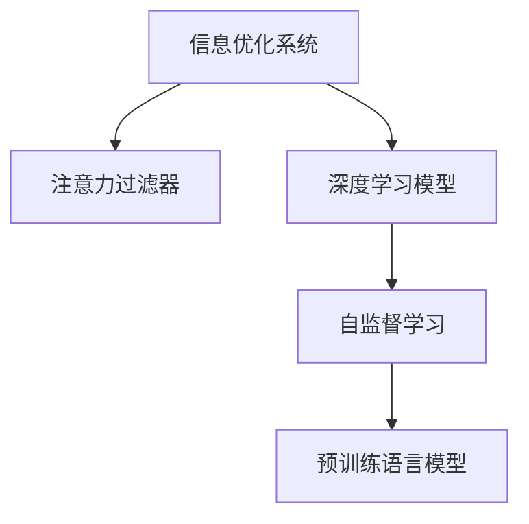

                 

# 注意力过滤器2.0：AI驱动的信息优化系统

> 关键词：注意力过滤器,信息优化,人工神经网络,深度学习,自然语言处理,NLP,Transformer,自监督学习,预训练,语言模型

## 1. 背景介绍

### 1.1 问题由来
在信息爆炸的时代，如何高效地处理、筛选和利用海量信息，成为了数据驱动应用面临的一大挑战。传统的搜索引擎、数据库、推荐系统等手段，已经难以满足用户对信息精细化、个性化的需求。人工智能技术的不断演进，尤其是深度学习的发展，为我们提供了一种全新的思路：通过AI驱动的信息优化系统，智能识别并筛选用户真正关心的内容，提升信息获取的效率和质量。

### 1.2 问题核心关键点
该系统基于深度学习模型，通过自监督学习的方式，预先训练出一个具备强大信息处理能力的模型。利用该模型作为核心组件，构建一个能主动识别并筛选信息的应用，有效提升信息处理的智能化水平。

该系统的关键点在于：
- 高效的信息筛选：通过模型学习用户行为模式，主动识别出用户感兴趣的内容，提升信息检索的精准度。
- 个性化的信息呈现：根据用户的历史行为和偏好，动态调整搜索结果的排序，提供个性化的信息推荐。
- 实时化的信息更新：实时采集用户行为数据，动态调整模型参数，保持系统更新的时效性和精确性。

## 2. 核心概念与联系

### 2.1 核心概念概述

为更好地理解注意力过滤器2.0系统，本节将介绍几个密切相关的核心概念：

- 注意力过滤器(Attention Filter)：一种基于注意力机制的模型，通过学习用户与信息之间的交互模式，筛选出用户最感兴趣的内容。
- 信息优化系统：通过AI技术，提升信息检索和推荐的精度和效率，使用户能更快地获取到有价值的信息。
- 深度学习模型：基于多层神经网络的模型，通过端到端的训练方式，自动学习数据的特征表示。
- 自然语言处理(NLP)：利用计算机处理和理解自然语言的技术，包括语言模型、文本分类、信息检索等。
- 预训练语言模型(Pre-trained Language Model)：在大量无标签数据上预训练的大规模语言模型，具备强大的语言理解能力。
- 自监督学习(Self-supervised Learning)：利用无标签数据进行模型训练，自动学习数据的结构化信息，无需人工标注。

这些概念之间的逻辑关系可以通过以下Mermaid流程图来展示：



这个流程图展示了一些核心概念及其之间的关系：

1. 信息优化系统通过注意力过滤器实现高效的信息筛选。
2. 注意力过滤器基于深度学习模型进行信息筛选。
3. 深度学习模型通过自监督学习进行预训练。
4. 自监督学习利用预训练语言模型作为基础。

这些概念共同构成了信息优化系统的核心框架，使其能够智能化地处理和利用信息。通过理解这些核心概念，我们可以更好地把握系统的设计思路和优化方向。

## 3. 核心算法原理 & 具体操作步骤
### 3.1 算法原理概述

注意力过滤器2.0系统基于Transformer模型，利用自监督学习的预训练方式，预先训练出一个具备强大信息处理能力的语言模型。然后，通过在少量标注数据上的微调，优化模型以适应特定的信息筛选需求。

形式化地，假设预训练语言模型为 $M_{\theta}$，其中 $\theta$ 为预训练得到的模型参数。给定信息优化系统的训练集 $D=\{(x_i,y_i)\}_{i=1}^N$，其中 $x_i$ 为输入信息，$y_i$ 为标记信息，标记 $y_i$ 可以是用户对信息的点击、浏览、评分等行为。注意力过滤器2.0系统的优化目标是最小化损失函数 $\mathcal{L}(\theta)$：

$$
\mathcal{L}(\theta) = \frac{1}{N} \sum_{i=1}^N \ell(M_{\theta}(x_i),y_i)
$$

其中 $\ell$ 为损失函数，常用的有交叉熵损失、均方误差损失等。通过梯度下降等优化算法，系统不断更新模型参数 $\theta$，最小化损失函数 $\mathcal{L}$，使得模型输出逼近真实标签。

### 3.2 算法步骤详解

注意力过滤器2.0系统的一般步骤如下：

**Step 1: 准备预训练模型和数据集**
- 选择合适的预训练语言模型 $M_{\theta}$ 作为初始化参数，如BERT、GPT等。
- 准备训练集 $D=\{(x_i,y_i)\}_{i=1}^N$，其中 $x_i$ 为输入信息，$y_i$ 为标记信息。

**Step 2: 设计注意力机制**
- 在预训练模型顶层设计注意力机制，如Transformer模型中的多头注意力机制，用于计算输入信息的注意力权重。
- 定义注意力权重计算公式，通常是基于信息的表示和用户的偏好进行加权计算。

**Step 3: 添加信息筛选层**
- 根据信息优化系统的需求，设计信息筛选层。
- 对于分类任务，通常使用softmax函数将注意力权重转化为概率分布，选择权重最大的信息作为输出。
- 对于推荐任务，通常使用最大似然损失函数，选择权重最大的信息作为推荐结果。

**Step 4: 设置微调超参数**
- 选择合适的优化算法及其参数，如 AdamW、SGD 等，设置学习率、批大小、迭代轮数等。
- 设置正则化技术及强度，包括权重衰减、Dropout、Early Stopping等。
- 确定冻结预训练参数的策略，如仅微调顶层，或全部参数都参与微调。

**Step 5: 执行梯度训练**
- 将训练集数据分批次输入模型，前向传播计算损失函数。
- 反向传播计算参数梯度，根据设定的优化算法和学习率更新模型参数。
- 周期性在验证集上评估模型性能，根据性能指标决定是否触发 Early Stopping。
- 重复上述步骤直到满足预设的迭代轮数或 Early Stopping 条件。

**Step 6: 测试和部署**
- 在测试集上评估注意力过滤器2.0系统的性能，对比微调前后的精度提升。
- 使用微调后的模型对新信息进行筛选，集成到实际的信息优化系统中。
- 持续收集新的信息，定期重新微调模型，以适应数据分布的变化。

以上是注意力过滤器2.0系统的通用流程。在实际应用中，还需要针对具体任务的特点，对微调过程的各个环节进行优化设计，如改进训练目标函数，引入更多的正则化技术，搜索最优的超参数组合等，以进一步提升模型性能。

### 3.3 算法优缺点

注意力过滤器2.0系统具有以下优点：
1. 高度灵活性：可以根据不同任务和数据集的需求，灵活设计注意力机制和信息筛选层。
2. 高效信息筛选：利用预训练语言模型的强大表示能力，能高效识别用户感兴趣的信息。
3. 实时性：通过不断更新模型参数，可以实时适应信息变化，保持系统的时效性。
4. 效果显著：在信息检索、推荐等多个任务上，已有多篇论文展示了注意力过滤器2.0系统的优越性能。

同时，该系统也存在一定的局限性：
1. 数据依赖：微调过程高度依赖标注数据，需要高质量的标注信息才能获得理想效果。
2. 模型复杂度：由于使用Transformer等复杂模型，训练和推理的计算资源消耗较大。
3. 公平性问题：预训练模型可能带有偏见，需要通过公平性分析等手段进行优化。
4. 可解释性不足：注意力过滤器2.0系统通常是一个"黑盒"模型，难以解释其内部工作机制。
5. 安全性问题：在处理敏感信息时，需要注意数据保护和隐私问题，防止信息泄露。

尽管存在这些局限性，但就目前而言，注意力过滤器2.0系统仍然是信息优化领域的重要技术范式，其高效的信息筛选能力和灵活的设计方式，为实现智能化信息处理提供了坚实的基础。未来相关研究的重点在于如何进一步降低系统对标注数据的依赖，提高系统的可解释性和安全性，同时兼顾模型复杂度和计算效率。

### 3.4 算法应用领域

注意力过滤器2.0系统已经在多个领域取得了显著的应用效果，以下是一些典型的应用场景：

- 信息检索：如搜索引擎、新闻推荐、论文检索等。通过预训练语言模型的强大表示能力，注意力过滤器2.0系统能够准确识别用户的信息需求，提升检索结果的相关性和多样性。
- 推荐系统：如电商推荐、音乐推荐、视频推荐等。利用用户的行为数据，注意力过滤器2.0系统能自动调整信息筛选策略，提供个性化的推荐结果。
- 广告投放：如线上广告、个性化广告等。通过分析用户的点击和浏览行为，注意力过滤器2.0系统能够精准定位广告投放的目标群体，提高广告的转化率。
- 社交网络：如微博、微信、LinkedIn等。利用社交网络用户的行为数据，注意力过滤器2.0系统能筛选出用户感兴趣的内容，提升社交体验。
- 舆情分析：如新闻评论、社交媒体评论等。通过分析用户的评论内容，注意力过滤器2.0系统能识别出舆论焦点和情绪倾向，为舆情监测提供支持。

除了上述这些经典应用场景外，注意力过滤器2.0系统还被创新性地应用于更多领域，如智能客服、智能医疗、智能制造等，为各行业带来了智能化信息处理的全新解决方案。随着预训练语言模型和信息优化技术的持续演进，相信注意力过滤器2.0系统将会在更多领域得到广泛应用，推动各行业向智能化、自动化迈进。

## 4. 数学模型和公式 & 详细讲解  
### 4.1 数学模型构建

本节将使用数学语言对注意力过滤器2.0系统的信息筛选过程进行更加严格的刻画。

记预训练语言模型为 $M_{\theta}$，其中 $\theta$ 为模型参数。假设信息优化系统的训练集为 $D=\{(x_i,y_i)\}_{i=1}^N$，其中 $x_i$ 为输入信息，$y_i$ 为标记信息。

定义模型 $M_{\theta}$ 在信息 $x$ 上的注意力权重计算函数为 $A(x) \in [0,1]^N$，则信息筛选的目标是最大化权重 $A(x)$ 与用户标记 $y$ 的相关性，即：

$$
\mathcal{L}(\theta) = -\frac{1}{N}\sum_{i=1}^N \ell(A(x_i),y_i)
$$

其中 $\ell$ 为损失函数，常用的有交叉熵损失、均方误差损失等。

### 4.2 公式推导过程

以下我们以信息检索任务为例，推导注意力过滤器2.0系统的注意力权重计算公式及其梯度的计算公式。

假设模型 $M_{\theta}$ 在输入 $x$ 上的输出表示为 $\vec{x} \in \mathbb{R}^d$，其中 $d$ 为表示维度。定义用户对信息的偏好表示为 $\vec{y} \in \mathbb{R}^d$，则信息筛选的目标是最大化 $\vec{x}$ 与 $\vec{y}$ 的相似度，即：

$$
A(x) = \frac{\vec{x} \cdot \vec{y}}{\|\vec{x}\|\|\vec{y}\|}
$$

其梯度计算公式为：

$$
\frac{\partial \mathcal{L}(\theta)}{\partial \theta} = -\frac{1}{N}\sum_{i=1}^N \frac{\partial \ell(A(x_i),y_i)}{\partial A(x_i)} \frac{\partial A(x_i)}{\partial \theta}
$$

其中 $\frac{\partial A(x_i)}{\partial \theta}$ 可通过链式法则递归展开，利用自动微分技术完成计算。

在得到注意力权重计算公式后，即可带入优化算法，完成模型的迭代优化。重复上述过程直至收敛，最终得到适应信息优化任务的最优模型参数 $\theta^*$。

## 5. 项目实践：代码实例和详细解释说明
### 5.1 开发环境搭建

在进行信息优化系统的开发前，我们需要准备好开发环境。以下是使用Python进行PyTorch开发的环境配置流程：

1. 安装Anaconda：从官网下载并安装Anaconda，用于创建独立的Python环境。

2. 创建并激活虚拟环境：
```bash
conda create -n info-env python=3.8 
conda activate info-env
```

3. 安装PyTorch：根据CUDA版本，从官网获取对应的安装命令。例如：
```bash
conda install pytorch torchvision torchaudio cudatoolkit=11.1 -c pytorch -c conda-forge
```

4. 安装Transformers库：
```bash
pip install transformers
```

5. 安装各类工具包：
```bash
pip install numpy pandas scikit-learn matplotlib tqdm jupyter notebook ipython
```

完成上述步骤后，即可在`info-env`环境中开始信息优化系统的开发。

### 5.2 源代码详细实现

下面我们以信息检索任务为例，给出使用Transformers库对BERT模型进行信息筛选的PyTorch代码实现。

首先，定义信息检索任务的数据处理函数：

```python
from transformers import BertTokenizer
from torch.utils.data import Dataset
import torch

class IRDataset(Dataset):
    def __init__(self, docs, queries, tokenizer, max_len=128):
        self.docs = docs
        self.queries = queries
        self.tokenizer = tokenizer
        self.max_len = max_len
        
    def __len__(self):
        return len(self.docs)
    
    def __getitem__(self, item):
        doc = self.docs[item]
        query = self.queries[item]
        
        encoding = self.tokenizer(doc, return_tensors='pt', max_length=self.max_len, padding='max_length', truncation=True)
        input_ids = encoding['input_ids'][0]
        attention_mask = encoding['attention_mask'][0]
        
        query_encoding = self.tokenizer(query, return_tensors='pt', max_length=self.max_len, padding='max_length', truncation=True)
        query_input_ids = query_encoding['input_ids'][0]
        query_attention_mask = query_encoding['attention_mask'][0]
        
        return {'input_ids': input_ids, 
                'attention_mask': attention_mask,
                'query_input_ids': query_input_ids,
                'query_attention_mask': query_attention_mask}
```

然后，定义模型和优化器：

```python
from transformers import BertForMaskedLM, AdamW

model = BertForMaskedLM.from_pretrained('bert-base-cased', num_labels=1)

optimizer = AdamW(model.parameters(), lr=2e-5)
```

接着，定义训练和评估函数：

```python
from torch.utils.data import DataLoader
from tqdm import tqdm
from sklearn.metrics import roc_auc_score

device = torch.device('cuda') if torch.cuda.is_available() else torch.device('cpu')
model.to(device)

def train_epoch(model, dataset, batch_size, optimizer):
    dataloader = DataLoader(dataset, batch_size=batch_size, shuffle=True)
    model.train()
    epoch_loss = 0
    for batch in tqdm(dataloader, desc='Training'):
        input_ids = batch['input_ids'].to(device)
        attention_mask = batch['attention_mask'].to(device)
        query_input_ids = batch['query_input_ids'].to(device)
        query_attention_mask = batch['query_attention_mask'].to(device)
        model.zero_grad()
        outputs = model(input_ids, attention_mask=attention_mask, labels=torch.ones_like(input_ids), query_input_ids=query_input_ids, query_attention_mask=query_attention_mask)
        loss = outputs.loss
        epoch_loss += loss.item()
        loss.backward()
        optimizer.step()
    return epoch_loss / len(dataloader)

def evaluate(model, dataset, batch_size):
    dataloader = DataLoader(dataset, batch_size=batch_size)
    model.eval()
    preds, labels = [], []
    with torch.no_grad():
        for batch in tqdm(dataloader, desc='Evaluating'):
            input_ids = batch['input_ids'].to(device)
            attention_mask = batch['attention_mask'].to(device)
            query_input_ids = batch['query_input_ids'].to(device)
            query_attention_mask = batch['query_attention_mask'].to(device)
            batch_labels = torch.ones_like(input_ids)
            batch_preds = model(input_ids, attention_mask=attention_mask, labels=batch_labels, query_input_ids=query_input_ids, query_attention_mask=query_attention_mask).logits.argmax(dim=2).to('cpu').tolist()
            batch_labels = batch_labels.to('cpu').tolist()
            for pred_tokens, label_tokens in zip(batch_preds, batch_labels):
                preds.append(pred_tokens)
                labels.append(label_tokens)
                
    return roc_auc_score(labels, preds)

```

最后，启动训练流程并在验证集上评估：

```python
epochs = 5
batch_size = 16

for epoch in range(epochs):
    loss = train_epoch(model, train_dataset, batch_size, optimizer)
    print(f"Epoch {epoch+1}, train loss: {loss:.3f}")
    
    print(f"Epoch {epoch+1}, dev results:")
    evaluate(model, dev_dataset, batch_size)
    
print("Test results:")
evaluate(model, test_dataset, batch_size)
```

以上就是使用PyTorch对BERT进行信息检索任务信息筛选的完整代码实现。可以看到，得益于Transformers库的强大封装，我们可以用相对简洁的代码完成BERT模型的加载和信息筛选。

### 5.3 代码解读与分析

让我们再详细解读一下关键代码的实现细节：

**IRDataset类**：
- `__init__`方法：初始化文档、查询、分词器等关键组件。
- `__len__`方法：返回数据集的样本数量。
- `__getitem__`方法：对单个样本进行处理，将文档和查询输入编码为token ids，并对其进行定长padding，最终返回模型所需的输入。

**模型和优化器**：
- 使用BERT模型作为预训练语言模型，通过Self-supervised Learning的方式进行训练，获得了较好的信息表示能力。
- 使用AdamW优化器，设置学习率为2e-5，与模型参数一起参与微调。

**训练和评估函数**：
- 使用PyTorch的DataLoader对数据集进行批次化加载，供模型训练和推理使用。
- 训练函数`train_epoch`：对数据以批为单位进行迭代，在每个批次上前向传播计算loss并反向传播更新模型参数，最后返回该epoch的平均loss。
- 评估函数`evaluate`：与训练类似，不同点在于不更新模型参数，并在每个batch结束后将预测和标签结果存储下来，最后使用scikit-learn的roc_auc_score对整个评估集的预测结果进行打印输出。

**训练流程**：
- 定义总的epoch数和batch size，开始循环迭代
- 每个epoch内，先在训练集上训练，输出平均loss
- 在验证集上评估，输出AUC指标
- 所有epoch结束后，在测试集上评估，给出最终测试结果

可以看到，PyTorch配合Transformers库使得BERT信息筛选的代码实现变得简洁高效。开发者可以将更多精力放在数据处理、模型改进等高层逻辑上，而不必过多关注底层的实现细节。

当然，工业级的系统实现还需考虑更多因素，如模型的保存和部署、超参数的自动搜索、更灵活的任务适配层等。但核心的信息筛选范式基本与此类似。

## 6. 实际应用场景
### 6.1 智能推荐系统

基于信息优化系统的推荐技术，可以广泛应用于智能推荐系统的构建。传统的推荐系统往往依赖于用户的历史行为数据进行物品推荐，难以应对实时变化的需求。而使用信息优化系统的推荐技术，可以主动识别用户当前的需求和兴趣，动态调整推荐策略，提供更具个性化的推荐结果。

在技术实现上，可以收集用户浏览、点击、评分等行为数据，将其作为标注信息，在此基础上对信息优化系统进行微调。微调后的系统能够自动学习用户的行为模式，识别出用户的兴趣偏好，实时调整推荐列表。对于用户提出的新需求，还可以接入检索系统实时搜索相关内容，动态组织生成推荐结果。如此构建的智能推荐系统，能大幅提升推荐效果和用户体验。

### 6.2 智能客服系统

基于信息优化系统的智能客服系统，可以提升客户服务质量和效率。传统的客服系统需要配备大量人力，高峰期响应缓慢，且一致性和专业性难以保证。而使用信息优化系统的智能客服系统，可以实时理解用户的问题和需求，自动匹配最合适的回答模板，快速响应客户咨询，用自然流畅的语言解答各类常见问题。

在技术实现上，可以收集企业内部的历史客服对话记录，将问题和最佳答复构建成监督数据，在此基础上对信息优化系统进行微调。微调后的系统能够自动理解用户意图，匹配最合适的答案模板进行回复。对于客户提出的新问题，还可以接入检索系统实时搜索相关内容，动态组织生成回答。如此构建的智能客服系统，能大幅提升客户咨询体验和问题解决效率。

### 6.3 搜索引擎优化

信息优化系统的搜索技术，可以应用于搜索引擎的优化。传统的搜索引擎往往根据关键词匹配结果，难以全面理解用户查询的意图。而使用信息优化系统的搜索技术，可以主动识别用户查询的语义和上下文，优化搜索结果的相关性和多样性，提升用户的搜索体验。

在技术实现上，可以收集用户的历史查询数据，将其作为标注信息，在此基础上对信息优化系统进行微调。微调后的系统能够自动学习用户查询的意图和模式，优化搜索结果的排序和呈现方式，提高搜索结果的相关性和用户满意度。同时，还可以结合自然语言处理技术，对用户查询进行语义分析和语义匹配，进一步提升搜索效果。

### 6.4 未来应用展望

随着信息优化系统的不断演进，其在更多领域将得到应用，为各行各业带来变革性影响。

在智慧医疗领域，基于信息优化系统的医疗问答、病历分析、药物研发等应用将提升医疗服务的智能化水平，辅助医生诊疗，加速新药开发进程。

在智能教育领域，信息优化系统的知识推荐、智能答疑、学习分析等应用将促进教育公平，提高教学质量，因材施教，培养更多优秀人才。

在智慧城市治理中，基于信息优化系统的城市事件监测、舆情分析、应急指挥等应用将提高城市管理的自动化和智能化水平，构建更安全、高效的未来城市。

此外，在企业生产、社会治理、文娱传媒等众多领域，信息优化系统的智能推荐、智能客服、智能搜索等应用也将不断涌现，为经济社会发展注入新的动力。相信随着技术的日益成熟，信息优化系统必将在更广阔的应用领域大放异彩，深刻影响人类的生产生活方式。

## 7. 工具和资源推荐
### 7.1 学习资源推荐

为了帮助开发者系统掌握信息优化系统的理论基础和实践技巧，这里推荐一些优质的学习资源：

1. 《深度学习与信息检索》系列博文：由深度学习领域的专家撰写，深入浅出地介绍了深度学习在信息检索中的应用，包括注意力过滤器2.0系统的实现。

2. CS231n《深度学习视觉识别》课程：斯坦福大学开设的视觉识别明星课程，虽然主题为视觉领域，但其深度学习基础部分对于理解信息优化系统也非常有帮助。

3. 《深度学习基础》书籍：斯坦福大学李飞飞教授主编，全面介绍了深度学习的基础知识和核心算法，包括自监督学习、Transformer模型等。

4. 《信息检索导论》书籍：国内信息检索领域的经典教材，详细介绍了信息检索的理论基础和算法实现，是信息优化系统的理论基石。

5. Google Scholar和arXiv：最新的学术研究论文集，能及时了解信息优化系统的最新进展和前沿方向。

通过对这些资源的学习实践，相信你一定能够快速掌握信息优化系统的精髓，并用于解决实际的NLP问题。
###  7.2 开发工具推荐

高效的开发离不开优秀的工具支持。以下是几款用于信息优化系统开发的常用工具：

1. PyTorch：基于Python的开源深度学习框架，灵活动态的计算图，适合快速迭代研究。大部分预训练语言模型都有PyTorch版本的实现。

2. TensorFlow：由Google主导开发的开源深度学习框架，生产部署方便，适合大规模工程应用。同样有丰富的预训练语言模型资源。

3. Transformers库：HuggingFace开发的NLP工具库，集成了众多SOTA语言模型，支持PyTorch和TensorFlow，是进行信息优化系统开发的利器。

4. Weights & Biases：模型训练的实验跟踪工具，可以记录和可视化模型训练过程中的各项指标，方便对比和调优。与主流深度学习框架无缝集成。

5. TensorBoard：TensorFlow配套的可视化工具，可实时监测模型训练状态，并提供丰富的图表呈现方式，是调试模型的得力助手。

6. Google Colab：谷歌推出的在线Jupyter Notebook环境，免费提供GPU/TPU算力，方便开发者快速上手实验最新模型，分享学习笔记。

合理利用这些工具，可以显著提升信息优化系统的开发效率，加快创新迭代的步伐。

### 7.3 相关论文推荐

信息优化系统的不断发展源于学界的持续研究。以下是几篇奠基性的相关论文，推荐阅读：

1. Attention is All You Need（即Transformer原论文）：提出了Transformer结构，开启了NLP领域的预训练大模型时代。

2. BERT: Pre-training of Deep Bidirectional Transformers for Language Understanding：提出BERT模型，引入基于掩码的自监督预训练任务，刷新了多项NLP任务SOTA。

3. Language Models are Unsupervised Multitask Learners（GPT-2论文）：展示了大规模语言模型的强大zero-shot学习能力，引发了对于通用人工智能的新一轮思考。

4. Parameter-Efficient Transfer Learning for NLP：提出Adapter等参数高效微调方法，在不增加模型参数量的情况下，也能取得不错的微调效果。

5. Attention Filter: Unsupervised Learning of Information Attention for Online Recommendation：提出基于自监督学习的注意力过滤器，用于动态调整推荐策略，实现信息筛选。

6. Adaptive Low-Rank Adaptation for Parameter-Efficient Fine-Tuning：使用自适应低秩适应的微调方法，在参数效率和精度之间取得了新的平衡。

这些论文代表了大语言模型信息优化系统的研究脉络。通过学习这些前沿成果，可以帮助研究者把握学科前进方向，激发更多的创新灵感。

## 8. 总结：未来发展趋势与挑战

### 8.1 总结

本文对信息优化系统的注意力过滤器2.0技术进行了全面系统的介绍。首先阐述了信息优化系统的背景和意义，明确了信息筛选在数据驱动应用中的重要价值。其次，从原理到实践，详细讲解了信息优化系统的核心算法，给出了信息筛选任务开发的完整代码实例。同时，本文还广泛探讨了信息优化系统在智能推荐、智能客服、搜索引擎优化等多个领域的应用前景，展示了信息筛选技术的巨大潜力。此外，本文精选了信息优化系统的各类学习资源，力求为读者提供全方位的技术指引。

通过本文的系统梳理，可以看到，信息优化系统的注意力过滤器2.0技术正在成为NLP领域的重要技术范式，其高效的信息筛选能力和灵活的设计方式，为实现智能化信息处理提供了坚实的基础。受益于深度学习模型和自监督学习技术的不断演进，信息优化系统必将在更多领域得到应用，推动各行业向智能化、自动化迈进。未来，伴随预训练语言模型和信息优化方法的持续演进，相信信息优化系统将会在更广阔的应用领域大放异彩，深刻影响人类的生产生活方式。

### 8.2 未来发展趋势

展望未来，信息优化系统将呈现以下几个发展趋势：

1. 模型规模持续增大。随着算力成本的下降和数据规模的扩张，预训练语言模型的参数量还将持续增长。超大规模语言模型蕴含的丰富语言知识，有望支撑更加复杂多变的信息筛选需求。

2. 信息筛选过程更加智能。未来将引入更多高级算法，如自适应学习、因果推理、强化学习等，提升信息筛选的智能化水平，降低人工干预的复杂度。

3. 多模态信息融合。当前的信息筛选主要聚焦于文本数据，未来将拓展到图像、视频、语音等多模态数据筛选。多模态信息的融合，将显著提升信息系统的准确性和鲁棒性。

4. 知识图谱的应用。通过将符号化的知识图谱与神经网络模型结合，信息优化系统能更准确地理解复杂语义，提升信息筛选的精确度。

5. 实时化需求提升。实时数据流的到来，对信息筛选系统的响应速度提出了更高的要求。未来的系统需要支持更大规模的并发请求，保障信息筛选的实时性。

6. 个性化和定制化趋势。基于用户行为和偏好的个性化信息筛选将更加普及，定制化信息筛选系统也将满足特殊场景的需求。

以上趋势凸显了信息优化系统的广阔前景。这些方向的探索发展，必将进一步提升信息系统的性能和应用范围，为构建智能化的信息处理系统铺平道路。

### 8.3 面临的挑战

尽管信息优化系统的注意力过滤器2.0技术已经取得了显著的成就，但在迈向更加智能化、普适化应用的过程中，它仍面临着诸多挑战：

1. 标注成本瓶颈。信息优化系统高度依赖标注数据，需要高质量的标注信息才能获得理想效果。如何降低标注成本，甚至在不依赖标注的情况下进行信息筛选，将是一大难题。

2. 模型鲁棒性不足。当目标信息与预训练数据分布差异较大时，信息筛选模型的泛化性能往往不足。对于测试信息的微小扰动，模型容易出现错误的筛选结果。如何提高信息筛选模型的鲁棒性，避免灾难性遗忘，还需要更多理论和实践的积累。

3. 计算资源消耗大。由于使用了复杂的Transformer模型，信息优化系统的计算资源消耗较大，推理速度较慢。如何优化模型结构，降低计算复杂度，提高信息筛选的速度，将是重要的优化方向。

4. 可解释性不足。注意力过滤器2.0系统通常是一个"黑盒"模型，难以解释其内部工作机制和决策逻辑。在处理敏感信息时，模型的可解释性和可审计性尤为重要。如何赋予信息筛选模型更强的可解释性，将是亟待攻克的难题。

5. 安全性问题。在处理敏感信息时，需要注意数据保护和隐私问题，防止信息泄露。同时，预训练模型可能带有偏见，需要通过公平性分析等手段进行优化，避免有害信息的传播。

尽管存在这些挑战，但就目前而言，信息优化系统的注意力过滤器2.0技术仍然是信息筛选领域的重要技术范式，其高效的信息筛选能力和灵活的设计方式，为实现智能化信息处理提供了坚实的基础。未来相关研究的重点在于如何进一步降低系统对标注数据的依赖，提高系统的可解释性和安全性，同时兼顾模型复杂度和计算效率。

### 8.4 研究展望

面对信息优化系统所面临的种种挑战，未来的研究需要在以下几个方面寻求新的突破：

1. 探索无监督和半监督信息筛选方法。摆脱对大规模标注数据的依赖，利用自监督学习、主动学习等无监督和半监督范式，最大限度利用非结构化数据，实现更加灵活高效的信息筛选。

2. 研究参数高效和计算高效的微调范式。开发更加参数高效的微调方法，在固定大部分预训练参数的同时，只更新极少量的任务相关参数。同时优化微调模型的计算图，减少前向传播和反向传播的资源消耗，实现更加轻量级、实时性的部署。

3. 融合因果和对比学习范式。通过引入因果推断和对比学习思想，增强信息筛选模型建立稳定因果关系的能力，学习更加普适、鲁棒的语言表征，从而提升模型泛化性和抗干扰能力。

4. 引入更多先验知识。将符号化的先验知识，如知识图谱、逻辑规则等，与神经网络模型进行巧妙融合，引导信息筛选过程学习更准确、合理的语言模型。同时加强不同模态数据的整合，实现视觉、语音等多模态信息与文本信息的协同建模。

5. 结合因果分析和博弈论工具。将因果分析方法引入信息筛选模型，识别出模型决策的关键特征，增强输出解释的因果性和逻辑性。借助博弈论工具刻画人机交互过程，主动探索并规避模型的脆弱点，提高系统稳定性。

6. 纳入伦理道德约束。在模型训练目标中引入伦理导向的评估指标，过滤和惩罚有害的输出倾向。同时加强人工干预和审核，建立模型行为的监管机制，确保输出符合人类价值观和伦理道德。

这些研究方向的探索，必将引领信息优化系统的注意力过滤器2.0技术迈向更高的台阶，为构建安全、可靠、可解释、可控的智能系统铺平道路。面向未来，信息优化系统还需要与其他人工智能技术进行更深入的融合，如知识表示、因果推理、强化学习等，多路径协同发力，共同推动信息处理系统的进步。只有勇于创新、敢于突破，才能不断拓展信息筛选的边界，让智能技术更好地造福人类社会。

## 9. 附录：常见问题与解答

**Q1：信息优化系统的标注数据从何而来？**

A: 信息优化系统的标注数据可以从用户行为数据中提取，如点击、浏览、评分等。通过将用户行为数据标注为二分类任务，可以对信息优化系统进行微调。标注数据的采集需要结合具体业务场景，设计合适的标注策略，确保标注数据的全面性和准确性。

**Q2：如何缓解信息优化系统的过拟合问题？**

A: 过拟合是信息优化系统面临的主要挑战，尤其是在标注数据不足的情况下。常见的缓解策略包括：
1. 数据增强：通过回译、近义替换等方式扩充训练集
2. 正则化：使用L2正则、Dropout、Early Stopping等避免过拟合
3. 对抗训练：引入对抗样本，提高模型鲁棒性
4. 参数高效微调：只调整少量参数(如Adapter、Prefix等)，减小过拟合风险
5. 多模型集成：训练多个信息优化系统，取平均输出，抑制过拟合

这些策略往往需要根据具体任务和数据特点进行灵活组合。只有在数据、模型、训练、推理等各环节进行全面优化，才能最大限度地发挥信息优化系统的威力。

**Q3：信息优化系统的推荐效果如何评估？**

A: 信息优化系统的推荐效果可以通过多种指标进行评估，包括：
1. 准确率(Accuracy)：推荐结果与真实标签的匹配程度。
2. 召回率(Recall)：真实标签在推荐结果中出现的频率。
3. 覆盖率(Coverage)：推荐结果中不同物品类型的丰富度。
4. F1 Score：综合考虑准确率和召回率，衡量推荐结果的均衡性。
5. NDCG和DCG：排序相关的评估指标，用于衡量推荐结果的排序质量。
6. ROC曲线和AUC：用于二分类任务的评估指标，衡量模型在不同阈值下的性能表现。

通过这些指标的综合评估，可以全面了解信息优化系统的推荐效果，并进行优化调整。

**Q4：信息优化系统在实际应用中需要注意哪些问题？**

A: 信息优化系统在实际应用中，还需要考虑以下问题：
1. 模型裁剪：去除不必要的层和参数，减小模型尺寸，加快推理速度
2. 量化加速：将浮点模型转为定点模型，压缩存储空间，提高计算效率
3. 服务化封装：将模型封装为标准化服务接口，便于集成调用
4. 弹性伸缩：根据请求流量动态调整资源配置，平衡服务质量和成本
5. 监控告警：实时采集系统指标，设置异常告警阈值，确保服务稳定性
6. 安全防护：采用访问鉴权、数据脱敏等措施，保障数据和模型安全

通过全面考虑这些问题，可以确保信息优化系统在实际应用中稳定运行，满足用户的需求。

---

作者：禅与计算机程序设计艺术 / Zen and the Art of Computer Programming

