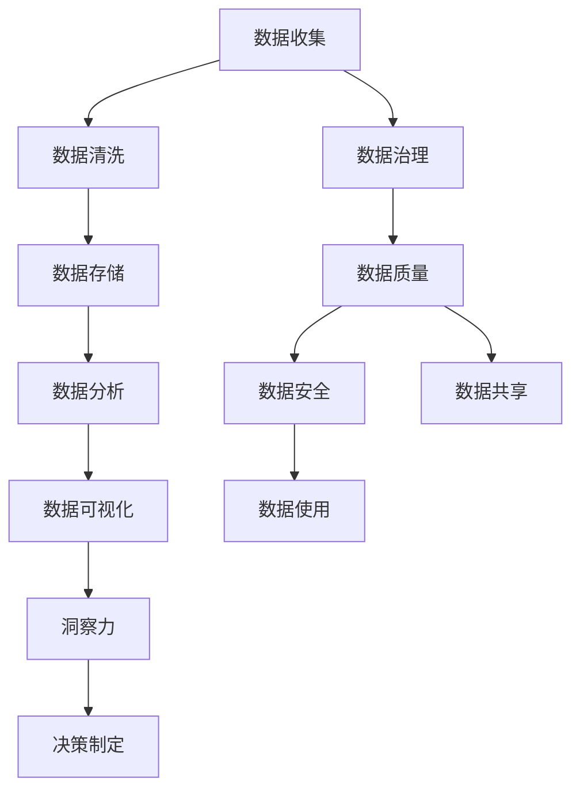

                 

# 洞察力与商业智能：数据驱动的决策制定

> 关键词：数据驱动, 商业智能(BI), 洞察力分析, 数据治理, 数据可视化, 机器学习

## 1. 背景介绍

在当今数字化时代的商业环境中，数据已成为企业最重要的资产之一。数据驱动的决策制定（Data-Driven Decision Making, D3M）已成为现代企业获得竞争优势的关键。商业智能（Business Intelligence, BI）系统通过挖掘、分析和展示数据，帮助企业管理者做出更加明智的决策。但如何有效地收集、存储、处理和利用数据，以实现数据驱动的洞察力（Data-Driven Insights），是一个复杂而重要的问题。本文将深入探讨数据驱动决策制定的核心概念、技术原理和实际应用，探讨如何通过商业智能技术，从海量数据中提炼出有价值的洞察力，驱动企业战略和运营决策。

## 2. 核心概念与联系

### 2.1 核心概念概述

商业智能（Business Intelligence, BI）是支持企业决策制定过程的一种技术和工具，旨在提供洞察力，帮助管理者从数据中获取有价值的见解。它通常包括数据仓库、数据挖掘、数据可视化、报表和分析工具等技术手段。

数据驱动决策（Data-Driven Decision Making, D3M）是指基于数据的决策制定过程。它涉及数据的收集、清洗、存储、分析和可视化，以支持决策者做出基于事实而非直觉的决策。

洞察力（Insight）是通过对数据进行分析后得到的深刻理解或新发现，能够揭示数据背后的模式、趋势和关联，从而支持决策者制定行动方案。

数据治理（Data Governance）是指确保数据质量、数据安全、数据共享和数据使用的过程和政策，是数据驱动决策的基础。

### 2.2 核心概念原理和架构的 Mermaid 流程图



此流程图展示了数据驱动决策制定的主要流程和相关概念：

1. **数据收集**：从不同来源收集数据，包括内部系统、第三方数据和公开数据。
2. **数据清洗**：处理数据中的噪音、错误和不一致性，确保数据的质量和可用性。
3. **数据存储**：将清洗后的数据存储在数据库中，供后续分析使用。
4. **数据分析**：使用统计分析、机器学习等技术对数据进行深入挖掘和分析。
5. **数据可视化**：通过图表、报表等形式将分析结果呈现出来，帮助决策者直观理解数据。
6. **数据治理**：确保数据质量、安全和共享，是数据驱动决策的基础。
7. **洞察力**：从数据中提取有价值的信息，支持决策制定。
8. **决策制定**：根据洞察力制定行动方案，指导企业的战略和运营决策。

这些概念共同构成了数据驱动决策制定的完整框架，帮助企业从数据中获取有价值的洞察力，以支持其商业决策。

## 3. 核心算法原理 & 具体操作步骤

### 3.1 算法原理概述

数据驱动决策制定的核心算法包括数据清洗、数据挖掘、机器学习和数据可视化等。这些算法通过复杂的数学模型和统计方法，从数据中提取洞察力，帮助管理者做出更加明智的决策。

- **数据清洗**：通过去除噪音、填补缺失值和处理异常值等技术，提升数据质量，为后续分析奠定基础。
- **数据挖掘**：利用聚类、分类、关联规则等算法，发现数据中的模式、趋势和关联。
- **机器学习**：使用监督学习、无监督学习和半监督学习等算法，从数据中学习知识，进行预测和分类。
- **数据可视化**：通过图表、报表等形式，将分析结果直观呈现，帮助决策者理解数据。

### 3.2 算法步骤详解

#### 3.2.1 数据收集与存储

1. **数据收集**：
    - 收集来自不同来源的数据，如ERP系统、CRM系统、社交媒体、传感器等。
    - 将数据整合到一个统一的平台中，便于后续处理和分析。

2. **数据存储**：
    - 选择合适的数据库技术，如关系型数据库、NoSQL数据库或数据湖。
    - 建立数据存储架构，确保数据的高效存储和访问。

#### 3.2.2 数据清洗与预处理

1. **数据清洗**：
    - 去除重复数据、噪音和异常值。
    - 处理缺失值，如均值填补、插值法等。

2. **数据预处理**：
    - 进行特征工程，选择、组合和转换特征，提升模型效果。
    - 进行数据标准化和归一化，确保模型输入的一致性。

#### 3.2.3 数据分析与建模

1. **数据挖掘**：
    - 使用聚类算法（如K-Means、层次聚类）对数据进行分组。
    - 使用分类算法（如决策树、随机森林、神经网络）对数据进行分类。

2. **机器学习**：
    - 使用监督学习算法（如线性回归、逻辑回归、支持向量机）进行预测。
    - 使用无监督学习算法（如主成分分析、独立成分分析）进行降维。

#### 3.2.4 数据可视化与洞察力提取

1. **数据可视化**：
    - 使用图表工具（如Tableau、Power BI、Matplotlib）将分析结果呈现出来。
    - 创建动态仪表盘和交互式报表，提供实时的数据洞察。

2. **洞察力提取**：
    - 从可视化结果中提取关键指标和趋势。
    - 分析数据背后的原因和关联，识别潜在的业务机会和风险。

### 3.3 算法优缺点

#### 3.3.1 优点

1. **提高决策效率**：数据驱动决策能够减少依赖直觉和经验的决策过程，提高决策效率。
2. **增强决策质量**：通过数据分析和机器学习，能够发现隐藏的模式和关联，提升决策质量。
3. **支持快速响应**：实时数据可视化使得决策者能够快速响应市场变化和业务需求。

#### 3.3.2 缺点

1. **数据质量问题**：数据清洗和预处理需要大量的资源和时间，数据质量问题可能导致分析结果偏差。
2. **算法复杂性**：数据挖掘和机器学习算法复杂，需要专业知识，可能存在模型解释困难的问题。
3. **技术依赖性**：数据驱动决策高度依赖于技术和工具，可能存在技术门槛和实现难度。

### 3.4 算法应用领域

数据驱动决策制定技术在多个领域中得到了广泛应用，包括但不限于：

1. **零售和电子商务**：通过分析消费者行为和购买历史，制定个性化营销策略，提升销售业绩。
2. **金融服务**：利用市场数据和交易记录，进行风险管理和投资决策，提升投资回报率。
3. **医疗保健**：通过患者数据和临床试验，支持医疗诊断和治疗决策，提升患者护理质量。
4. **制造业**：通过生产数据和供应链数据，优化生产流程和库存管理，提升生产效率。
5. **公共管理**：通过公共服务数据，制定政策和计划，提升公共服务质量和效率。

这些领域的数据驱动决策制定应用，展示了数据驱动技术在提升业务效率、优化运营和支持决策方面的强大潜力。

## 4. 数学模型和公式 & 详细讲解 & 举例说明

### 4.1 数学模型构建

#### 4.1.1 数据收集与清洗

1. **数据收集模型**：
    - 使用ETL（Extract, Transform, Load）技术，从不同数据源收集数据。
    - 使用ETL工具（如Talend、Informatica）自动化数据收集过程。

2. **数据清洗模型**：
    - 去除重复记录和噪音。
    - 使用数据清洗工具（如OpenRefine、Trifacta）进行数据清洗。

#### 4.1.2 数据存储与预处理

1. **数据存储模型**：
    - 使用关系型数据库（如MySQL、PostgreSQL）或NoSQL数据库（如Hadoop、Cassandra）存储数据。
    - 建立数据湖架构，存储和集成多种数据源。

2. **数据预处理模型**：
    - 进行特征工程，选择和转换特征。
    - 使用数据预处理工具（如Scikit-learn、Pandas）进行数据预处理。

#### 4.1.3 数据分析与建模

1. **数据挖掘模型**：
    - 使用聚类算法（如K-Means、层次聚类）进行分组。
    - 使用分类算法（如决策树、随机森林、神经网络）进行分类。

2. **机器学习模型**：
    - 使用监督学习算法（如线性回归、逻辑回归、支持向量机）进行预测。
    - 使用无监督学习算法（如主成分分析、独立成分分析）进行降维。

#### 4.1.4 数据可视化与洞察力提取

1. **数据可视化模型**：
    - 使用图表工具（如Tableau、Power BI、Matplotlib）进行数据可视化。
    - 创建动态仪表盘和交互式报表。

2. **洞察力提取模型**：
    - 从可视化结果中提取关键指标和趋势。
    - 分析数据背后的原因和关联。

### 4.2 公式推导过程

#### 4.2.1 数据清洗与预处理

1. **去重算法**：
    - 通过唯一标识符（如用户ID、订单ID）去重。
    - 公式：$D = \{d \in D | \nexists d' \in D, d \neq d' \wedge d.user_id = d'.user_id\}$

2. **填补缺失值算法**：
    - 使用均值填补、插值法等方法填补缺失值。
    - 公式：$\tilde{x_i} = \frac{\sum_{j \in N_i} x_j}{|N_i|}, \forall i$，其中$N_i$为$i$的邻居集合。

#### 4.2.2 数据分析与建模

1. **聚类算法**：
    - K-Means算法：
        - 公式：$K-Means = \arg\min_{K} \sum_{i=1}^n \min_{k \in K} ||x_i - \mu_k||^2$
    - 公式解释：最小化所有数据点到其所属簇中心的距离平方和。

2. **分类算法**：
    - 决策树算法：
        - 公式：$Decision Tree = \arg\min_{T} \sum_{i=1}^n \sum_{y_i \in Y} L(y_i, T(x_i))$
    - 公式解释：最小化分类错误的代价函数。

#### 4.2.3 数据可视化与洞察力提取

1. **散点图算法**：
    - 公式：$Scatter Plot(x, y) = (x_i, y_i), \forall i$
    - 公式解释：将数据点绘制在二维坐标系中。

2. **趋势线算法**：
    - 公式：$Trend Line = (x, y) = \arg\min_{\beta} \sum_{i=1}^n (y_i - \beta x_i)^2$
    - 公式解释：最小化趋势线的拟合误差。

### 4.3 案例分析与讲解

#### 4.3.1 零售业案例

1. **数据收集**：
    - 收集消费者购物记录、用户评价、社交媒体数据。

2. **数据清洗**：
    - 去除重复记录和噪音。
    - 填补缺失值，如均值填补。

3. **数据存储**：
    - 使用数据湖存储所有数据。
    - 建立数据仓库，进行数据整合。

4. **数据分析**：
    - 使用聚类算法对消费者进行分组。
    - 使用分类算法预测消费者购买行为。

5. **数据可视化**：
    - 创建消费者行为趋势图。
    - 创建个性化推荐报表。

6. **洞察力提取**：
    - 识别高价值消费者群体。
    - 分析消费者购买行为背后的原因。

#### 4.3.2 金融业案例

1. **数据收集**：
    - 收集市场数据、交易记录、客户信息。

2. **数据清洗**：
    - 去除重复记录和噪音。
    - 填补缺失值，如插值法。

3. **数据存储**：
    - 使用关系型数据库存储交易数据。
    - 建立数据仓库，进行数据整合。

4. **数据分析**：
    - 使用分类算法进行信用评估。
    - 使用机器学习算法预测股市趋势。

5. **数据可视化**：
    - 创建市场趋势图。
    - 创建风险管理仪表盘。

6. **洞察力提取**：
    - 识别高风险客户群体。
    - 分析股市趋势背后的因素。

## 5. 项目实践：代码实例和详细解释说明

### 5.1 开发环境搭建

#### 5.1.1 安装环境

1. **Python环境**：
    - 安装Python 3.8及以上版本。
    - 安装虚拟环境（如Venv）。

2. **依赖库安装**：
    - 安装Scikit-learn、Pandas、Matplotlib、Tableau、Power BI等库。

#### 5.1.2 数据准备

1. **数据集准备**：
    - 准备零售业和金融业的数据集。
    - 对数据进行清洗和预处理。

### 5.2 源代码详细实现

#### 5.2.1 数据收集与清洗

1. **数据读取**：
    - 使用Pandas库读取数据集。
    - 代码示例：
        ```python
        import pandas as pd

        data = pd.read_csv('retail_data.csv')
        ```

2. **数据清洗**：
    - 使用Pandas库进行数据清洗。
    - 代码示例：
        ```python
        data = data.drop_duplicates()
        data = data.fillna(method='ffill')
        ```

#### 5.2.2 数据存储与预处理

1. **数据存储**：
    - 使用Pandas库将数据存储到CSV文件中。
    - 代码示例：
        ```python
        data.to_csv('cleaned_data.csv', index=False)
        ```

2. **数据预处理**：
    - 使用Scikit-learn库进行特征工程。
    - 代码示例：
        ```python
        from sklearn.preprocessing import StandardScaler

        scaler = StandardScaler()
        data = scaler.fit_transform(data)
        ```

#### 5.2.3 数据分析与建模

1. **数据挖掘**：
    - 使用Scikit-learn库进行聚类。
    - 代码示例：
        ```python
        from sklearn.cluster import KMeans

        kmeans = KMeans(n_clusters=3)
        clusters = kmeans.fit_predict(data)
        ```

2. **机器学习**：
    - 使用Scikit-learn库进行分类。
    - 代码示例：
        ```python
        from sklearn.tree import DecisionTreeClassifier

        clf = DecisionTreeClassifier()
        clf.fit(data, labels)
        ```

#### 5.2.4 数据可视化与洞察力提取

1. **数据可视化**：
    - 使用Matplotlib库绘制散点图。
    - 代码示例：
        ```python
        import matplotlib.pyplot as plt

        plt.scatter(data[:, 0], data[:, 1])
        plt.show()
        ```

2. **洞察力提取**：
    - 从可视化结果中提取关键指标和趋势。
    - 分析数据背后的原因和关联。

### 5.3 代码解读与分析

#### 5.3.1 数据收集与清洗

- **代码解释**：
    - 使用Pandas库读取CSV文件。
    - 使用Pandas库进行去重和填补缺失值。
- **代码分析**：
    - 数据读取和清洗是数据处理的基础，需要确保数据的完整性和准确性。

#### 5.3.2 数据存储与预处理

- **代码解释**：
    - 使用Pandas库将数据存储到CSV文件中。
    - 使用Scikit-learn库进行特征工程和标准化处理。
- **代码分析**：
    - 数据存储和预处理是数据分析的必要步骤，能够提升数据质量和模型效果。

#### 5.3.3 数据分析与建模

- **代码解释**：
    - 使用Scikit-learn库进行聚类和分类。
- **代码分析**：
    - 数据分析与建模是数据驱动决策制定的核心环节，能够发现数据中的模式和关联。

#### 5.3.4 数据可视化与洞察力提取

- **代码解释**：
    - 使用Matplotlib库绘制散点图。
- **代码分析**：
    - 数据可视化是洞察力提取的重要工具，能够直观呈现分析结果。

### 5.4 运行结果展示

#### 5.4.1 零售业案例

1. **数据清洗结果**：
    - 去重和填补缺失值后的数据集。

2. **聚类结果**：
    - 消费者分组结果，每个分组代表一类消费者群体。

3. **分类结果**：
    - 预测消费者购买行为的分类结果。

#### 5.4.2 金融业案例

1. **数据清洗结果**：
    - 去重和填补缺失值后的数据集。

2. **分类结果**：
    - 信用评估的分类结果。

3. **预测结果**：
    - 股市趋势预测结果。

## 6. 实际应用场景

### 6.1 智能零售

智能零售通过数据分析和机器学习技术，提升销售效率和用户体验。例如，使用数据驱动的库存管理优化商品库存，通过个性化推荐系统提升用户体验，使用消费者行为分析进行市场预测和需求管理。

### 6.2 金融风控

金融风控通过数据分析和机器学习技术，进行风险管理和欺诈检测。例如，使用数据驱动的信用评估系统，预测客户的还款能力，使用异常检测算法识别潜在的欺诈行为。

### 6.3 医疗健康

医疗健康通过数据分析和机器学习技术，支持医疗诊断和治疗决策。例如，使用数据驱动的疾病预测系统，预测患者的病情变化，使用医学影像分析进行疾病诊断。

### 6.4 未来应用展望

未来，随着数据驱动决策制定技术的不断发展，其在各领域的应用将更加广泛和深入。大数据、人工智能和物联网技术的融合，将为数据驱动决策制定提供更丰富的数据来源和更强大的分析能力。数据驱动决策制定技术将成为企业实现数字化转型和智能化运营的核心工具。

## 7. 工具和资源推荐

### 7.1 学习资源推荐

1. **《Python数据科学手册》**：介绍Python在数据科学中的应用，涵盖数据收集、清洗、分析和可视化等技术。
2. **《R语言实战》**：介绍R语言在数据分析中的应用，涵盖数据处理、统计分析和可视化等技术。
3. **《商业智能分析与实现》**：介绍商业智能的基本概念、工具和实现方法，涵盖BI技术框架、数据治理和洞察力提取等技术。

### 7.2 开发工具推荐

1. **Pandas**：数据处理和分析工具，支持大规模数据集的处理。
2. **Scikit-learn**：机器学习库，提供各种分类、聚类和回归算法。
3. **Matplotlib**：数据可视化库，支持绘制各种类型的图表。
4. **Tableau**：商业智能工具，支持数据可视化和洞察力提取。
5. **Power BI**：商业智能工具，支持数据分析和报告生成。

### 7.3 相关论文推荐

1. **《数据驱动的决策制定：理论和实践》**：介绍数据驱动决策制定的理论基础和实践方法，涵盖数据治理、数据分析和洞察力提取等技术。
2. **《商业智能技术与应用》**：介绍商业智能的基本概念、工具和应用，涵盖BI技术框架、数据治理和洞察力提取等技术。
3. **《机器学习在商业智能中的应用》**：介绍机器学习技术在商业智能中的应用，涵盖数据挖掘、分类和预测等技术。

## 8. 总结：未来发展趋势与挑战

### 8.1 研究成果总结

数据驱动决策制定技术在各个领域中取得了显著的成效，提升企业决策的科学性和效率。通过数据分析和机器学习技术，能够从海量数据中提炼出有价值的洞察力，支持企业战略和运营决策。数据驱动决策制定技术已经成为现代企业实现数字化转型和智能化运营的重要工具。

### 8.2 未来发展趋势

1. **数据融合与多模态分析**：
    - 未来，数据驱动决策制定技术将更多地融合不同类型的数据源，如文本、图像、视频等，进行多模态分析，提升数据的丰富性和分析深度。
2. **实时数据处理与流式分析**：
    - 实时数据处理和流式分析技术的发展，将使得数据驱动决策制定技术能够处理实时数据，提供实时的洞察力支持。
3. **智能推荐系统**：
    - 基于数据驱动的个性化推荐系统将成为未来的重要应用方向，能够提升用户体验和业务效率。
4. **自动化决策系统**：
    - 自动化决策系统将利用数据驱动技术，实现无人值守的决策制定，提升决策的效率和准确性。
5. **数据治理与隐私保护**：
    - 数据治理和隐私保护技术的发展，将使得数据驱动决策制定技术更加安全可靠，符合法规要求。

### 8.3 面临的挑战

1. **数据质量与数据治理**：
    - 数据驱动决策制定技术高度依赖数据质量，需要建立完善的数据治理机制，确保数据的安全性和可用性。
2. **算法复杂性与模型可解释性**：
    - 数据驱动决策制定技术中的算法复杂性较高，模型解释性较差，需要进一步提升模型的可解释性和透明度。
3. **技术门槛与资源投入**：
    - 数据驱动决策制定技术需要专业知识和技术工具，存在一定的技术门槛和资源投入。
4. **隐私保护与数据安全**：
    - 数据驱动决策制定技术需要保护用户的隐私数据，避免数据泄露和安全问题。

### 8.4 研究展望

1. **数据治理与隐私保护技术**：
    - 未来需要进一步研究和应用数据治理和隐私保护技术，确保数据驱动决策制定技术的安全性和合规性。
2. **模型可解释性与透明度**：
    - 提升模型的可解释性和透明度，使得决策者能够理解和信任数据驱动决策。
3. **自动化决策与智能推荐**：
    - 研究自动化决策系统和智能推荐系统，提升决策的效率和准确性，优化用户体验和业务效果。
4. **多模态数据分析与实时处理**：
    - 发展多模态数据分析和实时处理技术，提升数据的丰富性和分析深度，实现实时的决策支持。

## 9. 附录：常见问题与解答

### Q1：数据驱动决策制定技术与传统决策制定方法有何不同？

**A1**：数据驱动决策制定技术通过数据分析和机器学习，从数据中提取洞察力，支持决策制定。相比传统依赖经验和直觉的决策制定方法，数据驱动决策制定技术能够提高决策效率和质量，减少人为错误和偏见。

### Q2：数据驱动决策制定技术如何处理数据质量问题？

**A2**：数据驱动决策制定技术通过数据清洗和预处理，提升数据质量。常用的数据清洗方法包括去重、填补缺失值、处理异常值等。数据预处理包括特征工程和数据标准化，提升模型效果。

### Q3：数据驱动决策制定技术在各领域的应用前景如何？

**A3**：数据驱动决策制定技术在零售、金融、医疗、制造等多个领域中已经取得了显著的成效，提升了决策效率和业务效果。未来，随着技术的发展，将在更多领域中得到应用，如智能推荐、自动化决策等。

### Q4：如何应对数据驱动决策制定技术面临的挑战？

**A4**：数据驱动决策制定技术面临的数据质量、算法复杂性、技术门槛、隐私保护等挑战，需要通过数据治理、模型可解释性、自动化决策、多模态数据分析等技术手段进行应对。

---

作者：禅与计算机程序设计艺术 / Zen and the Art of Computer Programming

