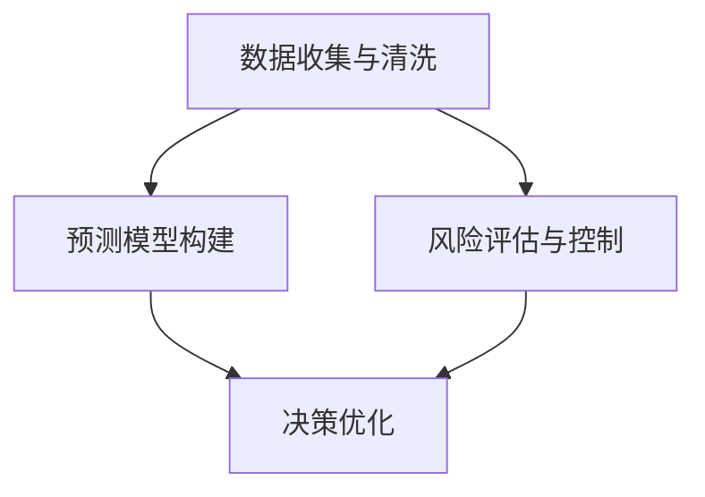

                 

# 洞察力与风险管理：预见与应对不确定性

> 关键词：洞察力,风险管理,不确定性,数据驱动决策,预测模型,统计分析,偏差校正,决策树,随机森林

## 1. 背景介绍

### 1.1 问题由来

在当今快速变化的商业环境中，企业需要不断地对市场动态、竞争对手行动、客户需求变化等进行实时监控和预测，以快速做出反应。然而，这些信息往往是动态且多变的，存在很大的不确定性和随机性。如何在数据驱动的决策过程中，既充分利用数据洞察力，又能有效管理风险，是当前企业决策分析领域的重要课题。

### 1.2 问题核心关键点

对于不确定性和风险管理的决策分析，核心在于如何通过数据洞察力，预测未来趋势，并在预测过程中考虑风险因素，进行决策优化。具体而言，关键点包括：

- **数据收集与清洗**：获取高质量的实时数据，并对其进行清洗和预处理，以确保分析的准确性。
- **预测模型构建**：利用机器学习和统计分析方法，构建能够预测未来趋势的模型。
- **风险评估与控制**：在预测过程中，考虑可能的风险因素，并进行适当的风险控制。
- **决策优化**：根据预测结果和风险评估，进行策略调整和优化，以实现最优的决策效果。

本文旨在深入探讨这些关键点，通过实际案例和工具推荐，提供实用的决策分析框架和方法。

## 2. 核心概念与联系

### 2.1 核心概念概述

为了更好地理解不确定性和风险管理，我们首先介绍几个核心概念：

- **洞察力（Insight）**：从数据中提取有价值的信息和知识，用于支持决策和预测。
- **不确定性（Uncertainty）**：预测和决策过程中，由于数据不完整、模型假设不准确等原因，导致的结果不可预知。
- **风险管理（Risk Management）**：通过识别、评估和管理风险，降低决策的不确定性和负面影响。
- **数据驱动决策（Data-Driven Decision Making）**：利用数据和分析方法，支持决策过程，提高决策的科学性和客观性。
- **预测模型（Predictive Model）**：基于历史数据和统计方法，构建能够预测未来事件的模型。
- **统计分析（Statistical Analysis）**：通过数据分析和统计方法，揭示数据中的模式和趋势。
- **偏差校正（Bias Correction）**：修正模型预测中的偏差，提高预测的准确性。

这些概念之间的逻辑关系可以通过以下Mermaid流程图来展示：



这个流程图展示了数据洞察力和不确定性管理的基本流程：

1. 从数据收集与清洗开始，获取高质量的数据。
2. 构建预测模型，基于数据进行未来趋势预测。
3. 在预测过程中，考虑风险因素，进行风险评估和控制。
4. 最终根据预测结果和风险评估，进行决策优化。

## 3. 核心算法原理 & 具体操作步骤

### 3.1 算法原理概述

基于洞察力和风险管理的数据驱动决策过程，核心在于构建能够准确预测未来趋势的预测模型，并在模型构建和应用过程中，考虑数据的不确定性和潜在风险。这一过程通常包括以下几个步骤：

1. **数据收集与清洗**：获取高质量的实时数据，并对其进行清洗和预处理。
2. **特征工程**：选择合适的特征，构建特征集合。
3. **预测模型构建**：基于历史数据，构建预测模型。
4. **风险评估与控制**：评估模型预测中的风险，进行适当的风险控制。
5. **决策优化**：根据预测结果和风险评估，进行策略调整和优化。

### 3.2 算法步骤详解

下面详细讲解这一过程的每一个步骤：

**Step 1: 数据收集与清洗**

- **数据来源**：数据通常来源于企业的业务系统、社交媒体、市场调研等，需要选择合适的数据源。
- **数据清洗**：数据可能存在缺失值、异常值、重复数据等问题，需要进行清洗和预处理，以确保数据的完整性和准确性。

**Step 2: 特征工程**

- **特征选择**：选择与预测目标相关的特征，构建特征集合。
- **特征提取**：利用技术手段，如PCA、特征工程等，提取特征集合中的关键信息。
- **特征转换**：对特征进行转换，如标准化、归一化、编码等，以提高模型的性能。

**Step 3: 预测模型构建**

- **模型选择**：选择合适的预测模型，如线性回归、决策树、随机森林等。
- **模型训练**：使用历史数据，训练预测模型，确保模型的准确性和泛化能力。
- **模型评估**：使用测试数据集评估模型的性能，选择最优模型。

**Step 4: 风险评估与控制**

- **风险识别**：识别模型预测中的潜在风险，如过拟合、偏差等。
- **风险评估**：评估风险的影响程度，确定风险等级。
- **风险控制**：采用技术手段，如偏差校正、正则化等，降低风险影响。

**Step 5: 决策优化**

- **策略调整**：根据预测结果和风险评估，调整决策策略。
- **优化方案**：制定优化方案，提高决策效果。
- **效果评估**：评估优化方案的效果，进行持续改进。

### 3.3 算法优缺点

基于洞察力和风险管理的数据驱动决策过程，具有以下优点：

- **客观性**：通过数据和分析方法，支持决策过程，提高决策的客观性和科学性。
- **可解释性**：利用模型和数据分析方法，揭示数据中的模式和趋势，便于理解和解释。
- **灵活性**：可以根据不同的数据和业务场景，灵活选择模型和分析方法。

同时，这一过程也存在以下缺点：

- **数据依赖**：数据质量的高低直接影响分析结果，高质量数据的获取和清洗可能耗时耗力。
- **模型复杂性**：复杂模型可能存在过拟合等问题，需要仔细选择和评估。
- **计算资源需求高**：大模型和大数据的分析可能需要大量的计算资源和时间。
- **风险管理难度**：识别和评估风险，进行适当的风险控制，需要专业知识和技术手段。

### 3.4 算法应用领域

基于洞察力和风险管理的数据驱动决策过程，在多个领域得到了广泛应用：

- **金融领域**：利用预测模型进行股票价格预测、信用风险评估、客户行为分析等。
- **市场营销**：通过分析客户行为数据，预测市场趋势，制定精准的营销策略。
- **供应链管理**：利用预测模型进行需求预测、库存管理、物流优化等。
- **医疗健康**：通过预测模型进行疾病预测、治疗效果评估、健康管理等。
- **智能制造**：利用预测模型进行设备维护、生产调度、质量控制等。

这些领域的应用展示了数据驱动决策过程的广泛性和实用性，为企业的决策分析提供了有力支持。

## 4. 数学模型和公式 & 详细讲解

### 4.1 数学模型构建

基于数据驱动决策的过程，我们可以构建一个综合性的数学模型，用于描述这一过程。假设企业的目标变量为 $Y$，历史数据集为 $D=\{(x_i, y_i)\}_{i=1}^N$，其中 $x_i$ 为特征向量，$y_i$ 为目标变量。我们的目标是构建一个预测模型 $M(x)$，用于预测未来目标变量的值。

### 4.2 公式推导过程

**线性回归模型**

线性回归是一种常见的预测模型，形式如下：

$$
y_i = \beta_0 + \sum_{j=1}^p \beta_j x_{ij} + \epsilon_i
$$

其中 $\beta_0, \beta_1, ..., \beta_p$ 为模型参数，$\epsilon_i$ 为随机误差项。

在模型构建过程中，我们需要通过最小二乘法或梯度下降法求解模型参数，使得模型在训练数据上的预测误差最小。

**决策树模型**

决策树是一种基于树结构的分类和回归模型。其构建过程如下：

1. 选择一个最优的特征，将数据集分成多个子集。
2. 对每个子集递归地应用上述过程，直到满足停止条件。

决策树模型的构建和评估需要使用如信息增益、基尼指数等指标。

**随机森林模型**

随机森林是一种集成学习方法，通过构建多个决策树进行预测。其构建过程如下：

1. 随机选择特征子集。
2. 随机选择数据子集。
3. 构建多个决策树，合并预测结果。

随机森林模型可以通过交叉验证、基尼指数等指标进行评估。

### 4.3 案例分析与讲解

**案例：股票价格预测**

假设某公司需要预测股票价格 $Y$ 在未来一天的变化情况。可以使用线性回归模型，以历史股价 $x_i$ 为自变量，构建预测模型：

$$
y_i = \beta_0 + \beta_1 x_{i1} + \beta_2 x_{i2} + \cdots + \beta_p x_{ip} + \epsilon_i
$$

其中 $x_{i1}, x_{i2}, ..., x_{ip}$ 为历史股价、成交量、市场情绪等特征。

使用历史数据 $D=\{(x_i, y_i)\}_{i=1}^N$，通过最小二乘法或梯度下降法求解模型参数 $\beta_0, \beta_1, ..., \beta_p$，得到预测模型 $M(x)$。

在预测未来一天的价格时，使用最新股价 $x_t$ 输入模型，得到预测结果 $\hat{y_t} = M(x_t)$。同时，评估模型预测中的风险，如过拟合、偏差等，进行适当的风险控制。

## 5. 项目实践：代码实例和详细解释说明

### 5.1 开发环境搭建

在进行项目实践前，我们需要准备好开发环境。以下是使用Python进行Scikit-learn和Pandas库开发的环境配置流程：

1. 安装Anaconda：从官网下载并安装Anaconda，用于创建独立的Python环境。

2. 创建并激活虚拟环境：
```bash
conda create -n myenv python=3.8 
conda activate myenv
```

3. 安装Scikit-learn和Pandas：
```bash
conda install scikit-learn pandas
```

4. 安装各类工具包：
```bash
pip install numpy matplotlib seaborn
```

完成上述步骤后，即可在`myenv`环境中开始项目实践。

### 5.2 源代码详细实现

下面以股票价格预测为例，给出使用Scikit-learn库进行线性回归模型开发的PyTorch代码实现。

首先，定义数据集和模型：

```python
import pandas as pd
from sklearn.linear_model import LinearRegression
from sklearn.model_selection import train_test_split
import numpy as np

# 读取数据集
data = pd.read_csv('stock_prices.csv')

# 定义自变量和目标变量
X = data[['open_price', 'high_price', 'low_price', 'volume']]
y = data['close_price']

# 划分训练集和测试集
X_train, X_test, y_train, y_test = train_test_split(X, y, test_size=0.2, random_state=42)

# 定义线性回归模型
model = LinearRegression()
```

接着，训练模型并进行预测：

```python
# 训练模型
model.fit(X_train, y_train)

# 预测测试集
y_pred = model.predict(X_test)

# 评估模型
mse = np.mean((y_pred - y_test)**2)
print(f"Mean Squared Error: {mse:.2f}")
```

最后，输出预测结果：

```python
# 获取最新股价
new_price = data.iloc[-1]['open_price']
print(f"预测的下一日股价为：{model.predict(new_price)}")
```

### 5.3 代码解读与分析

让我们再详细解读一下关键代码的实现细节：

**数据处理**

- `pd.read_csv`方法：从CSV文件中读取数据。
- `train_test_split`方法：将数据集划分为训练集和测试集，用于模型评估。

**模型训练**

- `LinearRegression`类：定义线性回归模型，使用Scikit-learn的线性回归算法。
- `fit`方法：使用训练集数据训练模型。

**模型预测**

- `predict`方法：使用训练好的模型对新数据进行预测。

**模型评估**

- `np.mean`方法：计算预测值与真实值之间的均方误差。

在实际应用中，还需要对模型进行偏差校正、正则化等风险控制，以确保模型预测的准确性和鲁棒性。

## 6. 实际应用场景

### 6.1 智能制造

在智能制造领域，预测模型可以用于设备维护、生产调度、质量控制等。通过预测设备故障时间，提前进行维护，避免生产中断。利用预测模型进行生产调度，优化生产流程，提高生产效率。通过预测产品质量问题，进行质量控制，减少废品率。

### 6.2 金融风控

在金融风控领域，预测模型可以用于信用风险评估、股票价格预测、市场情绪分析等。通过预测客户信用风险，制定合理的信贷政策，降低违约风险。利用预测模型进行股票价格预测，指导投资决策，减少投资损失。通过预测市场情绪，评估市场风险，进行风险控制。

### 6.3 医疗健康

在医疗健康领域，预测模型可以用于疾病预测、治疗效果评估、健康管理等。通过预测疾病发生风险，制定预防措施，减少疾病发生率。利用预测模型评估治疗效果，指导临床决策，提高治疗效果。通过预测健康状态，进行健康管理，提高生活质量。

### 6.4 未来应用展望

随着预测模型的不断发展，其在更多领域的应用前景将更加广阔。未来，我们可以预期以下趋势：

- **深度学习和大数据的应用**：深度学习和大数据技术将进一步提升预测模型的性能和精度。
- **多模态数据的融合**：利用多模态数据进行联合预测，提高预测的全面性和准确性。
- **实时预测与动态优化**：实时数据和动态优化算法，将使预测模型能够更好地适应变化的环境。
- **个性化预测**：利用机器学习技术，进行个性化预测，提高预测的针对性和效果。

## 7. 工具和资源推荐

### 7.1 学习资源推荐

为了帮助开发者系统掌握洞察力和风险管理的数据驱动决策理论基础和实践技巧，这里推荐一些优质的学习资源：

1. 《机器学习实战》系列书籍：深入浅出地介绍了机器学习算法及其应用，适合入门和进阶学习。

2. 《Python数据分析基础》课程：由数据科学家讲授的Python数据分析课程，涵盖数据清洗、数据可视化、统计分析等。

3. 《统计学习方法》书籍：统计学习领域的经典教材，详细介绍了各种统计分析方法和应用。

4. Scikit-learn官方文档：Scikit-learn库的官方文档，提供了丰富的机器学习算法和工具，适合深入学习。

5. Kaggle平台：数据科学竞赛平台，提供海量数据集和经典竞赛案例，适合实践和经验积累。

通过对这些资源的学习实践，相信你一定能够快速掌握洞察力和风险管理的数据驱动决策的精髓，并用于解决实际的决策分析问题。

### 7.2 开发工具推荐

高效的开发离不开优秀的工具支持。以下是几款用于数据驱动决策分析开发的常用工具：

1. Jupyter Notebook：用于数据探索和分析的交互式编程环境，支持Python、R等多种语言。

2. Python：数据科学领域的主流编程语言，具有强大的数据处理和分析能力。

3. R：数据科学领域的另一重要工具，适合统计分析和数据可视化。

4. Scikit-learn：基于Python的机器学习库，提供丰富的预测模型和算法。

5. TensorFlow：Google开发的深度学习框架，支持大规模数据处理和模型训练。

6. PyTorch：Facebook开发的深度学习框架，灵活性高，适合研究和实验。

合理利用这些工具，可以显著提升数据驱动决策分析的开发效率，加快创新迭代的步伐。

### 7.3 相关论文推荐

数据驱动决策分析领域的研究日益成熟，以下是几篇具有代表性的相关论文，推荐阅读：

1. 《大数据驱动的企业决策分析》：介绍如何利用大数据技术，进行企业决策分析。

2. 《机器学习在金融风控中的应用》：分析机器学习在金融风控领域的应用及其效果。

3. 《深度学习在医疗健康领域的应用》：探讨深度学习在医疗健康领域的应用及其前景。

4. 《数据驱动的智能制造》：研究数据驱动的智能制造技术及其应用。

这些论文代表了数据驱动决策分析领域的研究进展，通过学习这些前沿成果，可以帮助研究者把握学科前进方向，激发更多的创新灵感。

## 8. 总结：未来发展趋势与挑战

### 8.1 总结

本文对基于洞察力和风险管理的数据驱动决策过程进行了全面系统的介绍。首先阐述了数据洞察力和不确定性管理的研究背景和意义，明确了数据驱动决策在预测和决策优化中的核心作用。其次，从原理到实践，详细讲解了数据驱动决策的过程和每个关键步骤，给出了数据驱动决策的完整代码实例。同时，本文还广泛探讨了数据驱动决策在多个领域的应用前景，展示了数据驱动决策过程的广阔前景。最后，本文精选了数据驱动决策的学习资源和开发工具，力求为读者提供全方位的技术指引。

通过本文的系统梳理，可以看到，基于洞察力和风险管理的数据驱动决策过程，在预测和决策优化中具有不可替代的重要作用。这一过程不仅能够充分利用数据洞察力，还能有效管理风险，提升决策的科学性和客观性。未来，随着大数据和人工智能技术的不断进步，数据驱动决策将更加广泛地应用于企业决策分析中，成为决策支持的重要手段。

### 8.2 未来发展趋势

展望未来，数据驱动决策的趋势将呈现以下几个方面：

- **大数据与深度学习的应用**：大数据和深度学习技术的结合，将进一步提升预测模型的性能和精度。
- **多模态数据的融合**：利用多模态数据进行联合预测，提高预测的全面性和准确性。
- **实时预测与动态优化**：实时数据和动态优化算法，将使预测模型能够更好地适应变化的环境。
- **个性化预测**：利用机器学习技术，进行个性化预测，提高预测的针对性和效果。

### 8.3 面临的挑战

尽管数据驱动决策过程在预测和决策优化中具有显著优势，但在应用过程中，仍面临以下挑战：

- **数据质量问题**：数据质量的高低直接影响分析结果，高质量数据的获取和清洗可能耗时耗力。
- **模型复杂性**：复杂模型可能存在过拟合等问题，需要仔细选择和评估。
- **计算资源需求高**：大模型和大数据的分析可能需要大量的计算资源和时间。
- **风险管理难度**：识别和评估风险，进行适当的风险控制，需要专业知识和技术手段。

### 8.4 研究展望

未来的研究需要在以下几个方面寻求新的突破：

- **提高数据质量**：研究和开发高效的数据清洗和预处理方法，降低数据质量对分析结果的影响。
- **简化模型结构**：开发更加轻量级、实时性的预测模型，提高计算效率。
- **增强可解释性**：利用因果分析和博弈论工具，增强预测模型的可解释性。
- **引入伦理道德约束**：在模型训练目标中引入伦理导向的评估指标，过滤和惩罚有害的输出倾向。

这些研究方向的探索，将引领数据驱动决策过程走向更加科学、客观、安全的决策支持。

## 9. 附录：常见问题与解答

**Q1：如何选择合适的预测模型？**

A: 选择合适的预测模型需要考虑多个因素，包括数据类型、业务需求、模型复杂度等。一般来说，线性回归适用于线性关系明显的预测任务，决策树和随机森林适用于分类和回归任务，深度学习模型适用于复杂和多样化的预测任务。

**Q2：在数据驱动决策过程中，如何识别和评估风险？**

A: 风险识别和评估是数据驱动决策中的重要环节。可以通过以下方法进行风险管理：
1. 数据清洗和预处理，确保数据质量。
2. 模型选择和评估，选择合适的预测模型，并使用交叉验证等方法进行评估。
3. 风险识别和控制，识别模型预测中的潜在风险，如过拟合、偏差等，进行适当的风险控制。

**Q3：在数据驱动决策过程中，如何进行实时预测与动态优化？**

A: 实时预测与动态优化需要结合实时数据和动态优化算法进行。具体方法包括：
1. 使用流式数据处理技术，实时采集和处理数据。
2. 采用动态优化算法，如在线学习、增量学习等，实时更新模型。
3. 定期评估模型性能，进行策略调整和优化。

**Q4：在数据驱动决策过程中，如何增强预测模型的可解释性？**

A: 增强预测模型的可解释性可以通过以下方法进行：
1. 使用可解释性较高的模型，如线性回归、决策树等。
2. 利用因果分析和博弈论工具，揭示模型决策的关键特征。
3. 结合专家知识和业务理解，解释模型预测结果。

这些方法可以帮助企业更好地理解和解释预测模型的决策过程，提高决策的可信度和可控性。

**Q5：在数据驱动决策过程中，如何引入伦理道德约束？**

A: 引入伦理道德约束可以通过以下方法进行：
1. 在模型训练目标中引入伦理导向的评估指标，如公平性、透明性等。
2. 建立模型行为的监管机制，确保模型输出符合人类价值观和伦理道德。
3. 采用多模型集成和偏差校正等技术，降低模型偏见和有害输出。

通过这些方法，可以有效地引入伦理道德约束，确保数据驱动决策过程的公平、透明和安全性。

---

作者：禅与计算机程序设计艺术 / Zen and the Art of Computer Programming

