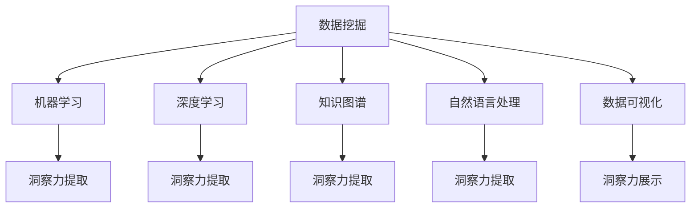

                 

# 洞察力：知识创新的灵感源泉

## 1. 背景介绍

### 1.1 问题由来
在信息爆炸的今天，数据无处不在，如何在海量数据中提取有价值的洞察力，是当今科研和商业竞争中的关键。从基因组学到金融分析，从市场营销到环境保护，洞察力在各行各业中扮演着越来越重要的角色。

### 1.2 问题核心关键点
洞察力（Insight）的提取，本质上是将数据转化为知识和行动的过程。其核心关键点包括：
- **数据质量与多样性**：高质量、多样化的数据是提取洞察力的基础。
- **分析方法和模型**：合适的分析方法和模型能够显著提升洞察力提取的效率和质量。
- **领域知识**：深入的领域知识有助于准确解读数据，避免误导性结论。
- **结果解释与沟通**：洞察力的价值在于其被理解和行动，有效的沟通和解释是洞察力发挥作用的最后一步。

### 1.3 问题研究意义
洞察力的提取和应用对于提升决策效率、优化业务流程、发现新知识等方面具有重要意义：

1. **决策支持**：高质量的洞察力能够支持更科学、更高效的决策，避免拍脑袋决策带来的损失。
2. **数据驱动**：洞察力驱动的数据分析可以发现隐藏的市场机会和潜在风险，指导业务战略的调整。
3. **知识创新**：洞察力是知识创新的源泉，能够带来新的科学发现和商业创新。
4. **过程优化**：洞察力可以揭示流程中的瓶颈和瑕疵，帮助企业优化业务流程，提升效率。
5. **风险管理**：洞察力有助于早期识别和应对潜在风险，降低损失。

## 2. 核心概念与联系

### 2.1 核心概念概述

为了更好地理解洞察力提取的过程和其核心概念，本节将介绍几个关键概念：

- **数据挖掘**：从大量数据中提取出有价值的信息和知识。
- **机器学习**：通过算法使计算机自动学习数据模式，以识别规律和异常。
- **深度学习**：一种特殊的机器学习方法，模拟人脑神经网络进行复杂特征提取和模式识别。
- **知识图谱**：以图形式存储和表达实体和关系的数据结构，有助于发现深层信息。
- **自然语言处理**：使计算机能够理解、处理和生成人类语言的技术。
- **数据可视化**：将复杂数据转换为直观的视觉图像，有助于洞察力的发现和沟通。

这些概念之间的逻辑关系可以通过以下Mermaid流程图来展示：



这个流程图展示了核心概念之间的相互关系：

1. 数据挖掘为机器学习和深度学习提供数据输入。
2. 机器学习和深度学习用于分析和提取数据中的洞察力。
3. 知识图谱和自然语言处理辅助理解和解释洞察力。
4. 数据可视化将洞察力展示给用户。

## 3. 核心算法原理 & 具体操作步骤

### 3.1 算法原理概述

洞察力的提取通常涉及数据处理、特征工程、模型训练、结果解释等多个步骤。其核心算法原理主要包括：

- **数据预处理**：清洗、归一化、标准化数据，以消除噪声和冗余。
- **特征提取**：将原始数据转换为模型可以理解的特征向量，是洞察力提取的关键。
- **模型训练**：使用机器学习或深度学习模型，训练出一个能够识别数据模式的模型。
- **结果解释**：将模型输出转化为易于理解和沟通的洞察力，以便决策和行动。

### 3.2 算法步骤详解

洞察力提取的算法步骤通常分为以下几个关键阶段：

**Step 1: 数据收集与预处理**
- 从多个数据源收集数据，确保数据的多样性和质量。
- 进行数据清洗，处理缺失值、异常值等噪声。
- 对数据进行归一化、标准化等预处理操作。

**Step 2: 特征工程**
- 选择或设计合适的特征，提取特征向量。
- 使用PCA、LDA等降维方法，减少特征维度。
- 采用特征选择技术，提取最具代表性和区分性的特征。

**Step 3: 模型选择与训练**
- 根据任务特点选择合适的机器学习或深度学习模型。
- 使用交叉验证等技术，调优模型超参数，避免过拟合。
- 对模型进行训练，使其能够准确识别数据模式。

**Step 4: 结果解释与验证**
- 对模型输出进行解释，转化为易于理解的洞察力。
- 使用可视化工具展示洞察力，如图表、报表等。
- 在验证集上评估模型性能，确保洞察力的准确性和可靠性。

**Step 5: 应用与优化**
- 将洞察力应用于实际业务，指导决策和行动。
- 持续收集新数据，优化模型和特征，提升洞察力的效果。

### 3.3 算法优缺点

洞察力提取的算法具有以下优点：
- **自动化**：通过算法自动化处理数据，减少人工干预。
- **高效性**：算法能够处理大规模数据，提升洞察力提取效率。
- **可解释性**：算法的可解释性有助于理解洞察力的来源和逻辑。
- **可扩展性**：算法框架可以方便地应用于多种任务和领域。

同时，该方法也存在一定的局限性：
- **数据依赖**：洞察力的提取高度依赖于数据质量，难以处理低质量或缺失数据。
- **模型假设**：算法模型的假设可能与实际数据分布不符，导致偏差。
- **结果解读**：复杂模型的输出难以直接解读，需要专业知识解释。
- **成本较高**：高质量的算法实现和数据处理需要较高的成本和技术门槛。

尽管存在这些局限性，但就目前而言，基于洞察力提取的算法方法仍是数据驱动决策的核心技术。未来相关研究的重点在于如何进一步降低算法对数据和模型的依赖，提高算法的可解释性和应用普适性。

### 3.4 算法应用领域

洞察力提取的算法已经广泛应用于多个领域，例如：

- **金融分析**：用于市场趋势预测、投资组合优化、信用风险评估等。
- **市场营销**：分析客户行为，制定精准营销策略，提升销售额。
- **医疗健康**：用于疾病诊断、药物发现、健康管理等。
- **供应链管理**：优化供应链流程，降低成本，提升效率。
- **环境保护**：监测环境变化，发现污染源，制定保护措施。
- **智能制造**：优化生产流程，提高产品质量，降低成本。
- **社交网络**：分析用户行为，提升用户体验，优化产品设计。

这些领域的应用展示了洞察力提取算法的多样性和广泛性，体现了其在各行各业中的重要价值。

## 4. 数学模型和公式 & 详细讲解 & 举例说明

### 4.1 数学模型构建

洞察力提取的数学模型通常包括以下几个关键部分：

- **输入数据**：原始数据集 $D = \{(x_i, y_i)\}_{i=1}^N$，其中 $x_i$ 为输入特征，$y_i$ 为标签。
- **损失函数**：用于衡量模型预测与真实标签之间的差异，常见如均方误差、交叉熵等。
- **优化目标**：最小化损失函数，找到最优的模型参数 $\theta$。
- **特征提取**：将原始数据转换为模型可以理解的特征向量 $x'_i$。

### 4.2 公式推导过程

以回归问题为例，推导最小二乘法（Least Squares Method）的公式。

假设模型为线性回归模型 $y_i = \theta_0 + \sum_{j=1}^p \theta_j x_{ij}$，其中 $\theta_0$ 为截距，$\theta_j$ 为特征系数。设样本 $(x_i, y_i)$ 的均值分别为 $\bar{x}$ 和 $\bar{y}$，则最小二乘法的损失函数为：

$$
\mathcal{L}(\theta) = \frac{1}{2N} \sum_{i=1}^N (y_i - \hat{y}_i)^2 = \frac{1}{2N} \sum_{i=1}^N (y_i - \theta_0 - \sum_{j=1}^p \theta_j x_{ij})^2
$$

其中 $\hat{y}_i = \theta_0 + \sum_{j=1}^p \theta_j x_{ij}$ 为模型预测值。

求导得到参数 $\theta$ 的梯度：

$$
\frac{\partial \mathcal{L}(\theta)}{\partial \theta_k} = -\frac{1}{N} \sum_{i=1}^N (y_i - \hat{y}_i) x_{ik}
$$

使用梯度下降算法更新参数：

$$
\theta_k \leftarrow \theta_k - \eta \frac{\partial \mathcal{L}(\theta)}{\partial \theta_k}
$$

其中 $\eta$ 为学习率。

通过迭代求解，最终得到最优参数 $\theta^*$。

### 4.3 案例分析与讲解

以金融分析中的股票价格预测为例，解释洞察力提取的具体过程。

**数据收集**：收集历史股票价格、公司财报、新闻等数据，构建股票价格预测模型。

**特征工程**：提取股价、成交量、市盈率等特征，进行归一化和PCA降维。

**模型选择**：使用线性回归或支持向量机等模型，构建股票价格预测模型。

**模型训练**：使用历史数据对模型进行训练，调优超参数，确保模型泛化能力。

**结果解释**：将模型输出转化为股票涨跌概率、价格区间等可操作的洞察力。

**应用与优化**：使用模型进行股票价格预测，优化投资组合，提升投资回报率。

## 5. 项目实践：代码实例和详细解释说明

### 5.1 开发环境搭建

在进行洞察力提取项目实践前，我们需要准备好开发环境。以下是使用Python进行机器学习开发的环境配置流程：

1. 安装Anaconda：从官网下载并安装Anaconda，用于创建独立的Python环境。

2. 创建并激活虚拟环境：
```bash
conda create -n ml-env python=3.8 
conda activate ml-env
```

3. 安装必要的Python包：
```bash
conda install numpy pandas scikit-learn matplotlib jupyter notebook
```

4. 安装机器学习库：
```bash
pip install scikit-learn pandas matplotlib seaborn jupyter
```

完成上述步骤后，即可在`ml-env`环境中开始项目开发。

### 5.2 源代码详细实现

这里我们以回归问题为例，给出使用Scikit-learn库进行线性回归模型训练的Python代码实现。

首先，定义数据处理函数：

```python
import pandas as pd
import numpy as np
from sklearn.model_selection import train_test_split
from sklearn.linear_model import LinearRegression
from sklearn.metrics import mean_squared_error, r2_score

def load_data(filename):
    data = pd.read_csv(filename)
    X = data.drop(['target'], axis=1).values
    y = data['target'].values
    return X, y

def train_model(X, y, test_size=0.2, random_state=42):
    X_train, X_test, y_train, y_test = train_test_split(X, y, test_size=test_size, random_state=random_state)
    model = LinearRegression()
    model.fit(X_train, y_train)
    y_pred = model.predict(X_test)
    mse = mean_squared_error(y_test, y_pred)
    r2 = r2_score(y_test, y_pred)
    return model, mse, r2

def evaluate_model(model, X_test, y_test):
    y_pred = model.predict(X_test)
    mse = mean_squared_error(y_test, y_pred)
    r2 = r2_score(y_test, y_pred)
    return mse, r2
```

然后，调用上述函数进行数据加载、模型训练和评估：

```python
X, y = load_data('data.csv')
model = train_model(X, y)
mse, r2 = evaluate_model(model, X_test, y_test)
print(f"Mean Squared Error: {mse:.2f}, R-squared: {r2:.2f}")
```

### 5.3 代码解读与分析

让我们再详细解读一下关键代码的实现细节：

**load_data函数**：
- 定义了数据加载函数，用于读取CSV文件中的数据，并分离特征和标签。

**train_model函数**：
- 定义了模型训练函数，使用train_test_split将数据集分为训练集和测试集。
- 使用LinearRegression模型进行训练，并返回模型、均方误差和决定系数。

**evaluate_model函数**：
- 定义了模型评估函数，计算均方误差和决定系数，并返回评估结果。

**主程序**：
- 调用load_data函数加载数据，调用train_model函数训练模型，并使用evaluate_model函数评估模型性能。
- 输出模型的均方误差和决定系数。

可以看到，通过Scikit-learn库，线性回归模型的实现变得简洁高效。开发者可以将更多精力放在数据处理、模型改进等高层逻辑上，而不必过多关注底层的实现细节。

当然，工业级的系统实现还需考虑更多因素，如模型的保存和部署、超参数的自动搜索、更灵活的特征工程等。但核心的洞察力提取范式基本与此类似。

## 6. 实际应用场景

### 6.1 金融风险管理

在金融领域，洞察力提取技术可以用于风险管理、信用评估、市场分析等。通过分析历史数据，洞察力提取模型可以预测贷款违约概率、股票价格变化等，帮助金融机构降低风险，提高决策准确性。

### 6.2 医疗诊断

医疗领域中的洞察力提取技术可以用于疾病预测、治疗方案优化、患者行为分析等。通过分析患者病历、基因数据等，洞察力提取模型可以预测疾病发展趋势，推荐最佳治疗方案，提升患者治愈率和生活质量。

### 6.3 市场营销

在市场营销中，洞察力提取技术可以用于消费者行为分析、产品推荐、广告优化等。通过分析用户行为数据，洞察力提取模型可以发现潜在客户需求，优化广告投放策略，提高销售转化率。

### 6.4 智能制造

在智能制造中，洞察力提取技术可以用于生产流程优化、设备维护预测、质量控制等。通过分析生产数据，洞察力提取模型可以识别生产中的瓶颈和异常，优化生产流程，提高产品质量和生产效率。

## 7. 工具和资源推荐

### 7.1 学习资源推荐

为了帮助开发者系统掌握洞察力提取的理论基础和实践技巧，这里推荐一些优质的学习资源：

1. **《机器学习实战》**：通过实践代码，深入浅出地介绍了机器学习的基本概念和算法。
2. **《深度学习》**：斯坦福大学吴恩达教授的课程，全面讲解深度学习的基本原理和应用。
3. **Kaggle**：数据科学竞赛平台，提供大量数据集和开源竞赛，可以锻炼实践能力。
4. **Coursera**：提供众多机器学习、深度学习、数据科学等课程，由各大名校和公司提供。
5. **GitHub**：代码托管平台，可以查阅和学习其他开发者提交的机器学习项目。

通过对这些资源的学习实践，相信你一定能够快速掌握洞察力提取的精髓，并用于解决实际的业务问题。

### 7.2 开发工具推荐

高效的开发离不开优秀的工具支持。以下是几款用于洞察力提取开发的常用工具：

1. **Python**：开源的高级编程语言，具备丰富的第三方库和框架，适用于多种机器学习任务。
2. **R语言**：统计分析和数据科学的专业工具，具有强大的数据处理和可视化能力。
3. **Jupyter Notebook**：交互式编程环境，支持Python、R等多种语言，适合快速迭代开发。
4. **Scikit-learn**：Python机器学习库，包含多种算法和工具，适用于数据挖掘和分析。
5. **TensorFlow**：谷歌开源的深度学习框架，支持分布式训练和部署，适用于大规模数据处理。

合理利用这些工具，可以显著提升洞察力提取任务的开发效率，加快创新迭代的步伐。

### 7.3 相关论文推荐

洞察力提取的研究源于学界的持续探索。以下是几篇奠基性的相关论文，推荐阅读：

1. **《机器学习》**：Tom Mitchell教授的著作，系统介绍了机器学习的基本理论和应用。
2. **《统计学习方法》**：李航教授的著作，介绍了多种常用的机器学习算法和应用。
3. **《深度学习》**：Goodfellow等人的著作，全面介绍了深度学习的基本原理和应用。
4. **《数据挖掘》**：Witten等人的著作，介绍了数据挖掘的基本概念和算法。
5. **《知识图谱构建与挖掘》**：Guo等人的著作，介绍了知识图谱的基本概念和构建方法。

这些论文代表了大数据挖掘和洞察力提取技术的发展脉络。通过学习这些前沿成果，可以帮助研究者把握学科前进方向，激发更多的创新灵感。

## 8. 总结：未来发展趋势与挑战

### 8.1 研究成果总结

通过本文的系统梳理，可以看到，洞察力提取技术在数据挖掘、机器学习、深度学习等多个领域取得了显著进展，广泛应用于金融、医疗、市场营销等多个行业。其核心算法包括数据预处理、特征工程、模型训练、结果解释等，具有自动化、高效性、可解释性等优点，但也存在数据依赖、模型假设等局限性。

### 8.2 未来发展趋势

展望未来，洞察力提取技术将呈现以下几个发展趋势：

1. **自动化和智能化**：通过引入人工智能技术，如神经网络和强化学习，提升洞察力提取的自动化和智能化水平。
2. **跨领域融合**：洞察力提取技术将与其他领域技术如自然语言处理、计算机视觉、物联网等进行更深入的融合，拓展应用边界。
3. **实时处理**：洞察力提取技术将向实时化方向发展，能够即时处理和分析数据，满足实时决策的需求。
4. **多模态数据融合**：将多模态数据进行整合和分析，提高洞察力提取的全面性和准确性。
5. **解释性增强**：通过可解释AI技术，增强洞察力提取结果的可解释性，提升决策透明度和可信度。
6. **隐私保护**：随着数据隐私保护意识的提升，洞察力提取技术将更加注重数据隐私保护，确保数据安全。

这些趋势展示了洞察力提取技术的广阔前景，未来的研究将在自动化、智能化、跨领域融合等方面取得新的突破。

### 8.3 面临的挑战

尽管洞察力提取技术已经取得了显著进展，但在迈向更加智能化、普适化应用的过程中，仍面临诸多挑战：

1. **数据质量**：高质量、多样化的数据是洞察力提取的基础，如何确保数据质量和完整性是一个重大挑战。
2. **模型泛化**：洞察力提取模型往往对特定数据集具有很强的依赖性，如何提升模型的泛化能力，使其在不同场景下表现稳定，是当前的重要研究方向。
3. **计算资源**：洞察力提取技术对计算资源的需求较高，如何优化算法和模型，降低计算复杂度，是实现大规模应用的必要条件。
4. **解释性不足**：复杂模型的输出往往难以直接解释，如何增强模型的可解释性，提高决策透明度，是提升用户信任的关键。
5. **隐私保护**：洞察力提取技术需要处理大量敏感数据，如何在保护隐私的前提下，实现数据的有效利用，是一个重要的伦理问题。
6. **模型鲁棒性**：面对噪声、异常数据等，如何提高模型的鲁棒性，确保在复杂环境下仍能准确提取洞察力，是一个重要的研究方向。

这些挑战需要通过持续的研究和创新来解决，以推动洞察力提取技术的不断进步。

### 8.4 研究展望

未来的研究需要在以下几个方面寻求新的突破：

1. **数据增强技术**：通过数据增强技术，提升数据的多样性和质量，缓解数据依赖问题。
2. **模型压缩技术**：通过模型压缩技术，降低计算复杂度，实现高效处理。
3. **跨模态数据融合**：将多模态数据进行整合和分析，提升洞察力提取的全面性和准确性。
4. **可解释AI技术**：通过可解释AI技术，增强模型的可解释性，提高决策透明度。
5. **隐私保护技术**：通过隐私保护技术，确保数据安全和隐私保护。
6. **强化学习技术**：通过强化学习技术，提升模型的自主学习能力和适应性。

这些研究方向将推动洞察力提取技术的不断进步，为构建更加智能、普适化的应用奠定基础。

## 9. 附录：常见问题与解答

**Q1：数据挖掘和机器学习有什么区别？**

A: 数据挖掘是使用算法从数据中自动提取有用信息的过程，强调发现知识和规律。而机器学习则是通过算法训练模型，用于预测和分类等任务，强调模型的构建和应用。两者既有联系又有区别，数据挖掘是机器学习的基础，机器学习则是数据挖掘的高级应用。

**Q2：如何选择适合的机器学习算法？**

A: 选择合适的机器学习算法需要考虑以下几个方面：
1. 数据类型：分类、回归、聚类等不同类型的数据适合不同的算法。
2. 数据量：大数据适合使用分布式算法，小数据适合使用单机算法。
3. 目标任务：根据任务需求选择不同的算法，如分类、回归、推荐等。
4. 模型复杂度：复杂模型往往能够获得更高的精度，但计算复杂度也更高，需要根据实际情况权衡。

**Q3：如何评估机器学习模型的性能？**

A: 评估机器学习模型通常使用以下几个指标：
1. 准确率（Accuracy）：模型正确预测的样本数占总样本数的比例。
2. 精确率（Precision）和召回率（Recall）：用于评估分类模型的性能，精确率表示正确预测为正类的样本数占所有预测为正类的样本数的比例，召回率表示正确预测为正类的样本数占所有真实为正类的样本数的比例。
3. F1分数（F1-score）：精确率和召回率的调和平均数，综合评估分类模型的性能。
4. R-squared（决定系数）：用于回归模型的性能评估，表示模型解释的方差比例。
5. ROC曲线和AUC值：用于评估二分类模型的性能，ROC曲线表示不同阈值下的真正率和假正率，AUC值表示ROC曲线下的面积，值越接近1表示模型性能越好。

**Q4：如何在实际应用中优化机器学习模型？**

A: 在实际应用中优化机器学习模型可以采取以下措施：
1. 数据清洗和预处理：消除噪声和异常值，提升数据质量。
2. 特征工程：选择和构造合适的特征，提升模型性能。
3. 模型调参：通过交叉验证等技术，调整模型超参数，避免过拟合。
4. 模型集成：使用集成学习技术，结合多个模型的输出，提升模型鲁棒性和泛化能力。
5. 模型压缩和加速：通过模型压缩和加速技术，优化计算资源使用，提升模型效率。
6. 数据增强和迁移学习：通过数据增强和迁移学习技术，提升模型对新数据的适应能力。

这些优化措施可以显著提升机器学习模型的性能，满足实际应用的需求。

**Q5：什么是知识图谱？**

A: 知识图谱是一种以图形式存储和表达实体和关系的数据结构。它由节点（实体）和边（关系）组成，用于描述实体之间的关系和属性。知识图谱在信息检索、推荐系统、知识发现等领域有广泛应用，能够帮助系统更好地理解和管理知识。

---

作者：禅与计算机程序设计艺术 / Zen and the Art of Computer Programming

