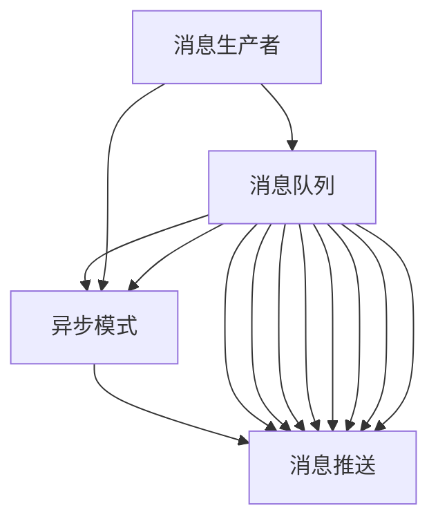

                 

## 1. 背景介绍

随着互联网和移动互联网的迅猛发展，异步通信、数据解耦、分布式系统架构等需求日益增多，消息队列技术也因此得到了广泛的应用。消息队列技术作为一种基于事件驱动架构的解决方案，能够有效地提升系统的可扩展性、可靠性和容错能力，已在大型互联网公司和金融机构的业务系统中得到广泛应用。Kafka和RabbitMQ是目前应用最广泛的两种开源消息队列技术，它们各自有着不同的优缺点和适用场景。本文将对Kafka和RabbitMQ进行深入比较，以帮助读者更好地理解和选择适合自己的消息队列技术。

## 2. 核心概念与联系

### 2.1 核心概念概述

- **消息队列(Message Queue)**：是一种异步通信机制，通过将消息从发送者发送至接收者，实现不同服务或系统之间的解耦合。消息队列常用于事件驱动架构，能够提高系统的弹性、可靠性、可扩展性。

- **Kafka**：是一个分布式、高吞吐量、高可靠性、强一致性的流处理平台，由Apache基金会开源，支持实时数据处理、分布式流处理、流式数据集成等。

- **RabbitMQ**：是一个开源的消息代理和消息队列服务器，支持多种消息协议，支持高级消息模式、事务处理、消息持久化等功能。

### 2.2 核心概念原理和架构的 Mermaid 流程图



## 3. 核心算法原理 & 具体操作步骤

### 3.1 算法原理概述

Kafka和RabbitMQ作为两种主流消息队列技术，它们的核心原理和操作流程大致相似，都遵循了“发布/订阅”模式的异步通信机制。以下是Kafka和RabbitMQ的核心算法原理概述：

- **Kafka**：Kafka采用发布/订阅模型，通过将消息从发送者发送到主题(topic)中，实现不同消费者对同一主题消息的异步消费。Kafka通过分区(partition)技术，将主题拆分为多个分区，提高系统的可扩展性和吞吐量。Kafka还支持事务处理、流式数据集成等高级功能。

- **RabbitMQ**：RabbitMQ也采用发布/订阅模型，支持多种消息协议，如AMQP、STOMP、MQTT等。RabbitMQ通过交换器(exchange)和队列(queue)来实现消息的路由和持久化。RabbitMQ还支持消息队列长度限制、消息重试、消息过滤、事务处理等多种高级功能。

### 3.2 算法步骤详解

#### 3.2.1 Kafka核心操作流程

1. **生产消息**：生产者通过Kafka的Producer API，将消息发送到指定的主题中。
2. **存储消息**：消息存储在Kafka的分区中，每个分区由一个或多个副本组成，以确保数据冗余和可靠性。
3. **分发消息**：Kafka通过分区的复制机制，确保消息在多个副本之间同步，提高系统的可靠性和可扩展性。
4. **消费消息**：消费者通过Kafka的Consumer API，从指定的分区中获取消息，实现异步消费。

#### 3.2.2 RabbitMQ核心操作流程

1. **发布消息**：生产者通过RabbitMQ的Producer API，将消息发送到指定的交换器(exchange)中。
2. **路由消息**：RabbitMQ根据交换器的规则，将消息路由到指定的队列(queue)中。
3. **持久化消息**：RabbitMQ将消息存储在队列中，支持多种持久化策略，以确保数据安全。
4. **消费消息**：消费者通过RabbitMQ的Consumer API，从指定的队列中获取消息，实现异步消费。

### 3.3 算法优缺点

#### 3.3.1 Kafka优缺点

**优点**：

- **高吞吐量**：Kafka设计之初就是为大规模数据流处理而生的，具有高吞吐量、低延迟的特点。
- **强一致性**：Kafka采用基于日志的分布式存储结构，保证数据的强一致性。
- **分布式架构**：Kafka采用分布式架构，支持多节点部署，具有高可用性和扩展性。
- **流处理**：Kafka支持流式数据处理，可以实时处理海量数据。

**缺点**：

- **复杂配置**：Kafka配置参数较多，需要一定的经验来设置。
- **延迟高**：Kafka在流处理过程中可能会出现一定的延迟。
- **消息丢失**：Kafka在网络异常时可能会出现消息丢失，需要配置适当的故障恢复机制。

#### 3.3.2 RabbitMQ优缺点

**优点**：

- **简单易用**：RabbitMQ使用简单，支持多种消息协议，易于上手。
- **稳定可靠**：RabbitMQ支持消息持久化、事务处理、消息路由等高级功能，保证数据的稳定性和可靠性。
- **灵活性高**：RabbitMQ支持多种消息队列模式，适用于不同的业务场景。

**缺点**：

- **吞吐量低**：RabbitMQ虽然稳定可靠，但在高并发场景下吞吐量较低。
- **延迟高**：RabbitMQ的延迟较高，无法满足实时处理海量数据的需求。
- **复杂性高**：RabbitMQ的配置和管理相对复杂，需要一定的经验。

### 3.4 算法应用领域

Kafka和RabbitMQ在实际应用中有着广泛的应用领域，以下是它们的主要应用场景：

#### 3.4.1 Kafka应用场景

- **数据流处理**：Kafka常用于大规模数据流处理，如日志收集、数据清洗、流式数据集成等。
- **分布式系统架构**：Kafka适用于分布式系统架构，能够实现不同服务之间的异步通信和消息队列管理。
- **实时数据处理**：Kafka支持实时数据处理，能够高效处理海量数据的流式计算和实时分析。

#### 3.4.2 RabbitMQ应用场景

- **消息队列**：RabbitMQ常用于消息队列场景，实现不同服务之间的异步通信和消息传递。
- **微服务架构**：RabbitMQ适用于微服务架构，能够实现不同微服务之间的解耦合和消息传递。
- **高可用性系统**：RabbitMQ支持高可用性系统架构，能够实现消息的冗余备份和故障恢复。

## 4. 数学模型和公式 & 详细讲解 & 举例说明

### 4.1 数学模型构建

- **Kafka模型**：Kafka的模型基于日志结构，每个消息被存储在一个分区中，分区由多个副本组成，每个副本都有独立的日志。Kafka的消息生产和消费都基于日志结构，确保数据的强一致性和可靠性。

- **RabbitMQ模型**：RabbitMQ的模型基于队列结构，每个队列由一个或多个消息组成，每个消息都有一个路由规则。RabbitMQ的消息生产、路由和消费都基于队列结构，确保消息的可靠性和持久化。

### 4.2 公式推导过程

- **Kafka公式**：
  $$
  S = \sum_{i=1}^n P_i \times C_i
  $$
  其中 $S$ 为Kafka的吞吐量，$P_i$ 为每个分区的吞吐量，$C_i$ 为每个分区的副本数。

- **RabbitMQ公式**：
  $$
  S = \sum_{i=1}^n P_i \times Q_i
  $$
  其中 $S$ 为RabbitMQ的吞吐量，$P_i$ 为每个队列的生产速率，$Q_i$ 为每个队列的消费速率。

### 4.3 案例分析与讲解

- **Kafka案例**：某电商公司使用Kafka处理订单数据，订单数据通过Kafka分发到多个消费者，实现异步处理和实时分析。Kafka的分区技术保证数据的高吞吐量和强一致性。

- **RabbitMQ案例**：某金融公司使用RabbitMQ处理交易数据，交易数据通过RabbitMQ路由到不同的队列中，实现异步通信和持久化。RabbitMQ的事务处理和消息路由功能保证数据的可靠性和稳定性。

## 5. 项目实践：代码实例和详细解释说明

### 5.1 开发环境搭建

在开发Kafka和RabbitMQ项目时，需要先搭建好开发环境。以下是具体的搭建流程：

- **Kafka环境搭建**：
  1. 安装Java开发环境。
  2. 下载Kafka安装包，解压后配置环境变量。
  3. 下载Zookeeper安装包，解压后启动服务。
  4. 启动Kafka服务。
  5. 通过Kafka命令行工具，测试生产、消费消息功能。

- **RabbitMQ环境搭建**：
  1. 安装Java开发环境。
  2. 下载RabbitMQ安装包，解压后配置环境变量。
  3. 启动RabbitMQ服务。
  4. 通过RabbitMQ管理界面，测试生产、消费消息功能。

### 5.2 源代码详细实现

以下是使用Java语言实现Kafka和RabbitMQ的基本示例代码：

- **Kafka示例代码**：

```java
public class KafkaProducerExample {
    public static void main(String[] args) {
        Properties props = new Properties();
        props.put("bootstrap.servers", "localhost:9092");
        props.put("key.serializer", "org.apache.kafka.common.serialization.StringSerializer");
        props.put("value.serializer", "org.apache.kafka.common.serialization.StringSerializer");
        
        KafkaProducer<String, String> producer = new KafkaProducer<>(props);
        for (int i = 0; i < 10; i++) {
            String message = "Message " + i;
            producer.send(new ProducerRecord<>("topic", message));
        }
        producer.close();
    }
}
```

- **RabbitMQ示例代码**：

```java
public class RabbitMQProducerExample {
    public static void main(String[] args) throws Exception {
        ConnectionFactory factory = new ConnectionFactory();
        factory.setHost("localhost");
        Connection connection = factory.newConnection();
        Channel channel = connection.createChannel();
        
        String queueName = "hello";
        channel.queueDeclare(queueName, false, false, false, null);
        
        for (int i = 0; i < 10; i++) {
            String message = "Hello " + i;
            channel.basicPublish("", queueName, null, message.getBytes());
        }
        
        channel.close();
        connection.close();
    }
}
```

### 5.3 代码解读与分析

- **Kafka示例代码解读**：
  1. 通过Properties对象设置Kafka服务器的地址和消息序列化方式。
  2. 创建KafkaProducer对象，并发送10条消息到指定主题。
  3. 关闭KafkaProducer对象。

- **RabbitMQ示例代码解读**：
  1. 通过ConnectionFactory对象设置RabbitMQ服务器的地址。
  2. 创建连接和通道，声明一个队列。
  3. 发送10条消息到指定队列。
  4. 关闭通道和连接。

### 5.4 运行结果展示

- **Kafka运行结果**：
  ```
  $ kafka-console-consumer.sh --bootstrap-server localhost:9092 --topic topic
  Message 0
  Message 1
  Message 2
  Message 3
  Message 4
  Message 5
  Message 6
  Message 7
  Message 8
  Message 9
  ```

- **RabbitMQ运行结果**：
  ```
  $ queue-declare -a
  hello
  hello
  ```

## 6. 实际应用场景

### 6.1 电商订单处理

某电商公司使用Kafka处理订单数据，订单数据通过Kafka分发到多个消费者，实现异步处理和实时分析。订单数据通过Kafka的分区技术保证数据的高吞吐量和强一致性，实现订单状态的实时更新和监控。

### 6.2 金融交易处理

某金融公司使用RabbitMQ处理交易数据，交易数据通过RabbitMQ路由到不同的队列中，实现异步通信和持久化。RabbitMQ的事务处理和消息路由功能保证数据的可靠性和稳定性，实现交易的实时处理和故障恢复。

### 6.3 媒体视频流处理

某视频流媒体公司使用Kafka处理视频流数据，视频流数据通过Kafka分发到多个消费者，实现异步处理和实时分析。Kafka的高吞吐量和低延迟特性，满足视频流处理的实时性需求，实现视频的实时编码、解码和分析。

### 6.4 未来应用展望

未来，消息队列技术将进一步发展和应用，Kafka和RabbitMQ都将迎来新的发展趋势：

- **Kafka未来趋势**：
  1. **流式数据处理**：Kafka将进一步提升流式数据处理的性能和可靠性，支持更复杂的数据流处理逻辑。
  2. **分布式事务**：Kafka将支持分布式事务，实现数据的一致性和可靠性。
  3. **安全性和隐私保护**：Kafka将加强数据安全和隐私保护措施，确保数据的安全性和合规性。

- **RabbitMQ未来趋势**：
  1. **高并发处理**：RabbitMQ将优化高并发处理能力，满足更多的业务场景需求。
  2. **微服务架构**：RabbitMQ将进一步支持微服务架构，实现不同微服务之间的异步通信和消息传递。
  3. **分布式部署**：RabbitMQ将支持分布式部署，提升系统的可用性和扩展性。

## 7. 工具和资源推荐

### 7.1 学习资源推荐

- **Kafka学习资源**：
  1. **官方文档**：Kafka的官方文档详细介绍了Kafka的使用方法和配置参数。
  2. **Kafka源码**：Kafka的源码可以在Github上下载，通过阅读源码，了解Kafka的内部机制和实现原理。
  3. **Kafka实战**：《Kafka实战》一书详细介绍了Kafka的使用和开发技巧，适合入门和进阶学习。

- **RabbitMQ学习资源**：
  1. **官方文档**：RabbitMQ的官方文档详细介绍了RabbitMQ的使用方法和配置参数。
  2. **RabbitMQ源码**：RabbitMQ的源码可以在Github上下载，通过阅读源码，了解RabbitMQ的内部机制和实现原理。
  3. **RabbitMQ实战**：《RabbitMQ实战》一书详细介绍了RabbitMQ的使用和开发技巧，适合入门和进阶学习。

### 7.2 开发工具推荐

- **Kafka开发工具**：
  1. **Kafka命令行工具**：Kafka命令行工具可以用于Kafka的生产、消费、监控等操作。
  2. **Kafka管理界面**：Kafka管理界面可以通过浏览器访问，实现Kafka的配置和管理。
  3. **Kafka生产者和消费者API**：Kafka生产者和消费者API可以用于Kafka的自定义开发。

- **RabbitMQ开发工具**：
  1. **RabbitMQ命令行工具**：RabbitMQ命令行工具可以用于RabbitMQ的生产、消费、监控等操作。
  2. **RabbitMQ管理界面**：RabbitMQ管理界面可以通过浏览器访问，实现RabbitMQ的配置和管理。
  3. **RabbitMQ生产者和消费者API**：RabbitMQ生产者和消费者API可以用于RabbitMQ的自定义开发。

### 7.3 相关论文推荐

- **Kafka相关论文**：
  1. "Kafka: Highly Scalable Streams Processing"：Kafka的学术论文详细介绍了Kafka的设计原理和实现机制。
  2. "Kafka Streams: Processing Streams in Apache Kafka"：Kafka Streams的学术论文详细介绍了Kafka流式处理框架的使用方法。

- **RabbitMQ相关论文**：
  1. "RabbitMQ: Scalable Message Broking for Private and Cloud Messaging"：RabbitMQ的学术论文详细介绍了RabbitMQ的设计原理和实现机制。
  2. "RabbitMQ in Action"：RabbitMQ的实战书籍详细介绍了RabbitMQ的使用和开发技巧，适合入门和进阶学习。

## 8. 总结：未来发展趋势与挑战

### 8.1 研究成果总结

本文对Kafka和RabbitMQ进行了深入比较，详细介绍了两种消息队列技术的核心概念、原理、操作步骤和应用场景。Kafka和RabbitMQ在实际应用中各有所长，Kafka适用于高吞吐量、分布式处理的场景，RabbitMQ适用于复杂消息路由、事务处理的场景。通过深入比较，本文希望能帮助读者更好地理解和选择适合自己的消息队列技术。

### 8.2 未来发展趋势

未来，消息队列技术将进一步发展和应用，Kafka和RabbitMQ都将迎来新的发展趋势：

- **Kafka未来趋势**：
  1. **流式数据处理**：Kafka将进一步提升流式数据处理的性能和可靠性，支持更复杂的数据流处理逻辑。
  2. **分布式事务**：Kafka将支持分布式事务，实现数据的一致性和可靠性。
  3. **安全性和隐私保护**：Kafka将加强数据安全和隐私保护措施，确保数据的安全性和合规性。

- **RabbitMQ未来趋势**：
  1. **高并发处理**：RabbitMQ将优化高并发处理能力，满足更多的业务场景需求。
  2. **微服务架构**：RabbitMQ将进一步支持微服务架构，实现不同微服务之间的异步通信和消息传递。
  3. **分布式部署**：RabbitMQ将支持分布式部署，提升系统的可用性和扩展性。

### 8.3 面临的挑战

尽管Kafka和RabbitMQ在实际应用中已经得到了广泛的应用，但在发展过程中仍然面临一些挑战：

- **性能瓶颈**：在处理海量数据和高并发场景时，Kafka和RabbitMQ可能会出现性能瓶颈，需要优化算法和架构。
- **安全性和隐私保护**：在数据安全和隐私保护方面，Kafka和RabbitMQ需要进一步加强技术手段和监管措施。
- **可扩展性和维护性**：在复杂场景下，Kafka和RabbitMQ的扩展性和维护性需要进一步提升，以应对系统规模的扩大。

### 8.4 研究展望

未来的研究需要在以下几个方面寻求新的突破：

- **性能优化**：通过算法优化和架构改进，进一步提升Kafka和RabbitMQ在高并发、大规模数据处理场景下的性能。
- **安全性增强**：在数据安全和隐私保护方面，引入更先进的加密技术和监管手段，确保数据的安全性和合规性。
- **扩展性和维护性提升**：通过优化系统架构和开发工具，提升Kafka和RabbitMQ的可扩展性和维护性，确保系统的稳定性和可靠性。

总之，Kafka和RabbitMQ作为两种主流消息队列技术，各有其优缺点和适用场景。未来的研究和应用需要不断地优化和改进，以满足不断变化的业务需求和技术挑战。通过本文的介绍和分析，希望能对Kafka和RabbitMQ的学习和应用提供参考和借鉴。

---

作者：禅与计算机程序设计艺术 / Zen and the Art of Computer Programming

